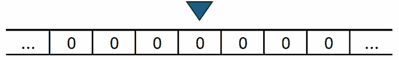
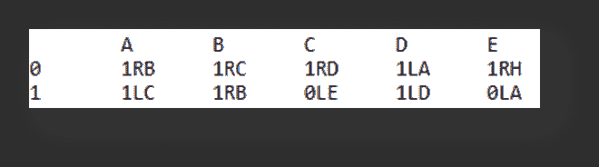
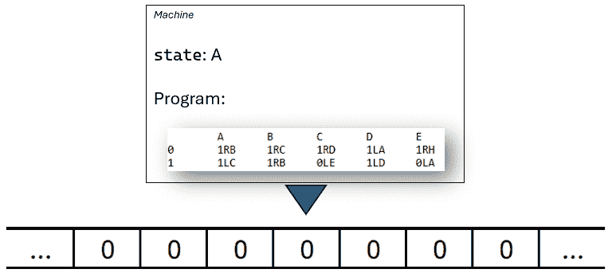
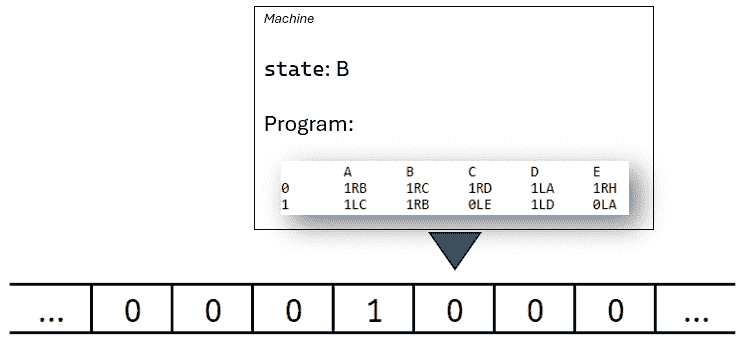
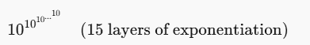

# 如何优化你的 Python 程序以实现缓慢

> 原文：[`towardsdatascience.com/how-to-optimize-your-python-program-for-slowness/`](https://towardsdatascience.com/how-to-optimize-your-python-program-for-slowness/)
> 
> 此外，还有：[关于本文的 PyData 会议演讲](https://www.youtube.com/watch?v=wSiF1Bm8f3s)。[本文的 Rust 版本。](https://medium.com/@carlmkadie/how-to-optimize-your-rust-program-for-slowness-eb2c1a64d184)

<mdspan datatext="el1744071663872" class="mdspan-comment">每个人</mdspan>都在谈论如何让 Python 程序更快 [[1](https://www.infoworld.com/article/3855600/making-python-faster-wont-be-easy-but-itll-be-worth-it.html), [2](https://medium.com/data-science/gpu-optional-python-be36a02b634d), [3](https://www.kdnuggets.com/2021/06/make-python-code-run-incredibly-fast.html)]，但如果我们追求相反的目标呢？让我们探索如何使它们变慢 — **极其慢**。在这个过程中，我们将检查计算的实质、内存的作用以及难以想象的巨大数字的规模。

我们的指导挑战：**编写运行时间异常长的简短 Python 程序。**

为了做到这一点，我们将探索一系列规则集 — 每个规则集都定义了我们允许编写的程序类型，通过在停止、内存和程序状态上施加约束。这个序列不是一个进步，而是一系列视角的转换。每个规则集都有助于揭示简单代码如何拉伸时间的不同方面。

#### **以下是我们将要调查的规则集：**

1.  **一切皆可** — 无限循环

1.  **必须停止，有限内存** — 嵌套，固定范围循环

1.  **无限，零初始化内存** — 5 状态图灵机

1.  **无限，零初始化内存** — 6 状态图灵机 (>10↑↑15 步)

1.  **无限，零初始化内存** — 纯 Python (不使用图灵机模拟计算 10↑↑15)

> 旁白：10↑↑15 不是一个打字错误或双指数。这是一个如此大的数字，以至于“指数”和“天文”都无法描述它。我们将在**规则集 4**中定义它。

我们从最宽容的规则集开始。从那里，我们将逐步改变规则，看看不同的约束如何塑造长期运行程序的外观 — 以及它们可以教会我们什么。

## 规则集 1：一切皆可 — 无限循环

我们从最宽容的规则开始：程序不需要停止，可以使用无限内存，并且可以包含任意代码。

如果我们的唯一目标是永远运行，解决方案是立即的：

```py
while True:
  pass
```

这个程序很短，使用的内存可以忽略不计，并且永远不会结束。它以最直接的方式满足挑战 — 通过永远什么也不做。

当然，这并不有趣 — 它什么也不做。但它为我们提供了一个基准：如果我们移除所有约束，无限运行时间是微不足道的。在下一个规则集中，我们将引入我们的第一个约束：**程序最终必须停止**。让我们看看在新的要求下，我们可以将运行时间拉伸多远 — 只使用**有限内存**。

## 规则集 2：必须停止，有限内存—嵌套，固定范围循环

如果我们想要一个比宇宙能够存活的时间还要长并且然后停止的程序，那很容易。只需编写两个嵌套循环，每个循环从 0 到 10¹⁰⁰−1 的固定范围内计数：

```py
for a in range(10**100):
  for b in range(10**100):
      if b % 10_000_000 == 0:
          print(f"{a:,}, {b:,}")
```

你可以看到这个程序在 10¹⁰⁰ × 10¹⁰⁰步后停止。那是 10²⁰⁰。而且—忽略打印—这个程序只使用很少的内存来保存其两个整数循环变量—只有 144 字节。

我的台式计算机以大约每秒 1400 万步的速度运行这个程序。但假设它能在[普朗克速度](https://en.wikipedia.org/wiki/Planck_units#Planck_time)（物理学中最小有意义的单位时间）下运行。那将是每年 10⁵⁰步—所以需要 10¹⁵⁰年才能完成。

当前的宇宙学模型估计[宇宙的热寂](https://en.wikipedia.org/wiki/List_of_dates_predicted_for_apocalyptic_events#Scientific_far_future_predictions)将在 10¹⁰⁰年后发生，因此我们的程序将运行大约 100,000,000,000,000,000,000,000,000,000,000,000,000,000,000,000,000 次，比宇宙预期的寿命长得多。

*旁白：关于在宇宙结束之后运行程序的实际担忧超出了本文的范围。*

为了增加一些余地，我们可以使用更多的内存。而不是为变量使用 144 字节，让我们使用 64 千兆字节—大约你会在一个设备齐全的个人计算机中找到的。这大约是 50 亿倍更多的内存，这使我们有了大约 10 亿个变量而不是 2 个。如果每个变量遍历完整的 10¹⁰⁰范围，总步数就大约是 10¹⁰⁰^(10⁹)，或者说大约是 10^(100 亿)步。在普朗克速度下—大约每年 10⁵⁰步—这相当于 10^(100 亿 - 50)年的计算时间。

* * *

我们能做得更好吗？嗯，如果我们允许一个不切实际但有趣的规则变化，我们可以做得好得多。

## 规则集 3：无限、零初始化内存—5 状态图灵机

如果我们允许无限内存—只要它一开始完全是零呢？

> **旁白：**为什么我们不允许无限、任意初始化的内存？因为这将使挑战变得微不足道。例如，你可以在内存的某个位置标记一个字节，比如在 10¹²⁰位置，用`0x01`—比如说，写一个微小的程序，它只是扫描直到找到它。这个程序将运行得非常慢—但那并不有趣。这种缓慢是数据中固有的，而不是代码中固有的。我们追求的是更深层次的东西：小的程序，它们可以从简单的、均匀的起始条件生成自己的长时间运行。

我第一个想法是使用内存来以二进制形式向上计数：

```py
0
1
10
11
100
101
110
111
...
```

我们可以做到这一点—但我们怎么知道何时停止？如果我们不停下来，我们就违反了“必须停止”的规则。那么，我们还能尝试什么？

让我们从计算机科学的鼻祖[**艾伦·图灵**](https://en.wikipedia.org/wiki/Alan_Turing)那里汲取灵感。我们将在以下约束下编写一个简单的抽象机器—现在被称为**图灵机**：

+   机器有**无限内存**，以磁带的形式无限延伸。磁带上的每个**单元**存储一个比特：0 或 1。

+   一个读写头在磁带上移动。在每一步中，它**读取**当前的比特，**写入**一个新的比特（0 或 1），并**向左或向右**移动一个单元。



一个读写头位于无限磁带上。

+   机器还有一个名为**状态**的内部变量，它可以存储*n*个值之一。例如，有 5 个状态时，我们可能将可能的值命名为 A、B、C、D 和 E——加上一个特殊的停止状态 H，我们不将其计入五个状态之中。机器始终从第一个状态 A 开始。

我们可以将完整的图灵机程序表示为转换表。以下是一个我们将逐步讲解的示例。



一个 5 状态图灵机转换表。

+   每一**行**对应于当前的**磁带值**（0 或 1）。

+   每一**列**对应于当前的**状态**（A 到 E）。

+   表中的每一项都告诉机器下一步该做什么：

    +   **第一个字符**是要写入的**比特**（0 或 1）

    +   **第二个**是移动的方向（L 为左，R 为右）

    +   **第三个**是**要进入的下一个状态**（A、B、C、D、E 或 H，其中 H 是特殊的停止状态）。

现在我们已经定义了机器，让我们看看它在时间上的表现。

我们将把每个时间点——机器和磁带的完整配置——称为一个**步骤**。这包括当前的磁带内容、头位置和机器的内部状态（如 A、B 或 H）。

下面是**步骤 0**。头指向磁带上的 0，机器处于**状态**A。

在程序表的**行 0，列 A**中查看，我们发现指令 1RB。这意味着：

+   将 1 写入当前的磁带单元。

+   将头**向右移动**。

+   进入**状态**B。

**步骤 0**：



这使我们处于**步骤 1**：



机器现在处于**状态**B，指向下一个磁带单元（再次是 0）。

如果我们让这个图灵机继续运行会发生什么？它将运行恰好**47,176,870 步**——然后停止。

> 旁白：通过 Google 登录，您可以通过[Google Colab 上的 Python 笔记本](https://github.com/CarlKCarlK/busy_beaver_blaze/blob/main/notebooks/turing_machines.ipynb)自行运行。或者，您可以通过[从 GitHub 下载](https://github.com/CarlKCarlK/busy_beaver_blaze/blob/main/notebooks/turing_machines.ipynb)并在自己的计算机上本地复制和运行笔记本。

那个数字 47,176,870 本身就很令人惊讶，但看到完整的运行过程使其更加具体。我们可以使用**时空图**来可视化执行，其中每一行显示磁带在单个步骤中的状态，从上（最早）到下（最新）。在图像中：

+   第一行是空的——它显示了机器第一步之前的全零磁带。

+   1s 以**橙色**显示。

+   0s 以**白色**显示。

+   **浅橙色**出现在 0s 和 1s 如此接近以至于它们混合在一起的地方。


冠军 5 状态图灵机的时空图。它在运行了 47,176,870 步后停止。每一行显示单步的带子，从顶部开始。橙色代表 1，白色代表 0。

到 2023 年，一个通过[**bbchallenge.org**](https://bbchallenge.org)组织的在线业余研究人员小组证明了这是[**最长运行的 5 状态图灵机**](https://www.quantamagazine.org/amateur-mathematicians-find-fifth-busy-beaver-turing-machine-20240702/)，最终会停止。

* * *

想要看这个图灵机在运动中的样子吗？您可以在这个**像素完美的视频**中观看完整的 4700 万步执行过程展开：

或者直接使用[**Busy Beaver Blaze**](https://carlkcarlk.github.io/busy_beaver_blaze/v0.2.5/index.html#program=bb5&run=true)网络应用程序与之交互。

视频生成器和网络应用程序是[busy-beaver-blaze](https://github.com/CarlKCarlK/busy_beaver_blaze/)的一部分，这是一个开源的 Python & Rust 项目，与本文相伴。

* * *

很难相信这样一个小的机器可以运行**4700 万步**并仍然停止。但更令人惊讶的是：[bbchallenge.org](http://bbchallenge.org)团队发现了一个**6 状态机**，其运行时间如此之长，以至于无法用普通指数表示。

## 规则集 4：无限，零初始化内存——6 状态图灵机（>10↑↑15 步）

到本文写作时，人类已知的最长运行（但仍然停止）的 6 状态图灵机是：

```py
A   B   C   D   E   F
0   1RB 1RC 1LC 0LE 1LF 0RC
1   0LD 0RF 1LA 1RH 0RB 0RE
```

这里有一个视频展示了它的**前 10 万亿步**：

您可以在这里[通过网络应用程序交互运行它](https://carlkcarlk.github.io/busy_beaver_blaze/v0.2.5/index.html#run=true)。

因此，如果我们有耐心——滑稽地有耐心——这个图灵机将运行多长时间？超过 10↑↑15，其中“10 ↑↑ 15”表示：



这与 10¹⁵（只是一个常规指数）不同。相反：

+   10¹ = 10

+   10¹⁰ = 10,000,000,000

+   10¹⁰¹⁰ 是 10¹⁰⁰⁰⁰⁰⁰⁰⁰⁰⁰，已经难以想象。

+   10↑↑4 如此之大，以至于它远远超过了可观测宇宙中的原子数量。

+   10↑↑15 如此之大，以至于用指数表示法写它变得令人厌烦。

Pavel Kropitz 于 2022 年 5 月 30 日宣布了这个 6 状态机。Shawn Ligocki 在[一篇优秀的文章](https://www.sligocki.com/2022/06/21/bb-6-2-t15.html)中解释了他和 Pavel 的发现。为了证明这些机器运行如此长时间然后停止，研究人员使用了一组分析和自动化工具。他们不是模拟每一步，而是识别出可以证明的重复结构和模式——使用正式的、机器验证的证明——最终导致停止。

* * *

到目前为止，我们一直在谈论图灵机——特别是已知的最长 5 状态和 6 状态的机器，它们最终会停止。我们运行了 5 状态的冠军直到完成，并观察可视化来探索其行为。但发现它是具有 5 状态的最长停止机器——以及识别出 6 状态的竞争者——来自于广泛的研究和形式证明，而不是逐步运行它们。

话虽如此，我在 Python 中构建的图灵机解释器可以运行数百万步，用 Rust 编写的可视化器可以处理万亿步（见 [GitHub](https://github.com/CarlKCarlK/busy_beaver_blaze)）。但即使 **10 万亿步**与 6 状态机的完整运行时间相比，也只是一滴海水中的原子。而且运行到那么远并不能让我们更接近理解**为什么**它会运行那么长时间。

> **旁白**：Python 和 Rust “**解释**”了图灵机到一定程度——读取它们的转换表并逐步应用规则。你也可以说它们“**模拟**”了它们，因为它们精确地重现了它们的行为。我避免使用“**模拟**”这个词：一个模拟的象不是象，但一个模拟的计算机是计算机。

**回到我们的核心挑战**：我们想了解是什么让一个简短的程序运行很长时间。而不是分析这些图灵机，让我们构建一个 Python 程序，其 10↑↑15 的运行时间**设计上清晰**。

## 规则集 5：无限，零初始化内存——纯 Python（计算 10↑↑15 而不使用图灵机模拟）

我们的挑战是编写一个至少运行 10↑↑15 步的简单 Python 程序，使用任何数量的零初始化内存。

为了实现这一点，我们将以保证程序至少运行那么多步的方式来计算 10↑↑15 的值。↑↑ 运算符称为**叠乘法**——回想一下规则集 4 中↑↑ 是堆叠指数的：例如，10↑↑3 表示 10^(10¹⁰)。它是一个增长非常快的函数。我们将从头开始编写它。

而不是依赖内置运算符，我们将从第一原理定义叠乘法：

+   **叠乘法**，通过函数 `tetrate` 实现，即重复的**指数运算**

+   **指数运算**，通过 `exponentiate` 实现，即重复的**乘法**

+   **乘法**，通过 `multiply` 实现，即重复的**加法**

+   **加法**，通过 `add` 实现，即重复的**递增**

每一层都建立在下一层的基础上，仅使用零初始化内存和就地更新。

我们将从基础开始——使用所有操作中最简单的：递增。

### 递增

这是我们的递增定义及其使用示例：

```py
from gmpy2 import xmpz

def increment(acc_increment):
  assert is_valid_accumulator(acc_increment), "not a valid accumulator"
  acc_increment += 1

def is_valid_accumulator(acc):
  return isinstance(acc, xmpz) and acc >= 0  

b = xmpz(4)
print(f"++{b} = ", end="")
increment(b)
print(b)
assert b == 5
```

输出：

```py
++4 = 5
```

我们使用 `xmpz`，这是由 `gmpy2` 库提供的可变任意精度整数类型。在数值范围方面，它类似于 Python 的内置 `int` 类型——仅受内存限制，但与 `int` 不同，它支持就地更新。

为了保持图灵机的精神，并保持逻辑最小化和可观察性，我们限制自己只使用几个操作：

+   创建一个值为 0 的整数 (`xmpz(0)`)

+   在原地增加 (`+= 1`) 和减少 (`-= 1`)

+   与零比较

所有算术都是在原地进行的，没有复制和临时值。我们计算链中的每个函数都直接修改累加器。大多数函数还接受一个输入值 `a`，但作为最基础的 `increment` 不接受。我们使用描述性的名称如 `increment_acc`、`add_acc` 等来使操作清晰，并支持后续函数，其中将出现多个累加器。

> **旁注：**为什么不使用 Python 的内置 `int` 类型？它支持任意精度，可以增长到你的内存允许的大小。但它也是**不可变**的，这意味着任何更新如 `+= 1` 都会创建一个新的整数对象。即使你认为你正在原地修改一个大数字，Python 实际上正在复制其所有内部内存——无论它有多大。
> 
> *例如：*

```py
x = 10**100
y = x
x += 1
assert x == 10**100 + 1 and y == 10**100
```

> 即使 `x` 和 `y` 初始时相同，`x += 1` 会创建一个新的对象——而 `y` 保持不变。这种行为对于小数字来说是好的，但它违反了我们关于内存使用和在原地更新的规则。这就是为什么我们使用 `gmpy2.xmpz`，这是一个**可变**的任意精度整数，它真正支持高效的在原地更改。

### 加法

定义了增加后，我们接下来定义加法为重复增加。

```py
def add(a, add_acc):
  assert is_valid_other(a), "not a valid other"
  assert is_valid_accumulator(add_acc), "not a valid accumulator"
  for _ in range(a):
      add_acc += 1

def is_valid_other(a):
  return isinstance(a, int) and a >= 0      

a = 2
b = xmpz(4)
print(f"Before: id(b) = {id(b)}")
print(f"{a} + {b} = ", end="")
add(a, b)
print(b)
print(f"After:  id(b) = {id(b)}")  # ← compare object IDs
assert b == 6
```

输出：

```py
Before: id(b) = 2082778466064
2 + 4 = 6
After:  id(b) = 2082778466064
```

该函数通过每次增加 `add_acc` 一步，重复 `a` 次来将 `a` 加到 `add_acc` 上。前后 id 相同，表明**没有创建新的对象——`add_acc` 真正地在原地更新**。

> **旁注：**你可能想知道为什么 `add` 不直接调用我们的 `increment` 函数。我们可以那样写——但我们故意手动内联每个级别。这使所有循环都可见，使控制流明确，并帮助我们精确地推理每个函数执行的工作量。

即使 `gmpy2.xmpz` 支持直接加法，我们也不使用它。我们正在最原始的级别上工作——通过 1 来增加，以保持逻辑简单、故意慢，并使工作量明确。

与 `increment_acc` 一样，我们原地更新 `add_acc`，没有复制或临时值。我们使用的唯一操作是 `+= 1`，重复 `a` 次。

接下来，我们定义**乘法**。

### 乘法

在加法就绪后，我们现在可以定义乘法为重复加法。以下是函数和示例用法。与 `add` 和 `increment` 不同，这个函数从零开始构建一个新的 `xmpz` 值并返回它。

```py
def multiply(a, multiply_acc):
  assert is_valid_other(a), "not a valid other"
  assert is_valid_accumulator(multiply_acc), "not a valid accumulator"

  add_acc = xmpz(0)
  for _ in count_down(multiply_acc):
      for _ in range(a):
          add_acc += 1
  return add_acc

def count_down(acc):
  assert is_valid_accumulator(acc), "not a valid accumulator"
  while acc > 0:
      acc -= 1
      yield

a = 2
b = xmpz(4)
print(f"{a} * {b} = ", end="")
c = multiply(a, b)
print(c)
assert c == 8
assert b == 0
```

输出：

```py
2 * 4 = 8
```

这会将 `a` 乘以 `multiply_acc` 的值，通过每次将 `a` 加到 `add_acc` 上，直到 `multiply_acc` 可以减少为止。结果被返回，然后赋值给 `c`。原始的 `multiply_acc` 被减少到零并在过程中消耗。

你可能想知道这一行做了什么：

```py
for _ in count_down(multiply_acc):
```

虽然`xmpz`在技术上可以使用`range()`，但这样做会将它转换为标准的 Python `int`，它是不可变的。这会触发其内部内存的完整复制——对于大值来说这是一个昂贵的操作。更糟糕的是，每次递减步骤都会涉及分配一个新的整数并复制所有之前的位，所以原本应该是线性循环的操作最终变成了**二次总工作量**。我们的自定义`count_down()`通过就地递减避免了所有这些，它在不复制的情况下交出控制权，并保持可预测的内存使用。

我们已经从重复加法构建了乘法。现在，是时候再进一步：**指数运算**。

### 指数运算

我们将指数运算定义为重复乘法。像之前一样，我们仅使用递增、递减和原地内存执行所有工作。与乘法一样，最终结果在消耗输入累加器时返回。

这里是函数和示例用法：

```py
def exponentiate(a, exponentiate_acc):
  assert is_valid_other(a), "not a valid other"
  assert is_valid_accumulator(exponentiate_acc), "not a valid accumulator"
  assert a > 0 or exponentiate_acc != 0, "0⁰ is undefined"

  multiply_acc = xmpz(0)
  multiply_acc += 1
  for _ in count_down(exponentiate_acc):
      add_acc = xmpz(0)
      for _ in count_down(multiply_acc):
          for _ in range(a):
              add_acc += 1
      multiply_acc = add_acc
  return multiply_acc

a = 2
b = xmpz(4)
print(f"{a}^{b} = ", end="")
c = exponentiate(a, b)
print(c)
assert c == 16
assert b == 0
```

输出：

```py
2⁴ = 16
```

这将`a`的`exponentiate_acc`次幂计算出来，仅使用递增、递减和循环控制。我们通过单次递增将`multiply_acc`初始化为 1——因为反复从零开始乘法将使我们一无所获。然后，对于每次`exponentiate_acc`可以递减的情况，我们将当前结果（`multiply_acc`）乘以`a`。与前面的层一样，我们直接内联乘法逻辑，而不是调用乘法函数——这样控制流和步骤计数就完全可见。

> **旁注：**`+= 1`被调用多少次？显然至少是 2⁴次——因为我们的结果是 2⁴，我们通过从零递增达到它。更精确地说，递增的次数是：
> 
> • 1 次递增——初始化`multiply_acc`为 1
> 
> 然后我们循环四次，在每次循环中，我们使用重复加法将`multiply_acc`的当前值乘以`a = 2`：
> 
> • 2 次递增——对于`multiply_acc = 1`，加 2 一次
> 
> • 4 次递增——对于`multiply_acc = 2`，加 2 两次
> 
> • 8 次递增——对于`multiply_acc = 4`，加 2 四次
> 
> • 16 次递增——对于`multiply_acc = 8`，加 2 八次
> 
> 总共是 1 + 2 + 4 + 8 + 16 = 31 次递增，这是 2⁵-1。一般来说，递增的调用次数将是指数级的，但这个数字与我们正在计算的指数不同*.*

定义了指数运算后，我们就准备好塔顶的部分：**超指数运算**。

### 超指数运算

这里是函数和示例用法：

```py
def tetrate(a, tetrate_acc):
  assert is_valid_other(a), "not a valid other"
  assert is_valid_accumulator(tetrate_acc), "not a valid accumulator"
  assert a > 0, "we don't define 0↑↑b"

  exponentiate_acc = xmpz(0)
  exponentiate_acc += 1
  for _ in count_down(tetrate_acc):
      multiply_acc = xmpz(0)
      multiply_acc += 1
      for _ in count_down(exponentiate_acc):
          add_acc = xmpz(0)
          for _ in count_down(multiply_acc):
              for _ in range(a):
                  add_acc += 1
          multiply_acc = add_acc
      exponentiate_acc = multiply_acc
  return exponentiate_acc

a = 2
b = xmpz(3)
print(f"{a}↑↑{b} = ", end="")
c = tetrate(a, b)
print(c)
assert c == 16  # 2^(2²)
assert b == 0   # Confirm tetrate_acc is consumed
```

输出：

```py
2↑↑3 = 16
```

这计算`a ↑↑ tetrate_acc`，意味着`a`自身重复指数运算`tetrate_acc`次。

对于每次`tetrate_acc`的递减，我们计算当前值。我们再次内联整个指数和乘法逻辑，一直到底层的重复递增。

如预期的那样，这个计算结果是 2^(2²) = 16。通过 Google 登录，您可以通过一个 [Google Colab 上的 Python 笔记本](https://colab.research.google.com/github/CarlKCarlK/busy_beaver_blaze/blob/main/notebooks/tetration.ipynb)来运行它。或者，您可以从 [GitHub 复制笔记本](https://github.com/CarlKCarlK/busy_beaver_blaze/blob/main/notebooks/tetration.ipynb)，然后在您的计算机上运行它。

我们还可以在 10↑↑15 上运行 tetrate。它将开始运行，但不会在我们的有生之年停止——甚至不会在宇宙的寿命内停止：

```py
a = 10
b = xmpz(15)
print(f"{a}↑↑{b} = ", end="")
c = tetrate(a, b)
print(c)
```

* * *

让我们比较一下这个 `tetrate` 函数和我们在之前的规则集中找到的内容。

**规则集 1：一切皆可——无限循环**

回想我们的第一个函数：

```py
while True:
  pass
```

与这个无限循环不同，我们的 `tetrate` 函数最终会停止——尽管不是很快。

**规则集 2：必须停止，有限内存——嵌套，固定范围循环**

回想我们的第二个函数：

```py
for a in range(10**100):
  for b in range(10**100):
      if b % 10_000_000 == 0:
          print(f"{a:,}, {b:,}")
```

这个函数和我们的 `tetrate` 函数都包含固定数量的嵌套循环。但 `tetrate` 在一个重要的方面有所不同：循环的迭代次数随着输入值的增长而增长。在这个函数中，相反，每个循环从 0 运行到 10¹⁰⁰-1——一个硬编码的界限。相比之下，`tetrate` 的循环界限是动态的——它们随着每一层计算的进行而爆炸性增长。

**规则集 3 & 4：无限，零初始化内存——5 和 6 状态图灵机**

与图灵机相比，我们的 `tetrate` 函数有一个明显的优势：我们可以直接看到它将调用 `+= 1` 超过 10↑↑15 次。更好的是，我们还可以通过构造看到它将停止。

图灵机提供的是更简单、更通用的计算模型——也许是一个更原则性的定义，即什么算作“小程序”。

## 结论

所以，这就是了——一次通过编写荒谬地慢的程序之旅。在这个过程中，我们探索了计算的边缘、内存和性能，从深度嵌套的循环到图灵机，再到手动内联的幂次函数。

#### **这里让我感到惊讶的是：**

+   **嵌套循环就足够了。**如果您只想编写一个在超越宇宙寿命后停止的简短程序，两个嵌套循环和 144 字节的内存就足够了。我没有意识到它是那么简单。

+   **图灵机快速升级。**从 5 个状态到 6 个状态的跳跃带来了复杂性和运行时间的巨大飞跃。此外，回想起来，从零初始化的内存的重要性是显而易见的——但这并不是我之前考虑过的事情。

+   **Python 的 `int` 类型会杀死性能** 是的，Python 整数是任意精度的，这很好。但它们也是**不可变的**。这意味着每次你做类似 `x += 1` 的操作时，Python 都会默默地分配一个新的整数对象——无论 `x` 多大，都会复制 `x` 的所有内存。这感觉像是就地操作，但实际上不是。当处理大数值时，这种行为会将看起来高效的代码变成性能陷阱。为了解决这个问题，我们使用 `gmpy2.xmpz` 类型——一个**可变**的、任意精度的整数，它允许真正的就地更新。

+   **指数之外还有东西——它被称为叠乘。**我不知道这一点。我不熟悉↑↑符号或指数本身可以迭代以形成增长更快的东西的想法。了解到它可以如此紧凑地表达其他情况下难以想象的巨大数字，这让我感到惊讶。

    顺便说一句，我知道你们会问——是的，**叠乘**之外还有更多。它被称为**叠幂**，然后是**叠六**，以此类推。这些都是被称为**超运算**的整体层次结构的一部分。甚至还有一个元泛化：像**阿克曼函数**和**快速增长层次**这样的系统捕捉了整个这类函数家族以及更多。

+   **使用显式循环编写叠乘令人耳目一新** 我已经知道指数是重复乘法，以此类推。我也知道这可以递归地写出来。但我没有看到它可以如此干净地写成嵌套循环，无需复制值且具有严格的就地更新。

感谢您与我一同踏上这段旅程。我希望你现在对如何运行时间惊人的小 Python 程序有了更清晰的理解——以及这揭示了关于计算、内存和最小系统的什么。我们看到了只有宇宙消亡后才会停止的程序，还有运行时间更长的程序。

+   所有本文中的代码都可以在开源的 [GitHub 仓库](https://github.com/CarlKCarlK/busy_beaver_blaze/) 中找到。

*请* [*关注卡尔在 Towards Data Science*](https://towardsdatascience.com/author/carlmkadie/) *和* [@carlkadie.bsky.social](https://bsky.app/profile/carlkadie.bsky.social)*。我写关于 Python 和 Rust 中的科学编程、机器学习和统计学。我倾向于每月写一篇文章。
