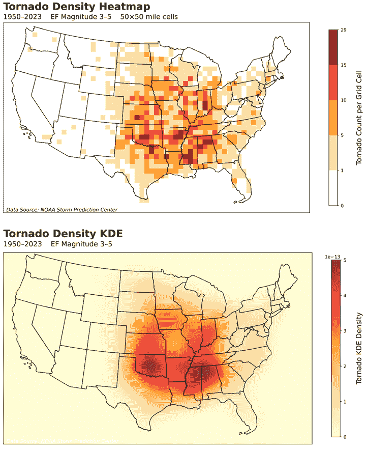
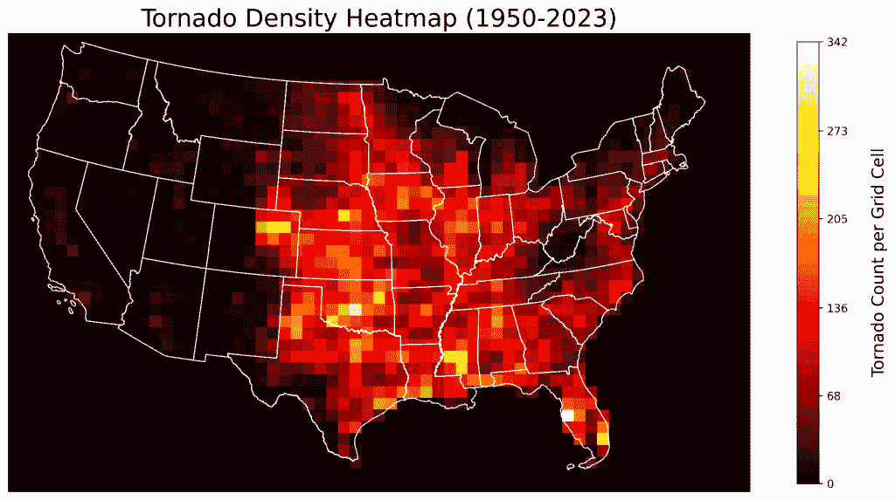
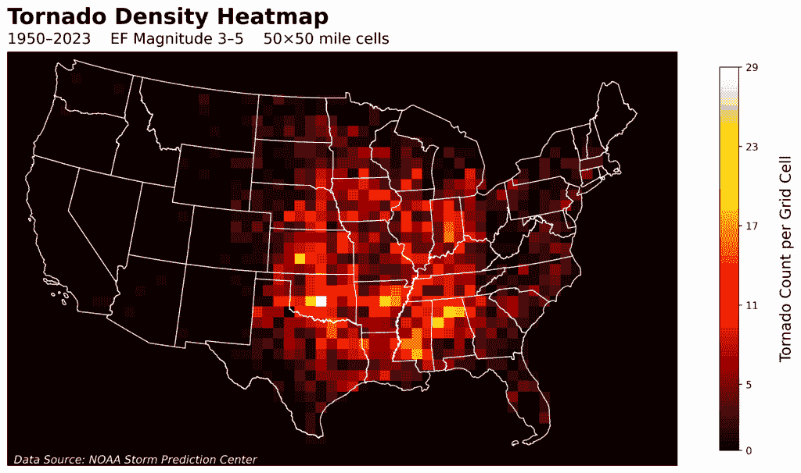
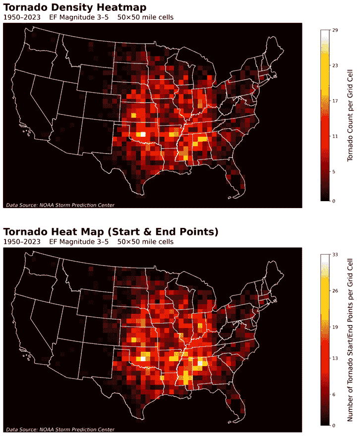

# 如何使用 Python 在真实地图上叠加热力图

> 原文：[`towardsdatascience.com/how-to-overlay-a-heatmap-on-a-real-map-with-python/`](https://towardsdatascience.com/how-to-overlay-a-heatmap-on-a-real-map-with-python/)

<mdspan datatext="el1752691461711" class="mdspan-comment">当数据记者</mdspan>需要一种简单、吸引人且可扩展的方法来展示地理空间数据时，他们通常会转向*热力图*。这种二维可视化将地图划分为等大小的网格单元格，并使用颜色来表示单元格内聚合数据值的强度。

在地理地图上叠加热力图允许快速可视化空间现象。例如，集群、热点、异常值或梯度等模式会立即变得明显。这种格式对于决策者和公众来说可能很有用，他们可能不太熟悉原始的统计输出。

热力图可能由正方形单元格（称为*基于网格*或*矩阵*热力图）或平滑的“连续”值（称为*空间*或*核密度*热力图）组成。以下地图展示了使用这两种方法计算出的龙卷风*起始*位置的密度。



网格型热力图（顶部）和核密度热力图（底部）的示例（作者提供）

如果你眯着眼睛看上面的地图，你应该会看到与下面地图中类似的趋势。

我更喜欢基于网格的热力图，因为清晰的、明显的边界使得比较相邻单元格的值变得更容易，并且异常值不会被“平滑掉”。我也对它们的像素化外观情有独钟，因为我的第一款视频游戏是 Pong 和 Wolfenstein 3D。

此外，核密度热力图可能计算成本高，且对输入参数敏感。它们的形状高度依赖于选择的核函数及其带宽或半径。参数化选择不当可能会导致数据过度平滑或不足平滑，从而掩盖模式。

在这个*快速成功数据科学*项目中，我们将使用 Python 为美国大陆的龙卷风活动创建静态的、基于网格的热力图。

## 数据集

对于这个教程，我们将使用来自**国家海洋和大气管理局**的精彩[公有领域](https://www.weather.gov/disclaimer)数据库中的龙卷风数据。这些数据可以追溯到 1950 年，涵盖了龙卷风的起始和结束位置、强度、伤害、死亡人数、经济损失等更多信息。

数据可以通过 NOAA 的[风暴预测中心](https://www.spc.noaa.gov/wcm/)获取。以下图中突出显示的黄色 CSV 格式数据集涵盖了 1950 年至 2023 年的时期。请勿下载它。为了方便，我在代码中提供了一个链接，可以编程访问它。


来自 NOAA 严重天气数据库下载页面（作者提供）

此 CSV 文件包含 29 列，几乎有 69,000 个龙卷风。您可以在[这里](https://www.spc.noaa.gov/wcm/data/SPC_severe_database_description.pdf)找到列名键。我们将主要使用龙卷风起始位置（slat, slon）、年份（yr）和风暴强度（mag）。

## 安装库

您需要安装[NumPy](https://numpy.org/install/)、[Matplotlib](https://matplotlib.org/stable/users/getting_started/)、[pandas](https://pandas.pydata.org/pandas-docs/stable/getting_started/install.html)和[GeoPandas](https://geopandas.org/en/stable/getting_started/install.html)。前面的链接提供了安装说明。我们还将使用 Shapely 库，它是 GeoPandas 安装的一部分。

作为参考，此项目使用了以下版本：

**python 3.10.18**

**numpy 2.2.5**

**matplotlib 3.10.0**

**pandas 2.2.3**

**geopandas 1.0.1**

**shapely 2.0.6**

## 简化代码

在地理地图上叠加热图不需要很多代码。以下代码展示了基本过程，尽管其中大部分服务于辅助目的，例如将美国数据限制在 48 个州以下，并改善颜色条的外观。

在下一节中，我们将重构和扩展此代码以执行额外的过滤、使用更多配置常量以方便更新，并使用辅助函数以提高清晰度。

```py
import matplotlib.pyplot as plt
import pandas as pd
import geopandas as gpd
import numpy as np
from shapely.geometry import box

TORNADO_DATA_URL = 'https://bit.ly/40xJCMK'
STATES_DATA_URL = ("https://www2.census.gov/geo/tiger/TIGER2020/STATE/"
                   "tl_2020_us_state.zip")

EXCLUDED_STATES_ABBR = ['AK', 'HI', 'PR', 'VI']

CRS_LAT_LON = "EPSG:4326"  # WGS 84 geographic CRS (lat/lon)
CRS_ALBERS_EQUAL_AREA = "EPSG:5070"  # Projected CRS in meters)

CONUS_BOUNDS_MIN_X = -2500000
CONUS_BOUNDS_MIN_Y = 100000
CONUS_BOUNDS_MAX_X = 2500000
CONUS_BOUNDS_MAX_Y = 3200000

GRID_SIZE_MILES = 50
HEATMAP_GRID_SIZE = 80500  # ~50 miles in meters.

df_raw = pd.read_csv(TORNADO_DATA_URL)
df = df_raw[~df_raw['st'].isin(EXCLUDED_STATES_ABBR)].copy() 

geometry = gpd.points_from_xy(df['slon'], df['slat'], crs=CRS_LAT_LON)
gdf = gpd.GeoDataFrame(df, geometry=geometry).to_crs(CRS_ALBERS_EQUAL_AREA)

states_gdf = gpd.read_file(STATES_DATA_URL)
states_gdf = states_gdf[~states_gdf['STUSPS'].isin(EXCLUDED_STATES_ABBR)].copy()
states_gdf = states_gdf.to_crs(CRS_ALBERS_EQUAL_AREA)

conus_bounds_box = box(CONUS_BOUNDS_MIN_X, CONUS_BOUNDS_MIN_Y,
                       CONUS_BOUNDS_MAX_X, CONUS_BOUNDS_MAX_Y)

clipped_states = gpd.clip(states_gdf, conus_bounds_box)

gdf = gdf[gdf.geometry.within(conus_bounds_box)].copy()

x_bins = np.arange(CONUS_BOUNDS_MIN_X, CONUS_BOUNDS_MAX_X + 
                   HEATMAP_GRID_SIZE, HEATMAP_GRID_SIZE)
y_bins = np.arange(CONUS_BOUNDS_MIN_Y, CONUS_BOUNDS_MAX_Y + 
                   HEATMAP_GRID_SIZE, HEATMAP_GRID_SIZE)

heatmap, x_edges, y_edges = np.histogram2d(gdf.geometry.x, 
                                           gdf.geometry.y, 
                                           bins=[x_bins, y_bins])

cmap = plt.cm.hot
norm = None

fig, ax = plt.subplots(figsize=(15, 12))
clipped_states.plot(ax=ax, color='none', 
                    edgecolor='white', linewidth=1)
vmax = np.max(heatmap)
img = ax.imshow(heatmap.T,
                extent=[x_edges[0], x_edges[-1], 
                        y_edges[0], y_edges[-1]],
                origin='lower', cmap=cmap, 
                norm=norm, alpha=1.0,                
                vmin=0, vmax=vmax)
ax.set_title('Tornado Density HeatMap (1950-2023)', fontsize=22)
ax.set_xlabel('')
ax.set_ylabel('')
ax.axis('off')

ticks = np.linspace(0, vmax, 6, dtype=int)
cbar = plt.colorbar(img, ax=ax, shrink=0.6, ticks=ticks)
cbar.set_label('\nTornado Count per Grid Cell', fontsize=15)
cbar.ax.set_yticklabels(list(map(str, ticks)))

plt.show() 
```

这里是结果：



所有记录的龙卷风起始位置（作者提供）的龙卷风密度热图

## 扩展代码

以下 Python 代码是在 JupyterLab 中编写的，并由单元格描述。

### 导入库 / 分配常量

在导入必要的库之后，我们定义了一系列配置常量，使我们能够轻松调整过滤标准、地图边界、绘图尺寸等。对于这次分析，我们专注于美国本土的龙卷风，过滤掉该区域外的州和领土，并从 1950 年到 2023 年的完整数据集中选择仅包含 EF3 至 EF5 级（[增强藤田等级](https://www.weather.gov/oun/efscale)）的重要事件。结果被聚合到 50×50 英里网格单元格中。

```py
import matplotlib.pyplot as plt
import pandas as pd
import geopandas as gpd
import numpy as np
from shapely.geometry import box

# --- Configuration Constants ---
# Data URLs:
TORNADO_DATA_URL = 'https://bit.ly/40xJCMK'
STATES_DATA_URL = ("https://www2.census.gov/geo/tiger/TIGER2020/STATE/"
                   "tl_2020_us_state.zip")

# Geographic Filtering:
EXCLUDED_STATES_ABBR = ['AK', 'HI', 'PR', 'VI']
TORNADO_MAGNITUDE_FILTER = [3, 4, 5]

# Year Filtering (inclusive):
START_YEAR = 1950
END_YEAR = 2023

# Coordinate Reference Systems (CRS):
CRS_LAT_LON = "EPSG:4326"  # WGS 84 geographic CRS (lat/lon)
CRS_ALBERS_EQUAL_AREA = "EPSG:5070"  # NAD83/Conus Albers (projected CRS in m)

# Box for Contiguous US (CONUS) in Albers Equal Area (EPSG:5070 meters):
CONUS_BOUNDS_MIN_X = -2500000
CONUS_BOUNDS_MIN_Y = 100000
CONUS_BOUNDS_MAX_X = 2500000
CONUS_BOUNDS_MAX_Y = 3200000

# Grid Parameters for Heatmap (50x50 mile cells):
GRID_SIZE_MILES = 50
HEATMAP_GRID_SIZE = 80500  # ~50 miles in meters.

# Plotting Configuration:
FIGURE_SIZE = (15, 12)
SAVE_DPI = 600
SAVE_FILENAME = 'tornado_heatmap.png'

# Annotation positions (in EPSG:5070 meters, relative to plot extent):
TITLE_X = CONUS_BOUNDS_MIN_X
TITLE_Y = CONUS_BOUNDS_MAX_Y + 250000  # Offset above max Y
SUBTITLE_X = CONUS_BOUNDS_MIN_X
SUBTITLE_Y = CONUS_BOUNDS_MAX_Y + 100000  # Offset above max Y
SOURCE_X = CONUS_BOUNDS_MIN_X + 50000  # Slightly indented from min X
SOURCE_Y = CONUS_BOUNDS_MIN_Y + 20000  # Slightly above min Y 
```

### 定义辅助函数

下一个单元格定义了两个辅助函数，用于加载数据集并进行过滤，以及加载数据集状态边界并进行过滤。请注意，我们在过程中调用了之前的配置常量。

```py
# --- Helper Functions ---
def load_and_filter_tornado_data():
    """Load data, apply filters, and create a GeoDataFrame."""
    print("Loading and filtering tornado data...")
    df_raw = pd.read_csv(TORNADO_DATA_URL)

    # Combine filtering steps into one chained operation:
    mask = (~df_raw['st'].isin(EXCLUDED_STATES_ABBR) &
            df_raw['mag'].isin(TORNADO_MAGNITUDE_FILTER) &
            (df_raw['yr'] >= START_YEAR) & (df_raw['yr'] <= END_YEAR))
    df = df_raw[mask].copy()

    # Create and project a GeoDataFrame:
    geometry = gpd.points_from_xy(df['slon'], df['slat'], 
                                  crs=CRS_LAT_LON)
    temp_gdf = gpd.GeoDataFrame(df, geometry=geometry).to_crs(
                                CRS_ALBERS_EQUAL_AREA)
    return temp_gdf

def load_and_filter_states():
    """Load US state boundaries and filter for CONUS."""
    print("Loading state boundary data...")
    states_temp_gdf = gpd.read_file(STATES_DATA_URL)
    states_temp_gdf = (states_temp_gdf[~states_temp_gdf['STUSPS']
                  .isin(EXCLUDED_STATES_ABBR)].copy())
    states_temp_gdf = states_temp_gdf.to_crs(CRS_ALBERS_EQUAL_AREA)
    return states_temp_gdf 
```

注意，在掩码和`states_temp_gdf`表达式前的波浪号（`~`）会反转结果，因此我们选择那些州缩写不在排除列表中的行。

### 运行辅助函数并生成热图

以下单元格调用辅助函数来加载数据集并进行过滤，然后将数据裁剪到地图边界内，生成热图（使用 NumPy 的`histogram2d()`方法），并为热图定义一个连续的颜色映射。请注意，我们在过程中再次调用了之前的配置常量。

```py
# --- Data Loading and Preprocessing ---
gdf = load_and_filter_tornado_data()
states_gdf = load_and_filter_states()

# Create bounding box and clip state boundaries & tornado points:
conus_bounds_box = box(CONUS_BOUNDS_MIN_X, CONUS_BOUNDS_MIN_Y,
                       CONUS_BOUNDS_MAX_X, CONUS_BOUNDS_MAX_Y)
clipped_states = gpd.clip(states_gdf, conus_bounds_box)
gdf = gdf[gdf.geometry.within(conus_bounds_box)].copy()

# --- Heatmap Generation ---
print("Generating heatmap bins...")
x_bins = np.arange(CONUS_BOUNDS_MIN_X, CONUS_BOUNDS_MAX_X + 
                   HEATMAP_GRID_SIZE, HEATMAP_GRID_SIZE)
y_bins = np.arange(CONUS_BOUNDS_MIN_Y, CONUS_BOUNDS_MAX_Y + 
                   HEATMAP_GRID_SIZE, HEATMAP_GRID_SIZE)

print("Computing 2D histogram...")
heatmap, x_edges, y_edges = np.histogram2d(gdf.geometry.x, 
                                           gdf.geometry.y, 
                                           bins=[x_bins, y_bins])

# Define continuous colormap (e.g., 'hot', 'viridis', 'plasma', etc.):
print("Defining continuous colormap...")
cmap = plt.cm.hot
norm = None

print("Finished execution.") 
```

由于这个过程可能需要几秒钟，`print()`函数使我们能够了解程序的进度：

```py
Loading and filtering tornado data...
Loading state boundary data...
Generating heatmap bins...
Computing 2D histogram...
Defining continuous colormap...
Finished execution.
```

### 绘制结果

最终单元格生成并保存了图表。Matplotlib 的`imshow()`方法是负责绘制热图的。有关`imshow()`的更多信息，请参阅这篇文章[热图用于时间序列](https://towardsdatascience.com/heatmaps-for-time-series/)。

```py
# --- Plotting ---
print("Plotting results...")
fig, ax = plt.subplots(figsize=FIGURE_SIZE)
fig.subplots_adjust(top=0.85)  # Make room for titles.

# Plot state boundaries and heatmap:
clipped_states.plot(ax=ax, color='none', 
                    edgecolor='white', linewidth=1)
vmax = np.max(heatmap)
img = ax.imshow(heatmap.T,
                extent=[x_edges[0], x_edges[-1], 
                        y_edges[0], y_edges[-1]],
                origin='lower', 
                cmap=cmap, norm=norm, 
                alpha=1.0, vmin=0, vmax=vmax)

# Annotations:
plt.text(TITLE_X, TITLE_Y, 'Tornado Density Heatmap', 
         fontsize=22, fontweight='bold', ha='left')
plt.text(x=SUBTITLE_X, y=SUBTITLE_Y, s=(
         f'{START_YEAR}–{END_YEAR}    EF Magnitude 3–5    ' 
         f'{GRID_SIZE_MILES}×{GRID_SIZE_MILES} mile cells'),
         fontsize=15, ha='left')
plt.text(x=SOURCE_X, y=SOURCE_Y, 
         s='Data Source: NOAA Storm Prediction Center',
         color='white', fontsize=11, 
         fontstyle='italic', ha='left')

# Clean up the axes:
ax.set_xlabel('')
ax.set_ylabel('')
ax.axis('off')

# Post the Colorbar:
ticks = np.linspace(0, vmax, 6, dtype=int)
cbar = plt.colorbar(img, ax=ax, shrink=0.6, ticks=ticks)
cbar.set_label('\nTornado Count per Grid Cell', fontsize=15)
cbar.ax.set_yticklabels(list(map(str, ticks)))

print(f"Saving plot as '{SAVE_FILENAME}'...")
plt.savefig(SAVE_FILENAME, bbox_inches='tight', dpi=SAVE_DPI)
print("Plot saved.\n")
plt.show()
```

这产生了以下地图：



EF 3-5 级龙卷风起始位置密度图（作者绘制）

这是一张美丽的地图，比平滑的 KDE 替代方案更有信息量。

### 添加龙卷风结束位置

我们的龙卷风密度热图基于龙卷风的**起始**位置。但龙卷风着陆后会移动。平均龙卷风轨迹长度约为 3 英里，但当你观察更强的风暴时，数字会增加。EF-3 龙卷风平均 18 英里，EF-4 龙卷风平均 27 英里。然而，长轨迹龙卷风很少见，占所有龙卷风的[不到 2%](https://www.tornadopath.com/united-states)。

由于平均龙卷风轨迹长度小于我们网格单元的 50 英里维度，我们预计它们通常只会覆盖一个或两个单元。因此，包括龙卷风结束位置应该有助于我们改进密度测量。

要做到这一点，我们需要结合起始和结束的经纬度位置，并**过滤掉**与对应起始点**相同单元格**的端点。否则，在计数时会出现“双重计算”。这段代码有点长，所以我将它存储在这个[Gist](https://gist.github.com/rlvaugh/68c858f577fbd592224228ec1afa3464)中。

这里是“仅起始”地图与结合起始和结束位置的地图的比较：



起始位置热图（顶部）与起始和结束位置热图（底部）的比较（作者绘制）

主要的风向将大多数龙卷风推向东方和东北方。你可以在密苏里州、密西西比州、阿拉巴马州和田纳西州等州看到其影响。这些区域在底部地图中具有更亮的细胞，因为龙卷风从一个细胞开始并在相邻的东向细胞中结束。注意，给定细胞中的龙卷风最大数量已从上图的 29 个增加到下图的 33 个。

## 概述

我们使用了 Python、pandas、GeoPandas 和 Matplotlib 将热图投影并叠加到地理地图上。地理空间热图是可视化统计数据中区域趋势、模式、热点和异常的高效方法。

如果你喜欢这类项目，务必查看我的书籍[*《现实世界 Python：黑客用代码解决问题的指南*](https://a.co/d/cejWu6d)，可在书店和网上购买)。


