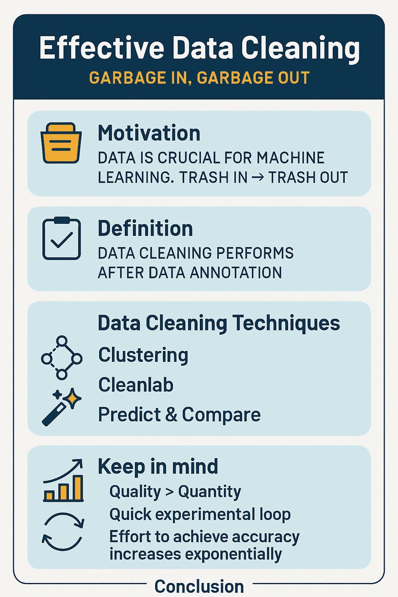
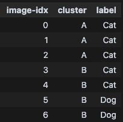
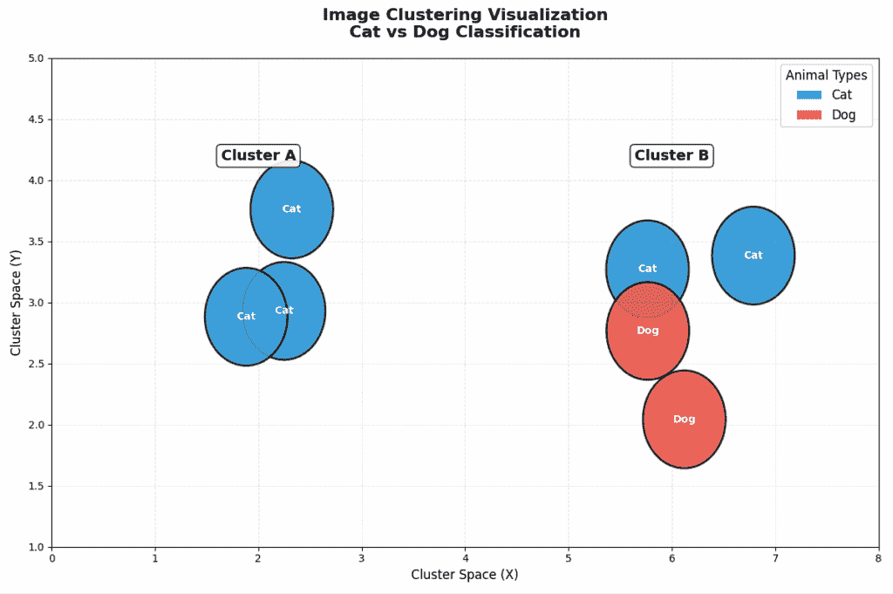

# 如何为机器学习进行有效的数据清洗

> 原文：[如何为机器学习进行有效的数据清洗](https://towardsdatascience.com/how-to-perform-effective-data-cleaning-for-machine-learning/)

数据清洗可以说是你在机器学习流程中可以执行的最重要的一步。没有数据，你的模型算法改进可能不会产生影响。毕竟，“垃圾进，垃圾出”不仅仅是一句俗语，而是机器学习中的一个固有真理。没有适当的高质量数据，你将难以创建高质量的机器学习模型。



这张信息图总结了文章内容。我首先解释了写这篇文章的动机，并将数据清洗定义为一项任务。然后我继续讨论三种不同的数据清洗技术，以及在进行数据清洗时需要注意的一些事项。图片由 ChatGPT 提供。

在这篇文章中，我将讨论如何有效地将数据清洗应用于您的数据集，以提升您微调的机器学习模型的质量。我会解释为什么需要数据清洗以及数据清洗技术。最后，我还会提供一些重要的注意事项，例如保持短的实验循环。

*您还可以阅读有关[如何基准测试 LLMs](https://towardsdatascience.com/how-to-benchmark-llms-arc-agi-3/)、[如何撰写有洞察力的技术文章](https://towardsdatascience.com/how-to-write-insightful-technical-articles/)、[如何最大化技术活动](https://contributor.insightmediagroup.io/how-to-maximize-technical-events-nvidia-gtc-paris-2025/)以及[为机器学习创建强大的嵌入](https://eivindkjosbakken.wordpress.com/2024/02/21/how-to-create-powerful-embeddings-from-your-data-to-feed-into-your-ai/)的文章*。

## 目录

+   动机

+   定义

+   数据清洗技术

    +   聚类

    +   Cleanlab

    +   预测和比较

+   牢记要点

    +   质量 > 数量

    +   快速实验循环

    +   努力提高准确性的难度呈指数级增长

+   结论

## 动机

我写这篇文章的动机是，数据是作为数据科学家或机器学习工程师工作时最重要的方面之一。这就是为什么像特斯拉（[Tesla](https://www.tesla.com/)）、DeepMind（[DeepMind](https://deepmind.google/)）、OpenAI（[OpenAI](https://openai.com/news/)）以及许多其他公司都专注于数据标注。例如，特斯拉大约有 1500 名员工在为其完全自动驾驶进行数据标注。

然而，如果你有一个低质量的数据集，你将很难获得高性能的模型。这就是为什么在标注后清洗数据如此重要的原因。清洗实际上是每个涉及训练模型的机器学习管道的基础性工作。

## 定义

为了明确起见，我将数据清洗定义为在数据标注过程之后执行的一个步骤。因此，你已经有了一组样本和相应的标签，现在你的目标是清洗这些标签以确保其正确性。

此外，**标注**和**标签化**这两个词经常被互换使用。我认为它们的意思是相同的，但为了保持一致性，我将只使用标注。在数据标注中，我指的是在数据样本上设置标签的过程。例如，如果你有一张猫的图片，标注这张图片意味着为这张图片设置标注**猫**。

## 数据清洗技术

需要强调的是，在数据集较小的情况下，你可以选择再次检查所有样本和标注。然而，在许多场景中，这并不是一个可行的选项，因为数据标注需要花费太多时间。这就是为什么我下面列出了一些技术来更有效地进行数据清洗。

### 聚类

[聚类是机器学习中的一种常见无监督技术](https://scikit-learn.org/stable/modules/clustering.html)。使用聚类，你将一组标签分配给数据样本，而不需要原始的样本和标注数据集。

然而，聚类也是一种出色的数据清洗技术。这是我使用聚类进行数据清洗的过程：

1.  将所有数据样本嵌入。这可以通过使用[BERT 模型](https://huggingface.co/docs/transformers/en/model_doc/bert)进行文本嵌入，使用[Squeezenet](https://arxiv.org/abs/1602.07360)进行视觉嵌入，或者使用[OpenAI 的 CLIP 嵌入](https://openai.com/index/clip/)等组合嵌入来完成。关键是你需要数据样本的数值表示来执行聚类。

1.  应用聚类技术。我更喜欢[K-means](https://www.geeksforgeeks.org/machine-learning/k-means-clustering-introduction/)，因为它将一个簇分配给所有数据样本，而[DB Scan](https://scikit-learn.org/stable/modules/generated/sklearn.cluster.DBSCAN.html)则也有异常值。（异常值在许多场景中可能是合适的，但在数据清洗中是不理想的）。如果你使用 K-means，你应该尝试不同的 K 值参数。

1.  现在，你有一份数据样本及其分配簇的列表。然后，我遍历每个簇，检查簇内是否有不同的标签。

我现在想详细说明第 3 步。通过一个例子来说明。我将使用一个简单的二分类任务，即把图像分配到标签

+   猫

+   狗

现在，我有 10 张图片，以下列出了以下聚类分配。作为一个小例子，我将展示七个数据样本，有两个聚类分配。在表格中，数据样本看起来是这样的



一些示例数据样本以及它们的聚类分配和标签。表格由作者提供，

如果你可以像下面这样可视化：



此图显示了示例聚类的可视化。图片由作者提供。

我将使用一个 for 循环遍历每个聚类，并决定我想进一步查看哪个样本（Python 代码见下文）

+   **聚类 A**：在这个聚类中，所有数据样本都有相同的注释（猫）。因此，这些注释更有可能是正确的。我**不需要**对这些样本进行二次审查

+   **聚类 B**：我们肯定想更仔细地查看这个聚类中的样本。在这里，我们有图像，嵌入在嵌入空间中非常接近。这非常可疑，因为我们预计相似的嵌入应该有相同的标签。我将仔细查看这四个样本

你可以看到你只需要查看 4/7 的数据样本吗？

这就是节省时间的方法。你只找到最有可能不正确的数据样本。你可以将这种技术扩展到数千个样本以及更多的聚类，这将节省大量的时间。

* * *

我现在也将提供此示例的代码，以突出我如何使用 Python 进行聚类。

首先，让我们定义模拟数据：

```py
sample_data = [
    {
        "image-idx": 0,
        "cluster": "A",
        "label": "Cat"
    },
    {
        "image-idx": 1,
        "cluster": "A",
        "label": "Cat"
    },
    {
        "image-idx": 2,
        "cluster": "A",
        "label": "Cat"
    },
    {
        "image-idx": 3,
        "cluster": "B",
        "label": "Cat"
    },
    {
        "image-idx": 4,
        "cluster": "B",
        "label": "Cat"
    },
    {
        "image-idx": 5,
        "cluster": "B",
        "label": "Dog"
    },
    {
        "image-idx": 6,
        "cluster": "B",
        "label": "Dog"
    },

]
```

现在，让我们遍历所有聚类并找到我们需要查看的样本：

```py
from collections import Counter
# first retrieve all unique clusters
unique_clusters = list(set(item["cluster"] for item in sample_data))

images_to_look_at = []
# iterate over all clusters
for cluster in unique_clusters:
    # fetch all items in the cluster
    cluster_items = [item for item in sample_data if item["cluster"] == cluster]

    # check how many of each label in this cluster
    label_counts = Counter(item["label"] for item in cluster_items)
    if len(label_counts) > 1:
        print(f"Cluster {cluster} has multiple labels: {label_counts}. ")
        images_to_look_at.append(cluster_items)
    else:
        print(f"Cluster {cluster} has a single label: {label_counts}")

print(images_to_look_at)
```

现在，你只需要查看*images_to_look*变量

### Cleanlab

[Cleanlab](https://cleanlab.ai/)是另一种你可以应用来清理数据的有效技术。Cleanlab 是一家提供产品以检测机器学习应用中错误的公司。然而，他们也在 GitHub 上[开源了一个工具](https://github.com/cleanlab/cleanlab)以自行进行数据清理，这正是我将在这里讨论的。

实际上，Cleanlab 会分析你的数据，分析你的输入嵌入（例如，使用 BERT、Squeezenet 或 CLIP 制作的嵌入），以及模型的输出 logits。然后他们对你的数据进行统计分析，以检测最有可能标签错误的样本。

Cleanlab 是一个简单的工具，设置起来很简单，因为它本质上只需要你提供你的输入和输出数据，它会处理复杂的统计分析。我已经使用过 Cleanlab，并看到它具有很强的检测潜在注释错误样本的能力。

考虑到他们有一个好的[README](https://github.com/cleanlab/cleanlab?tab=readme-ov-file)可用，我将把 Cleanlab 的实现留给读者。

### 预测和与注释比较

我将要介绍的最后一个数据清洗技术是使用您微调的机器学习模型对样本进行预测，并与您的标注进行比较。您本质上可以使用一种类似[k-fold 交叉验证](https://machinelearningmastery.com/k-fold-cross-validation/)的技术，其中您将数据集分成几个不同训练和测试分割的折叠，并在整个数据集上进行预测，而不将测试数据泄露到训练集中。

在你对数据进行预测后，你可以将预测与每个样本上的标注进行比较。如果预测与标注相符，你不需要审查该样本（这个样本有错误的标注的可能性较低）。

### 技术总结

我在这里介绍了三种不同的技术

+   聚类

+   Cleanlab

+   预测和比较

这些技术中的主要目的是过滤掉有很大可能是错误的样本，并且只审查那些样本。通过这种方式，你只需要审查你数据样本的一个子集，从而节省了大量审查数据的时间。不同的技术在不同场景中可能更适合。

你当然也可以将技术结合使用，无论是**并集**还是**交集**：

+   使用不同技术找到的样本的**并集**来寻找更多可能错误的样本

+   使用你认为可能错误的样本的**交集**来确保你相信的样本是错误的

## 需要记住的重要事项

我还想要简要介绍在执行数据清洗时需要记住的重要要点

+   质量优于数量

+   短期实验循环

+   提高准确性的努力所需的成本呈指数增长

我现在将详细阐述每个要点。

### 质量优于数量

当谈到数据时，拥有一个包含正确标注样本的数据集，比拥有包含一些错误标注样本的更大数据集要重要得多。原因是当你训练模型时，它会盲目地信任你分配的标注，并将模型权重调整到这个真实情况。

想象一下，例如，你有十张狗和猫的图片。其中九张图片标注正确；然而，有一个样本显示的是狗的图片，实际上却是猫。你现在告诉模型，它应该更新其权重，以便当它看到狗时，应该预测**猫**。这自然会大大降低模型的性能，你应该不惜一切代价避免这种情况。

### 短期实验循环

在进行机器学习项目时，拥有一个短的实验循环非常重要。这是因为你通常必须尝试不同的超参数配置或其他类似设置。

例如，当应用我上面描述的第三种技术，即使用你的模型进行预测，并将输出与你的标注进行比较时，我建议经常在你的清洗数据上重新训练模型。这将提高你的模型性能，并允许你更好地检测错误的标注。

### 提高准确度所需的努力呈指数增长

重要的是要注意，当你从事机器学习项目时，你应该事先了解要求。你需要一个 99%准确度的模型，还是 90%就足够了？如果 90%就足够了，你可能会节省很多时间，就像下面图表中显示的那样。

该图表是我制作的示例图表，并未使用任何真实数据。然而，它突出了我在处理机器学习模型时所做的关键笔记。你通常可以快速达到 90%的准确度（或者我定义的相对较好的模型。确切的准确度当然取决于你的项目。然而，将准确度推到 95%甚至 99%将需要指数级的工作。


展示了提高准确度所需的努力如何指数级地增加以达到 100%准确度的图表。图片由作者提供。

例如，当你刚开始数据清洗时，重新训练和测试你的模型，你会看到快速的提升。然而，随着你进行越来越多的数据清洗，你很可能会看到收益递减。在处理项目和优先考虑如何分配时间时，请记住这一点。

## 结论

在这篇文章中，我讨论了数据标注和数据清洗的重要性。我介绍了三种应用有效数据清洗的技术：

1.  聚类

1.  Cleanlab

1.  预测和比较

这些技术中的每一个都可以帮助你检测可能被错误标注的数据样本。根据你的数据集，不同的技术将具有不同的有效性，你通常需要尝试它们以查看哪些最适合你和你正在解决的问题。

此外，我还讨论了在进行数据清洗时需要注意的重要事项。请记住，拥有高质量的数据标注比增加标注数量更重要。如果你牢记这一点，并确保有一个短的实验循环，其中你清理一些数据，重新训练你的模型，并再次测试。你将看到你的机器学习模型性能的快速提升。

**👉 我的免费电子书和网络研讨会：**

📚 [获取我的免费视觉语言模型电子书](https://eivindkjosbakken.com/ebook)

💻 [我的视觉语言模型网络研讨会](https://www.eivindkjosbakken.com/webinar)

**👉 在社交媒体上找到我：**

📩 [订阅我的通讯](https://eivindkjosbakken.com/newsletter)

🧑‍💻 [联系我](https://eivindkjosbakken.com/)

🔗 [LinkedIn](https://www.linkedin.com/in/eivind-kjosbakken/)

🐦 [X / Twitter](https://x.com/EivindKjos)

✍️ [Medium](https://oieivind.medium.com/)
