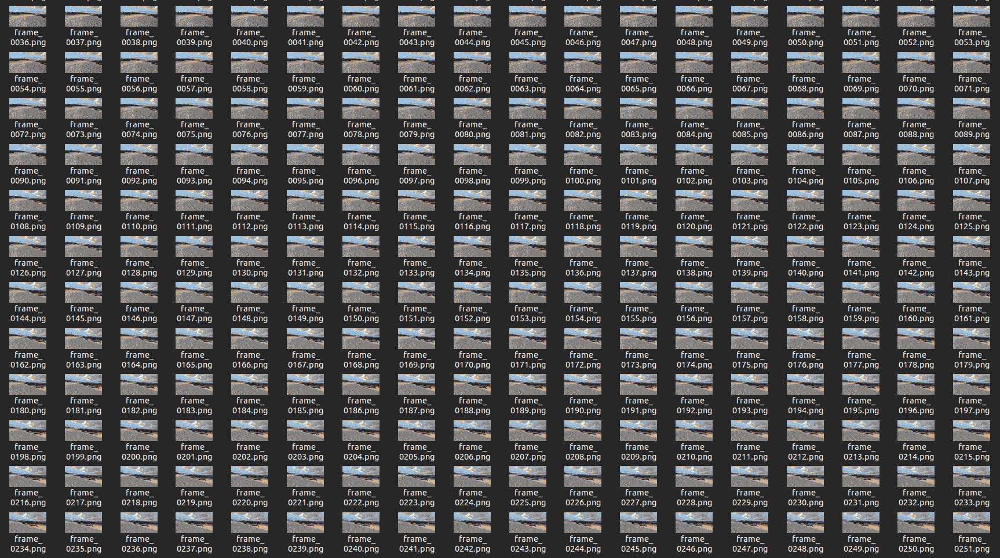
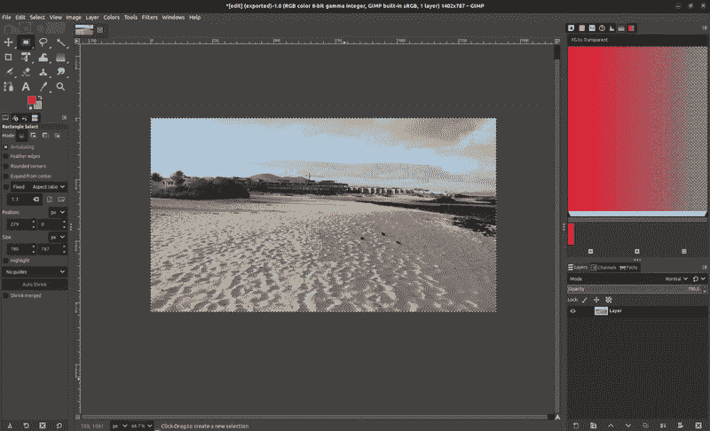
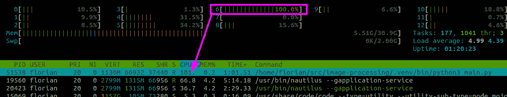
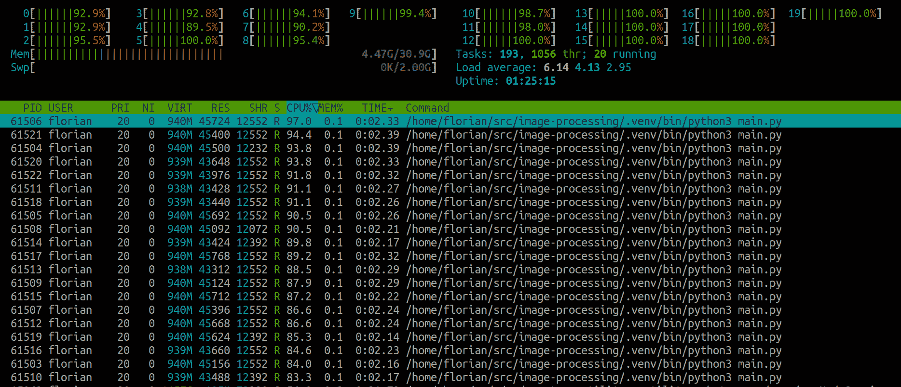
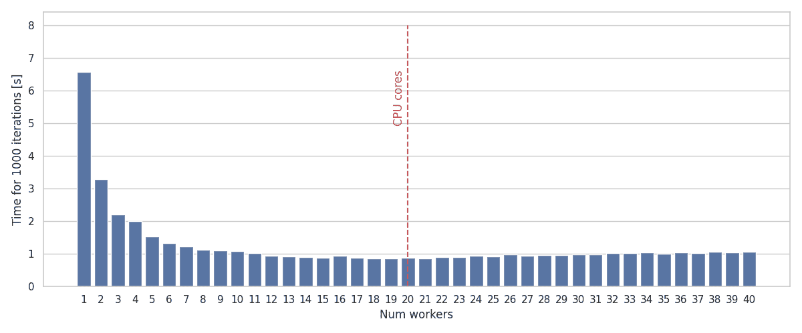

# 如何在几秒钟内处理 10k 张图片

> 原文：[`towardsdatascience.com/how-to-process-10k-images-in-seconds-e99661f5c2b5/`](https://towardsdatascience.com/how-to-process-10k-images-in-seconds-e99661f5c2b5/)



图像处理数据集

*手动、重复性的任务。唉。*我最讨厌的事情之一，尤其是当我知道它们可以被自动化时。想象一下，你需要编辑大量具有相同裁剪和调整大小操作的图片。对于几张图片，你可能只是打开一个图像编辑器手动完成。但是，对于成千上万张图片，你如何进行**相同的操作**呢？让我们看看如何使用**Python**和**OpenCV**自动化这样的图像处理任务，以及如何优化这个数据处理管道，使其在大量数据集上高效运行。

## 数据集

对于这篇帖子，我创建了一个玩具示例，从我所记录的随机海滩视频中提取了 10,000 帧，目标是**裁剪**图像到中心附近的方形宽高比，然后将图像**调整大小**到固定的**224×224**像素大小。

> 这大致类似于在训练机器学习模型时可能需要的数据集的**预处理**步骤的一部分。


裁剪和调整大小操作的示意图



手动中心裁剪和调整大小

### 前提条件

如果你想跟上来，请确保安装以下包，例如使用**[uv](https://docs.astral.sh/uv/)**。你还可以在**[GitHub](https://github.com/trflorian/image-processing)**上找到完整的源代码。

```py
uv add opencv-python tqdm
```

### 数据加载

让我们先使用**OpenCV**逐个加载图像。所有图像都在一个子文件夹中，并将使用**pathlib** glob 方法来查找这个文件夹中的所有**png**文件。为了显示进度，我使用了**tqdm**库。通过使用**sorted**方法，我确保路径被排序，并将从**glob**调用返回的生成器转换为列表。这样，**tqdm**就知道迭代的长度，以显示进度条。

```py
from pathlib import Path
from tqdm import tqdm

img_paths = Path("images").glob("*.png")

for img_path in tqdm(sorted(img_paths)):
    pass
```

现在，我们也可以准备我们的输出目录，并确保它存在。这就是我们的处理后的图像将被存储的地方。

```py
output_path = Path("output")
output_path.mkdir(exist_ok=True, parents=True)
```

### 图像处理

对于图像的处理，让我们定义一个函数。它将**输入**和**输出图像路径**作为参数。

```py
def process_image(input_path: Path, output_path: Path) -> None:
    """
    Image processing pipeline:
    - Center crop to square aspect ratio
    - Resize to 224x224

    Args:
        input_path (Path): Path to input image
        output_path (Path): Path to save processed image
    """
```

要实现这个函数，我们首先需要使用**OpenCV**加载图像。确保在文件开头导入 opencv 包。

```py
...

import cv2

def process_image(input_path: Path, output_path: Path) -> None:
    ... 

    # Read image
    img = cv2.imread(str(input_path))
```

为了裁剪图像，我们可以直接在 x 轴上切片图像数组。请注意，OpenCV 图像数组以 **YXC** 形式存储：**X/Y** 是图像的 2D 轴，从左上角开始，**C** 是颜色通道。因此，x 轴是图像的第二个索引。为了简单起见，我假设图像是横幅格式，其宽度大于高度。

```py
height, width, _ = img.shape
img = img[:, (width - height) // 2 : (width + height) // 2, :]
```

为了调整图像大小，我们可以简单地使用 OpenCV 中的 **resize** 函数。如果我们没有指定插值方法，它将使用 **双线性插值**，这对于这个项目来说是完全可以接受的。

```py
target_size = 224
img = cv2.resize(img, (target_size, target_size))
```

最后，必须使用 **imwrite** 函数将图像保存到输出文件。

```py
cv2.imwrite(str(output_path), img)
```

现在我们可以简单地在我们对图像路径的循环中调用我们的 process_image 函数。

```py
for img_path in tqdm(sorted(img_paths)):
    process_image(input_path=img_path, output_path=output_path / img_path.name)
```

如果我在我的机器上运行这个程序，处理 10,000 张图像需要一点超过一分钟的时间。

```py
 4%|█████▏                            | 441/10000 [00:02<01:01, 154.34it/s]
```

现在，对于这个数据集大小，等待一分钟仍然是可行的，但对于一个 10 倍更大的数据集，你将已经等待了 10 分钟。通过 **并行化** 这个过程，我们可以做得更好。如果你查看当前程序运行时的资源使用情况，你会注意到只有一个核心达到了 100% 的利用率。程序只使用了单个核心！



在运行图像处理时的单核 CPU 使用率

### 在多个核心之间并行化

为了让我们的程序使用更多的可用核心，我们需要使用 Python 中称为 **Multiprocessing** 的功能。由于 **全局解释器锁 (GIL)**，单个 Python 进程不能真正并行运行任务（除非禁用 GIL，这可以通过 Python≥3.13 实现）。我们实际上需要做的是生成多个 Python 进程（因此得名 multiprocessing），这些进程由我们的主 Python 程序管理。

为了实现这一点，我们可以利用内置的 Python 模块 **multiprocessing** 和 **concurrent**。从理论上讲，我们可以手动生成 Python 进程，同时确保提交的进程数不超过我们拥有的核心数。由于我们的进程是 CPU 密集型，增加更多进程并不会带来速度上的提升，因为它们只需要等待。事实上，在某个时刻，进程间切换的开销将超过并行化的优势。

为了管理 Python 进程，我们可以使用 **ProcessPoolExecutor**。这将保持一个 Python 进程池，而不是为每个提交的任务完全销毁和重新启动每个进程。默认情况下，它将使用与可用的 **逻辑 CPU** 数量相同的池，这可以通过 **os.process_cpu_count()** 获取。所以默认情况下，它将为我的 CPU 的每个核心生成一个进程，在我的情况下是 20。你也可以提供一个 **max_workers** 参数来指定池中要生成的进程数。

> **注意：**请确保将你的**multiprocess**池包裹在**main**检查中。在 Windows 上，子进程是独立的进程，它们导入模块，如果进程创建不在主保护内，将会递归地[产生新的进程](https://docs.python.org/3/library/multiprocessing.html#windows)！

```py
from concurrent.futures import ProcessPoolExecutor

...

if __name__ == "__main__":
    ...
    output_paths = [output_path / img_path.name for img_path in img_paths]

    with ProcessPoolExecutor() as executor:
        all_processes = executor.map(
            process_image,
            img_paths,
            output_paths,
        )
        for _ in tqdm(all_processes, total=len(img_paths)):
            pass
```

我们使用**[上下文管理器](https://docs.python.org/3/library/contextlib.html)**（即***with***语句）来创建进程池执行器，这将确保即使在执行过程中发生异常，进程也会被清理。然后我们使用**map**函数为每个输入的**img_paths**和**output_paths**创建一个进程。最后，通过将**all_processes**的迭代包裹在**[tqdm](https://medium.com/@flip.flo.dev/a-simple-library-that-makes-it-into-almost-all-of-my-python-projects-tqdm-e097ee8091e2)**中，我们可以为已完成的过程获得一个进度条。

```py
 18%|█████                        | 1760/10000 [00:00<00:04, 1857.23it/s]
```

现在如果你运行程序并再次检查 CPU 利用率，你会看到所有核心都被使用了！进度条也显示了我们的迭代速度如何提高。



所有 CPU 核心都被利用

### 对比

为了快速检查，我绘制了使用不同并行化程度处理 1000 张图片的时间，从单个工作者的场景开始，增加到机器核心数的两倍。下面的图表明，最佳值接近 CPU 核心数。从 1 个工作者到多个工作者的性能有显著提升，而工作者的数量超过 CPU 核心数时，性能略有下降。



不同并行化程度的时间

## 结论

在这篇帖子中，你学习了如何通过在所有可用的核心上并行运行处理来高效地处理图像数据集。这样，数据处理管道的速度得到了显著提升。我希望你今天有所收获，编码愉快，保重！

* * *

> [**GitHub – trflorian/image-processing**](https://github.com/trflorian/image-processing)

*所有图像和视频均由作者创作。*
