# 如何将您的 Power BI 模型大小减少 90%

> 原文：[`towardsdatascience.com/how-to-reduce-your-power-bi-model-size-by-90/`](https://towardsdatascience.com/how-to-reduce-your-power-bi-model-size-by-90/)

*<mdspan datatext="el1748302398761" class="mdspan-comment">您是否曾想过</mdspan>是什么让 Power BI 在性能上如此快、如此强大？强大到它能在瞬间完成数百万行的复杂计算。*

*在这篇文章中，我们将深入挖掘，了解 Power BI 的“内部机制”，了解您的数据是如何被存储、压缩、查询，最后被带回您的报告中的。一旦您阅读完毕，我希望您能更好地理解后台发生的辛勤工作，并欣赏创建一个最佳数据模型以从 Power BI 引擎中获得最佳性能的重要性。*

## 首先看看内部机制——公式引擎和存储引擎

首先，我想向您介绍**VertiPaq**引擎，它是系统背后的“大脑和肌肉”，不仅包括 Power BI，还包括 Analysis Services Tabular 和 Excel Power Pivot。说实话，VertiPaq 只是 Tabular 模型中存储引擎的一部分，除了 DirectQuery，我们将在下一篇文章中单独讨论。

当您发送查询以获取 Power BI 报告中的数据时，以下是会发生的情况：

+   *公式引擎（FE）*接受请求，处理它，生成查询计划，并最终执行它。

+   *存储引擎（SE）*从 Tabular 模型中提取数据，以满足公式引擎生成的查询中发出的请求。

存储引擎以两种不同的方式检索请求的数据：VertiPaq 在内存中保留数据的快照。这个快照可以不时地从原始数据源刷新。

相反，*DirectQuery*不会存储任何数据。它只是将查询直接转发到数据源，针对每个请求。

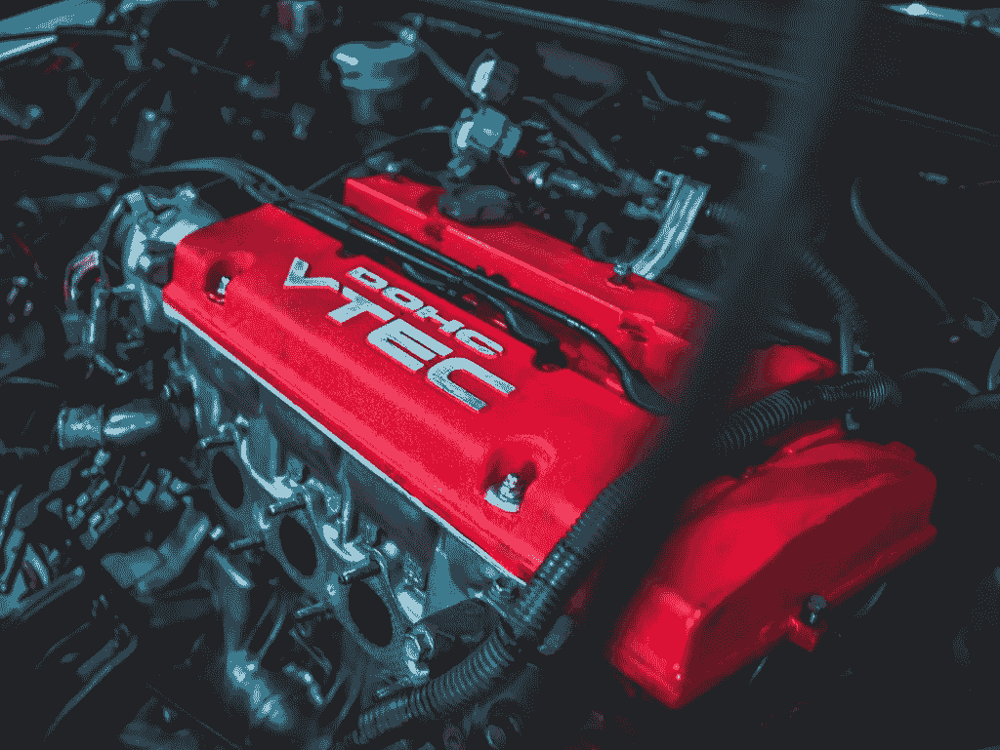

[Photo by RKTW extend on Unsplash](https://unsplash.com/photos/2EHRBs1gefY)

Tabular 模型中的数据通常以内存快照（VertiPaq）或 DirectQuery 模式存储。然而，也存在实现混合复合模型的可能性，该模型同时依赖于这两种架构。

## 公式引擎——Power BI 的“大脑”

正如我之前强调的，公式引擎接受查询，并且由于它能够“理解”DAX（以及 MDX，但超出了本系列的范围），它“翻译”DAX 成特定的查询计划，该计划由需要执行以获取结果的物理操作组成。

这些物理操作可以是多个表之间的连接、过滤或聚合。重要的是要知道，公式引擎以单线程方式工作，这意味着对存储引擎的请求总是按顺序发送。

## 存储引擎——Power BI 的“肌肉”

一旦公式引擎生成并执行了查询，存储引擎就登场了。它物理地遍历 Tabular 模型（VertiPaq）中存储的数据，或者直接访问不同的数据源（例如，如果启用了 DirectQuery 存储模式，则为 SQL Server）。

当涉及到指定表的存储引擎时，有三种可能的选择可供选择：

+   **导入模式** — 基于 VertiPaq。表数据以快照的形式存储在内存中。数据可以定期刷新

+   **DirectQuery 模式** — 在查询时从数据源检索数据。在查询执行之前、期间和之后，数据都位于其原始源中

+   **双模式** — 前两种选项的组合。表中的数据被加载到内存中，但在查询时也可以直接从源中检索

与不支持并行处理的公式引擎相反，存储引擎可以异步工作。

## 认识 VertiPaq 存储引擎

正如我们之前已经绘制了一个大图，让我更详细地解释一下 VertiPaq 在后台是如何提升我们的 Power BI 报告性能的。

当我们为我们的 Power BI 表选择导入模式时，VertiPaq 执行以下操作：

+   读取数据源，将数据转换为列式结构，并在每个列中对数据进行编码和压缩

+   为每个列建立字典和索引

+   准备并建立关系

+   计算所有计算列和计算表，并对它们进行压缩

VertiPaq 的两个主要特点是：

1.  *VertiPaq 是一个列式数据库*

1.  *VertiPaq 是一个内存数据库*

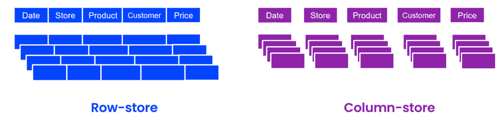

图片由作者提供

如上图所示，列式数据库以与传统行存储数据库不同的方式存储和压缩数据。列式数据库针对垂直数据扫描进行了优化，这意味着每个列都以自己的方式结构化，并且物理上与其他列分离！

由于深入分析行存储数据库与列存储数据库之间的优缺点需要单独的文章系列，因此我仅指出一些关于性能的关键差异。

在列式数据库中，单列访问速度快且有效。一旦计算开始涉及多个列，事情就会变得更加复杂，因为中间步骤的结果需要以某种方式临时存储。

简单来说，列式数据库更注重 CPU 性能，而行存储数据库则增加了 I/O，因为需要扫描大量无用的数据。

到目前为止，我们已经描绘了一个架构的大图，使得 Power BI 能够作为终极 BI 工具充分展现其光芒。现在，我们准备深入探讨具体的架构解决方案，并利用这些知识来最大限度地发挥我们的 Power BI 报告的优势，通过调整我们的数据模型来从底层引擎中提取最大价值。

## 在 Power BI 中的 VertiPaq 内——压缩以成功！


如您可能从本文的前一部分所回忆的，我们只是触及了 VertiPaq 这个强大存储引擎的表面，它是“负责”您大多数 Power BI 报告（无论您使用的是导入模式还是复合模型）的闪电般快速性能的。

## 3，2，1…系好安全带！

VertiPaq 的一个关键特性是它是一个列式数据库。我们了解到列式数据库存储的数据是针对垂直扫描优化的，这意味着每一列都有其自己的结构，并且物理上与其他列分离。

这个事实使得 VertiPaq 能够独立地对每一列应用不同类型的压缩，根据该特定列中的值选择最优的压缩算法。

压缩是通过编码列中的值来实现的。但在我们深入探讨编码技术的详细概述之前，请记住，这种架构不仅与 Power BI 相关——在后台是一个 Tabular 模型，这也是 Analysis Services Tabular 和 Excel Power Pivot 的“幕后”。

## 值编码

这是最佳的价值编码类型，因为它仅与整数一起工作，因此比例如处理文本值时需要的内存更少。

在现实中这看起来是什么样子？假设我们有一个包含每天电话数量的列，该列中的值在 4,000 到 5,000 之间变化。VertiPaq 会做的是找到这个范围内的最小值（即 4,000）作为起点，然后计算这个值与其他列中所有其他值的差异，并将这个差异存储为新的值。

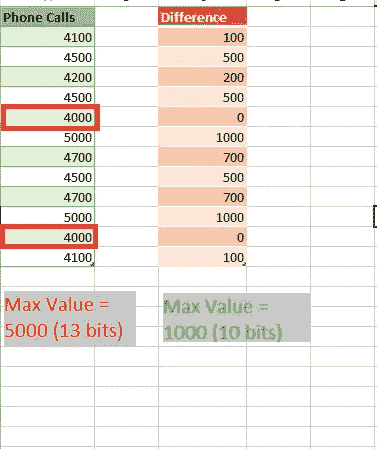

作者提供的图片

乍一看，每个值 3 位可能看起来并不像是一个显著的节省，但乘以数百万或数十亿行，你就会欣赏到节省的内存量。

正如我之前强调的，值编码仅应用于整数数据类型的列（货币数据类型也存储为整数）。

## 哈希编码（字典编码）

这可能是 VertiPaq 最常用的压缩类型。使用哈希编码，VertiPaq 创建一个包含某一列中所有不同值的字典，然后使用字典中的索引值替换“实际”值。

这里有一个例子来使事情更清晰：

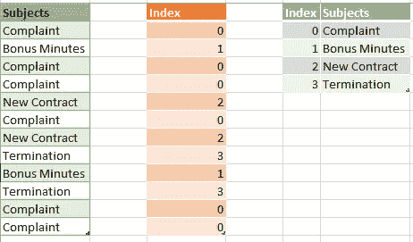

作者提供的图片

正如你可能注意到的，VertiPaq 在“主题”列中识别了不同的值，通过为这些值分配索引来构建字典，并最终将索引值作为指向“真实”值的指针存储。我假设你意识到整数值所需的内存空间远小于文本，这就是这种类型数据压缩背后的逻辑。

此外，由于 VertiPaq 能够为任何数据类型构建字典，它在实际上是不依赖于数据类型的！

**这引出了另一个关键点：无论你的列是文本、bigint 还是 float 数据类型——从 VertiPaq 的角度来看都是一样的——它需要为这些列中的每一个创建一个字典，这意味着所有这些列在速度和内存空间分配方面都将提供相同的性能！**当然，这是基于假设这些列之间的字典大小没有显著差异。

因此，关于列的数据类型影响数据模型中其大小的说法是一种神话。相反，列中不同值的数量，即所谓的**基数**，主要影响列的内存消耗。

## RLE (Run-Length-Encoding)

第三种算法（RLE）创建了一种映射表，包含重复值的范围，避免单独存储每个（重复的）值。

再次，通过查看一个示例将有助于更好地理解这个概念：

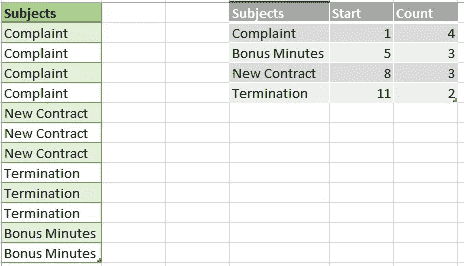

图片由作者提供

在现实生活中，VertiPaq 不会存储起始值，因为它可以通过累加之前的计数值快速计算出下一个节点开始的位置。

虽然乍一看可能看起来很强大，但 RLE 算法高度依赖于列内的排序。如果数据以示例中所示的方式存储，RLE 将表现得很好。然而，如果你的数据桶较小且旋转更频繁，那么 RLE 可能不是最佳解决方案。

关于 RLE 还有一点需要注意：实际上，VertiPaq 不会以图中所示的方式存储数据。首先，它执行哈希编码并创建主题的字典，然后应用 RLE 算法，因此其最终逻辑在最简化的方式下可能如下所示：

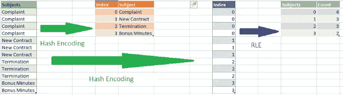

图片由作者提供

因此，RLE 发生在值或哈希编码之后，在这些 VertiPaq“认为”有进一步压缩数据意义的场景中（当数据以 RLE 能够实现更好压缩的方式排序时）。

## 重新编码考虑事项

无论 VertiPaq 多么“智能”，它也可能基于错误的假设做出一些不良决策。在解释重新编码的工作原理之前，让我简要地回顾一下特定列的数据压缩过程：

+   VertiPaq 从列中扫描一行样本

+   如果列的数据类型不是整数，它将不再进一步查看并使用哈希编码

+   如果列是整数数据类型，还会评估一些额外的参数：如果样本中的数字线性增加，VertiPaq 假设它可能是一个主键，并选择值编码

+   如果列中的数字彼此之间相对接近（数字范围不是很宽，比如我们上面的例子中每天有 4,000 到 5,000 个电话），VertiPaq 将使用值编码。相反，当值在范围内显著波动（例如在 1,000 到 1,000,000 之间）时，值编码就不适用了，VertiPaq 将应用哈希算法。

然而，有时会发生这样的情况，VertiPaq 会根据样本数据来决定使用哪种算法，但随后出现了一些异常值，它需要从头开始重新编码列。

让我们用之前的电话通话次数的例子来说明：VertiPaq 扫描样本并选择应用值编码。然后，在处理了 1000 万行之后，突然发现了一个 500,000 的值（这可能是一个错误，或者任何其他原因）。现在，VertiPaq 重新评估了选择，并可能决定使用哈希算法重新编码列。当然，这将对整个处理过程所需的时间产生影响。

最后，这里列出了 VertiPaq 在选择使用哪种算法时考虑的参数列表（按重要性排序）：

+   列中的唯一值数量（基数）

+   列中的数据分布——具有许多重复值的列可以比包含频繁变化值的列更好地压缩（可以应用 RLE）

+   表中的行数

+   列数据类型——仅影响字典大小

## 将数据模型大小减少 90%——真实故事！

在我们为理解 VertiPaq 存储引擎背后的架构以及它使用哪些类型的数据压缩来优化 Power BI 数据模型奠定理论基础之后，现在是时候动手实践并将我们的知识应用于实际案例了！

## 起始点 = 776 MB

我们的数据模型相当简单，但内存密集。我们有一个事实表（factChat），其中包含实时支持聊天的数据，以及一个维度表（dimProduct），它与事实表相关联。我们的事实表大约有 900 万行，这对 Power BI 来说不应该是个大问题，但表是直接导入的，没有任何额外的优化或转换。

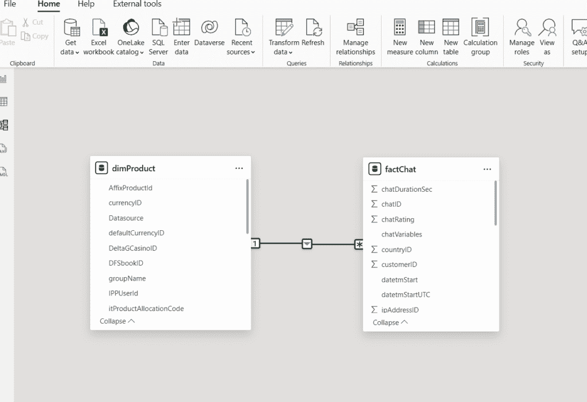

图片由作者提供

现在，这个 pbix 文件消耗了惊人的 777 MB！你无法相信？只需看看：

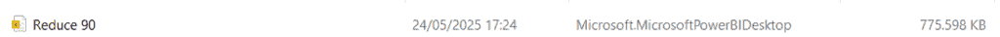

图片由作者提供

只需记住这张图片！当然，我无需告诉你这个报告需要多长时间来加载或刷新，以及由于文件大小，我们的计算速度有多慢。

## ……而且情况甚至更糟！

此外，不仅仅是 776 MB 的内存消耗，因为内存消耗的计算考虑了以下因素：

+   PBIX 文件

+   词典（你已经在本文的前几节中了解了词典）

+   列层次结构

+   用户定义的层次结构

+   关系

现在，如果打开任务管理器，转到详细信息标签页，找到 msmdsrv.exe 进程，我会看到它消耗了超过 1 GB 的内存！

哎，这真的很痛苦！而且我们还没有与报告互动过！所以，让我们看看我们可以做些什么来优化我们的模型…

## 规则#1 — 只导入你真正需要的列

第一条也是最重要的规则是：**在你的数据模型中只保留那些你真正需要的列！**

话虽如此，我真的需要 chatID 列，它是一个代理键，以及 sourceID 列，它是源系统的主键吗？这两个值都是唯一的，所以即使我需要计算聊天的总数，我也只需要其中一个。

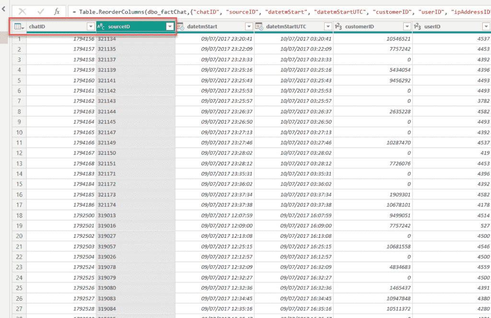

图片由作者提供

所以，我将删除 sourceID 列，并检查文件现在看起来如何：


图片由作者提供

通过仅仅删除一个不必要的列，我们就节省了超过 100 MB！！！让我们进一步检查可以删除的内容，而不需要深入查看（我保证我们稍后会做到这一点）。

我们真的需要同时存储聊天原始开始时间和 UTC 时间，一个存储为日期/时间/时区类型，另一个存储为日期/时间，并且两者都达到秒级精度吗？！！

让我删除原始开始时间列，只保留 UTC 值。


图片由作者提供

通过仅仅删除我们不需要的两列，我们就减少了文件大小的 30%！

现在，这还没有考虑到内存消耗的细节。现在，让我们打开[DAX Studio](https://daxstudio.org/)，这是我最喜欢的用于调试 Power BI 报告的工具。正如我已经多次强调的那样，如果你打算认真使用 Power BI，这个工具是必不可少的——而且它是完全免费的！

DAX Studio 中的一个功能是[VertiPaq Analyzer](https://www.sqlbi.com/tools/vertipaq-analyzer/)，这是一个由 sqlbi.com 的 Marco Russo 和 Alberto Ferrari 构建的非常有用的工具。当我用 DAX Studio 连接到我的 pbix 文件时，这里是我的数据模型大小相关的数字：

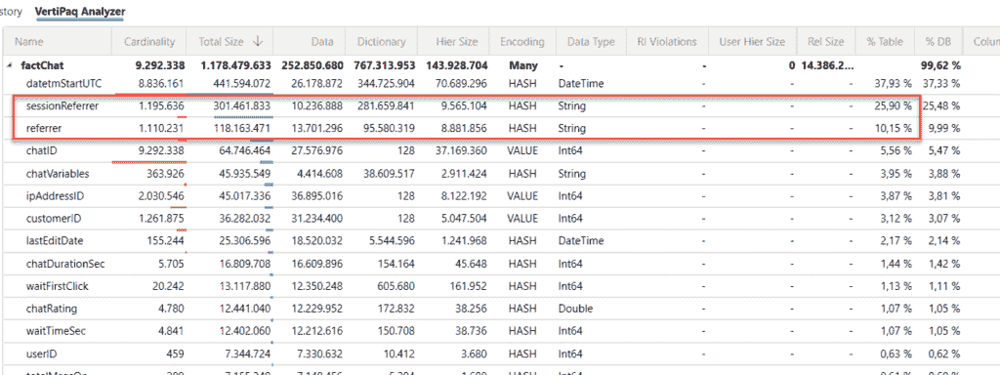

图片由作者提供

我可以看到在我数据模型中最昂贵的列是什么，并决定是否可以丢弃其中的一些，或者是否需要保留所有这些。

初看之下，我几乎没有可以删除的候选者——*sessionReferrer*和*referrer*列具有高基数，因此无法进行最优压缩。此外，由于这些是文本列，需要使用哈希算法进行编码，你可以看到它们的字典大小非常高！如果你仔细观察，你会发现这两个列几乎占了我的表大小的 40%！

在与我的报告用户确认他们是否需要这些列，或者可能只需要其中之一后，我得到了确认，他们根本不会对这些列进行任何分析。那么，我们为什么要让我们的数据模型因为这些列而膨胀呢？！

另一个值得删除的候选列是 LastEditDate 列。这个列仅显示记录在数据仓库中最后编辑的日期和时间。同样，我检查了报告用户，他们甚至不知道这个列的存在！

我移除了这三列，结果是：


图片由作者提供

哦，上帝，我们仅仅通过移除一些不必要的列就减半了我们的数据模型大小。

事实上，还有几列可以从数据模型中删除，但现在让我们专注于其他数据模型优化技术。

## 规则 #2 — 减少列基数！

如您从文章的前一部分所回忆的那样，经验法则是：列的基数越高，VertiPaq 越难最优地压缩数据。尤其是如果我们不处理整数值时。

让我们更深入地查看 VertiPaq 分析器结果：

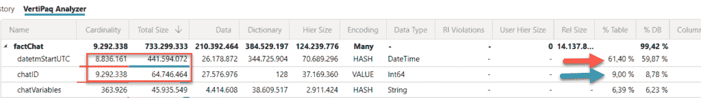

图片由作者提供

如您所见，即使 chatID 列的基数比 datetmStartUTC 列高，它的内存占用几乎减少了 7 倍！由于它是一个代理键整数值，VertiPaq 应用值编码，字典的大小无关紧要。另一方面，对于具有高基数的日期/时间数据类型的列，正在应用哈希编码，因此字典的大小会大大增加。

减少列基数有多种技术，例如拆分列。这里有一些使用这种技术的例子。

对于整数列，您可以使用除法和取模运算将它们拆分为两个相等的列。在我们的例子中，将是：

```py
SELECT chatID/1000 AS chatID_div
,chatID % 1000 AS chatID_mod……….
```

这种优化技术必须在源端执行（在这种情况下，通过编写 T-SQL 语句）。如果我们使用计算列，那么根本没有任何好处，因为原始列必须首先存储在数据模型中。

当列中有小数值时，类似的技巧可以带来显著的节省。您可以简单地按照本文中解释的方式在小数点前后拆分值。[这篇文章](https://www.fourmoo.com/2019/11/27/how-i-saved-40-on-my-power-bi-dataset-size/)。

由于我们没有小数值，让我们专注于我们的问题——优化 datetmStartUTC 列。优化这个列有多个有效选项。第一个是检查您的用户是否需要比日级别更高的粒度（换句话说，您是否可以从数据中移除小时、分钟和秒）。

让我们来看看这个解决方案会带来哪些节省：


图片由作者提供

我们首先注意到，我们的文件现在已经是 271 MB，是原来大小的 1/3。VertiPaq 分析器的结果显示，这个列现在几乎已经完全优化，从占用超过 62%的数据模型到仅仅超过 2.5%！这太棒了！

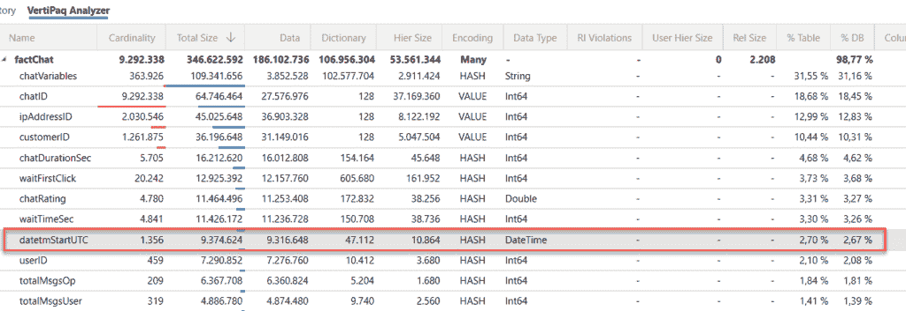

图片由作者提供

然而，看起来日粒度不够细，用户需要按小时分析数据。好吧，我们至少可以去掉分钟和秒，这也会减少列的基数。

因此，我已经导入了每小时四舍五入的值：

```py
SELECT chatID
                ,dateadd(hour, datediff(hour, 0, datetmStartUTC), 0) AS datetmStartUTC
                ,customerID
                ,userID
                ,ipAddressID
                ,productID
                ,countryID
                ,userStatus
                ,isUnansweredChat
                ,totalMsgsOp
                ,totalMsgsUser
                ,userTimezone
                ,waitTimeSec
                ,waitTimeoutSec
                ,chatDurationSec
                ,sourceSystem
                ,subject
                ,usaccept
                ,transferUserID
                ,languageID
                ,waitFirstClick
            FROM factChat
```

看起来我的用户也不需要 chatVariables 列来进行分析，所以我也将它从数据模型中移除了。

最后，在数据加载选项中禁用[自动日期/时间](https://data-mozart.com/powerbi/tiq-part-1-how-to-destroy-your-power-bi-model-with-auto-date-time/)后，我的数据模型大小大约是 220 MB！然而，还有一件事让我感到烦恼：chatID 列仍然占据了表格大约 1/3 的空间。而这只是一个代理键，在我的数据模型中的任何关系中都没有被使用。

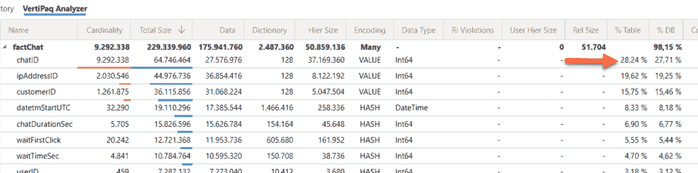

图片由作者提供

所以，这里我正在检查两种不同的解决方案：第一个方案是简单地删除这个列，并使用 GROUP BY 子句来聚合聊天数量。然而，保留 chatID 列没有任何好处，因为在我们数据模型中的任何地方都没有使用它。当我最后一次从模型中移除它后，让我们检查 pbix 文件的大小：


图片由作者提供

请回忆一下我们开始时的数据量：776 MB！所以，我通过应用一些简单的技术，使 VertiPaq 存储引擎能够对数据进行更优化的压缩，成功将我的数据模型大小减少了近 90%。

这是我去年遇到的一个真实案例！

## 减小数据模型大小的通用规则

总结一下，以下是在尝试减小数据模型大小时你应该记住的一些通用规则：

+   **只保留用户在报告中需要的列！**我相信，仅仅遵循这一条规则，你就能节省难以置信的空间…

+   **尽可能优化列的基数。**这里的黄金规则是：测试，测试，测试…如果从分割一个列到两个列，或者用两个整数列替换一个十进制列等，有显著的收益，那么就去做！但是，也要记住，你需要重写你的度量来处理这些结构变化，以便显示预期的结果。所以，如果你的表不大，或者你必须重写数百个度量，那么分割列可能不值得。就像我说的，这取决于你的具体场景，你应该仔细评估哪种解决方案更有意义。

+   与列相同，**只保留您需要的那些行**：例如，可能您不需要导入过去 10 年的数据，而只需要 5 年！这也会减小您的数据模型大小。在与用户交谈之前，先询问他们真正需要什么，然后再盲目地将所有内容放入您的数据模型中

+   **尽可能进行数据聚合**！这意味着——行数更少，基数更低，这样您就能实现所有想要达到的美好效果！如果您不需要小时、分钟或秒级别的粒度，就别导入它们！Power BI（以及一般意义上的 Tabular 模型）中的聚合是一个非常重要且广泛的话题，但这超出了本系列的范畴，但我强烈推荐您查看 [Phil Seamark 的博客](https://dax.tips/2019/10/18/creative-aggs-part-i-introduction/) 以及他关于创意聚合使用的一系列帖子

+   尽可能避免使用 DAX 计算列，因为它们没有被最优压缩。相反，尝试将所有计算推送到数据源（例如 SQL 数据库）或使用 Power Query 编辑器执行

+   **使用适当的数据类型**（例如，如果您的数据粒度在日级别，就没有必要使用日期/时间数据类型。日期数据类型就足够了）

+   **禁用数据加载的自动日期/时间选项**（这将删除在后台自动创建的一堆日期表）

## 结论

在您学习了 VertiPaq 存储引擎的基本原理以及它用于数据压缩的不同技术之后，我想通过向您展示一个真实生活中的例子来结束这篇文章，这个例子展示了我们如何“帮助” VertiPaq（以及随之而来的 Power BI）获得最佳报告性能和最优资源消耗。

感谢阅读，希望您喜欢这篇文章！
