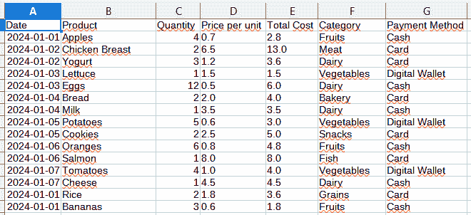
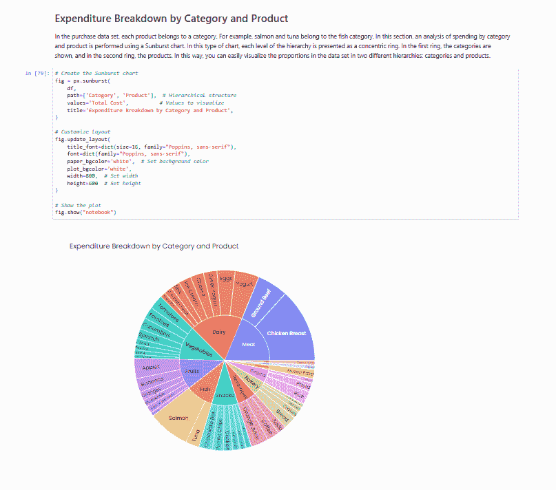

# 如何使用 Python 脚本运行 Jupyter Notebooks 并生成 HTML 报告

> 原文：[`towardsdatascience.com/how-to-run-jupyter-notebooks-and-generate-html-reports-with-python-scripts-48e0d96a30ed/`](https://towardsdatascience.com/how-to-run-jupyter-notebooks-and-generate-html-reports-with-python-scripts-48e0d96a30ed/)

[Christopher Gower](https://unsplash.com/es/@cgower) **** in Unsplash

**Jupyter Notebooks 是一种广泛使用的快速分析解决方案**。作为使用脚本创建代码的替代方案，它们允许您逐步结构化代码并可视化每个代码块的输出。然而，**它们也是创建报告的强大且有时被低估的工具**。Jupyter Notebooks 允许您**将代码与丰富的文本和交互式可视化相结合**，可以轻松导出为多种格式，包括 HTML。这样，非技术受众，他们可能没有在计算机上安装集成开发环境，并且对分析中使用的代码没有兴趣，也可以轻松通过浏览器访问结果。

此外，在许多项目中，**结合使用 Jupyter Notebooks 和 Python 脚本和管道**。这些 Jupyter Notebooks 通常用于创建支持脚本中执行分析的交互式报告。因此，笔记本的执行与管道的执行同时进行是很有趣的，这样当我们更新，例如，几个数据集时，交互式报告也会更新，确保它们始终显示最新的可用数据。

在本文中，**我们将创建一个模拟我们在超市年度购买的合成数据集**。此外，我们还将创建一个交互式报告，其中将分析购买情况。随后，我们将模拟使用新购买更新此数据集。**在更新数据集的同时，我们还将从 Python 脚本中更新交互式报告**。所有这些都将无需手动运行笔记本并导出为 HTML 文件。

* * *

## 合成数据创建

**本文中创建的交互式报告使用的是 LLMs 生成的合成数据**。创建的数据模拟了超市的购买，并包含以下列：

+   **日期**：在超市购买产品的日期。格式为 YYYY-MM-DD（例如，2024-01-01）。

+   **产品**：产品名称（例如，苹果、酸奶或三文鱼）。

+   **数量**：以购买产品单位计的数量（例如，2）。

+   **单价**：产品每单位的价格（例如，0.5）。

+   **总成本**：购买产品的总价，即数量乘以产品的单价（例如，2 * 0.5 = 1）。

+   **类别**：产品类别或类型（例如，肉类或鱼类）。

+   **支付方式**：购买时使用的支付方式。存在三种可能的支付方式：卡、现金或数字钱包。

使用的模型属于 Mistral 公司，这是一家法国初创公司，负责开发大型语言模型和其他基于人工智能的技术。**大型语言模型可以用于生成合成数据，以现实地模拟某些结构，例如本例中的超市购买**。这些数据可以用于测试应用程序、优化算法或训练人工智能模型。**本文使用数据测试了当数据集更新时，从 Jupyter Notebook 生成 HTML 报告的自动化**。

**为了生成合成数据，我们需要在提示中提供关于我们想要哪种输出数据的详细信息**。此提示将被发送到大型语言模型，它将响应数据集。

提示被分为三个部分：

+   **数据集规范**：本部分简要总结了您想要生成的数据集的内容。数据集的列及其内容被指定。

+   **数据生成说明**：本节详细说明了大型语言模型在生成输出响应时需要遵循的指令。例如，在本例中，需要生成仅包含 JSON 输出的内容，以便稍后轻松将其转换为 DataFrame。还要求生成的输出集应足够多样化。

+   **输出示例**：提供了一些输出示例，以便大型语言模型更容易理解要生成数据的结构。

设计提示的过程不是线性的。需要生成一个初始提示并多次测试模型的响应。根据模型生成的响应质量，提示将进行调整。

一旦设计好提示，我们还必须创建一个与 Mistral 大型语言模型交互的函数。`generate_synthetic_data`函数是一个通用函数，可以与不同的 Mistral 提示和模型一起使用。

最后，创建了`convert_api_response_to_dataframe`函数，负责将 JSON 输出格式转换为 DataFrame。上述所有函数都在`synthetic_data_utils.py`文件中定义。

上述定义的函数用于生成初始合成数据。**初始数据模拟了 2024 年 1 月的前四周内的购买情况**。随后，我们将使用这些函数生成新周的合成数据。目标是，当生成新的合成数据时，不仅包含所有年度购买的数据库将得到更新，而且 Jupyter Notebook 中创建的报告以及从该笔记本生成的 HTML 也将得到更新。

函数 `generate_initial_data` 生成 2024 年前四周的购买数据。文件 `run_generate_initial_data.py` 负责执行此函数。该文件定义了在此情况下使用的大型语言模型，即 `mistral-large-2407`，并将输出数据存储在文件 `supermarket_purchases_data.csv` 中。**此文件包含所有年度购买数据，并将是随后用新数据更新的文件**。

运行文件 `run_generate_initial_data.py` 后，我们可以检查初始数据是否已正确生成。以下图像显示了数据的结构，这与提示中提供的指示相一致。

根据提示中提供的指令生成的数据结构（图片由作者提供）

## 在 Jupyter Notebook 中生成报告

**年度购买数据将用于在 Jupyter Notebook 中创建一个交互式报告，使我们能够跟踪购买情况**。购买数据将每周更新，我们希望创建的报告与数据更新的同时更新，无需打开 Jupyter Notebook，执行所有单元格，保存结果，然后生成相应的 HTML 文件。我们将从 Python 自动化整个流程。

下一个部分详细解释了在更新 `supermarket_purchases_data.py` 文件中的数据时，如何自动化运行 Jupyter Notebook 并创建 HTML 文件的过程。现在，我们将专注于理解交互式报告是如何生成的。

Jupyter Notebooks 是创建交互式报告的一个有趣的替代方案，即使是非技术用户也可以使用。它们允许你创建不显示代码的报告，只显示文本、解释和图形。此外，它可以导出为 HTML 文件，使用户能够轻松地在浏览器中打开没有安装集成开发环境的计算机上的结果。

本文创建的报告将是简单的。这是一个基本示例，用于展示自动化过程。报告由四个部分组成：

+   **数据集结构**：本节以表格形式展示了数据集的结构。这使用户能够理解数据是如何存储的，从而进行后续分析。

+   **每日支出和累计年度支出**：对于购买的每个产品，都指定了购买日期。本节对全年的每日支出以及累计年度支出进行了分析，即迄今为止已花费的金额。为了展示这些结果，使用了 Plotly 库的折线图。其中一条线代表每日支出，另一条线代表累计年度支出。可视化有两个不同的 y 轴：左侧的 y 轴显示每日支出，右侧的 y 轴显示累计年度支出。

+   **按类别和产品划分的支出明细**：在购买数据集中，每个产品属于一个类别。例如，三文鱼和金枪鱼属于鱼类类别。在本节中，使用旭日图对按类别和产品进行的支出分析。在这种图表中，层次结构的每一级都表示为一个同心圆。在第一环中显示类别，在第二环中显示产品。这样，你可以轻松地可视化数据集中两个不同层次的比例：类别和产品。

+   **按支付方式划分的支出明细**：最后，对使用的支付方式进行了一项分析。用户总共使用了三种支付方式：数字钱包、现金和卡。为了可视化使用这些支付方式的支出总额，使用了饼图。

以下链接显示了交互式报告。在这个笔记本中，你可以查看用于生成上述三个分析的代码。当向 `supermarket_purchases_data.csv` 文件添加新数据时，此报告将进行更新。

> [**nbviewer 上的笔记本**](https://nbviewer.org/gist/amandaiglesiasmoreno/6871eec693a44681ea83525f7b6b5392)

报告中由 Jupyter Notebook 生成的部分（图片由作者提供）

## 使用 Python 进行 Jupyter Notebook 执行和 HTML 报告生成

在 Jupyter Notebook 中创建的报告分析了迄今为止在超市进行的购买，这些购买存储在数据集 `supermarket_purchases_data.csv` 中。

目标是每次数据集更新时运行此报告并创建一个更新的 HTML 文件。为此，将创建以下两个模块：

+   `execute_notebook.py`：此模块负责执行作为输入参数提供的 Jupyter Notebook。它使用 `subprocess.run` 通过 `jupyter nbconvert` 执行笔记本，以便用执行结果覆盖原始笔记本。

+   `convert_notebook_to_html.py`：此模块负责将 Jupyter Notebook 转换为 HTML 文件，生成的文件中省略了包含代码的单元格。生成的 HTML 报告存储在位于笔记本文件夹同一级别的 reports 文件夹中。

    这些函数正是将在更新`supermarket_purchases_data.csv`文件的新数据时同时执行的那些函数。以下模块模拟了使用 2 月第一周购买的更新数据。

    该模块与前面两个模块同时使用，以确保当数据更新时，Jupyter Notebook 也会运行，并且 HTML 报告也会更新。

    以这种方式，你可以看到，仅仅通过两个函数：一个负责执行 Jupyter Notebook，另一个负责将 Jupyter Notebook 转换为 HTML 格式，你可以确保我们所有的笔记本，我们在其中执行项目中的替代分析，都会随着我们创建的数据集的更新而更新。

以下是执行所有上述脚本所需的整个文件夹结构。还提供了一个到 GitHub 仓库的链接。

## 文件和文件夹结构

在整篇文章中，管道文件的代码已被展示。这些文件被组织在四个文件夹中：

+   **data**: 这个文件夹包含创建的 CSV 文件。在这种情况下，将只创建一个文件，`supermarket_purchases_data.csv`。该文件是通过 LLM 合成的，显示了在超市购买的食品产品。

+   **notebooks**: 这个文件夹包含项目的 Jupyter Notebooks。在这种情况下，我们只有一个名为`analysis_purchases.ipynb`的笔记本。这个 Jupyter Notebook 包括对超市购物数据的分析。

+   **reports**: 这个文件夹包含从 Jupyter Notebooks 创建的交互式报告，以 HTML 格式。在这种情况下，只有一个交互式报告，称为`analysis_purchases.html`。该报告包含与同名笔记本相同的信息；然而，用于生成不同可视化的代码在报告中并未展示。

+   **scripts**: 这个文件夹包含所有管道脚本。以下文件可用：

1.  **`synthetic_data_utils.py`**: 这个模块包含生成模拟超市购物的合成数据所需的所有必要函数。这些函数将用于生成初始数据集，并创建对该数据集的假设更新。

1.  **`generate_initial_data.py`**: 这个模块负责创建一个模拟 2024 年 1 月前四周在超市进行的购买的合成数据集。

1.  **`run_generate_initial_data.py`**: 这个模块执行创建初始合成数据并将结果保存到 CSV 文件中所需的代码。

1.  **`execute_notebook.py`:** 这个模块以编程方式模拟执行 Jupyter Notebook。

1.  **`convert_notebook_to_html.py`:** 这个模块以编程方式模拟将 Jupyter Notebook 转换为 HTML 报告。

1.  **`update_data.py`**: 这个模块模拟了使用与 2024 年 2 月第一周对应的新的购买数据更新数据。

1.  **`process_pipeline.py`**：此模块模拟数据的更新，同时执行 Jupyter Notebook 及其转换为 HTML 格式的操作。

所有这些文件都可以从以下 GitHub 仓库下载。

> [**GitHub – amandaiglesiasmoreno/automated-notebook-reports: 这个仓库演示了如何使用…**](https://github.com/amandaiglesiasmoreno/automated-notebook-reports)

GitHub 仓库已经包含了名为`supermarket_purchases_data.csv`的文件，其中包含了 1 月份前四周的购买数据；也就是说，已经执行了`run_generate_initial_data.py`脚本。现在，我们只需要运行`process_pipeline.py`文件。这个文件模拟数据更新，并执行运行 Jupyter Notebook 以及将其转换为 HTML 文件的所需文件。

* * *

**Jupyter Notebooks 是向非技术受众展示分析结果的一个易于运行的解决方案**。它们允许您**将代码与丰富的文本和交互式可视化相结合，并以 HTML 等格式导出结果，这些格式只需在您的计算机上安装浏览器即可**。

在**Jupyter Notebooks 中的分析通常与在脚本中执行的代码相结合**。因此，需要寻找允许从 Python 脚本中运行这些笔记本的解决方案，以便 Jupyter Notebook 中执行的工作流程和分析不会在执行过程中解耦。

本文生成了一组模拟超市购物的合成数据集。使用 Jupyter Notebook，从这个数据集中创建了一个交互式的 HTML 格式报告，其中分析了超市到目前为止的购买情况。**实现了一个工作流程，以便每次更新包含所有超市购买数据的文件时，都会执行 Jupyter Notebook，并更新 HTML 格式的交互式报告**。

这样，**我们确保从数据创建的交互式报告始终显示最新的数据，并且是从更新的数据集中生成的**。这是一个简单的例子，但同样的概念可以应用于包含更多数据集和交互式报告的大型项目。

感谢阅读。

安德拉·伊格莱西亚斯
