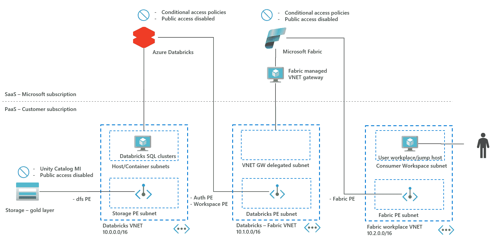
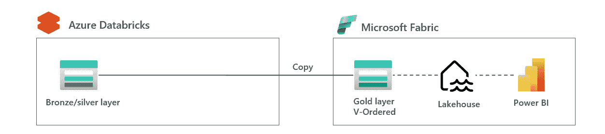
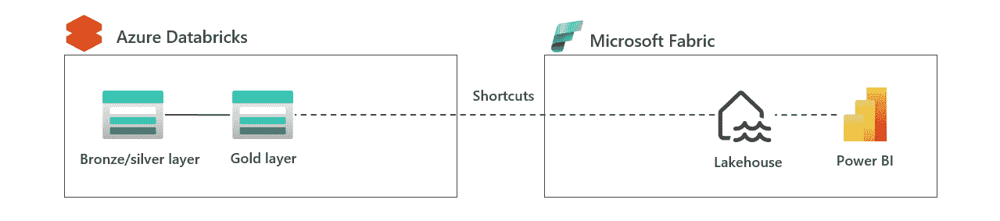
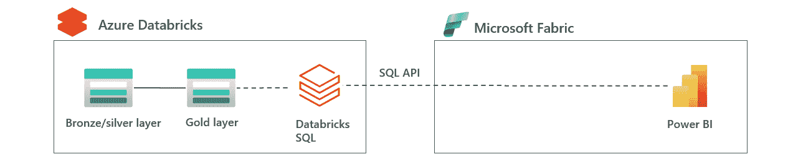
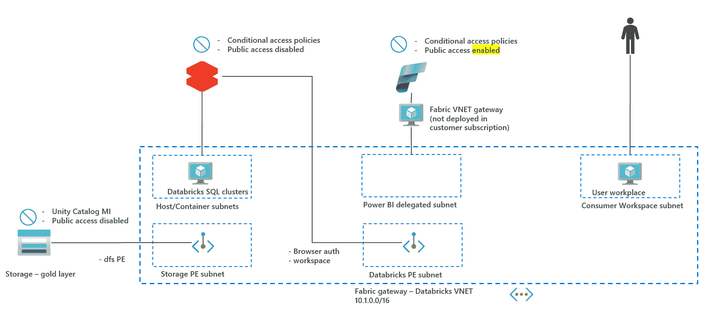

# 如何安全地将 Microsoft Fabric 连接到 Azure Databricks SQL API

> 原文：[`towardsdatascience.com/how-to-securely-connect-microsoft-fabric-to-azure-databricks-sql-api-50d363c71104/`](https://towardsdatascience.com/how-to-securely-connect-microsoft-fabric-to-azure-databricks-sql-api-50d363c71104/)

连接计算 – 图片由[Alexandre Debiève 在 Unsplash](https://unsplash.com/@alexkixa)提供

### 1\. 简介

Microsoft Fabric 和 Azure Databricks 都是数据分析领域的巨头。这些平台可以从数据摄入到为最终用户创建数据产品的端到端[勋章架构](https://dataengineering.wiki/Concepts/Medallion+Architecture)中使用。Azure Databricks 由于其处理大型数据集和填充湖屋不同区域的能力，在初始阶段表现突出。Microsoft Fabric 在数据被消费的后阶段表现良好。由于来自 Power BI，SaaS 设置易于使用，并为最终用户提供自助服务功能。

考虑到这些产品的不同优势以及许多客户没有全新环境的情况，战略决策可以是集成这些产品。然后，你必须找到一个逻辑集成点，让这两个产品“相遇”。这应该以安全为前提，因为这是所有企业的首要任务。

这篇博客文章首先探讨了三种不同的集成选项：湖屋分割、虚拟化加快捷方式以及通过 SQL API 暴露。SQL API 是后端和前端之间的一个常见集成点，该集成点的安全架构在第三章中进行了更详细的讨论。请参见下方的架构图。

Securely Connect Microsoft Fabric to Azure Databricks SQL API – 图片由作者提供

### 2\. Azure Databricks – Microsoft Fabric 集成概述

在深入探讨保护 SQL API 架构的细节之前，简要讨论将 Azure Databricks 和 Microsoft Fabric 集成的不同选项是有帮助的。本章概述了三种选项，并突出了它们的优缺点。对于更广泛的概述，请参阅这篇[博客](https://piethein.medium.com/integrating-azure-databricks-and-microsoft-fabric-0030d3cf5156)。

**2.1 湖屋分割：Databricks 中的青铜、银区** | **Fabric 中的金区**

在此架构中，你可以看到数据由 Databricks 处理至银区。Fabric 通过[V-Ordering](https://learn.microsoft.com/en-us/fabric/data-engineering/delta-optimization-and-v-order?tabs=sparksql)将数据复制并处理到 Fabric 的金区。金区数据通过 Fabric 湖屋暴露，以便为最终用户创建数据产品，请参见下方的图片。

2.1 Lakehouse 分区：Databricks 中的青铜、银区 | Fabric 中的金区 – 图片由作者提供

此架构的优势在于数据针对 Fabric 中的数据消费进行了优化。劣势在于 Lakehouse 在两个工具之间分割，这增加了复杂性，并可能在数据治理（Unity Catalog 用于青铜/银，但不用于金）中带来挑战。

此架构最适用于那些非常重视 Microsoft Fabric 中的数据分析的公司，甚至可能最终希望将整个 Lakehouse 迁移到 Microsoft Fabric。

**2.2 虚拟化：Databricks 中的 Lakehouse** | **Fabric 的快捷方式**

在此架构中，所有在 Lakehouse 中的数据都由 Databricks 处理。数据通过 [ADLSgen2 快捷方式](https://learn.microsoft.com/en-us/fabric/onelake/create-adls-shortcut)或甚至 Fabric 中的[镜像 Azure Databricks Unity Catalog](https://learn.microsoft.com/en-us/fabric/database/mirrored-database/azure-databricks)进行虚拟化，也请参考下面的图片。

2.2 虚拟化：Databricks 中的 Lakehouse | Fabric 的快捷方式 – 图片由作者提供

此架构的优势在于 Lakehouse 由单一工具拥有，这减少了集成和治理的挑战。劣势在于数据未针对 Fabric 的消费进行优化。在这种情况下，你可能需要在 Fabric 中添加额外的副本以应用 V-Ordering，从而优化对 Fabric 的消费。

此架构最适用于希望保持 Lakehouse 由 Databricks 拥有，并希望允许最终用户在 Fabric 中进行数据分析的公司，其中 V-Ordering 的缺乏不是一个大问题。后者可能是真的，如果数据量不是很大，或者最终用户无论如何都需要数据副本。

**2.3 暴露 SQL API：Databricks 中的 Lakehouse** | **SQL API 到 Fabric**

在此架构中，所有在 Lakehouse 中的数据都由 Databricks 再次处理。然而，在此架构中，数据通过 SQL API 暴露给 Fabric。在此，你可以选择使用专门的 Databricks SQL Warehouse 或 [无服务器 SQL](https://learn.microsoft.com/en-us/azure/databricks/admin/sql/serverless)。与上一个要点中的快捷架构相比，主要区别在于数据处理是在 Databricks 而不是 Fabric 中进行的。这可以比作当一个网络应用程序向数据库发送 SQL 查询时；查询是在数据库中执行的。

2.3 暴露 SQL API：Databricks 中的 Lakehouse | SQL API 到 Fabric – 图片由作者提供

此架构的优势在于，数据湖屋由单个工具拥有，这减少了集成和治理的挑战。此外，与快捷方式相比，SQL API 为 Azure Databricks 和 Microsoft Fabric 之间提供了一个干净的接口，耦合度更低。缺点是 Fabric 中的最终用户仅限于 Databricks SQL，而 Fabric 仅用作报告工具，而不是分析工具。

此架构最适用于希望保持数据湖屋由 Databricks 拥有并希望利用 Microsoft Fabric 提供的 Power BI 功能来增强 Azure Databricks 的公司。

在下一章中，将讨论用于此 SQL API 集成的安全架构。

### 3. **暴露 SQL API：安全架构**

在本章中，将讨论此 SQL API 集成的安全架构。其理由是集成 SQL API 是后端和前端相遇的常见接触点。此外，大多数安全建议适用于之前讨论的其他架构。

**3.1 高级 SQL API 架构**

为了实现深度防御，网络隔离和基于身份的访问控制是两个最重要的步骤。您可以在下面的图中找到这些内容，该图已在博客的引言中提供。

3.1 安全连接 Azure Databricks SQL 到 MSFT Fabric – 作者图片

在此图中，突出了需要保护的三项关键连接性：ADLSgen2 – Databricks 连接，Azure Databricks – Microsoft Fabric 连接以及 Microsoft Fabric – 最终用户连接。在本节剩余部分，将讨论资源之间的连接性，重点关注网络和访问控制。

在此，不涉及讨论如何将 ADLSgen2、Databricks 或 Microsoft Fabric 作为产品本身进行保护。其理由是这三个资源都是主要的 Azure 产品，并提供了广泛的文档，说明如何实现这一点。本博客真正关注的是集成点。

**3.2 ADLSgen2 – Azure Databricks 连接**

Azure Databricks 需要使用启用了分层命名空间 (HNS) 的方式从 ADLSgen2 获取数据。ADLSgen2 作为存储使用，因为它提供了最佳的灾难恢复能力。这包括与 Azure 备份的点时间恢复集成，预计将在 2025 年推出，这提供了更好的针对恶意软件攻击和意外删除的保护。以下是一些适用的网络和访问控制实践。

**网络**：禁用了 Azure 存储的公共访问。为了确保 Databricks 可以访问存储帐户，在 Databricks VNET 中创建了私有端点。这确保了存储帐户不能从公司网络外部访问，并且数据保持在 Azure 基础设施上。

**基于身份的访问控制：** 存储账户只能通过身份访问，并且访问密钥已被禁用。为了允许 Databricks Unity Catalog 访问数据，需要使用外部位置授予 Databricks 访问连接器的身份访问权限。根据数据架构，这可以是整个容器的 RBAC 角色，也可以是针对数据文件夹的细粒度 ACL/POSIX 访问规则。

**3.3 Azure Databricks – Microsoft Fabric 连接：**

Microsoft Fabric 需要从 Azure Databricks 获取数据。这些数据将由 Fabric 用于服务最终用户。在此架构中，使用 SQL API。网络和身份访问控制点也适用于第 2.2 段中讨论的快捷架构。

**网络：** Azure Databricks 的公共访问已被禁用。这既适用于前端也适用于后端，因此集群部署时没有公共 IP 地址。为了确保 Microsoft Fabric 可以从网络角度访问通过 SQL API 公开的数据，需要部署数据网关。可以选择在 Databricks VNET 中部署虚拟机，但这是一个需要维护的 IaaS 组件，它本身就会带来安全挑战。更好的选择是使用[托管虚拟网络数据网关](https://learn.microsoft.com/en-us/data-integration/vnet/manage-data-gateways)，这是由 Microsoft 管理的，并提供连接性。

**基于身份的访问控制：** Azure Databricks 中的数据将通过 Unity Catalog 公开。Unity Catalog 中的数据应仅通过使用细粒度访问控制表和行级安全性的身份进行公开。目前尚无法使用 Microsoft Fabric 工作空间身份访问 Databricks SQL API。相反，应授予服务主体对 Unity Catalog 中数据的访问权限，并使用基于此服务主体的[个人访问令牌](https://learn.microsoft.com/en-us/azure/databricks/dev-tools/auth/pat#azure-databricks-personal-access-tokens-for-service-principals)在[Microsoft Databricks 连接器](https://learn.microsoft.com/en-us/fabric/data-factory/connector-databricks#supported-authentication-types)中使用。

**3.4 Microsoft Fabric – 最终用户连接：**

在此架构中，最终用户将通过 Microsoft Fabric 连接到 Microsoft Fabric 以访问报告并执行自助式 BI。在 Microsoft 内部，可以根据 Power BI 创建不同类型的报告。您可以应用以下基于网络和身份的访问控制。

**网络**：Microsoft Fabric 公共访问被禁用。目前，这只能在租户级别完成，因为更细粒度的 workspace 私有访问将在 2025 年成为可能。这可以确保公司可以区分私有和公共工作空间。为了确保最终用户可以访问 Fabric，在 workspace VNET 中创建了 Fabric 的私有端点。此工作空间可以通过 VPN 或 ExpressRoute 与企业本地网络对等连接。不同网络的分离确保了不同资源之间的隔离。

**基于身份的访问控制**：最终用户应根据需要了解的情况获取报告的访问权限。这可以通过创建一个单独的工作空间来实现，其中存储报告，并且用户可以访问。此外，用户仅应允许使用条件访问策略登录 Microsoft Fabric。这样，可以确保用户只能从加固的设备登录，以防止数据泄露。

**3.5 最后的评论**

在上一段中，描述了一个将所有内容都设置为私有，并使用多个 VNET 和跳转主机的架构。为了快速上手并测试这个架构，你可以决定使用以下简化的架构进行测试。

2.3.1 安全连接 Azure Databricks SQL 到 Microsoft Fabric – 图片由作者提供

在这个架构中，Fabric 被配置为启用公共访问。理由是 Fabric 公共访问设置目前是租户级别的设置。这意味着你需要将公司中的所有工作空间都设置为私有或公共。更细粒度的 workspace 私有访问将在 2025 年成为可能。此外，使用单个 VNET 来部署所有资源，以防止 VNET 之间的对等连接或部署多个跳转主机以实现连接。

### 4. 结论

Microsoft Fabric 和 Azure Databricks 都是数据分析领域的巨头。这两个工具都可以覆盖湖仓架构的所有部分，但这两个工具也有它们自己的优势。一个战略性的决策可能是将工具集成，特别是在非绿色情况下，并且这两个工具都在公司中使用。

讨论了三种不同的集成架构：湖仓分离、虚拟化快捷方式和通过 SQL API 暴露。前两种架构在你想更强调 Fabric 分析能力的情况下更为相关，而最后一种 SQL API 架构在你想专注于 Fabric Power BI 报告能力的情况下更为相关。

在本博客的剩余部分，提供了一个针对 SQL API 架构的安全架构，该架构侧重于网络隔离、私有端点和身份。尽管这个架构侧重于暴露 Databricks SQL 的数据，但安全原则也适用于其他架构。

**总之**：如果要将 Azure Databricks 与 Microsoft Fabric 集成，需要考虑许多因素。然而，始终应将安全性放在首位。本博客旨在通过使用 SQL API 作为实际示例，为您提供深入的了解。
