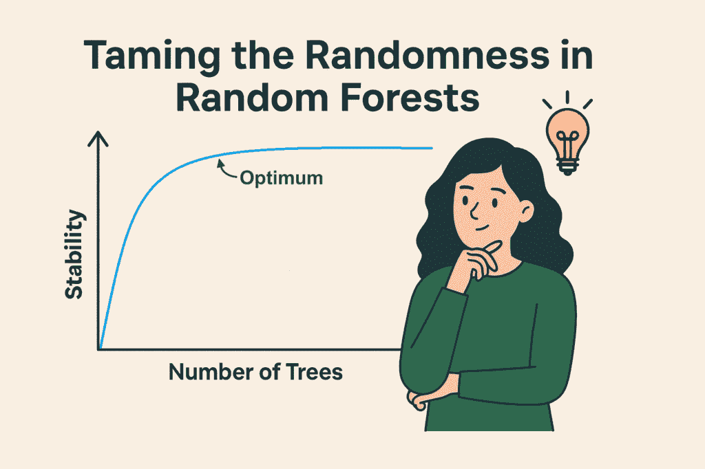
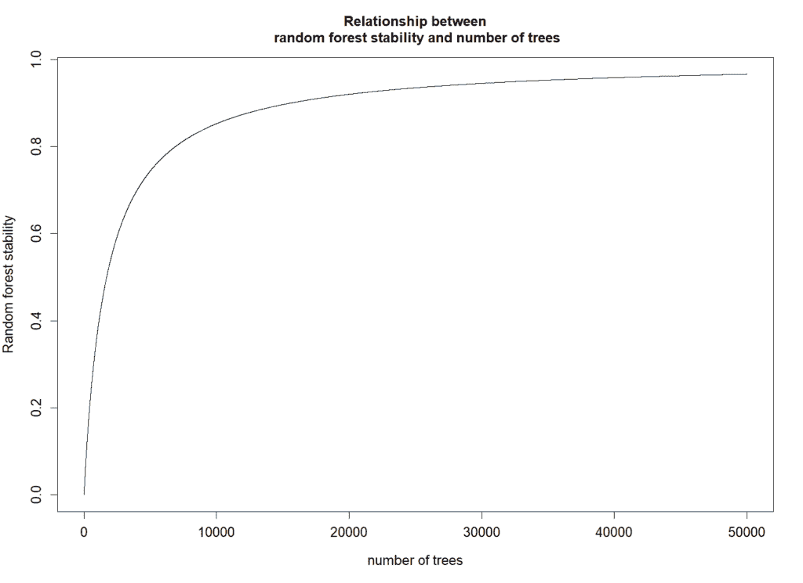

# 如何设置随机森林中的树的数量

> 原文：[`towardsdatascience.com/how-to-set-the-number-of-trees-in-random-forest/`](https://towardsdatascience.com/how-to-set-the-number-of-trees-in-random-forest/)

<details class="wp-block-details is-layout-flow wp-block-details-is-layout-flow"><summary>科学出版物</summary>

> T. M. Lange, M. Gültas, A. O. Schmitt & F. Heinrich (2025). optRF: 通过确定最佳树的数量来优化随机森林的稳定性。*BMC 生物信息学*，26(1)，95。
> 
> 点击此[链接](https://rdcu.be/efTbn)访问原始出版物。</details>

## <mdspan datatext="el1747427645692" class="mdspan-comment">随机森林——数据工作者强大的工具</mdspan> 

### 什么是随机森林？

你是否曾希望利用数据做出更好的决策——比如预测疾病风险、作物产量或发现客户行为中的模式？这就是机器学习发挥作用的地方，而这个领域中最易于访问且强大的工具之一就是所谓的随机森林。

那么为什么随机森林如此受欢迎呢？一方面，它极其灵活。它适用于许多类型的数据，无论是数字、类别还是两者兼而有之。它还广泛应用于许多领域——从预测医疗保健中的患者结果到检测金融中的欺诈，从改善在线购物体验到优化农业实践。

尽管名字叫随机森林，但它与森林中的树无关——但它确实使用了一种称为*决策树*的东西来进行智能预测。你可以把决策树想象成一个流程图，根据你给出的数据引导一系列是/否问题。随机森林创建了一大批这样的树（因此称为“森林”），每棵树略有不同，然后结合它们的结果来做出最终决定。这就像询问一群专家的意见，然后跟随多数人的投票一样。

但直到最近，一个问题仍未得到解答：我实际上需要多少个决策树？如果每个决策树都能导致不同的结果，平均许多树的结果将导致更好、更可靠的结果。但多少足够呢？幸运的是，optRF 包回答了这个问题！

那么，让我们看看如何优化随机森林以进行预测和变量选择！

## 使用随机森林进行预测

为了优化和使用随机森林进行预测，我们可以使用开源统计程序 R。一旦我们打开 R，我们必须安装两个 R 包“ranger”，它允许在 R 中使用随机森林，以及“optRF”来优化随机森林。这两个包都是开源的，可通过官方 R 仓库 CRAN 获取。为了安装和加载这些包，可以运行以下 R 代码行：

```py
> install.packages(“ranger”)
> install.packages(“optRF”)
> library(ranger)
> library(optRF)
```

现在包已经安装并加载到库中，我们可以使用这些包包含的函数。此外，我们还可以使用 optRF 包中包含的数据集，该数据集在 GPL 许可证下免费使用（就像 optRF 包本身一样）。这个名为 SNPdata 的数据集在第一列包含 250 个小麦植物的产量以及 5000 个基因组标记（所谓的单核苷酸多态性或 SNPs），这些标记可以包含值 0 或 2。

```py
> SNPdata[1:5,1:5]
            Yield SNP_0001 SNP_0002 SNP_0003 SNP_0004
  ID_001 670.7588        0        0        0        0
  ID_002 542.5611        0        2        0        0
  ID_003 591.6631        2        2        0        2
  ID_004 476.3727        0        0        0        0
  ID_005 635.9814        2        2        0        2
```

这个数据集是基因组数据的示例，可用于基因组预测，这是培育高产作物的重要工具，因此有助于对抗世界饥饿。想法是使用基因组标记预测作物的产量。正是为了这个目的，可以使用随机森林！这意味着使用随机森林模型来描述产量和基因组标记之间的关系。之后，我们可以预测只有基因组标记的小麦植物的产量。

因此，让我们假设我们有 200 个小麦植物，我们知道它们的产量和基因组标记。这就是所谓的训练数据集。让我们进一步假设我们有 50 个小麦植物，我们知道它们的基因组标记但不知道它们的产量。这就是所谓的测试数据集。因此，我们将数据框 SNPdata 分开，将前 200 行保存为训练数据，最后 50 行（没有产量）保存为测试数据：

```py
> Training = SNPdata[1:200,]
> Test = SNPdata[201:250,-1]
```

使用这些数据集，我们现在可以看看如何使用随机森林进行预测！

首先，我们需要计算随机森林的最优树数量。由于我们想要进行预测，我们使用 optRF 包中的`opt_prediction`函数。在这个函数中，我们必须插入来自训练数据集的响应（在这种情况下是产量），来自训练数据集的预测变量（在这种情况下是基因组标记），以及来自测试数据集的预测变量。在运行此函数之前，我们可以使用`set.seed`函数来确保可重复性，尽管这并非必要（我们稍后将看到为什么可重复性在这里是一个问题）：

```py
> set.seed(123)
> optRF_result = opt_prediction(y = Training[,1], 
+                               X = Training[,-1], 
+                               X_Test = Test)
  Recommended number of trees: 19000
```

所有来自`opt_prediction`函数的结果现在都保存在对象 optRF_result 中，然而，最重要的信息已经打印在控制台上：对于这个数据集，我们应该使用 19,000 棵树。

使用这些信息，我们现在可以使用随机森林进行预测。因此，我们使用 ranger 函数推导出描述训练数据集中基因组标记和产量之间关系的随机森林模型。同样在这里，我们必须在 y 参数中插入响应，在 x 参数中插入预测变量。此外，我们可以将`write.forest`参数设置为 TRUE，并在`num.trees`参数中插入最优树的数量：

```py
> RF_model = ranger(y = Training[,1], x = Training[,-1], 
+                   write.forest = TRUE, num.trees = 19000)
```

就这样！对象`RF_model`包含了描述基因组标记与产量之间关系的随机森林模型。有了这个模型，我们现在可以预测测试数据集中 50 棵植物的产量，其中我们拥有基因组标记，但不知道产量：

```py
> predictions = predict(RF_model, data=Test)$predictions
> predicted_Test = data.frame(ID = row.names(Test), predicted_yield = predictions)
```

预测测试数据框 predicted_Test 现在包含了小麦植物的 ID 以及它们的预测产量：

```py
> head(predicted_Test)
      ID predicted_yield
  ID_201        593.6063
  ID_202        596.8615
  ID_203        591.3695
  ID_204        589.3909
  ID_205        599.5155
  ID_206        608.1031
```

## 随机森林的变量选择

分析此类数据集的另一种方法是通过找出哪些变量对预测响应最重要。在这种情况下，问题将是哪些基因组标记对预测产量最重要。这也可以用随机森林来完成！

如果我们处理这样的任务，我们不需要训练和测试数据集。我们可以简单地使用整个数据集 SNPdata，看看哪些变量是最重要的。但在我们这样做之前，我们应该再次使用 optRF 包确定最优的树的数量。由于我们感兴趣的是计算变量重要性，我们使用函数`opt_importance`：

```py
> set.seed(123)
> optRF_result = opt_importance(y=SNPdata[,1], 
+                               X=SNPdata[,-1])
  Recommended number of trees: 40000
```

可以看到，现在最优的树的数量比预测时更高。这实际上很常见。然而，有了这么多树，我们现在可以使用 ranger 函数来计算变量的重要性。因此，我们像以前一样使用 ranger 函数，但将 num.trees 参数中的树的数量更改为 40,000，并将重要性参数设置为“permutation”（其他选项是“impurity”和“impurity_corrected”）。

```py
> set.seed(123) 
> RF_model = ranger(y=SNPdata[,1], x=SNPdata[,-1], 
+                   write.forest = TRUE, num.trees = 40000,
+                   importance="permutation")
> D_VI = data.frame(variable = names(SNPdata)[-1], 
+                   importance = RF_model$variable.importance)
> D_VI = D_VI[order(D_VI$importance, decreasing=TRUE),]
```

数据框 D_VI 现在包含了所有变量，因此，所有基因组标记，以及它们的重要性。此外，我们已直接对数据框进行排序，使得最重要的标记位于顶部，而最不重要的标记位于数据框的底部。这意味着我们可以使用 head 函数查看最重要的变量：

```py
> head(D_VI)
  variable importance
  SNP_0020   45.75302
  SNP_0004   38.65594
  SNP_0019   36.81254
  SNP_0050   34.56292
  SNP_0033   30.47347
  SNP_0043   28.54312
```

就这样！我们已经使用了随机森林来进行预测并估计数据集中最重要的变量。此外，我们还使用 optRF 包优化了随机森林！

## 为什么我们需要优化？

现在我们已经看到使用随机森林是多么容易，以及它如何快速优化，现在是时候更深入地了解幕后发生的事情了。具体来说，我们将探索随机森林是如何工作的，以及为什么结果可能从一个运行到另一个运行发生变化。

要做到这一点，我们将使用随机森林来计算每个基因组标记的重要性，但我们在 ranger 函数中不会事先优化树的数量，而是坚持使用默认设置。默认情况下，ranger 使用 500 个决策树。让我们试试看：

```py
> set.seed(123) 
> RF_model = ranger(y=SNPdata[,1], x=SNPdata[,-1], 
+                   write.forest = TRUE, importance="permutation")
> D_VI = data.frame(variable = names(SNPdata)[-1], 
+                   importance = RF_model$variable.importance)
> D_VI = D_VI[order(D_VI$importance, decreasing=TRUE),]
> head(D_VI)
  variable importance
  SNP_0020   80.22909
  SNP_0019   60.37387
  SNP_0043   50.52367
  SNP_0005   43.47999
  SNP_0034   38.52494
  SNP_0015   34.88654
```

如预期的那样，一切运行顺利——而且很快！实际上，这次运行比我们之前使用 40,000 棵树时快得多。但是，如果我们再次运行完全相同的代码，但这次使用不同的种子会发生什么呢？

```py
> set.seed(321) 
> RF_model2 = ranger(y=SNPdata[,1], x=SNPdata[,-1], 
+                    write.forest = TRUE, importance="permutation")
> D_VI2 = data.frame(variable = names(SNPdata)[-1], 
+                    importance = RF_model2$variable.importance)
> D_VI2 = D_VI2[order(D_VI2$importance, decreasing=TRUE),]
> head(D_VI2)
  variable importance
  SNP_0050   60.64051
  SNP_0043   58.59175
  SNP_0033   52.15701
  SNP_0020   51.10561
  SNP_0015   34.86162
  SNP_0019   34.21317
```

再次，一切似乎都工作得很好，但仔细看看结果。在第一次运行中，SNP_0020 具有最高的重要性分数 80.23，但在第二次运行中，SNP_0050 占据了首位，而 SNP_0020 则下降到第四位，重要性分数大幅降低至 51.11。这是一个重大的变化！那么，发生了什么变化？

答案在于一种被称为*非确定性*的东西。正如其名所示，随机森林涉及大量的随机性：它在训练过程中的各个点随机选择数据样本和变量子集。这种随机性有助于防止过拟合，但也意味着每次运行算法时结果都可能略有不同——即使使用完全相同的数据集。这就是 set.seed()函数发挥作用的地方。它就像一副洗好的牌中的一张书签。通过设置相同的种子，你确保算法每次运行代码时所做的随机选择都遵循相同的序列。但是，当你更改种子时，你实际上是在改变算法遵循的随机路径。这就是为什么在我们的例子中，最重要的基因组标记在每次运行中都会出现不同的原因。这种行为——由于内部随机性，相同的过程可以产生不同的结果——是机器学习中非确定性的经典例子。



# 驯服随机森林中的随机性

正如我们刚才看到的，随机森林模型即使在使用相同数据的情况下，由于算法内置的随机性，每次运行时也可能产生略微不同的结果。那么，我们如何减少这种随机性，使我们的结果更加稳定呢？

其中一种最简单最有效的方法是增加树木的数量。随机森林中的每一棵树都是在数据集和变量的随机子集上训练的，因此我们添加的树木越多，模型就能更好地“平均”单个树木产生的噪声。想象一下，向 10 个人询问他们的意见与向 1000 个人询问相比——你更有可能从更大的群体中得到可靠的答案。

随着树木数量的增加，模型的预测和变量重要性排名往往变得更加稳定和可重复，即使没有设置特定的种子。换句话说，增加树木数量有助于驯服随机性。然而，有一个陷阱。更多的树木也意味着更多的计算时间。用 500 棵树训练随机森林可能只需要几秒钟，但用 40,000 棵树训练可能需要几分钟或更长时间，具体取决于你的数据集大小和计算机的性能。

然而，随机森林的稳定性和计算时间之间的关系是非线性的。虽然从 500 棵树增加到 1,000 棵树可以显著提高稳定性，但从 5,000 棵树增加到 10,000 棵树可能只会带来微小的稳定性提升，同时计算时间加倍。在某个点上，你会遇到一个平台期，此时增加更多树只会带来递减的回报——你付出的计算时间更多，但稳定性提升却非常有限。这就是为什么找到正确的平衡至关重要：足够的树以确保稳定的结果，但不要太多以至于你的分析变得不必要地缓慢。

这正是 optRF 包所做的事情：它分析随机森林中稳定性和树的数量之间的关系，并利用这种关系来确定导致稳定结果的最佳树数量，以及在此数量之上添加更多树将无谓地增加计算时间。

如上所述，我们已经使用了 opt_importance 函数并将结果保存为 optRF_result。此对象包含有关最佳树数量的信息，但也包含有关稳定性和树的数量之间关系的信息。使用 plot_stability 函数，我们可以可视化这种关系。因此，我们必须插入 optRF 对象的名称，我们感兴趣的度量（在这里，我们感兴趣的是“重要性”），我们希望在 X 轴上可视化的区间，以及是否应该添加推荐的树数量：

```py
> plot_stability(optRF_result, measure="importance", 
+                from=0, to=50000, add_recommendation=FALSE)
```



plot_stability 函数的输出可视化了随机森林的稳定性与决策树数量的关系

此图清晰地显示了稳定性和树的数量之间的非线性关系。当有 500 棵树时，随机森林只能达到大约 0.2 的稳定性，这也解释了为什么在设置不同的种子后重复随机森林会导致结果发生剧烈变化。然而，当使用推荐的 40,000 棵树时，稳定性接近 1（这表示完美的稳定性）。但是，当树的数量超过 40,000 时，稳定性将进一步增加到 1，但这种增加将非常小，而计算时间将进一步增加。这就是为什么 40,000 棵树表示此数据集的最佳树数量。

## 吸取教训：优化随机森林以充分利用其优势

随机森林是任何与数据打交道的人的强大盟友——无论你是研究人员、分析师、学生还是数据科学家。它易于使用，非常灵活，并且在广泛的领域中都非常有效。但就像任何工具一样，使用得当意味着要理解其内部的工作原理。在这篇文章中，我们揭露了它隐藏的一个特性：使其强大的随机性，如果管理不当，也可能导致其不稳定。幸运的是，有了 optRF 包，我们可以在稳定性和性能之间找到完美的平衡，确保我们得到可靠的结果，同时不浪费计算资源。无论你是在基因组学、医学、经济学、农业还是任何其他数据丰富的领域工作，掌握这种平衡将帮助你基于你的数据做出更明智、更自信的决策。
