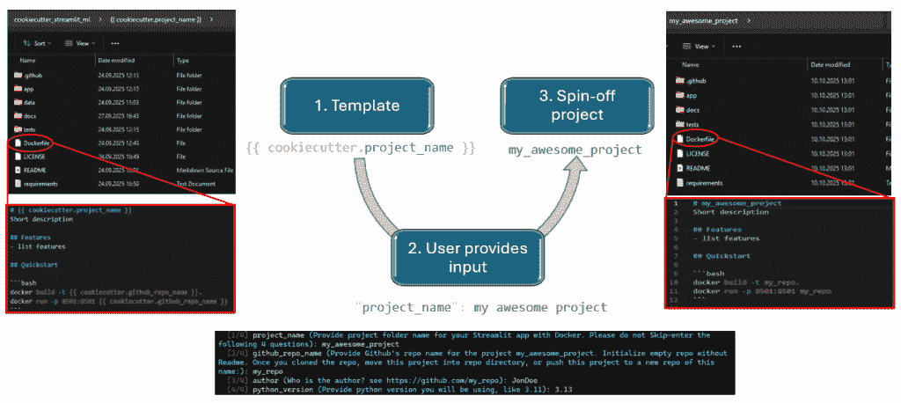
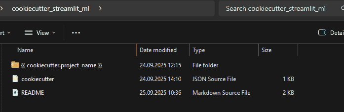
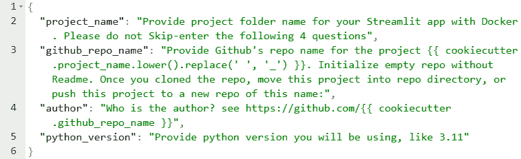
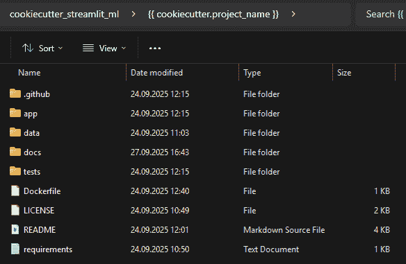
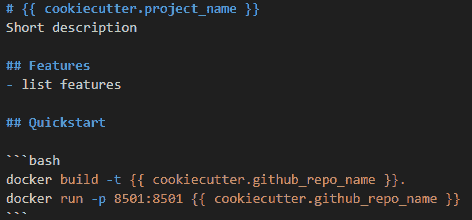
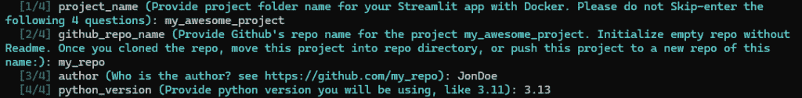
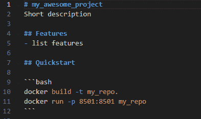

# 如何使用 Cookiecutter 启动项目结构

> 原文：[`towardsdatascience.com/how-to-spin-up-a-project-structure-with-cookiecutter/`](https://towardsdatascience.com/how-to-spin-up-a-project-structure-with-cookiecutter/)

<mdspan datatext="el1760021472327" class="mdspan-comment">如果你和我一样，那么“拖延症”可能就是你的中间名。在开始一个新项目之前，总是会有那种令人烦恼的犹豫。仅仅想到设置项目结构、创建文档或编写一个不错的 README 就足以引发打哈欠。这感觉就像是在盯着一个令人讨厌的学校论文的空白页。但记得一旦有了一些有用的 LLM（如 ChatGPT）提供了起始模板，事情会变得多么容易？同样的魔法也可以应用到你的编码项目中。这就是 Cookiecutter 介入的地方。

## 什么是 Cookiecutter？

[Cookiecutter](https://www.cookiecutter.io/)是一个开源工具，帮助你创建项目模板。它是语言无关的，几乎可以与任何编程语言（或者如果你需要标准化的文件夹和文件结构，甚至可以用于编码之外）一起工作。使用 Cookiecutter，你可以设置所有样板文件（如 READMEs、Dockerfiles、项目目录等），然后快速根据该结构生成新项目。

Cookiecutter 工作流程由三个主要步骤组成：

1.  你定义你的项目模板。

1.  用户输入你指定的变量值。

1.  Cookiecutter 根据用户的输入自动生成新项目，填充文件、文件夹和变量值。

以下图像说明了这个过程：

根据预定义模板“烘焙”新项目的 cookiecutter 模板使用工作流程。图片由作者提供

## 1. 基本计算机设置

你需要基本的编程技能来安装和使用 Cookiecutter。如果你可以打开命令行窗口，你就准备好了。

• 在 Windows 中，在搜索栏中输入“cmd”并打开“命令提示符”。

• 如果你还没有安装 pipx，请使用以下命令安装：

`pip install pipx`

通过运行以下命令测试你的安装：

`pipx --version`

如果你收到“命令未找到”错误，请将 pipx 添加到你的 PATH 中。首先，找到 pipx 的安装位置：python -m site –user-base。

这可能返回类似/home/username/.local 的结果。寻找包含 pipx.exe（在 Windows 上）或 pipx（在 macOS 或 Linux 上）的文件夹。如果你没有管理员权限，目录可能是 C:\Users\username\AppData\Roaming\Python\Pythonxxx\Scripts。

我不得不将 pipx 添加到我的路径中，如果你没有管理员权限，每次启动新的终端窗口时你都需要这样做。因此，建议将位置永久添加到你的环境变量设置中。然而，如果这个设置需要管理员权限，你仍然可以添加

`set PATH=C:\Users\username\AppData\Roaming\Python\Pythonxxx\Scripts;%PATH%`

或者

`set PATH=/home/username/.local/bin;%PATH%`

希望你现在可以得到`pipx --version`的有意义响应。

## 2. 安装和设置 Cookiecutter

Cookiecutter 作为 Python 包分发，你可以使用 pipx 来安装它：

`pipx install cookiecutter`

或者简单地即时运行它：

`pipx run cookiecutter ...`

让我们一步步来创建一个项目模板。在这个例子中，我们将为 Streamlit 应用（cookiecutter_streamlit_ml）设置一个模板。

## 3. 创建模板结构

在你的 cookiecutter_streamlit_ml 文件夹中，你需要这两个关键组件：

• cookiecutter.json – 一个 JSON 文件，定义了用户需要填写的内容的变量（项目名称、作者、Python 版本等）。

• {{ cookiecutter.directory_name }} – 使用花括号定义的一个占位符文件夹名称。这个目录将包含你的项目结构和文件。当用户从你的模板创建新项目时，Cookiecutter 将用他们提供的名称替换这个占位符。*注意保持花括号！*

Cookiecutter 模板文件夹的示例内容。图片由作者提供

你的 cookiecutter.json 可能看起来像这样：

示例 cookiecutter.json 文件。图片由作者提供

首先，你在 cookiecutter.json 中定义变量，这些变量将在生成的项目中使用。至少，你想要一个用于项目名称的变量。

例如，我经常在文档中引用我的 GitHub 仓库。而不是反复输入，我设置一个变量一次，让 Cookiecutter 自动填充每个实例。同样，我也不想在每个 README 或文档文件中写出我的名字，所以我一开始就设置了它。

为了避免与 Docker 相关的问题并确保指定了正确的 Python 版本，我在项目创建时提示输入 Python 版本，确保它在生成的 Dockerfile 中使用。

你可以在 cookiecutter.json 中为每个字段定义默认值。Cookiecutter 将自动将模板文件中的每个{{ cookiecutter.variable }}实例替换为用户的输入。你还可以使用像 lower()或 replace(‘ ‘, ‘_’)这样的转换来避免目录名中的空格问题。

在我的模板中，我更喜欢为用户提供详细的说明，而不是设置默认值。这有助于指导那些可能跳过阅读 README 并直接进入项目创建的人。

## 4. 构建模板

现在开始有趣的部分，即定义你的模板。你只需要做一次，所以花些时间在这上面是值得的，这将在长期内大大减少你的项目设置时间。

首先，创建你的项目文件夹结构。这包括创建你预期在项目中使用的所有文件夹。不用担心，无论缺少什么或最终证明是多余的，都可以在实际项目中编辑。现在，你只是在创建蓝图；具体的细节将根据项目而定。

未来项目的预定义文件夹结构示例。一旦用户执行 cookiecutter 命令，此文件夹结构和所有文件将被实例化。图片由作者提供

一旦您的文件夹准备就绪，您就可以用文件填充它们。这些文件可以是空的，甚至可以包含一些您可能需要经常从其他文档中复制粘贴的内容。在这些文件中，当需要动态设置某些内容（例如项目名称或 GitHub 仓库）时，请参考 cookiecutter 变量。Cookiecutter 将自动将这些占位符替换为在项目设置期间提供的用户输入，这将节省您大量的繁琐复制粘贴工作，尤其是在文档文件中。

Readme 文件的部分内容，当您在项目中“解包”cookiecutter 模板时将实例化。在衍生项目中，{{ cookiecutter.<variable> }} 字段将被在“解包”期间提供的值填充。图片由作者提供

最后，将整个 cookiecutter_py_streamlit 文件夹存入您的 GitHub 账户，将其压缩，或保持原样。无论哪种方式，您现在都可以 ...

## 5. 使用您的模板

一旦您的模板准备就绪，创建新项目就变得轻而易举：

1. 打开您的终端并导航到您想要创建项目的地方。

2. 运行以下命令之一：

• 从 GitHub：

`pipx run cookiecutter gh:ElenJ/cookiecutter_streamlit_ml  (替换为您的仓库)`

• 从本地文件夹：

`pipx run cookiecutter /path/to/template_folder`

• 从压缩包：

`pipx run cookiecutter /path/to/template.zip`

3. Cookiecutter 将询问 cookiecutter.json 中定义的问题。提供答案——或者如果您已设置默认值，只需按回车键。

您将被要求提供在 cookiecutter 模板中定义的问题的答案。您提供的答案将被用作由 {{ cookiecutter.variable }} 定义的字段中的相应变量。图片由作者提供

4. 哇哦 🎉 您的新项目文件夹已生成，包含文件夹、文件和针对您的输入定制的引用。

在设置期间用户提供的变量实例化的 Readme。图片由作者提供

您可以通过直接从 IDE 的内置 Git 功能推送，或者在 GitHub 上创建一个新的仓库（确保它是空的，并且不包含 Readme 文件）然后将生成的项目文件夹移动到那里，来与 GitHub 上的新项目同步。

就这样！你已经将原本需要一整天的繁琐工作变成了一个快速的过程，并且瞬间生成了许多等待你填充想法的文件。看着这个新项目，你肯定会有一种充实的一天的感觉。如果你还在寻找最佳实践的指导，请查看官方的[Cookiecutter 模板](https://www.cookiecutter.io/templates)。

就像往常一样：**编码愉快**！
