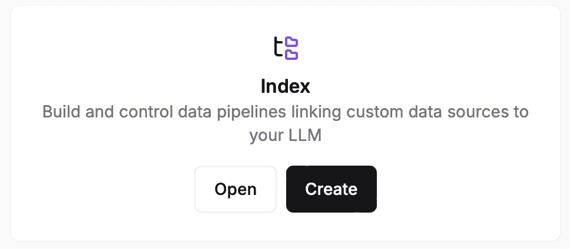
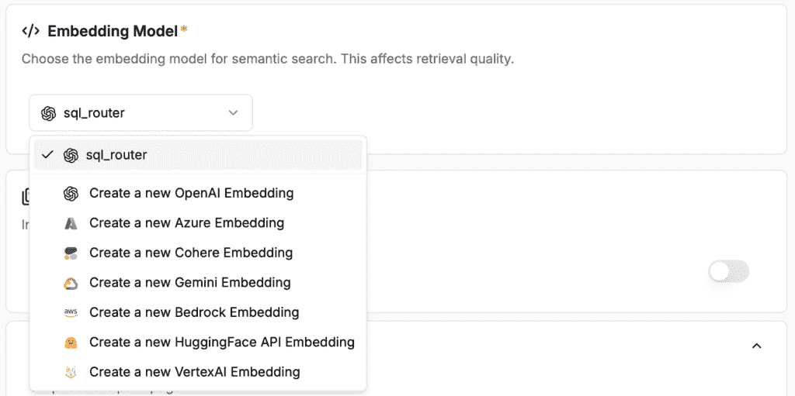
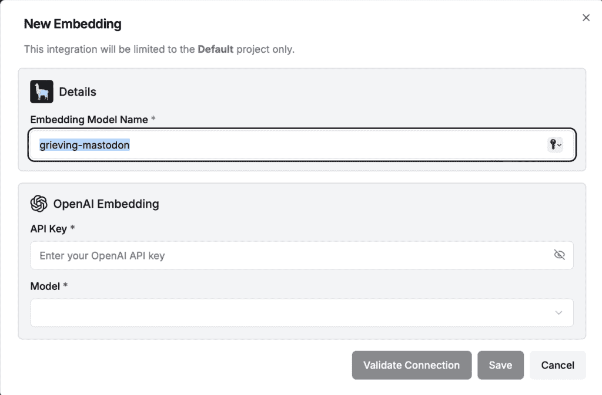
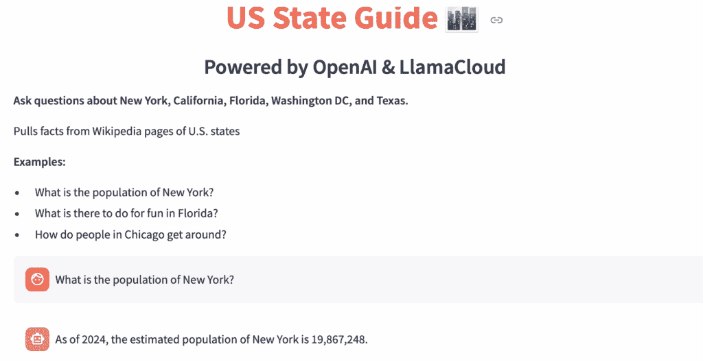

# 如何使用 RAG 和自定义数据训练聊天机器人

> 原文：[`towardsdatascience.com/how-to-train-a-chatbot-using-rag-and-custom-data/`](https://towardsdatascience.com/how-to-train-a-chatbot-using-rag-and-custom-data/)

## <mdspan datatext="el1750746374788" class="mdspan-comment">什么是 RAG</mdspan>？

RAG，代表检索增强生成，描述了一个过程，通过这个过程，LLM（大型语言模型）可以通过训练它从更具体、更小的知识库中提取信息来优化，而不是从其巨大的原始库中提取信息。通常，像 ChatGPT 这样的 LLM 是在整个互联网（数十亿数据点）上训练的。这意味着它们容易犯小错误和幻觉。

这里是一个 RAG 可以用并且有帮助的情况的例子：

*我想构建一个美国州旅游指南聊天机器人，其中包含有关美国州的一般信息，例如它们的州首府、人口和主要旅游景点。为此，我可以下载这些美国州的维基百科页面，并使用这些特定页面的文本来训练我的 LLM。*

## 创建你的 RAG LLM

构建 RAG 系统最受欢迎的工具之一是**LlamaIndex**，它：

+   简化了 LLM 和外部数据源之间的集成

+   允许开发者以优化 LLM 消费的方式结构化、索引和查询他们的数据。

+   与许多类型的数据一起工作，例如 PDF 和文本文件

+   帮助构建一个 RAG 管道，该管道检索并注入相关数据块到提示中，然后再将其传递给 LLM 进行生成。

## 下载你的数据

首先获取你想要用来自训练模型的数据。为了以正确的格式从维基百科下载 PDF（[CC by 4.0](https://en.wikipedia.org/wiki/Wikipedia:Text_of_the_Creative_Commons_Attribution-ShareAlike_4.0_International_License)），确保你点击打印然后“另存为 PDF。”

***不要只是将维基百科导出为 PDF——Llama 不会喜欢这种格式，并且会拒绝你的文件。***

为了本文的目的，为了使事情简单，我只会下载以下 5 个流行州的页面：

+   佛罗里达

+   加利福尼亚

+   华盛顿特区

+   纽约

+   德克萨斯

确保将它们都保存在一个你的项目可以轻松访问的文件夹中。我保存了一个名为“data”的文件夹中。

## 获取必要的 API 密钥

在你创建自定义状态数据库之前，你需要生成 2 个 API 密钥。

+   一个来自 OpenAI 的，用于访问基础 LLM

+   一个从 Llama 到访问你上传自定义数据的索引数据库。

一旦你有了这些 API 密钥，就将它们存储在你项目中的一个.env 文件中。

```py
#.env file
LLAMA_API_KEY = "<Your-Api-Key>"
OPENAI_API_KEY = "<Your-Api-Key>"
```

## 创建索引并上传你的数据

创建一个[LlamaCloud](https://cloud.llamaindex.ai/login)账户。一旦你登录，找到索引部分并点击“创建”以创建一个新的索引。



由作者截图

索引远程存储和管理文档索引，以便可以通过 API 进行查询，而无需重建或本地存储它们。

**以下是它的工作原理：**

1.  当您创建索引时，将有一个地方可以上传文件以供模型数据库使用。**在此处上传您的 PDF 文件**。

1.  LlamaIndex **解析并分块** 文档。

1.  它创建了一个 **索引**（例如，向量索引、关键词索引）。

1.  此索引存储在 LlamaCloud 中。

1.  然后，您可以使用 LLM 通过 API 来 **查询** 它。

下一步，您需要配置一个 **嵌入模型**。嵌入模型是您项目的基础 LLM，负责检索相关信息并输出文本。

当您创建新索引时，您希望选择 **“创建新的 OpenAI 嵌入”**：



作者截图

当您创建新的嵌入时，您必须提供您的 OpenAI API 密钥并为您的模型命名。



作者截图

一旦您创建了模型，请保留其他索引设置为其默认值，并在底部点击“创建索引”。

解析和存储所有文档可能需要几分钟时间，所以在您尝试运行查询之前，请确保所有文档都已处理。当您在“索引文件摘要”框中创建索引时，状态应显示在屏幕的右侧。

## 通过代码访问您的模型

一旦您创建了索引，您还将获得一个组织 ID。为了代码更整洁，将您的组织 ID 和索引名称添加到您的 .env 文件中。然后，在您的代码中检索所有必要的变量以初始化您的索引：

```py
index = LlamaCloudIndex(
  name=os.getenv("INDEX_NAME"), 
  project_name="Default",
  organization_id=os.getenv("ORG_ID"),
  api_key=os.getenv("LLAMA_API_KEY")
)
```

## 查询您的索引并提问

要做到这一点，您需要定义一个查询（提示）然后通过调用索引以这种方式生成响应：

```py
query = "What state has the highest population?"
response = index.as_query_engine().query(query)

# Print out just the text part of the response
print(response.response)
```

## 与您的机器人进行更长时间的对话

通过像上面那样从 LLM 查询响应，您能够轻松访问您加载的文档中的信息。然而，如果您提出一个没有上下文的问题，比如“哪个最少？”，模型将不会记得您最初的问题是什么。这是因为我们没有编程它来跟踪聊天历史。

为了做到这一点，您需要：

+   使用 ChatMemoryBuffer 创建内存

+   创建聊天引擎并使用 ContextChatEngine 添加创建的内存

要创建一个聊天引擎：

```py
from llama_index.core.chat_engine import ContextChatEngine
from llama_index.core.memory import ChatMemoryBuffer

# Create a retriever from the index
retriever = index.as_retriever()

# Set up memory
memory = ChatMemoryBuffer.from_defaults(token_limit=2000)

# Create chat engine with memory
chat_engine = ContextChatEngine.from_defaults(
    retriever=retriever,
    memory=memory,
    llm=OpenAI(model="gpt-4o"),
)
```

接下来，将您的查询输入到聊天引擎中：

```py
# To query:
response = chat_engine.chat("What is the population of New York?")
print(response.response)
```

这将给出以下响应：“截至 2024 年，纽约的估计人口为 19,867,248。”

我可以接着问一个问题：

```py
response = chat_engine.chat("What about California?")
print(response.response)
```

这将给出以下响应：“截至 2024 年，加利福尼亚的人口为 39,431,263。”如您所见，模型记得我们之前询问的是人口，并相应地做出了回答。



Streamlit UI 聊天机器人应用程序用于美国州 RAG。作者截图

## 结论

Retrieval Augmented Generation 是一种在特定数据上训练大型语言模型（LLM）的高效方法。LlamaCloud 提供了一种简单直接的方式来构建您自己的 RAG 框架，并查询底层的模型。

我在这篇教程中使用的代码是在笔记本中编写的，但它也可以封装在 Streamlit 应用中，以创建与聊天机器人更自然的问答对话。我已在我的 GitHub 上提供了 Streamlit 代码[这里](https://github.com/hadenpell/rag-tutorial)。

## 感谢阅读

+   在[LinkedIn](http://linkedin.com/in/hadenpelletier/)上与我联系

+   [请给我买杯咖啡](http://buymeacoffee.com/hadenpell)以支持我的工作！

+   我在[Topmate](https://topmate.io/haden_p)上提供一对一数据科学辅导、职业指导/辅导、写作建议、简历审查等服务！
