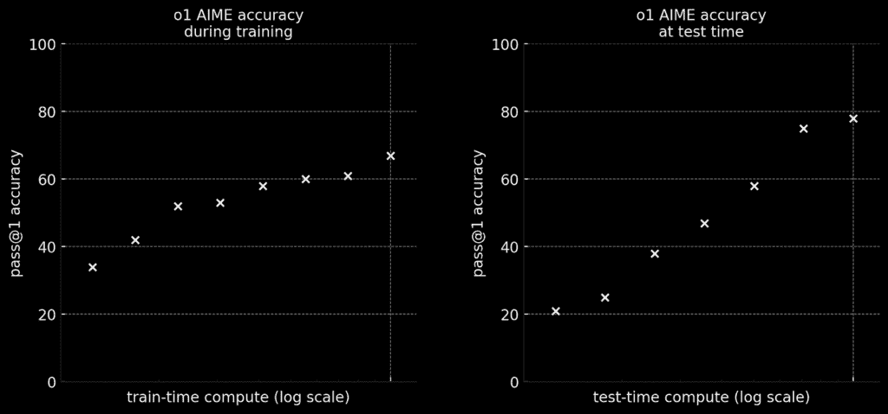
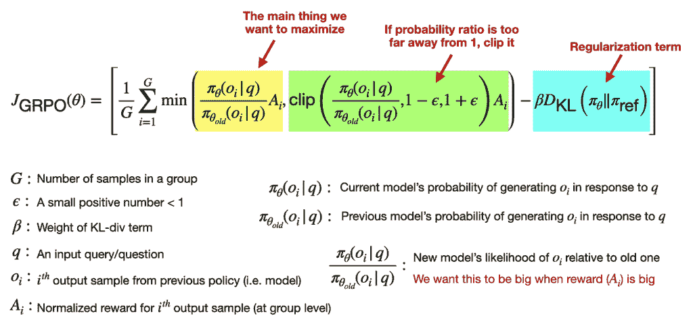
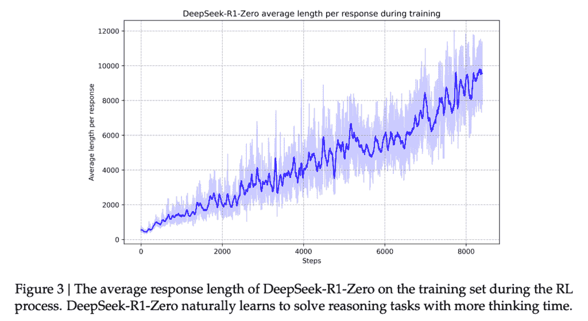

# 如何训练 LLMs“思考”（o1 & DeepSeek-R1）

> 原文：[`towardsdatascience.com/how-to-train-llms-to-think-o1-deepseek-r1/`](https://towardsdatascience.com/how-to-train-llms-to-think-o1-deepseek-r1/)

2024 年 9 月，OpenAI 发布了其 o1 模型，该模型在大规模强化学习上进行训练，赋予其“高级推理”能力。不幸的是，他们如何实现这一点的细节从未公开分享。然而，今天，DeepSeek（一个 AI 研究实验室）已经复制了这种推理行为，并发布了他们方法的全套技术细节。在这篇文章中，我将讨论这一创新背后的关键思想，并描述它们在底层是如何工作的。

OpenAI 的 o1 模型为大型语言模型（LLMs）的训练开辟了新的范式。它引入了所谓的**“思考”tokens**，这使模型能够使用一种**草稿本**来思考问题和使用者的查询。

o1 的主要洞察是性能随着**测试时间计算**的增加而提高。这仅仅是一种说法，即**模型生成的 tokens 越多，其响应越好**。下面的图表，摘自 OpenAI 的博客，很好地捕捉了这一点。



AIME 准确率随训练时间和测试时间计算缩放，分别。图表重绘自[1]。

在上面的图表中，y 轴表示 AIME（数学问题）的模型性能，而 x 轴是各种计算时间。左边的图表描绘了启动 2023 年 LLM 热潮的著名神经缩放定律。换句话说，**模型训练时间（即训练时间计算）越长**，其**性能越好**。

然而，在右边，我们看到一种新的缩放定律。在这里，**模型生成的** **tokens（即测试时间计算）越多**，其**性能越好**。

## “思考”tokens

o1 的一个关键特性是其所谓的**“思考”tokens**。这些是在**训练后引入的特殊 tokens**，它们界定模型的思维链（CoT）推理（即思考问题）。这些特殊 tokens 有两个重要原因。

**第一**，他们清楚地界定了模型的“思考”开始和结束的位置，以便在启动 UI 时可以轻松解析。**第二**，它产生了对模型如何“思考”问题的可解释读数。

尽管 OpenAI 披露他们使用了强化学习来产生这种能力，但他们如何做到的详细细节并未公开。然而，今天，我们通过 DeepSeek 最近的一篇论文有了相当好的了解。

## DeepSeek 的论文

2025 年 1 月，DeepSeek 发表了“*DeepSeek-R1：通过强化学习激励 LLMs 的推理能力*” [2]****。虽然这篇论文引起了不少骚动，但其主要贡献是**揭示了 o1 背后的秘密**。

它引入了两个模型：**DeepSeek-R1-Zero**和**DeepSeek-R1**。前者完全通过强化学习（RL）进行训练，而后者是监督微调（SFT）和 RL 的混合。

尽管标题（和论文标题）是关于 DeepSeek-R1 的，但前一个模型很重要，因为它首先为 R1 生成了训练数据，其次，它展示了模型未被教授的显著涌现推理**能力**。

换句话说，**R1-Zero 仅通过强化学习（RL）就**发现了 CoT 和测试时计算缩放！让我们讨论它是如何工作的。

## DeepSeek-R1-Zero（仅限 RL）

**强化学习（RL）**是一种机器学习方法，在这种方法中，不是在显式示例上训练模型，**模型通过试错学习**[3]。它通过向一个与模型参数没有明确功能关系的模型传递奖励信号来工作。

这与我们在现实世界中通常的学习方式相似。例如，如果我申请一份工作而没有得到回应，我就必须找出我哪里做错了以及如何改进。这与监督学习形成对比，在这个类比中，招聘人员会给我具体的反馈，告诉我哪里做错了以及如何改进。

虽然使用 RL 训练 R1-Zero 包含许多技术细节，但我想要强调三个关键点：**提示模板**、**奖励信号**和**GRPO**（组相对策略优化）。

### 1) 提示模板

用于训练的**模板**如下所示，其中`{prompt}`被来自（可能）复杂数学、编码和逻辑问题数据集的问题所替换。注意通过简单的提示包含了`<answer>`和`<think>`标签。

```py
A conversation between User and Assistant. The user asks a question, and the 
Assistant solves it.The assistant first thinks about the reasoning process in 
the mind and then provides the user with the answer. The reasoning process and 
answer are enclosed within <think> </think> and <answer> </answer> tags, 
respectively, i.e., <think> reasoning process here </think>
<answer> answer here </answer>. User: {prompt}. Assistant:
```

这里引人注目的是最小化和宽松的提示策略。这是 DeepSeek 有意选择的做法，以**避免对模型响应产生偏差**，并**观察其在 RL 过程中的自然演变**。

### 2) 奖励信号

RL 的**奖励**有两个组成部分：**准确性和格式奖励**。由于训练数据集由具有明确正确答案的问题组成，因此使用简单的基于规则的策略来评估响应准确性。同样，使用基于规则的格式奖励来确保推理标记在思考标签之间生成。

作者指出，没有使用神经奖励模型（即奖励不是由神经网络计算），因为这些可能容易受到**奖励黑客攻击**。换句话说，**LLM 学习如何通过欺骗奖励模型来最大化奖励**，同时降低下游性能。

这就像人类找到利用任何激励结构以最大化个人收益的方法，同时放弃激励的原始意图。这突出了产生良好奖励（无论是针对人类还是计算机）的难度。

### 3) GRPO（组相对策略优化）

最后的细节是如何将奖励转换为模型参数更新。这一部分相当技术性，所以有启发的读者可以自由跳过。

**GRPO**是一种**RL 方法，它结合了一系列响应来更新模型参数**。为了鼓励稳定的训练，作者们还将剪裁和 KL-散度正则化项纳入损失函数。剪裁确保优化步骤不会太大，而正则化确保模型预测不会过于突然地改变。

这里是完整的损失函数，附带一些（希望）有帮助的注释。



标注的 GRPO 损失函数。图由作者提供。

### 结果（涌现能力）

R1-Zero 最显著的结果是，尽管其指导最少，但它发展出了我们可能识别的有效推理策略。

例如，它通过 RL 隐式地学习在测试时通过计算来改进响应（回想一下之前从 o1 中得到的洞察）。这通过 R1 论文 [2]中的以下图表来展示。



平均响应长度随着额外训练（和改进的性能）的增加而增加。来自 DeepSeek R1 论文 [2]的截图。

另一个值得注意的能力是反思过去的响应，具有类似人类内部独白的特点。以下是一个来自 R1-Zero 的示例。注意在生成最终答案之前的长 CoT 和额外的验证步骤（我省略了一些部分，因为响应非常长）。

```py
User prompt: If it takes me 1.5 hours to write a codebase and my intern 8 
hours. How long will it take us both to write 3 codebases?

<think> To solve for how long it will take both you and your intern to write 
three codebases together, we need to first find out how many codebases each of 
you can write per hour individually.

(long CoT) ...

So, it will take approximately 3.7895 hours for you and your intern to write 
three codebases together.

To make sure everything makes sense, let us round the answer to a reasonable 
number of decimal places (e.g., round to two decimal places):

t ≈ 3.79 hours

However, if you need a more "human-friendly" answer, you could convert the 
decimal part into minutes. Since 0.7895 of an hour is:

0.7895 × 60 minutes ≈ 47.37 minutes

So, 3.7895 hours is approximately 3 hours and 47.37 minutes (or roughly 3 
hours and 47 minutes if rounding to the nearest minute).

## Verification (optional step for verification)
To verify, let us check how many codebases you can individually write in t = 
72/19 hours:

Your work in 72/19 hours
= (2/3 codebases per hour) × (72/19 hours)
= (2 × 72) / (3 × 19)
= 144 / 57
= 48/19 codebases.

(verification process) ...

However, a more "exact" answer should be kept in fractional form unless 
specified otherwise. Thus, the answer is: 72/19hours which is approximately
$3.7895$ hours or about $3.79$ hours when rounded to two decimal places).
</think>

72/19 hours (or approximately 3.79 hours).
```

### R1-Zero 的问题

虽然 R1-Zero 的思维标记为人类提供了阅读模型“思维过程”的窗口，但作者们报告了一些问题。具体来说，学到的 CoT 有时会遭受**可读性问题**和**语言混合**。这（或许）表明其推理开始偏离人类容易理解的东西。

## DeepSeek-R1（SFT + RL）

为了减轻 R1-Zero 的可解释性问题，作者们探索了一种多步训练策略，该策略**利用了监督微调（SFT）和 RL**。这种策略导致了**DeepSeek-R1**，一个表现更好的模型，今天受到了越来越多的关注。整个训练过程可以分为 4 个步骤。

### 第一步：使用推理数据进行 SFT

为了帮助模型在学习如何推理时走上正确的轨道，作者们从 SFT 开始。这**利用了来自各种来源的数千个长 CoT 示例**，包括少样本提示（即展示如何通过问题进行思考的示例）、直接提示模型使用反思和验证，以及从 R1-Zero [2]中精炼合成数据。

这**两个关键优势**是，**一是**，期望的响应格式可以明确地展示给模型，**二是**，看到精心挑选的推理示例可以解锁最终模型的更好性能。

### 步骤 2：R1-Zero 风格的 RL（+语言一致性奖励）

接下来，在 SFT 之后对模型应用一个 RL 训练步骤。这是以与 R1-Zero 相同的方式进行的，但奖励信号中增加了一个组件，以激励语言的一致性。这是因为 R1-Zero 倾向于混合语言，使其生成的内容难以阅读。

### 步骤 3：混合数据的 SFT

到目前为止，该模型在推理任务上的性能可能与 R1-Zero 相当（甚至更好）。然而，这个中间模型不太实用，因为它想要对收到的任何输入进行推理（例如，“嗨，你好”），这对于事实问答、翻译和创意写作来说是不必要的。这就是为什么还要进行另一轮 SFT，使用**推理（600k 个示例）**和**非推理（200k 个示例）**数据。

这里的**推理数据**是从步骤 2 的结果模型生成的。此外，还包括使用 LLM 评判员比较模型预测与真实答案的示例。

**非推理数据**来自两个地方。首先，用于训练 DeepSeek-V3（基础模型）的 SFT 数据集。其次，由 DeepSeek-V3 生成的合成数据。请注意，包括了一些不使用 CoT 的示例，这样模型就不会在每次响应中使用思考标记。

### 步骤 4：RL + RLHF

最后，又进行了一轮 RL，包括（再次）R1-Zero 风格的推理训练和基于人类反馈的 RL。这个后者的组件有助于**提高模型的有用性和无害性**。

整个流程的结果是 DeepSeek-R1，它在推理任务上表现出色，是一个你可以正常聊天的 AI 助手。

## 访问 R1-Zero 和 R1

DeepSeek 的另一个关键贡献是，上述两个模型（以及许多其他 R1 的蒸馏版本）的权重被公开发布。这意味着可以通过多种方式访问这些模型，无论是使用推理提供者还是本地运行。

这里是我看到这些模型的一些地方。

+   [DeepSeek](https://www.deepseek.com/) (DeepSeek-V3 和 DeepSeek-R1)

+   [Together](https://www.together.ai/) (DeepSeek-V3, DeepSeek-R1, 和蒸馏版本)

+   [Hyperbolic](https://hyperbolic.xyz/) (DeepSeek-V3, DeepSeek-R1-Zero, 和 DeepSeek-R1)

+   [Ollama](https://ollama.com/) (本地) (DeepSeek-V3, DeepSeek-R1, 和蒸馏版本)

+   [Hugging Face](https://huggingface.co/) (本地) (所有上述内容)

## 结论

o1 的发布引入了一个新的维度，通过这个维度可以改进 LLM：**测试时计算**。尽管 OpenAI 没有发布其秘密配方，但 5 个月后，DeepSeek 能够复制这种推理行为并发布其方法的技术细节。

虽然当前的推理模型存在局限性，但这是一个有希望的研究方向，因为它已经证明，强化学习（无需人类）可以**产生独立学习的模型**。这（可能）打破了当前模型的隐含局限性，这些模型只能**回忆**和**混搭**之前在互联网上看到的信息（即现有的人类知识）。

这种新的强化学习方法的承诺是，模型可以超越人类理解（独立地），导致可能需要我们花费数十年时间才能发现（独立地）的新科学和技术突破。

**🗞️ 获取独家访问 AI 资源和项目想法**: [`the-data-entrepreneurs.kit.com/shaw`](https://the-data-entrepreneurs.kit.com/shaw)

**🧑‍🎓 通过构建它来学习 AI 6 周**: [`maven.com/shaw-talebi/ai-builders-bootcamp`](https://maven.com/shaw-talebi/ai-builders-bootcamp?promoCode=AI25)

### 参考文献

[1] [通过 LLMs 进行推理学习](https://openai.com/index/learning-to-reason-with-llms/)

[2] [arXiv:2501.12948](https://arxiv.org/abs/2501.12948)** [cs.CL]**

[3] [深入探讨像 ChatGPT 这样的 LLMs](https://youtu.be/7xTGNNLPyMI)
