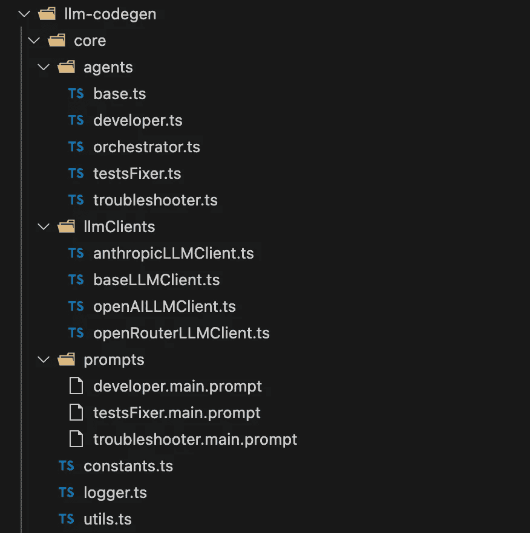
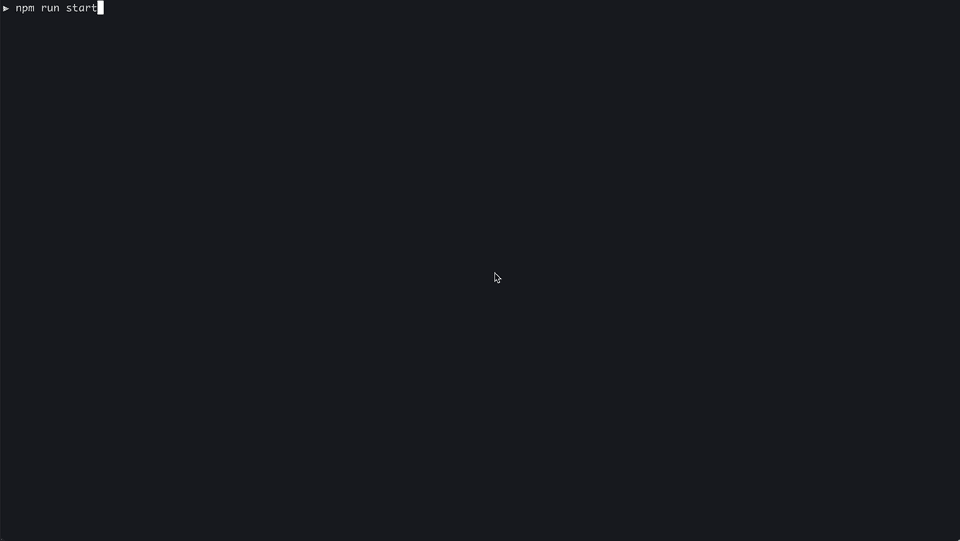
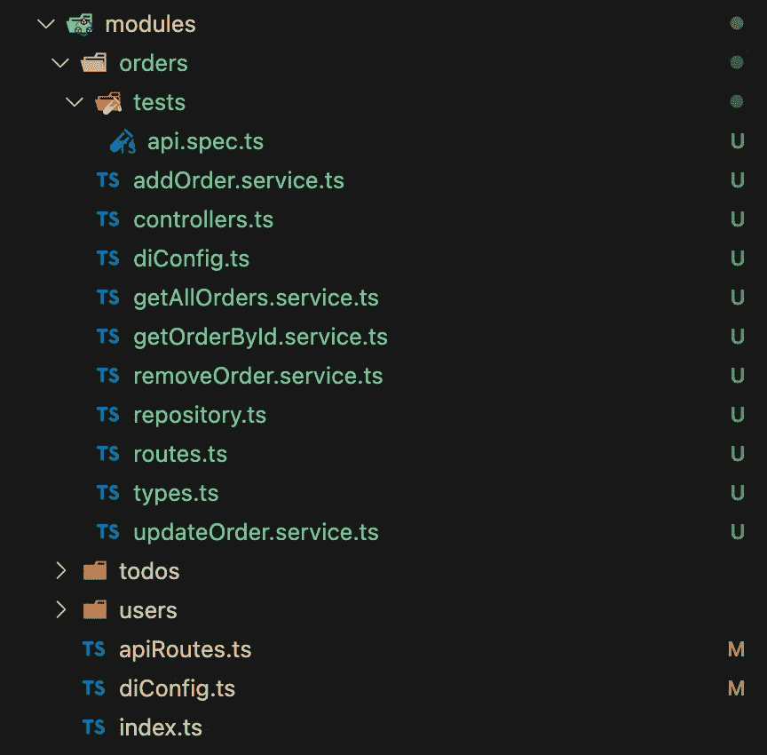
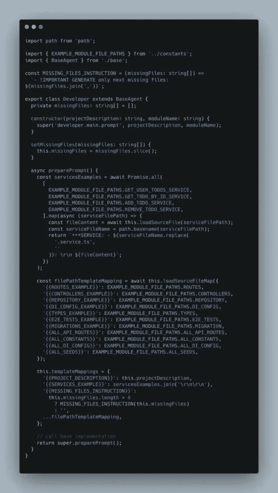
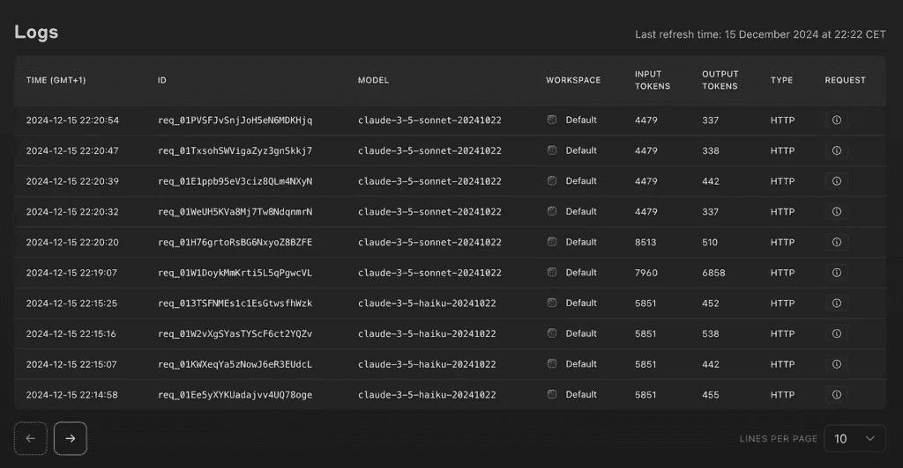

# 如何使用 LLM 驱动的模板构建自己的 Node.js API

> 原文：[`towardsdatascience.com/how-to-use-an-llm-powered-boilerplate-for-building-your-own-node-js-api/`](https://towardsdatascience.com/how-to-use-an-llm-powered-boilerplate-for-building-your-own-node-js-api/)

很长一段时间里，启动新 Node.js 项目的常见方法之一是使用模板。这些模板帮助开发者重用熟悉的代码结构并实现标准功能，例如访问云文件存储。随着 LLM 的发展，项目模板似乎比以往任何时候都更有用。

建立在现有进展的基础上，我扩展了现有的 Node.js API 模板，添加了一个新工具 [LLM Codegen](https://github.com/vyancharuk/nodejs-todo-api-boilerplate)。这个独立功能使模板能够根据文本描述自动生成任何目的的模块代码。生成的模块包含 E2E 测试、数据库迁移、种子数据和必要的企业逻辑。

### 历史

我最初创建了一个 [GitHub 仓库](https://github.com/vyancharuk/nodejs-todo-api-boilerplate#nodejs-api-typescript-template-project) 用于 Node.js API 模板，以巩固我多年来开发的最佳实践。大部分实现基于在 AWS 上运行的实际 Node.js API 代码。

我热衷于垂直切片架构和 Clean Code 原则，以保持代码库的可维护性和整洁。随着 LLM 的最新进展，特别是其对大上下文的支持和生成高质量代码的能力，我决定基于我的模板进行生成清洁 TypeScript 代码的实验。这个模板遵循特定的结构和模式，我认为它们是高质量的。关键问题是生成的代码是否会遵循相同的模式和结构。根据我的发现，它确实如此。

回顾一下，以下是 Node.js API 模板的关键特性快速概述：

+   基于 `DDD` & `MVC` 原则的垂直切片架构

+   使用 `ZOD` 进行服务输入验证

+   使用依赖注入 (`InversifyJS`) 解耦应用程序组件

+   使用 Supertest 进行集成和 `E2E` 测试

+   使用 `Docker`compose 进行多服务设置

在过去的一个月里，我利用周末时间正式化解决方案并实现必要的代码生成逻辑。下面，我将分享详细情况。

### 实现概述

让我们探讨具体实现细节。所有代码生成逻辑都组织在项目根目录下的 `llm-codegen` 文件夹中，确保易于导航。Node.js 模板代码不依赖于 `llm-codegen`，因此可以作为常规模板使用，无需修改。



LLM-Codegen 文件夹结构

它涵盖了以下用例：

+   根据输入描述生成新的模块的干净、结构良好的代码。生成的模块成为 Node.js REST API 应用程序的一部分。

+   为新模块创建数据库迁移并扩展种子脚本，以包含基本数据。

+   为新代码生成和修复端到端测试，并确保所有测试通过。

第一阶段生成的代码是干净的，并遵循垂直切片架构原则。它仅包含 CRUD 操作所需的必要业务逻辑。与其他代码生成方法相比，它生成的是干净、可维护、可编译的代码，并具有有效的端到端测试。

第二个用例涉及使用适当的模式生成数据库迁移，并更新种子脚本以包含必要的数据。这项任务非常适合 LLM，它处理得非常好。

最后一个用例是生成端到端测试，这有助于确认生成的代码是否正确工作。在运行端到端测试期间，使用 SQLite3 数据库进行迁移和种子。

主要支持的 LLM 客户端是 OpenAI 和 Claude。

### **如何使用**

要开始使用，请导航到 `llm-codegen` 的根目录并运行以下命令来安装所有依赖项：

> npm i

`llm-codegen` 不依赖于 Docker 或任何其他重型第三方依赖项，这使得设置和执行变得简单直接。在运行工具之前，请确保在 `.env` 文件中至少设置了一个 `*_API_KEY` 环境变量，并使用您选择的 LLM 提供商的适当 API 密钥。所有支持的环境变量都在 `.env.sample` 文件中列出（`OPENAI_API_KEY, CLAUDE_API_KEY` 等）。您可以使用 `OpenAI`、`Anthropic Claude` 或 `OpenRouter LLaMA`。截至 12 月中旬，`OpenRouter LLaMA` 意外地免费使用。您可以在 [这里](https://openrouter.ai/nousresearch/hermes-3-llama-3.1-405b:free/api) 注册并获得免费使用的令牌。然而，这个免费 LLaMA 模型的输出质量可以改进，因为大多数生成的代码都无法通过编译阶段。

要启动 `llm-codegen`，请运行以下命令：

> npm run start

接下来，您将被要求输入模块描述和名称。在模块描述中，您可以指定所有必要的需求，例如实体属性和所需操作。核心剩余工作由微代理完成：`Developer`、`Troubleshooter` 和 `TestsFixer`。

下面是一个成功的代码生成示例：


代码生成成功

下面是另一个示例，展示了如何修复编译错误：



下面是一个生成的 `orders` 模块代码示例：



一个关键细节是您可以逐步生成代码，从单个模块开始，添加其他模块，直到所有必需的 API 都完整。这种方法允许您在几次命令运行中生成所有必需模块的代码。

### **工作原理**

如前所述，所有工作都由以下微代理完成：`Developer`、`Troubleshooter`和`TestsFixer`，由`Orchestrator`控制。它们按照列表中的顺序运行，其中`Developer`生成大部分代码库。在每次代码生成步骤之后，会根据其角色（例如，路由、控制器、服务）检查缺失的文件。如果任何文件缺失，将尝试新的代码生成，包括提示中关于缺失文件的说明以及每个角色的示例。一旦`Developer`完成其工作，就开始 TypeScript 编译。如果发现任何错误，`Troubleshooter`将接管，将错误传递给提示并等待修正后的代码。最后，当编译成功后，将运行端到端测试。每当测试失败时，`TestsFixer`将介入，并使用特定的提示指令，确保所有测试通过且代码保持整洁。

所有微代理都源自于`BaseAgent`类，并积极重用其基类方法实现。以下为参考的`Developer`实现：



每个代理都使用其特定的提示。查看以下 GitHub[链接](https://github.com/vyancharuk/nodejs-todo-api-boilerplate/blob/master/llm-codegen/core/prompts/developer.main.prompt)以了解`Developer`使用的提示。

在投入大量精力进行研究和测试后，我优化了所有微代理的提示词，从而得到了干净、结构良好的代码，问题非常少。

在开发和测试期间，使用了各种模块描述，从简单到高度详细。以下是一些示例：

```py
- The module responsible for library book management must handle endpoints for CRUD operations on books.
- The module responsible for the orders management. It must provide CRUD operations for handling customer orders. Users can create new orders, read order details, update order statuses or information, and delete orders that are canceled or completed. Order must have next attributes: name, status, placed source, description, image url
- Asset Management System with an "Assets" module offering CRUD operations for company assets. Users can add new assets to the inventory, read asset details, update information such as maintenance schedules or asset locations, and delete records of disposed or sold assets.
```

使用`gpt-4o-mini`和`claude-3-5-sonnet-20241022`进行测试显示了可比较的输出代码质量，尽管 Sonnet 更贵。Claude Haiku（`claude-3–5-haiku-20241022`），虽然更便宜且价格与`gpt-4o-mini`相似，但经常生成不可编译的代码。总的来说，使用`gpt-4o-mini`，单个代码生成会话平均消耗大约 11k 输入令牌和 15k 输出令牌。根据每 1M 输入令牌 15 美分和每 1M 输出令牌 60 美分的令牌定价（截至 2024 年 12 月），这相当于每次会话大约 2 美分的成本。

下面是 Anthropic 的使用日志，显示了令牌消耗情况：



根据我过去几周的实验，我得出结论，虽然生成测试可能仍然存在一些问题，但 95%的时间生成的代码是可编译和可运行的。

希望您在这里找到了一些灵感，并且这可以作为您下一个 Node.js API 或当前项目升级的起点。如果您有任何改进建议，请随时通过提交代码或提示更新的 PR 来贡献。

如果您喜欢这篇文章，请随意点赞或分享您的想法，无论是想法还是问题。感谢阅读，祝您实验愉快！

> **更新** [2025 年 2 月 9 日]：LLM-Codegen GitHub 仓库已更新以支持 [DeepSeek API](https://github.com/vyancharuk/nodejs-todo-api-boilerplate/blob/master/llm-codegen/core/llmClients/deepSeekLLMClient.ts)。它比`gpt-4o-mini`更便宜，并且提供几乎相同的输出质量，但响应时间更长，有时在 API 请求错误方面会遇到困难。

*除非另有说明，所有图片均为作者所有*
