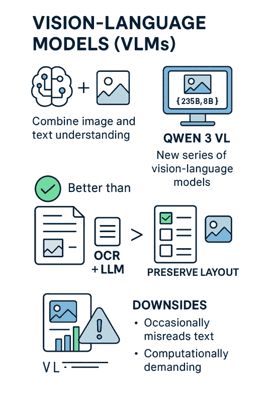
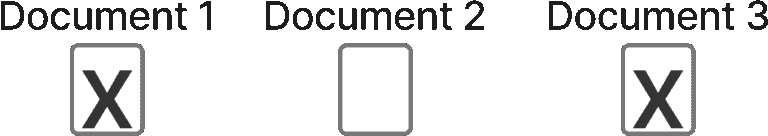
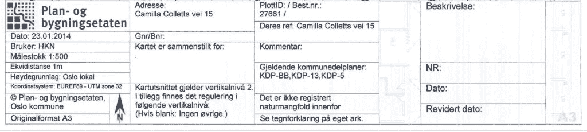

# 如何使用前沿视觉 LLMs：Qwen3-VL

> 原文：[`towardsdatascience.com/how-to-use-frontier-vision-llms-qwen-3-vl-2/`](https://towardsdatascience.com/how-to-use-frontier-vision-llms-qwen-3-vl-2/)

<mdspan datatext="el1760993146807" class="mdspan-comment">视觉语言模型</mdspan> (VLMs) 是强大的模型，能够输入图像和文本，并以文本形式响应。这使得我们能够在文档和图像上执行视觉信息提取。在这篇文章中，我将讨论新发布的 Qwen 3 VL，以及 VLMs 所拥有的强大能力。

Qwen 3 VL 几周前发布，最初是 235B-A22B 模型，这是一个相当大的模型。然后他们发布了 30B-A3B，现在刚刚发布了密集的 4B 和 8B 版本。我的目标是这篇文章要突出视觉语言模型的能力，并在高层次上通知你它们的性能。虽然有许多其他高质量的 VLMs 可用，但我在这篇文章中写 Qwen 3 VL 作为具体例子。我写这篇文章时，与 Qwen 没有任何关联。



这张信息图涵盖了这篇文章的主要主题。我将讨论视觉语言模型，以及它们在许多情况下比使用 OCR + LLMs 理解文档更好的情况。此外，我将讨论使用 VLMs 进行 OCR，以及使用 Qwen 3 VL 进行信息提取，最后我将讨论 VLMs 的一些缺点。图片由 ChatGPT 提供。

## 为什么我们需要视觉语言模型

视觉语言模型是必要的，因为替代方案是依赖 OCR 并将 OCR 文本输入到 LLM 中。这有几个问题：

+   OCR 并不完美，LLM 将不得不处理不完美的文本提取

+   你会失去文本视觉位置中的信息

传统的 OCR 引擎，如 Tesseract，长期以来对文档处理至关重要。OCR 使我们能够输入图像并从中提取文本，从而能够进一步处理文档的内容。然而，传统的 OCR 远非完美，它可能难以处理小文本、倾斜的图像、垂直文本等问题。如果你有糟糕的 OCR 输出，你将难以完成所有下游任务，无论你是在使用正则表达式还是 LLM。因此，直接将图像输入到 VLMs 中，而不是将 OCR 文本输入到 LLMs 中，在利用信息方面要有效得多。

文本的视觉位置有时对理解文本的意义至关重要。想象一下下面的例子，其中有一些复选框突出显示哪些文本是相关的，其中一些复选框被勾选，而另一些则没有被勾选。然后你可能有一些与每个复选框对应的文本，其中只有勾选的复选框旁边的文本是相关的。使用 OCR + LLMs 提取这些信息具有挑战性，因为你不知道勾选的复选框属于哪个文本。然而，使用视觉语言模型解决这个任务是非常简单的。



这个例子突出了一个需要视觉语言模型的情况。如果你只是对文本进行 OCR，你会失去勾选框的视觉位置，因此很难知道哪三个文档是相关的。然而，使用视觉语言模型解决这个任务却很简单。图片由作者提供。

我将上面的图片输入到 Qwen 3 VL 中，它回复了以下所示的内容：

```py
Based on the image provided, the documents that are checked off are:

- **Document 1** (marked with an "X")
- **Document 3** (marked with an "X")

**Document 2** is not checked (it is blank).
```

如你所见，Qwen 3 VL 轻松地正确解决了这个问题。

* * *

我们需要 VLMs 的另一个原因是我们可以获得视频理解。真正理解视频剪辑会非常具有挑战性，因为视频中的许多信息不是以文本形式显示，而是直接以图像形式展示。因此，OCR 并不有效。然而，新一代的 VLMs 允许你输入数百张图片，例如，代表一个视频，让你能够执行视频理解任务。

## 视觉语言模型任务

你可以将视觉语言模型应用于许多任务。我将讨论一些最相关的任务。

+   OCR

+   信息提取

### 数据

我会使用下面的图片作为测试的示例图片。



我会使用这张图片来测试 Qwen 3 VL。这张图片是来自挪威奥斯陆市政府规划部门的公开文档。我使用这张图片，因为它是一个你可能想要应用视觉语言模型的实际文档的例子。请注意，我已经裁剪了图片，因为原始图片中包含了一张图纸。不幸的是，我的本地电脑处理不了这么大的图片，所以我决定裁剪它。这让我能够以高分辨率运行图片通过 Qwen 3 VL。这张图片的分辨率为（768, 136），在这个例子中足够用于 OCR。它是从 600 DPI 的 PDF 中裁剪的 JPG 图片中获取的。

我会使用这张图片，因为它是一个真实文档的例子，非常适合应用 Qwen 3 VL。此外，我已经裁剪了图片到当前形状，这样我就可以将高分辨率的图片输入到我的本地电脑上的 Qwen 3 VL 中。如果你想在图片上执行 OCR，保持高分辨率是至关重要的。我是使用 600 DPI 从 PDF 中提取的 JPG。通常，300 DPI 就足够用于 OCR，但我保留了更高的 DPI 以确保，这在小图片中效果很好。

### 准备 Qwen 3 VL

我需要以下导入来运行 Qwen 3 VL：

```py
torch
accelerate
pillow
torchvision
git+https://github.com/huggingface/transformers
```

你需要从源代码（GitHub）安装 Transformers，因为 Qwen 3 VL 在最新的 Transformers 版本中尚未提供。

以下代码加载了导入、模型和处理器，并创建了一个推理函数：

```py
from transformers import Qwen3VLForConditionalGeneration, AutoProcessor
from PIL import Image
import os
import time

# default: Load the model on the available device(s)
model = Qwen3VLForConditionalGeneration.from_pretrained(
    "Qwen/Qwen3-VL-4B-Instruct", dtype="auto", device_map="auto"
)

processor = AutoProcessor.from_pretrained("Qwen/Qwen3-VL-4B-Instruct")

def _resize_image_if_needed(image_path: str, max_size: int = 1024) -> str:
    """Resize image if needed to a maximum size of max_size. Keep the aspect ratio."""
    img = Image.open(image_path)
    width, height = img.size

    if width <= max_size and height <= max_size:
        return image_path

    ratio = min(max_size / width, max_size / height)
    new_width = int(width * ratio)
    new_height = int(height * ratio)

    img_resized = img.resize((new_width, new_height), Image.Resampling.LANCZOS)

    base_name = os.path.splitext(image_path)[0]
    ext = os.path.splitext(image_path)[1]
    resized_path = f"{base_name}_resized{ext}"

    img_resized.save(resized_path)
    return resized_path

def _build_messages(system_prompt: str, user_prompt: str, image_paths: list[str] | None = None, max_image_size: int | None = None):
    messages = [
        {"role": "system", "content": [{"type": "text", "text": system_prompt}]}
    ]

    user_content = []
    if image_paths:
        if max_image_size is not None:
            processed_paths = [_resize_image_if_needed(path, max_image_size) for path in image_paths]
        else:
            processed_paths = image_paths
        user_content.extend([
            {"type": "image", "min_pixels": 512*32*32, "max_pixels": 2048*32*32, "image": image_path}
            for image_path in processed_paths
        ])
    user_content.append({"type": "text", "text": user_prompt})

    messages.append({
        "role": "user",
        "content": user_content,
    })

    return messages

def inference(system_prompt: str, user_prompt: str, max_new_tokens: int = 1024, image_paths: list[str] | None = None, max_image_size: int | None = None):
    messages = _build_messages(system_prompt, user_prompt, image_paths, max_image_size)

    inputs = processor.apply_chat_template(
        messages,
        tokenize=True,
        add_generation_prompt=True,
        return_dict=True,
        return_tensors="pt"
    )
    inputs = inputs.to(model.device)

    start_time = time.time()
    generated_ids = model.generate(**inputs, max_new_tokens=max_new_tokens)
    generated_ids_trimmed = [
        out_ids[len(in_ids):] for in_ids, out_ids in zip(inputs.input_ids, generated_ids)
    ]
    output_text = processor.batch_decode(
        generated_ids_trimmed, skip_special_tokens=True, clean_up_tokenization_spaces=False
    )
    end_time = time.time()
    print(f"Time taken: {end_time - start_time} seconds")

    return output_text[0] 
```

### OCR

OCR 是一项大多数 VLMs 都训练的任务。例如，你可以阅读 Qwen VL 模型的报告，其中他们提到 OCR 数据是训练集的一部分。为了训练 VLMs 执行 OCR，他们给模型一系列图像和这些图像中的文本。然后模型学习从图像中提取文本。

我将使用以下提示对图像进行 OCR，这个提示与 Qwen 团队用于执行 OCR 的[Qwen 3 VL 食谱](https://github.com/QwenLM/Qwen3-VL/blob/main/cookbooks/ocr.ipynb)相同。

```py
user_prompt = "Read all the text in the image."
```

现在，我将运行模型。我们正在运行的测试图像我命名为*example-doc-site-plan-cropped.jpg*

```py
system_prompt = """
You are a helpful assistant that can answer questions and help with tasks.
"""

user_prompt = "Read all the text in the image."
max_new_tokens = 1024

image_paths = ["example-doc-site-plan-cropped.jpg"]
output = inference(system_prompt, user_prompt, max_new_tokens, image_paths, max_image_size=1536)
print(output) 
```

输出如下：

```py
Plan- og
bygningsetaten

Dato: 23.01.2014
Bruker: HKN
Målestokk 1:500
Ekvidistanse 1m
Høydegrunnlag: Oslo lokal
Koordinatsystem: EUREF89 - UTM sone 32
© Plan- og bygningsetaten,
Oslo kommune
Originalformat A3

Adresse:
Camilla Colletts vei 15

Gnr/Bnr:
.

Kartet er sammenstilt for:
.

PlotID: / Best.nr.:
27661 /

Deres ref: Camilla Colletts vei 15

Kommentar:
Gjeldende kommunedelplaner:
KDP-BB, KDP-13, KDP-5

Kartutsnittet gjelder vertikalinvå 2.
I tillegg finnes det regulering i
følgende vertikalinvå:
(Hvis blank: Ingen øvrige.)

Det er ikke registrert
naturn mangfold innenfor
Se tegnforklaring på eget ark.

Beskrivelse:
NR:
Dato:
Revidert dato:
```

这个输出来自我的测试，完全正确，覆盖了图像中的所有文本，并提取了所有正确的字符。

### 信息提取

你也可以使用视觉语言模型进行信息提取。例如，这可以用来从图像中提取重要元数据。通常，你也会希望将这些元数据提取为 JSON 格式，这样它就很容易解析，并可用于下游任务。在这个例子中，我将提取：

+   日期 – 在这个例子中是*23.01.2024*

+   地址 – 在这个例子中是*Camilla Colletts vei 15*

+   门牌号（Gnr） – 在测试图像中是一个空白字段

+   比例尺（scale） – *1:500*

我正在运行以下代码：

```py
user_prompt = """
Extract the following information from the image, and reply in JSON format:
{
    "date": "The date of the document. In format YYYY-MM-DD.",
    "address": "The address mentioned in the document.",
    "gnr": "The street number (Gnr) mentioned in the document.",
    "scale": "The scale (målestokk) mentioned in the document.",
}
If you cannot find the information, reply with None. The return object must be a valid JSON object. Reply only the JSON object, no other text.
"""
max_new_tokens = 1024

image_paths = ["example-doc-site-plan-cropped.jpg"]
output = inference(system_prompt, user_prompt, max_new_tokens, image_paths, max_image_size=1536)
print(output) 
```

输出如下：

```py
{
    "date": "2014-01-23",
    "address": "Camilla Colletts vei 15",
    "gnr": "15",
    "scale": "1:500"
} 
```

JSON 对象格式正确，Qwen 已成功提取了日期、地址和比例尺字段。然而，Qwen 实际上返回了一个 gnr。最初，当我看到这个结果时，我以为这是一种幻觉，因为测试图像中的 Gnr 字段是空的。然而，Qwen 实际上做出了一个自然的假设，即 Gnr 在地址中可用，在这个例子中是正确的。

为了确保它能在找不到任何内容时回答“None”，我要求 Qwen 提取 Bnr（建筑号），这个例子中没有提供。运行以下代码：

```py
user_prompt = """
Extract the following information from the image, and reply in JSON format:
{
    "date": "The date of the document. In format YYYY-MM-DD.",
    "address": "The address mentioned in the document.",
    "Bnr": "The building number (Bnr) mentioned in the document.",
    "scale": "The scale (målestokk) mentioned in the document.",
}
If you cannot find the information, reply with None. The return object must be a valid JSON object. Reply only the JSON object, no other text.
"""
max_new_tokens = 1024

image_paths = ["example-doc-site-plan-cropped.jpg"]
output = inference(system_prompt, user_prompt, max_new_tokens, image_paths, max_image_size=1536)
print(output) 
```

我得到：

```py
{
    "date": "2014-01-23",
    "address": "Camilla Colletts vei 15",
    "Bnr": None,
    "scale": "1:500"
}
```

所以，正如你所看到的，Qwen 确实能够告诉我们文档中是否缺少信息。

## 视觉语言模型的缺点

我还想指出，视觉语言模型也存在一些问题。我测试 OCR 和信息提取的图像相对简单。要真正测试 Qwen 3 的能力，我必须让它面对更具挑战性的任务，例如，从更长的文档中提取更多文本，或者让它提取更多元数据字段。

从我所见来看，VLMs 的主要当前缺点是：

+   有时 OCR 会遗漏文本

+   推理速度慢

当使用 VLMs 进行 OCR 时，我发现缺失文本的情况时有发生。当这种情况发生时，VLM 通常只是遗漏文档的一部分，并完全忽略文本。这自然是非常成问题的，因为它可能会错过对下游任务（如执行关键词搜索）至关重要的文本。这种情况发生的原因是一个复杂的话题，超出了本文的范围，但如果你使用 VLMs 进行 OCR，你应该知道这是一个问题。

此外，VLMs 需要大量的处理能力。我在我的 PC 上本地运行，尽管我也在运行一个非常小的模型。当我只是想要处理一个 2048×2048 分辨率的图像时，我就开始遇到内存问题，这如果我想从更大的文档中提取文本，就成问题了。因此，你可以想象将 VLMs 应用于以下哪种情况是多么资源密集：

+   一次性处理更多图像（例如，处理 10 页文档）

+   处理更高分辨率的文档

+   使用具有更多参数的更大 VLM

## 结论

在这篇文章中，我讨论了 VLMs，我一开始讨论了为什么我们需要 VLMs，强调了某些任务需要文本和文本的视觉位置。此外，我还突出了一些你可以使用 VLMs 完成的任务以及 Qwen 3 VL 如何完成这些任务。我认为视觉模态在未来几年将变得越来越重要。直到去年，几乎所有关注点都集中在纯文本模型上。然而，为了获得更强大的模型，我们需要利用视觉模态，这正是我认为 VLMs 将变得极其重要的地方。

**👉 我的免费资源**

**🚀** [使用 LLMs 将你的工程能力提升 10 倍（免费 3 天电子邮件课程）](https://www.eivindkjosbakken.com/email-course)

📚 [获取我的免费视觉语言模型电子书](https://eivindkjosbakken.com/ebook)

💻 [我的视觉语言模型研讨会](https://www.eivindkjosbakken.com/webinar)

**👉 在社交媒体上找到我：**

📩 [订阅我的通讯](https://eivindkjosbakken.com/newsletter)

🧑‍💻 [联系我](https://eivindkjosbakken.com/)

🔗 [LinkedIn](https://www.linkedin.com/in/eivind-kjosbakken/)

🐦 [X / Twitter](https://x.com/EivindKjos)

✍️ [Medium](https://oieivind.medium.com/)
