# 如何在演示中使用陀螺仪，或者为什么带 JoyCon 去 DPG2025

> 原文：[`towardsdatascience.com/how-to-use-gyroscope-in-presentations-or-why-take-a-joycon-to-dpg2025/`](https://towardsdatascience.com/how-to-use-gyroscope-in-presentations-or-why-take-a-joycon-to-dpg2025/)

作者提供的图片

<mdspan datatext="el1744918122091" class="mdspan-comment">本文</mdspan>探讨了基于浏览器的计算笔记本——尤其是 WLJS 笔记本——如何将静态幻灯片转变为动态、实时体验。这种方法不仅限于演示；你可以为学生或同事准备交互式讲义并在网上发布。对于数据科学家、物理学家来说，它突出了传达模型、模拟和可视化的新方法，使复杂思想更加直观和引人入胜。

## PDF 是否足够？

动画、*铃声和哨声*，尤其是那些在 15-20 年前的 PowerPoint 中流行的，在很大程度上已经退居次要位置。再加上 LibreOffice 和 MS Office（甚至在 Windows 和 Mac 版本之间）的兼容性问题，必要字体的存在或缺失——在“舞台”上做一些不同寻常的事情的愿望很快就消失了。

看看现代技术演示：很多时候，它只是一个由包含矢量图形和位图图形的页面组成的 PDF 文档，有时还有消耗兆字节的 GIF 动画（就像这篇帖子一样），毫不留情。

## 未利用的潜力

值得将装饰性的*铃声和哨声*与那些以某些媒体格式携带额外信息的部分区分开来。例如，看看[ECMA-363](https://en.wikipedia.org/wiki/Universal_3D) [1]规范。


将 MATLAB 图转换为 3D PDF / 图片由[Ioannis F. Filippidis](https://github.com/johnyf/fig2u3d)（fig2u3d 手册）提供，BSD-2-Clause

PDF 文档内的 3D 模型仅仅增强了用户/观众的体验。你可以从不同的角度/横截面观察物体。

如此**功能**几乎只在 Adobe Acrobat 中得到支持，其他地方几乎都没有，这让人感到失望。感觉我们过去迈出了一大步，但现在又回到了静态幻灯片。

## 大型科学会议 DPG

[**DPG-Frühjahrstagung**](https://www.dpg-physik.de/aktivitaeten-und-programme/tagungen/fruehjahrstagungen/2025)是德国物理学会（DPG）组织的大型欧洲物理会议[2]。每年，他们聚集超过`10⁴`名科学家，在德国城市举行，涵盖广泛的物理领域。

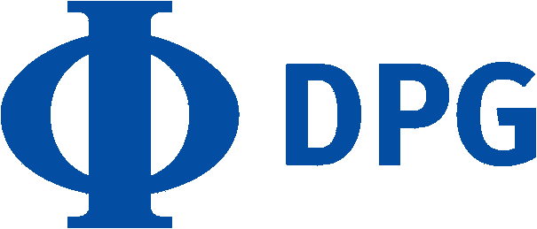

德国物理学会 / 图片由维基媒体提供，PD-textlogo


DPG2025（春季会议）在美丽的雷根斯堡举行 / 照片由[Tobi &Chris](https://www.pexels.com/@tobiandchris/)拍摄，Pexels 许可

有这么多演示，持续时间几乎一周，所以到最后，它变得过于令人难以承受。尽管如此，这并不减少它作为一个网络平台、练习演示和可靠学习当前市场情况、已过去的培训和即将出发的培训的价值。

全体会议的参与者大多是硕士生和博士生，博士后比较少见。

这样一个庞大且易于访问的平台是尝试新事物的绝佳动机 💡 即使可能出错。

## 什么是 JoyCon？

当然，读者肯定见过这样的设备：

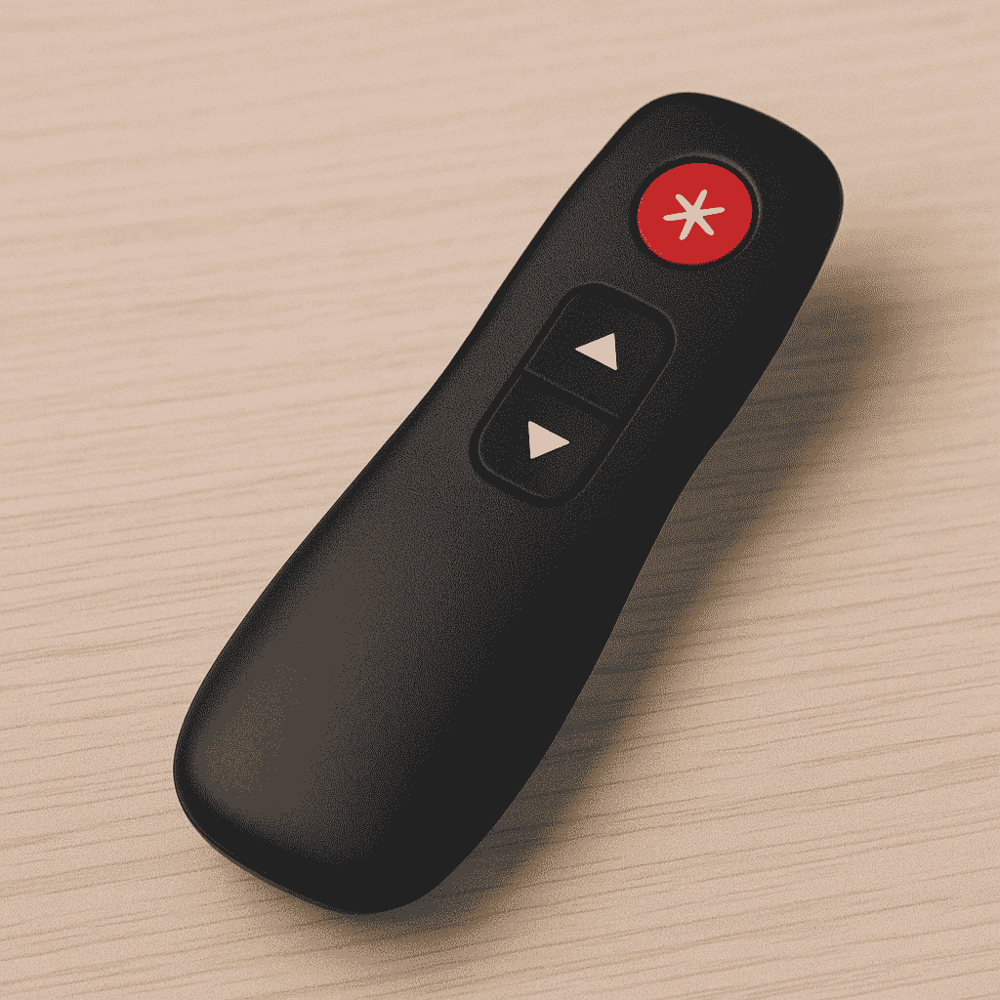

平均 PPT 翻页器设备 / 使用 Dalle 3 由 OpenAI 生成的“PPT 翻页器”图像

该设备充当幻灯片切换器，有时也充当激光笔，通过蓝牙或通过 *dongle* 连接。无论如何，它都是一种带有按钮的控制器。控制器可以更有趣——就像 2017 年任天堂 Switch 便携式游戏机上的那个一样。

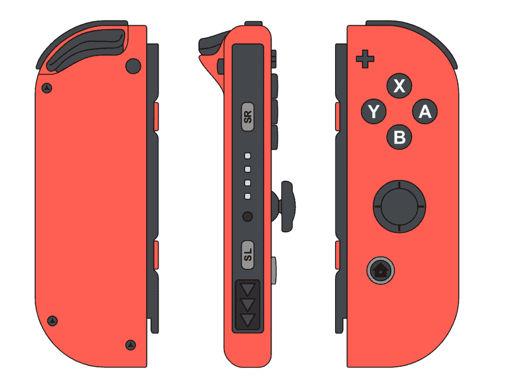

JoyCon (R) / 图像改编自维基百科，PD

它并不大，但有一些额外的酷炫 *功能*：

+   模拟摇杆 🕹️

+   11 个按钮 ☎️

+   红外摄像头 📸 (难以使用，没有好的 API 文档)

+   全 IMU 🌐 (惯性测量单元) 即陀螺仪加加速度计

+   蓝牙连接；被识别为常规 HID

按钮确实可以映射到 PowerPoint，或者摇杆可以用来控制幻灯片，模拟鼠标或键盘点击，就像在这些项目中实现的那样：

+   [Hackster: 右 Joy-Con 控制器作为遥控器](https://www.hackster.io/leo49/right-joy-con-controller-as-a-presentation-remote-5810e4) (Python) [3]

+   [Medium: Nintendo Switch Joy-Con 演示遥控器](https://medium.com/@mimming/nintendo-switch-joy-con-presentation-remote-5a7e08e7ad11) (USB Override MacOS) [4]

我想过要 somehow 使用 IMU 和模拟摇杆。但为此，一个人需要超越 PowerPoint 和 PDF 🧙🏼‍♂️

## 将幻灯片移动到浏览器环境

这个想法并不新颖，但重要的是要记住，这种方法可能并不适用于每个人。然而，通过将演示显示和创建移动到浏览器（尤其是 JavaScript 和 HTML 领域），我们自动获得了现代网络技术的所有可能性：外围设备支持、JavaScript、CSS 动画魔法等等，包括视频。重要的是要注意，所有这些都是 **默认跨平台的** 并且几乎在所有地方都能工作。

例如，可以使用简单的框架（更确切地说，是一个小型库）在 Markdown（或/和 HTML）中创建幻灯片 [RevealJS](https://revealjs.com/markdown/) [5]

> 还有基于 MDX 的演示引擎，以及像 Manim [6]、Motion Canvas [7]这样的东西，但这些需要更多的技能来掌握。

*RevealJS* API 相当简单，因此通过 JavaScript 命令控制幻灯片很容易实现：

```py
setTimeout(() =>{
  Reveal.navigateNext(1);
}, 1000)
```

然而，这种直接方法存在显著的缺点。它需要一个互联网连接，如果你希望避免使用它，你将需要使用打包器（例如 Rollup）并将所有 JavaScript 库嵌入到一个单独的 HTML 文件中，例如。或者，你也可以运行一个本地 Web 服务器。

### 使用 Jupyter Notebook 的选项

如果你喜欢 Python 和 IPYNB，那么使用*nbconvert*——它将直接将你的笔记本转换为 RevealJS 演示文稿，你甚至都不会注意到它！或者使用 Jupyter 的扩展——[RISE](https://github.com/damianavila/RISE) [8]

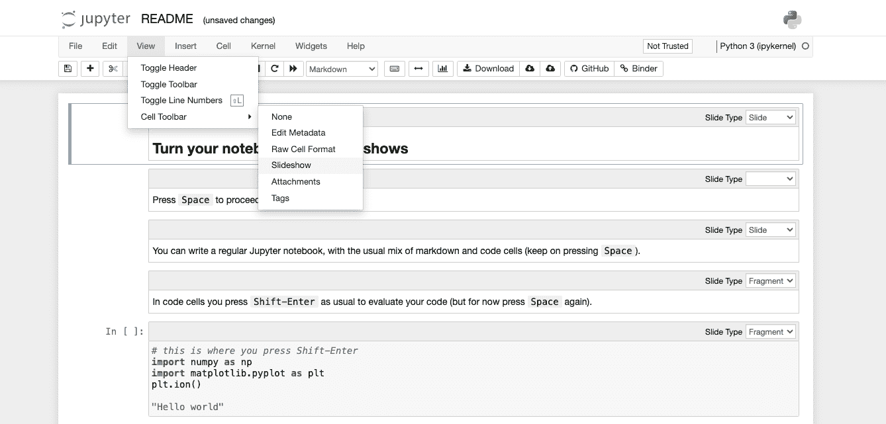

从 Jupyter Notebook 创建演示文稿 / 图片由作者提供

在任何情况下，这个想法很简单——我们需要以某种方式进入 Web 浏览器环境，以利用 JoyCon 的所有可能性。

在[Binder](https://mybinder.org/v2/gh/damianavila/RISE/master?filepath=examples%2FREADME.ipynb)!上试一试！

### 使用 WLJS Notebook 的选项

我对[WLJS](https://wljs.io) [9]的看法可能有些偏见，因为我也是其开发者（以及活跃用户）。这个具有笔记本界面的开源 IDE 与 Web 环境更加紧密集成，因为幻灯片不是在那里导出，而是**执行**，并且只是另一种类型的输出单元格，与熟悉的 Markdown 并列。

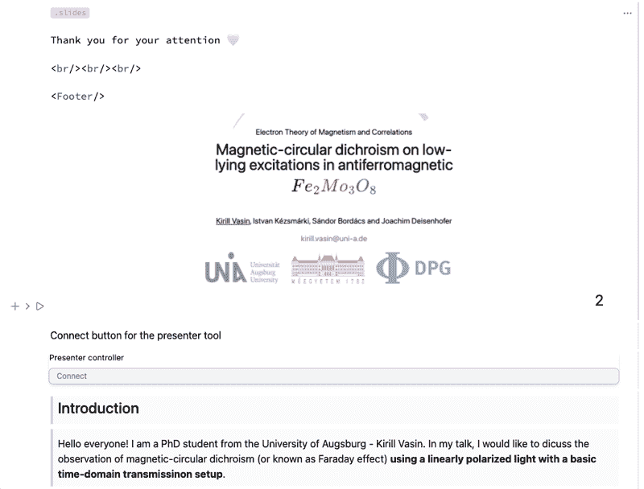

WLJS Notebook / 图片由作者提供

在底层，它也使用 RevealJS，但有一些额外的功能：

+   它可以离线工作

+   它允许嵌入交互式元素和组件，类似于 LaTeX Beamer

+   它与 Wolfram 语言（免费软件发行版）集成

在[**这个故事**](https://medium.com/@krikus.ms/reinventing-dynamic-and-portable-notebooks-with-javascript-and-wolfram-language-22701d38d651)[10]**]中了解更多信息。我们发布在我们官方博客上的终极指南，介绍了如何在其中制作演示文稿：[动态演示文稿，或者如何用 Markdown 和 WL 编写幻灯片](https://wljs.io/blog/2025/03/02/ultimate-ppt) [11]。

## 让我们深入探讨 JoyCon

因此，最简单的选项是使用已经准备好的库[joy-con-webhid](https://github.com/tomayac/joy-con-webhid) [12]。为什么要在别人已经为我们做了很好的工作时浪费时间重新发明轮子呢？

```py
npm install joy-con-webhid --prefix .
```

> 所有后续的示例都将从 WLJS Notebook 中提取。然而，你也可以使用 Python + FAST API 通过 JavaScript 或类似的东西进行接口，或者甚至只使用 JS。笔记本的在线版本可在[这里](https://jerryi.github.io/wljs-demo/PresenterJoyCon.html) [13]找到。

首先，让我们听听控制器端口传来的信息。

<details class="wp-block-details is-layout-flow wp-block-details-is-layout-flow"><summary>代码</summary>

```py
.esm
import { connectJoyCon, connectedJoyCons } from 'joy-con-webhid';

// Create connect button
const connectButton = document.createElement('button');
connectButton.className = 'relative cursor-pointer rounded-md h-6 pl-3 pr-2 text-left text-gray-500 focus:outline-none ring-1 sm:text-xs sm:leading-6 bg-gray-100';
connectButton.innerText = "Connect";
let connectionState = "Connect";
let isJoyConConnected = false;
let lastUpdateTime = performance.now();
let isAllowedToConnect = false;
// main handler function (warning! called at 60FPS)
function handleJoyConInput(detail) {
  const currentTime = performance.now();
  if (currentTime - lastUpdateTime > 50) { // slow down
    lastUpdateTime = currentTime;
    console.log(detail);
  }
}
// JoyCon periodically goes to sleep, we need to wake it up
const connectionCheckInterval = setInterval(async () => {
  if (!isAllowedToConnect) return;
  const connectedDevices = connectedJoyCons.values();
  isJoyConConnected = false;
  for (const joyCon of connectedDevices) {
    isJoyConConnected = true;
    if (joyCon.eventListenerAttached) continue;
    await joyCon.open();
    await joyCon.enableStandardFullMode();
    await joyCon.enableIMUMode();
    await joyCon.enableVibration();
    await joyCon.rumble(600, 600, 0.5);
    joyCon.addEventListener('hidinput', ({ detail }) => handleJoyConInput(detail));
    joyCon.eventListenerAttached = true;
  }
  updateConnectionState();
}, 2000);
// Update button state
function updateConnectionState() {
  if (isJoyConConnected && connectionState !== "Connected") {
    connectionState = "Connected";
    connectButton.innerText = connectionState;
    connectButton.style.background = '#d8ffd8';
  } else if (!isJoyConConnected && connectionState !== "Connect") {
    connectionState = "Connect";
    connectButton.innerText = connectionState;
    connectButton.style.background = '';
  }
}
// Handle click event
connectButton.addEventListener('click', async () => {
  isAllowedToConnect = true;
  if (!isJoyConConnected) {
    await connectJoyCon();
  }
});
// Just decorations
const container = document.createElement('div');
container.innerHTML = `<small>Presenter controller</small>`;
container.appendChild(connectButton);
container.className = 'flex flex-col gap-y-2 bg-white rounded-md shadow-md';
// Return DOM element to the page
this.return(container);
// When a cell got removed
this.ondestroy(() => {
  cancelInterval(connectionCheckInterval);
});
```</details>

这里最重要的功能是：

```py
function handleJoyConInput(detail) {
  const currentTime = performance.now();
  if (currentTime - lastUpdateTime > 50) { // slow down
    lastUpdateTime = currentTime;
    console.log(detail); //output to the console
  }
}
```

看起来有很多步骤要做。实际上，大部分代码都是处理连接控制器和绘制一个大的“连接”按钮。不要过分关注特殊方法—它们可以很容易地用你特定环境中的那些方法替换：

+   `this.return(dom)`传递一个`DOMElement`以嵌入到页面上

+   `this.ondestroy(function)`在单元格被删除时调用`function`，以清理计时器等。

+   第一行 `.esm`是指定 WLJS 笔记本中 JavaScript 单元格子类型的一种方式，它需要预捆绑。

当我们运行这个代码单元格时，我们将看到以下内容：

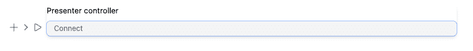

*DOM 输出元素/图像由作者提供*

然后按照以下步骤操作：

+   从 Nintendo Switch（系统 → 控制器 → 断开连接）断开控制器。

+   通过按住 JoyCon（R）侧面的按钮，将 JoyCon（R）与 PC 配对。

+   在我们的**演示控制器**上按下“连接”。

打开浏览器控制台，我们可以看到以下消息：

```py
{
    "buttonStatus": {
        "y": false,
        "x": false,
        "b": false,
        "a": false,
        "r": false,
        "zr": false,
        "sr": false,
        "sl": false,
        "plus": false,
        "rightStick": false,
        "home": false,
    },
    "analogStickRight": {
        "horizontal": "0.1",
        "vertical": "0.3"
    },
    "actualAccelerometer": {
        "x": 0,
        "y": 0,
        "z": 0
    },
    "actualGyroscope": {
        "dps": {
            "x": 0,
            "y": 0,
            "z": 0
        },
        "rps": {
            "x": 0,
            "y": 0,
            "z": 0
        }
    }
}
```

数据量相当大！让我们尝试利用这些数据来提升我们的演示文稿 💡

## 按钮 ☎️

首先，我们可以使用两个按钮来切换幻灯片

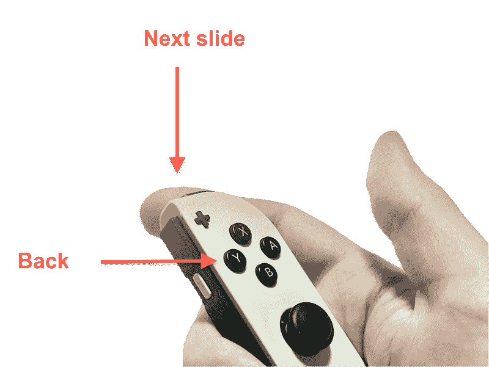

*图像由作者提供*

在 WLJS 笔记本中，幻灯片也可以通过调用 RevealJS API 的 Wolfram 包装函数进行程序控制。

```py
FrontSlidesSelected["navigateNext", 1] // FrontSubmit
```

剩下的就是要在按钮（或开关）点击的正确时刻触发这个函数。为此，需要从 JavaScript 世界向 Wolfram 机器发送事件，然后我们可以对它们做任何我们想做的事情。这导致了以下图示：

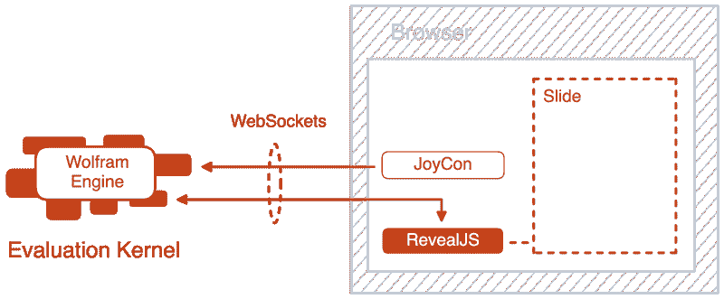

*图像由作者提供*

> *你不必考虑这一点，因为它通过 API 无缝实现*

让我们回到代码单元格并**修改处理程序**。

<details class="wp-block-details is-layout-flow wp-block-details-is-layout-flow"><summary>代码</summary>

```py
//....
//.......
const buttonStates = { //all buttons states on JoyCon (R)
  a: false, b: false, home: false, plus: false, r: false, sl: false, sr: false,
  x: false, y: false, zr: false
};

const joystickPosition = [0.0, 0.0];
let restingJoystick = [0.0, 0.0];
let isCalibrated = false;

function handleJoyConInput(detail) {
  if (!isCalibrated) { //calibration
    restingJoystick = [Number(detail.analogStickRight.horizontal), Number(detail.analogStickRight.vertical)];
    isCalibrated = true;
    return;
  }
  const currentTime = performance.now();
  if (currentTime - lastUpdateTime > 50) {
    lastUpdateTime = currentTime;
    let buttonPressed = false;
    let joystickMoved = false;
    for (const key of Object.keys(buttonStates)) {
      if (!buttonStates[key] && detail.buttonStatus[key]) buttonPressed = true;
      buttonStates[key] = detail.buttonStatus[key];
    }
    const verticalOffset = Number(detail.analogStickRight.vertical) - restingJoystick[1];
    const horizontalOffset = Number(detail.analogStickRight.horizontal) - restingJoystick[0];
    if (Math.abs(verticalOffset) > 0.1 || Math.abs(horizontalOffset) > 0.1) {
      joystickMoved = true;
    }
    joystickPosition[0] = horizontalOffset;
    joystickPosition[1] = -verticalOffset;
    if (buttonPressed) {
      for (const key of Object.keys(buttonStates)) {
        if (buttonStates[key]) {
          server.kernel.io.fire('JoyCon', true, key);
          break;
        }
      }
    }
    if (joystickMoved) {
      server.kernel.io.fire('JoyCon', joystickPosition, 'Stick');
    }
  }
}
//.......
//..
```</details>

如你所见，我们在这里添加了几个项目：

+   *摇杆校准*—模拟摇杆漂移，因此它们的数字位置永远不会完美`0.,0.`。

+   *所有按钮的状态*—为什么每次都需要用力敲门，如果你只需要在状态改变时轻轻敲击？这减少了系统压力。

+   *将状态发送到事件池*—这仅适用于 WLJS，我们将数据发送到 Wolfram 机器（如果你在 Jupyter 中，则是 Python）。

最后一点看起来像这样（用你环境中的等效项替换）：

```py
server.kernel.io.fire(String name, Object state, String pattern);
```

然后，在 Wolfram 一侧，我们可以轻松地订阅这些事件，如下所示

```py
EventHandler["name", {
  "pattern" -> Function[state,
    Print[state];
  ]
}]
```

这非常方便，因为 JavaScript 将按下的按钮名称作为模式发送。在这种情况下，你可以立即订阅幻灯片切换，例如，像这样：

+   ZR — 下一张幻灯片

+   Y — 后退

因此，程序控制幻灯片变得直观：

```py
EventHandler["JoyCon", {
  "zr" -> (FrontSubmit[FrontSlidesSelected["navigateNext", 1]]&),
  "y" -> (FrontSubmit[FrontSlidesSelected["navigatePrev", 1]]&)
}];
```

## 让我们在实践中测试

让我们创建一个简单的演示文稿。开始输入

```py
.slide

# Slide 1

__Hey Medium!__

---


```

现在，让我们将 JoyCon 连接到 PC，并通过按连接按钮将其链接到我们的 JavaScript 脚本。然后，在活动会话中*一次*订阅事件。

现在，只需运行带有幻灯片的单元格：


掌握 JoyCon 的第一个重大步骤已经完成！/ Image by author*

## 模拟杆 🕹️

理论上，这个杆可以同时控制两个滑块。对于 DPG 春季会议，我有一个想法，即现场演示一个非常奇特的效果**m𝒶𝑔𝒾c𝑎𝓁 𝓌𝑜𝓇𝒹𝓈 𝒻𝓇𝑜𝓂 𝓅𝒽𝓎𝓈𝒾𝒸𝓈**。我相信，有些概念在舞台上现场演示时更有影响力和易于理解。

这里是交互式小部件的压缩代码片段：

```py
FaradayWidget := ManipulatePlot[
Abs[(E^(I w (-1 + Sqrt[1 + (f/((-I g - w) w + (d - w0)²))])) + E^(I w (-1 + Sqrt[1 + (f/((-I g - w) w + (d + w0)²))]))) /. {g -> 0.694, w0 -> 50.0}]
, {w, 20, 80}, {{f,2},0,100,1}, {{d,0},0,10,1}
, FrameLabel->{"wavenumber", "transmission"}
, Frame->True
];
FaradayWidget
```

> 这个小部件的交互式在线版本在此[可用](https://jerryi.github.io/wljs-demo/THzFaraday.html) [14]

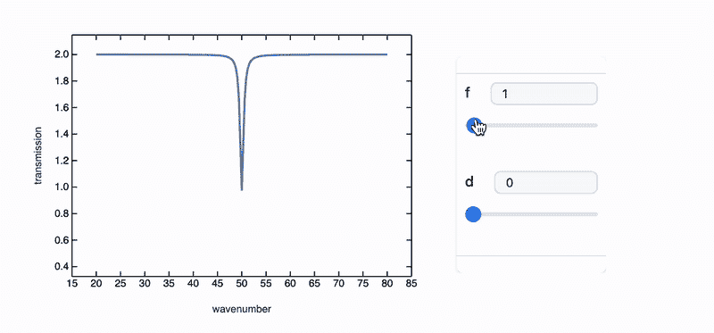

*图片由作者提供*

要将其嵌入幻灯片中，插入其符号作为标签（类似于 JSX）：

```py
.slide

# Faraday Widget
Here it is in action
<FaradayWidget/>
```

现在，让我们将其链接到我们的杆

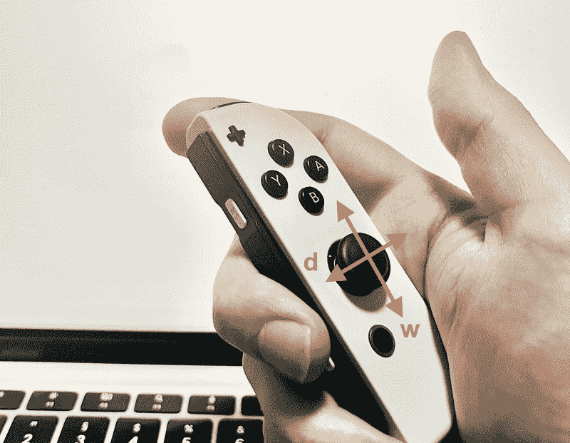

*图片由作者提供*

首先，让我们进行一个简单的测试，并将它的位置绑定到屏幕上的一个圆盘上：

```py
pos = {0.,0.};
EventHandler["JoyCon", {"Stick" -> ((pos = #)&)}];

Graphics[{
  Circle[{0,0}, 2.],
  Disk[pos // Offload, 0.1]
}]
```

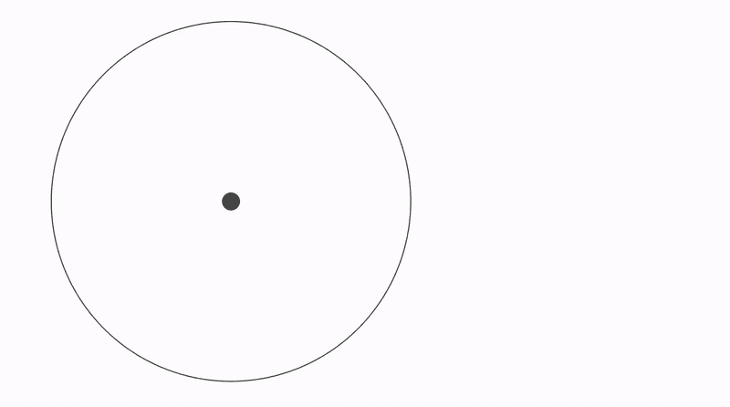

*图片由作者提供*

显然，动作太突然了。此外，使用 JoyCon 进行微调有点痛苦。解决方案？*集成！*

```py
EventHandler["JoyCon", {"Stick" -> ((pos += 0.1 #)&)}];
```

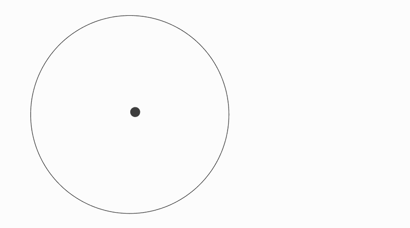

**图片由作者提供**

现在，让我们将`pos`变量链接到我们的小部件的滑块：

```py
FaradayWidget := ManipulatePlot[
Abs[(E^(I w (-1 + Sqrt[1 + (f/((-I g - w) w + (d - w0)²))])) + E^(I w (-1 + Sqrt[1 + (f/((-I g - w) w + (d + w0)²))]))) /. {g -> 0.694, w0 -> 50.0}]
, {w, 20, 80}, {{f,2},0,100,1}, {{d,0},0,10,1}
, FrameLabel->{"wavenumber", "transmission"}
, Frame->True
, "TrackedExpression" -> Offload[5 pos] (* <-- *)
];
```

这就是它在幻灯片上实时呈现的样子：

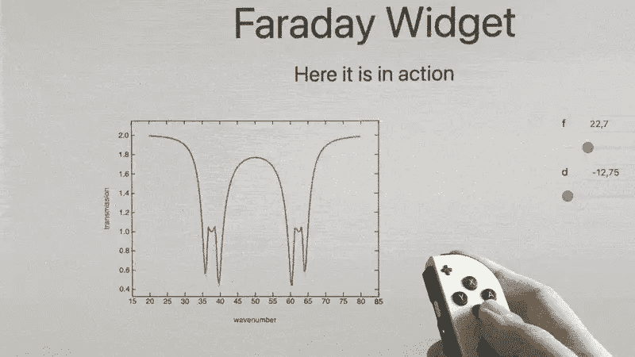

*图片由作者提供*

在实际的 DPG 演示中：

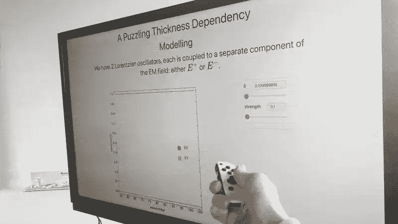

*图片由作者提供*

## 休息片刻

去年 DPG 在柏林举行，今年在雷根斯堡，这个城市的人口大约是柏林的 1/23，面积小 10 倍。然而，巴伐利亚的舒适之地始终离我的❤️更近。

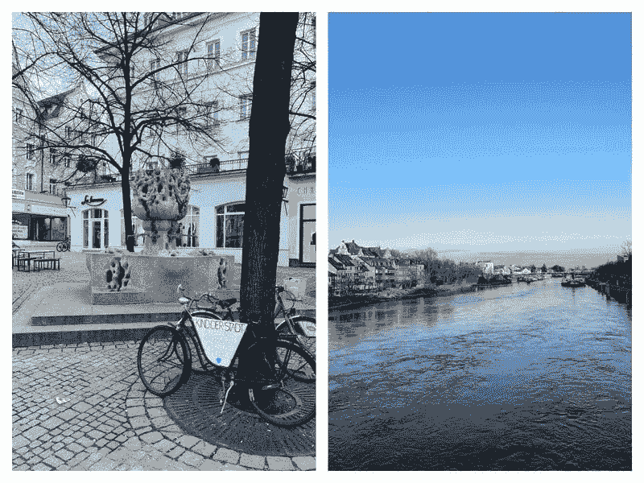

*图片由作者提供*

这就是这所大学。一栋坚实的 60 年代风格的建筑。哇 💪🏻

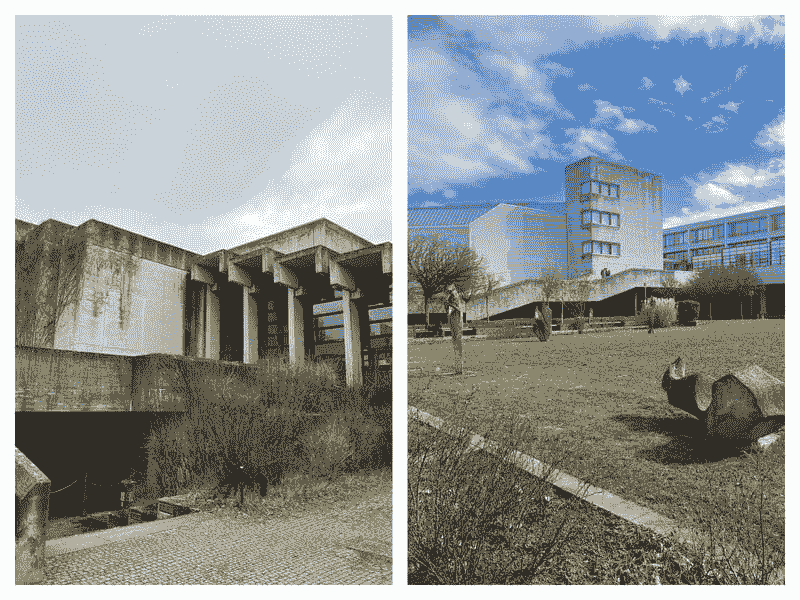

*图片由作者提供*

一项新发明——一个“喝我吃我”的杯子

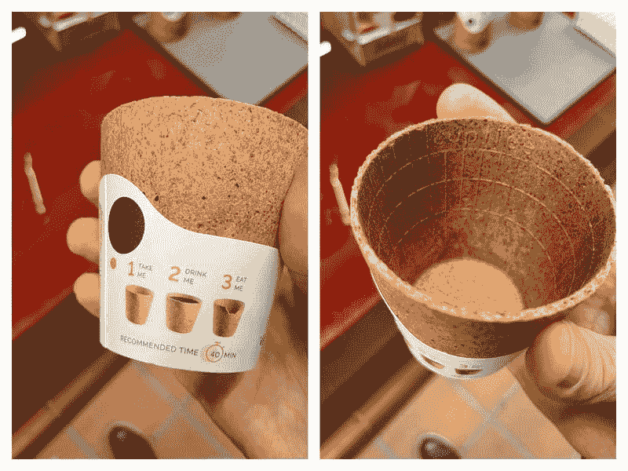

*图片由作者提供*

作为额外奖励，每一杯饮料都带有一点华夫饼干的香味！但是，注意了——当里面装满了热茶时，不要咬它。

由于第一天我就生病了，所以我回到了奥格斯堡的家。总的来说，在会议上待六天相当具有挑战性。

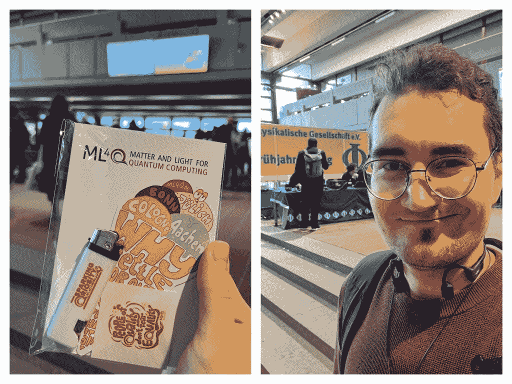

*图片由作者提供*

回到正题 🐏

## IMU 或陀螺仪-加速度计组合 🌐

要使用它们，我们需要从`details`对象中读取相应的字段，即：

+   *实际加速度计*: x, y, z

+   *实际陀螺仪*: rps（每秒弧度）

<details class="wp-block-details is-layout-flow wp-block-details-is-layout-flow"><summary>代码</summary>

```py
//..
//....
const buttonStates = {
  a: false, b: false, home: false, plus: false, r: false, sl: false, sr: false,
  x: false, y: false, zr: false
};

const joystickPosition = [0.0, 0.0];
let restingJoystick = [0.0, 0.0];
let isCalibrated = false;
let imuEnabled = false;
// Enable IMU mode if allowed
core.JoyConIMU = async (args, env) => {
  imuEnabled = await interpretate(args[0], env);
};
// Function to handle Joy-Con input
function handleJoyConInput(detail) {
  if (!isCalibrated) {
    restingJoystick = [Number(detail.analogStickRight.horizontal), Number(detail.analogStickRight.vertical)];
    isCalibrated = true;
    return;
  }
  const currentTime = performance.now();
  if (currentTime - lastUpdateTime > 50) { // Update every 50ms
    lastUpdateTime = currentTime;
    let buttonPressed = false;
    let joystickMoved = false;
    for (const key of Object.keys(buttonStates)) {
      if (!buttonStates[key] && detail.buttonStatus[key]) buttonPressed = true;
      buttonStates[key] = detail.buttonStatus[key];
    }
    const verticalOffset = Number(detail.analogStickRight.vertical) - restingJoystick[1];
    const horizontalOffset = Number(detail.analogStickRight.horizontal) - restingJoystick[0];
    if (Math.abs(verticalOffset) > 0.1 || Math.abs(horizontalOffset) > 0.1) {
      joystickMoved = true;
    }
    joystickPosition[0] = horizontalOffset;
    joystickPosition[1] = -verticalOffset;
    if (imuEnabled) {
      server.kernel.io.fire('JoyCon', {
        'Accelerometer': Object.values(detail.actualAccelerometer),
        'Gyroscope': Object.values(detail.actualGyroscope.dps)
      }, 'IMU');
    }
    if (buttonPressed) {
      for (const key of Object.keys(buttonStates)) {
        if (buttonStates[key]) {
          server.kernel.io.fire('JoyCon', true, key);
          break;
        }
      }
    }
    if (joystickMoved) {
      server.kernel.io.fire('JoyCon', joystickPosition, 'Stick');
    }
  }
}
//....
//..
```</details>

由于 IMU 并非总是必需的，脚本包含一个布尔变量和控制函数`JoyConIMU[True | False]`，允许启用或禁用 IMU 测量。

JoyCon，就像大多数带有 IMU 的其他设备（一些智能手机、手表，但绝对不是 VR 头盔或四旋翼无人机），包括：

+   **三轴陀螺仪**——返回围绕所有三个轴的角速度**弧度/秒**

+   **三轴加速度计**——返回一个加速度向量

**问题：为什么我们不能只用陀螺仪或加速度计？**

让我们尝试输出两者。首先，启用 IMU 使用：

```py
JoyConIMU[True] // FrontSubmit;
```

现在，定义辅助函数和变量：

```py
prevTime = AbsoluteTime[];
angles = {0,0,0};
acceleration = {0,0,-1};

process[imu_] := With[{time = AbsoluteTime[]},
  With[{dt = time - prevTime},
    angles = (angles + {-1,1,1} imu["Gyroscope"][[{3,1,2}]] dt);
    acceleration = imu["Accelerometer"];
    prevTime = time;
  ]
]
```

**这里发生了什么：**

+   加速度向量简单地存储在`加速度`中。

+   陀螺仪数据通过以下方式处理：

    +   重新排序角速度值（JoyCon 硬件方向）和调整方向。

    +   对时间进行积分以获得方向角度

因此，我们得到：

+   **三个角度**定义 JoyCon 方向的`角度`。

+   **一个加速度向量**（静止时——重力方向）`加速度`。

这三个角度方便地表示为一个矩阵（张量）：

```py
RollPitchYawMatrix[{\[Alpha], \[Beta], \[Gamma]}] // MatrixForm
```

将此矩阵应用于任何 3D 对象，使其根据这些角度进行定位。在 JoyCon 上，这看起来就像这样：

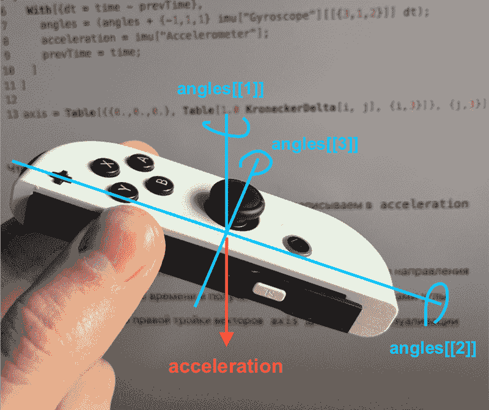

图片由作者提供

重要的是要注意，由于我们只测量一阶导数（使用陀螺仪），因此初始 IMU 方向仍然未知。因此，我们手动设置初始状态，即

`angles = {0., 0., 0}`

```py
EventHandler["JoyCon", {
  "IMU" -> Function[val, 
    process[val];
  ]
}];

angles = {0,0,0}; (* calibration *)
Refresh[acceleration, 0.25] (* dynamically update *)
Refresh[angles, 0.25] (* dynamically update *)
```

实时数据输出：

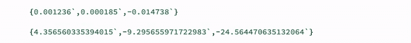

图片由作者提供

嗯……这些值的意义并不明显。让我们尝试将它们作为向量在 3D 空间中绘制：

```py
axis = Table[{{0.,0.,0.}, Table[1.0 KroneckerDelta[i, j], {i,3}]}, {j,3}];

EventHandler["JoyCon", {
  "IMU" -> Function[val, 
    process[val];
    axis[[1]] = {{0.,0.,0.}, RollPitchYawMatrix[angles].{0,1.0,0.0}};
    axis[[2]] = {{0.,0.,0.}, RollPitchYawMatrix[angles].{-1.0,0.0,0}};
    axis[[3]] = {{0.,0.,0.}, -Normalize[acceleration][[{2,1,3}]]};
    axis = axis;
  ]
}];
```

然后将它们渲染为彩色圆锥，其中：

+   蓝色和红色——定义从陀螺仪数据导出的角度

+   绿色——加速度计数据（反转并归一化）

```py
{
  {Opacity[0.2], Sphere[]}, 
  Red, Tube[axis[[1]]//Offload, {0.2, 0.01}],
  Blue, Tube[axis[[2]]//Offload, {0.2, 0.01}],
  Green, Tube[axis[[3]]//Offload, {0.2, 0.01}]
} // Graphics3D

EventHandler[InputButton["Reset"], Function[Null, angles *= .0]]
```

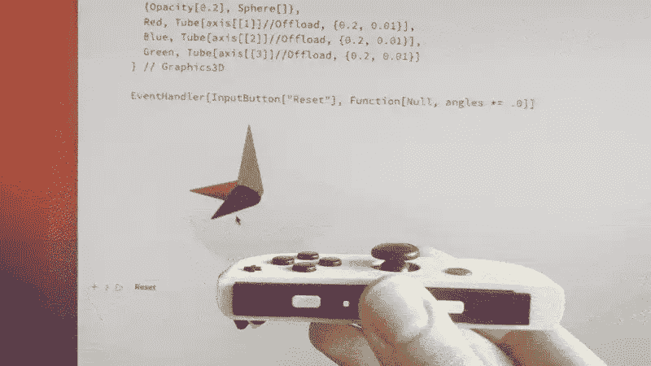

图片由作者提供

绿色向量始终正确对齐，而蓝色和红色向量，代表陀螺仪角度，随着时间的推移积累误差，尤其是在快速运动中，导致**漂移**。

解决这个问题有很多方法。一般思路是使用加速度计数据（绿色向量）调整角度，因为加速度计精确地确定了向下方向（*直到外部力量干扰它*）。

对于更详细的解释，请查看由 [**詹姆斯·兰伯特**](https://www.youtube.com/@james.lambert)[15] 制作的一段精彩视频，该视频探讨了这些问题及其解决方案，包括一个[**使用 Oculus DK1 的详细示例**](https://www.youtube.com/watch?v=ha3fDU-1wHk)。

## 我们为什么需要在演示中用这个？

当我发现这个兔子洞有多深时，我提出了这个问题。在我的磁性会议演讲中，只有一个幻灯片上对 IMU 的想法有道理：

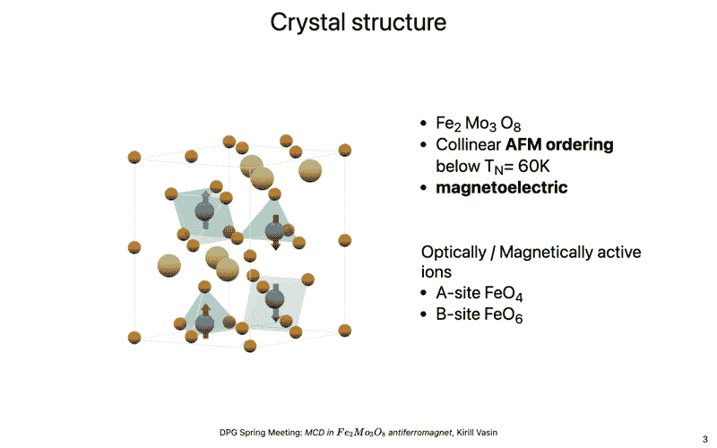

*图片由作者提供*

你看到晶体结构了吗？找到它的“良好”相机角度确实很困难，所以为什么不直接旋转它，让它更加生动呢？我们不需要所有三个角度和加速度，只需要一个就足够了。

因此，我们放弃了加速度计，只保留陀螺仪：

```py
FrontSubmit[JoyConIMU[True]];
timestamp = AbsoluteTime[];
angle = 0.;
rotation = RotationMatrix[angle, {0,0,1.0}];

EventHandler["JoyCon", {
  "IMU" -> Function[val, 
     With[{angularSpeed = val["Gyroscope"][[1]], time = AbsoluteTime[], oldAngle = angle},
       angle += (time - timestamp) angularSpeed;
       timestamp = time;
     ];
     rotation = RotationMatrix[angle, {0,0,1.0}];
  ]
}];
```

现在，我们只需要将 `rotation` 变换张量应用到我们的 3D 结构上。由于这个晶体包含许多离子，它们也是彩色的，我将它们压缩成了 base64

<details class="wp-block-details is-layout-flow wp-block-details-is-layout-flow"><summary>base64 代码</summary>

```py
CrystalRawStructure = "1:eJzVWnlMFFccnl1YLIoXh2gVq2KMqbGRqvEMswoVW1EBUWukxRV2ZevC4lsQtZUSL9Bg6oGRo/GCVLBGStRKFZlRUePZKBW1GsEjrYgVNSiXYudg3rAzuzsPZAd5fwwzyze/73fPmzdv8GJjiE6JYZjJmTqEAk2MyaCJ0+oc6J8cqUOg3hSnU9BXXanDFACMCVFaTaRJ34+6tARj5ETpI5bGaE0mvTuNUvCoGK2ut9k9ZhL01F+MOQCMGRW4OQDs/1fvl3bPgwRZ0XPzD6mdSXRg48W1Ne63vdUCINY8+BPLQGndoIBMhrKfGh1od91a77d0FmjVCDHQihHIkUCW2Hr/SUXEhtVMcXhShwCtMVobB/QRTJXojCBaE6c3xuhcMIs1EGKMXxLF1AAtiP2dhoZodQZtRJx+uT5uJcjMoEclztw/K95gsFRR5lddqMPsWE0Ef/sfuG60GU6JiSrsI5o5YKqf0WAEYPrdiEo/zwocZGiyD5YHluEgYcl/v3ebWd1srRN1mBMbpQWCPgBSysflnx3+lgAZnJuCQjbsvKLvKfSXPcjXMeTdSfCOGUQR2NNDNW3Z4EqCJ1e8J7k99HY5rzh3hnba08vY/N9op2km144YknsL/7D1Plt1Pfsc6++er46uulgMTvv6ee6McG9FsEmCHtU4+JgZT3AQzoxyKfLYqQUTPrv2lABT1uScv1xTh4N5lxRjfQYOUIPRzHhoR/LndT0Sh197Q+dVEG25LziCvUkav0kpB3lh8IAqo78rCb7MzA/YnFpPyEkew7m960zD6u8d3NRyur0s5HJAWiiVcNVcochILnQ73ga3s2XxHAeHAu6vcj90E+cbtG3y3b2O92pwpsjz8uqvbqitxcFtt7WBDyb2VYO5zLhhR/L4WX73ir5zIUEV5/YV3m/Dxya/wnlyqf4kRW4PvScWJu64lvOMAMlJ7ocn7nLtLHrDYL8Ytj96c20tIWewjygGB9/MaYKtrVhO8vFcxLb6FPxUtrEB7yQRW3PAJ9U70okEHlHdMh0BFbHQw70jbzS4yOE0SL5t+/WUkZFUS5aRPGlhXd/KArLFhG/62SrnvJgXRIeQzwmZVor/OkgWyxm394GzzckWLP8Qc/Xi0H0NjgtUJPAy7S75umcjLmfExOQyRkxYpbichYI1D/5k0LMvTvqPfC2H28Xk47vfCTO4yeL2XO7VOZN7vZfRcjG5jJZDb8PVhY6IOSSX0fJfBG6X1XIxeUfEHJ483hW5KTmra8eUmozk4oSTkVwccxnJxQs4dRmNd48DTxlnYDg/CZLxqXaJeZ57tFhyk5FcOJkgOnImQ8g5k4HkpVtGJt76wVXWWbeYXEbLxWuOzyeV792pe9k+b4iOZrdaWU6/gLDmzwB60gCgiY3SR5j8jNGxBu0KAYO5cXVP5l1X4tUE6MPNjitqc7JOJZQS1oAw+awAMYxM1mwv9qVORrELleoz9/2DapuE3zdYie9wvotDiRKx1NNe4r8vWTLQzPvzmsMkPrHwedCkogVpwBKtzkkcGvYqRmuuop4+0dM/2UTRV4zuNlGMcY5SKAckFCPLAUkvBqVCymMqVE+DCweur7rP5XElzmdukNGwcgmVj+ZfA6GHWjjAOhpah4SG+qPLVkL3oX5NYn1GOyhUH6012bUe3xHNT7c/J1srs8dsPeLgE4nChcD+koU7KIUq3GKauobpc7BwO1098hktWUNo9ShZ22gdoLW1bb96bF3N2LN6HaEmSnE9Wv/A+h4FaJ5H5oT3bqx7ffRgI/f9liwCZG5T3oLjz4SPLxZYhQP/qKCBm+jvI1aAFRwwgAUS1oA/n3iwb4NrI849OYvBorTKtIL0WmGl9lKt/zbVtYoAJ4YtruxCr/1KAePyjnyloJefIPADKWkLGxVsFUV7PmLR2oNksaIVvgqJkdFLhSRLUi8nJL0Y7Z2QZEl6VQVlOUtkC9Y8Wt+2+Id36yYGjghoGCP0JqdClQ2jgYRWcp5E0gT6HV0TFZQttazA7QuxU7t9xDZHAszgumih5eYIgbO5LmoFWMY2cOa1Qo1hFUXWgC5sc8SBiW2OVrsoBB5j2y1uDbiPbeAEN4Py7cTtthWNFK19oLXu9pyzoTVSSe0dkGQJattWu5W00QldFqOX/dotzIIWbrKOhjPlFiZKoFWosmHHQpINo4GE5me3KJpAvyPJhk8IVrbU0hK3nc3SvmV6szObA+bbnsEYZjNQaYu9e+IGg0H/KaAYmDK2rgS9cH3uoLQN3dUAu/PX6ayDSQRQ7EkIWj6qNykJvGrw9/J760k2Z+Ep4WulLdr0T/ttW/zoLQ7ipvadsTDYmQSLkpXZhVtqhC1YDAzMP61+svFvnKeV7L5tdc70rX4eOxibU+I9aw5QNif18A5KCD8p1FIMnKH0KZ70TT3eFuf0cn2Yu4i2uWTvmZdhtM1X3audUx2chTERA8fML7m2bZabMCYW8+shDpcxGZHircG8C9lur4Q5DPfwW3iFlyvJGTIVJ5T/Z2j8Yq18Od9mLTqyBNqstDjRHXaM8xpS/o90RSRWDx0x4ZWiPVwnznvF0K27wvsPkC4QFtiHFLgO3hGQmL1tz2kPEhzbsnTz57HUhNk9P/DFxXov4bb/KVWrS2aGqdRgWdOVA54X6gkw78eDYekZ3cj/AdfNQvU=" // Uncompress ;
```</details>

```py
CrystalStructure = Graphics3D[
  GeometricTransformation[CrystalRawStructure, rotation // Offload]
, ViewPoint->3.5{1.0,0.5,0.5}
, ImageSize->{550,600}
]
```

让我们将其嵌入到我们的幻灯片中：

```py
.slide

# Slide

Here is my crystal structure!

<CrystalStructure/>
```

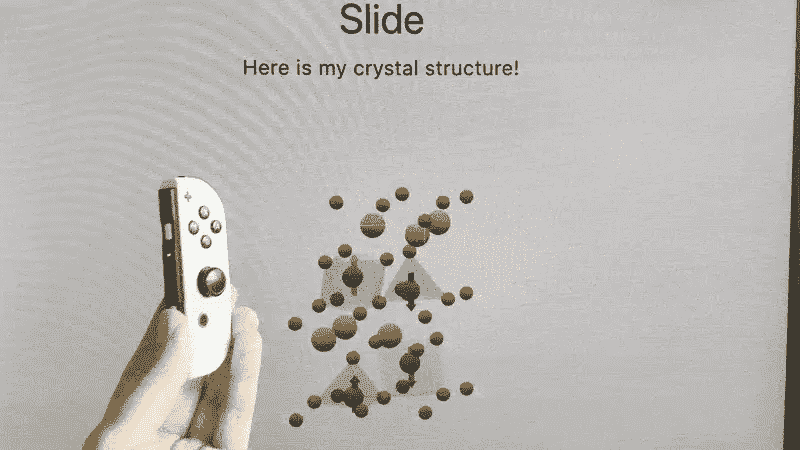

图片由作者提供

为了使其更加方便，当幻灯片处于活动状态时订阅 IMU，离开时取消订阅将很有用。这很容易做到，因为 RevealJS 会向核心发出幻灯片状态改变事件。让我们使用 `.wlx` 单元格类型实现这个组件：

```py
.wlx

InteractiveCrystalStructure := Module[{rotation = RotationMatrix[1Degree, {0,0,1.0}], id = CreateUUID[], timestamp = AbsoluteTime[], angle = 0., CrystalStructure},

  CrystalStructure = Graphics3D[
    GeometricTransformation[CrystalRawStructure, rotation // Offload]
    , ViewPoint->3.5{1.0,0.5,0.5}
    , ImageSize->{550,600}
  ];
  EventHandler[id, {
    "Slide" -> Function[Null,
      FrontSubmit[JoyConIMU[True]];
      EventHandler["JoyCon", {
        "IMU" -> Function[val, 
          With[{angularSpeed = val["Gyroscope"][[1]], time = AbsoluteTime[], oldAngle = angle},
            angle += (time - timestamp) angularSpeed;
            timestamp = time;
          ];
          rotation = RotationMatrix[angle, {0,0,1.0}];
        ]
      }];
    ],
    ("Destroy" | "Left")   -> Function[Null,
      FrontSubmit[JoyConIMU[False]];
    ]
  }];
<div>
    <CrystalStructure/>
    <SlideEventListener Id={id}/>
</div>
]
```

通过将此代码放置在任何幻灯片上，我们达到了预期的效果，而不会污染全局空间或干扰其他事件处理器。因此，IMU 订阅管理被本地化到特定幻灯片，当切换幻灯片时，我们正确地启用和禁用数据处理，而不会影响其他幻灯片及其处理。

```py
.slide

# Before

---

# Slide

Here is my crystal structure!

<InteractiveCrystalStructure/>

---
# After
```

这些是来自 *DPG2025* 的实际幻灯片：

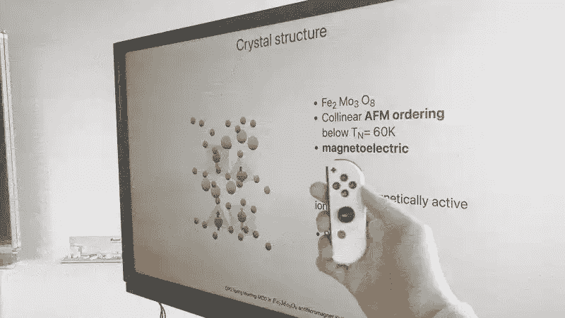

*图片由作者提供*

<details class="wp-block-details is-layout-flow wp-block-details-is-layout-flow"><summary>包含我的 DPG2025 幻灯片的短视频</summary></details>

## 最终代码和笔记本

编译后的演示控制器单元格代码在以下内容中提供。如果将其插入空单元格中，它将生成一个用于连接 JoyCon 的功能部件。

<details class="wp-block-details is-layout-flow wp-block-details-is-layout-flow"><summary>压缩单元格</summary>

```py
jsfc4uri1%3AeJztfWtz28aWoGtmdqdq99NU7Q9oa3ZiUiJpAqRkmYqccWTnxlNx4vXjfvGqHJBoSkhAgAJAiaSj%2FRf7af%2FsnnO6G%2BhuNEjKj3vvVN1UTAHd531Ovx%2B4P05fT%2F%2Fh3r17%2BT%2FBz09RXkz%2FEd%2F%2BO%2Fw8zfN0EgVFlCYVyOtFzN%2Fgw7OgCN78v3%2B5d6%2FH89n%2F7nt%2BNJunWcE%2BskmaJHxS%2FEe6OkuTjnrloUjI2S2bZumMPfgtXXUhs3vDx5dR%2BOAEieC%2Fhw%2FZWcaDgrMgCVlerGLOikuuCIE4bLwoijRBYEjMC5X1PSWzUxamk8WMJ0VvQoSexxzfWg8E3oP2iUStkHqTOMjzn4MZB%2FQHGY9B72vgucjyNOvO0ygpeMaydJGEPOzOQnbZPWLzuDtg86zrs4Ivi27Mp4V4usiCVfew32dTECQfpYsijhLeTdKEsyxKLroey2cjAl3m%2BBjzIMT0Iza%2BENhev%2F%2FAIWYEL9lbQAQx985E1l5pupgXmpneFGhEGw5holw440z5BqCmQZzzEgKsUbybh0DgbUQ2mfNsmmazIJnwXpLetNolU%2BECYVpimQP4R8xhLBgJuh02Lp8u0xkvX%2BYx2Ee9ZOVTHlePZaoguSxzVuXTWsEgyK0lGcRZXkST31%2BleUTRc8re93v9DoOf81LhjANQcvEfEtgNFOVnQRyNs8Blsmi2eJ4E49iVlT%2BN4%2FSGh29TaXIDREa9wGYvXr5jszTkLJqyQKAJZTLeE25DiFMW5KtkwlpBdpF3GE%2Bu2%2Bz0ibK7IUtwE0QgA0bwPOPoIUJ63z8XeCem1UCSHxaJKGhFyi6hFIJUwLkLrIHMfFEg2FTBCAApGea2QmASxe1SmClr3ddNV%2BYwl9l%2FXszGPJNEekESxOnFG8x8HV1cFr3LNIvWaVIEcbvDtsBe8wxeAFK4EBlaLiyyBT%2BphCkWWSJfb5U9GJOVzCLLoBbZWB6Esjpk1y5KT9hhHwzAwMwilXEQcwWps1wJUit9GsWTSi4A5KrkvQJL5lboKQhVAl6m1xaEggJVQGxS83e%2BYumU%2FTL%2BDcK0B295Sy%2Fbbc150rV69ntAOGfffMOkS6q8hchr1%2BQ1XMBYndppI7ES7VZXRuihfP%2FLdJpzLG%2B7xgq4zIrK917FSRCvgnBX8lrYOhjIOqYMUjDry6C47AXjvGUq0oYA6vc89scfrISwpZEwhqfsGDCsbpjPri9BOIC3eZw0gnsI3jWlrmlXVVCGlDnPABGiLkt43IvS3jTKeOuBqFwedHRQxh48nUx4zKEzwaFqezBSMXsdxAuel56YFIsgNkDbHYPMn1ZZmk%2FSOd9MogTrhfO8XVG47bAHUCM%2FaLvNidoaIW8o%2FKkFT6erlRULZrtBMQw6yLp9YiKOoef0u5F2q6ncqKkRZndyrR1HYFUqPrZd5Z%2BSM9Sjr3gWpSFGW7xik0sO7Qjatex5qsYrr%2FUYgc8Zwr%2FAxhGcDpEL0areWrKJNVpW0ZjZ7XlbbzyMVkMJ8YxfRxPqG9k9YhVtZROysXcmYLS4%2BY2AMXRsXpr9XTSNKkA6D%2FJ70B4lBY4FOPQ1nxZFACYFXwJ1qLMWZsMh%2BhYSEcpG0qrcZeRxKu0QqkkYZOEPizh%2BCX2czdBQqrYD%2FZkac3BkE1gGFXPMW0d96M3RT7932DaUkIBBGD7XVW89gHEJ9XcgPFsfZSvEbikcGns97ROLrNOcpvm1YrSgZv%2FM7MRL1aCm8fv9fiV81YcQNQF794KNA2xW4VkbL%2BVIxOi0NbDRo7weMtCs26OL%2B6fV%2BIKHe1rENY9DAO7EgnKMbiz8BgwaHvbGweT3Cxqc4ejtX8Pj6TQ8fqCMyziUHVVw76jTbhp9XX0e6FGi13s%2Fiq659P0kxg40RVt93FiPbQKHwHbVca7hihaublNqlhLlz5gIKEun0MIePmLlEsAYOdsweg%2Bj62roLqCFhX98%2B%2FInwPv123wGTcATbGc5jdcRLktjaPi%2FfSjyfrXwgznUWeHZZRSHLcNiNiNjfmAa8yXDn%2B4kjdlFMO%2Buuj4O3W8uIwgMbZogvwzC9AaeqvmN4jLKe6K1aJX022Z2Cvg5iL5qGY6Z4HAjLpunhkZMVhbtE8e0zdvVnL%2F5L%2FBAdZYF8M84rxPl8zhYvflv8DyByncWZVma3WlW6H%2F833v3IDoTwP4AA1nIyx%2Bakz0PQwjDh7MgvLiBIOz9lht100uZ3sqD2RxaAalWh6VzzK%2BaNfkOHlFP0Cv%2BeHuit7%2BCxg8ZvwIwjw%2FYQ2aSldA0koIavCLWo1eg2O8NNaAoiaATHImxiwIN0xeQHGF6IOYYTkWJYd%2BJppuN9AKEdK76KFCHXXnwF1qlK1%2F%2BHeBfDTDjk2j%2BxlCjVAITJGhpPmXWpz%2B%2BfiNaB2hHWxfLDrtYwb81FHl4DuA5WGtltmT1MwxrjeFjDlLlIGnuw7%2BBkXX1LC1QB%2Fjjiz8D8WdogF37V0ADfj369ekXIK%2BHlD6k9CGlH9PzMT5f9TH3ysOUK8K6GlxV%2FIk32qp3yPZZqwuG3GcXSxhdgSnhaYVPA3xatw0kv0ICJxDOgcRZlzgrE2dg4xB1T%2BAcSJyliTO0cQjSK7F9C4eq1VawpODpY8sUrLTntXg2xwGlx4AXou6Dc4ELIO7jzwGi7ZOj9%2FdZF6TRuvQIfurwOSP0hpx1Uw76GIRApa76Zrqn0j0z3Vfpvpk%2BUOkDPX1I9Ic1%2BkOiP6zRHxL9YY3%2BMcEf1%2BCPCf7YhscohHTyoMEYAxMzPJvSldDsqqYahi9mDGzdcuRACu4L7ANhHulNlYMMu8Kg6F2dgCcIkCzIpSvsKAkIo0kiIq8vAqQrsA6EWSSP6k3KIggHa51jaVxJVwrd14T269JIjr7g4RscfYOjX%2BM4KN0s9dSMUWrpS64iz7cNZZSXHIWFnwO03z7%2BHKBe%2B%2FhzgPzgaeAqOYjoLgVIqCHHb8wZNOWIKq57KlomlNXK9PVMz8oc6Jm%2BlTnUM6tYLEf24MiDUynAvt0GVdWcp6D8TVC%2BghpsghooqOEGKMOBslCqapUCSYaRqpSvHA68anDfVYPzrhpcd%2BV03K3VHk%2ByNM8%2FzDPoCU2KVtX2dtgYnsfwPF4bM%2BLYM2QfcaGDqvExNkpUjSPsaiSfsaGjCn8MlNYj%2BYzlS2At2W2DQBx6ZNnT5AL6ZT9k6ezFbPE6CA3BZvA8g%2BfZ2hz%2BQH9qHhWTS5zgE7OPMJ73CZVe86sMNKy1PVUTJ2gUsznWV82GgQYfx%2BkOPL%2BGJ2E7RLW3lH9X8u%2FapoHDAaChSY9UJbxfh59kCnqS5i3EtiHyuYLIo6RF9qmBZDqIi8gKbTpDywHDLhgei2VmAS0JCP1cCiTYga0JF%2FjsozwHgsBEvNpz12Kt0fLh6rID9NsntTCU4B3h%2BY4wYFNoFen%2FWkCHM0vgxW9pgVaLo8lKt6sG2VPy7VcTNZolV7old0abzJu4iXh285o38dqAZMaLjkSGczPKmhi5cErP3IyEh0G5fbTnQel%2F%2BIGAhgok1%2FO7KiBk%2FmqkJVT4E5W%2F1unniJ%2Fr4E0xgAOkXWsTjuOtO9VHlukiHA9ZURfUyrzeZkRXvRtQgP4c4J%2BleFuKt5V4W4m3tXhzdJ%2BpUyhpOVuSU0Xb2Z6cKl7OVuVU8a7nGsNPewpx4yiwYQioW7fDQh4XAS4zvuETo1Gyx6A6IA6Sm9prMVdUCm2uHm6IlHqP5GsOUC%2BB8eXKSMK%2BLMpDf1fy71qMYkX6WPxi2pCeh2OR7x7rQrp8868sIcVAt08D3b4c%2Bg7Koa9HKR6liGEwETQGw2jmmRg5XqdRCENG8MlsZSes7QRtsDnTBpszNdjU3XWniQWjz60tq%2BtdzL8P4P%2BWBvCGJNTLmC1Vx2K2Un2KmVOSWaMks0ZJZhunEjAy5WQCSWJnr4zslZ29NrLXZrZXEfdcxL%2FqNAZVA7p0NpqGWMNunozoi8mIvi2f5FbnhFVMmWHwaJzX8AQpr0bKE6S8GqnGmRChpEPBpimSy6Xq%2B5INuioKaKx%2FoJwuR34CTk4siBkCAeprCWs1TyCgUVT1PDBZY6zJmJTsBDVNkLUafsrwIl5dCScEkRJcabM7mgyrOl9sYcqOIY6sLpHuJRbKSwS%2FNBbtsSWijReloGpGRgqhSjCJrQs6UAOOymJ%2BabEqU0guRbam5saqQKHMZs66yjFmc%2FpSWMxryYkgOWvTJ9sFy3blLQHRL%2BUj0GDVJoTxWhWWFtkM%2FmK13VVORXEFLYJsSU7Ip00%2Bx8xWV%2BLKeBJEvbZOlUoAIZr0%2BnLmAZPRlzJzWROLVDsgVXUCUloxv4dCExmjERUzfGIWbbO5%2BpvNNVTVXguZlTNw8lEYDJubygaDzzRsZYmKZv%2BT7dqq3NQV8VV306db2VdFaKuZBzuY2d%2FFzBB4w3FZY7gN9BlW93RPfr7V%2B5rV%2FS9l9YGIbW%2Br0f1NRtdN2VyGP6dm6GtU%2Fc%2BuGbwvY72%2FT2mzv09p%2F0WmtMuZJ7F7aOQYEXZoUA%2BjQV5UczIt1%2FT2zYjhqHcJfzyai8KR7XqEEpQzS%2FJJ3%2FOydVfBPMhyLrcUXAcZw1MZakcBGDjhN9UGA09OMSNchtt0dwIMQj%2FkOH%2FqHffZQ9E%2Fe%2FWC8svpF9yF9WYxawVZhgPiCCwB1uClIeSRg0WsNtJqG%2FpoOyDu5yPk%2Bsyp2AuOk0SSaoswzHGogrpfjvetYSfyZqflQzUt8F3JYaRyD1SSXajMwNAUujWsMeNB0jK1kShop5dlbodJVXDPi6bUbc22Ok7NuMJOMU8uCpwxJzDQkCWLOAb1%2BqAYpfUEyIkhkUT7rtmFDxXMiP0c%2FOwQcBLEk0UMwN8HBWCtfuLXPFaaaQEQY7rknt%2FQnLKAet%2FXd%2FJOQBB2PKqcR3i4%2FWwKCu1ptaC5aZfwhi68GQ%2BjxWwLpu%2FCjNObLWieC22SRbQbfAtu34XLZ%2FNi1YwY8mkAUefkehlkF1Fyseesxirr36qifVbuF8N9UkDiI6jD9n7Cg11yD%2FFeBwzD9mhTv5Y2gLRXWapR2JOVF9IdR0FOc0mPDsu0Nc%2FS71U6pFU5ORiKq4HfqxcQb75ZuRTp82rKvIWHRf5MO4hxIk7uUe%2BwQN%2Fx3mFyuexFaJWSJL0BVs8gWI1jLCIzxBqiot8rohnPC2jBoHi0ELPrzMUiglutRtU%2BJheNU2R%2BYgpDjaC2lqgrgbPp%2BwybQTN55U5eU3K7LkEQzy9x3YF65soN1JurAR1UFqX5%2BLDQz%2FmQuPeteVKNhtxPRt43qVOOTnwpiGNvE6UaK4lqBpDR8ZBsVVX5Gu2LYDZrYCuydL6rnfgiVNfF2O4YkNVGVbBRu3LsPT7GgOl6ThvvYzvarhpSSBgO%2Buzf2ON%2Bu1ekP0RLHraO2hBNDbgO1MGRgduhbuHIIYLsLpoSmKhktJ11EibeRNFSRENogL91NDFGFaD1tK6s4n2DpVusUsGvUdiWS8qioUhvaWStVpRFE0C9lZG1XlMWDYF6akLH9n9L9ZH29YV2GrwphjihrMjcgJWXOO%2B%2Fwmn1Nc6y39y0nQ6sCMvFa1wxNQjTCoAUHYg4fblRvpUkc1AaB%2BXrKgEPnAI2OEnzDJY5qpVjV2WM1Uk9woztmVU3treQC3pAsrcUtT7uYKC%2Fa8EE0%2BnvSv5d11aQDZJWh90q33rf%2BPO4q66iQdHF3DalPMEljnqYfSnZbY74jey34zbkP8OrgOuNF9Op2mJdSkDjhB%2FiNChaLX845N0j8DXSQGleJIV31OqL81GGo93CPeMXGef5K5694SBN%2BKUFhB7CkdcffIaEr%2Fl1Gi9ot%2FJXk9I7egx2fPTJUhItcXbpRTJNoZTeoAgdBvEWWGKOV%2BKguYTp5TFgtbzDDvMOoXh6ntmTmUbZ7CbI%2BMvgtzT7M89y4Pc6QEWJkEQHQb22OoxZQ42SDagwhvVrqAX0IuugMM4dmNLNgsnTMMTjgXXoIcjUbwIH2PeKpUGkB%2BPJ58HkstVK6FyqfopAB%2B3NF%2FmlhAHvvCnwegJwZLln69Zknc%2BjszROsxfJu9yhmgdm8HwTpRxqfmQfwFujmsV9qF4%2FXPKlO0eZX1p%2BBGRm6MRRk087bIaeGjU67rZDjhlZ3f330lvgxPOOZqKRbq7fUmhv9kZ7IJhhilHNMnRs9hQ3699aVV%2FTKJnCn85lvOZ4l8aLZxtLQKRDauY1SwSFtLJvaKXbohkkmyTETR%2FZRsmwi581SkQlxSERpdsSEakmSYzh9cbKQgNslIuKpUMumU7DxVHD2N4Gr%2BmhS9CkTnUab2vtNzFAP00lW0STZqPNtTP4m22uAW6KBaeAnktAnWKzDXF6tfjCYg467Mglpkxfjdj3aRrjlJTHvlG47wfnbZrfVHm%2BnTeu8oZ2XlDlHdt5WZV3VENca7meX8MN05vELe4hZi%2FmbnkpkzptbpkpHzuUbrFFdoPYlLmOm8Sm7FzX6shUCjcyOfMEpkZ44DdjDmrqQjOCl9O4bDXEfHF3jctaw9JadITdbbKhMpkFc2zDiAtznBpS%2FiSYQ%2FngDWoKEDkT9qcsmjfZGQA%2FpcQ9rW662FjQtBsxNpWzYUM5G9aE0wjuIBvO4TXIRxsAy%2Bstqj7l%2B6Nz9gdTSO8fnYOxvMM2%2B%2FZbdixFMdBa2kUcOAP2%2BDGu3dHqo191fcuOKW0ylLdkILbG58kTNgTWKuX4HHkOkVBXrYjpmOUVIThV6Pu4eNTIteYMmtxscshRhz12OUSmV%2Fp2KoGa3YSsdnAVza3e1VePDV95%2Fb%2BQs5CR5S3P%2B5ruEhPPTf56bHSnw3rGHT1G3Jpc9kMUF1t6glMCaRTXWdjrJV1QaRJDXACRbhbkWgI190SgT%2BS5%2ByIixxZKUWwM6G314YZ60IMKz3MaR%2BbUXNZcB75ZjCfpbBYk4ZbxRK4BNkuGw9FDp2Qix5ZMp7pdRBh7xCtkt6OkJXyzwG5hNwlaEm12rTY5vrl7acyj03CdDnZtcLtbXpUD9Eb2ZJiTSBuHuatGTjhP8shtGZmzAycBSpzWjZweAZCzDSlzduAkQNu4I6DDNljQB5F8p15lznZuEnSzBX0QyXfqVebswEmAbragD3X3wDmGL3N24CRAt1twACINnHqVOdu5SdDNFhyASEOnXmXODpwE6GYLDmE4OXTW7WXOdk4SlCx4bte%2BeiFvqjXK%2B8M21xjl2hzVFu8bShWo7TttV%2BaE83zkmpl2EsLhioB3zhO7cUQkOUMW53LcMw8qZzfxJPidxFM4G8SDKtJ31rNlzo7iCfC7iSdxIIo6rMG9A5z%2FcNqvzNlNQAl%2BJwEVTrP9BqDCwGm%2FMmdH8QT43cSTOBvEg%2Fp74GwEypwdxRPgdxNP4mxy7xDHs077lTm7CSjB7ySgwmm23xBUGDrtV%2BbsKJ4Av5t4EmeDeNC4DJ0tVJmzo3gC%2FG7iSRxwr9UIVPX2ph1hT%2Bu3UZp7LXKrOeBxMM95KO%2BBPeRdukbDwDC3sal%2BZ40PdZHBYPqKndiYZ1KbBfNW64IWjC5wIxoOTTUpjEU8at7vRNDbRnB9R4L%2BZoL1kVLNMNv9VTbdrcrLu%2Fipgm720Z%2BM9p7U1dBqzuiwjSDedhA02LlIEndG6%2Ba%2B3mBKa%2BVX3FBh6UCXSq8c6d65uKXCTvfPnVsnSKbXUXJxVnXEnN0lXK%2Bc0KXeDY3BccNyk8rIiyyIkpG54K1oiCVv7MwicH1Fu7a2J6SpFMJ%2Fu%2BxalosvUmNt%2B7KZwcprv0NaJjcuhxNb9vg0SvgbTsPYNCueInh5n%2Fcp3mNZjXQ7jC%2FndHmfAO7Qelu6KJ7jpW8veZ4HF3TPoUzu7cnbLyV7n17Qcq%2BgLEU5VzemZjxP42u80p3%2FRrej6qvP1SIhkMTdLnjn6lvxat53J%2FZ3EqdexmfpNTcvMdyjBcuMZN%2FriKtftQVU85QECtJCWUm5lkNT7aISaH0O%2BaB6l8tuFgO0J124aAuN23kooyeEAy1xnyB0q8wLeq2j0cYlu9KfYnID5X4XJcXxU9yNLGmHVYjqqmpbyfFS4I7YSX2uXS4MyFkE4xDT%2B64bhpEFEsG50XOxmdzYM9KoiPu%2B4C%2FmzknMg0zFTBlKxqGiKqbKaDzUrpS5LZ%2BUSLU7MneWR9x3qejkZeHDdUzLc%2B%2F76r6a%2Bv%2B9Xq8qm%2BeNWzCwEiqFwAty36b95aBPlzJsKPxGyR%2Bx99gPPD63qwAcQ3vDERvgONdkTPftQj308uwdVo6%2B792ZJc4RulkORszzjzuC93A7c8%2F3vLvzx7HDgO4X8prd8GX%2F94eDZiM7rAxtzPNlgToePr6rfsePG1kd4wrAEbD0af9LvfIbsT36NAk2pklaQC2ySEKq8F3i8esXyQ%2F4%2FYMCWqVpdHF4dldZH%2FsddgTuwOESPRlGw8bZx3E85B3Cw%2BFQy%2FXoH%2F7QUB8fjnB%2Bq4QZNvjCG2IAHhHxQ0W40WSP%2Fbp38iLI0AA8S4L4VRpjSB4%2BvbPuQkYRhn6zAH1dAFHJ1Auh6gpsBKPi4oTU420TQN3jTmi3gQxQ41MjW3tGkDaxe0SToMAdWyFVqTndnNFh43pnaCJbzqBH79ligutEgeyMswM2lo%2Blk6HyLpBY30wZd1hggapdM5pKKJ247Rj40oXB4FhoSsKcUcPyNsjAmIaIUiTVmytb1XwxhwaoamHoVmABRcGGD2ZmtaWc%2BsLlMYsRHXvqqK3ZfbWVul%2Fuhu7bVzmJTpy4zV27Qh5vN9HkoOverRt9RAzYQJoetw6Ftja8BPtB3rMuikhvHMHYHDOqZlIXHuz8ml%2BBMQptP2ntKB1UgeYeuuq8qb3ShIMz3%2F4MiOyc7d6mW%2Fjl1ki9C626K3afUoqcVAqJ7ry4d34kg4LSb21caW9np0vgRYAHptbJm5%2BECDnuq9K49HC4tQ0ERl0GiNStFTq53GrPJHA9MnaQ9tbumOmxpnXOTO%2FXemo02KxtmjcObdohZ%2BwJ%2FKRoO6ui7bj%2FyeF29gXD7Xtz76QWcMauyjuFnMSkLZXkRp2JM%2Bx0Xo2BZwI1hd64gdcOwbej3H%2BlAJSf2IhwB%2BSPL56JT2d8ZpWHOxwHX67a%2B2LmcCle%2B7bI5%2BsOA6T%2FFLqXX0r5TJWPaID2N64ydAu%2FtM6fXtX%2BRd2sfevmM5V%2B5G91NAxN0DRHQ%2Fvtr%2BHsL6v5Fnf%2FbWguXK7mwJu%2BrqLyNe4bqL178z20DOqzc1LCmkUX%2BRiMoeszwVMyNJTFGf6erlPem2JXvCWOGGXVhCeeffGP2%2By%2BuHihtBaOI4DDlnGDPomGswH2NJp33tYb77sT8O9CoI4%2B%2BFz%2BQ53ArcNj8rtVcXqDt8UseDJZddhldHGpveJlMlGxCHnNhzD8pCP24uwebWbHQ01L8hIdeoUU8ZFBSNWg2gLsZFshO3IXIUvNxxUhmkqmbwlWV%2F7QLRhTMVqezS1dh%2F3e8aPD4%2BNDKHz%2BUc8%2FPvIG2pQ8bQWucC3LHHu9R4feI9w45h%2F6vcNHvn90VCETolCfvtaDe%2BblYeA4vfBbkL9P31DE%2B5YeH%2BEKo3Zj7FRdUuDEjXXco6FlJ%2BEWIXPpPlHR2Lo9nc2NUkOo9q2sBGYYVfvgFWJ8i7J4j5xIrUpqBN3HaxtQ14Ev1X7IWrgvmsDm6Q1C4UoYauZtYugPnPw2s8Mf36b6KVLjdRBd5g%2BP7AKmIk6TRriQSLfJb4eWw%2BZBFhV4IF6g%2FRvzDafI7CeWW7rd2PBfJYBkLv4%2BeaLZUSQdnOpBs4GFAP%2FjFPR%2BdHRc50QFjr7GCdH8DfMPD82y6Iss4skw4p%2BANMcC0iq2g3OSGOGU3E2gw3PUQECZTGldij6hROEKf76FQsWigwNDLaKCZ3gj%2BvQrKUFvdQ2%2FTsOb8%2BKn58%2FEF%2FGSWsX68y8fXr97%2Bf1Pz5u7h3bvwuyADLEx2LHz4Gh4oA9SirBx1aiukqGNmDTkIX0bEKPIw1MLiUsu3SAGmpMXfn1tC7dvTtn%2FaQl%2B7A%2FBeAguTpzj5rtxx1nv33fmbk2w1sxBUn2OUOaspVosLgXD0vCRYhyXykXHqSMn0KACPBWf8zMqg%2FvGJgj8r%2Bl%2Bbdki1%2BbLW3ZIKc54UsxRStQSs90nuORLufWeoGhHCZ7gpi4GPjgPlAul58Hkdy7OsRiHjkeuU9DCPpJdW5uoUZdmKQUMs9CNUkeDkTkppTGGgiPeOsZBt5HjoKspQUc%2FIjOqH4OzocX5lZFxaqZRJ%2FzP%2FvjuraXVYDCyUobHO%2BlJx6lH%2BjluW1Z9dmzkOGZtw5unhkfOk8w1HnVrO8%2FtbrD6T3TU1HnIbwPWa3GA1X3gzMZTB3xG1jGjjZ7DEqqNgBxbPppcE1Sh5Agh%2FRjNyHGwpxm%2BPM1SQ6sO29jY1ez8qHYpx0b1bzfaYnhcs0XDKRnXMRuT8YmLjrF33t50vwN%2BNqfvM2%2Ff%2FGfsqNP30l33gEa77SYffgHyYTN5sGKd%2FKatpoJyQJTfB71lD7JxoXOlHtb4cN7A7qq8sYeZn2BpgQnoRIUKpF5139HJbkVBl1K71Y7I1rQaCV7W1kJcRA9REHTqrcr%2BJYugQaWZpJF1j561ikqITWo4yFX6W4T127nKR6BQvXRo3%2BAZYhr7Hncvao0Nxq3edRD27VWl%2B7se3nliFEqx1prxCY%2Bu9WJfw3Ws6Wo89Gbkux4tmDSzMRoYB4Gm5WOFT70FWqqR2HYnrK6OpofVTQyjfB5Ar0LQw%2B7Q2SIv0pl4N9cfGxZfG9gbahr63U0EaxWqcUHOEMPeoSCPfZu7FOTmBSnNDhsUnBOOzW6p0OWKnXK21ur3qlW7DUCrXYDGuwAFuwDhVQ%2B7wGW7AK13gsJbH3ZiWV4zcXKXIFKftjcCSFbHW0JHHUH%2FG4ydxXwXk%2BEdKLvAxeq%2Bgl1csAsg3SiyE%2Bed4mgnKHk7yK76%2FoUi6U%2B4oB7EZ%2BUNXH%2FFePoqSuK%2FXba3RUnIl%2FX9%2FjwU%2BmOH8eE%2B%2B%2FcPH169e%2F38wwe2%2F1DeTD5vVVeSC9W12%2BAw8YKrvU84X994YCAp95PlPRLml6llSrrqlj0xJ57lboTENLciRLfKmVQkgoKQW%2FDUNHIVGUEYPlP73LacdYhwPk1T0%2BKIQGnMcaK49euPYIXStiP2Pz9G4S382j07Y8qiDvBzMOO3v2oMDF%2FRVsEo7JgrdEI6JVvbUlfsj%2FlaGkOIfXWlRYUCeuuqJcF1dIHD5R5EumMnjaQCxUlq%2FLGc9dK1LoPB3EDa3olHpTywaWCgm9%2FFI0wnixmetaiTf%2FbLS6y%2BMC0NQh5WurhO5VDU49dlRGyYspcezcutkgqjvMixMTLUvKTbVuVupNuqupBWKbeqNootJq7ktRWgfZhmLyCOvGH%2FqDoEX2Qre478vZDgvEHdTN%2BZCY5RbLR9U2Km067om%2Bc6t5gARsU0Uchxw7s1pY8FhtJFbi%2BBcO8w8TyTB4PcjZhRwDcVXpzx%2FE1ZW1sMpxM2VmF0Xf5b4ULVX%2FXfa1qWy3BNRB9b%2B3nrBZ0g9%2BTF9qz1ur1n2N8hiZw9M0SxV7TJnQK3Sa1aj8DdoAtHC0xzc7GRs2m7QzN8fQtZM2y5%2Fchs3wSMVhPKjsC3eQE9iCdW6IjpTmyBVT0zgZF8wZ%2FHfCbGegSwJ5gYSD3qLgmXsb2Mx0EB%2FRz8UEeeZt15GiV45pdWN3nYnYXssnvE5nF3wOZZ12cF9LO62OETTxdZsOoe9vtsCoLko3RRxFHCu0macJqc6Hosn40IdJnjYyw%2Btww0xxcC2%2Bv39xxiRvCSvQVEFFNODO%2FZRSgSfVDuhIlyEWhnquUBqGkAoV5C4KyN%2BP6MPH8L%2FcEpnlVIJvpnDehTDGWHV2yUl%2F4dCYod8To2X8UFfHqKuPpPT8nMV7x10Hi38pfm68p8XStos775TQbyqzSP5HHO99V6o%2BhNAEByoSK%2BDhDlZ0FMM9kOM0azxXOKbUdW%2FjSO0xsevk2lGwyQSZrxnvASlIuqKgyyixzq0uRarw0NNqJkUbDOoQjhehoi0TlixNNKUnk4%2BBJKacwlO%2ByVt0SP3LhN%2Fb6uqtFxrZnoZ7r%2BWBLp2esFverOtHaHbYFVd6q1qwVey%2BTaN5ut5uxWb3rlB3c2xrPxpR%2BC7NpF4QmeeTQ%2FTmEUFA25FApbK1FMXuGdx1Y0KAgVjC%2Bh%2F1SH0M6g4unR6ugpvOUtvRCap07Jc3o2Hj49x8%2FnSovrA1bKa9dkNSzMWJ3aaSOxesdC6KDc%2Bst0mtN89a5hAB6xAu59bdtlFV%2B7ktci0sFA23%2BA5hRfOBjnLVOJNu4n6Xl4BWoJYUsiYewegOF3w9ql2eyqSmz8sumfNILTtpWuKbGhVVWJGNLlPAMkiLIs4XEvSnvTKOOtPVFX4OC9AmVsz1hG2BupGKXNcHlp%2FfqKQ7tjkCnXHDaTKMFoEaeicNthe1Br7jXMqBvhbSj7qYVMp6uVi9ri3DZjous7yNpe1rGXI9yHwQ0tjbC6k0vt2AFrUlGp21N03%2BtdjzNxsBsce003dNIJa%2FHWcoyNZOtiN4htszaf6Bd1czkuycV%2BDHMALWOlrNM3dncMr8sONDje5qP38x30jEIrzU9dW32I%2B7QoYOCJ3gDqUMNoKM298Lv1q3fqWTuBtA3hbjC5ffYIzwnTT7%2BnbVWTQPVRvTbRVx51klMGjd2OGlmnGU2zy5AU31I5M3vB6gsoHearOyjKvk8Dgh6bdYdD82l3tPEqh70SYs8cEzd0yQHuxIJydPIt%2FAaMvFjBuHscTH6%2FoDEKsvnX8Hg6DY%2FLz7VV49n7d9ZpN42%2Brj57J3a9Y%2BI4psVirLicE0nOHrgWUG4zNR0bEGDmd37MGSKI7ISm5ZuGpmF0XY1LBbSw249vX%2F4EeL9%2Bm8%2BCOH6CLRenweikHNt%2F%2B1Dk%2FWrhB3OoS8KzyygOW4atbEbG4Hca8yXDn%2B4kjdlFMO%2BuYIQL49KbywjcrY2B88sgTG%2FgSbjmoi%2FPKGK93Sqpt%2FXMFHBzEHtlXk0zwb54XDYTDY2JMfU2%2FYd79%2B7l%2FwQ%2FrxdQJ%2BID7sp781%2Fh4RfarGpB%2FDM8PIvyeRys3vwjPPN89v8BSeiR3Q%3D%3D
```</details>

不需要评估（不要运行它）；只需隐藏输入单元格，只通过属性（点击组右上角）显示输出即可。

这里有一个 [**包含所有示例**](https://jerryi.github.io/wljs-demo/PresenterJoyCon.html) **示例** [13]（其中一些在浏览器中也能正常工作，无需内核）。

<details class="wp-block-details is-layout-flow wp-block-details-is-layout-flow"><summary>如果使用自己的笔记本电脑不是一个选项怎么办？</summary>

WLJS 笔记本可以导出为 HTML，[保留一些动态行为](https://wljs.io/frontend/Exporting/Dynamic%20HTML) [16]。这是通过一个相当复杂的算法实现的，该算法跟踪 JS 和 WL 侧发生的所有事件链，尝试使用简单的状态机来近似它们。结果是包含所有单元格、幻灯片和这些状态机数据的标准 HTML 文件。

然而，由于从 IMU 接收到的值种类繁多，导出器无法自动在 JS 状态机中捕获这一点。因此，旋转和摇杆输入将不会被保留。尽管如此，其他所有功能都将按预期工作。 🙂</details>

### …就像鱼需要一辆自行车

请参考[那部美丽的漫画](https://www.smbc-comics.com/comic/2010-12-09)的最后一句话。

**Zach Weinersmith**。

如果不是因为迫切需要展示旋转的晶体结构，这篇帖子就不会存在。

感谢您的关注，以及那些读到这里的读者 🧙🏼‍♂️ 🤍

## 参考文献

[1] — [ECMA-363](https://en.wikipedia.org/wiki/Universal_3D) 规范，维基百科：[`en.wikipedia.org/wiki/Universal_3D`](https://en.wikipedia.org/wiki/Universal_3D)

[2] — DPG2025，主页：[`www.dpg-physik.de/`](https://www.dpg-physik.de/)

[3] — Leo，右 Joy-con 控制器作为遥控器，Hackster：[`www.hackster.io/leo49/right-joy-con-controller-as-a-presentation-remote-5810e4`](https://www.hackster.io/leo49/right-joy-con-controller-as-a-presentation-remote-5810e4) (2024)

[4] — Jen Tong，Nintendo Switch Joy-Con 演示遥控器，Medium：[`medium.com/@mimming/nintendo-switch-joy-con-presentation-remote-5a7e08e7ad11`](https://medium.com/@mimming/nintendo-switch-joy-con-presentation-remote-5a7e08e7ad11) (2018)

[5] — RevealJS，主页：[`revealjs.com/`](https://revealjs.com/)

[6] — Manim，主页：[`www.manim.community/`](https://www.manim.community/)

[7] — Motion Canvas，主页：[`motioncanvas.io/`](https://motioncanvas.io/)

[8] — RISE，GitHub 页面：[`github.com/damianavila/RISE`](https://github.com/damianavila/RISE)

[9] — WLJS 笔记本，主页：[`wljs.io/`](https://wljs.io/)

[10] — Vasin K. 使用 JavaScript 和 Wolfram 语言重新发明动态和便携式笔记本，Medium：[`medium.com/@krikus.ms/reinventing-dynamic-and-portable-notebooks-with-javascript-and-wolfram-language-22701d38d651`](https://medium.com/@krikus.ms/reinventing-dynamic-and-portable-notebooks-with-javascript-and-wolfram-language-22701d38d651) (2024)

[11] — Vasin K. 动态演示，或如何用 Markdown 和 WL 编写幻灯片，博客文章：[`wljs.io/blog/2025/03/02/ultimate-ppt`](https://wljs.io/blog/2025/03/02/ultimate-ppt) (2025)

[12] — Joy-Con WebHID，GitHub 页面：[`github.com/tomayac/joy-con-webhid`](https://github.com/tomayac/joy-con-webhid)

[13] — JoyCon Presenter Tool，在线笔记本：[`jerryi.github.io/wljs-demo/PresenterJoyCon.html`](https://jerryi.github.io/wljs-demo/PresenterJoyCon.html)

[14] — 法拉第效应，在线笔记本：[`jerryi.github.io/wljs-demo/THzFaraday.html`](https://jerryi.github.io/wljs-demo/THzFaraday.html)

[15] — [James Lambert](https://www.youtube.com/@james.lambert) VR 由 N64 驱动，YouTube 视频：[`www.youtube.com/watch?v=ha3fDU-1wHk`](https://www.youtube.com/watch?v=ha3fDU-1wHk)

[16] — 动态 HTML，WLJS 文档页面：[`wljs.io/frontend/Exporting/Dynamic%20HTML/`](https://wljs.io/frontend/Exporting/Dynamic%20HTML/)

所有提供的链接均在 2025 年 3 月进行了访问。
