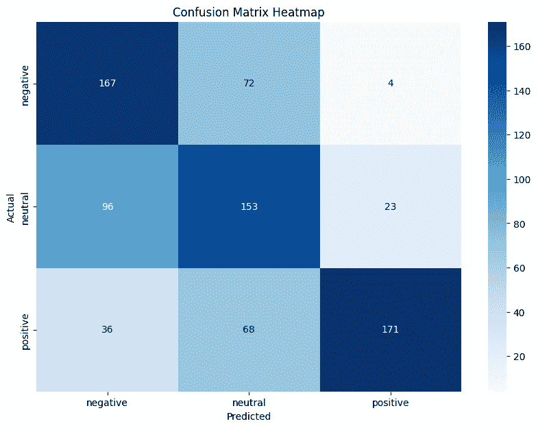
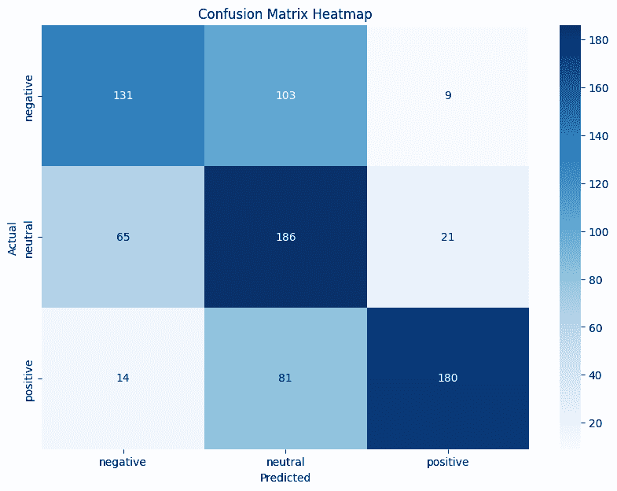
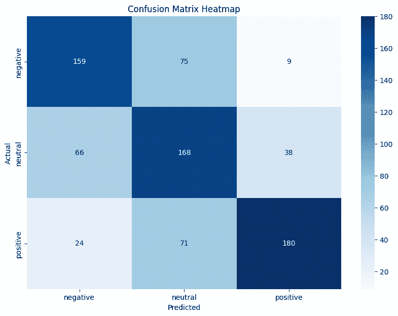

# 如何利用 ModernBERT 和合成数据进行鲁棒文本分类

> 原文：[`towardsdatascience.com/how-to-utilize-modernbert-and-synthetic-data-for-robust-text-classification-7a6e03dbf0df/`](https://towardsdatascience.com/how-to-utilize-modernbert-and-synthetic-data-for-robust-text-classification-7a6e03dbf0df/)

在这篇文章中，我将讨论如何实现和微调新的[ModernBERT](https://huggingface.co/blog/modernbert)文本模型。此外，我将在一个经典文本分类任务中使用该模型，并展示您如何利用合成数据来提高模型性能。


在这篇文章中，我将讨论如何微调[ModernBERT](https://huggingface.co/blog/modernbert)以适应您的分类任务。此外，我还将向您展示如何利用合成数据来提高您的文本分类模型性能。图片由 ChatGPT 提供

## 目录

· 目录 · 寻找数据集 · 实现 ModernBERT · 检测错误 · 合成数据以提高模型性能 · 增强后的新结果 · 我的想法和未来工作 · 结论

## 寻找数据集

首先，我们需要找到一个用于文本分类的数据集。为了简化，我在 HuggingFace 上找到了一个开源数据集[Sp1786 的多类情感分析数据集](https://huggingface.co/datasets/Sp1786/multiclass-sentiment-analysis-dataset)，您需要预测给定文本的情感。情感可以预测为以下类别：

+   *负面*（id 0）

+   *中性*（id 1）

+   *正面*（id 2）

您可以从 HuggingFace 下载数据集，但最简单的方法是使用 Pandas 在 HuggingFace 链接上访问它：

```py
import pandas as pd
splits = {'train': 'train_df.csv'} # we only use a subset of the dataset
df = pd.read_csv("hf://datasets/Sp1786/multiclass-sentiment-analysis-dataset/" + splits["train"])
df = df.sample(frac=0.05, random_state=42)
print(df.head())
```

我只保留了 5%的数据集，以便使这个教程尽可能简单，并确保大多数机器都有足够的计算能力来微调模型。

现在，让我们通过将其分割为训练集和测试集并对它进行分词来准备数据集。在这里，我不会深入技术细节，因为我认为这是一个先决条件（尽管了解它是如何工作的不是阅读本文的必要条件。为了设置 ModernBERT[ModernBERT](https://huggingface.co/blog/modernbert)的微调，我使用了[这个 HuggingFace 教程](https://huggingface.co/blog/davidberenstein1957/fine-tune-modernbert-on-synthetic-data)。

让我们先安装并导入所有必需的包。您可以使用以下要求文件来安装它们：

```py
# requirements.txt
pandas
fsspec
huggingface-hub
transformers # ensure version 4.48.0 or higher
datasets
torch
torchvision
torchaudio
scikit-learn
accelerate # ensure >=0.26.0
seaborn
requests 
nlpaug
protobuf
sacremoses
nltk
sentencepiece
```

并用以下方式导入它们：

```py
from datasets.arrow_dataset import Dataset
from datasets.dataset_dict import DatasetDict
from transformers import Trainer, TrainingArguments, pipeline, AutoModelForSequenceClassification, AutoTokenizer
from sklearn.metrics import confusion_matrix, f1_score, precision_score, recall_score
import numpy as np
from tqdm import tqdm
import seaborn as sns
import matplotlib.pyplot as plt
```

然后，让我们通过分割和编码标签（文本的情感）为整数来准备数据集

```py
 # make a train test split of df and convert it to dataset dict
train_fraction = 0.5
random_mask = np.random.RandomState(42).rand(len(df)) < train_fraction
df["train_test_split"] = np.where(random_mask, "train", "test")

# get unique sentiments and create consistent mappings
unique_sentiments = df["sentiment"].unique()
label2id = {label: i for i, label in enumerate(sorted(unique_sentiments))}  # Sort for consistency
id2label = {i: label for label, i in label2id.items()}
df['label'] = df['sentiment'].map(label2id)
num_labels = len(unique_sentiments)
```

现在将其转换为数据集字典，以便它可以被 transformers 训练器读取：

```py
dataset = DatasetDict({
    'train': Dataset.from_pandas(df[df['train_test_split'] == 'train']),
    'test': Dataset.from_pandas(df[df['train_test_split'] == 'test'])
})
```

## 实现 ModernBERT

首先，为了实现 ModernBERT，我们需要加载分词器并分词我们的数据集：

```py
 # Model id to load the tokenizer
model_id = "answerdotai/ModernBERT-base"

# Load Tokenizer
tokenizer = AutoTokenizer.from_pretrained(model_id)

# Tokenize helper function
def tokenize(batch):
    return tokenizer(
        batch['text'], 
        padding='max_length',
        truncation=True,
        max_length=256,
        return_tensors="pt"
    )

# Tokenize dataset
tokenized_dataset = dataset.map(tokenize, batched=True, remove_columns=["text"])
```

现在，让我们加载模型并运行训练。我们还使用简单的 f1 指标作为我们的目标函数：

```py
# Model id to load the tokenizer
model_id = "answerdotai/ModernBERT-base"

# Download the model from huggingface.co/models
model = AutoModelForSequenceClassification.from_pretrained(
    model_id, 
    num_labels=num_labels,
    label2id=label2id,  # Use the original mapping directly
    id2label=id2label,
)

# Define training args
training_args = TrainingArguments(
    output_dir= "ModernBERT-domain-classifier",
    per_device_train_batch_size=32,
    per_device_eval_batch_size=16,
    learning_rate=5e-5,
    num_train_epochs=2,
    bf16=True, # bfloat16 training 
    optim="adamw_torch_fused", # improved optimizer 
    logging_strategy="steps",
    logging_steps=100,
    eval_strategy="epoch",
    save_strategy="epoch",
    save_total_limit=2,
    load_best_model_at_end=True,
    use_mps_device=True,
    metric_for_best_model="eval_loss",
)

# Create a Trainer instance
trainer = Trainer(
    model=model,
    args=training_args,
    train_dataset=tokenized_dataset["train"],
    eval_dataset=tokenized_dataset["test"],
)
trainer.train()
```

这将微调模型。然后我们可以使用下面的代码在测试数据集上评估它，该代码将打印出精确度、召回率和 f1 指标，并显示一个混淆矩阵：

```py
 def inference(classifier, text):
    return int(classifier(text)[0]["label"])

# Evaluate on test set
predictions = []
labels = []
for row in tqdm(dataset["test"]):
    predictions.append(inference(classifier, row["text"]))
    labels.append(row["label"])

accuracy = sum([pred == label for pred, label in zip(predictions, labels)]) / len(labels)
print(f"Accuracy: {accuracy:.2f}")

labels_string = [id2label[label] for label in labels]
predictions_string = [id2label[prediction] for prediction in predictions]

cm = confusion_matrix(labels_string, predictions_string, labels=["negative", "neutral", "positive"])
plt.figure(figsize=(10, 7))
sns.heatmap(cm, annot=True, fmt='d', cmap='Blues', xticklabels=["negative", "neutral", "positive"], yticklabels=["negative", "neutral", "positive"])
plt.xlabel('Predicted')
plt.ylabel('Actual')
plt.title('Confusion Matrix Heatmap')
plt.show()
```

这给出了**62%**的准确率，下面是您看到的混淆矩阵：



这是运行微调模型在测试数据集上的混淆矩阵。模型整体表现相当好，但也有一些错误。最常见的混淆是标签*负面*和*中性*。因此，我们将专注于限制模型在此类错误上的数量。图片由作者提供

太好了，你现在可以微调 ModernBERT 进行任何文本分类任务。在下一节中，我将向您展示如何识别模型犯的错误，并使用合成数据提高模型在表现不佳的类别上的性能。

## 检测错误

我们将使用混淆矩阵来识别模型在哪些类别上表现不佳。由于我们只有三个类别，我们将找到表现最差的类别，并尝试提高该类别的模型性能。

通过查看混淆矩阵，我们可以确定模型最常混淆的类别是*负面*和*中性*。因此，我们将为这些样本创建合成数据，以期看到模型性能的改善。

## 合成数据以提高模型性能

现在，我们将为表现最差的类别合成一些数据以提高模型性能。为了使合成简单，我们将使用一个名为[NLP AUG](https://github.com/makcedward/nlpaug)的库，该库允许轻松增强文本样本。请确保您已安装了本文中先前给出的所有要求，以便成功运行该包。

首先，导入增强器：

```py
import nlpaug.augmenter.word as naw
```

然后，我们将创建一些增强函数。我在这里使用 3 个不同的增强函数：

1.  添加一个上下文词（添加一个适合上下文的词）

1.  替换上下文词（替换一个适合上下文的词）

1.  双重翻译（将英语翻译成法语再翻译回英语，以创建文本的增强版本）

上下文增强使用 BERT 来确定合适的上下文词。

我们可以用 Python 实现这些增强：

```py
# Create translation pipelines
translator_to_french = pipeline("translation", model="Helsinki-NLP/opus-mt-en-fr")
translator_to_english = pipeline("translation", model="Helsinki-NLP/opus-mt-fr-en")

def _translate_augment(text):
    """Translate text to French and back to English to augment."""
    # Translate to French
    translated_to_french = translator_to_french(text)[0]['translation_text']
    # Translate back to English
    translated_back_to_english = translator_to_english(translated_to_french)[0]['translation_text']
    return translated_back_to_english

def _add_contextual_word(text):
    aug = naw.ContextualWordEmbsAug(
        model_path='bert-base-uncased', action="insert")
    augmented_text = aug.augment(text)
    return augmented_text

def _substitute_contextual_word(text):
    aug = naw.ContextualWordEmbsAug(
        model_path='bert-base-uncased', action="substitute")
    augmented_text = aug.augment(text)
    return augmented_text

def _translate_augment(text):
    """Translate text to French and back to English to augment."""
    translated_to_french = translator_to_french(text)[0]['translation_text']
    translated_back_to_english = translator_to_english(translated_to_french)[0]['translation_text']
    return translated_back_to_english

def augment_text(text):
    """augment text with a random chance of each augmentation"""
    if np.random.rand() < 0.5:
        return _add_contextual_word(text)
    elif np.random.rand() < 0.5:
        return _substitute_contextual_word(text)
    elif np.random.rand() < 0.5:
        return _translate_augment(text)
    else:
        return text
```

然后，您可以使用增强文本功能来创建大量文本的增强版本。

现在，我们需要创建增强文本。重要的是，您只能在训练集中增强数据，而不是在测试集中，因为您需要保持测试集不变，以便正确测试增强的效果。

首先，创建增强样本

```py
AUGMENT_PROBABILITY = 0.20 # only augment x% of the texts
augmented_texts_negative = [augment_text(text) for text in tqdm(texts_negative) if np.random.rand() < AUGMENT_PROBABILITY]
augmented_texts_neutral = [augment_text(text) for text in tqdm(texts_neutral) if np.random.rand() < AUGMENT_PROBABILITY]
```

一个增强样本可能看起来如下：

```py
Original sample:
"The Google Calendar integration is riddled with bugs and it has been this way for months. They don't fix it and they are pretty slow on their communication. TickTick is becoming very tempting."

Augmented sample:
"The integration of Google Calendar is riddled with bugs and it has been this way for months. They don't fix it and they are slow enough on their communication. TickTick becomes very tempting."
```

您可以看到翻译如何略微修改了文本而没有改变其含义，这正是我们尝试在创建合成数据时实现的目标。

* * *

在创建增强样本后，我们将这些行及其相应的标签添加到数据集中。由于我们只是在增强样本，所以我们自然知道增强样本的标签（标签必须与增强的样本的标签相同）。

```py
# add these to the train set
new_rows = []
for text in augmented_texts_negative:
    new_rows.append({"text": text, "sentiment": "negative"})
for text in augmented_texts_neutral:
    new_rows.append({"text": text, "sentiment": "neutral"})

length_before = len(df_train)
df_train = pd.concat([df_train, pd.DataFrame(new_rows)], ignore_index=True)
length_after = len(df_train)
print(f"Added {length_after - length_before} rows to the train set")

df_train["train_test_split"] = "train"
df_test["train_test_split"] = "test"
df = pd.concat([df_train, df_test], ignore_index=True)

df.to_csv("./df_with_synth.csv", index=False)
```

现在我们可以加载这个数据框，并训练一个新的模型，以查看模型在增强数据上训练时的表现。

## 增强后的新结果

当我将 20%的数据增强为*负面*/*中性*，每种增强有 50%的概率时，我得到了以下结果：

准确率：63%



在合成数据上训练 ModertBERT 模型的混淆矩阵。合成数据仅通过选择标签为中性或负面的行生成，从中选择 20%进行增强，每种增强有 50%的概率应用。如果您将此混淆矩阵与之前的矩阵进行比较，您可以看到增强方案并没有特别有效。图片由作者提供。

这并没有提高模型性能，甚至使对*负面*类别的预测变得更差！（如上图中左上角的方块所示）。部分原因是因为上下文增强不起作用。考虑到这一点，我忽略了上下文增强，只应用翻译增强。

如果我对所有标签为*负面*或*中性*的行应用翻译增强，我得到以下结果：

准确率：64%



这是在对第二个增强数据集进行模型训练后得到的混淆矩阵。该数据集包括所有带有负面或中性标签的行，并进行了翻译增强。如果您将这个混淆矩阵与文章中的第一个混淆矩阵进行比较，您会发现模型的总体性能有所提高（从 62%提高到 64%）。图片由作者提供。

这效果更好，尽管结果看起来很有趣。负面的预测变得更糟（现在它更频繁地将中性与正面混淆），但如您所见，模型在预测中性方面变得更好。

## 我的想法和未来工作

在添加这些合成数据时，两个百分点的增长并不是一个巨大的收益。然而，我认为这样的简单增强（例如，只是将文本翻译成和从一种语言到另一种语言）可以在某些类别中提高模型的性能是非常有趣的。也许你可以通过更高级的增强（例如，使用大型语言模型生成增强）并对增强过程进行一点调整来获得更好的结果。然而，我认为这表明了你可以如何利用合成数据来提高你的模型。这尤其适用于你的模型在特定领域表现不佳的情况（例如，我的模型在尝试区分负面和中性情感时表现不佳）。然后你可以在这一特定领域添加合成数据，并可能看到性能的提高。

## 结论

在这篇文章中，我首先在网上找到了一个开源的文档分类数据集。然后我们实现了[ModernBERT](https://huggingface.co/blog/modernbert)，这是 BERT 家族中一个新发布的变体。然后我们对模型进行了微调以执行文本分类，并通过查看准确率和解释混淆矩阵来解释结果。使用混淆矩阵，我们确定了模型在哪个混淆上表现不佳。有了这些信息，我们创建了合成数据样本，以帮助模型在它表现不佳的类别上，从而提高了性能。我最后对我的模型改进的想法进行了思考，并列出了一些未来工作，以进一步提高模型的性能。

**👉 在社交平台上找到我：**

📩 [订阅我的通讯](https://preview.mailerlite.io/forms/1639828/158928362684810934/share)

🧑‍💻 [联系我](https://eivindkjosbakken.com/)

🔗 [LinkedIn](https://www.linkedin.com/in/eivind-kjosbakken/)

🐦 [X / Twitter](https://x.com/EivindKjos)

✍️ [Medium](https://oieivind.medium.com/)
