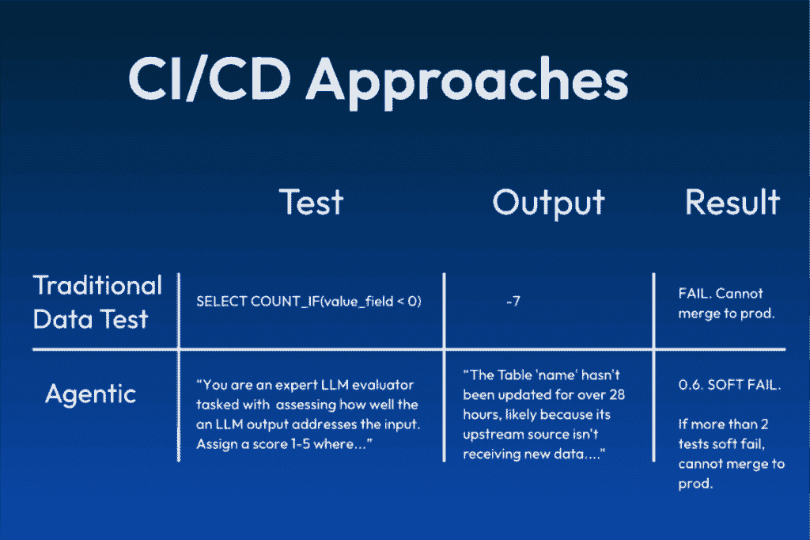

# 我们如何在开发中测试我们的代理

> 原文：[`towardsdatascience.com/how-we-are-testing-our-agents-in-dev/`](https://towardsdatascience.com/how-we-are-testing-our-agents-in-dev/)

## 为什么测试代理如此困难

<mdspan datatext="el1764878739319" class="mdspan-comment">测试你的</mdspan> AI 代理是否按预期运行并不容易。即使是像提示版本、代理编排和模型这样的组件的小调整也可能产生巨大和意外的影响。

其中一些最大的挑战包括：

### 非确定性输出

当前的问题本质上是代理是非确定性的。相同的输入进入，可能有两个不同的输出。

当你不知道预期结果会是什么时，你如何测试预期结果？简单来说，严格定义输出的测试是不起作用的。

### 未结构化输出

测试代理系统的第二个挑战，也是讨论较少的，是输出通常是未结构化的。毕竟，代理系统的基础是 *大型语言* 模型。

对于结构化数据定义测试要容易得多。例如，id 字段永远不会为 NULL 或始终为整数。如何定义大量文本字段的质量？

### 成本和规模

[LLM-as-judge](https://www.montecarlodata.com/blog-llm-as-judge/) 是评估人工智能代理质量或可靠性的最常见方法。然而，这是一个昂贵的任务，每个用户交互（跟踪）可能包含数百个交互（跨度）。

因此，我们重新思考了我们的代理测试策略。在这篇文章中，我们将分享我们的经验，包括一个新关键概念，它已被证明对于确保大规模可靠性至关重要。

图片由作者提供

## 测试我们的代理

我们有两个在生产中使用的代理，被超过 30,000 名用户所利用。故障排除代理通过数百个信号来确定数据可靠性事件的根本原因，而监控代理则提供智能数据质量监控建议。

对于故障排除代理，我们测试三个主要维度：语义距离、基础性和工具使用。以下是我们的测试方法。

### 语义距离

当适当的时候，我们利用确定性测试，因为它们清晰、可解释且成本效益高。例如，部署一个测试来确保子代理的输出是 JSON 格式，它们不超过一定长度，或者确保守卫线被按预期调用，相对容易。

然而，有时确定性测试无法完成任务。例如，我们探索了将预期和新输出都嵌入为向量，并使用 [余弦相似性测试](https://docs.snowflake.com/en/sql-reference/functions/vector_cosine_similarity)。我们认为这将是一种更便宜、更快的评估语义距离（观察到的输出和预期输出之间的意义是否相似）的方法。

然而，我们发现有很多情况，其中措辞相似，但意义不同。

相反，我们现在提供我们的 LLM 评估者从当前配置中预期的输出，并要求它对新的输出的相似度进行 0-1 评分。

### 基于上下文

对于基于上下文，我们检查确保关键上下文在应该出现的时候存在，同时也要确保当关键上下文缺失或问题超出范围时，代理将拒绝回答。

这很重要，因为大型语言模型（LLMs）渴望取悦，如果没有良好的上下文支撑，它们就会产生幻觉。

### 工具使用

对于工具使用，我们有一个 LLM 作为评估者来评估代理是否按照预定义的场景预期执行，这意味着：

+   没有预期使用任何工具，也没有调用任何工具

+   预期使用了一个工具，并且使用了一个允许的工具

+   没有省略必需的工具

+   没有使用非允许的工具

真正的魔法不在于部署这些测试，而在于如何应用这些测试。以下是我们当前基于一些痛苦的经验和错误得出的设置。

## 代理测试最佳实践

重要的是要记住，不仅你的代理是非确定性的，你的 LLM 评估也是非确定性的！这些最佳实践主要是为了对抗这些固有的不足。

### 软错误

硬阈值对于非确定性测试来说可能很嘈杂，这是显而易见的原因。因此，我们发明了“软错误”的概念。

评估结果返回一个 0-1 之间的分数。任何低于 0.5 的都是硬错误，而任何高于 0.8 的都是通过。软错误发生在 0.5 到 0.8 之间的分数。

可以合并更改以处理软错误。然而，如果超过一定的软错误阈值，则构成硬错误，并且过程将停止。

对于我们的代理，它目前配置为如果 33%的测试结果是软错误，或者如果总共有超过 2 次软错误，则被视为硬错误。这防止了更改被合并。

### 重新评估软错误

软错误可以是煤矿中的金丝雀，或者在某些情况下它们可能是无意义的。大约 10%的软错误是幻觉的结果。在软错误的情况下，评估将自动重新运行。如果结果测试通过，我们假设原始结果是错误的。

### 说明

当测试失败时，你需要了解为什么它失败了。我们现在要求每个 LLM 评估者不仅提供分数，还要解释它。这并不完美，但它有助于建立对评估的信任，并经常加快调试过程。

### 移除不稳定的测试

你必须测试你的测试。特别是对于 LLM 作为评估者的评估，提示的构建方式可能会对结果产生重大影响。我们多次运行测试，如果结果之间的差异太大，我们将修改提示或删除不稳定的测试。

## 生产中的监控

代理测试是新的且具有挑战性的，但与在生产环境中监控代理行为和输出相比，这就像散步一样简单。输入更混乱，没有预期的输出作为基准，而且规模要大得多。

不提及其他的风险已经很高了！系统可靠性问题很快就会变成商业问题。

这是我们目前的关注点。我们正在利用[代理可观察性](https://www.montecarlodata.com/blog-what-is-agent-observability/)工具来应对这些挑战，并将在未来的一篇博文中报告新的学习成果。

故障排除代理是我们推出过的最具影响力的功能之一。开发可靠的代理已经成为一个定义职业生涯的旅程，我们很兴奋能与大家分享。

* * *

[*Michael Segner*](https://www.linkedin.com/in/michaelsegner/) *是 Monte Carlo 的产品策略师，同时也是 O’Reilly 报告《通过可观察性增强数据+AI 可靠性》的作者。该报告是与 Elor Arieli 和 Alik Peltinovich 合著的。*
