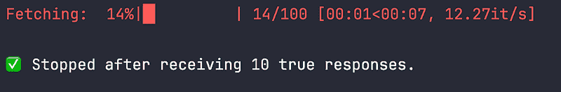
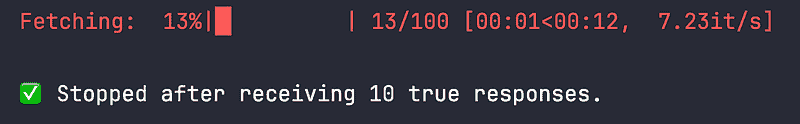
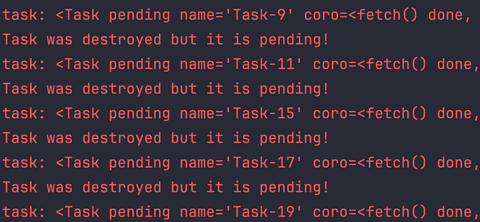

# 如何用 5 行代码将 LLM 成本降低 90%

> 原文：[`towardsdatascience.com/how-we-reduced-llm-cost-by-90-with-5-lines-of-code/`](https://towardsdatascience.com/how-we-reduced-llm-cost-by-90-with-5-lines-of-code/)

<mdspan datatext="el1755803155887" class="mdspan-comment">你知道那种感觉吗</mdspan>，当一切*似乎*都在正常工作，直到你揭开盖子，才发现你的系统比它需要的燃烧了 10 倍多的燃料？

我们有一个客户端脚本在发送请求以验证我们的提示，使用异步 Python 代码构建，并在 Jupyter 笔记本中运行顺畅。干净、简单、快速。我们定期运行它来测试我们的模型并收集评估数据。没有红旗。没有警告。

但在这光鲜亮丽的表面之下，某些东西正在悄然出错。

我们没有看到失败。我们没有收到异常。我们甚至没有注意到缓慢。但我们的系统做了比它需要的更多的工作，而我们没有意识到这一点。

在这篇文章中，我们将介绍我们是如何发现这个问题，是什么原因导致的，以及我们如何通过在异步代码中进行**简单的结构改变**，将 LLM 流量和成本降低了 90%，几乎没有任何速度或功能上的损失。

现在，公平警告，**阅读这篇文章并不能神奇地将你的 LLM 成本降低 90%**。但这里得到的启示更广泛：**小的、被忽视的设计决策，有时只是几行代码，可能导致巨大的低效。**并且有意识地关注代码的运行方式，从长远来看可以为你节省时间、金钱和挫败感。

修复本身可能一开始感觉有些狭隘。它涉及到 Python 异步行为的微妙之处，任务是如何被安排和分发的。如果你熟悉 Python 和`async`/`await`，你将能从代码示例中获得更多收获，但即使你不熟悉，也有许多东西可以吸取。因为这里真正的故事不仅仅是关于 LLM 或 Python，它是关于**负责任、高效的工程**。

让我们深入探讨。

## 设置

为了自动化验证，我们使用一个预定义的数据集，并通过客户端脚本来触发我们的系统。验证主要集中在数据集的**一小部分**上，因此客户端代码只有在接收到一定数量的响应后才会停止。

这是我们的客户端在 Python 中的简化版本：

```py
import asyncio
from aiohttp import ClientSession
from tqdm.asyncio import tqdm_asyncio

URL = "http://localhost:8000/example"
NUMBER_OF_REQUESTS = 100
STOP_AFTER = 10

async def fetch(session: ClientSession, url: str) -> bool:
    async with session.get(url) as response:
        body = await response.json()
        return body["value"]

async def main():
    results = []

    async with ClientSession() as session:
        tasks = [fetch(session, URL) for _ in range(NUMBER_OF_REQUESTS)]

        for future in tqdm_asyncio.as_completed(tasks, total=NUMBER_OF_REQUESTS, desc="Fetching"):
            response = await future
            if response is True:
                results.append(response)
                if len(results) >= STOP_AFTER:
                    print(f"\n✅ Stopped after receiving {STOP_AFTER} true responses.")
                    break

asyncio.run(main())
```

这个脚本从数据集中读取请求，并发地执行它们，一旦我们收集到足够的`true`响应来进行评估，就会停止。在生产中，逻辑更复杂，基于我们需要的响应多样性。但结构是相同的。

让我们使用一个模拟真实行为的虚拟 FastAPI 服务器：

```py
import asyncio
import fastapi
import uvicorn
import random

app = fastapi.FastAPI()

@app.get("/example")
async def example():
    sleeping_time = random.uniform(1, 2)
    await asyncio.sleep(sleeping_time)
    return {"value": random.choice([True, False])}

if __name__ == "__main__":
    uvicorn.run(app, host="0.0.0.0", port=8000)
```

现在让我们启动这个虚拟服务器并运行客户端。你将在客户端终端看到类似以下内容：



进度条在收到 10 个响应后停止

## 你能找出问题吗？


图片由[Keiteu Ko](https://unsplash.com/@keiteu_ko?utm_source=medium&utm_medium=referral)在[Unsplash](https://unsplash.com?utm_source=medium&utm_medium=referral)提供

很好！快速、干净，等等，等等，一切是否按预期工作？

表面上看，客户似乎正在做正确的事情：发送请求，得到 10 个`true`响应，然后停止。

但这是否正确呢？

让我们在服务器中添加一些打印语句，看看它实际上在底层做了什么：

```py
import asyncio
import fastapi
import uvicorn
import random

app = fastapi.FastAPI()

@app.get("/example")
async def example():
    print("Got a request")
    sleeping_time = random.uniform(1, 2)
    print(f"Sleeping for {sleeping_time:.2f} seconds")
    await asyncio.sleep(sleeping_time)
    value = random.choice([True, False])
    print(f"Returning value: {value}")
    return {"value": value}

if __name__ == "__main__":
    uvicorn.run(app, host="0.0.0", port=8000)
```

现在重新运行一切。

你会看到这样的日志：

```py
Got a request
Sleeping for 1.11 seconds
Got a request
Sleeping for 1.29 seconds
Got a request
Sleeping for 1.98 seconds
...
Returning value: True
Returning value: False
Returning value: False
...
```

仔细查看服务器日志。你会注意到一些意想不到的事情：**服务器处理的请求数量不是我们进度条上看到的 14 个，而是所有 100 个**。即使客户端在收到 10 个`true`响应后停止，它仍然会提前发送每个请求。因此，服务器必须处理所有这些请求。

**这是一个容易忽视的错误**，尤其是因为从客户端的角度看，一切似乎都在正常工作：响应迅速到来，进度条前进，脚本提前退出。但在幕后，所有 100 个请求立即发送，无论我们决定何时停止监听。这导致**比所需的流量多 10 倍**，增加了成本，增加了负载，并冒着超出速率限制的风险。

因此，关键问题变成了：为什么会出现这种情况，我们如何确保只发送我们实际需要的请求？答案最终证明是一个小但强大的变化。

**问题的根源在于任务的调度方式**。在我们的原始代码中，我们一次性创建了一个包含 100 个任务的列表：

```py
tasks = [fetch(session, URL) for _ in range(NUMBER_OF_REQUESTS)]

for future in tqdm_asyncio.as_completed(tasks, total=NUMBER_OF_REQUESTS, desc="Fetching"):
    response = await future
```

当你将协程列表传递给`as_completed`时，Python 会立即将每个协程包装在一个`Task`中，并在事件循环中对其进行调度。这发生在你开始迭代循环体之前。一旦协程成为`Task`，事件循环就会立即在后台运行它。

`as_completed`本身并不控制并发，它只是**等待任务完成并按完成顺序逐个产生它们**。把它想象成完成未来的迭代器，而不是交通控制器。这意味着在你开始循环之前，**所有 100 个请求已经全部开始**。在得到 10 个`true`结果后退出，阻止你处理剩余的请求，但它不会阻止它们被发送。

为了解决这个问题，我们引入了**一个** [**信号量**](https://docs.python.org/3/library/asyncio-sync.html#asyncio.Semaphore) **来限制并发**。信号量在`fetch`函数内部添加了一个轻量级锁，这样只有固定数量的请求可以同时开始。其余的请求保持暂停状态，等待一个空位。一旦我们达到停止条件，暂停的任务永远不会获取锁，因此它们永远不会发送请求。

这里是调整后的版本：

```py
import asyncio
from aiohttp import ClientSession
from tqdm.asyncio import tqdm_asyncio

URL = "http://localhost:8000/example"
NUMBER_OF_REQUESTS = 100
STOP_AFTER = 10

async def fetch(session: ClientSession, url: str, semaphore: asyncio.Semaphore) -> str:
    async with semaphore:
        async with session.get(url) as response:
            body = await response.json()
            return body["value"]

async def main():
    results = []
    semaphore = asyncio.Semaphore(int(STOP_AFTER * 1.5))

    async with ClientSession() as session:
        tasks = [fetch(session, URL, semaphore) for _ in range(NUMBER_OF_REQUESTS)]

        for future in tqdm_asyncio.as_completed(tasks, total=NUMBER_OF_REQUESTS, desc="Fetching"):
            response = await future
            if response:
                results.append(response)
                if len(results) >= STOP_AFTER:
                    print(f"\n✅ Stopped after receiving {STOP_AFTER} true responses.")
                    break

asyncio.run(main())
```

通过这个变化，我们仍然预先定义了 100 个请求，但**只有一小部分可以同时运行**，例如示例中的 15 个。如果我们提前达到停止条件，事件循环会在启动更多请求之前停止。这保持了行为的响应性，同时减少了不必要的调用。

现在，服务器日志将只显示大约 20 条 `"收到请求/返回响应"` 条目。在客户端，进度条将看起来与原始版本相同。



进度条在收到 10 个响应后停止

实施这一变化后，我们看到了立即的影响：**请求量减少了 90%，LLM 成本没有明显下降**，客户端体验没有明显下降。它还提高了团队的整体吞吐量，减少了排队时间，并消除了来自我们的 LLM 提供商的速率限制问题。

这一小次结构调整使我们的验证流程显著提高了效率，而不会给代码增加太多复杂性。这是一个很好的提醒，在异步系统中，除非你明确任务如何调度以及何时运行，否则控制流并不总是按照你想象的方式行事。

## 奖励洞察：关闭事件循环

如果我们没有使用 `asyncio.run()` 运行原始客户端代码，我们可能早就注意到了这个问题。

例如，如果我们像这样使用手动事件循环管理：

```py
loop = asyncio.get_event_loop()
loop.run_until_complete(main())
loop.close()
```

Python 会打印出如下警告：



任务已销毁但仍有挂起！

当程序退出时，循环中仍有未完成的异步任务调度，这些警告就会出现。如果我们看到满屏的这些警告，可能会更早地触发红旗。

那么为什么在使用 `asyncio.run()` 时我们没有看到那个警告呢？

因为 `asyncio.run()` 在幕后处理清理工作。它不仅运行你的协程并退出，还取消任何剩余的任务，等待它们完成，然后才关闭事件循环。这个内置的安全网防止了“挂起任务”警告的出现，即使你的代码默默地启动了比所需更多的任务。

因此，当你使用 `loop.close()` 手动关闭循环后，在 `run_until_complete()` 之后，任何未完成的任务仍然会挂起。Python 会检测到你正在强制关闭循环，而工作仍在计划中，并会警告你。

这并不是说每个异步 Python 程序都应该避免使用 `asyncio.run()` 或总是使用 `loop.run_until_complete()` 并手动 `loop.close()`。但它确实强调了很重要的一点：你应该意识到程序退出时还有哪些任务正在运行。**至少，在关闭之前监控或记录任何挂起的任务是个好主意。**

## 最后的想法

通过退后一步重新思考控制流程，我们能够使我们的验证过程显著提高效率——**不是通过增加更多基础设施，而是通过更谨慎地使用我们已有的资源**。几行代码的更改导致了**90%的成本降低**，几乎没有增加复杂性。它解决了速率限制错误，减少了系统负载，并允许团队更频繁地运行评估而不会造成瓶颈。

这是一个重要的提醒，**“干净的”异步代码并不总是意味着高效的代码，有意识地使用系统资源至关重要**。负责任且高效的工程不仅仅是编写出工作的代码。它关乎设计尊重时间、金钱和共享资源的系统，尤其是在协作环境中。当你将计算视为共享资产而不是无限池时，每个人都能受益：系统扩展得更好，团队行动更快，成本保持可预测。

因此，无论你是在进行 LLM 调用、启动 Kubernetes 作业，还是在批量处理数据，请暂停一下并问问自己：我是否只使用了**我真正需要的**？

通常，答案和改进只需一行代码即可实现。
