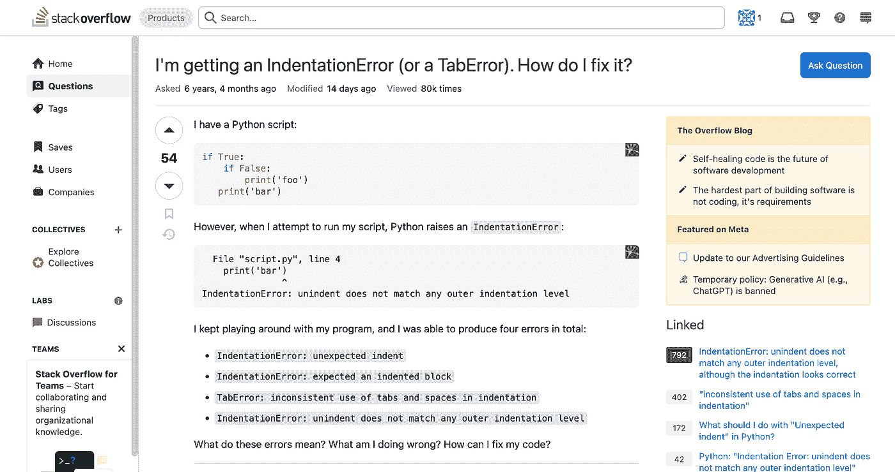
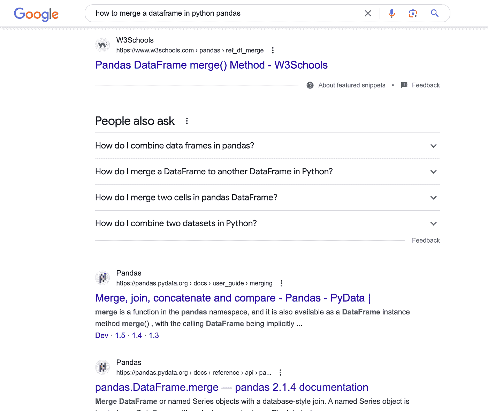
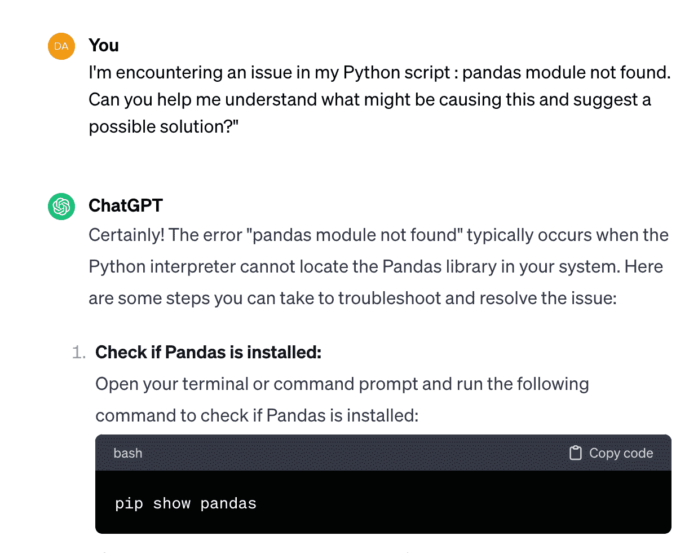
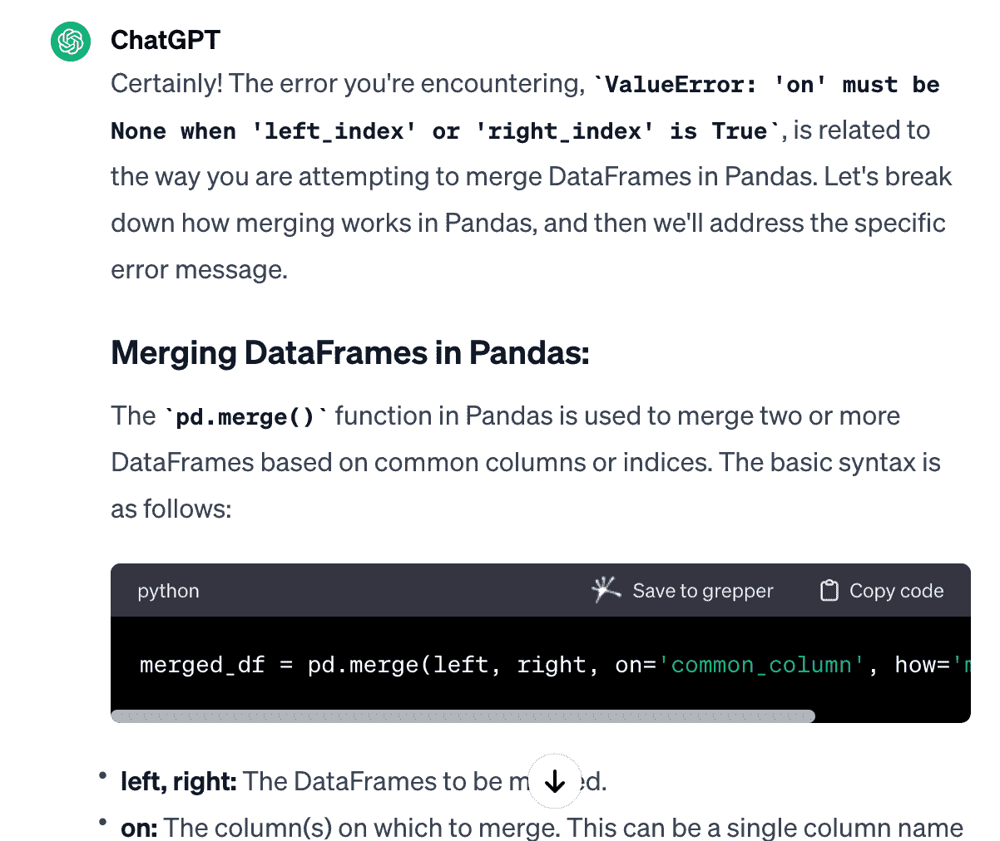
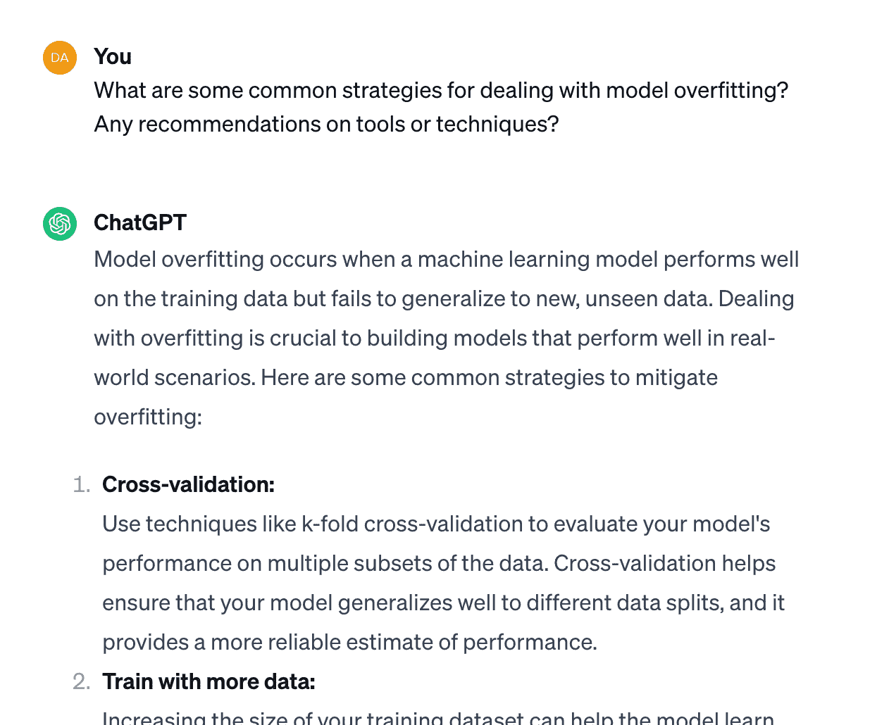
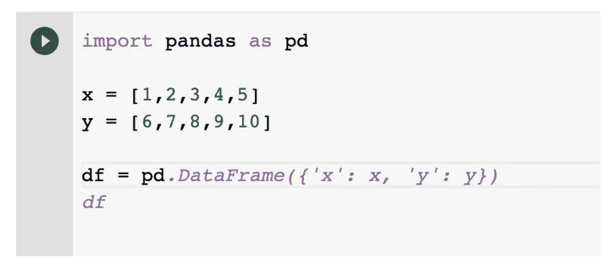
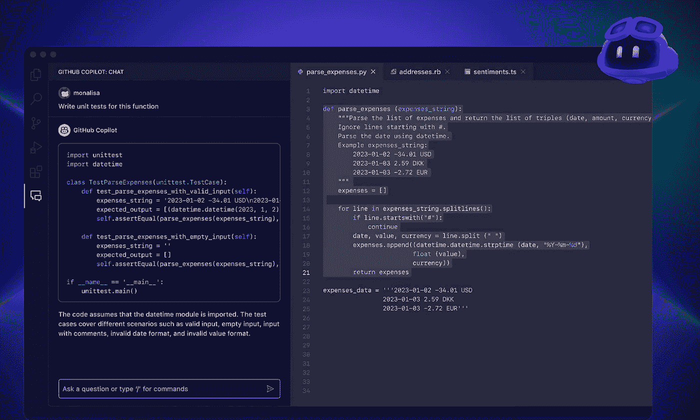
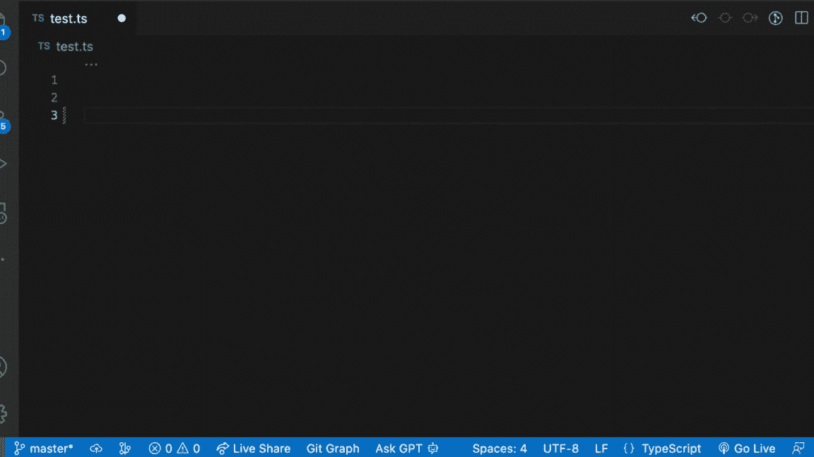
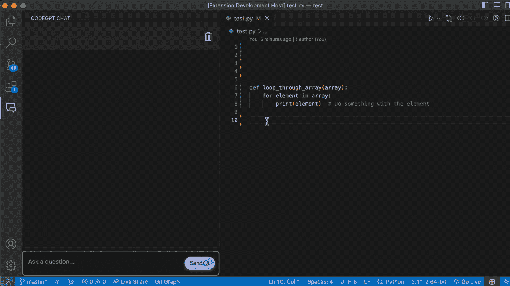

# 如果我必须重新开始，我将如何使用 ChatGPT 学习编程

> 原文：[`towardsdatascience.com/how-would-i-learn-to-code-with-chatgpt-if-i-had-to-start-again/`](https://towardsdatascience.com/how-would-i-learn-to-code-with-chatgpt-if-i-had-to-start-again/)

从我 10 岁开始，编程就成了我生活的一部分。从在简单的互联网时代修改 Friendster 个人资料中的 HTML 和 CSS，到为了刺激而探索 SQL 注入，为了乐趣而制作一个三条腿的机器人，再到最近深入 Python 编程，我的编程之旅丰富多彩且充满乐趣！

这是我从各种编程方法中学到的东西。

> **我的学习编程的方式总是相似的；正如人们所说，大部分时间只是复制粘贴。😅**

当涉及到在编程世界中构建某些东西时，以下是我方法的分解：

1.  **选择正确的框架或库**

1.  **从过往项目中学习**

1.  **将项目分解为步骤**：将你的项目分解为可操作的项目步骤，使开发不那么令人压倒。

1.  **逐块搜索 Google**：对于每一步，咨询你偏好的 Google/Bing/DuckDuckGo/任何搜索引擎以获取见解、指导和潜在解决方案。

1.  **开始编码**

    尝试系统地实施每个步骤。

然而，即使是最周密思考的代码也可能遇到 bug。以下是我的故障排除策略：

**1. 检查框架文档**：始终阅读文档！

**2. Google 和 Stack Overflow 搜索**：在 Google 和 Stack Overflow 上进行搜索。示例关键词可以是：

> site:stackoverflow.com [编程语言] [库] 错误 [错误信息]
> 
> **site:stackoverflow.com python error ImportError: pandas** *模块未找到*

– **Stack Overflow 解决方案**：如果问题已经在 Stack Overflow 上，我会寻找获得最多点赞的评论和解决方案，通常能找到快速且可靠的答案。

– **信任我的直觉**：当 Stack Overflow 没有答案时，我信任我的直觉在 Google 上搜索可信赖的资源；GeeksForGeeks、Kaggle、W3School 和 Towards Data Science 用于数据科学相关内容 😉

**3. 复制粘贴代码解决方案**

**4. 验证和测试**：最后一步包括彻底检查修改后的代码并测试它以确保它按预期运行。

## 然后 Voila，你就可以解决这个 bug 了！

图片由 [Stephen Hocking](https://unsplash.com/@shocking57?utm_source=medium&utm_medium=referral) 在 [Unsplash](https://unsplash.com/?utm_source=medium&utm_medium=referral) 提供

> 这难道不美吗？

## 但在现实中，我们还在这样做吗？！

最近，我注意到新程序员处理编程的方式有所变化。我现在已经教授编程大约三年了，在编码训练营和大学及企业培训中客座授课。程序员进入代码学习的方式已经有所改变。

我通常会告诉新手坚持使用老式的方法，即浏览和谷歌搜索答案，但人们最终还是使用了 ChatGPT。他们的借口是

> “拥有 ChatGPT（用于编码）就像拥有一个额外的学习伙伴——他像普通人一样与你聊天”。

这在处理搜索结果和文档中的内容时非常有用，特别是当你还在试图理解哪些是正确的，哪些是错误的时候——以发展所谓的**程序员直觉**。

现在，请别误会，我完全支持基础知识。浏览、阅读文档，将问题抛入社区——在我的书中，这些都是稳固的举动。完全依赖 ChatGPT 可能有点过分。当然，它可以迅速总结答案，但**传统的浏览方法给你自由选择，可以尝试一些实验，这在编码世界中非常关键**。

但是，我必须给予应有的赞誉——ChatGPT 在给出答案方面非常迅速，尤其是在你还在试图在搜索结果和文档中区分对错的时候。

我意识到使用 ChatGPT 作为学习伙伴的这种转变不仅发生在编码场景中，ChatGPT 已经彻底改变了人们的学习方式，我甚至使用 ChatGPT 来修复这篇帖子的语法，对不起 Grammarly。

> **拒绝 ChatGPT 就像拒绝 2000 年代初期的搜索引擎一样**。虽然 ChatGPT 可能会带有偏见和幻觉，类似于搜索引擎可能包含不可靠的信息或骗局。当 ChatGPT 被适当使用时，它可以加速学习过程。

现在，让我们想象一个现实生活中的场景，其中 ChatGPT 可以通过作为你的编码伙伴来帮助你进行调试。

## 场景：调试 Python 脚本

假设你正在为一个项目编写 Python 脚本，并且遇到了一个无法解决的意外错误。

这里是我以前是如何被教导做这件事的——ChatGPT 时代之前。

### 浏览方法：

1.  **检查文档：**

首先，检查导致错误的模块或函数的 Python 文档。

> 例如：
> 
> – 访问 [`scikit-learn.org/stable/modules/`](https://scikit-learn.org/stable/modules/) 查看 Scikit Learn 文档

**2. 在 Google 和 Stack Overflow 上搜索：**

如果文档没有提供解决方案，你转向 Google 和 Stack Overflow。浏览各种论坛帖子讨论，以找到类似的问题及其解决方案。

StackOverflow 帖子

3**. 信任你的直觉：**

如果问题独特或没有很好地记录，信任你的直觉！你可能会探索在 Google 上找到的值得信赖的文章和来源，并尝试将类似的解决方案应用到你的问题上。

Google 搜索结果

你可以从上面的搜索结果中看到，结果来自 W3school –（受信任的编码教程网站，非常适合速查表）和其他 2 个结果来自官方 Pandas 文档。你可以看到搜索引擎确实建议用户查看官方文档。😉

这就是你可以如何使用 ChatGPT 来帮助你调试问题的方法。

### 使用 ChatGPT 的新方法：

1.  **与 ChatGPT 进行对话：**

而不是仅仅通过文档和论坛导航，您可以将 ChatGPT 纳入对话中。提供对错误的简洁描述并提问。例如，

> **“我在我的[编程语言]脚本中遇到了一个问题，[描述错误]。你能帮我理解可能的原因并建议一个可能的解决方案吗？”**

**与 ChatGPT 进行对话**

**2. 使用 ChatGPT 澄清概念：**

如果错误与您难以掌握的概念有关，您可以要求 ChatGPT 解释该概念。例如，

> **“解释[特定概念]在[编程语言]中是如何工作的？我认为它可能与我遇到的问题有关。错误是：[错误]”**

**使用 ChatGPT 澄清概念**

**3. 寻求故障排除建议：**

您向 ChatGPT 寻求关于调试 Python 脚本的通用技巧。例如，

> **“处理[问题]有哪些常见的策略？有什么工具或技术的推荐？”**

使用 ChatGPT 作为编程伙伴

## 潜在优势：

+   **个性化指导：**ChatGPT 可以根据您提供的关于错误和您对问题理解的具体细节提供个性化指导。

+   **概念澄清：**您可以直接利用 ChatGPT 的 LLM 能力，从 ChatGPT 那里寻求对概念的解释和澄清。

+   **高效故障排除：**ChatGPT 可能会提供简洁且相关的故障排除技巧，可能简化调试过程。

## 可能的局限性：

现在我们来谈谈完全依赖 ChatGPT 的缺点。我在学生使用 ChatGPT 的旅程中看到了很多这些问题。ChatGPT 时代之后，我的学生只是从他们的命令行界面复制粘贴了 1 行错误信息，尽管错误有 100 行并且与一些模块和依赖项有关。要求 ChatGPT 通过提供 1 行错误代码来解释解决方案可能有时有效，或者更糟——它可能增加了 1-2 小时的调试时间。

ChatGPT 存在一个限制，即无法看到您代码的上下文。当然，您总是可以提供代码的上下文。在更复杂的代码中，您可能无法将每一行代码都提供给 ChatGPT。由于 Chat GPT 只能看到您代码的小部分，ChatGPT 将基于其知识库**假设**其余的代码，或者**产生幻觉**。

这些是使用 ChatGPT 的可能的局限性：

+   **缺乏实时动态交互：**虽然 ChatGPT 提供了有价值的见解，但它缺乏论坛或讨论线程可能提供的实时交互和动态来回。在 StackOverflow 上，您可能会遇到 10 个不同的人提出 3 种不同的解决方案，您可以通过 DIY（自己动手尝试）或查看点赞数来比较。

+   **依赖过去知识：**ChatGPT 的回答质量取决于其训练的信息，它可能不知道最新的框架更新或你项目的具体细节。

+   **可能增加额外的调试时间：**ChatGPT 没有你的完整代码的上下文，这可能会导致你花费更多的时间进行调试。

+   **对概念理解有限：** 传统的浏览方法让你有选择和挑选的自由，可以稍微实验一下，这在编码世界中非常关键。如果你知道如何挑选正确的来源，你可能从自己浏览中学到的比依赖 ChatGPT 通用模型更多。

    除非你询问的是经过训练并专门针对编码和技术概念的语模，或者是关于编码材料的学术论文，或者是安德鲁·吴（Andrew Ng）、杨立昆（Yann Le Cunn）在 X（前 Twitter）上的著名深度学习讲座，否则 ChatGPT 很可能只会给出一个一般性的答案。

这种场景展示了 ChatGPT 如何成为你的编码工具包中的宝贵工具，尤其是在获得个性化指导和阐明概念方面。记住，在 ChatGPT 的辅助和浏览方法以及询问社区之间保持平衡，考虑到其优势和局限性。

* * *

## 最后的想法

### 我会推荐给程序员的几件事

> 如果你真的想利用自动补全模型；而不仅仅使用 ChatGPT，尝试使用 VScode 扩展程序进行自动代码补全任务，例如 [CodeGPT — VScode 上的 GPT4 扩展](https://codegpt.co/)、[GitHub Copilot](https://github.com/features/copilot)，或者 Google Colab 中的自动补全 AI 工具。

Google Colab 上的自动代码补全

如上图所示，Google Colab 会自动为用户提供下一步代码的建议。

另一个选择是 Github Copilot。使用 GitHub Copilot，你可以实时获得基于 AI 的建议。GitHub Copilot 在开发者键入代码时会提供代码补全建议，并根据项目的上下文和风格约定将提示转换为编码建议。根据这个 [GitHub 发布](https://github.blog/changelog/2023-11-30-github-copilot-november-30th-update/)，Copilot Chat 现在由 OpenAI GPT-4（与 ChatGPT 使用类似模型）提供动力。

Github Copilot 示例 — 图片来自 Github

在我知道 Github Copilot 如果你是教育项目的一部分可以免费使用之前，我已经积极地将 CodeGPT 作为 VSCode 扩展程序使用。CodeGPT Co 到目前为止在 VSCode 扩展市场中已有 1M 次下载。CodeGPT 允许与 ChatGPT API、Google PaLM 2 和 Meta Llama 无缝集成。

**你可以通过注释获得代码建议**，以下是方法：

+   写一个请求特定代码的注释

+   按 `cmd + shift + i`

+   使用代码 😎

**你也可以通过菜单中的扩展程序启动聊天** 并进入编码对话 💬

当我回顾我的编码之旅时，学到的宝贵教训是，没有一种适合所有学习的方法。重要的是要拥抱多样化的学习方法，无缝地将传统的浏览和社区互动实践与 ChatGPT 和自动代码补全工具等创新工具的能力相结合。

## 要做什么：

+   ***利用定制学习资源：**充分利用 ChatGPT 对学习材料的推荐。

+   ***协作解决问题：**将 ChatGPT 作为协作伙伴使用，就像你与朋友一起编码一样。

## 不要做什么：

+   ***过度依赖 ChatGPT：**避免仅依赖 ChatGPT，并确保采取平衡的方法来培养独立解决问题的能力。

+   ***忽视与编码社区的实时互动：**虽然 ChatGPT 提供了有价值的见解，但不要忽视实时互动和编码社区反馈的好处。这也有助于在社区中建立声誉

+   ***忽视实际编码实践：**平衡 ChatGPT 的指导与实际编码实践，以通过实际应用巩固理论知识。

**在评论中告诉我你是如何使用 ChatGPT 来帮助你编码的！**

编程愉快！

*Ellen*

# 让我们建立联系

🌐 在 [LinkedIn](https://www.linkedin.com/in/liviaellen/) 上关注我

🚀 *查看我的作品集：* [*liviaellen.com/portfolio*](https://liviaellen.com/portfolio)

👏 *我的先前 AR 作品*: [liviaellen.com/ar-profile](https://liviaellen.com/ar-profile) [liviaellen.com/portfolio]*☕ 或者只是 [**买我一杯真正的咖啡**](https://ko-fi.com/liviaellen)❤ — 是的，我爱咖啡。

##### ***关于作者***

*我是 Ellen，一名拥有 6 年经验的机器学习工程师，目前在旧金山的金融科技初创公司工作。我的背景包括在石油和天然气咨询中的数据科学角色，以及领导亚太、中东和欧洲的 AI 和数据培训项目。*

*我目前正在完成我的数据科学硕士学位（将于 2025 年 5 月毕业），并积极寻找我的下一份作为机器学习工程师的工作机会。如果你愿意推荐或建立联系，我将非常感激！*

*我喜欢通过 AI 创造实际影响，并且我总是开放接受基于项目的合作。*
