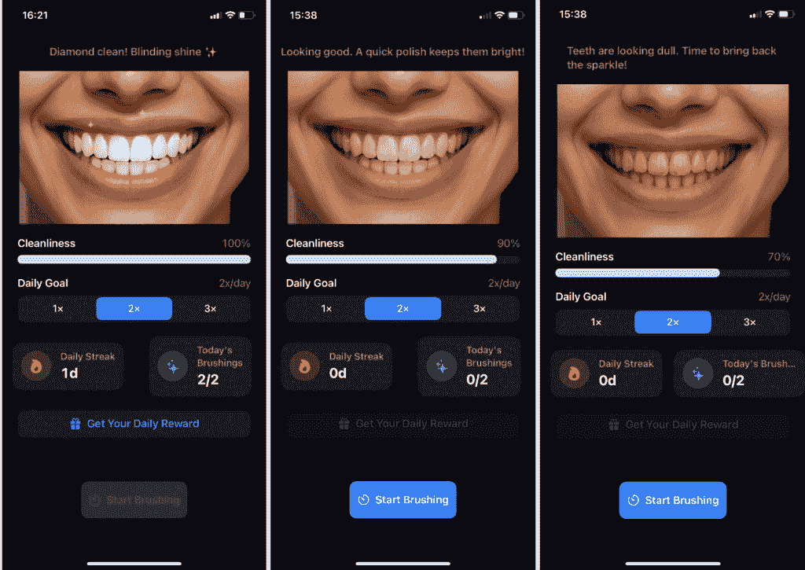
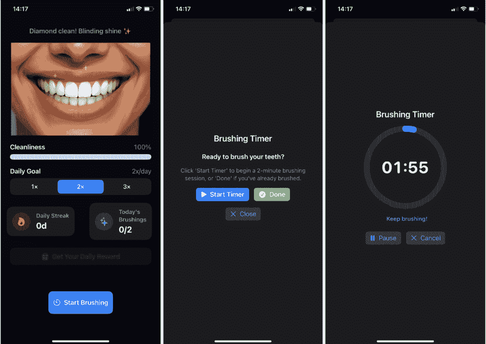
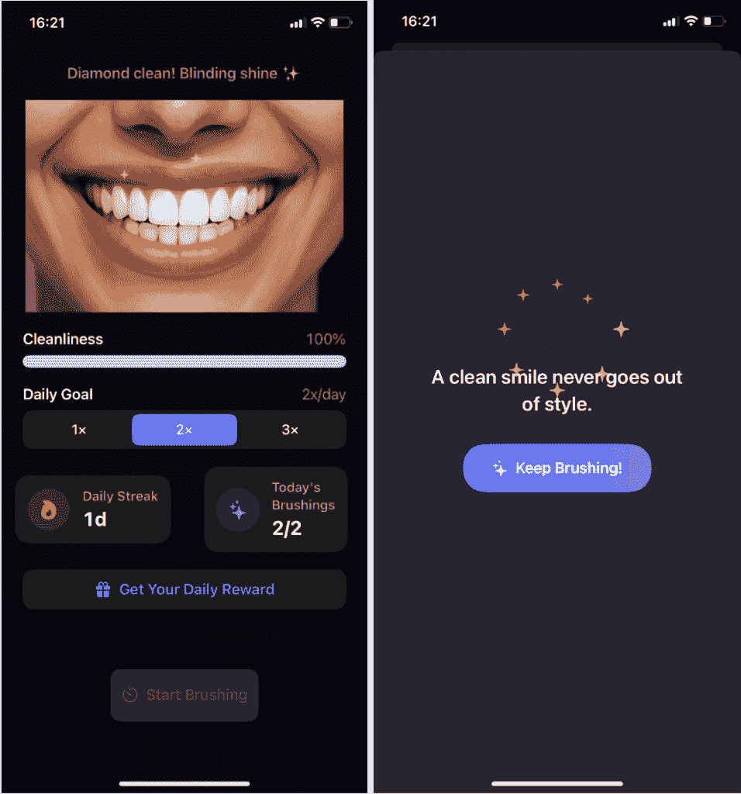

# 在 3 天内用实际上没有任何 Swift 知识构建了一个 IOS 应用

> 原文：[`towardsdatascience.com/i-built-an-ios-app-in-3-days-with-literally-no-prior-swift-knowledge/`](https://towardsdatascience.com/i-built-an-ios-app-in-3-days-with-literally-no-prior-swift-knowledge/)

<mdspan datatext="el1763169596599" class="mdspan-comment">我</mdspan>在 3 天内构建了[Brush Tracker](https://apps.apple.com/us/app/brush-tracker/id6754214621)应用，此前我对 Swift 一无所知，Swift 是 iOS 开发的主要编程语言。尽管我的应用在 App Store 上已经上线并完全可用，但我对 Swift 的了解仍然非常有限，因为我使用了“vibe coding”来开发这个应用。

在这篇文章中，我将解释这个过程，分享我使用的 AI 工具，以及一些我的学习和见解。

## 作为 Lovable 的替代方案

我之前使用 Lovable 开发 Web 应用，但似乎目前它不是移动应用开发的选项。

对于应用开发，有 Lovable 的替代方案。我最近发现了一个名为 Anything 的工具，由于我对 Lovable 有很好的体验，我决定尝试用它来开发我的应用。一开始，它似乎工作得很好，但整体体验并没有像我希望的那样高效。

最困难的部分是无法立即测试我的更改、修复和改进。任何东西都内置了用于测试的用户界面，但体验并不十分流畅。它还指导你通过 Expo 应用测试代码，但对我来说这也不太顺利。

我应该提到，我没有任何应用开发经验。对于开发者或任何有编程背景的人来说，Anything 可能比我更有效率。

我从 Anything 导出了代码，并尝试在我的 mac 上的 Xcode 上测试它，但出现了许多错误，无法使其工作。因此，我决定使用一个替代方案。Cursor 似乎是一个明显的选择。

## Cursor

我从许多积极使用 Cursor 的朋友那里听到了很多好话。我想亲自尝试一下。

我在 Cursor 中使用了相同的提示，并要求它构建应用。然后我使用 Cursor 生成的文件夹和文件创建了一个 XCode 项目。我在 XCode 上启动了模拟器，它第一次就成功了。

Brush Tracker 的目标是帮助你保持日常刷牙的一致性。它给你一个从 100%开始的清洁度评分。如果你错过了一天，评分会下降，应用中的牙齿开始看起来有点发黄，以匹配清洁度评分。

注意：本文中使用的所有图片均包含我的应用 Brush Tracker 的屏幕截图。

第一个版本只包含了应用的主要功能。我认为这是使用基于 AI 的工具构建产品的最有效方式。在添加功能之前，先让第一个版本运行起来。

为了在模拟器上测试应用程序的核心功能，我必须更改模拟器的日期，而不完成“今天的刷牙”，以检查清洁度评分是否会下降，牙齿可视化是否会按预期更新。

Cursor 建议更改 XCode 模拟器的日期，但模拟器已经没有日期和时间设置了。较旧版本的 XCode 模拟器有这个设置，但现在没有了。

一个解决方案是更改我的 Mac 上的日期。这样，模拟器上的日期也会改变，我能够测试这个功能。

我注意到的一件事是，当我更改 Mac 上的日期时，Cursor 没有看到我的账户并且无法工作。当我将日期改回自动时，它又恢复正常了。

## 计时器功能

内置的刷牙计时器感觉像是 Brush Tracker 的绝佳补充。用户可以简单地标记刷牙会话已完成，或者在刷牙时使用计时器。

我尝试了几次才让这个功能按我设想的方式工作。你只需告诉 Cursor 添加一个功能，但当你调整提示并清楚地说明你想要什么时，它效果会更好。一旦你给出明确的指示，Cursor 通常能做得很好。

## 奖励功能

我想在用户完成日常刷牙后增加额外的激励。完成会话后，他们可以点击“获取您的每日奖励”并查看一条简短的动力引言。这是一个小细节，但却是提醒口腔健康的美好提醒。

## 你实际上可以在 vibe coding 中学习。

Cursor 不仅编写代码，还帮助你学习。当我尝试添加奖励功能时，最初实现是不正确的。它没有正常工作。

我向 Cursor 描述了问题，它解释了导致问题的原因以及如何修复它。以下是 Cursor 在过程中如何帮助学习的两个例子：

*问题是第一次点击时 rewardQuote 为空，因为 handleRewardTap()设置了它，但 sheet 立即展示。我需要确保在展示 sheet 之前设置引言。*

*问题已解决！问题在于在 rewardQuote 之后立即设置了 showReward = true，但 SwiftUI 的 sheet 展示可能会在状态更新完全处理之前发生。*

## 更高效地使用 Cursor

Cursor 是一个伟大的工具，但有一些方法可以使它更高效。

假设代码失败或执行不正确。如果你知道问题所在的部分，请突出显示该部分并将其添加到聊天中。这肯定会让 Cursor 更容易解决问题。

在 Brush Tracker 中，我在设置通知时遇到了问题。我定义了问题并要求 Cursor 修复它。Cursor 告诉我问题已修复，但问题仍然存在。然后，我从代码更改中找到了问题发生的地方，并将其添加到聊天中。

Cursor 在下次尝试中解决了问题：*问题在于 onTapGesture 被应用于 Picker，但在 SwiftUI 中，分段选择器并不总是很好地响应触摸手势，因为它们有自己的内部手势处理。onChange 修饰符仅在选择实际改变时触发，而不是在相同的值被触摸时触发。*

另一个值得提及的是 Cursor 中的“使用上下文”百分比。它自动从您的代码库中捕获相关上下文，因此您无需告诉它查看哪些文件。但您的聊天历史也被包含在这个上下文中，有时它包含旧问题或不相关的代码。

额外的杂乱可能会增加令牌使用量或使 Cursor 效率降低。当使用上下文百分比增加时，我会清除聊天历史。

## 在 App Store 中分发您的应用

一旦您使用模拟器或物理设备（例如您的 iPhone）完成应用的测试，就是时候在 App Store 中分发您的应用，以便其他人可以看到（并希望使用）您的应用。

这不是一个复杂的过程，但有很多细节，尤其是当您第一次做的时候可能会花费较长时间。我在 YouTube 上找到了一个[视频](https://www.youtube.com/watch?v=Qgq6jsRtfbA)，它清楚地一步一步解释了整个过程。

完成所有步骤后，我将我的应用提交进行审查。一旦它被批准，我就收到了来自 App Store Connect 的电子邮件，通知我可以开始分发。

我想指出，我与此文中提到的任何 AI 工具都没有任何关联。

感谢阅读！您可以在 App Store 上查看[Brush Tracker](https://apps.apple.com/us/app/brush-tracker/id6754214621)。如果您尝试了它或有任何反馈，我非常乐意听到您的意见。
