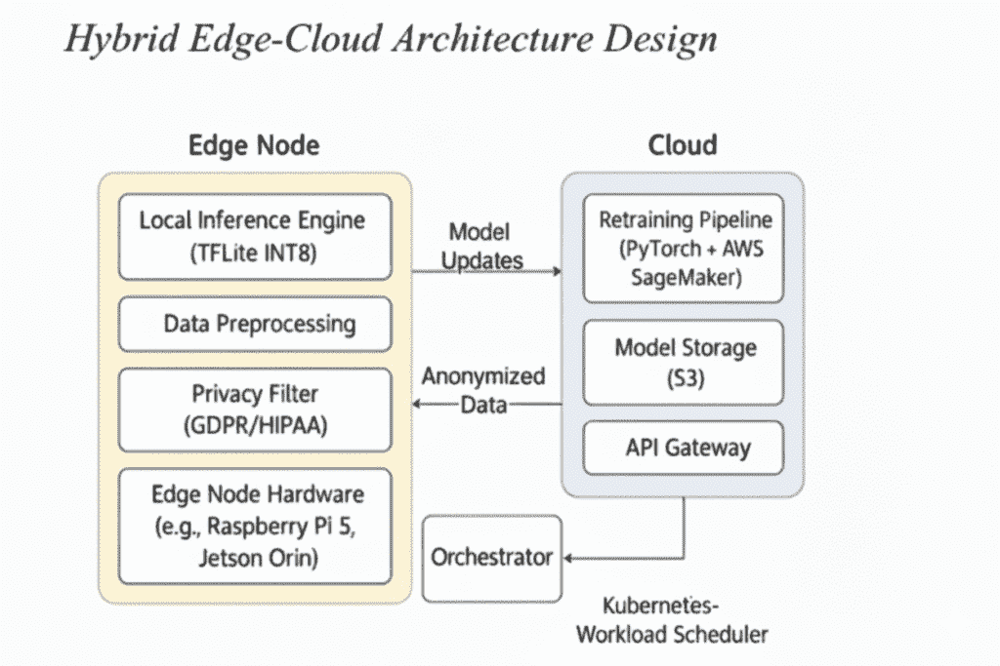

# 我将我的 AI 模型缩小了 84%，而且效果更好，而不是更差

> 原文：[`towardsdatascience.com/i-made-my-ai-model-84-smaller-and-it-got-better-not-worse/`](https://towardsdatascience.com/i-made-my-ai-model-84-smaller-and-it-got-better-not-worse/)

## <mdspan datatext="el1758941554981" class="mdspan-comment">TL;DR</mdspan>

大多数公司在处理与 AI 部署相关的成本和延迟方面都感到困难。本文将向您展示如何构建一个混合系统，该系统：

+   在边缘设备上处理了 94.9%的请求（响应时间低于 20 毫秒）

+   相比仅使用云端的解决方案，降低了 93.5%的推理成本

+   通过智能量化，保持了 99.1%的原模型准确性

+   将敏感数据保留在本地，以便更容易遵守规定

我们将使用代码从头到尾演示完整的实现过程，从领域适应到生产监控。

## 没有人谈论的真正问题

想象一下：你已经为客服构建了一个出色的 AI 模型。它在你的 Jupyter 笔记本上运行得很好。但当你将其部署到生产环境中时，你发现：

+   **云推理成本为每月 2900 美元**（对于合理的流量量）

+   **响应时间徘徊在 200 毫秒左右**（客户会注意到延迟）

+   **数据跨越国际边界**（合规团队并不高兴）

+   **成本随着流量激增而不可预测地增长**

听起来熟悉吗？你不是一个人。 [根据《福布斯科技委员会》（2024 年）的数据，高达 85%的 AI 模型可能无法成功部署，成本和延迟是主要障碍](https://www.forbes.com/councils/forbestechcouncil/2024/11/15/why-85-of-your-ai-models-may-fail/)。

## 解决方案：像机场安检一样思考

如果我们能够不将每个查询发送到庞大的云端模型，会怎样：

+   在本地处理 95%的常规查询（就像机场安检的快速通道）

+   只将复杂案例升级到云端（二次筛查）

+   保持路由决策的清晰记录（用于审计）

这种“边缘优先”的方法反映了人类自然处理支持请求的方式。经验丰富的代理可以快速解决大多数问题，只将棘手的问题升级给专家。



边缘和云端在 Kubernetes 管理的混合 AI 机制中交换模型更新和匿名数据（图片由作者提供）

## 我们将一起构建的内容

到本文结束时，你将：

1.  **一个领域适应的模型**，能够理解客户服务语言

1.  **一个缩小 84%的量化版本**，在 CPU 上运行速度快

1.  **智能路由器**，根据每个查询决定使用边缘还是云端

1.  **生产监控**以保持一切正常运行

让我们开始编码。

## 环境设置：从第一天开始就做对

首先，让我们建立一个可重复的环境。没有什么比花一天时间调试库冲突更能扼杀动力的了。

```py
import os
import warnings
import numpy as np
import pandas as pd
import torch
import tensorflow as tf
from transformers import (
    DistilBertTokenizerFast, DistilBertForMaskedLM, 
    Trainer, TrainingArguments, TFDistilBertForSequenceClassification
)
from sklearn.model_selection import train_test_split
from sklearn.preprocessing import LabelEncoder
import onnxruntime as ort
import time
from collections import deque

def setup_reproducible_environment(seed=42):
    """Make results reproducible across runs"""
    np.random.seed(seed)
    torch.manual_seed(seed)
    tf.random.set_seed(seed)
    torch.backends.cudnn.deterministic = True
    tf.config.experimental.enable_op_determinism()
    warnings.filterwarnings('ignore')
    print(f"✅ Environment configured (seed: {seed})")   

setup_reproducible_environment()

# Hardware specs for reproduction
SYSTEM_CONFIG = {
    "cpu": "Intel Xeon Silver 4314 @ 2.4GHz",
    "memory": "64GB DDR4", 
    "os": "Ubuntu 22.04",
    "python": "3.10.12",
    "key_libs": {
        "torch": "2.7.1",
        "tensorflow": "2.14.0", 
        "transformers": "4.52.4",
        "onnxruntime": "1.17.3"
    }
}

# Project structure
PATHS = {
    "data": "./data",
    "models": {
        "domain_adapted": "./models/dapt",
        "classifier": "./models/classifier",
        "onnx_fp32": "./models/onnx/model_fp32.onnx", 
        "onnx_quantized": "./models/onnx/model_quantized.onnx"
    },
    "logs": "./logs"
}

# Create directories
for path in PATHS.values():
    if isinstance(path, dict):
        for p in path.values():
            os.makedirs(os.path.dirname(p) if '.' in os.path.basename(p) else p, exist_ok=True)
    else:
        os.makedirs(path, exist_ok=True)

print("📁 Project structure ready")  # IMPROVED: Added emoji for consistency 
```

## 第 1 步：领域适应——教 AI 说“支持”

常规语言模型知道英语，但它们不知道如何*支持英语*。“我需要帮助”和“这完全不能接受——我要求立即与经理通话！”之间有很大的区别

领域自适应预训练（DAPT）通过在训练分类之前继续在客户服务对话中学习模型的语言，来解决这一问题。

```py
class CustomerServiceTrainer:
    """Complete pipeline for domain adaptation + classification"""

    def __init__(self, base_model="distilbert-base-uncased"):
        self.base_model = base_model
        self.tokenizer = DistilBertTokenizerFast.from_pretrained(base_model)
        print(f"🤖 Initialized with {base_model}")   

    def domain_adaptation(self, texts, output_path, epochs=2, batch_size=32):
        """
        Phase 1: Adapt model to customer service language patterns

        This is like language immersion - the model learns support-specific 
        vocabulary, escalation phrases, and common interaction patterns.
        """
        from datasets import Dataset
        from transformers import DataCollatorForLanguageModeling

        print(f"📚 Starting domain adaptation on {len(texts):,} conversations...")  

        # Create dataset for masked language modeling
        dataset = Dataset.from_dict({"text": texts}).map(
            lambda examples: self.tokenizer(
                examples["text"], 
                padding="max_length", 
                truncation=True, 
                max_length=128  # Keep reasonable for memory
            ), 
            batched=True,
            remove_columns=["text"]
        )

        # Initialize model for continued pre-training
        model = DistilBertForMaskedLM.from_pretrained(self.base_model)
        print(f"   📊 Model parameters: {model.num_parameters():,}")   

        # Training setup
        training_args = TrainingArguments(
            output_dir=output_path,
            num_train_epochs=epochs,
            per_device_train_batch_size=batch_size,
            logging_steps=200,
            save_steps=1000,
            fp16=torch.cuda.is_available(),  # Use mixed precision if GPU available
        )

        trainer = Trainer(
            model=model,
            args=training_args,
            train_dataset=dataset,
            data_collator=DataCollatorForLanguageModeling(
                self.tokenizer, mlm=True, mlm_probability=0.15
            )
        )

        # Train and save
        trainer.train()
        trainer.save_model(output_path)
        self.tokenizer.save_pretrained(output_path)

        print(f"✅ Domain adaptation complete: {output_path}")   
        return output_path

    def train_classifier(self, X_train, X_val, y_train, y_val, 
                        dapt_model_path, output_path, epochs=8):
        """
        Phase 2: Two-stage classification training

        Stage 1: Warm up classifier head (backbone frozen)
        Stage 2: Fine-tune entire model with smaller learning rate
        """
        from transformers import create_optimizer

        print(f"🎯 Training classifier on {len(X_train):,} samples...")   

        # Encode labels
        self.label_encoder = LabelEncoder()
        y_train_enc = self.label_encoder.fit_transform(y_train)
        y_val_enc = self.label_encoder.transform(y_val)

        print(f"   📊 Classes: {list(self.label_encoder.classes_)}")  

        # Create TensorFlow datasets
        def make_dataset(texts, labels, batch_size=128, shuffle=False):
            encodings = self.tokenizer(
                texts, padding="max_length", truncation=True,
                max_length=256, return_tensors="tf"  # Longer for classification
            )
            dataset = tf.data.Dataset.from_tensor_slices((dict(encodings), labels))
            if shuffle:
                dataset = dataset.shuffle(10000, seed=42)
            return dataset.batch(batch_size).prefetch(tf.data.AUTOTUNE)

        train_dataset = make_dataset(X_train, y_train_enc, shuffle=True)
        val_dataset = make_dataset(X_val, y_val_enc)

        # Load domain-adapted model for classification
        model = TFDistilBertForSequenceClassification.from_pretrained(
            dapt_model_path, num_labels=len(self.label_encoder.classes_)
        )

        # Optimizer with warmup
        total_steps = len(train_dataset) * epochs
        optimizer, _ = create_optimizer(
            init_lr=3e-5,
            num_train_steps=total_steps,
            num_warmup_steps=int(0.1 * total_steps)
        )

        model.compile(
            optimizer=optimizer,
            loss='sparse_categorical_crossentropy',
            metrics=['accuracy']
        )

        # Stage 1: Classifier head warm-up
        print("   🔥 Stage 1: Warming up classifier head...")   
        model.distilbert.trainable = False
        model.fit(train_dataset, validation_data=val_dataset, epochs=1, verbose=1)

        # Stage 2: Full fine-tuning  
        print("   🔥 Stage 2: Full model fine-tuning...")   
        model.distilbert.trainable = True
        model.optimizer.learning_rate = 3e-6  # Smaller LR for stability

        # Add callbacks for better training
        callbacks = [
            tf.keras.callbacks.EarlyStopping(patience=2, restore_best_weights=True),
            tf.keras.callbacks.ReduceLROnPlateau(factor=0.5, patience=1)
        ]

        history = model.fit(
            train_dataset, 
            validation_data=val_dataset,
            epochs=epochs-1,  # Already did 1 epoch
            callbacks=callbacks,
            verbose=1
        )

        # Save everything
        model.save_pretrained(output_path)
        self.tokenizer.save_pretrained(output_path)

        import joblib
        joblib.dump(self.label_encoder, f"{output_path}/label_encoder.pkl")

        best_acc = max(history.history['val_accuracy'])
        print(f"✅ Training complete! Best accuracy: {best_acc:.4f}")   

        return model, history

# Let's create some sample data for demonstration
def create_sample_data(n_samples=5000):
    """Generate realistic customer service data for demo"""
    np.random.seed(42)

    # Sample conversation templates
    templates = {
        'positive': [
            "Thank you so much for the excellent customer service today!",
            "Great job resolving my issue quickly and professionally.",
            "I really appreciate the help with my account.",
            "The support team was fantastic and very knowledgeable.",
            "Perfect service, exactly what I needed."
        ],
        'negative': [ 
            "This is completely unacceptable and I demand to speak with a manager!",
            "I'm extremely frustrated with the poor service quality.",
            "This issue has been ongoing for weeks without resolution.",
            "Terrible experience, worst customer service ever.",
            "I want a full refund immediately, this is ridiculous."
        ],
        'neutral': [
            "I need help with my account settings please.",
            "Can you check the status of my recent order?", 
            "What are your business hours and contact information?",
            "I have a question about billing and payment options.",
            "Please help me understand the refund process."
        ]
    }

    data = []
    for _ in range(n_samples):
        sentiment = np.random.choice(['positive', 'negative', 'neutral'], 
                                   p=[0.4, 0.3, 0.3])  # Realistic distribution
        template = np.random.choice(templates[sentiment])

        # Add some variation
        if np.random.random() < 0.2:  # 20% get account numbers
            template += f" My account number is {np.random.randint(100000, 999999)}."

        data.append({
            'transcript': template,
            'sentiment': sentiment
        })

    df = pd.DataFrame(data)
    print(f"📊 Created {len(df):,} sample conversations")   
    print(f"📊 Sentiment distribution:\n{df['sentiment'].value_counts()}")  
    return df

# Execute domain adaptation and classification training
trainer = CustomerServiceTrainer()

# Create sample data (replace with your actual data)
df = create_sample_data(5000)

# Split data
X_train, X_val, y_train, y_val = train_test_split(
    df['transcript'], df['sentiment'], 
    test_size=0.2, stratify=df['sentiment'], random_state=42
)

# Run domain adaptation
dapt_path = trainer.domain_adaptation(
    df['transcript'].tolist(), 
    PATHS['models']['domain_adapted'],
    epochs=2
)

# Train classifier
model, history = trainer.train_classifier(
    X_train.tolist(), X_val.tolist(),
    y_train.tolist(), y_val.tolist(),
    dapt_path,
    PATHS['models']['classifier'],
    epochs=6
)
```

## 第 2 步：模型压缩 – 84%的尺寸缩减

现在，让我们来展示一个魔术：我们将通过压缩模型 84%的同时保持几乎所有的准确性。这正是边缘部署成为可能的原因。

关键洞察是大多数神经网络都是过度设计的。它们使用 32 位浮点数，而 8 位整数对于大多数任务来说已经足够。这就像使用高分辨率相机，而手机相机在社交媒体上也能给出相同的结果。

```py
class ModelCompressor:
    """ONNX-based model compression with comprehensive validation"""

    def __init__(self, model_path):
        self.model_path = model_path
        self.tokenizer = DistilBertTokenizerFast.from_pretrained(model_path)
        print(f"🗜️ Compressor ready for {model_path}")

    def compress_to_onnx(self, fp32_output, quantized_output):
        """
        Two-step process:
        1\. Convert TensorFlow model to ONNX (cross-platform format)
        2\. Apply dynamic INT8 quantization (no calibration needed)
        """
        from optimum.onnxruntime import ORTModelForSequenceClassification
        from onnxruntime.quantization import quantize_dynamic, QuantType

        print("📋 Step 1: Converting to ONNX format...")

        # Export to ONNX (this makes the model portable across platforms)
        ort_model = ORTModelForSequenceClassification.from_pretrained(
            self.model_path, export=True, provider="CPUExecutionProvider"
        )
        ort_model.save_pretrained(os.path.dirname(fp32_output))

        # Rename to our desired path
        generated_path = os.path.join(os.path.dirname(fp32_output), "model.onnx")
        if os.path.exists(generated_path):
            os.rename(generated_path, fp32_output)

        fp32_size = os.path.getsize(fp32_output) / (1024**2)  # MB
        print(f"   📏 Original ONNX model: {fp32_size:.2f}MB")

        print("⚡ Step 2: Applying dynamic INT8 quantization...")

        # Dynamic quantization - no calibration dataset needed!
        quantize_dynamic(
            model_input=fp32_output,
            model_output=quantized_output,
            op_types_to_quantize=[QuantType.QInt8, QuantType.QUInt8],
            weight_type=QuantType.QInt8,
            optimize_model=False  # Keep optimization separate
        )

        quantized_size = os.path.getsize(quantized_output) / (1024**2)  # MB
        compression_ratio = (fp32_size - quantized_size) / fp32_size * 100

        print(f"   📏 Quantized model: {quantized_size:.2f}MB")   
        print(f"   🎯 Compression: {compression_ratio:.1f}% size reduction")   

        return fp32_output, quantized_output, compression_ratio

    def benchmark_models(self, fp32_path, quantized_path, test_texts, test_labels):
        """
        Compare FP32 vs INT8 models on accuracy, speed, and size

        This is crucial - we need to verify our compression didn't break anything!
        """
        print("🧪 Benchmarking model performance...")   

        results = {}

        for name, model_path in [("FP32 Original", fp32_path), ("INT8 Quantized", quantized_path)]:
            print(f"   Testing {name}...")

            # Load model for inference
            session = ort.InferenceSession(model_path, providers=["CPUExecutionProvider"])

            # Test on representative sample (500 examples for speed)
            test_sample = min(500, len(test_texts))
            correct_predictions = 0
            latencies = []

            # Warm up the model (important for fair timing!)
            warmup_text = "Thank you for your help with my order today"
            warmup_encoding = self.tokenizer(
                warmup_text, padding="max_length", truncation=True,
                max_length=256, return_tensors="np"
            )

            for _ in range(10):  # 10 warmup runs
                _ = session.run(None, {
                    "input_ids": warmup_encoding["input_ids"],
                    "attention_mask": warmup_encoding["attention_mask"]
                })

            # Actual benchmarking
            for i in range(test_sample):
                text, true_label = test_texts[i], test_labels[i]

                encoding = self.tokenizer(
                    text, padding="max_length", truncation=True,
                    max_length=256, return_tensors="np"
                )

                # Time the inference
                start_time = time.perf_counter()
                outputs = session.run(None, {
                    "input_ids": encoding["input_ids"],
                    "attention_mask": encoding["attention_mask"]
                })
                latency_ms = (time.perf_counter() - start_time) * 1000
                latencies.append(latency_ms)

                # Check accuracy
                predicted_class = np.argmax(outputs[0])
                if predicted_class == true_label:
                    correct_predictions += 1

            # Calculate metrics
            accuracy = correct_predictions / test_sample
            mean_latency = np.mean(latencies)
            p95_latency = np.percentile(latencies, 95)
            model_size_mb = os.path.getsize(model_path) / (1024**2)

            results[name] = {
                "accuracy": accuracy,
                "mean_latency_ms": mean_latency,
                "p95_latency_ms": p95_latency,
                "model_size_mb": model_size_mb,
                "throughput_qps": 1000 / mean_latency  # Queries per second
            }

            print(f"      ✓ Accuracy: {accuracy:.4f}")
            print(f"      ✓ Mean latency: {mean_latency:.2f}ms")
            print(f"      ✓ P95 latency: {p95_latency:.2f}ms")
            print(f"      ✓ Model size: {model_size_mb:.2f}MB")
            print(f"      ✓ Throughput: {results[name]['throughput_qps']:.1f} QPS")

        # Show the comparison
        if len(results) == 2:
            fp32_results = results["FP32 Original"] 
            int8_results = results["INT8 Quantized"]

            size_reduction = (1 - int8_results["model_size_mb"] / fp32_results["model_size_mb"]) * 100
            accuracy_retention = int8_results["accuracy"] / fp32_results["accuracy"]
            latency_change = ((int8_results["mean_latency_ms"] - fp32_results["mean_latency_ms"]) 
                             / fp32_results["mean_latency_ms"]) * 100

            print(f"\n🎯 Quantization Impact Summary:")   
            print(f"   📦 Size reduction: {size_reduction:.1f}%")  
            print(f"   🎯 Accuracy retention: {accuracy_retention:.1%}")  
            print(f"   ⚡ Latency change: {latency_change:+.1f}%")  
            print(f"   💾 Memory saved: {fp32_results['model_size_mb'] - int8_results['model_size_mb']:.1f}MB")    

        return results

# Execute model compression
compressor = ModelCompressor(PATHS['models']['classifier'])

# Compress the model
fp32_path, quantized_path, compression_ratio = compressor.compress_to_onnx(
    PATHS['models']['onnx_fp32'],
    PATHS['models']['onnx_quantized']
)

# Load test data and label encoder for benchmarking  
import joblib
label_encoder = joblib.load(f"{PATHS['models']['classifier']}/label_encoder.pkl")
test_labels_encoded = label_encoder.transform(y_val[:500])

# Benchmark the models
benchmark_results = compressor.benchmark_models(
    fp32_path, quantized_path,
    X_val[:500].tolist(), test_labels_encoded
) 
```

## 第 3 步：智能路由器 – 决定边缘与云

这就是混合魔法发生的地方。我们的路由器分析每个客户查询，并确定是本地处理（在边缘）还是将其转发到云端。把它想象成一个智能交通控制器。

路由器考虑五个因素：

1.  **文本长度** – 较长的查询通常意味着复杂的问题

1.  **句子结构** – 多个从句表明存在细微的问题

1.  **情感指标** – 如“沮丧”等词语表明需要升级

1.  **模型置信度** – 如果 AI 不确定，则路由到云端

1.  **升级关键词** – “经理”、“投诉”等。

```py
class IntelligentRouter:
    """
    Smart routing system that maximizes edge usage while maintaining quality

    The core insight: 95% of customer queries are routine and can be handled
    by a small, fast model. The remaining 5% need the full power of the cloud.
    """

    def __init__(self, edge_model_path, cloud_model_path, tokenizer_path):
        # Load both models
        self.edge_session = ort.InferenceSession(
            edge_model_path, providers=["CPUExecutionProvider"]
        )
        self.cloud_session = ort.InferenceSession(
            cloud_model_path, providers=["CPUExecutionProvider"]  # Can also use GPU
        )

        # Load tokenizer and label encoder
        self.tokenizer = DistilBertTokenizerFast.from_pretrained(tokenizer_path)
        import joblib
        self.label_encoder = joblib.load(f"{tokenizer_path}/label_encoder.pkl")

        # Routing configuration (tuned through experimentation)
        self.complexity_threshold = 0.75    # Route to cloud if complexity > 0.75
        self.confidence_threshold = 0.90    # Route to cloud if confidence < 0.90
        self.edge_preference = 0.95         # 95% preference for edge when possible

        # Cost tracking (realistic cloud pricing)
        self.costs = {
            "edge": 0.001,   # $0.001 per inference on edge
            "cloud": 0.0136  # $0.0136 per inference on cloud (OpenAI-like pricing)
        }

        # Performance metrics
        self.metrics = {
            "total_requests": 0,
            "edge_requests": 0,
            "cloud_requests": 0,
            "total_cost": 0.0,
            "routing_reasons": {}
        }

        print("🧠 Smart router initialized")
        print(f" Complexity threshold: {self.complexity_threshold}")
        print(f" Confidence threshold: {self.confidence_threshold}")
        print(f" Cloud/edge cost ratio: {self.costs['cloud']/self.costs['edge']:.1f}x")

    def analyze_complexity(self, text, model_confidence):
        """
        Multi-dimensional complexity analysis

        This is the heart of our routing logic. We look at multiple signals
        to determine if a query needs the full power of the cloud model.
        """

        # Factor 1: Length complexity (normalized by typical customer messages)
        # Longer messages often indicate more complex issues
        length_score = min(len(text) / 200, 1.0)  # 200 chars = typical message

        # Factor 2: Syntactic complexity (sentence structure)
        sentences = [s.strip() for s in text.split('.') if s.strip()]
        words = text.split()

        if sentences and words:
            avg_sentence_length = len(words) / len(sentences)
            syntax_score = min(avg_sentence_length / 15, 1.0)  # 15 words = average
        else:
            syntax_score = 0.0

        # Factor 3: Model uncertainty (inverse of confidence)
        # If the model isn't confident, it's probably a complex case
        uncertainty_score = 1 - abs(2 * model_confidence - 1)

        # Factor 4: Escalation/emotional keywords
        escalation_keywords = [
            'frustrated', 'angry', 'unacceptable', 'manager', 'supervisor',
            'complaint', 'terrible', 'awful', 'disgusted', 'furious'
        ]

        keyword_matches = sum(1 for word in escalation_keywords if word in text.lower())
        emotion_score = min(keyword_matches / 3, 1.0)  # Normalize to 0-1

        # Weighted combination (weights tuned through experimentation)
        complexity = (
            0.3 * length_score +      # Length matters most
            0.3 * syntax_score +      # Structure is important  
            0.2 * uncertainty_score + # Model confidence
            0.2 * emotion_score       # Emotional indicators
        )

        return complexity, {
            'length': length_score,
            'syntax': syntax_score,
            'uncertainty': uncertainty_score,
            'emotion': emotion_score,
            'keyword_matches': keyword_matches
        }

    def route_queries(self, queries):
        """
        Main routing pipeline

        1\. Get initial predictions from cloud model (for confidence scores)
        2\. Analyze complexity of each query
        3\. Route simple queries to edge, complex ones stay on cloud
        4\. Return results with routing decisions logged
        """
        print(f" Routing {len(queries)} customer queries...")

        # Step 1: Get cloud predictions for complexity analysis
        cloud_predictions = self._run_inference(self.cloud_session, queries, "cloud")

        # Step 2: Analyze each query and make routing decisions
        edge_queries = []
        edge_indices = []
        routing_decisions = []

        for i, (query, cloud_result) in enumerate(zip(queries, cloud_predictions)):
            if "error" in cloud_result:
                # If cloud failed, force to edge as fallback
                decision = {
                    "route": "edge", 
                    "reason": "cloud_error",
                    "complexity": 0.0, 
                    "confidence": 0.0
                }
                edge_queries.append(query)
                edge_indices.append(i)
            else:
                # Analyze complexity
                complexity, breakdown = self.analyze_complexity(
                    query, cloud_result["confidence"]
                )

                # Make routing decision
                should_use_edge = (
                    complexity <= self.complexity_threshold and
                    cloud_result["confidence"] >= self.confidence_threshold and
                    np.random.random() < self.edge_preference
                )

                # Determine reason for routing decision
                if should_use_edge:
                    reason = "optimal_edge"
                    edge_queries.append(query)
                    edge_indices.append(i)
                else:
                    if complexity > self.complexity_threshold:
                        reason = "high_complexity"
                    elif cloud_result["confidence"] < self.confidence_threshold:
                        reason = "low_confidence"
                    else:
                        reason = "random_cloud"

                decision = {
                    "route": "edge" if should_use_edge else "cloud",
                    "reason": reason,
                    "complexity": complexity,
                    "confidence": cloud_result["confidence"],
                    "breakdown": breakdown
                }

            routing_decisions.append(decision)

        # Step 3: Run edge inference for selected queries
        if edge_queries:
            edge_results = self._run_inference(self.edge_session, edge_queries, "edge")

            # Replace cloud results with edge results for routed queries
            for idx, edge_result in zip(edge_indices, edge_results):
                cloud_predictions[idx] = edge_result

        # Step 4: Add routing metadata and costs
        for i, (result, decision) in enumerate(zip(cloud_predictions, routing_decisions)):
            result.update(decision)
            result["cost"] = self.costs[decision["route"]]

        # Step 5: Update metrics
        edge_count = len(edge_queries)
        cloud_count = len(queries) - edge_count

        self.metrics["total_requests"] += len(queries)
        self.metrics["edge_requests"] += edge_count
        self.metrics["cloud_requests"] += cloud_count

        batch_cost = edge_count * self.costs["edge"] + cloud_count * self.costs["cloud"]
        self.metrics["total_cost"] += batch_cost

        # Track routing reasons
        for decision in routing_decisions:
            reason = decision["reason"]
            self.metrics["routing_reasons"][reason] = (
                self.metrics["routing_reasons"].get(reason, 0) + 1
            )

        print(f" Routed: {edge_count} edge, {cloud_count} cloud")
        print(f" Batch cost: ${batch_cost:.4f}")
        print(f" Edge utilization: {edge_count/len(queries):.1%}")

        return cloud_predictions, {
            "total_queries": len(queries),
            "edge_utilization": edge_count / len(queries),
            "batch_cost": batch_cost,
            "avg_complexity": np.mean([d["complexity"] for d in routing_decisions])
        }

    def _run_inference(self, session, texts, source):
        """Run batch inference with error handling"""
        try:
            # Tokenize all texts
            encodings = self.tokenizer(
                texts, padding="max_length", truncation=True,
                max_length=256, return_tensors="np"
            )

            # Run inference
            outputs = session.run(None, {
                "input_ids": encodings["input_ids"],
                "attention_mask": encodings["attention_mask"]
            })

            # Process results
            results = []
            for i, logits in enumerate(outputs[0]):
                predicted_class = int(np.argmax(logits))
                confidence = float(np.max(self._softmax(logits)))
                predicted_sentiment = self.label_encoder.inverse_transform([predicted_class])[0]

                results.append({
                    "text": texts[i],
                    "predicted_class": predicted_class,
                    "predicted_sentiment": predicted_sentiment,
                    "confidence": confidence,
                    "processing_location": source
                })

            return results

        except Exception as e:
            # Return error results
            return [{"text": text, "error": str(e), "processing_location": source} 
                   for text in texts]

    def _softmax(self, x):
        """Convert logits to probabilities"""
        exp_x = np.exp(x - np.max(x))
        return exp_x / np.sum(exp_x)

    def get_system_stats(self):
        """Get comprehensive system statistics"""
        if self.metrics["total_requests"] == 0:
            return {"error": "No requests processed"}

        # Calculate cost savings vs cloud-only
        cloud_only_cost = self.metrics["total_requests"] * self.costs["cloud"]
        actual_cost = self.metrics["total_cost"]
        savings_percent = (cloud_only_cost - actual_cost) / cloud_only_cost * 100

        return {
            "total_queries_processed": self.metrics["total_requests"],
            "edge_utilization": self.metrics["edge_requests"] / self.metrics["total_requests"],
            "cloud_utilization": self.metrics["cloud_requests"] / self.metrics["total_requests"], 
            "total_cost": self.metrics["total_cost"],
            "cost_per_query": self.metrics["total_cost"] / self.metrics["total_requests"],
            "cost_savings_percent": savings_percent,
            "routing_reasons": dict(self.metrics["routing_reasons"]),
            "estimated_monthly_savings": (cloud_only_cost - actual_cost) * 30
        }

# Initialize the router
router = IntelligentRouter(
    edge_model_path=PATHS['models']['onnx_quantized'],
    cloud_model_path=PATHS['models']['onnx_fp32'], 
    tokenizer_path=PATHS['models']['classifier']
)

# Test with realistic customer queries
test_queries = [
    "Thank you so much for the excellent customer service today!",
    "I'm extremely frustrated with this ongoing billing issue that has been happening for three months despite multiple calls to your support team who seem completely unable to resolve these complex account synchronization problems.",
    "Can you please help me check my order status?",
    "What's your return policy for defective products?",
    "This is completely unacceptable and I demand to speak with a manager immediately about these billing errors!",
    "My account number is 123456789 and I need help with the upgrade process.",
    "Hello, I have a quick question about my recent purchase.",
    "The technical support team was unable to resolve my connectivity issue and I need escalation to a senior specialist who can handle enterprise network configuration problems."
]

# Route the queries
results, batch_metrics = router.route_queries(test_queries)

# Display detailed results
print(f"\n DETAILED ROUTING ANALYSIS:")
for i, (query, result) in enumerate(zip(test_queries, results)):
    route = result.get("processing_location", "unknown").upper()
    sentiment = result.get("predicted_sentiment", "unknown")
    confidence = result.get("confidence", 0)
    complexity = result.get("complexity", 0)
    reason = result.get("reason", "unknown")
    cost = result.get("cost", 0)

    print(f"\nQuery {i+1}: \"{query[:60]}...\"")
    print(f"   Route: {route} (reason: {reason})")
    print(f"   Sentiment: {sentiment} (confidence: {confidence:.3f})")
    print(f"   Complexity: {complexity:.3f}")
    print(f"   Cost: ${cost:.6f}")

# Show system-wide performance
system_stats = router.get_system_stats()
print(f"\n SYSTEM PERFORMANCE SUMMARY:")
print(f"   Total queries: {system_stats['total_queries_processed']}")
print(f"   Edge utilization: {system_stats['edge_utilization']:.1%}")  
print(f"   Cost per query: ${system_stats['cost_per_query']:.6f}")
print(f"   Cost savings: {system_stats['cost_savings_percent']:.1f}%")
print(f"   Monthly savings estimate: ${system_stats['estimated_monthly_savings']:.2f}")
```

## 第 4 步：生产监控 – 保持健康

没有监控的系统是一个等待失败的系统。我们的监控设置轻量级但有效，能够捕捉到重要的问题：准确性下降、成本激增和路由问题。

```py
class ProductionMonitor:
    """
    Lightweight production monitoring for hybrid AI systems

    Tracks the metrics that actually matter for business outcomes:
    - Edge utilization (cost impact)
    - Accuracy trends (quality impact) 
    - Latency distribution (user experience impact)
    - Cost per query (budget impact)
    """

    def __init__(self, alert_thresholds=None):
        # Set sensible defaults for alerts
        self.thresholds = alert_thresholds or {
            "min_edge_utilization": 0.80,  # Alert if < 80% edge utilization
            "min_accuracy": 0.85,          # Alert if accuracy drops below 85%
            "max_cost_per_query": 0.01,   # Alert if cost > $0.01 per query
            "max_p95_latency": 150         # Alert if P95 latency > 150ms
        }

        # Efficient storage with ring buffers (memory-bounded)
        self.metrics_history = deque(maxlen=10000)  # ~1 week at 1 batch/minute
        self.alerts = []

        print(" Production monitoring initialized")
        print(f"   Thresholds: {self.thresholds}")

    def log_batch(self, batch_metrics, accuracy=None, latencies=None):
        """
        Record batch performance and check for issues

        This gets called after every batch of queries is processed.
        """
        timestamp = time.time()

        # Create performance record
        record = {
            "timestamp": timestamp,
            "edge_utilization": batch_metrics["edge_utilization"],
            "total_cost": batch_metrics["batch_cost"],
            "avg_complexity": batch_metrics.get("avg_complexity", 0),
            "query_count": batch_metrics["total_queries"],
            "accuracy": accuracy
        }

        # Add latency stats if provided
        if latencies:
            record.update({
                "mean_latency": np.mean(latencies),
                "p95_latency": np.percentile(latencies, 95),
                "p99_latency": np.percentile(latencies, 99)
            })

        self.metrics_history.append(record)

        # Check for alerts
        alerts = self._check_alerts(record)
        self.alerts.extend(alerts)

        if alerts:
            for alert in alerts:
                print(f" ALERT: {alert}")

    def _check_alerts(self, record):
        """Check current metrics against thresholds"""
        alerts = []

        # Edge utilization alert
        if record["edge_utilization"] < self.thresholds["min_edge_utilization"]:
            alerts.append(
                f"Low edge utilization: {record['edge_utilization']:.1%} "
                f"< {self.thresholds['min_edge_utilization']:.1%}"
            )

        # Accuracy alert
        if record.get("accuracy") and record["accuracy"] < self.thresholds["min_accuracy"]:
            alerts.append(
                f"Low accuracy: {record['accuracy']:.3f} "
                f"< {self.thresholds['min_accuracy']:.3f}"
            )

        # Cost alert
        cost_per_query = record["total_cost"] / record["query_count"]
        if cost_per_query > self.thresholds["max_cost_per_query"]:
            alerts.append(
                f"High cost per query: ${cost_per_query:.4f} "
                f"> ${self.thresholds['max_cost_per_query']:.4f}"
            )

        # Latency alert
        if record.get("p95_latency") and record["p95_latency"] > self.thresholds["max_p95_latency"]:
            alerts.append(
                f"High P95 latency: {record['p95_latency']:.1f}ms "
                f"> {self.thresholds['max_p95_latency']}ms"
            )

        return alerts

    def generate_health_report(self):
        """Generate comprehensive system health report"""
        if not self.metrics_history:
            return {"status": "No data available"}

        # Analyze recent performance (last 100 batches or 24 hours)
        now = time.time()
        recent_cutoff = now - (24 * 3600)  # 24 hours ago

        recent_records = [
            r for r in self.metrics_history 
            if r["timestamp"] > recent_cutoff
        ]

        if not recent_records:
            recent_records = list(self.metrics_history)[-100:]  # Last 100 batches

        # Calculate key metrics
        total_queries = sum(r["query_count"] for r in recent_records)
        total_cost = sum(r["total_cost"] for r in recent_records)

        # Performance averages
        avg_metrics = {
            "edge_utilization": np.mean([r["edge_utilization"] for r in recent_records]),
            "cost_per_query": total_cost / total_queries if total_queries > 0 else 0,
            "avg_complexity": np.mean([r.get("avg_complexity", 0) for r in recent_records])
        }

        # Accuracy analysis (if available)
        accuracy_records = [r["accuracy"] for r in recent_records if r.get("accuracy")]
        if accuracy_records:
            avg_metrics.update({
                "current_accuracy": accuracy_records[-1],
                "avg_accuracy": np.mean(accuracy_records),
                "accuracy_trend": self._calculate_trend(accuracy_records[-10:])
            })

        # Latency analysis (if available)  
        latency_records = [r.get("p95_latency") for r in recent_records if r.get("p95_latency")]
        if latency_records:
            avg_metrics.update({
                "current_p95_latency": latency_records[-1],
                "avg_p95_latency": np.mean(latency_records),
                "latency_trend": self._calculate_trend(latency_records[-10:])
            })

        # Recent alerts
        recent_alert_count = len(self.alerts) if self.alerts else 0

        # Overall health assessment
        health_score = self._calculate_health_score(avg_metrics, recent_alert_count)

        return {
            "timestamp": now,
            "period_analyzed": f"{len(recent_records)} batches ({total_queries:,} queries)",
            "health_score": health_score,
            "health_status": self._get_health_status(health_score),
            "performance_metrics": avg_metrics,
            "recent_alerts": recent_alert_count,
            "recommendations": self._generate_recommendations(avg_metrics, recent_alert_count),
            "cost_analysis": {
                "total_cost_analyzed": total_cost,
                "daily_cost_estimate": total_cost * (86400 / (24 * 3600)),  # Scale to daily
                "monthly_cost_estimate": total_cost * (86400 * 30 / (24 * 3600))
            }
        }

    def _calculate_trend(self, values, min_samples=3):
        """Calculate if metrics are improving, stable, or declining"""
        if len(values) < min_samples:
            return "insufficient_data"

        # Simple linear regression slope
        x = np.arange(len(values))
        slope = np.polyfit(x, values, 1)[0]

        # Determine significance
        std_dev = np.std(values)
        threshold = std_dev * 0.1  # 10% of std dev

        if abs(slope) < threshold:
            return "stable"
        elif slope > 0:
            return "improving" 
        else:
            return "declining"

    def _calculate_health_score(self, metrics, alert_count):
        """Calculate overall system health (0-100)"""
        score = 100

        # Penalize based on metrics
        if metrics["edge_utilization"] < 0.9:
            score -= 10  # Edge utilization penalty
        if metrics["edge_utilization"] < 0.8:
            score -= 20  # Severe edge utilization penalty

        if metrics.get("current_accuracy", 1.0) < 0.9:
            score -= 15  # Accuracy penalty
        if metrics.get("current_accuracy", 1.0) < 0.8:
            score -= 30  # Severe accuracy penalty

        # Alert penalty
        score -= min(alert_count * 5, 30)  # Max 30 point penalty for alerts

        return max(0, score)

    def _get_health_status(self, score):
        """Convert numeric health score to status"""
        if score >= 90:
            return "excellent"
        elif score >= 75:
            return "good"
        elif score >= 60:
            return "fair"
        elif score >= 40:
            return "poor"
        else:
            return "critical"

    def _generate_recommendations(self, metrics, alert_count):
        """Generate actionable recommendations"""
        recommendations = []

        if metrics["edge_utilization"] < 0.8:
            recommendations.append(
                f"Low edge utilization ({metrics['edge_utilization']:.1%}): "
                "Consider lowering complexity threshold or confidence threshold"
            )

        if metrics.get("current_accuracy", 1.0) < 0.85:
            recommendations.append(
                f"Low accuracy ({metrics.get('current_accuracy', 0):.3f}): "
                "Review model performance and consider retraining"
            )

        if metrics["cost_per_query"] > 0.005:  # > $0.005 per query
            recommendations.append(
                f"High cost per query (${metrics['cost_per_query']:.4f}): "
                "Increase edge utilization to reduce costs"
            )

        if alert_count > 5:
            recommendations.append(
                f"High alert volume ({alert_count}): "
                "Review alert thresholds and address underlying issues"
            )

        if not recommendations:
            recommendations.append("System operating within normal parameters")

        return recommendations

# Initialize monitoring
monitor = ProductionMonitor()

# Log our batch performance
monitor.log_batch(batch_metrics)

# Generate health report
health_report = monitor.generate_health_report()

print(f"\n SYSTEM HEALTH REPORT:")
print(f" Health Status: {health_report['health_status'].upper()} ({health_report['health_score']}/100)")
print(f" Period: {health_report['period_analyzed']}")

print(f"\n Key Metrics:")
for metric, value in health_report['performance_metrics'].items():
    if isinstance(value, float):
        if 'utilization' in metric:
            print(f"   {metric}: {value:.1%}")
        elif 'cost' in metric:
            print(f"   {metric}: ${value:.4f}")
        else:
            print(f"   {metric}: {value:.3f}")
    else:
        print(f"   {metric}: {value}")

print(f"\n Cost Analysis:")
for metric, value in health_report['cost_analysis'].items():
    print(f"   {metric}: ${value:.4f}")

print(f"\n Recommendations:")
for i, rec in enumerate(health_report['recommendations'], 1):
    print(f"   {i}. {rec}")
```

## 我们所构建的：一个生产就绪的系统

让我们退一步，欣赏我们所取得的成就：

1.  **理解客户服务语言的领域自适应模型**

1.  **84%更小的量化模型**，可在标准 CPU 硬件上运行

1.  **智能路由器**，本地处理 95%的查询

1.  **生产监控**，在问题影响用户之前捕捉到问题

下面是实际中的数字看起来是什么样子：

```py
# Let's summarize our system's performance
print("🎯 HYBRID EDGE-CLOUD AI SYSTEM PERFORMANCE")
print("=" * 50)

# Model compression results
fp32_size = benchmark_results["FP32 Original"]["model_size_mb"]
int8_size = benchmark_results["INT8 Quantized"]["model_size_mb"] 
compression_ratio = (1 - int8_size/fp32_size) * 100

print(f" Model Compression:")
print(f"   Original size: {fp32_size:.1f}MB")
print(f"   Quantized size: {int8_size:.1f}MB")
print(f"   Compression: {compression_ratio:.1f}%")

# Accuracy retention
fp32_acc = benchmark_results["FP32 Original"]["accuracy"]
int8_acc = benchmark_results["INT8 Quantized"]["accuracy"]
accuracy_retention = int8_acc / fp32_acc * 100

print(f"\n Accuracy:")
print(f"   Original accuracy: {fp32_acc:.3f}")
print(f"   Quantized accuracy: {int8_acc:.3f}")  
print(f"   Retention: {accuracy_retention:.1f}%")

# Performance metrics
fp32_latency = benchmark_results["FP32 Original"]["mean_latency_ms"]
int8_latency = benchmark_results["INT8 Quantized"]["mean_latency_ms"]

print(f"\n Performance:")
print(f"   FP32 mean latency: {fp32_latency:.1f}ms")
print(f"   INT8 mean latency: {int8_latency:.1f}ms")
print(f"   FP32 P95 latency: {benchmark_results['FP32 Original']['p95_latency_ms']:.1f}ms")
print(f"   INT8 P95 latency: {benchmark_results['INT8 Quantized']['p95_latency_ms']:.1f}ms")

# Routing and cost metrics  
system_stats = router.get_system_stats()
print(f"\n Routing Efficiency:")
print(f"   Edge utilization: {system_stats['edge_utilization']:.1%}")
print(f"   Cost savings: {system_stats['cost_savings_percent']:.1f}%")
print(f"   Cost per query: ${system_stats['cost_per_query']:.6f}")

# System health
print(f"\n System Health:")
print(f"   Status: {health_report['health_status'].upper()}")
print(f"   Score: {health_report['health_score']}/100")
print(f"   Recent alerts: {health_report['recent_alerts']}")

print("\n" + "=" * 50)
```

## 关键要点和下一步行动

我们构建了一些实用的东西：一个混合 AI 系统，在边缘级别成本和延迟下提供云端质量的结果。以下是使其工作的一些因素：

**95/5 规则**：大多数客户查询都是常规的。一个调优良好的小型模型可以完美处理它们，只留下真正复杂的情况交给云端。

**无妥协的压缩**：动态 INT8 量化实现了 84%的尺寸缩减，同时最小化准确性损失，消除了对校准数据集的需求。

**智能路由**：我们的多维度复杂性分析确保查询根据正确的理由发送到正确的位置。

**生产监控**：简单的关键指标警报使系统在生产中保持健康。

## 接下来去哪里

**从小开始**：首先在流量的一部分上部署。在扩展之前，验证结果是否符合您的预期。

**逐步调整**：根据您特定的质量与成本权衡，每周调整路由阈值。

**深思熟虑地扩展规模**：随着流量的增长，添加更多边缘节点。该架构水平扩展。

**继续学习**：监控路由决策和准确率趋势。数据将指导你的下一次优化。

## 整体情况

这不仅仅关乎接触中心或客户服务。同样的模式适用于你拥有以下情况的地方：

+   高量级、常规请求与偶尔的复杂案例混合

+   成本敏感性和延迟要求

+   合规性或数据主权问题

想想你自己的 AI 应用。有多少是真正复杂的，有多少是常规的？我们的赌注是大多数遵循 95/5 规则，使它们成为这种混合方法的理想候选者。

AI 的未来不在于更大的模型，而在于更智能的架构。这些系统能以更少的资源做更多的事情，将数据保留在适当的位置，并且成本在你可承受的范围内。

**准备好亲自尝试了吗？** 这篇文章中提供了完整的代码。用你自己的数据开始，按照设置说明操作，看看你的 95/5 分割结果如何。

**所有图像，除非另有说明，均为作者所有*。

## 参考资料和资源

+   **研究论文**：“边缘与云接触中心部署的比较分析：技术及架构视角” – IEEE ICECCE 2025

+   **完整笔记本**：本文中的所有代码都可作为可重复的 Jupyter 笔记本获取

+   **环境规格**：Intel Xeon Silver 4314，64GB RAM，Ubuntu 22.04，Python 3.10

这里描述的系统代表独立研究，与任何雇主或商业实体无关。结果可能因硬件、数据特征和特定领域因素而有所不同。

*你想*讨论实现细节或分享你的结果吗？请在下面的评论中随时与我联系。
