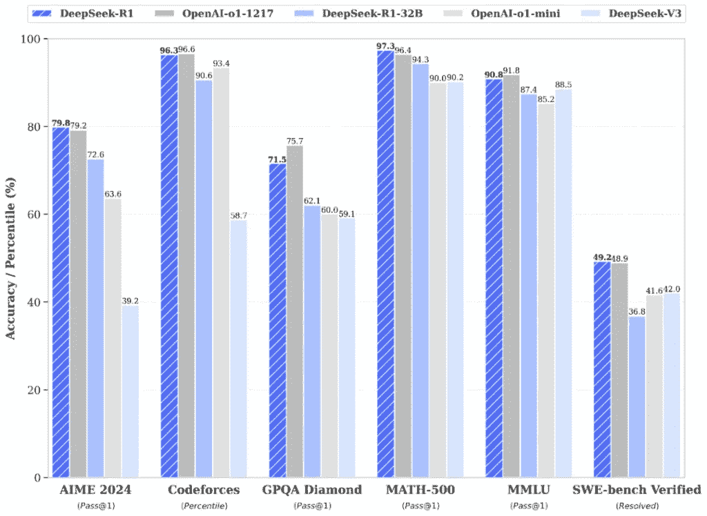
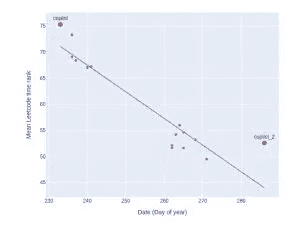
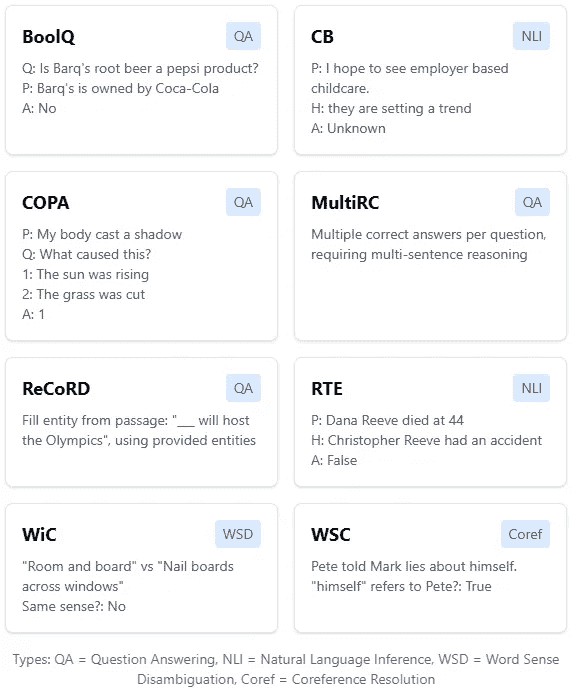
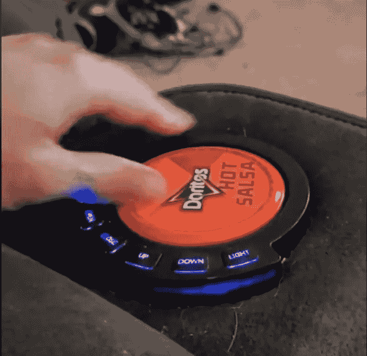
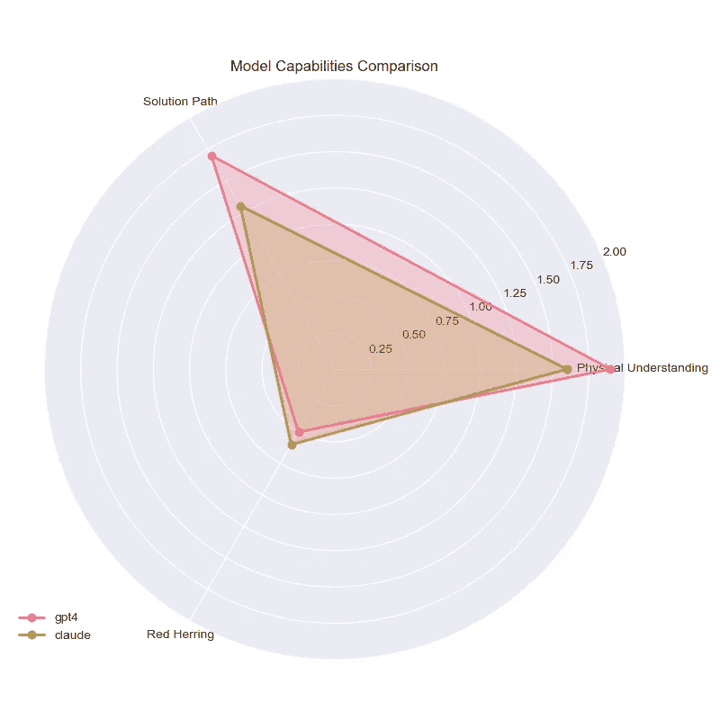

# 我尝试制作自己的（糟糕的）LLM 基准，在逃脱室中作弊

> 原文：[`towardsdatascience.com/i-tried-making-my-own-bad-llm-benchmark-to-cheat-in-escape-rooms/`](https://towardsdatascience.com/i-tried-making-my-own-bad-llm-benchmark-to-cheat-in-escape-rooms/)

最近，DeepSeek 宣布了他们的最新模型 R1，一篇又一篇的文章出来赞扬其性能与成本之比，以及这种开源模型的发布如何真正改变 LLM 的发展轨迹。这真的很令人兴奋！而且，内容太多，难以在一篇文章中写完……但是，当 DeepSeek 这样的模型突然出现，带着一把铁椅，吹嘘其性能与其他模型相当时，在这个背景下，“性能”究竟意味着什么？

如果你关注 AI 的发布，你之前已经见过这种舞蹈。每个新模型发布时都会展示其图表，表明它在数学问题上的表现如何同时优于 GPT-4，同时体积更小，效率更高。但这些基准究竟在衡量什么？它们是如何创建的？更重要的是，我们如何摆脱炒作，为特定的用例创建自己的基准？

我想了解更多关于**LLM 基准测试**的信息。

### 第一部分：什么是基准？（3 秒）

**TL;DR** — LLM 的（多个）SATs。

### 第 1.1 部分：什么是基准？（超过 3 秒）

在我们深入探讨具体基准的细节之前，让我们花一点时间来梳理一下我们所说的“LLM 基准”究竟是什么意思。因为称其为“AI 的 SATs”既感觉正确，又有点过于简化。

LLM 基准在本质上是一组**结构化测试**，用于衡量大型语言模型在特定任务上的表现。这些任务可以是任何东西，从判断一个陈述是真是假，到总结法律文件，到生成有效的 Python 函数。把它们想象成由 AI 研究人员特别设计的、旨在测试这些模型可能拥有的每一个相关肌肉的定制障碍赛。这些框架通常提供一组已知正确输出的输入数据集，允许在不同模型之间进行一致的比较。

现代基准采用各种评估方法。对于具有离散正确答案的任务，分类指标如**准确性**适用，而基于重叠的指标（BLEU、ROUGE）则用于评估自由形式的文本生成。一些基准使用功能测试进行代码生成，或者使用其他 LLM 作为评委来评估响应质量。

典型的基准通常打包如下：

+   **一个标准化的数据集** 包含问题、提示或任务（带有正确或参考答案）。

+   **一个评估协议** 用于指定如何衡量成功，例如准确性、F1 分数、文本生成的 BLEU/ROUGE 分数，或者编码任务的通过/失败率。

+   **一个排行榜** 或某种形式的比较排行榜，通常带有大而闪亮的图表。

一些非常著名的基准测试包括用于测试多任务语言理解的**MMLU**，用于评估事实准确性的**TruthfulQA**，以及用于衡量编码能力的**HumanEval**。结果通常会在公共排行榜上发布，这让人们能够在不同模型之间进行一些透明的比较。



来自 DeepSeek 论文：DeepSeek-R1：通过强化学习激励 LLM 的推理能力

### 什么是一个好的基准测试？

1.  **明确的任务定义**：我们希望任务是明确的。挑战越直接、越具体，结果就越容易让人信任。

1.  **数据完整性**：测试集不应该在训练数据中漂浮。因为如果模型之前已经 50 次见过完全相同的问题，那么评估几乎和给一个已经有了答案的人做数学测验一样有用。

1.  **可量化指标**：你需要一个标准来评分性能——比如模型代码通过测试用例的次数或生成的摘要与“真实”摘要的接近程度。

1.  **任务多样性与难度**：如果一个基准测试过于简单，每个人第一天就能轻松通过，那么我们学到的……嗯，什么都没有。如果它过于狭窄（比如“我们只测试模型在 20 分钟内计算π的位数的能力”），那也不太有帮助。

### 生活并非全是关于成绩

基准测试只能捕捉到 LLM 能力的一小部分。在现实世界中，你的聊天机器人可能需要处理领域知识，跟踪对话上下文，遵守公司的政策，*并且*产生流畅、无冒犯性的回复。没有单一的标准化测试能够完全涵盖这一点。正如我们将在接下来的案例研究中看到的那样，基准测试的设计和*执行*会极大地影响你对模型性能的看法……如果你不仔细考虑如何衡量成功，有时甚至会误导你。

现在我们已经对 LLM 基准测试旨在实现的目标（以及它们可能存在的不足）有了概念，让我们探索一些例子，看看人们在实际中是如何构建和使用它们的——结果好坏参半！

### 案例研究 #1：Leetcode 作为 LLM 基准测试

作为科技领域的学生，在我寻找酷炫基准测试的过程中，“Leetcode”这个词的出现让我的血压显著上升。与令人不快的 Leetcode 不同，论文“LLM 在 Leetcode 上生成代码的性能研究”非常有趣——它提出了一个看似简单的问题：我们能否用 Leetcode 来基准测试 LLM 代码生成？他们的发现揭示了这种方法的潜力和陷阱。

### 基准测试的设计

研究人员建立了一个三阶段的验证系统。本地测试捕捉基本错误，Leetcode 的评判员验证正确性，而自定义的基准测试设置测量性能。这个设置揭示了一个关键点：基准测试代码性能比看起来要难。

当他们将本地测量与 LeetCode 的指标进行比较时，他们发现只有 0.28 的相关性。LeetCode 的测量显示了更高的变化（0.089 与本地 0.035 相比）。更糟糕的是，LeetCode 的排名证明是不稳定的——相同的解决方案仅基于提交时间，就可能从第 77 百分位下降到第 54 百分位。



“在 LeetCode 上对 LLM 生成的代码的性能研究”，在 2024 年第 28 届国际软件工程评估和评估会议（EASE 2024）上提出，地点：意大利萨勒诺（2024）

### 真实问题

出现了三个主要问题，挑战了 LeetCode 作为基准的可行性：

**数据污染：** 使用公开问题存在 LLM 在训练期间看到解决方案的风险。研究人员不得不仅使用 2023 年的问题来减轻这一点。

**平台不稳定：** LeetCode 的指标随时间漂移——内存测量显示与测试日期的相关性为-0.24。这使得可重复的基准测试几乎不可能。

**测量可靠性：** 本地测量与平台测量之间的弱相关性引发了我们实际测试内容的疑问。

### 这对 LLM 基准测试意味着什么

这项研究不仅批评了 LeetCode，还突出了我们在代码生成基准测试中需要的东西：可重复的测量、可靠的性能指标和保证的训练-测试分离。在我们有专门为此目的构建的平台之前，我们需要在使用竞赛平台作为基准时非常谨慎。

**所以！** 我们知道并非所有基准都是可行的基准——那么一个更主流的基准如何？

### 案例研究 #2：SuperGLUE——构建更好的语言理解基准

SuperGLUE 论文探讨了人工智能基准测试中的一个有趣问题：当模型在测试中表现得过于出色时，你该怎么办？当 GLUE 变得不足（模型超越人类表现）时，研究人员不得不重新思考我们如何衡量语言理解。

### 基准设计

SuperGLUE 的核心创新是其任务选择方法。研究人员从 NLP 社区收集了任务提案，并通过了一个严格的过程：每个任务都需要清晰的评估指标、公开的训练数据，并且——最重要的是——机器与人类性能之间有显著的差距。

这导致了八个任务（我在这里简化了文档中的表格，它有点不太易读，但你应该能感受到问题的要求）：



SuperGLUE：一个更适合通用语言理解系统的粘性基准，在 2019 年加拿大温哥华第 33 届神经信息处理系统会议（NeurIPS 2019）上提出（2019）

这些任务之所以特别，是因为它们在格式上的多样性。与 GLUE 专注于句子分类不同，SuperGLUE 包括指代消解、阅读理解以及更复杂的推理任务。每个任务衡量语言理解的各个方面，同时保持清晰、可量化的指标。

* * *

### 第二部分：让我们构建一个物理推理基准：在逃脱房间中作弊

在查看了一些基准测试，如 SuperGLUE 和 Leetcode 之后，我有一个想法：如果我们通过逃脱房间谜题测试大型语言模型在完全不同的事情上——物理推理……会怎么样？ 

这是一个相当合理的想法——逃脱房间提供了失败的可能性和后果——如果解错太多谜题，你的朋友们会认为你很笨，把你降级为观众。幸运的是，然而，他们（或者那些可怜的员工）不知道你可以把手机偷偷带进逃脱房间——而且你知道该找谁要答案。今天，大型语言模型将面对实体逃脱房间的谜题。

**注意：** 这**不是**一个严格的学术基准（请不要在论文中引用这个，你为什么要这样做呢？），甚至离它很远，它只是用来测试大型语言模型基准测试和评估的一种有趣方式。请不要破坏我的提示，我知道它们很糟糕。

### 为什么是物理推理？

真的……大多数大型语言模型基准测试都集中在语言任务（如 SuperGLUE）或代码生成（如 Leetcode）上。而且有很好的理由——这些是定义明确的领域，有明确的评估指标。但现实世界的问题解决往往需要理解物理原理及其相互作用。著名的“GPT-4 能做物理吗？”辩论通常集中在数学问题解决上，而不是实际的物理推理上。

观察现有的基准测试让我学到了几个关键原则：

1.  **清晰的评估**指标至关重要（来自 SuperGLUE 的任务特定分数）

1.  **问题**应该有明确的解决方案（来自 HumanEval 的测试案例）

1.  基准测试应该测试**独特的功能**（来自 MMLU 的主题类别）

### 设计问题

我选择逃脱房间谜题有两个原因。首先，它们自然地将物理推理与明确的目标结合起来。其次，它们有明确的成功条件——要么你通过预期的方式解决它，要么你就不行。第三，也是最重要的，它们让我可以包括“误导信息”——无关紧要的物品，用来测试大型语言模型是否能够识别物理上的重要信息。第四，我真的很喜欢玩逃脱房间（我之前提到过吗？）

我知道这不止两个原因，但如果大型语言模型不能数出草莓中有多少个“rs”，我也允许自己偶尔犯点错误。

这是我如何构建五个核心问题的结构：

**流体动力学（FLUID_001）（乒乓球卡在管子里）**

+   测试对浮力和流体置换的理解

+   受经典物理问题启发，但在实际情境中

+   包括故意无关紧要的物品（如柔软的食物模型）

**光特性（UV_001）（紫外线在推数字锁上**）

+   测试对 UV 荧光和材料特性的理解

+   结合多个物理原理（光、材料科学）

+   需要理解环境条件

**机械理解（CIPHER_001）（一个密码环**）

+   测试空间推理和机械对齐

+   没有误导——测试将旋钮与密码轮相关联

+   需要理解旋转对称性

**力应用（VAC_001）（可能会卡在孔中**）

+   测试对真空力和表面粘附的理解

+   多种可能的解决方案方法

+   需要理解力的倍增

**协同物理（COLLAB_001）（两个人能否滑动钥匙？**）

+   测试在多智能体场景中对物理约束的理解

+   需要结合多个物理原理

+   测试对工具创建和摩擦的理解

听起来真的很复杂……但这只是些基本的物理谜题。你可以在我的 GitHub 上找到它们。

### 技术部分

基准实现有三个主要组件：

### 问题定义层

问题以结构化的 JSON 格式定义，强制执行一致的评估：

```py
{
    "problem_id": "FLUID_001",
    "setup": {
        "scenario": "A ping pong ball is at the bottom of a narrow tube...",
        "available_items": ["bottle of water", "squishy food models"...],
        "constraints": ["tube too narrow for manual retrieval"]
    },
    "physical_principles": ["buoyancy", "fluid displacement"],
    "red_herrings": ["squishy food models", "milk carton"],
    "solution": {
        "steps": ["pour water into tube", "allow ball to float"],
        "key_insights": ["water displaces air", "ping pong ball less dense"]
    }
} 
```

这种结构借鉴了 SuperGLUE 的设计——每个组件都清晰分离且机器可读。`physical_principles`字段明确列出正在测试的内容，而`red_herrings`有助于评估 LLM 忽略无关信息的能力。

### 2. 评估框架

评估系统使用 Python 的 asyncio 进行并发测试，并带有重试逻辑以提高 API 的稳定性：

```py
@retry(stop=stop_after_attempt(3), wait=wait_exponential(min=1, max=10))
async def evaluate_response(self, criteria: JudgingCriteria) -> Dict:
    """Evaluate a model's response using GPT-4 as judge."""
    async with aiohttp.ClientSession() as session:
        # ... evaluation logic
```

评分系统考虑三个组成部分：

**物理理解得分（PUS）** ∈ [0,2]

+   衡量对相关物理原理的理解

+   计算为展示原理的归一化总和

**解决方案路径得分（SPS）** ∈ [0,2]

+   评估解决方案步骤的完整性和正确性

+   考虑所提解决方案的实用性

**误导处理（RHH）** ∈ {0,1}

+   避免无关项的二进制得分

+   测试专注于物理相关因素的能力

是的，还有许多其他评分方法，有优有劣，都可以使用！例如，RHH 可能是关于在解决方案中使用了多少无关项，或者它可能是对使用可行性的衡量……关键是选择这些指标往往是相当随意的，但对于使你的基准可信非常重要，而我的基准则非常不可信。

此外，我之后也不想重写任何代码。请谅解。

### 3. 模型接口层

基准通过通用接口支持多个 LLM 后端：

```py
class ModelInterface:
    """Interface for different LLM APIs."""
    async def generate_response(self, prompt: str) -> str:
        raise NotImplementedError 
```

```py
class GPT4Interface(ModelInterface):
    async def generate_response(self, prompt: str) -> str:
        # GPT-4 specific implementation
class ClaudeInterface(ModelInterface):
    async def generate_response(self, prompt: str) -> str:
        # Claude specific implementation
```

*两个模型……我真的负担不起更多了，请理解*。

### 让我们来测试它！

在对 API 余额进行了一些补充之后，我准备出发了。我运行了基准测试，在完全浪费了 5 次不同的错误之后，结果出来了。结果……很有趣！我使用了 GPT4 和 Claude 3.5 Haiku（我清楚这些模型规格并不相同）作为我们的受害者。

**挑战**：一个罐子卡在一个几乎与其体积完全匹配的孔中。罐子底部写有需要检索的组合。



灵感

```py
"VAC_001": {
        "problem_id": "VAC_001",
        "setup": {
            "available_items": [
                "ruler",
                "notebook",
                "suction cup",
                "UV light"
            ],
            "constraints": [
                "can fits too tightly for finger grip",
                "hole is same diameter as can",
                "can is clean and dry"
            ]
        },
        "physical_principles": [
            "vacuum suction",
            "surface adhesion",
            "force multiplication"
        ],
        "red_herrings": [
            "ruler",
            "notebook",
            "UV light"
        ],
        "solution": {
            "steps": [
                "inspect suction cup and can surface",
                "ensure can surface is clean",
                "firmly press suction cup onto can top",
                "create vacuum seal",
                "pull can out using suction cup"
            ],
            "key_insights": [
                "suction cup creates vacuum seal",
                "vacuum force allows extraction",
                "other items don't provide necessary force"
            ]
        } 
```

### GPT-4 的解决方案

> **物理原理**：这个解决方案中涉及的主要物理原理是气压差的概念，这是吸盘能够粘附到表面上的相同原理。吸盘的一侧（外部）的气压比另一侧（内部）高，这种气压差异导致吸盘粘附到表面上。
> 
> **解决方案步骤**：
> 
> 1.  将吸盘附着在罐子顶部。罐子的平面应提供良好的接触面，以便吸盘粘附。
> 1.  
> 1.  一旦吸盘牢固地附着在物体上，请轻轻向上拉。气压差应该会导致吸盘（以及罐子）从孔中升起。
> 1.  
> 1.  一旦罐子从孔中取出，请从罐子顶部移除吸盘。
> 1.  
> 1.  使用紫外线灯照亮罐子底部写下的组合。一些墨水只有在紫外线灯下才能显现，这就是为什么这一步是必要的。
> 1.  
> 1.  在笔记本上写下组合，以确保不会忘记。
> 1.  
> **所需物品**：
> 
> +   吸盘：这是为了粘附到罐子上并将其从孔中拉出，因为罐子太紧，无法用手指抓住。
> +   
> +   紫外线灯：这是为了揭示罐子底部写下的组合，因为可能是在紫外线灯下才能显现的墨水。
> +   
> +   笔记本：这是为了记录一旦可见的组合，确保不会忘记。

完全不错！GPT-4 设法搞清楚了解决方案背后的物理原理（即使它非常冗长），并且逐步描述了如何解决问题。它最终使用了紫外线灯和笔记本，但这更多是我的问题，而不是因为提示中使用了不必要的物品而进行惩罚。此外，这些物品的用途似乎是相当合理的……所以为什么不呢！

### Haiku-3.5 的解决方案

> **物理原理**：在这个场景中涉及的物理原理包括体积的概念和利用吸力将罐子从孔中提取出来的方法。由于罐子几乎完全适合孔中，罐子可能因为紧密的配合以及罐子和孔之间没有空气间隙或空间而卡住。这种紧密的配合产生了一种类似真空的效果，使得难以抓住并拉出罐子。
> 
> **解决方案步骤**：
> 
> 1.  使用尺子测量罐子的直径。这将有助于确定孔的大小，并确认罐子紧密地位于其中。
> 1.  
> 1.  检查罐子的底部以定位其上写有的组合。使用紫外线灯照亮罐子的底部，使组合可见，如果它还没有清晰可见的话。
> 1.  
> 1.  将吸盘固定在罐子的顶部。吸盘将在罐子表面创建一个临时密封，使您可以握住并从洞中拉出罐子。
> 1.  
> 1.  使用吸盘轻轻向上拉罐子。吸力应该足够强大，以克服类似真空的效果并从洞中取出罐子。
> 1.  
> 1.  一旦罐子取出，将罐子底部写有的组合记录在笔记本上。
> 1.  
> **所需物品：**
> 
> +   尺子：用于测量罐子的直径并确认罐子是否紧密地嵌入洞中。
> +   
> +   紫外线灯：用于照亮罐子的底部，使组合可见，如果它还没有清晰可见的话。
> +   
> +   吸盘：用于在罐子表面创建临时密封并提供必要的握力以从洞中拉出罐子。
> +   
> +   笔记本：用于记录罐子底部写有的组合。

另一方面，Haiku 的解决方案……无疑是史上最佳解决方案。

首先，它想用尺子测量罐子的直径？？？为了确定洞的大小并确认罐子是否紧密地嵌入其中？我们为什么要这么做？我们还需要尺子吗？

其次，它告诉我们检查罐子的底部以定位组合，而整个问题实际上是无法传统地拉出罐子。这可能只是顺序问题，但现在我真正理解了当我对他们众多问题说“就修一下，伙计”时，我的朋友们为什么会感到沮丧。

但最终它确实找到了解决方案。所以……还不是最糟糕的。

这里有一张结果的高级雷达图！



我们看到，这两个模型在能力上相当相似，GPT-4 在物理理解和解决方案路径上略胜一筹，而 Haiku 在处理误导信息方面略胜一筹。不过，总的来说，这两个模型都相当糟糕。真糟糕。

也只有……5 个问题。

如果你想看到问题的全部范围，它们在我的[GitHub](https://github.com/xPuffball/PhysicalReasoningBench)上。

### LLM-as-a-Judge

顺便说一下，我用来生成评估的方法，即 LLM-as-a-judge，在 AI 社区中获得了显著的关注，尤其是在 Zheng 等人 2023 年论文“Judging LLM-as-a-Judge”的工作之后。这项技术已被证明非常有效，在从代码评估到对话质量评估的任务中，与人类评估者的一致性超过 80%！

这就是我的实验变得有点酷的地方（或许，也许，主观上）——我使用了这种方法，并让 GPT-4 评判其他 LLM 的物理推理能力。是的，我正在用 AI 评判其他 AI。

这为什么有效？好吧，评判一个回答实际上比生成一个回答简单。当 GPT-4 生成一个物理谜题的解决方案时，它需要：

+   理解涉及的物理原理

+   制定一系列步骤

+   考虑所有约束

+   生成一个连贯的解释

但在评判时，只需检查现有解决方案是否满足特定标准。评估提示非常专注：

```py
def _create_evaluation_prompt(self, criteria: JudgingCriteria) -> str:
    return f"""You are an expert judge evaluating an LLM's understanding of physical reasoning puzzles.
```

```py
Evaluate based on three criteria:
2\. Physical Understanding Score (0-2): Does the solution correctly apply relevant physical principles?
3\. Solution Path Score (0-2): Are the steps complete and feasible?
4\. Red Herring Handling (0-1): Does it avoid using irrelevant items?
Scenario: {criteria.scenario}
Physical Principles Required: {criteria.correct_principles}
Solution Given: {criteria.model_response}
""" 
```

为了验证这种方法，我遵循了 Zheng 等人提出的验证框架，对 GPT-4 的评估与我的判断进行了抽查。令人惊讶的是（或者也许在更广泛的研究 LLM 评估的背景下并不令人惊讶），它在识别正确的物理理解和有缺陷的推理方面非常一致。

这完美吗？绝对不是。使用一个 LLM 来评估另一个 LLM 在哲学上有些奇怪。但在实践中，它可以出奇地好——就像我在 Masterchef 上抱怨一道菜的视觉呈现，同时在我的厨房里试图用微波炉加热热狗，结果却把厨房烧了起来。

### 我学到的东西

构建这个基准让我对基准设计有了几点认识：

**清晰的指标很重要**：即使是像物理推理这样的复杂任务，也需要明确的评分标准。

**误导性信息很强大**：包括无关项可以揭示 LLM 的推理过程很多信息。

**上下文控制很难**：确保 LLM 不“虚构”额外的物理上下文具有挑战性。

这是一个完美的基准吗？差得远呢。请不要再提这件事。它是科学严谨的吗？绝对不是。但它已经是一个对 LLM 能力方面的有趣探索，有时候我们所能学到的最好的东西可能只是尝试做一些事情并看看会发生什么。

现在，如果你们能原谅我，我将在下一个逃脱室里偷偷带一部有网络的手机，原因是我没有法律动机公开。

[1] L. Zheng, W.-L. Chiang, Y. Sheng, S. Zhuang, Z. Wu, Y. Zhuang, Z. Lin, Z. Li, D. Li, E. P. Xing, H. Zhang, J. E. Gonzalez, I. Stoica, “使用 MT-Bench 和 Chatbot Arena 判断 LLM-as-a-Judge，”第 37 届神经信息处理系统会议（NeurIPS 2023），数据集和基准跟踪（2023）

[2] T. Coignion, C. Quinton, R. Rouvoy, “在 Leetcode 上 LLM 生成代码的性能研究，”第 28 届国际软件工程评估和评估会议（EASE 2024），意大利萨勒诺（2024）

[3] A. Wang, Y. Pruksachatkun, N. Nangia, A. Singh, J. Michael, F. Hill, O. Levy, S. R. Bowman, “SuperGLUE：通用语言理解系统的更粘性基准，”第 33 届神经信息处理系统会议（NeurIPS 2019），加拿大温哥华（2019）

[5] DeepSeek-AI, D. Guo, D. Yang, H. Zhang, J. Song, R. Zhang, R. Xu, Q. Zhu, S. Ma, P. Wang, X. Bi, X. Zhang, X. Yu, Y. Wu, Z.F. Wu, Z. Gou, Z. Shao, Z. Li, Z. Gao 等人，“通过强化学习激励 LLM 中的推理能力，”arXiv 预印本 arXiv:2501.12948（2025）

[6] 除非另有说明，所有图像均由作者创建。
