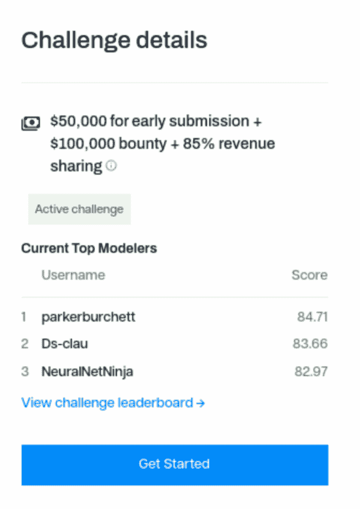
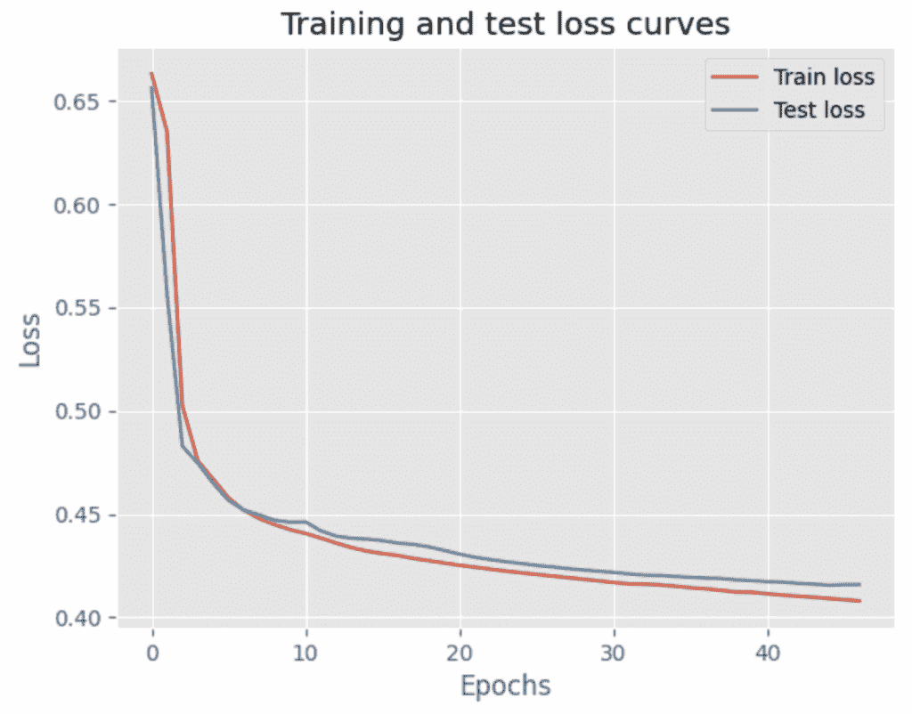

# 我在机器学习竞赛中赢得了 1 万美元——这是我的完整策略

> 原文：[`towardsdatascience.com/i-won-10000-in-a-machine-learning-competition-heres-my-complete-strategy/`](https://towardsdatascience.com/i-won-10000-in-a-machine-learning-competition-heres-my-complete-strategy/)

<mdspan datatext="el1749865496588" class="mdspan-comment">去年，我在我的第一个机器学习竞赛中赢得了 1 万美元</mdspan>，老实说，我仍然有点震惊。

我在金融科技领域担任数据科学家已有六年。当我看到 Spectral Finance 正在举办一个针对 Web3 钱包的信用评分挑战时，我决定尝试，尽管我没有任何区块链经验。

我的局限性如下：

+   我使用的是没有 GPU 的电脑

+   我只有周末（大约 10 小时）的时间来工作

+   我之前从未接触过 web3 或区块链数据

+   我从未为信用评分构建过神经网络

竞赛目标是直接的：预测哪些 Web3 钱包可能会根据其交易历史违约。本质上，这是传统的信用评分，但使用的是 DeFi 数据而不是银行对账单。

令我惊讶的是，我获得了第二名，并以美元硬币的形式赢得了 1 万美元！不幸的是，Spectral Finance 已经关闭了竞赛网站和排行榜，但以下是我在获胜时的截图：

我的用户名是 Ds-clau，以 83.66 的分数获得第二名（图片由作者提供）

这次经历让我明白，理解业务问题真的很重要。在这篇文章中，我将详细解释我是如何做到的，并提供 Python 代码片段，以便您可以复制这种方法用于您下一个机器学习项目或竞赛。

## 入门：您不需要昂贵的硬件

让我明确一点，**您不一定需要昂贵的云计算设置来赢得机器学习竞赛**（除非数据集太大而无法本地运行）。

本竞赛的数据集包含 77 个特征和 443k 行数据，这绝对不是一个小数目。数据以`.parquet`文件的形式提供，我使用 duckdb 下载了它。

我使用的是我的个人笔记本电脑，一台 16GB RAM 的 MacBook Pro，没有 GPU。整个数据集可以本地运行在我的笔记本电脑上，尽管我必须承认训练过程有点慢。

**见解**：巧妙的采样技术可以在不产生高计算成本的情况下获得 90%的见解。许多人被大数据集吓倒，认为他们需要大型的云实例。您可以通过采样数据集的一部分并首先检查样本来在本地启动一个项目。

## EDA：了解您的数据

正是在这里，我的金融科技背景成为了我的超级力量，我像处理任何其他信用风险问题一样处理这个问题。

信用评分的第一个问题：**类别分布是什么？**

看到 62/38 的分割让我不寒而栗…从业务角度来看，38%的违约率非常高，但幸运的是，竞赛并不是关于定价这个产品。

接下来，我想看看哪些特征真正重要：

这是我感到兴奋的地方。模式正是我从信用数据中预期的：

+   `risk_factor` 是最强的预测因子，与目标变量显示出 > 0.4 的相关性（风险较高的行为者 = 更有可能违约）

+   `time_since_last_liquidated` 显示出强烈的负相关性，因此他们最近清算的时间越近，风险就越高。这与预期相符，因为高速度通常是一个高风险信号（最近的清算 = 风险）

+   `liquidation_count_sum_eth` 表明，在 ETH 中有更高清算次数的借款人是有风险的标志（清算次数越多 = 风险行为越严重）

**见解**：查看皮尔逊相关系数是理解特征与目标变量之间线性关系的一种简单而直观的方法。这是了解哪些特征应该包含在最终模型中，哪些不应该包含的绝佳方式。

## 特征选择：少即是多

当我向他们解释这一点时，以下是一些总是让高管感到困惑的事情：

> 更多的特征并不总是意味着更好的性能。

事实上，过多的特征通常意味着性能更差，训练速度更慢，因为额外的特征增加了噪声。每个无关的特征都会使你的模型在寻找真实模式时稍微差一点。

因此，特征选择是一个至关重要的步骤，我从不跳过。我使用了递归特征消除来找到最佳的特征数量。让我带你详细了解我的具体过程：

最佳点在 **34 个特征**。在此之后，以 AUC 分数衡量的模型性能并没有随着额外特征的添加而提高。因此，我最终使用了给定特征中不到一半的特征来训练我的模型，从 77 个特征减少到 34 个。

**见解**：这种特征减少消除了噪声，同时保留了重要特征的信息，从而使得模型既易于训练，又具有更高的预测性。

## 构建神经网络：简单而强大的架构

在定义模型架构之前，我必须正确地定义数据集：

1.  **将数据集分为训练集和验证集**（用于在模型训练后验证结果）

1.  **缩放特征**，因为神经网络对异常值非常敏感

1.  **将数据集转换为 PyTorch 张量**以提高计算效率

这是我的确切数据预处理流程：

现在是时候进入有趣的部分了：构建实际的神经网络模型。

> *重要背景*：Spectral Finance（比赛组织者）由于他们的零知识证明系统，将模型部署限制为仅神经网络和逻辑回归。
> 
> ZK 证明需要能够加密验证计算而不泄露底层数据的数学电路，而神经网络和逻辑回归可以有效地转换为 ZK 电路。

由于这是我第一次为信用评分构建神经网络，我想保持简单但有效。这是我的模型架构：

让我们详细地了解我的架构选择：

+   **5 个隐藏层：**足够深以捕捉复杂模式，足够浅以避免过拟合

+   **每层 64 个神经元：**在容量和计算效率之间取得良好的平衡

+   **ReLU 激活：**隐藏层的标准选择，防止梯度消失

+   **Dropout (0.2)：**通过在训练过程中随机将 20%的神经元置零来防止过拟合

+   **Sigmoid 输出：**非常适合二元分类，输出介于 0 和 1 之间的概率

## 训练模型：魔法发生的地方

现在是启动模型学习过程的训练循环：

这里有一些关于模型训练过程的细节：

+   **早期停止：**当验证性能停止提高时停止，以防止过拟合

+   **SGD with momentum：**简单但有效的优化器选择

+   **验证跟踪：**对于监控真实性能，而不仅仅是训练损失至关重要

训练曲线显示了在训练过程中没有过拟合的稳步改进。这正是我想看到的。

模型训练损失曲线（图片由作者提供）

## 秘密武器：阈值优化

这是我可能在比赛中优于其他使用更复杂模型的人的地方：我打赌**大多数人提交了默认的 0.5 阈值预测**。

但由于类别不平衡（约 38%的贷款违约），我知道违约阈值将是不理想的。因此，我使用了精确度-召回率分析来选择更好的截止点。

我最终将 F1 分数最大化，这是精确度和召回率之间的调和平均数。基于最高 F1 分数的最优阈值是 0.35 而不是 0.5。这个单一的改变使我的竞赛分数提高了几个百分点，可能是排名和获胜之间的差距。

**洞见**：在现实世界中，不同类型的错误有不同的成本。错过一次违约会让你损失金钱，而拒绝一个良好的客户只会让你失去潜在利润。阈值应该反映这一现实，而不应该随意设定为 0.5。

## 结论

这场比赛加强了我已经知道一段时间的事情：

> 机器学习成功不在于拥有最花哨的工具或最复杂的算法。

这关乎理解你的问题，应用扎实的基础，并专注于真正推动指针移动的因素。

你不需要博士学位就可以成为数据科学家或赢得机器学习竞赛。

你不需要实现最新的研究论文。

你也不需要昂贵的云资源。

你真正需要的是领域知识，扎实的基础，注意那些别人可能忽视的细节（比如阈值优化）。

* * *

## 想要建立你的 AI 技能？

👉🏻 我运营着[AI Weekender](http://aiweekender.substack.com/)，它特色是有趣的周末 AI 项目以及快速、实用的技巧，帮助你用 AI 构建。
