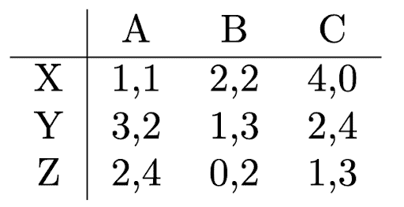
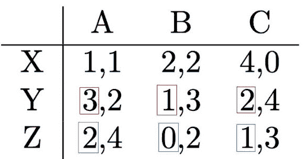
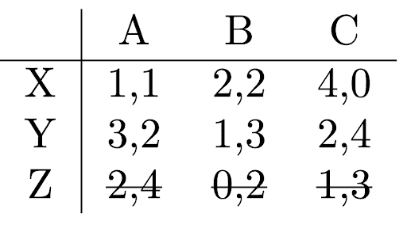
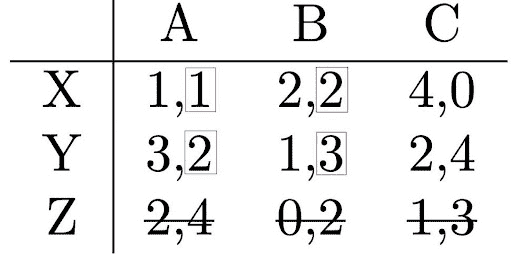
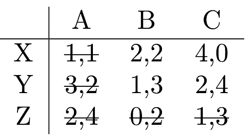
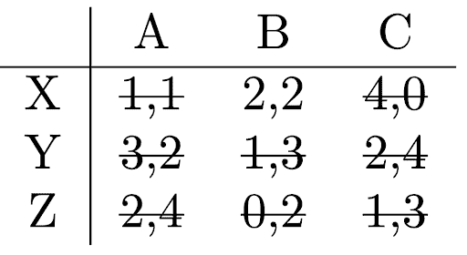
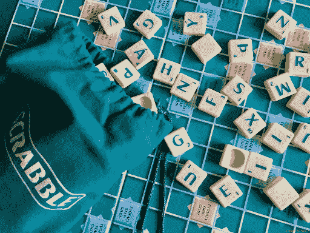
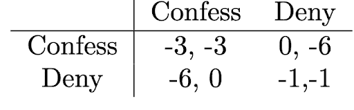
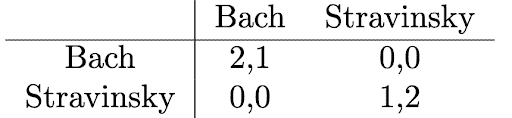
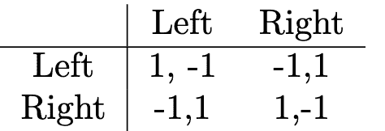

# 我不会改变，除非你改变

> 原文：[`towardsdatascience.com/i-wont-change-unless-you-do/`](https://towardsdatascience.com/i-wont-change-unless-you-do/)

在博弈论中，如果仍然可能有一个更好的决策选项，玩家们如何才能结束游戏呢？也许某个玩家仍然想要改变他们的决定。但如果他们这样做，也许另一个玩家也想改变。他们如何才能从这种恶性循环中逃脱呢？为了解决这个问题，本文将解释的纳什均衡概念，是博弈论中的基本概念。

这篇文章是关于博弈论的四章系列中的第二部分。如果你还没有看过[第一章](https://towardsdatascience.com/talking-about-games/)，我鼓励你去看一看，以便熟悉博弈论的主要术语和概念。如果你已经这样做了，你就为我们的博弈论之旅的下一步做好了准备。让我们出发吧！

### **寻找解决方案**

在博弈论中找到一个游戏的解决方案有时可能很棘手。图片由[Mel Poole](https://unsplash.com/@melpoole?utm_source=medium&utm_medium=referral)在[Unsplash](https://unsplash.com?utm_source=medium&utm_medium=referral)提供。

我们现在将尝试为博弈论中的游戏找到一个解决方案。**解决方案**是一组行动，其中每个玩家**最大化他们的效用**，因此表现出理性。这并不一定意味着每个玩家都能赢得游戏，但他们在不知道其他玩家会做什么的情况下，会尽力而为。让我们考虑以下游戏：

如果你对这个矩阵表示法不熟悉，你可能需要回顾第一章并刷新你的记忆。你还记得这个矩阵给出了每个玩家在特定行动对下的奖励吗？例如，如果玩家 1 选择行动 Y，玩家 2 选择行动 B，玩家 1 将获得 1 的奖励，玩家 2 将获得 3 的奖励。

好的，玩家们现在应该决定哪些行动？玩家 1 不知道玩家 2 会做什么，但他们仍然可以尝试找出根据玩家 2 的选择，什么行动会是最好的。如果我们比较行动 Y 和 Z 的效用（如图中蓝色和红色方框所示），我们会注意到一些有趣的事情：如果玩家 2 选择行动 A（矩阵的第一列），玩家 1 将获得 3 的奖励，如果他们选择行动 Y，将获得 2 的奖励，如果他们选择行动 Z，将获得 1 的奖励，所以在这种情况下行动 Y 更好。但如果玩家 2 决定选择行动 B（第二列）呢？在这种情况下，行动 Y 将获得 1 的奖励，而行动 Z 将获得 0 的奖励，所以 Y 又比 Z 好了。如果玩家 2 选择行动 C（第三列），Y 仍然比 Z 好（奖励为 2 比 1）。这意味着，玩家 1 永远不应该使用行动 Z，因为行动 Y 总是更好的。

我们比较玩家 1 在行动 Y 和 Z 上的奖励。

考虑上述因素，玩家 2 可以预期玩家 1 永远不会使用行动 Z，因此玩家 2 不必关心属于行动 Z 的奖励。这使得游戏规模大大缩小，因为现在玩家 1 只剩下两个选项，这也帮助玩家 2 决定他们的行动。

我们发现，对于玩家 1 来说，Y 总是比 Z 好，所以我们不再考虑 Z。

如果我们看看截断后的游戏，我们会看到，对于玩家 2 来说，选项 B 总是比行动 A 好。如果玩家 1 选择 X，行动 B（奖励为 2）比选项 A（奖励为 1）好，如果玩家 1 选择行动 Y，情况也是如此。请注意，如果行动 Z 仍在游戏中，情况可能不是这样。然而，我们已经看到玩家 1 永远不会玩行动 Z。

我们比较玩家 2 在行动 A 和 B 上的奖励。

作为结果，玩家 2 永远不会使用行动 A。现在如果玩家 1 预期玩家 2 永远不会使用行动 A，游戏再次变小，需要考虑的选项更少。

我们看到，对于玩家 2 来说，行动 B 总是比行动 A 好，所以我们不再考虑 A。

我们可以继续以类似的方式轻松地进行，并看到对于玩家 1 来说，X 现在总是比 Y 好（2>1 和 4>2）。最后，如果玩家 1 选择行动 A，玩家 2 将选择行动 B，这比 C 好（2>0）。最终，只剩下行动 X（玩家 1）和 B（玩家 2）。这就是我们游戏的解决方案：

最后，只剩下一个选项，即玩家 1 使用 X，玩家 2 使用 B。

对于玩家 1 选择行动 X 和玩家 2 选择行动 B 来说，这是合理的。请注意，我们得出这个结论并没有确切地*知道*其他玩家会做什么。我们只是预期某些行动永远不会被采取，因为它们总是比其他行动差。这些行动被称为**严格劣势**。例如，行动 Z 被行动 Y 严格劣势，因为 Y 总是比 Z 好。

### **最佳答案**

Scrabble 是那种寻找最佳答案可能需要花费很长时间的游戏。照片由[Freysteinn G. Jonsson](https://unsplash.com/@freys?utm_source=medium&utm_medium=referral)在[Unsplash](https://unsplash.com?utm_source=medium&utm_medium=referral)提供。

这样严格支配的行动并不总是存在，但有一个类似的概念对我们来说很重要，被称为**最佳答案**。假设我们知道其他玩家选择了哪个行动。在这种情况下，决定一个行动变得非常简单：我们只需选择具有最高奖励的行动。如果玩家 1 知道玩家 2 选择了选项 A，那么玩家 1 的最佳答案将是 Y，因为 Y 在该列中具有最高的奖励。你看到我们之前是如何总是寻找最佳答案的吗？对于其他玩家可能采取的每个可能的行动，我们都会寻找如果其他玩家采取该行动时的最佳答案。更正式地说，玩家 i 对其他所有玩家给定的一组行动的最佳答案是玩家 1 的行动，该行动在考虑其他玩家的行动后最大化了效用。也要注意，严格支配的行动永远不能是最佳答案。

让我们回到我们在第一章中介绍的游戏：囚徒困境。这里的最佳答案是什么？

囚徒困境

如果玩家 2 坦白或否认，玩家 1 应该如何决定？如果玩家 2 坦白，玩家 1 也应该坦白，因为-3 的奖励比-6 的奖励要好。那么，如果玩家 2 否认会发生什么呢？在这种情况下，坦白又更好，因为它会带来 0 的奖励，这比否认的-1 奖励要好。这意味着，对于玩家 1 来说，坦白是针对玩家 2 两种行动的最佳答案。玩家 1 根本不必担心其他玩家的行动，而应该总是坦白。由于游戏的对称性，这也适用于玩家 2。对他们来说，无论玩家 1 做什么，坦白也是最佳答案。

### **纳什均衡**

纳什均衡有点像解决博弈论问题的万能钥匙。当研究人员发现它时，他们非常高兴。图片由[rc.xyz NFT 画廊](https://unsplash.com/@moneyphotos?utm_source=medium&utm_medium=referral)在[Unsplash](https://unsplash.com?utm_source=medium&utm_medium=referral)提供

如果所有玩家都采取他们的最佳答案，我们就达到了一个被称为**纳什均衡**的游戏解决方案。这是博弈论中的一个关键概念，因为它具有一个重要的属性：在纳什均衡中，除非任何其他玩家改变行动，否则没有任何玩家有理由改变他们的行动。这意味着所有玩家在当前情况下都尽可能满意，并且他们不会改变，即使他们可以。考虑上面的囚徒困境：当双方都坦白时，达到纳什均衡。在这种情况下，没有玩家会在没有其他玩家改变行动的情况下改变自己的行动。如果**双方**都改变行动并决定否认，他们可能会变得更好，但由于他们无法沟通，他们不期望其他玩家有任何改变，因此他们也不会改变自己的行动。

你可能会想知道，对于每个游戏，是否总是存在一个单一的纳什均衡。让我告诉你，也可能存在多个均衡，就像我们在[第一章](https://towardsdatascience.com/talking-about-games/)中已经了解到的巴赫对斯特拉文斯基的游戏：

巴赫对斯特拉文斯基。

这个游戏有两个纳什均衡：(Bach, Bach)和(Stravinsky, Stravinsky)。在两种情况下，你可以很容易地想象，没有任何玩家有理由单独改变他们的行动。如果你和你的朋友坐在巴赫协奏曲中，你不会独自离开座位去听斯特拉文斯基的协奏曲，即使你更喜欢斯特拉文斯基而不是巴赫。同样，巴赫的粉丝也不会离开斯特拉文斯基的协奏曲，如果这意味着要独自留下他的朋友。在剩下的两种情况下，你会有不同的想法：如果你独自一人在斯特拉文斯基的协奏曲中，你会想出去和你的朋友一起加入巴赫的协奏曲。也就是说，即使另一个玩家没有改变他们的行动，你也会改变你的行动。这告诉你，你所处的场景**不是**纳什均衡。

然而，也可能存在没有任何纳什均衡的游戏。想象一下，你是一名足球守门员，正在执行点球。为了简化，我们假设你可以向左或向右跳跃。对方球队的足球运动员也可以选择左或右角射门，我们假设，如果你决定与他们相同的角，你将接住球；如果你决定选择相反的角，你将不会接住球。我们可以如下展示这个游戏：

点球比赛的博弈矩阵。

在这里，你找不到任何纳什均衡。每个场景都有一个明显的赢家（奖励 1）和一个明显的输家（奖励-1），因此玩家中总有人会想要改变。如果你向右跳跃并接住球，你的对手会希望改变到左角。但然后你又会想改变你的决定，这将使你的对手再次选择另一个角，如此循环。

### **总结**

我们学习了如何通过寻找平衡点来解决问题，即没有人再想改变。这就是纳什均衡。照片由[Eran Menashri](https://unsplash.com/@chesnutt?utm_source=medium&utm_medium=referral)在[Unsplash](https://unsplash.com?utm_source=medium&utm_medium=referral)提供。

本章展示了如何通过使用纳什均衡的概念来找到游戏的解决方案。让我们总结一下到目前为止我们已经学到的内容：

+   博弈论中游戏的解决方案最大化了每个玩家的效用或奖励。

+   如果存在另一个总是更好的行动，那么一个行动被称为**严格劣势**。在这种情况下，永远玩严格劣势的行动是不理性的。

+   在给定其他玩家采取的行动的情况下，产生最高奖励的行动被称为**最佳答案**。

+   **纳什均衡**是一个每个玩家都在玩他们最佳应对的状态。

+   在纳什均衡中，除非其他玩家改变他们的行动，否则没有任何玩家想要改变自己的行动。从这个意义上说，纳什均衡是最佳状态。

+   一些游戏有**多个**纳什均衡，而有些游戏则没有。

如果你因为有些游戏没有纳什均衡而感到沮丧，不要绝望！在[下一章](https://towardsdatascience.com/when-you-just-cant-decide-on-a-single-action/)中，我们将介绍行动的概率，这将使我们能够找到更多的均衡。敬请期待！

### **参考文献**

这里介绍的主题通常在博弈论的标准教科书中都有涉及。我主要使用了这本，尽管它是用德语写的：

+   巴特霍拉梅，F.，韦恩斯，M. (2016). 《博弈论：一本应用导向的教科书》。威斯巴登：斯普林格专业媒体威斯巴登。

英文中的一个替代选项可能是这个：

+   艾斯皮诺拉-阿雷东多，A.，穆尼奥斯-加西亚，F. (2023). 《博弈论：带步骤示例的入门》。斯普林格自然。

博弈论是一个相对较新的研究领域，其第一本主要教科书就是这本：

+   冯·诺伊曼，J.，莫根施特恩，O. (1944). 《博弈论与经济行为》。

*喜欢这篇文章吗？* [*关注我*](https://medium.com/@doriandrost) 以获取我的未来文章通知。
