# CPTR 论文解读：图像描述，Transformer 模式开启

> 原文：[`towardsdatascience.com/image-captioning-transformer-mode-on/`](https://towardsdatascience.com/image-captioning-transformer-mode-on/)

## 引言

在我之前的一篇文章中，我讨论了图像描述的早期深度学习方法之一。如果您感兴趣，可以在本文末尾找到该文章的链接。

今天，我想再次谈谈图像描述，但这次是关于更先进的神经网络架构。我将要讨论的深度学习是 2021 年 Liu 等人撰写的题为“*CPTR：图像描述的全 Transformer 网络*”的论文中提出的 [1]。具体来说，这里我将重现论文中提出的模型，并解释架构背后的理论。然而，请注意，我实际上不会演示训练过程，因为我只想关注模型架构。

### CPTR 的理念

实际上，CPTR 架构的主要思想与早期的图像描述模型完全相同，因为两者都使用编码器-解码器结构。在之前题为“*Show and Tell：一种神经图像描述生成器*”的论文 [2] 中，分别使用 GoogLeNet（又名 Inception V1）和 LSTM 作为两个组件。*Show and Tell* 论文中提出的模型示意图如下所示。

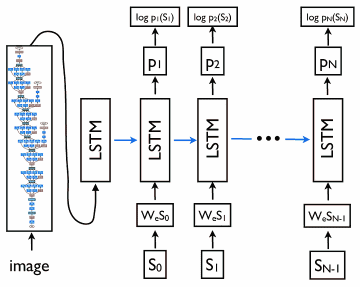

图 1. Show and Tell 论文中提出的图像描述神经网络架构 [2]。

尽管具有相同的编码器-解码器结构，但使 CPTR 与先前方法不同的地方在于编码器和解码器本身的基础。在 CPTR 中，我们将 ViT（视觉 Transformer）模型的编码器部分与原始 Transformer 模型的解码器部分结合起来。两个组件都使用基于 Transformer 的架构，这正是 CPTR 名称的由来：CaPtion TransformeR。

注意，本文的讨论将与 ViT 和 Transformer 高度相关，所以我强烈建议您阅读我之前关于这两个主题的文章，如果您还不熟悉它们。您可以在文章末尾找到链接。

图 2 显示了原始 ViT 架构的外观。绿色框内的一切都是将被采用作为 CPTR 编码器的架构编码器部分。

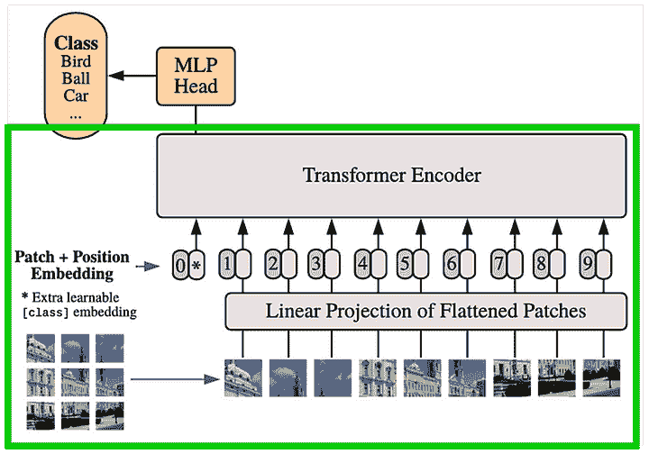

图 2. 视觉 Transformer (ViT) 架构 [3]。

接下来，图 3 显示了原始 Transformer 架构。蓝色框内的组件是我们将在 CPTR 解码器中实现的层。

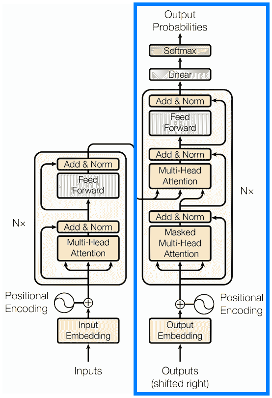

图 3. 原始 Transformer 架构 [4]。

如果我们将上面绿色和蓝色框内的组件组合起来，我们将得到下面图 4 所示的架构。这正是我们将要实现的 CPTR 模型的样子。这里的想法是，ViT 编码器（绿色）通过将输入图像编码成特定的张量表示来工作，然后这个表示将被用作 Transformer 解码器（蓝色）的基础，以生成相应的标题。

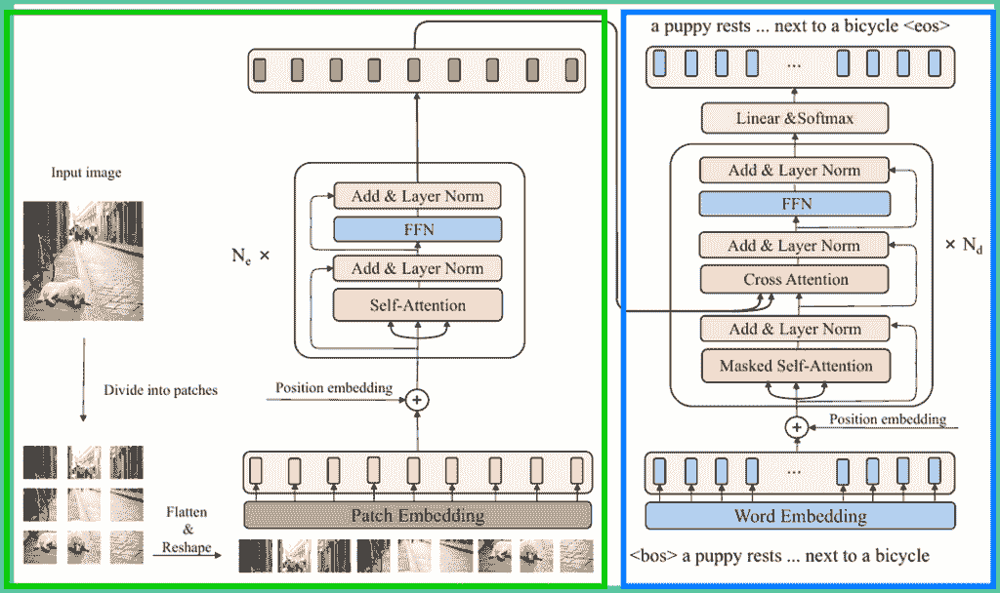

图 4. CPTR 架构[5]。

这基本上就是你现在需要知道的所有内容。随着我们逐步实现，我会解释更多关于细节的内容。

## 模块导入与参数配置

和往常一样，在代码中我们首先需要做的是导入所需的模块。在这个例子中，我们只导入了 torch 和 torch.nn，因为我们即将从头开始实现模型。

```py
# Codeblock 1
import torch
import torch.nn as nn
```

接下来，我们将在 Codeblock 2 中初始化一些参数。如果你阅读过我之前关于使用 GoogLeNet 和 LSTM 进行图像标题生成的文章，你会注意到这里，我们需要初始化更多的参数。在这篇文章中，我想要尽可能忠实地重现 CPTR 模型，因此将使用论文中提到的参数来实现。

```py
# Codeblock 2
BATCH_SIZE         = 1              #(1)

IMAGE_SIZE         = 384            #(2)
IN_CHANNELS        = 3              #(3)

SEQ_LENGTH         = 30             #(4)
VOCAB_SIZE         = 10000          #(5)

EMBED_DIM          = 768            #(6)
PATCH_SIZE         = 16             #(7)
NUM_PATCHES        = (IMAGE_SIZE//PATCH_SIZE) ** 2  #(8)
NUM_ENCODER_BLOCKS = 12             #(9)
NUM_DECODER_BLOCKS = 4              #(10)
NUM_HEADS          = 12             #(11)
HIDDEN_DIM         = EMBED_DIM * 4  #(12)
DROP_PROB          = 0.1            #(13)
```

我要解释的第一个参数是`BATCH_SIZE`，它位于标记为`#(1)`的行上。在这个案例中，这个变量的数值并不重要，因为我们实际上不会训练这个模型。这个参数被设置为 1，因为默认情况下，PyTorch 将输入张量视为一个样本批次。在这里，我假设批次中只有一个样本。

接下来，记住在图像标题生成的案例中，我们同时处理图像和文本。这本质上意味着我们需要为这两个设置参数。论文中提到，模型接受大小为 384×384 的 RGB 图像作为编码器的输入。因此，我们根据这个信息为`IMAGE_SIZE`和`IN_CHANNELS`变量赋值（`#(2)`和`#(3)`）。另一方面，论文没有提到标题的参数。所以，我假设标题的长度不超过 30 个单词（`#(4)`），词汇量估计为 10000 个独特的单词（`#(5)`）。

剩余的参数与模型配置相关。在这里，我们将`EMBED_DIM`变量设置为 768（`#(6)`）。在编码器一侧，这个数字表示代表每个 16×16 图像补丁的特征向量的长度（`#(7)`）。同样的概念也适用于解码器一侧，但在这个情况下，特征向量将代表标题中的一个单词。更具体地说，关于`PATCH_SIZE`参数，我们将使用这个值来计算输入图像中的补丁总数。由于图像的大小为 384×384，总共有 576 个补丁（`#(8)`）。

当涉及到使用编码器-解码器架构时，可以指定要使用的编码器和解码器块的数量。使用更多的块通常可以使模型在准确性方面表现更好，但作为回报，它将需要更多的计算能力。本文的作者决定堆叠 12 个编码器块（`#(9)`）和 4 个解码器块（`#(10)`）。接下来，由于 CPTR 是一个基于 transformer 的模型，有必要在编码器和解码器中的注意力块内指定注意力头的数量，在这种情况下，作者使用了 12 个注意力头（`#(11)`）。`HIDDEN_DIM`参数的值在论文中未提及。然而，根据 ViT 和 Transformer 论文，该参数被配置为是`EMBED_DIM`的 4 倍（`#(12)`）。论文中也没有提到 dropout 率。因此，我任意地将`DROP_PROB`设置为 0.1（`#(13)`）。

## 编码器

在模块和参数已经设置好的情况下，我们现在将进入网络的编码器部分。在本节中，我们将逐个实现和解释图 4 中绿色框内的每一个组件。

### 块嵌入

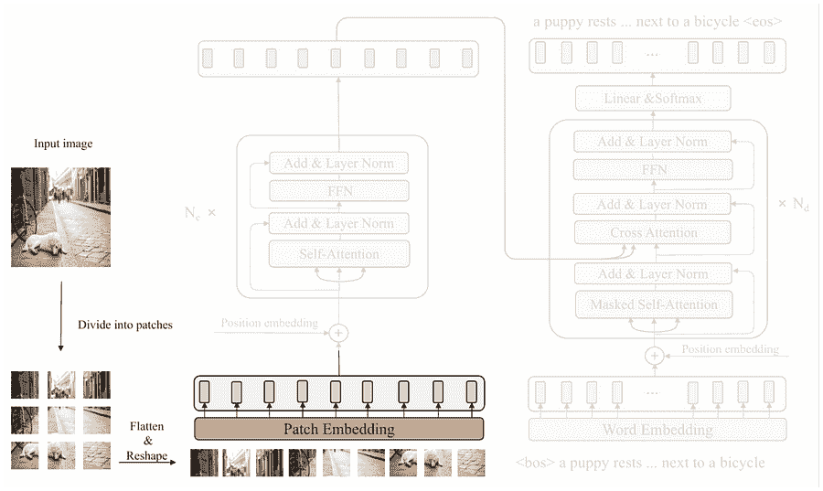

图 5. 将输入图像分割成块并将其转换为向量 [5]。

你可以在上面的图 5 中看到，首先要进行的步骤是将输入图像分割成块。这本质上是因为与关注局部模式如 CNN 不同，ViT 通过学习这些块之间的关系来捕捉全局上下文。我们可以使用下面的代码块 3 中显示的`Patcher`类来模拟这个过程。为了简化，我在同一个类中也包括了*块嵌入*块内的过程。

```py
# Codeblock 3
class Patcher(nn.Module):
   def __init__(self):
       super().__init__()

       #(1)
       self.unfold = nn.Unfold(kernel_size=PATCH_SIZE, stride=PATCH_SIZE)

       #(2)
       self.linear_projection = nn.Linear(in_features=IN_CHANNELS*PATCH_SIZE*PATCH_SIZE,
                                          out_features=EMBED_DIM)

   def forward(self, images):
       print(f'images\t\t: {images.size()}')
       images = self.unfold(images)  #(3)
       print(f'after unfold\t: {images.size()}')

       images = images.permute(0, 2, 1)  #(4)
       print(f'after permute\t: {images.size()}')

       features = self.linear_projection(images)  #(5)
       print(f'after lin proj\t: {features.size()}')

       return features
```

块分割本身是通过使用`nn.Unfold`层（`#(1)`）完成的。在这里，我们需要将`kernel_size`和`stride`参数都设置为`PATCH_SIZE (16)`，以确保生成的块之间不重叠。这个层在应用于输入图像后也会自动将这些块展平。同时，`nn.Linear layer`（`#(2)`）被用来执行线性投影，即*块嵌入*块所执行的过程。通过将`out_features`参数设置为`EMBED_DIM`，这个层将每个展平的块映射成一个长度为 768 的特征向量。

读取`forward()`方法后，整个过程应该会更加清晰。你可以在相同的代码块中看到，在行`#(3)`中，输入图像直接被 unfold 层处理。接下来，我们需要使用`permute()`方法（`#(4)`）处理生成的张量，在将其馈送到`linear_projection`层（`#(5)`）之前交换第一和第二轴。此外，我在每个层之后打印出张量的维度，以便你更好地理解每一步所做的转换。

为了检查我们的`Patcher`类是否正常工作，我们可以通过网络传递一个虚拟张量。请看下面的代码块 4，看看我是如何做到这一点的。

```py
# Codeblock 4
patcher  = Patcher()

images   = torch.randn(BATCH_SIZE, IN_CHANNELS, IMAGE_SIZE, IMAGE_SIZE)
features = patcher(images)
```

```py
# Codeblock 4 Output
images         : torch.Size([1, 3, 384, 384])
after unfold   : torch.Size([1, 768, 576])  #(1)
after permute  : torch.Size([1, 576, 768])  #(2)
after lin proj : torch.Size([1, 576, 768])  #(3)
```

我传递的张力表示一个 384×384 大小的 RGB 图像。在这里我们可以看到，在执行展开操作后，张量维度变为 1×768×576（`#(1)`），表示每个 576 个补丁的 3×16×16 展平补丁。不幸的是，这个输出形状与我们需要的形状不匹配。记住，在 ViT 中，我们将图像补丁视为一个序列，因此我们需要交换第 1 轴和第 2 轴，因为通常张量的第 1 维代表时间轴，而第 2 维代表每个时间步的特征向量。当执行`permute()`操作时，我们的张量现在具有 1×576×768 的维度（`#(2)`）。最后，我们通过线性投影层传递这个张量，由于我们将`EMBED_DIM`参数设置为相同的大小（768），所以结果张量的形状保持不变（`#(3)`）。尽管维度相同，但最终张量包含的信息应该更加丰富，这要归功于线性投影层的可训练权重所应用的转换。

### 可学习位置嵌入

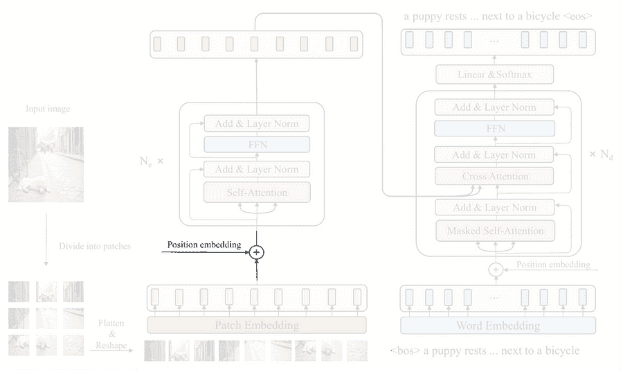

图 6. 将可学习的位置嵌入注入到嵌入图像补丁中 [5]。

在成功将输入图像转换为补丁序列之后，接下来要做的事情是将所谓的*位置嵌入*张量注入进去。这基本上是因为一个没有位置嵌入的转换器是对称不变的，这意味着它将输入序列视为顺序不重要。有趣的是，由于图像不是字面上的序列，我们应该将位置嵌入设置为*可学习的*，这样它就能在一定程度上重新排列它认为在表示空间信息方面最好的补丁序列。然而，请记住，这里的“重新排列”并不意味着我们物理上重新排列序列。相反，它是通过调整嵌入权重来实现的。

实现相当简单。我们只需要使用`nn.Parameter`初始化一个张量，其维度设置为与`Patcher`模型的输出匹配，即 576×768。同时，别忘了写上`requires_grad=True`，以确保张量是可训练的。请看下面的代码块 5 以获取详细信息。

```py
# Codeblock 5
class LearnableEmbedding(nn.Module):
   def __init__(self):
       super().__init__()
       self.learnable_embedding = nn.Parameter(torch.randn(size=(NUM_PATCHES, EMBED_DIM)),
                                               requires_grad=True)

   def forward(self):
       pos_embed = self.learnable_embedding
       print(f'learnable embedding\t: {pos_embed.size()}')

       return pos_embed
```

现在让我们运行以下代码块，看看我们的`LearnableEmbedding`类是否正常工作。你可以从打印的输出中看到，它成功地创建了预期的位置嵌入张量。

```py
# Codeblock 6
learnable_embedding = LearnableEmbedding()

pos_embed = learnable_embedding()
```

```py
# Codeblock 6 Output
learnable embedding : torch.Size([576, 768])
```

### 主要编码器块

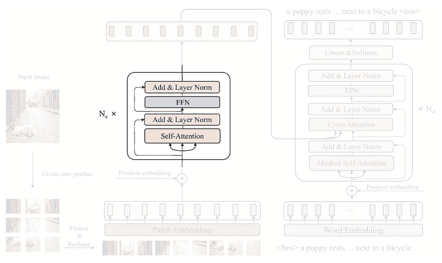

图 7. 主要编码器块 [5]。

接下来我们要做的是构建图 7 中显示的主要编码器块。在这里你可以看到这个块由几个子组件组成，即*自注意力*、*层归一化*、FFN（前馈网络）以及另一个*层归一化*。下面的代码块 7a 展示了我是如何在`EncoderBlock`类的`__init__()`方法中初始化这些层的。

```py
# Codeblock 7a
class EncoderBlock(nn.Module):
   def __init__(self):
       super().__init__()

       #(1)
       self.self_attention = nn.MultiheadAttention(embed_dim=EMBED_DIM,
                                                   num_heads=NUM_HEADS,
                                                   batch_first=True,  #(2)
                                                   dropout=DROP_PROB)

       self.layer_norm_0 = nn.LayerNorm(EMBED_DIM)  #(3)

       self.ffn = nn.Sequential(  #(4)
           nn.Linear(in_features=EMBED_DIM, out_features=HIDDEN_DIM),
           nn.GELU(),
           nn.Dropout(p=DROP_PROB),
           nn.Linear(in_features=HIDDEN_DIM, out_features=EMBED_DIM),
       )

       self.layer_norm_1 = nn.LayerNorm(EMBED_DIM)  #(5)
```

我之前提到，ViT 的想法是捕捉图像中补丁之间的关系。这个过程是通过我在上述代码块的第`#(1)`行初始化的*多头注意力*层来完成的。在这里需要注意的一点是我们需要将 batch_first 参数设置为`True`(`#(2)`)。这基本上是为了使注意力层与我们的张量形状兼容，其中批处理维度(`batch_size`)位于张量的 0 轴。接下来，需要分别初始化两个层归一化层，如第`#(3)`行和`#(5)`行所示。最后，在第`#(4)`行初始化 FFN 块，使用`nn.Sequential`堆叠的层遵循以下方程式定义的结构。

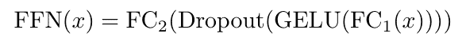

图 8. FFN 块内部的操作[1]。

随着`__init__()`方法的完成，我们现在将继续`forward()`方法。让我们看一下下面的代码块 7b。

```py
# Codeblock 7b
   def forward(self, features):  #(1)

       residual = features  #(2)
       print(f'features & residual\t: {residual.size()}')

       #(3)
       features, self_attn_weights = self.self_attention(query=features,
                                                         key=features,
                                                         value=features)
       print(f'after self attention\t: {features.size()}')
       print(f"self attn weights\t: {self_attn_weights.shape}")

       features = self.layer_norm_0(features + residual)  #(4)
       print(f'after norm\t\t: {features.size()}')

       residual = features
       print(f'\nfeatures & residual\t: {residual.size()}')

       features = self.ffn(features)  #(5)
       print(f'after ffn\t\t: {features.size()}')

       features = self.layer_norm_1(features + residual)
       print(f'after norm\t\t: {features.size()}')

       return features
```

在这里你可以看到输入张量被命名为`features (#(1)`）。我这样命名是因为`EncoderBlock`的输入是经过`Patcher`和`LearnableEmbedding`处理的图像，而不是原始图像。在开始任何操作之前，注意在`encoder`块中有一个从主流程中分离出来的分支，然后返回到归一化层。这个分支通常被称为*残差连接*。为了实现这一点，我们需要将原始输入张量存储到残差变量中，就像我在第`#(2)`行中演示的那样。由于输入张量已经被复制，我们现在可以处理原始输入的多头注意力层(`#(3)`)。由于这是一个*自注意力*（而不是*交叉注意力*），这个层的`query`、`key`和`value`输入都来自`features`张量。接下来，在第`#(4)`行执行层归一化操作，这个层的输入已经包含了来自注意力块和残差连接的信息。接下来的步骤基本上和我刚才解释的一样，只是这里我们将自注意力块替换为 FFN(`#(5)`)。

在下面的代码块中，我将通过传递一个大小为 1×576×768 的虚拟张量来测试`EncoderBlock`类，模拟从前一个操作中得到的输出张量。

```py
# Codeblock 8
encoder_block = EncoderBlock()

features = torch.randn(BATCH_SIZE, NUM_PATCHES, EMBED_DIM)
features = encoder_block(features)
```

下面是整个模型过程中张量维度的情况。

```py
# Codeblock 8 Output
features & residual  : torch.Size([1, 576, 768])  #(1)
after self attention : torch.Size([1, 576, 768])
self attn weights    : torch.Size([1, 576, 576])  #(2)
after norm           : torch.Size([1, 576, 768])

features & residual  : torch.Size([1, 576, 768])
after ffn            : torch.Size([1, 576, 768])  #(3)
after norm           : torch.Size([1, 576, 768])  #(4)
```

在这里，你可以看到最终输出张量（`#(4)`）的大小与输入（`#(1)`）相同，这使得我们可以在不担心张量维度出错的情况下堆叠多个编码器块。不仅如此，张量的大小似乎从开始到最后一层都没有改变。实际上，在注意力块内部实际上执行了大量的转换，但我们无法看到它，因为整个过程都是由`nn.MultiheadAttention`层内部完成的。我们可以在该层观察到的张量之一是注意力权重（`#(2)`）。这个大小为 576×576 的权重矩阵负责存储有关图像中一个补丁与其他所有补丁之间关系的信息。此外，张量维度的变化实际上也发生在 FFN 层内部。每个补丁的特征向量，其初始长度为 768，变为 3072，然后立即缩小回 768（`#(3)`）。然而，这个转换没有打印出来，因为过程被`nn.Sequential`包装在代码块 7a 的第`(4)`行。

### ViT 编码器

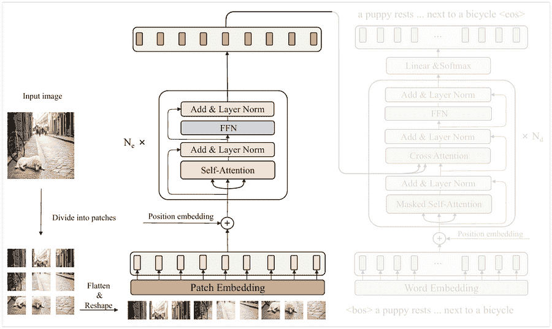

图 9. CPTR 架构中的整个 ViT 编码器[5]。

由于我们已经实现了所有编码器组件，现在我们将它们组装起来构建实际的 ViT 编码器。我们将在代码块 9 的`Encoder`类中完成这项工作。

```py
# Codeblock 9
class Encoder(nn.Module):
   def __init__(self):
       super().__init__()
       self.patcher = Patcher()  #(1)
       self.learnable_embedding = LearnableEmbedding()  #(2)

       #(3)
       self.encoder_blocks = nn.ModuleList(EncoderBlock() for _ in range(NUM_ENCODER_BLOCKS))

   def forward(self, images):  #(4)
       print(f'images\t\t\t: {images.size()}')

       features = self.patcher(images)  #(5)
       print(f'after patcher\t\t: {features.size()}')

       features = features + self.learnable_embedding()  #(6)
       print(f'after learn embed\t: {features.size()}')

       for i, encoder_block in enumerate(self.encoder_blocks):
           features = encoder_block(features)  #(7)
           print(f"after encoder block #{i}\t: {features.shape}")

       return features
```

在`__init__()`方法中，我们需要初始化我们之前创建的所有组件，即`Patcher`（`#(1)`）、`LearnableEmbedding`（`#(2)`）和`EncoderBlock`（`#(3)`）。在这种情况下，`EncoderBlock`是在`nn.ModuleList`中初始化的，因为我们想重复它`NUM_ENCODER_BLOCKS`（12）次。对于`forward()`方法，它最初通过接受原始图像作为输入（`#(4)`）来工作。然后我们通过`patcher`层（`#(5)`）处理它，将图像分割成小块，并通过线性投影操作进行转换。然后通过逐元素加法将可学习的位置嵌入张量注入到结果输出中（`#(6)`）。最后，我们通过简单的 for 循环依次将其传递到 12 个编码器块中（`#(7)`）。

现在，在代码块 10 中，我将通过整个编码器传递一个虚拟图像。请注意，由于我想专注于这个编码器类的流程，所以我重新运行了我们之前创建的带有注释的`print()`函数的类，以便输出看起来整洁。

```py
# Codeblock 10
encoder = Encoder()

images = torch.randn(BATCH_SIZE, IN_CHANNELS, IMAGE_SIZE, IMAGE_SIZE)
features = encoder(images)
```

下面是张量流的情况。在这里，我们可以看到我们的虚拟输入图像成功通过了网络中的所有层，包括我们重复 12 次的编码器块。结果输出张量现在具有上下文感知性，这意味着它已经包含了图像中补丁之间关系的信息。因此，这个张量现在可以进一步与解码器处理，这将在下一节中讨论。

```py
# Codeblock 10 Output
images                  : torch.Size([1, 3, 384, 384])
after patcher           : torch.Size([1, 576, 768])
after learn embed       : torch.Size([1, 576, 768])
after encoder block #0  : torch.Size([1, 576, 768])
after encoder block #1  : torch.Size([1, 576, 768])
after encoder block #2  : torch.Size([1, 576, 768])
after encoder block #3  : torch.Size([1, 576, 768])
after encoder block #4  : torch.Size([1, 576, 768])
after encoder block #5  : torch.Size([1, 576, 768])
after encoder block #6  : torch.Size([1, 576, 768])
after encoder block #7  : torch.Size([1, 576, 768])
after encoder block #8  : torch.Size([1, 576, 768])
after encoder block #9  : torch.Size([1, 576, 768])
after encoder block #10 : torch.Size([1, 576, 768])
after encoder block #11 : torch.Size([1, 576, 768])
```

### ViT 编码器（替代）

在我们讨论解码器之前，我想向你展示一些东西。如果你认为我们上面的方法太复杂，实际上你可以使用 PyTorch 中的`nn.TransformerEncoderLayer`，这样你就不需要从头开始实现`EncoderBlock`类。为了做到这一点，我将重新实现`Encoder`类，但这次我将它命名为`EncoderTorch`。

```py
# Codeblock 11
class EncoderTorch(nn.Module):
   def __init__(self):
       super().__init__()
       self.patcher = Patcher()
       self.learnable_embedding = LearnableEmbedding()

       #(1)
       encoder_block = nn.TransformerEncoderLayer(d_model=EMBED_DIM,
                                                  nhead=NUM_HEADS,
                                                  dim_feedforward=HIDDEN_DIM,
                                                  dropout=DROP_PROB,
                                                  batch_first=True)

       #(2)
       self.encoder_blocks = nn.TransformerEncoder(encoder_layer=encoder_block,
                                                   num_layers=NUM_ENCODER_BLOCKS)

   def forward(self, images):
       print(f'images\t\t\t: {images.size()}')

       features = self.patcher(images)
       print(f'after patcher\t\t: {features.size()}')

       features = features + self.learnable_embedding()
       print(f'after learn embed\t: {features.size()}')

       features = self.encoder_blocks(features)  #(3)
       print(f'after encoder blocks\t: {features.size()}')

       return features
```

在上面的代码块中，我们基本上做的是，不是使用`EncoderBlock`类，而是使用`nn.TransformerEncoderLayer`（`#(1)`），这将根据我们传递给它的参数自动创建一个编码器块。为了重复多次，我们只需使用`nn.TransformerEncoder`并将一个数字传递给`num_layers`参数（`#(2)`）。使用这种方法，我们不一定需要像之前那样在循环中编写前向传递（`#(3)`）。

下面代码块 12 中的测试代码与代码块 10 中的完全相同，只是这里我使用了`EncoderTorch`类。你还可以看到这里的输出基本上与之前的一个相同。

```py
# Codeblock 12
encoder_torch = EncoderTorch()

images = torch.randn(BATCH_SIZE, IN_CHANNELS, IMAGE_SIZE, IMAGE_SIZE)
features = encoder_torch(images)
```

```py
# Codeblock 12 Output
images               : torch.Size([1, 3, 384, 384])
after patcher        : torch.Size([1, 576, 768])
after learn embed    : torch.Size([1, 576, 768])
after encoder blocks : torch.Size([1, 576, 768])
```

## 解码器

由于我们已经成功创建了 CPTR 架构的编码器部分，现在我们将讨论解码器。在本节中，我将实现图 4 中蓝色框内的每一个组件。根据图示，我们可以看到解码器接受两个输入，即图像标题的地面真实值（蓝色框的下半部分）和编码器产生的嵌入补丁序列（从绿色框发出的箭头）。重要的是要知道，图 4 中绘制的架构旨在说明训练阶段，其中整个标题地面真实值被输入到解码器中。在推理阶段稍后，我们只为标题输入提供一个<BOS>（*句子开头*）标记。然后解码器将根据给定的图像和之前生成的单词逐个预测每个单词。这个过程通常被称为*自回归*机制。

### 正弦位置嵌入

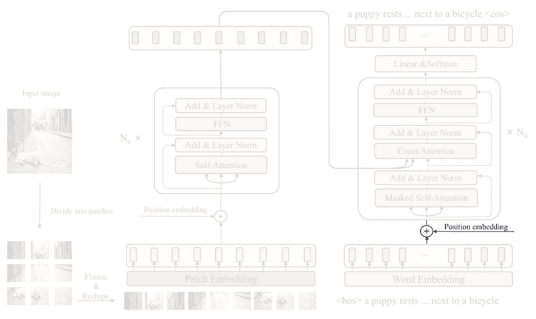

图 10。正弦位置嵌入组件在解码器中的位置[5]。

如果你看看 CPTR 模型，你会看到解码器的第一步是将每个单词转换为相应的特征向量表示，使用*词嵌入*块。然而，由于这一步非常简单，我们将在稍后实现它。现在让我们假设这个单词向量化过程已经完成，因此我们可以转到位置嵌入部分。

如我之前提到的，由于 Transformer 本质上是排列不变的，我们需要对输入序列应用位置嵌入。与之前的不同，这里我们使用所谓的*正弦波位置嵌入*。我们可以将其视为一种通过从正弦波中分配数字来标记每个词向量的方法。通过这样做，我们可以期望我们的模型通过波形的提供的信息来理解词序。

如果你回到代码块 6 的输出，你会看到编码器中的位置嵌入张量的大小为`NUM_PATCHES` × `EMBED_DIM` (576×768)。在解码器中，我们基本上想要创建一个大小为`SEQ_LENGTH` × `EMBED_DIM` (30×768)的张量，其值是根据图 11 中显示的方程计算的。然后，这个张量被设置为不可训练的，因为单词序列必须保持固定的顺序以保持其意义。


图 11. Transformer 论文[6]中提出的创建正弦波位置编码的公式。

在这里，我想快速解释以下代码，因为我实际上在我的关于 Transformer 的前一篇文章中已经对此进行了更详细的讨论。总的来说，我们在这里基本上是使用`torch.sin()` (`#(1)`) 和 `torch.cos()` (`#(2)`) 创建正弦和余弦波。然后，使用第`#(3)`和`#(4)`行的代码将得到的两个张量合并。

```py
# Codeblock 13
class SinusoidalEmbedding(nn.Module):
   def forward(self):
       pos = torch.arange(SEQ_LENGTH).reshape(SEQ_LENGTH, 1)
       print(f"pos\t\t: {pos.shape}")

       i = torch.arange(0, EMBED_DIM, 2)
       denominator = torch.pow(10000, i/EMBED_DIM)
       print(f"denominator\t: {denominator.shape}")

       even_pos_embed = torch.sin(pos/denominator)  #(1)
       odd_pos_embed  = torch.cos(pos/denominator)  #(2)
       print(f"even_pos_embed\t: {even_pos_embed.shape}")

       stacked = torch.stack([even_pos_embed, odd_pos_embed], dim=2)  #(3)
       print(f"stacked\t\t: {stacked.shape}")

       pos_embed = torch.flatten(stacked, start_dim=1, end_dim=2)  #(4)
       print(f"pos_embed\t: {pos_embed.shape}")

       return pos_embed
```

现在，我们可以通过运行下面的代码块 14 来检查上面的`SinusoidalEmbedding`类是否正常工作。正如之前所预期的，在这里你可以看到得到的张量大小为 30×768。这个维度与在*词嵌入*块中完成的处理得到的张量相匹配，允许它们以逐元素的方式相加。

```py
# Codeblock 14
sinusoidal_embedding = SinusoidalEmbedding()
pos_embed = sinusoidal_embedding()
```

```py
# Codeblock 14 Output
pos            : torch.Size([30, 1])
denominator    : torch.Size([384])
even_pos_embed : torch.Size([30, 384])
stacked        : torch.Size([30, 384, 2])
pos_embed      : torch.Size([30, 768])
```

### 前瞻掩码

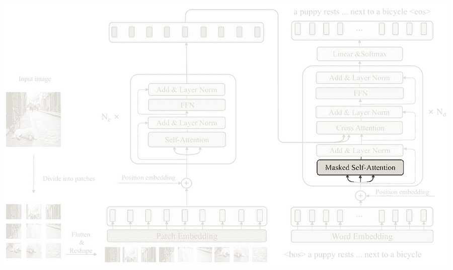

图 12. 需要应用于掩码自注意力层的*前瞻掩码* [5]。

接下来，我将在解码器中讨论的是上图突出显示的*掩码自注意力*层。我不会从头开始编写注意力机制。相反，我只会实现所谓的*前瞻掩码*，这对于自注意力层来说将非常有用，这样在训练阶段它就不会关注标题中的后续单词。

实现方法相当简单，我们所需做的就是创建一个三角形矩阵，其大小设置为与注意力权重矩阵相匹配，即`SEQ_LENGTH` × `SEQ_LENGTH` (30×30)。查看下面的`create_mask()`函数以获取详细信息。

```py
# Codeblock 15
def create_mask(seq_length):
   mask = torch.tril(torch.ones((seq_length, seq_length)))  #(1)
   mask[mask == 0] = -float('inf')  #(2)
   mask[mask == 1] = 0  #(3)
   return mask
```

虽然创建一个三角形矩阵可以通过`torch.tril()`和`torch.ones()`简单地完成（`#(1)`），但在这里我们需要进行一点修改，将 0 值改为*负无穷*（`#(2)`）并将 1s 改为 0（`#(3)`）。这本质上是因为`nn.MultiheadAttention`层通过逐元素相加应用掩码。通过将*负无穷*分配给后续的单词，注意力机制将完全忽略它们。同样，注意力层内部的内部过程也在我之前关于 transformer 的文章中进行了详细讨论（[我的关于 transformer 的文章](https://contributor.insightmediagroup.io/paper-walkthrough-attention-is-all-you-need-80399cdc59e1)）。

现在，我将使用`seq_length=7`运行函数，以便您可以看到掩码的实际样子。在完整的流程中稍后，我们需要将`seq_length`参数设置为`SEQ_LENGTH`（30），以便它与实际的标题长度相匹配。

```py
# Codeblock 16
mask_example = create_mask(seq_length=7)
mask_example
```

```py
# Codeblock 16 Output
tensor([[0., -inf, -inf, -inf, -inf, -inf, -inf],
       [0., 0., -inf, -inf, -inf, -inf, -inf],
       [0., 0., 0., -inf, -inf, -inf, -inf],
       [0., 0., 0., 0., -inf, -inf, -inf],
       [0., 0., 0., 0., 0., -inf, -inf],
       [0., 0., 0., 0., 0., 0., -inf],
       [0., 0., 0., 0., 0., 0., 0.]])
```

### 主要解码器块

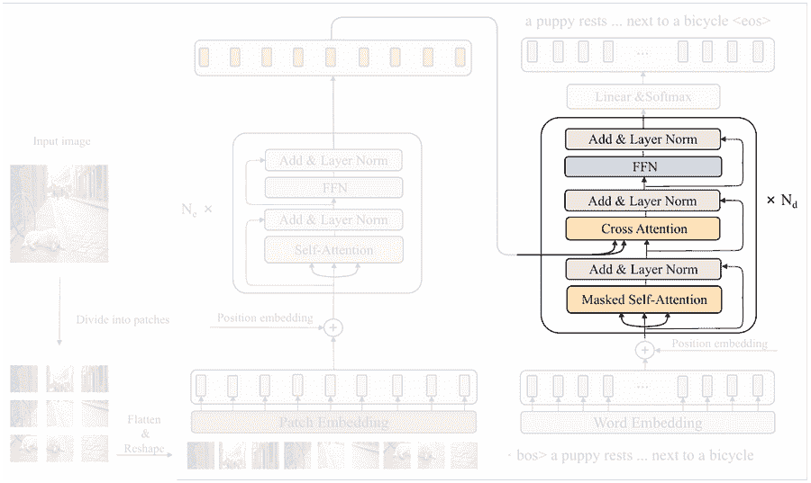

图 13. 主要解码器块 [5]。

从上图我们可以看出，解码器块的结构比编码器块略长。看起来几乎一切都很相似，除了解码器部分有一个*交叉注意力*机制，并且在其后放置了一个额外的层归一化步骤。这个交叉注意力层实际上可以被视为编码器和解码器之间的桥梁，因为它被用来捕捉标题中的每个单词和输入图像中的每个单独补丁之间的关系。来自编码器的两个箭头是注意力层的*键*和*值*输入，而*查询*是从解码器本身的前一层派生出来的。请看下面的代码块 17a 和 17b，以了解整个解码器块的实现。

```py
# Codeblock 17a
class DecoderBlock(nn.Module):
   def __init__(self):
       super().__init__()

       #(1)
       self.self_attention = nn.MultiheadAttention(embed_dim=EMBED_DIM,
                                                   num_heads=NUM_HEADS,
                                                   batch_first=True,
                                                   dropout=DROP_PROB)
       #(2)
       self.layer_norm_0 = nn.LayerNorm(EMBED_DIM)
       #(3)
       self.cross_attention = nn.MultiheadAttention(embed_dim=EMBED_DIM,
                                                    num_heads=NUM_HEADS,
                                                    batch_first=True,
                                                    dropout=DROP_PROB)

       #(4)
       self.layer_norm_1 = nn.LayerNorm(EMBED_DIM)

       #(5)      
       self.ffn = nn.Sequential(
           nn.Linear(in_features=EMBED_DIM, out_features=HIDDEN_DIM),
           nn.GELU(),
           nn.Dropout(p=DROP_PROB),
           nn.Linear(in_features=HIDDEN_DIM, out_features=EMBED_DIM),
       )

       #(6)
       self.layer_norm_2 = nn.LayerNorm(EMBED_DIM)
```

在`__init__()`方法中，我们首先使用`nn.MultiheadAttention`初始化了自注意力（`#(1)`）和交叉注意力（`#(3)`）层。这两个层现在看起来完全相同，但稍后您将在`forward()`方法中看到它们之间的差异。三个层归一化操作分别初始化，如第`#(2)`、`#(4)`和`#(6)`行所示，因为每个都将包含不同的归一化参数。最后，`ffn`层（`#(5)`）与编码器中的完全相同，基本上遵循图 8 中的方程式。

下面将讨论`forward()`方法，它最初通过接受三个输入来工作：`features`、`captions`和`attn_mask`，其中每个分别表示来自编码器的张量、来自解码器自身的张量以及一个前瞻掩码（`#(1)`）。接下来的步骤与`EncoderBlock`的步骤有些相似，除了在这里我们重复了两次多头注意力块。第一个注意力机制将标题作为`query`、`key`和`value`参数（`#(2)`）。这基本上是因为我们希望该层能够捕获标题张量内部的上下文——因此得名*自注意力*。在这里，我们还需要将`attn_mask`参数传递给这一层，以便在训练阶段它不能看到后续的单词。第二个注意力机制是不同的（`#(3)`）。由于我们想要结合编码器和解码器的信息，我们需要将`captions`张量作为`query`传递，而`features`张量将作为`key`和`value`传递——因此得名*交叉注意力*。在交叉注意力层中不需要前瞻掩码，因为在推理阶段，模型将能够一次性看到整个输入图像，而不是逐个查看补丁。由于张量已经经过两个注意力层的处理，我们将然后通过前馈网络（`#(4)`）传递它。最后，别忘了在每个子组件之后创建残差连接并应用层归一化步骤。

```py
# Codeblock 17b
   def forward(self, features, captions, attn_mask):  #(1)
       print(f"attn_mask\t\t: {attn_mask.shape}")
       residual = captions
       print(f"captions & residual\t: {captions.shape}")

       #(2)
       captions, self_attn_weights = self.self_attention(query=captions,
                                                         key=captions,
                                                         value=captions,
                                                         attn_mask=attn_mask)
       print(f"after self attention\t: {captions.shape}")
       print(f"self attn weights\t: {self_attn_weights.shape}")

       captions = self.layer_norm_0(captions + residual)
       print(f"after norm\t\t: {captions.shape}")

       print(f"\nfeatures\t\t: {features.shape}")
       residual = captions
       print(f"captions & residual\t: {captions.shape}")

       #(3)
       captions, cross_attn_weights = self.cross_attention(query=captions,
                                                           key=features,
                                                           value=features)
       print(f"after cross attention\t: {captions.shape}")
       print(f"cross attn weights\t: {cross_attn_weights.shape}")

       captions = self.layer_norm_1(captions + residual)
       print(f"after norm\t\t: {captions.shape}")

       residual = captions
       print(f"\ncaptions & residual\t: {captions.shape}")

       captions = self.ffn(captions)  #(4)
       print(f"after ffn\t\t: {captions.shape}")

       captions = self.layer_norm_2(captions + residual)
       print(f"after norm\t\t: {captions.shape}")

       return captions 
```

随着`DecoderBlock`类的完成，我们现在可以用以下代码对其进行测试。

```py
# Codeblock 18
decoder_block = DecoderBlock()

features = torch.randn(BATCH_SIZE, NUM_PATCHES, EMBED_DIM)  #(1)
captions = torch.randn(BATCH_SIZE, SEQ_LENGTH, EMBED_DIM)   #(2)
look_ahead_mask = create_mask(seq_length=SEQ_LENGTH)  #(3)

captions = decoder_block(features, captions, look_ahead_mask)
```

在这里，我们假设`features`是一个包含由`encoder`生成的补丁嵌入序列的张量（`#(1)`），而`captions`是一个嵌入单词的序列（`#(2)`）。前瞻掩码的`seq_length`参数设置为`SEQ_LENGTH`（30），以匹配标题中的单词数量（`#(3)`）。每个步骤之后的张量维度将在以下输出中显示。

```py
# Codeblock 18 Output
attn_mask             : torch.Size([30, 30])
captions & residual   : torch.Size([1, 30, 768])
after self attention  : torch.Size([1, 30, 768])
self attn weights     : torch.Size([1, 30, 30])    #(1)
after norm            : torch.Size([1, 30, 768])

features              : torch.Size([1, 576, 768])
captions & residual   : torch.Size([1, 30, 768])
after cross attention : torch.Size([1, 30, 768])
cross attn weights    : torch.Size([1, 30, 576])   #(2)
after norm            : torch.Size([1, 30, 768])

captions & residual   : torch.Size([1, 30, 768])
after ffn             : torch.Size([1, 30, 768])
after norm            : torch.Size([1, 30, 768])
```

在这里，我们可以看到我们的`DecoderBlock`类工作正常，因为它成功地处理了输入张量，直到网络的最后一层。这里我想让你仔细看看第`#(1)`和`#(2)`行的注意力权重。基于这两行，我们可以确认我们的解码器实现是正确的，因为自注意力层产生的注意力权重大小为 30×30（`#(1)`），这基本上意味着这一层真正捕获了输入标题内部的上下文。同时，交叉注意力层生成的注意力权重矩阵大小为 30×576（`#(2)`），表明它成功地捕获了单词和补丁之间的关系。这本质上意味着在执行交叉注意力操作后，生成的标题张量已经富含了来自图像的信息。

### Transformer 解码器

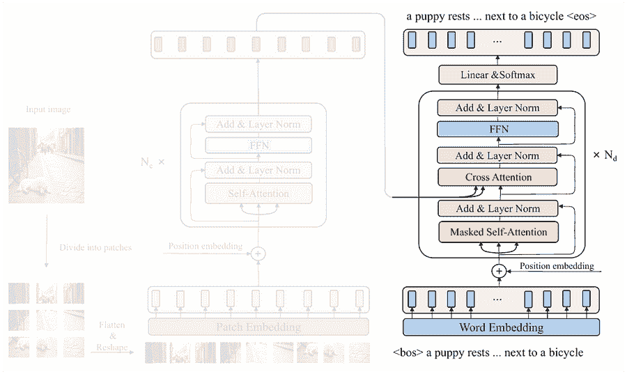

图 14。CPTR 架构中的整个 Transformer 解码器[5]。

现在我们已经成功创建了整个解码器的所有组件，接下来我将把它们组合成一个单独的类。查看下面的代码块 19a 和 19b，看看我是如何做到这一点的。

```py
# Codeblock 19a
class Decoder(nn.Module):
   def __init__(self):
       super().__init__()

       #(1)
       self.embedding = nn.Embedding(num_embeddings=VOCAB_SIZE,
                                     embedding_dim=EMBED_DIM)

       #(2)
       self.sinusoidal_embedding = SinusoidalEmbedding()

       #(3)
       self.decoder_blocks = nn.ModuleList(DecoderBlock() for _ in range(NUM_DECODER_BLOCKS))

       #(4)
       self.linear = nn.Linear(in_features=EMBED_DIM,
                               out_features=VOCAB_SIZE)
```

如果你将这个`Decoder`类与代码块 9 中的`Encoder`类进行比较，你会注意到它们在结构上有些相似。在编码器中，我们使用`Patcher`将图像块转换为向量，而在解码器中，我们使用`nn.Embedding layer`（`#(1)`）将每个标题中的每个单词转换为向量，这是我之前没有解释过的。之后，我们初始化位置嵌入层，对于解码器，我们使用正弦波而不是可训练的嵌入（`#(2)`）。接下来，我们使用`nn.ModuleList`（`#(3)`）堆叠多个解码器块。在行`#(4)`中编写的线性层，在编码器中不存在，但在这里实现它是必要的，因为它将负责将每个嵌入的单词映射到长度为`VOCAB_SIZE`（10000）的向量。稍后，这个向量将包含字典中每个单词的对数概率，我们接下来需要做的就是取包含最大值的索引，即最有可能被预测的单词。

在`forward()`方法本身中的张量流也与`Encoder`类中的非常相似。在下面的代码块 19b 中，我们传递特征、标题和`attn_mask`作为输入（`#(1)`）。记住，在这种情况下，标题张量包含原始单词序列，因此我们需要在之前使用嵌入层将这些单词向量化（`#(2)`）。接下来，我们使用代码在行`#(3)`中注入正弦波位置嵌入张量，然后最终依次通过四个解码器块（`#(4)`）。最后，我们将结果张量通过最后一个线性层以获得`prediction`对数概率（`#(5)`）。

```py
# Codeblock 19b
   def forward(self, features, captions, attn_mask):  #(1)
       print(f"features\t\t: {features.shape}")
       print(f"captions\t\t: {captions.shape}")

       captions = self.embedding(captions)  #(2)
       print(f"after embedding\t\t: {captions.shape}")

       captions = captions + self.sinusoidal_embedding()  #(3)
       print(f"after sin embed\t\t: {captions.shape}")

       for i, decoder_block in enumerate(self.decoder_blocks):
           captions = decoder_block(features, captions, attn_mask)  #(4)
           print(f"after decoder block #{i}\t: {captions.shape}")

       captions = self.linear(captions)  #(5)
       print(f"after linear\t\t: {captions.shape}")

       return captions
```

到目前为止，你可能想知道为什么我们不实现图中所示的 softmax 激活函数。这主要是因为在训练阶段，softmax 通常包含在损失函数中，而在推理阶段，无论是否应用 softmax，最大值的索引都将保持不变。

现在，让我们运行以下测试代码来检查我们的实现中是否有错误。之前我提到，`Decoder`类的标题输入是一个原始单词序列。为了模拟这种情况，我们可以简单地创建一个长度为`SEQ_LENGTH`（30）个单词的随机整数序列，范围在 0 到`VOCAB_SIZE`（10000）之间（`#(1)`）。

```py
# Codeblock 20
decoder = Decoder()

features = torch.randn(BATCH_SIZE, NUM_PATCHES, EMBED_DIM)
captions = torch.randint(0, VOCAB_SIZE, (BATCH_SIZE, SEQ_LENGTH))  #(1)

captions = decoder(features, captions, look_ahead_mask)
```

下面是最终输出的样子。在这里，你可以看到最后一行，线性层生成了一个大小为 30×10000 的张量，这表明我们的解码器模型现在能够预测词汇表中所有 30 个序列位置中每个单词的对数概率得分。

```py
# Codeblock 20 Output
features               : torch.Size([1, 576, 768])
captions               : torch.Size([1, 30])
after embedding        : torch.Size([1, 30, 768])
after sin embed        : torch.Size([1, 30, 768])
after decoder block #0 : torch.Size([1, 30, 768])
after decoder block #1 : torch.Size([1, 30, 768])
after decoder block #2 : torch.Size([1, 30, 768])
after decoder block #3 : torch.Size([1, 30, 768])
after linear           : torch.Size([1, 30, 10000])
```

### Transformer 解码器（替代）

实际上，通过用`nn.TransformerDecoderLayer`替换`DecoderBlock`类，我们也可以使代码更简单，就像我们在 ViT 编码器中所做的那样。以下是如果我们使用这种方法时的代码样子。

```py
# Codeblock 21
class DecoderTorch(nn.Module):
   def __init__(self):
       super().__init__()
       self.embedding = nn.Embedding(num_embeddings=VOCAB_SIZE,
                                     embedding_dim=EMBED_DIM)

       self.sinusoidal_embedding = SinusoidalEmbedding()

       #(1)
       decoder_block = nn.TransformerDecoderLayer(d_model=EMBED_DIM,
                                                  nhead=NUM_HEADS,
                                                  dim_feedforward=HIDDEN_DIM,
                                                  dropout=DROP_PROB,
                                                  batch_first=True)

       #(2)
       self.decoder_blocks = nn.TransformerDecoder(decoder_layer=decoder_block,
                                                   num_layers=NUM_DECODER_BLOCKS)

       self.linear = nn.Linear(in_features=EMBED_DIM,
                               out_features=VOCAB_SIZE)

   def forward(self, features, captions, tgt_mask):
       print(f"features\t\t: {features.shape}")
       print(f"captions\t\t: {captions.shape}")

       captions = self.embedding(captions)
       print(f"after embedding\t\t: {captions.shape}")

       captions = captions + self.sinusoidal_embedding()
       print(f"after sin embed\t\t: {captions.shape}")

       #(3)
       captions = self.decoder_blocks(tgt=captions,
                                      memory=features,
                                      tgt_mask=tgt_mask)
       print(f"after decoder blocks\t: {captions.shape}")

       captions = self.linear(captions)
       print(f"after linear\t\t: {captions.shape}")

       return captions
```

您在`__init__()`方法中看到的主要区别是，在第`#(1)`行和`#(2)`行使用了`nn.TransformerDecoderLayer`和`nn.TransformerDecoder`，前者用于初始化单个解码器块，后者用于多次重复该块。接下来，`forward()`方法与`Decoder`类中的方法大致相似，除了解码器块的正向传播会自动重复四次，而不需要将其放入循环中（`#(3)`）。在`decoder_blocks`层中需要注意的一点是，来自编码器（特征）的张量必须作为`memory`参数的参数传递。同时，来自解码器本身（标题）的张量必须作为`tgt`参数的输入。

下面`DecoderTorch`模型的测试代码基本上与代码块 20 中写的是一样的。在这里，您可以看到这个模型也生成了大小为 30×10000 的最终输出张量。

```py
# Codeblock 22
decoder_torch = DecoderTorch()

features = torch.randn(BATCH_SIZE, NUM_PATCHES, EMBED_DIM)
captions = torch.randint(0, VOCAB_SIZE, (BATCH_SIZE, SEQ_LENGTH))

captions = decoder_torch(features, captions, look_ahead_mask)
```

```py
# Codeblock 22 Output
features             : torch.Size([1, 576, 768])
captions             : torch.Size([1, 30])
after embedding      : torch.Size([1, 30, 768])
after sin embed      : torch.Size([1, 30, 768])
after decoder blocks : torch.Size([1, 30, 768])
after linear         : torch.Size([1, 30, 10000])
```

## 整个 CPTR 模型

最后，是时候将我们刚刚创建的编码器和解码器部分放入一个单独的类中，以实际构建 CPTR 架构了。您可以在下面的代码块 23 中看到，实现非常简单。我们在这里需要做的只是初始化编码器（`#(1)`）和解码器（`#(2)`）组件，然后将原始图像和相应的标题真实值以及前瞻掩码传递给`forward()`方法（`#(3)`）。此外，您还可以将`Encoder`和`Decoder`分别替换为`EncoderTorch`和`DecoderTorch`。

```py
# Codeblock 23
class EncoderDecoder(nn.Module):
   def __init__(self):
       super().__init__()
       self.encoder = Encoder()  #EncoderTorch()  #(1)
       self.decoder = Decoder()  #DecoderTorch()  #(2)

   def forward(self, images, captions, look_ahead_mask):  #(3)
       print(f"images\t\t\t: {images.shape}")
       print(f"captions\t\t: {captions.shape}")

       features = self.encoder(images)
       print(f"after encoder\t\t: {features.shape}")

       captions = self.decoder(features, captions, look_ahead_mask)
       print(f"after decoder\t\t: {captions.shape}")

       return captions
```

我们可以通过传递虚拟张量通过它来进行测试。下面是代码块 24 的详细信息。在这种情况下，图像基本上是一个维度为 1×3×384×384 的随机数字张量（`#(1)`），而标题是一个包含随机整数的 1×30 的张量（`#(2)`）。

```py
# Codeblock 24
encoder_decoder = EncoderDecoder()

images = torch.randn(BATCH_SIZE, IN_CHANNELS, IMAGE_SIZE, IMAGE_SIZE)  #(1)
captions = torch.randint(0, VOCAB_SIZE, (BATCH_SIZE, SEQ_LENGTH))  #(2)

captions = encoder_decoder(images, captions, look_ahead_mask)
```

下面是输出结果的样子。我们可以看到，我们的输入图像和标题成功通过了网络的所有层，这意味着我们创建的 CPTR 模型现在可以实际在图像标题数据集上训练了。

```py
# Codeblock 24 Output
images         : torch.Size([1, 3, 384, 384])
captions       : torch.Size([1, 30])
after encoder  : torch.Size([1, 576, 768])
after decoder  : torch.Size([1, 30, 10000])
```

## 结束

关于 CaPtion TransformeR 架构的理论和实现，基本上就是这些了。请告诉我您想让我实现哪个深度学习架构。如果您在这篇文章中发现了任何错误，请随时留言！

*本文中使用的代码可在* [*我的 GitHub 仓库*](https://github.com/MuhammadArdiPutra/medium_articles/blob/main/Image%20Captioning%2C%20Transformer%20Mode%20On.ipynb)* 找到。以下是我之前关于* [*图像标题生成*](https://contributor.insightmediagroup.io/show-and-tell-e1a1142456e2/)*, *[*视觉 Transformer (ViT)*](https://contributor.insightmediagroup.io/paper-walkthrough-vision-transformer-vit-c5dcf76f1a7a)* 和原始* [*Transformer*](https://contributor.insightmediagroup.io/paper-walkthrough-attention-is-all-you-need-80399cdc59e1)* 的文章链接。

## 参考文献

[1] 刘伟 *等.* CPTR：用于图像标题生成的全 Transformer 网络。Arxiv。[`arxiv.org/pdf/2101.10804`](https://arxiv.org/pdf/2101.10804) [访问日期：2024 年 11 月 16 日]。

[2] Oriol Vinyals *等.* 展示与讲述：一种神经图像标题生成器。Arxiv。[`arxiv.org/pdf/1411.4555`](https://arxiv.org/pdf/1411.4555) [访问日期：2024 年 12 月 3 日]。

[3] 图像由作者根据：Alexey Dosovitskiy *等.* 一张图胜过 16×16 个词：大规模图像识别的 Transformer。Arxiv。[`arxiv.org/pdf/2010.11929`](https://arxiv.org/pdf/2010.11929) [访问日期：2024 年 12 月 3 日]。

[4] 图像由作者根据[6]创建。

[5] 图像由作者根据[1]创建。

[6] Ashish Vaswani *等.* 注意力即是所需。Arxiv。[`arxiv.org/pdf/1706.03762`](https://arxiv.org/pdf/1706.03762) [访问日期：2024 年 12 月 3 日]。
