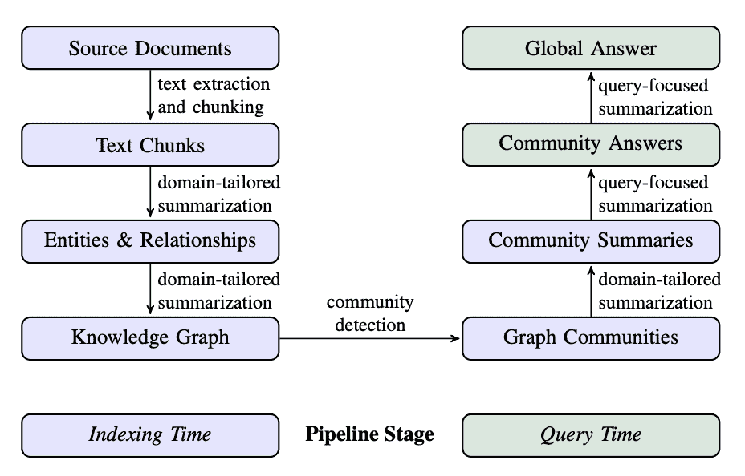
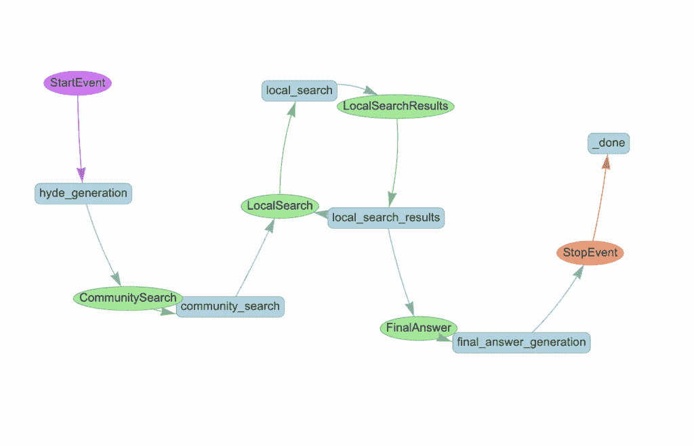
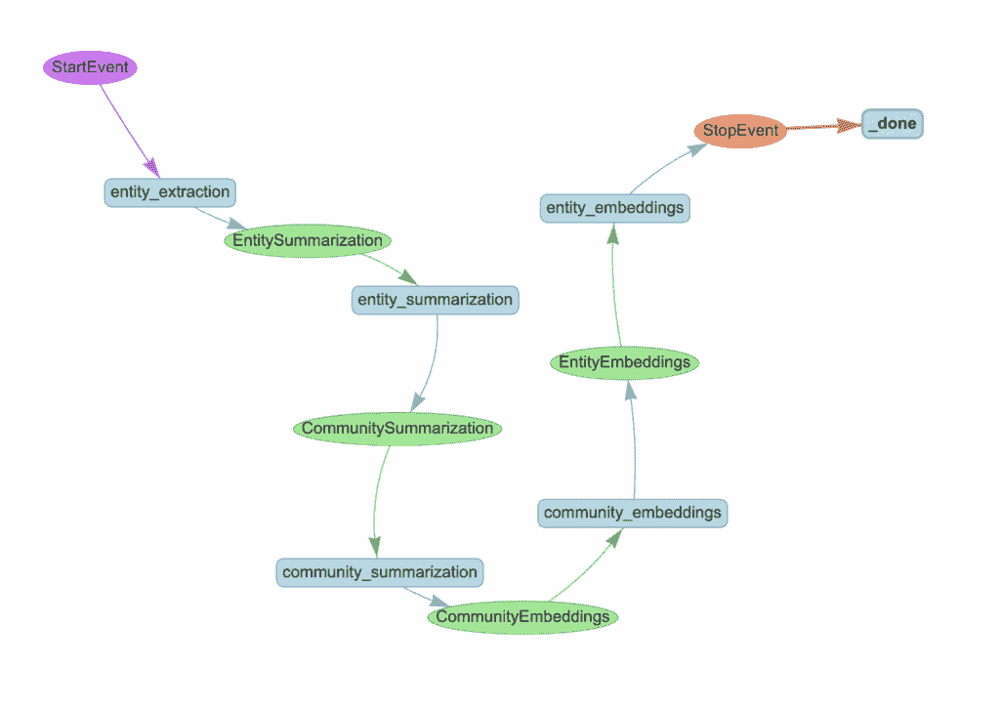

# 使用 Neo4j 和 LlamaIndex 实现 DRIFT 搜索

> 原文：[`towardsdatascience.com/implementing-drift-search-with-neo4j-and-llamaindex/`](https://towardsdatascience.com/implementing-drift-search-with-neo4j-and-llamaindex/)

[微软的 GraphRAG 实现](https://arxiv.org/abs/2404.16130)是第一个<mdspan datatext="el1761088496709" class="mdspan-comment">GraphRAG</mdspan>系统之一，并引入了许多创新功能。它结合了索引阶段，其中提取和总结实体、关系和层次社区，以及高级查询时能力。这种方法使系统能够通过利用预先计算的实体、关系和社区摘要来回答广泛的、主题性的问题，超越了标准 RAG 系统传统的文档检索限制。



微软的 GraphRAG 管道。图片来自[Edge 等人，2024]，授权使用 CC BY 4.0。

我已经在之前的博客文章中介绍了索引阶段以及全局和局部搜索机制([这里](https://weaviate.io/blog/graph-rag)和[这里](https://medium.com/data-science/integrating-microsoft-graphrag-into-neo4j-e0d4fa00714c))，所以在这篇讨论中我们将跳过这些细节。然而，我们还没有探讨[DRIFT 搜索](https://www.microsoft.com/en-us/research/blog/introducing-drift-search-combining-global-and-local-search-methods-to-improve-quality-and-efficiency/)，这将是本博客文章的重点。DRIFT 是一种较新的方法，结合了全局和局部搜索方法的特点。该技术首先通过向量搜索利用社区信息，为查询建立一个广泛的起始点，然后利用这些社区洞察来细化原始问题，形成详细的后续查询。这使得 DRIFT 能够动态遍历知识图谱，检索有关实体、关系和其他本地化细节的特定信息，在计算效率和全面答案质量之间取得平衡。



使用 LlamaIndex 工作流程和 Neo4j 实现的 Drift 搜索。图片由作者提供。

实现使用[LlamaIndex 工作流程](https://developers.llamaindex.ai/python/framework/module_guides/workflow/)来编排 DRIFT 搜索过程，通过几个关键步骤。它从**HyDE 生成**开始，基于样本社区报告创建一个假设答案，以改善查询表示。

**社区搜索步骤**随后使用向量相似性来识别最相关的社区报告，为查询提供广泛的背景。系统分析这些结果以生成一个初始的中间答案和一系列后续查询，以进行更深入的探究。

这些后续查询在**本地搜索阶段**并行执行，检索目标信息，包括文本片段、实体、关系以及额外的社区报告，来自知识图谱。这个过程可以迭代到最大深度，每一轮都可能产生新的后续查询。

最后，**答案生成步骤**综合了整个过程中收集的所有中间答案，将广泛的社区级洞察与详细的本地发现相结合，以生成全面的响应。这种方法平衡了广度和深度，从社区背景开始广泛，然后逐步深入具体细节。

*这是我对 DRIFT 搜索的实现，针对 LlamaIndex 工作流程和 Neo4j 进行了适配。我通过检查微软的 GraphRAG 代码来逆向工程这种方法，因此可能与原始实现存在一些差异。*

代码可在[GitHub](https://github.com/neo4j-contrib/ms-graphrag-neo4j/blob/main/examples/drift_search.ipynb)上找到。

## 数据集

对于这篇博客文章，我们将使用刘易斯·卡罗尔的《爱丽丝梦游仙境》，这是一部经典文本，可以从[Project Gutenberg](https://www.gutenberg.org/ebooks/11)免费获取。这个丰富叙事的数据集，其相互关联的角色、地点和事件，使其成为展示 GraphRAG 能力的一个绝佳选择。

## 数据摄取

对于数据摄取过程，我们将重用我为[之前的博客文章](https://weaviate.io/blog/graph-rag)开发的[Microsoft GraphRAG 索引实现](https://github.com/neo4j-contrib/ms-graphrag-neo4j/)，并将其适配到 LlamaIndex 工作流程中。



索引工作流程。图由作者提供。

数据摄取管道遵循标准的 GraphRAG 方法，有三个主要阶段：

```py
class MSGraphRAGIngestion(Workflow):
    @step
    async def entity_extraction(self, ev: StartEvent) -> EntitySummarization:
        chunks = splitter.split_text(ev.text)
        await ms_graph.extract_nodes_and_rels(chunks, ev.allowed_entities)
        return EntitySummarization()

    @step
    async def entity_summarization(
        self, ev: EntitySummarization
    ) -> CommunitySummarization:
        await ms_graph.summarize_nodes_and_rels()
        return CommunitySummarization()

    @step
    async def community_summarization(
        self, ev: CommunitySummarization
    ) -> CommunityEmbeddings:
        await ms_graph.summarize_communities()
        return CommunityEmbeddings()
```

工作流程从文本片段中提取实体和关系，为节点和关系生成摘要，然后创建层次社区摘要。

在总结之后，我们为社区和实体生成向量嵌入，以实现相似度搜索。以下是社区嵌入步骤：

```py
@step
    async def community_embeddings(self, ev: CommunityEmbeddings) -> EntityEmbeddings:
        # Fetch all communities from the graph database
        communities = ms_graph.query(
            """
    MATCH (c:__Community__)
    WHERE c.summary IS NOT NULL AND c.rating > $min_community_rating
    RETURN coalesce(c.title, "") + " " + c.summary AS community_description, c.id AS community_id
    """,
            params={"min_community_rating": MIN_COMMUNITY_RATING},
        )
        if communities:
            # Generate vector embeddings from community descriptions
            response = await client.embeddings.create(
                input=[c["community_description"] for c in communities],
                model=TEXT_EMBEDDING_MODEL,
            )
            # Store embeddings in the graph and create vector index
            embeds = [
                {
                    "community_id": community["community_id"],
                    "embedding": embedding.embedding,
                }
                for community, embedding in zip(communities, response.data)
            ]
            ms_graph.query(
                """UNWIND $data as row
            MATCH (c:__Community__ {id: row.community_id})
            CALL db.create.setNodeVectorProperty(c, 'embedding', row.embedding)""",
                params={"data": embeds},
            )
            ms_graph.query(
                "CREATE VECTOR INDEX community IF NOT EXISTS FOR (c:__Community__) ON c.embedding"
            )
        return EntityEmbeddings()
```

相同的过程应用于实体嵌入，创建了 DRIFT 搜索基于相似度检索所需的向量索引。

## DRIFT 搜索

DRIFT 搜索是一种直观的信息检索方法：首先理解整体情况，然后在需要时深入具体细节。而不是立即在文档或实体级别搜索精确匹配，DRIFT 首先咨询社区摘要，这些是高级概述，能够捕捉知识图谱中的主要主题和话题。

一旦 DRIFT 识别出相关的更高级信息，它将智能地生成后续查询以检索关于特定实体、关系和源文档的精确信息。这种两阶段方法反映了人类自然寻求信息的方式：我们首先获得一个一般概述，然后提出有针对性的问题来填补细节。通过结合全局搜索的全面覆盖和本地搜索的精确性，DRIFT 在不处理每个社区报告或文档的计算成本的情况下，实现了广度和深度。

让我们逐一分析实现过程中的每个阶段。

*代码可在* [*GitHub*](https://github.com/neo4j-contrib/ms-graphrag-neo4j/blob/main/examples/drift_search.ipynb)* 上找到。

### 社区搜索

DRIFT 使用 HyDE（假设文档嵌入）来提高向量搜索的准确性。它不是直接嵌入用户的查询，而是首先生成一个假设答案，然后使用该答案进行相似度搜索。这是因为假设答案在语义上比原始查询更接近实际的社区摘要。

```py
@step
async def hyde_generation(self, ev: StartEvent) -> CommunitySearch:
    # Fetch a random community report to use as a template for HyDE generation
    random_community_report = driver.execute_query(
        """
    MATCH (c:__Community__)
    WHERE c.summary IS NOT NULL
    RETURN coalesce(c.title, "") + " " + c.summary AS community_description""",
        result_transformer_=lambda r: r.data(),
    )
    # Generate a hypothetical answer to improve query representation
    hyde = HYDE_PROMPT.format(
        query=ev.query, template=random_community_report[0]["community_description"]
    )
    hyde_response = await client.responses.create(
        model="gpt-5-mini",
        input=[{"role": "user", "content": hyde}],
        reasoning={"effort": "low"},
    )
    return CommunitySearch(query=ev.query, hyde_query=hyde_response.output_text)
```

接下来，我们将 HyDE 查询嵌入并检索通过向量相似度排名前 5 的相关社区报告。然后，它提示 LLM 从这些报告中生成一个中间答案，并识别用于更深入调查的后续查询。中间答案被存储，所有后续查询并行调度到本地搜索阶段。

```py
@step
async def community_search(self, ctx: Context, ev: CommunitySearch) -> LocalSearch:
    # Create embedding from the HyDE-enhanced query
    embedding_response = await client.embeddings.create(
        input=ev.hyde_query, model=TEXT_EMBEDDING_MODEL
    )
    embedding = embedding_response.data[0].embedding

    # Find top 5 most relevant community reports via vector similarity
    community_reports = driver.execute_query(
        """
    CALL db.index.vector.queryNodes('community', 5, $embedding) YIELD node, score
    RETURN 'community-' + node.id AS source_id, node.summary AS community_summary
    """,
        result_transformer_=lambda r: r.data(),
        embedding=embedding,
    )

    # Generate initial answer and identify what additional info is needed
    initial_prompt = DRIFT_PRIMER_PROMPT.format(
        query=ev.query, community_reports=community_reports
    )
    initial_response = await client.responses.create(
        model="gpt-5-mini",
        input=[{"role": "user", "content": initial_prompt}],
        reasoning={"effort": "low"},
    )
    response_json = json_repair.loads(initial_response.output_text)
    print(f"Initial intermediate response: {response_json['intermediate_answer']}")

    # Store the initial answer and prepare for parallel local searches
    async with ctx.store.edit_state() as ctx_state:
        ctx_state["intermediate_answers"] = [
            {
                "intermediate_answer": response_json["intermediate_answer"],
                "score": response_json["score"],
            }
        ]
        ctx_state["local_search_num"] = len(response_json["follow_up_queries"])

    # Dispatch follow-up queries to run in parallel
    for local_query in response_json["follow_up_queries"]:
        ctx.send_event(LocalSearch(query=ev.query, local_query=local_query))
    return None
```

这确立了 DRIFT 的核心方法：从 HyDE 增强的社区搜索开始广泛搜索，然后通过有针对性的后续查询进行深入钻取。

### 本地搜索

本地搜索阶段并行执行后续查询，以深入特定细节。每个查询通过基于实体的向量搜索检索目标上下文，然后生成一个中间答案，并可能生成更多后续查询。

```py
@step(num_workers=5)
async def local_search(self, ev: LocalSearch) -> LocalSearchResults:
    print(f"Running local query: {ev.local_query}")

    # Create embedding for the local query
    response = await client.embeddings.create(
        input=ev.local_query, model=TEXT_EMBEDDING_MODEL
    )
    embedding = response.data[0].embedding

    # Retrieve relevant entities and gather their associated context:
    # - Text chunks where entities are mentioned
    # - Community reports the entities belong to
    # - Relationships between the retrieved entities
    # - Entity descriptions
    local_reports = driver.execute_query(
        """
CALL db.index.vector.queryNodes('entity', 5, $embedding) YIELD node, score
WITH collect(node) AS nodes
WITH
collect {
  UNWIND nodes as n
  MATCH (n)<-[:MENTIONS]->(c:__Chunk__)
  WITH c, count(distinct n) as freq
  RETURN {chunkText: c.text, source_id: 'chunk-' + c.id}
  ORDER BY freq DESC
  LIMIT 3
} AS text_mapping,
collect {
  UNWIND nodes as n
  MATCH (n)-[:IN_COMMUNITY*]->(c:__Community__)
  WHERE c.summary IS NOT NULL
  WITH c, c.rating as rank
  RETURN {summary: c.summary, source_id: 'community-' + c.id}
  ORDER BY rank DESC
  LIMIT 3
} AS report_mapping,
collect {
  UNWIND nodes as n
  MATCH (n)-[r:SUMMARIZED_RELATIONSHIP]-(m)
  WHERE m IN nodes
  RETURN {descriptionText: r.summary, source_id: 'relationship-' + n.name + '-' + m.name}
  LIMIT 3
} as insideRels,
collect {
  UNWIND nodes as n
  RETURN {descriptionText: n.summary, source_id: 'node-' + n.name}
} as entities
RETURN {Chunks: text_mapping, Reports: report_mapping,
   Relationships: insideRels,
   Entities: entities} AS output
""",
        result_transformer_=lambda r: r.data(),
        embedding=embedding,
    )

    # Generate answer based on the retrieved context
    local_prompt = DRIFT_LOCAL_SYSTEM_PROMPT.format(
        response_type=DEFAULT_RESPONSE_TYPE,
        context_data=local_reports,
        global_query=ev.query,
    )
    local_response = await client.responses.create(
        model="gpt-5-mini",
        input=[{"role": "user", "content": local_prompt}],
        reasoning={"effort": "low"},
    )
    response_json = json_repair.loads(local_response.output_text)

    # Limit follow-up queries to prevent exponential growth
    response_json["follow_up_queries"] = response_json["follow_up_queries"][:LOCAL_TOP_K]

    return LocalSearchResults(results=response_json, query=ev.query)
```

下一步操作协调迭代加深过程。它等待所有并行搜索通过`collect_events`完成，然后决定是否继续向下钻取。如果当前深度尚未达到最大值（我们使用最大深度=2），它将从所有结果中提取后续查询，存储中间答案，并调度下一轮并行搜索。

```py
@step
async def local_search_results(
    self, ctx: Context, ev: LocalSearchResults
) -> LocalSearch | FinalAnswer:
    local_search_num = await ctx.store.get("local_search_num")

    # Wait for all parallel searches to complete
    results = ctx.collect_events(ev, [LocalSearchResults] * local_search_num)
    if results is None:
        return None

    intermediate_results = [
        {
            "intermediate_answer": event.results["response"],
            "score": event.results["score"],
        }
        for event in results
    ]
    current_depth = await ctx.store.get("local_search_depth", default=1)
    query = [ev.query for ev in results][0]

    # Continue drilling down if we haven't reached max depth
    if current_depth < MAX_LOCAL_SEARCH_DEPTH:
        await ctx.store.set("local_search_depth", current_depth + 1)
        follow_up_queries = [
            query
            for event in results
            for query in event.results["follow_up_queries"]
        ]

        # Store intermediate answers and dispatch next round of searches
        async with ctx.store.edit_state() as ctx_state:
            ctx_state["intermediate_answers"].extend(intermediate_results)
            ctx_state["local_search_num"] = len(follow_up_queries)

        for local_query in follow_up_queries:
            ctx.send_event(LocalSearch(query=query, local_query=local_query))
        return None
    else:
        return FinalAnswer(query=query)
```

这创建了一个迭代细化循环，每个深度级别都建立在之前的发现之上。一旦达到最大深度，它将触发最终答案的生成。

### 最终答案

最后一步将 DRIFT 搜索过程中收集的所有中间答案综合成一个全面的响应。这包括社区搜索的初始答案以及本地搜索迭代期间生成的所有答案。

```py
@step
async def final_answer_generation(self, ctx: Context, ev: FinalAnswer) -> StopEvent:
    # Retrieve all intermediate answers collected throughout the search process
    intermediate_answers = await ctx.store.get("intermediate_answers")

    # Synthesize all findings into a comprehensive final response
    answer_prompt = DRIFT_REDUCE_PROMPT.format(
        response_type=DEFAULT_RESPONSE_TYPE,
        context_data=intermediate_answers,
        global_query=ev.query,
    )
    answer_response = await client.responses.create(
        model="gpt-5-mini",
        input=[
            {"role": "developer", "content": answer_prompt},
            {"role": "user", "content": ev.query},
        ],
        reasoning={"effort": "low"},
    )

    return StopEvent(result=answer_response.output_text)
```

## 摘要

DRIFT 搜索提供了一个有趣的策略，用于平衡全局搜索的广度与本地搜索的精确度。通过从社区级别的上下文开始，并通过迭代后续查询逐步深入，它避免了处理所有社区报告的计算开销，同时仍然保持全面的覆盖范围。

然而，还有改进的空间。当前实现将所有中间答案同等对待，但根据它们的置信度分数进行过滤可以提高最终答案质量并减少噪声。同样，在执行之前，后续查询可以根据相关性或潜在信息增益进行排序，确保首先追求最有希望的线索。

另一个有潜力的改进是引入一个查询细化步骤，该步骤使用大型语言模型（LLM）分析所有生成的后续查询，将相似查询分组以避免重复搜索，并过滤掉不太可能产生有用信息的查询。这可以显著减少本地搜索的数量，同时保持答案质量。

*完整的实现可在* [*GitHub*](https://github.com/neo4j-contrib/ms-graphrag-neo4j/blob/main/examples/drift_search.ipynb) *上找到，供有兴趣尝试这些改进或为自身用例适配 DRIFT 的人士使用。*
