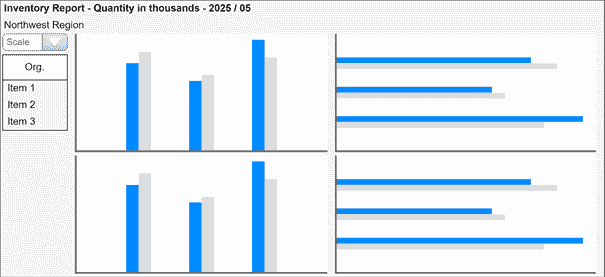
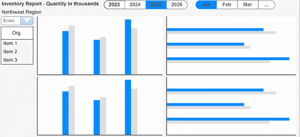
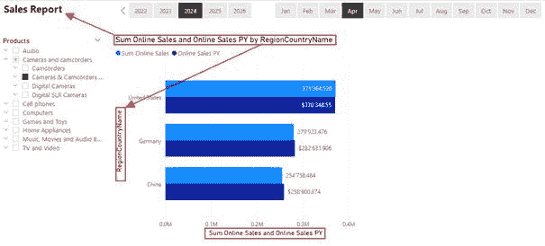
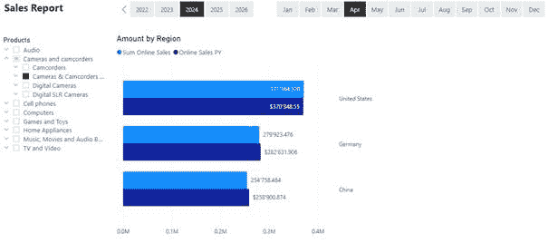
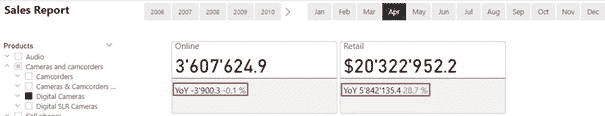
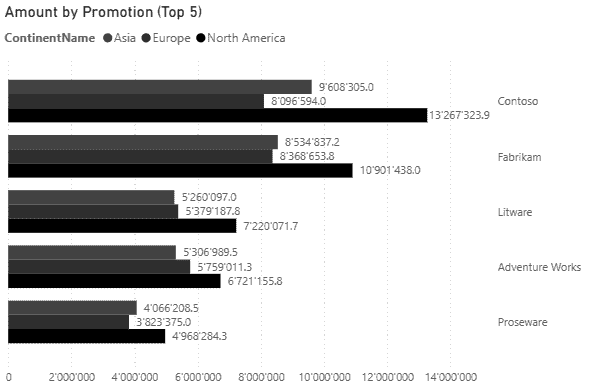
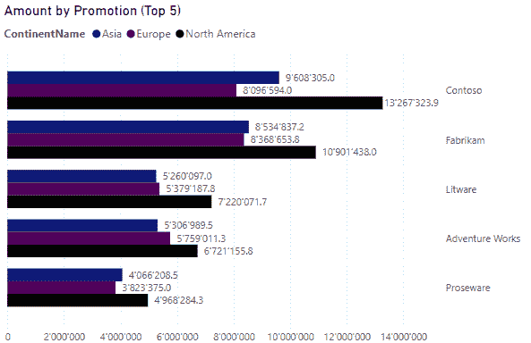
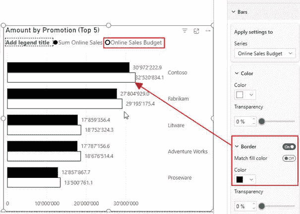

# 在 Power BI 中实施 IBCS 规则

> 原文：[`towardsdatascience.com/implementing-ibcs-rules-in-power-bi/`](https://towardsdatascience.com/implementing-ibcs-rules-in-power-bi/)

图片由[Call Me Fred](https://unsplash.com/@callmefred?utm_content=creditCopyText&utm_medium=referral&utm_source=unsplash)在[Unsplash](https://unsplash.com/photos/white-standard-led-signage-mounted-on-wall-fJSRg-r7LuI?utm_content=creditCopyText&utm_medium=referral&utm_source=unsplash)提供

## 简介

当使用 Power BI 或任何其他工具设计报告时，遵循特定指南至关重要。

IBCS 为此目的提供了一个非常有价值的规则集。

然而，虽然一些规则可以使用 Power BI 功能轻松实现，但其他规则则不能。

一些自定义视觉，如 Zebra BI，在可视化数据时具有符合所有 IBCS 规则的功能。

一些规则可以使用 Power BI 的本地功能集实现。

然而，在可视化数据时，必须以特定方式使用 Power BI 的本地功能集来遵守 IBCS 规则集。

但首先，让我们检查 IBCS 规则集。

## IBCS 规则

IBCS 规则包括 7 条规则：

**S**（ay）你的信息是什么？

**U**（nify）使用一致的符号

**C**（ondense）增强信息密度

**C**（heck）确保可视化遵循共同规则（完整性）

**E**（xpress）不要使用花哨的视觉效果——使用简单的视觉效果

**S**（implify）移除不必要的部分

**S**（tructure）遵循逻辑结构

简而言之：成功。

我已经就这个主题写了一篇文章。您可以在以下链接获取：[`medium.com/cloud-workers/three-simple-rules-for-information-design-52db54864b47`](https://medium.com/cloud-workers/three-simple-rules-for-information-design-52db54864b47)

您可以在此处访问 IBCS 网页：[`www.ibcs.com/ibcs-standards-1-2/`](https://www.ibcs.com/ibcs-standards-1-2/)。

不幸的是，这是一个商业实体，您必须付费才能获得完整的规则集及其相关文档。

我将尽我所能指导您遵循规则，而无需您了解整个规则集。

让我们深入了解规则集的不同方面。

## 1. 标题内容

标题必须描述报告的内容。

用户必须能够通过阅读标题来理解他们正在查看的内容。

因此，标题必须包含以下信息：

+   主题

+   业务单元

    呈现的数字是哪个业务单元的？

+   单位和缩放

    例如，EUR、USD、单位数量等，如果应用了缩放，例如 tEUR，如果数字代表数千欧元（除以 1,000）。

+   时间范围和比较场景

    例如，对于 2024 年和 PY 或 2025 年和 FC（预测）

由于我们处理的是动态内容，这些内容会根据用户在切片器中的选择而变化，我们必须实现动态标题。

我建议设置主题的主要标题、业务单元的副标题、缩放和时间段：

图 1 – 动态标题和副标题的示例 1，以及相应的切片器（图由作者提供）

我省略了在副标题中添加缩放的功能，因为选择它的切片器直接位于其下方。这是一个常见的技巧，用于避免标题或副标题过长。

如您所见，我在报告中添加了浅灰色背景。我使用这个来突出视觉和切片器。

你可以通过在报告顶部添加年份和月份的切片器来扩展减少标题长度的技巧。这样，所选期间与页面标题一起可见，我们可以避免动态标题的冗余和复杂性：

图 2 – 动态标题和在使用标题附近的切片器显示所选期间的示例（图由作者提供）

### 1.1 动态标题

如前所述，用户能够从标题或副标题中看到他们正在查看的内容是至关重要的。

我们必须使用 DAX 表达式创建动态标题，以在标题或副标题中显示用户对切片器的选择。

我已经就这个话题写了一篇文章：[`medium.com/microsoft-power-bi/creating-dynamic-texts-based-on-hierarchies-in-power-bi-97ff6cf3517e`](https://medium.com/microsoft-power-bi/creating-dynamic-texts-based-on-hierarchies-in-power-bi-97ff6cf3517e)

在那里，我描述了如何处理不同的场景，包括从层次结构创建动态标题。

## 2. 避免冗余

一般而言，冗余是个坏主意。

为什么重复你已经拥有的内容呢？

唯一的原因是出于安全或运营原因。

存储数据在冗余存储中是个好主意。这确保了如果数据在一个位置损坏，它仍然可以在另一个位置可用。

但在报告领域，冗余仍然是个坏主意。

一些想法：

+   如果报告的标题是“销售报告”，为什么要在同一页面的视觉标题中添加“随时间销售”？

+   如果一条或一列图表在 X 轴上显示了月份名称，为什么要在标题中添加“随时间”或“每月”这样的句子？

+   如果没有它内容也能理解，为什么还要保持轴标题可见？

+   如果你按地点显示销售，请从报告和视觉标题中删除任何关于地点的冗余提及。

这些只是报告中可能引起冗余的几个例子。

我的建议：在完成报告的设计后，检查它是否存在冗余。在移除冗余后，询问报告的消费者他们是否理解你在报告中展示的内容。

记住：消费者是聪明的个体，他们可以在没有冗长描述的情况下弄清楚他们正在看什么。

让我们看看一个不好的例子：

图 3 – 这是一个包含冗余的糟糕示例。它们用红色标出。你能找到更多冗余吗？（图由作者绘制）

你可以看到“销售”一词重复了三次

1.  在主标题中

1.  在视觉标题中

1.  在 X 轴标题中

同样适用于国家标签。

当我移除所有冗余时，它看起来可能像这样：

图 4 – 移除所有冗余后的更简洁版本（图由作者绘制）

现在你可以看到移除冗余后的样子。

注意，我已将“金额”添加到视觉标题中，以确保消费者理解这是关于金钱的。如果需要，请添加货币。

如果是关于销售文章数量的，我会添加“数量”。

顺便说一句，你可能已经注意到上述报告中缺少了一些东西。你看到了什么吗？

。

。

。

我没有包括第一章节中描述的标题和副标题。

这是因为时间限制。对此表示歉意。

## 3. 消息是什么？

每个报告（页面）的中心应该有一个消息。

可能的消息是什么？

+   与上一年相比的销售金额差异

+   或者与计划数量相比，如预测或任何其他计划数字

+   一个区域与整个公司相同度量标准的汇率

最后，一切都是关于比较一个值与参考值，以赋予数字意义。

我的一个客户想比较各部门员工流动率与整个公司的相同比率。

每个部门经理都能看到他是否比整个公司做得更好或更差。

Power BI 提供了两个视觉来展示这一点：

+   KPI 视觉

+   新的卡片视觉（截至写作时的预览版）

让我们看看我们可以用新的卡片视觉做什么：

图 5 – 新卡片与参考标签和详细信息的可能用法示例（图由作者绘制）

我突出了用于与上一年比较的“数码相机”产品组的两个参考和详细值。

当放在页面顶部时，消费者将立即看到两个销售渠道的表现，而无需查看包含太多细节的折线图。

有时这足以提供销售总监或其他经理所需的信息。

我们可以在这两个数字下方放置详细的图表或表格。消费者可以决定图表上的信息是否有趣。

不幸的是，尽管这个视觉已经可用近两年，并且仍然处于预览状态，但微软的文档并没有更新。

观看此视频以详细了解新卡片：

以及这个来查看最新的功能添加：

然而，你仍然可以使用经典的 KPI 视觉来完成这个目的。

这里的重点不是展示如何使用这个“新”卡片视觉。

现在的关键是要突出显示对受众最重要的数字，并以清晰易读的格式呈现。

想想你是如何阅读新闻的。

你从标题开始。如果你对细节感兴趣，你会继续阅读全文。如果不感兴趣，你可以继续。这是正常的人类行为，我们在设计报告时应该考虑这一点。

## 4. 着色柱状图和条形图

最后但同样重要的是，让我们谈谈颜色。

根据 IBCS，柱状图和条形图应按照以下规则着色：

+   深灰色用于当前数据（实际年份或时期）

+   浅灰色用于上一年或上一时期

+   对角线阴影用于预测数据

+   白色带黑色边框用于计划或预算数据

其他颜色使用如下：

+   黑色用于文本、坐标轴和线条

+   绿色用于正偏差

+   蓝绿色用于为视力受损或色盲用户设计的正偏差

+   红色用于负偏差

+   中灰色用于中性偏差（当偏差既不好也不坏时）

    当偏差在 -3% 和 3% 之间时，我使用了这种方法

+   蓝色用于突出显示某些内容

虽然大多数规则都有意义，但有些则不然。

例如，比较两个类别时，你可以使用什么颜色？

例如：当比较来自不同大洲的当前数据时：

图 6 – 所有黑色条的示例（图由作者提供）

这样做，虽然符合 IBCS 标准，但你无法区分三个大洲。

这可以是一种另一种方式：

图 7 – 带有轻微着色条的示例（图由作者提供）

这更好，因为它可以在避免使用过于鲜艳的颜色的情况下，清楚地区分大洲。

现在，看看下面的图片，它显示了相同的视觉效果，但以灰度显示：

图 8 – 以灰度显示的相同条形图（图由作者提供）

即使阅读起来更困难，仍然有可能做到。

这可能是视力受损者可能会看到的东西。

当考虑你的所有受众时，这是一项重要的测试，以确保每个人都能阅读和理解数据。

当比较多个类别时，将会更具挑战性。

一个问题仍然存在：如何显示带阴影的条形图或柱状图？

到目前为止，在 Power BI 中这还不可能实现，我没有找到解决方案。与你的利益相关者交谈，以定义一个可行的解决方案。

我会使用灰色调来显示预测数据。这并不标准，但这是吸引注意力的方法。

但是，以正确的方式展示预算数据是可能的：

图 9 – 如何配置带有黑色边框的白色条形图以显示预算数据（图由作者提供）

如你所见，这非常容易做到。

一位客户将深蓝色作为主要公司颜色。我们使用这种颜色代替黑色来表示当前年份的数据。

不清楚的是，当用户选择前一年时如何处理颜色。

数据将不再显示当前结果，而是显示（选定的）前一年的数据。

在所有情况下，我们并没有在这些案例之间做出区分。

当前年份始终是选定的年份。

这是有意义的，因为 IBCS 没有定义前一年之前将使用哪种颜色。

还有一个问题：着色规则导致报告外观相对单调。我在实施这些规则时遇到了几次这种情况。

大多数时候，我们在避免使用过多颜色的同时，稍微偏离这些规则。在“正确的方式”和过度使用颜色之间有一条细线。

最重要的是定义一个颜色标准并坚持使用它。确保在相同的场景和情况下使用颜色时保持一致。

## 结论

IBSC 是一个非常有趣的规则集。

这样可以简化生活，因为它为我们提供了如何设计报告和确保良好可用性的指导。但是，Power BI 并没有实现规则集所需的所有功能。

我省略了一些其他细节，这会让生活变得更加困难。

有符合 IBCS 标准的自定义视觉，它们非常有帮助，因为它们提供了一个简单的方式来显示偏差，而无需为它们创建度量。

两个领先的提供商是 Zebra BI 和 xViz，他们拥有 Inforiver Visuals。

还有其他自定义视觉，例如来自 3AG 的那些，它们提供了一些对标准的覆盖。

如果您想踏上全面符合 IBCS 的道路，您可以访问他们的网站了解更多信息。

我在这里的目标是展示您可以使用 Power BI 的内置功能实现什么。

我希望您学到了一些东西。

## 参考文献

IBCS 网站可以在这里找到：[`www.ibcs.com/`](https://www.ibcs.com/)

您可以在这里探索 Zebra BI Visuals：[`zebrabi.com/`](https://zebrabi.com/)

这是 xViz 的网站，包括他们的产品套件：[`inforiver.com/`](https://inforiver.com/)

就像我之前的文章一样，我使用了 Contoso 样本数据集。您可以从 Microsoft [这里](https://www.microsoft.com/en-us/download/details.aspx?id=18279)免费下载 ContosoRetailDW 数据集。

根据描述的 [此文档](https://github.com/microsoft/Power-BI-Embedded-Contoso-Sales-Demo)，Contoso 数据可以在 MIT 许可证下自由使用。我将数据集更改以将数据转移到当代日期。
