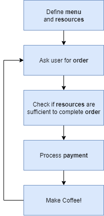
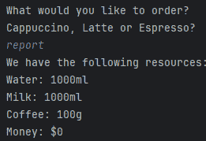

# 在 Python 中实现咖啡机

> 原文：[`towardsdatascience.com/implementing-the-coffee-machine-in-python/`](https://towardsdatascience.com/implementing-the-coffee-machine-in-python/)

<mdspan datatext="el1757108399122" class="mdspan-comment">Python 是一种非常容易的编程语言，它封装了多样性和包含复杂代码的潜力。虽然有许多针对初学者友好的基于 Python 的编码项目和教程，但在这篇文章中，我们将学习如何在 Python 中构建咖啡机程序。这篇文章将提供对条件语句、循环和 Python 字典的理解和实践，并将作为复杂编码的基础（在后续文章中）。

## 理解项目要求

首先，让我们尝试了解程序将如何工作，基本要求是什么，我们需要哪些变量和条件，以及咖啡制作机的范围。

程序将按以下方式运行：程序将显示菜单项并询问用户是否想要饮料。用户可以选择他们喜欢的饮料。

如果用户选择饮料，我们必须确保我们的咖啡机有足够的资源来制作咖啡。如果有，我们将继续前进。否则，我们将通知用户。

如果资源足够，我们将要求用户以镍币、便士、一角和 quarter 的形式支付。我们将计算支付金额与成本之间的差额。如果支付完成，我们将制作咖啡并提供服务。如果支付的金额超过咖啡的价格，我们将退还他们找零。否则，如果支付的金额低于价格，我们将拒绝订单并退还他们的硬币。

我们将添加一个异常，即如果管理层的人想知道剩余的资源，或者机器在完成订单后存储的金钱，他们可以通过输入“report”来访问这些信息。此外，如果管理层想要完全关闭机器，他们可以通过输入“off”来实现。

让我们用流程图来定义所有这些：



流程图（图片由作者提供）

## 第一步：定义菜单和资源

编写这个咖啡机项目的第一步是定义菜单以及机器准备任何订单所需的资源。在我们的例子中，我们将有 3 个菜单项：拿铁、浓缩咖啡和卡布奇诺。

我们将使用 Python 字典来定义菜单变量。一个[Python 字典](https://docs.python.org/3/tutorial/datastructures.html#dictionaries)是一种有用的数据类型，它通过键存储数据，这两个键都很容易访问。菜单变量将是一个字典，不仅存储 3 个菜单项，即拿铁、卡布奇诺和浓缩咖啡，还描述了制作它们所需的成分和价格。让我们编写上述代码：

```py
menu = {
    "espresso": {
        "ingredients": {
            "water": 50,
            "milk" : 0,
            "coffee": 20,
        },
        "price": 1.5,
    },
    "latte": {
        "ingredients": {
            "water": 150,
            "milk": 200,
            "coffee": 25,
        },
        "price": 2.5,
    },
    "cappuccino": {
        "ingredients": {
            "water": 250,
            "milk": 100,
            "coffee": 25,
        },
        "price": 3.0,
    }
}
```

下一个任务是定义我们拥有的资源。这些是制作不同类型咖啡所需的资源，以及通过销售咖啡产生的金钱。

```py
resources = {
    "water": 1000,
    "milk": 1000,
    "coffee": 100,
    "money": 0
}
```

如您所见，我们有每种原料的具体数量作为我们的资源，以及 0 金钱，因为没有咖啡被最初卖出。

## 第 2 步：询问用户订单

下一步是询问用户他们想要订购什么。我们将使用[Python 输入函数](https://docs.python.org/3/library/functions.html#input)来完成这个任务。此外，我们将输入字符串转换为小写，这样它将更容易在我们的后续条件中匹配。

```py
order = input("What would you like to order?\n Cappuccino, Latte or Espresso?\n").lower() 
```

## 第 3 步：使用条件添加特殊情况

接下来，我们将添加 2 个特殊情况。第一个情况是，如果管理层想要完全关闭机器，他们将输入`off`作为上述语句的输入，机器将关闭，或者说，程序将结束。我们将为此定义一个变量，称为`end`，它最初为`False`，当管理层想要关闭机器时将变为`True`。

我们在这里将添加的另一个情况是，当管理层想要了解咖啡机中的资源时，他们将输入`report`，机器将打印出可用资源的报告。让我们将这些情况放入代码中：

```py
if order == 'off':
    end = True
elif order == 'report':
    print(f"We have the following resources:\nWater: {resources['water']}ml\nMilk: {resources['milk']}ml\nCoffee: {resources['coffee']}g \nMoney: ${resources['money']}")
```

注意，我们使用了`\n`和[f-string](https://docs.python.org/3/tutorial/inputoutput.html#fancier-output-formatting)来正确格式化报告。结果将是：



报告（图片由作者提供）

## 第 4 步：检查资源

下一步是检查制作咖啡所需的资源。如果一个浓缩咖啡需要 50 毫升的水和 20 克的咖啡，如果这两种原料中的任何一种不足，我们就不能继续制作咖啡。只有当原料都齐备时，我们才会继续制作咖啡。

这段代码将会很长，我们将逐个检查每种原料是否在我们的资源中：

```py
if resources['water'] >= menu[order]['ingredients']['water']:
    if resources['milk'] >= menu[order]['ingredients']['milk']:
        if resources['coffee'] >= menu[order]['ingredients']['coffee']:
            #We will prepare order
        else:
            print("\nResources insufficient! There is not enough coffee!\n")
    else:
        print("\nResources insufficient! There is not enough milk!\n")
else:
    print("\nResources insufficient! There is not enough water!\n")
```

只有当检查了 3 个条件后，我们才会继续制作咖啡；否则，将打印出哪些原料不足。同时，我们必须确保用户已经支付了订单的价格。让我们来做这件事。

## 第 5 步：询问并计算付款

对于上述条件，即所有资源都可用，下一步是要求用户支付价格。一旦付款完成，我们将制作咖啡。

```py
print(f"Pay ${menu[order]['price']}\n")
```

现在我们将要求用户投入硬币（我们的咖啡机有点过时了，所以请忍受硬币的叮当声 :P）。我们将询问他们投入的硬币，计算总数，然后将其与订单的价格进行比较。


（照片由 [Erik Mclean](https://unsplash.com/@introspectivedsgn?utm_content=creditCopyText&utm_medium=referral&utm_source=unsplash) 在 [Unsplash](https://unsplash.com/photos/silver-and-gold-round-coins-OyU29jm2m2U?utm_content=creditCopyText&utm_medium=referral&utm_source=unsplash) 上提供）

投入咖啡机的硬币有 4 种不同类型：

+   一分硬币 = $0.01

+   五分硬币 = $0.05

+   十分硬币 = $0.10

+   二十五分硬币 = $0.25

总金额将通过将硬币类型数量乘以其值来计算。请确保将输入转换为 int 类型；否则，您将遇到错误。

```py
print("Insert coins")
                p = int(input("Insert pennies"))
                n = int(input("Insert nickels"))
                d = int(input("Insert dimes"))
                q = int(input("Insert quarters"))
                total = (p * 0.01) + (n * 0.05) + (d * 0.10) + (q * 0.25)
```

接下来，需要检查计算出的总金额是否等于所选咖啡的价格？以下是我们的编码方式：

```py
if total == menu[order]['price']:
    print("Transaction successful. Here is your coffee!")
elif total > menu[order]['price']:
    change = total - menu[order]['price']
print(f"You have inserted extra coins. Here is your change ${change}\n")
    else:
print("Payment not complete. Cannot process order")
```

只有当金额等于咖啡的价格时，交易才算成功。如果总金额大于价格，我们需要将找零退还给用户。否则，如果总金额低于价格，我们将取消订单。

## 第 6 步：制作咖啡

最后一步是将咖啡分发给用户，在我们的编码世界中，我们将通过更新资源字典中的成分和金钱来实现这一点。

```py
if total == menu[order]['price']:
    resources['water'] = resources['water'] - menu[order]['ingredients']['water']
    resources['coffee'] = resources['coffee'] - menu[order]['ingredients']['coffee']
    resources['milk'] = resources['milk'] - menu[order]['ingredients']['milk']
    resources['money'] = resources['money'] + menu[order]['price']
    print("Transaction successful. Here is your coffee!")
```

注意，成分从资源中扣除，同时金钱被添加。因此，我们的资源字典在每次订单交付时都会更新。当有额外金额需要找零时，也会添加相同的条件。

## 第 7 步：程序连续性

在咖啡订单处理完毕后，只要管理层没有命令咖啡机关机，机器将继续要求用户下咖啡订单，处理付款，更新资源，并分发咖啡。因此，我们将包含一个 while 循环以确保在饮料分发后程序继续运行。

我们在上面编写的整个代码块将包含在这个 while 循环中：

```py
while end != True:
    order = input("\nWhat would you like to order?\nCappuccino, Latte or Espresso?\n").lower()

    if order == 'off':
        end = True
    elif order == 'report':
        print(f"We have the following resources:\nWater: {resources['water']}ml\nMilk: {resources['milk']}ml\nCoffee: {resources['coffee']}g \nMoney: ${resources['money']}")

    elif resources['water'] >= menu[order]['ingredients']['water']:
        if resources['milk'] >= menu[order]['ingredients']['milk']:
            if resources['coffee'] >= menu[order]['ingredients']['coffee']:
                    print(f"Pay ${menu[order]['price']}\n")

                    # TODO : Coins insert
                    print("Insert coins")
                    p = int(input("Insert pennies"))
                    n = int(input("Insert nickels"))
                    d = int(input("Insert dimes"))
                    q = int(input("Insert quarters"))
                    total = (p * 0.01) + (n * 0.05) + (d * 0.10) + (q * 0.25)

                    if total == menu[order]['price']:
                        resources['water'] = resources['water'] - menu[order]['ingredients']['water']
                        resources['coffee'] = resources['coffee'] - menu[order]['ingredients']['coffee']
                        resources['milk'] = resources['milk'] - menu[order]['ingredients']['milk']
                        resources['money'] = resources['money'] + menu[order]['price']
                        print("Transaction successful. Here is your coffee!")
                    elif total > menu[order]['price']:
                        change = total - menu[order]['price']
                        print(f"You have inserted extra coins. Here is your change ${change}\n")
                    else:
                        print("Payment not complete. Cannot process order")

            else:
                print("\nResources insufficient! There is not enough coffee!\n")
        else:
            print("\nResources insufficient! There is not enough milk!\n")
    else:
        print("\nResources insufficient! There is not enough water!\n")
```

## 结论

我们已经成功将咖啡机的工作原理转换为 Python 代码。在本项目的整个过程中，我们探讨了字典及其访问、条件语句和 while 循环。虽然相当直接，但我们可以通过其他技术如面向对象编程（下次项目的主题）进一步简化这个项目。请分享您对这个项目的反馈以及任何改进建议。在此期间，请享受您的咖啡！


（照片由 [Nathan Dumlao](https://unsplash.com/@nate_dumlao?utm_content=creditCopyText&utm_medium=referral&utm_source=unsplash) 在 [Unsplash](https://unsplash.com/photos/two-white-ceramic-mugs-on-brown-chopping-boards-gOn7dKcCWKg?utm_content=creditCopyText&utm_medium=referral&utm_source=unsplash) 上提供）

在这里访问完整代码：[`github.com/MahnoorJaved98/Coffee-Machine/blob/main/Coffee%20Machine%20-%20Python.py`](https://github.com/MahnoorJaved98/Coffee-Machine/blob/main/Coffee%20Machine%20-%20Python.py)
