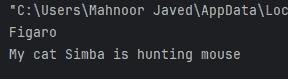
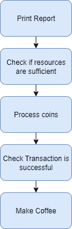
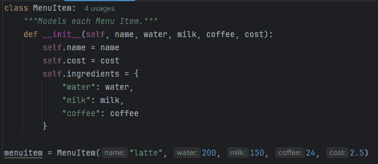
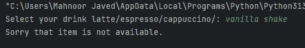

# 使用面向对象编程在 Python 中实现咖啡机项目

> 原文：[`towardsdatascience.com/implementing-the-coffee-machine-project-in-python-using-object-oriented-programming/`](https://towardsdatascience.com/implementing-the-coffee-machine-project-in-python-using-object-oriented-programming/)

## 简介

<mdspan datatext="el1757961260162" class="mdspan-comment">咖啡机项目</mdspan>是一个简单的动手项目，允许在 Python 中练习循环、条件等。项目很简单；我们有一个咖啡机，用户可以订购不同类型的咖啡，以及制作它们所需的原料和价格标签。用户订购咖啡饮料，用硬币支付，机器计算总额，如果支付完成，则提供咖啡。为了更好地理解这个项目，请查看我已发布的关于 Towards Data Science 的文章：**[在 Python 中使用面向对象编程实现咖啡机](https://towardsdatascience.com/implementing-the-coffee-machine-in-python/)**

在这篇文章中，我们将构建 Python 版本的面向对象咖啡机。

## 什么是面向对象编程？

面向对象编程是一种基于创建类和对象的编程概念。简单来说，一个**类**是一个模板或蓝图，一个定义广泛的类别，而**对象**是从这些类中创建的个体结构。在面向对象编程中，类定义了所有从这个类中产生的对象将具有的某些特征，这些被称为**属性**。此外，类还定义了它能够执行的一些功能。在面向对象术语中，这些被称为**方法**。

假设我们定义一个名为“Cats”的类。这是一个广泛的类别，将包括所有类型的猫作为其对象：我的猫菲加罗，邻居的猫辛巴等。每只猫都会有一些个体特征，如它们的名称、眼睛颜色、它们的品种等。这些将被编码为它们的属性。此外，它们还将具有特定的功能，如狩猎、睡眠、玩耍、喵喵叫等。这些将被编码为它们的方法。

以下是如何编码类和对象的示例：

```py
class Cat:
    def __init__(self, name, eye_color, fur_color, breed, age, length):
        self.name = name 
        self.eye_color = age 
        self.fur_color = fur_color
        self.breed = breed
        self.age = age
        self.length = length

    def hunt(self, animal):
        print(f"My cat {self.name} is hunting a {animal}")

my_cat = Cat("Figaro", "blue", "black and white", "Persian", "2", "48")
print(my_cat.name)

neighbour_cat = Cat("Simba", "hazel", "brown", "Siamese", "3", "50")
neighbour_cat.hunt("mouse")
```



理解类、对象、属性和方法（图片由作者提供）

我们将使用上述概念和功能来构建一个面向对象的咖啡机版本。

## 项目运作

在我之前关于咖啡机的文章中，我详细解释了这个项目的运作原理。这个项目在运作上将与之前类似，只不过我们将利用面向对象编程来实现相同的结果。总体来说，我们有以下步骤：



流程图（图片由作者提供）

## 为我们的咖啡机定义类

这个项目的第一步是逐一定义我们的类，然后我们将使用这些蓝图来定义整个项目中需要的对象。

#### 定义“MenuItem”类

首先，我们将定义 `MenuItem` 类，它将模拟我们菜单中的每个项目，并将使用从它创建的对象在下一个我们将创建的 `Menu` 类中使用。

```py
class MenuItem:
    def __init__(self, name, water, milk, coffee, cost):
        self.name = name
        self.cost = cost
        self.ingredients = {
            "water": water,
            "milk": milk,
            "coffee": coffee
        }
```

假设我们想要创建一个 `menuitem` 类的 `MenuItem` 对象。在这种情况下，我们需要给它以下参数：项目的名称，制作这个菜单项所需的水量，制作这个菜单项所需的牛奶量，制作这个菜单项所需的咖啡量，以及这个菜单项的成本。



从 `MenuItem` 类创建的 `menuitem` 对象（图片由作者提供）

这个 `MenuItem` 类将被用来初始化对象。

#### 定义“菜单”类

接下来，让我们定义一个名为 `Menu` 的类，它将包含可以订购的每个项目的详细信息。`menu` 对象可以通过以下构造函数进行初始化，并且这个类的菜单属性将是一个列表，包含从我们之前构造的 `MenuItem` 类构造的对象的 3 个项目。我们将从这个类中构造 3 个对象，并使用其定义的参数。例如，latte 对象将需要 200 毫升的水，150 毫升的牛奶和 24 克的咖啡，成本为 2.5 美元。所有这些都将被建模在 `Menu` 类的构造函数内部，该构造函数将用于初始化这个类的对象。`__init__` 方法总是在我们创建对象时被调用。

```py
class Menu:
    def __init__(self):
        self.menu = [
            MenuItem(name="latte", water=200, milk=150, coffee=24, cost=2.5),
            MenuItem(name="espresso", water=50, milk=0, coffee=18, cost=1.5),
            MenuItem(name="cappuccino", water=250, milk=50, coffee=24, cost=3),
        ] 
```

现在我们有了菜单属性，我们也将定义其中的两个方法。一个是返回可用菜单项的名称 `get_items`，另一个方法 `find_drink` 是通过输入函数找到用户选择的饮料。

```py
class Menu:
...

    def get_items(self):
        options = ""
        for item in self.menu:
            options += f"{item.name}/"
        return options

    def find_drink(self, order_name):
        for item in self.menu:
            if item.name == order_name:
                return item
        print("Sorry that item is not available.")
```

#### 从“菜单”类创建对象

为了使用这个类及其相关的属性和方法，我们首先初始化一个 `Menu` 类的 `menu` 对象。然后我们将使用 `get_items` 方法向用户显示我们菜单中的项目。

```py
menu = Menu()
drinks = menu.get_items()
drink_selected = input(f"Select your drink {drinks}: ")

menu.find_drink(drink_selected)
```

一旦用户输入了他们的饮料，我们将使用 `Menu` 类的 `find_drink` 方法检查它是否存在于菜单对象中。这个方法检查用户输入是否存在于菜单中，如果存在，它将返回该项目，否则它将向用户打印出饮料不可用。



菜单类方法（图片由作者提供）

因此，如果我们下了一个香草奶昔的订单，程序将简单地打印出该项目不可用。当输入的饮料在我们的定义菜单中存在时，`find_drink` 方法将返回该项目。现在我们可以在我们接下来的编码中使用这个项目。

#### 定义“咖啡机”类

我们下一步是定义 `CoffeeMaker` 类。`CoffeeMaker` 类将存储事先指定的资源，并且将有 3 个方法，其对象可以被使用：

1.  `report` 方法：这个方法将允许管理层通过打印所有资源的报告来检查咖啡机中的资源。

1.  `is_resources_sufficient` 方法：此方法将检查咖啡机中的资源是否足够制作所需的饮料。如果资源充足，则返回 `True`；否则，将通知用户哪些资源不足。

1.  `make_coffee` 方法：当程序的需求得到满足，我们需要煮咖啡时，将调用最后一个方法。这段代码将扣除资源并分配咖啡。

```py
class CoffeeMaker:
    def __init__(self):
        self.resources = {
            "water": 1000,
            "milk": 1000,
            "coffee": 200,
        }

    def report(self):
        print(f"Water: {self.resources['water']}ml")
        print(f"Milk: {self.resources['milk']}ml")
        print(f"Coffee: {self.resources['coffee']}g")

    def is_resource_sufficient(self, drink):
        can_make = True
        for item in drink.ingredients:
            if drink.ingredients[item] > self.resources[item]:
                print(f"Sorry there is not enough {item}.")
                can_make = False
        return can_make

    def make_coffee(self, order):
        for item in order.ingredients:
            self.resources[item] -= order.ingredients[item]
        print(f"Here is your {order.name} ☕️. Enjoy!") 
```

#### 定义“MoneyMachine”类

最后，让我们也定义一个名为 `MoneyMachine` 的类。这个类将负责货币管理。它将处理硬币以检查是否已支付，并将收到的钱添加到钱库中。

`MoneyMachine` 类有以下方法：

1.  `report` 方法：此方法将打印我们账户中的金额。

1.  `process_coins` 方法：此方法将处理以镍币、一角硬币、quarter 和 penny 形式的硬币支付，并计算总额。

1.  `make_payment` 方法：此方法将用于检查支付是否完成，是否支付过多；它将返回找零。

```py
class MoneyMachine:
    CURRENCY = "$"
    COIN_VALUES = {
        "quarters": 0.25,
        "dimes": 0.10,
        "nickles": 0.05,
        "pennies": 0.01
    }

    def __init__(self):
        self.profit = 0
        self.money_received = 0

    def report(self):
        print(f"Money: {self.CURRENCY}{self.profit}")

    def process_coins(self):
        "Please insert coins.")
        for coin in self.COIN_VALUES:
            self.money_received += int(input(f"How many {coin}?: ")) * self.COIN_VALUES[coin]
        return self.money_received

    def make_payment(self, cost):
        self.process_coins()
        if self.money_received >= cost:
            change = round(self.money_received - cost, 2)
            print(f"Here is {self.CURRENCY}{change} in change.")
            self.profit += cost
            self.money_received = 0
            return True
        else:
            print("Sorry that's not enough money. Money refunded.")
            self.money_received = 0
            return False 
```

#### 最终代码

现在我们已经定义了我们的类，我们将编写最终的代码，该代码将询问用户的订单，检查资源是否充足，处理硬币和支付，并在条件满足时分配饮料。所有这些操作都将通过初始化对象来完成。

```py
money_machine = MoneyMachine()
coffee_maker = CoffeeMaker()
menu = Menu()

is_on = True

while is_on:
    options = menu.get_items()
    choice = input(f"What would you like {options}: ")
    if choice == 'off':
        is_on = False
    elif choice == 'report':
        coffee_maker.report()
        money_machine.report()
    else:
        drink = menu.find_drink(choice)
        if coffee_maker.is_resource_sufficient(drink) and money_machine.make_payment(drink.cost):
            coffee_maker.make_coffee(drink)
```

在我们的最终代码中，我们创建了一个持续运行的循环，除非管理层命令停止，否则不会停止。我们使用 `is_on` 布尔变量来完成此操作，当管理层将“off”作为输入到订单提示时，该变量将变为 `False`。

此外，就像我们在没有使用面向对象编程（OOP）的咖啡机项目中做的那样，我们也添加了报告选项，该选项会报告咖啡机中的所有资源和账户中的钱。

程序将按以下方式运行：它将提示用户订购饮料，显示菜单项。如果用户选择的项在列表中，它将首先检查资源是否充足，然后请求支付并检查支付是否完成，然后处理订单。所有这些操作都是通过面向对象的概念，即类和对象来完成的。

## 结论

尽管我们在这个项目中没有完全探索面向对象编程（OOP）的能力，但我们通过引入类并从中创建对象，成功地减少了代码行数。当涉及到具有多个不同对象且共享共同蓝图的项目时，面向对象的概念将更加有用。

尽管如此，这个使用面向对象编程（OOP）的咖啡机项目是一个有用的教程，帮助我们掌握面向对象编程的基础。如果您有任何建议或能想到这个项目的替代任务流程，请随时分享。在此之前，请享受您的咖啡！ 😀


照片由 [Mike Kenneally](https://unsplash.com/@asthetik?utm_content=creditCopyText&utm_medium=referral&utm_source=unsplash) 在 [Unsplash](https://unsplash.com/photos/white-ceramic-mug-and-saucer-with-coffee-beans-on-brown-textile-tNALoIZhqVM?utm_content=creditCopyText&utm_medium=referral&utm_source=unsplash) 提供
