# Python 中数值实现傅里叶变换：一步一步指南

> 原文：[`towardsdatascience.com/implementing-the-fourier-transform-numerically-in-python-a-step-by-step-guide/`](https://towardsdatascience.com/implementing-the-fourier-transform-numerically-in-python-a-step-by-step-guide/)
> 
> 为了充分利用这篇论文，你应该对**积分**和**傅里叶变换**及其性质有一个基本的了解。
> 
> 如果不熟悉，我们建议阅读**第一部分**，其中回顾了这些概念。
> 
> 如果你已经熟悉它们，你可以直接跳到**第二部分**。
> 
> 在**第 2.1 节**中，我们使用**数值求积法**实现**傅里叶变换**。
> 
> 在**第 2.2 节**中，我们使用**快速傅里叶变换（FFT）算法**和**香农插值公式**来实现它。

<mdspan datatext="el1761023602369" class="mdspan-comment">这篇论文的写作想法是在我们工程学校最后一年的时候产生的。</mdspan>

作为一门关于**随机过程校准**课程的组成部分，我们的教授想要测试我们对材料的理解。为此，我们被要求选择一篇学术论文，详细研究它，并重新生成其结果

我们选择了 El Kolei (2013)的论文，该论文提出了一种**参数方法**来估计**随机波动模型**（如 GARCH 模型）的参数。该方法基于**对比最小化**和**反卷积**。

为了重新生成结果，我们需要实现一种**优化方法**，该方法涉及计算函数 f[θ]的**傅里叶变换** f̂：

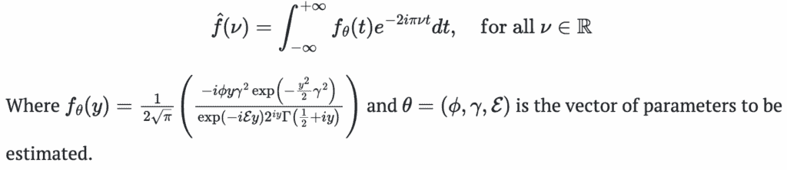

为了计算 f[θ]的傅里叶变换，*El Kolei (2013)*使用了**左黎曼和**（也称为矩形求积）方法，该方法在 MATLAB 中实现。论文建议使用**快速傅里叶变换（FFT）算法**可以使计算更快。

我们决定使用**Python**重新生成结果，并实现了傅里叶变换来测试它是否真正提高了计算速度。实现左矩形求积法很简单，起初我们认为`scipy.fft`和`numpy.fft`库将允许我们直接使用 FFT 算法计算 f[θ]的傅里叶变换。

然而，我们很快发现这些函数**不**计算连续函数的傅里叶变换。相反，它们计算有限序列的**离散傅里叶变换（DFT）**。

下面的图显示了我们所观察到的。

```py
import numpy as np
import matplotlib.pyplot as plt
from scipy.fft import fft, fftfreq, fftshift

# Define the function f(t) = exp(-pi * t²)
def f(t):
    return np.exp(-np.pi * t**2)

# Parameters
N = 1024
T = 1.0 / 64
t = np.linspace(-N/2*T, N/2*T, N, endpoint=False)
y = f(t)

# FFT with scipy
yf_scipy = fftshift(fft(y)) * T
xf = fftshift(fftfreq(N, T))
FT_exact = np.exp(-np.pi * xf**2)

# FFT with numpy
yf_numpy = np.fft.fftshift(np.fft.fft(y)) * T
xf_numpy = np.fft.fftshift(np.fft.fftfreq(N, T))

# Plot with subplot_mosaic
fig, axs = plt.subplot_mosaic([["scipy", "numpy"]], figsize=(7, 5), layout="constrained", sharey=True)

# Scipy FFT
axs["scipy"].plot(xf, FT_exact, 'k-', linewidth=1.5, label='Exact FT')
axs["scipy"].plot(xf, np.real(yf_scipy), 'r--', linewidth=1, label='FFT (scipy)')
axs["scipy"].set_xlim(-6, 6)
axs["scipy"].set_ylim(-1, 1)
axs["scipy"].set_title("Scipy FFT")
axs["scipy"].set_xlabel("Frequency")
axs["scipy"].set_ylabel("Amplitude")
axs["scipy"].legend()
axs["scipy"].grid(False)

# NumPy FFT
axs["numpy"].plot(xf_numpy, FT_exact, 'k-', linewidth=1.5, label='Exact FT')
axs["numpy"].plot(xf_numpy, np.real(yf_numpy), 'b--', linewidth=1, label='FFT (numpy)')
axs["numpy"].set_xlim(-6, 6)
axs["numpy"].set_title("NumPy FFT")
axs["numpy"].set_xlabel("Frequency")
axs["numpy"].legend()
axs["numpy"].grid(False)

plt.suptitle("Comparison of FFT Implementations vs. Exact Fourier Transform", fontsize=14)
plt.show()
```

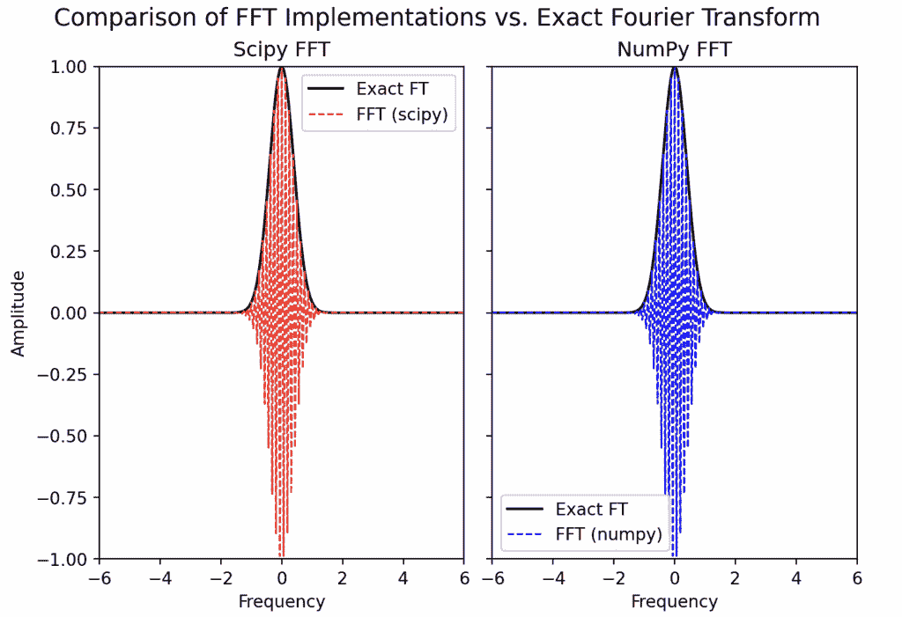

这次经历激励我们撰写这篇文章，我们将解释如何在 Python 中使用两种方法计算函数的傅里叶变换：左黎曼和法和快速傅里叶变换（FFT）算法。

在文献中，许多论文讨论了如何近似傅里叶变换以及如何使用数值方法实现它。

然而，我们没有找到像**Balac (2011**)那样清晰和完整的资料。这项工作提出了一种**基于求积法**的傅里叶变换计算方法，并解释了如何使用**快速傅里叶变换 (FFT**)算法高效地执行离散傅里叶变换。

快速傅里叶变换算法可以用来计算**可积函数**的傅里叶变换，也可以用来计算**周期函数**的傅里叶系数。

## 1. 傅里叶变换的定义和性质

我们采用 Balac (2011)提出的框架来定义函数 f 的傅里叶变换及其性质。

我们考虑属于可积函数空间的函数，该空间用**L¹(ℝ, 𝕂**)表示。这个空间包括所有**f: ℝ → 𝕂**的函数，其中**𝕂**代表实数（ℝ）或复数（ℂ）。

这些函数在勒贝格意义上是可积的，这意味着它们的绝对值积分是有限的。

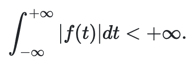

因此，为了使函数**f**属于**L¹(ℝ, 𝕂**)，函数**f(t) · e**^(–**2iπνt**)也必须在所有**ν ∈ ℝ**上可积。

在那种情况下，**f**的**傅里叶变换**，记为**f̂**（有时也记为**𝓕(f)**），对所有**ν ∈ ℝ**定义为：

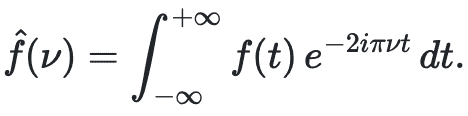

我们注意到，函数**f**的傅里叶变换**f̂**是一个依赖于频率**ν**的复值线性函数。

如果**f ∈ L¹(ℝ**)是实值且偶函数，那么**f̂**也是实值且偶函数。反之，如果**f**是实值且奇函数，那么**f̂**也是纯虚数且奇函数。

对于某些函数，其傅里叶变换可以通过解析方法计算。例如，对于函数

**f : t ∈ ℝ ↦ 𝟙 [**[−a⁄2, a⁄2]**](t)**,

傅里叶变换表示为：

**f̂(ν) = a sinc(a π ν)**

**其中  是 sinc(t) = sin(t)/t 或** **t ∈ ℝ**^***，且**sinc(0) = 0**。**

然而，对于许多函数，其傅里叶变换不能通过解析方法计算。在这种情况下，我们使用数值方法对其进行近似。我们将在本文的后续章节中探讨这些数值方法。

## 2. 如何数值近似傅里叶变换？

在他的文章中，**Balac (2011**)表明，计算函数的傅里叶变换涉及通过以下区间**[−T⁄2, T⁄2]**上的积分对其进行近似：

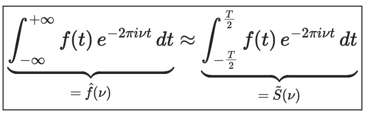

其中 T 是一个足够大的数，使得积分收敛。可以使用**求积法**计算积分**S̃(ν**)的近似值。

在下一节中，我们将使用**左矩形求积法**（也称为**左黎曼和**）来近似这个积分。

## 2.1 左矩形求积法

使用**左矩形求积法**计算积分**S̃(ν**)的步骤如下：

1.  **区间的离散化**

    我们将区间**[−T⁄2, T⁄2]**划分为**N**个长度为**h[t] = T⁄N**的均匀子区间。

    对应于矩形**左端点**的离散点定义为：

**t[k] = −T⁄2 + **h[t]**, 对于 k = 0, 1, …, N−1。

1.  **积分近似**

    使用**Chasles 关系**，我们如下近似积分**S̃(ν)**：

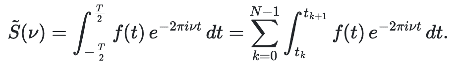

由于**tₖ₊₁ − tₖ = hₜ**和**tₖ = −T⁄2 + k·hₜ = T(k⁄N − ½)**，表达式变为：

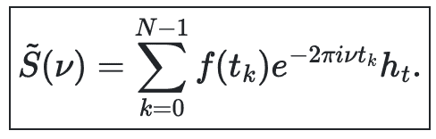

我们将这种方法称为左矩形求积法，因为它利用每个子区间的**左端点*****tₖ***来近似该区间内 f(t)的值。

1.  **最终公式**

    近似傅里叶变换的最终表达式如下：

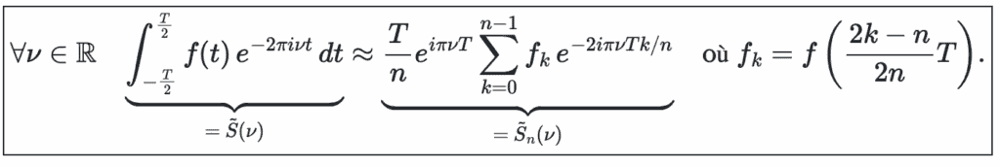

### 2.1.1 Python 中左矩形求积法的实现。

下面的函数`tfquad`实现了**左矩形求积法**来计算函数**f**在给定频率**nu**处的**傅里叶变换**。

```py
import numpy as np

def tfquad(f, nu, n, T):
    """
    Computes the Fourier transform of a function f at frequency nu
    using left Riemann sum quadrature over the interval [-T/2, T/2].

    Parameters:
    ----------
    f : callable
        The function to transform. Must accept a NumPy array as input.
    nu : float
        The frequency at which to evaluate the Fourier transform.
    n : int
        Number of quadrature points.
    T : float
        Width of the time window [-T/2, T/2].

    Returns:
    -------
    tfnu : complex
        Approximated value of the Fourier transform at frequency nu.
    """
    k = np.arange(n)
    t_k = (k / n - 0.5) * T
    weights = np.exp(-2j * np.pi * nu * T * k / n)
    prefactor = (T / n) * np.exp(1j * np.pi * nu * T)

    return prefactor * np.sum(f(t_k) * weights)
```

我们还可以使用 SciPy 的`quad`函数来定义函数`f`在给定频率`nu`处的**傅里叶变换**。下面的`tf_integral`函数实现了这种方法。它使用数值积分来计算`f`在区间[-T/2, T/2]上的傅里叶变换。

```py
from scipy.integrate import quad

def tf_integral(f, nu, T):
    """Compute FT of f at frequency nu over [-T/2, T/2] using scipy quad."""
    real_part = quad(lambda t: np.real(f(t) * np.exp(-2j * np.pi * nu * t)), -T/2, T/2)[0]
    imag_part = quad(lambda t: np.imag(f(t) * np.exp(-2j * np.pi * nu * t)), -T/2, T/2)[0]
    return real_part + 1j * imag_part
```

在推导出左矩形求积法的公式后，我们现在可以在 Python 中**实现它**，以查看其在实际中的表现。

为了做到这一点，我们考虑一个简单的例子，其中函数 fff 定义为区间**[−1, 1]**上的**指示函数**：

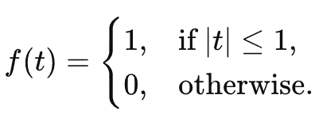

对于这个函数，傅里叶变换可以解析计算，这允许我们**比较数值近似**与**精确结果**。

以下 Python 脚本实现了解析傅里叶变换及其数值近似：

+   **左矩形求积法**，以及

+   **SciPy 的积分函数供参考**。

```py
import numpy as np
import matplotlib.pyplot as plt

# ----- Function Definitions -----

def f(t):
    """Indicator function on [-1, 1]."""
    return np.where(np.abs(t) <= 1, 1.0, 0.0)

def exact_fourier_transform(nu):
    """Analytical FT of the indicator function over [-1, 1]."""
    # f̂(ν) = ∫_{-1}^{1} e^{-2πiνt} dt = 2 * sinc(2ν)
    return 2 * np.sinc(2 * nu)

# ----- Computation -----

T = 2.0
n = 32
nu_vals = np.linspace(-6, 6, 500)
exact_vals = exact_fourier_transform(nu_vals)
tfquad_vals = np.array([tfquad(f, nu, n, T) for nu in nu_vals])

# Compute the approximation using scipy integral
tf_integral_vals = np.array([tf_integral(f, nu, T) for nu in nu_vals])

# ----- Plotting -----
fig, axs = plt.subplot_mosaic([["tfquad", "quad"]], figsize=(7.24, 4.07), dpi=100, layout="constrained")

# Plot using tfquad implementation
axs["tfquad"].plot(nu_vals, np.real(exact_vals), 'b-', linewidth=2, label=r'$\hat{f}$ (exact)')
axs["tfquad"].plot(nu_vals, np.real(tfquad_vals), 'r--', linewidth=1.5, label=r'approximation $\hat{S}_n$')
axs["tfquad"].set_title("TF avec tfquad (rectangles)")
axs["tfquad"].set_xlabel(r'$\nu$')
axs["tfquad"].grid(False)
axs["tfquad"].set_ylim(-0.5, 2.1)

# Plot using scipy.integrate.quad
axs["quad"].plot(nu_vals, np.real(exact_vals), 'b-', linewidth=2, label=r'$\hat{f}$ (quad)')
axs["quad"].plot(nu_vals, np.real(tf_integral_vals), 'r--', linewidth=1.5, label=r'approximation $\hat{S}_n$')
axs["quad"].set_title("TF avec scipy.integrate.quad")
axs["quad"].set_xlabel(r'$\nu$')
axs["quad"].set_ylabel('Amplitude')
axs["quad"].grid(False)
axs["quad"].set_ylim(-0.5, 2.1)

# --- Global legend below the plots ---
# Take handles from one subplot only (assumes labels are consistent)
handles, labels = axs["quad"].get_legend_handles_labels()
fig.legend(handles, labels,
           loc='lower center', bbox_to_anchor=(0.5, -0.05),
           ncol=3, frameon=False)

plt.suptitle("Comparison of FFT Implementations vs. Exact Fourier Transform", fontsize=14)

plt.show()
```

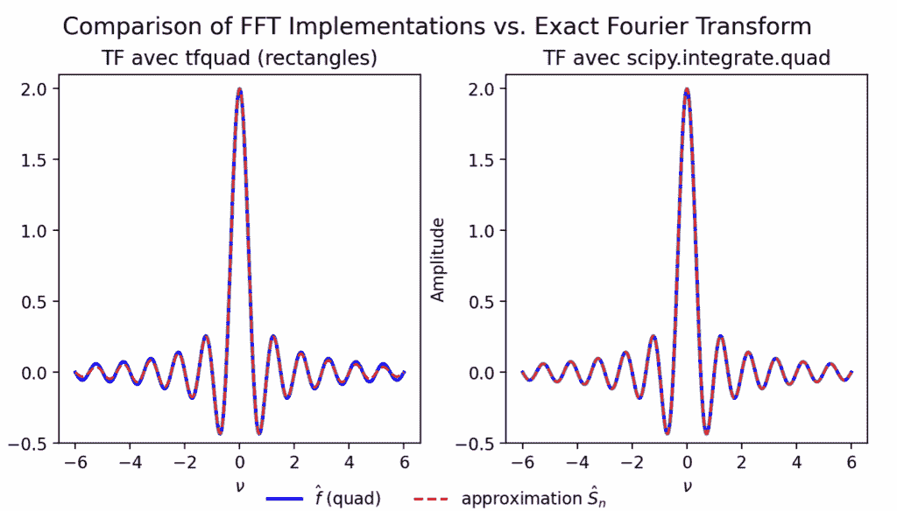

### 2.1.2 使用左矩形求积法对近似进行表征

+   使用**左矩形求积法**对傅里叶变换的近似表现出固有的**振荡行为**。

    如 Balac (2011) 所述，函数**f**的傅里叶变换**f̂**本质上具有振荡性。这种行为来自变换积分定义中的**复指数项** *e⁻²πiνt*。

为了说明这种行为，下面的图显示了函数

**f : t ∈ ℝ ↦ e^(-t²) ∈ ℝ**

与其傅里叶变换的**实部和虚部**一起

**f̂ : ν ∈ ℝ ↦ f̂(ν) ∈ ℂ**, 在**ν = 5⁄2**处评估。

虽然**f(t)**是光滑的，但我们可以在**f̂(ν)**中观察到**强烈的振荡**，这揭示了指数项**e^(-2**πiνt**)**在傅里叶积分中的影响。

```py
import numpy as np
import matplotlib.pyplot as plt

nu = 5 / 2
t1 = np.linspace(-8, 8, 1000)
t2 = np.linspace(-4, 4, 1000)

f = lambda t: np.exp(-t**2)
phi = lambda t: f(t) * np.exp(-2j * np.pi * nu * t)

f_vals = f(t1)
phi_vals = phi(t2)

# Plot
fig, axs = plt.subplots(1, 2, figsize=(10, 4))

axs[0].plot(t1, f_vals, 'k', linewidth=2)
axs[0].set_xlim(-8, 8)
axs[0].set_ylim(0, 1)
axs[0].set_title(r"$f(t) = e^{-t²}$")
axs[0].grid(True)

axs[1].plot(t2, np.real(phi_vals), 'b', label=r"$\Re(\phi)$", linewidth=2)
axs[1].plot(t2, np.imag(phi_vals), 'r', label=r"$\Im(\phi)$", linewidth=2)
axs[1].set_xlim(-4, 4)
axs[1].set_ylim(-1, 1)
axs[1].set_title(r"$\phi(t) = f(t)e^{-2i\pi\nu t}$, $\nu=5/2$")
axs[1].legend()
axs[1].grid(True)

plt.tight_layout()
plt.show()
```

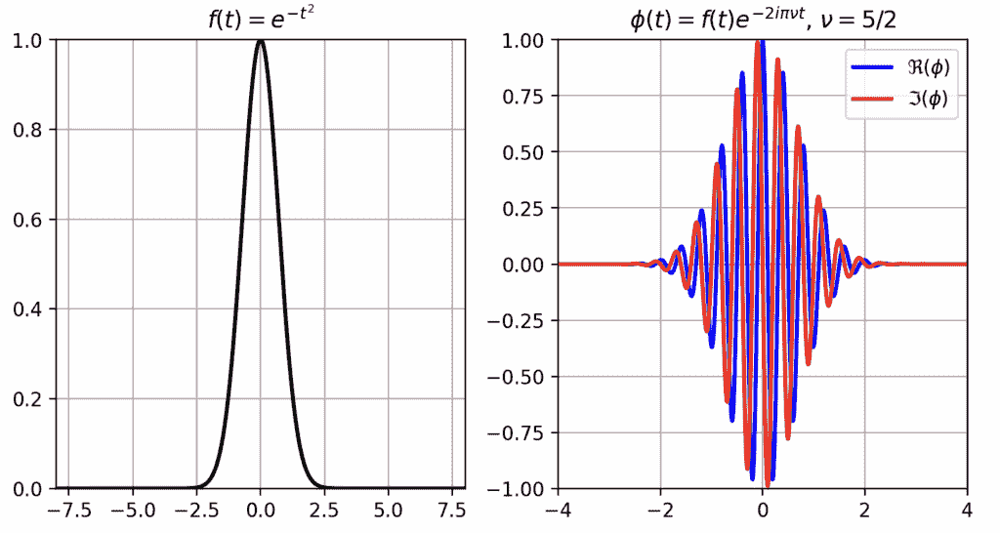

+   **使用左矩形求积法获得的近似是周期性的**。

    我们观察到，即使函数**f**不是周期性的，其傅里叶变换近似**f̂**看起来是**周期性的**。

    事实上，从求积法获得的函数**Ŝₙ**是周期性的，其周期由以下公式给出：

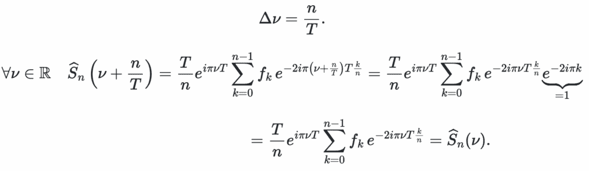

**Ŝₙ**的这种周期性意味着，当参数**T**和**n**固定时，使用求积法无法计算所有频率**ν ∈ ℝ**的傅里叶变换。

事实上，当

|ν| ≥ ν[max],

其中**v = n/T**代表由于**Ŝₙ**的周期性而可以解析的最大**频率**。

因此，在实践中，为了计算更高频率的傅里叶变换，必须增加**时间窗口(T)**或**点数(n)**。

此外，通过评估使用**左矩形求积法**近似**f̂(ν)**时的误差，我们可以证明当以下条件成立时，近似在频率**ν**上是可靠的：

**|ν| ≪ n/T**或等价地，**(|ν|T)/n ≪ 1**。

根据**Epstein (2005)**，当使用**快速傅里叶变换(FFT)**算法时，可以准确地计算函数**f**的所有频率**ν ∈ ℝ**的傅里叶变换，即使**(|ν|T)⁄n**接近 1，只要**f**是**分段连续的**并且具有**紧支集**。

### 2.2 使用 FFT 算法计算频率ν处的傅里叶变换

在本节中，我们用**Ŝₙ(ν)**表示函数**f**在点**ν ∈ [−**ν[max]**/2, **ν[max]**/2]**处的傅里叶变换**f̂(ν)**的近似，其中**ν[max] = n/T**，即，

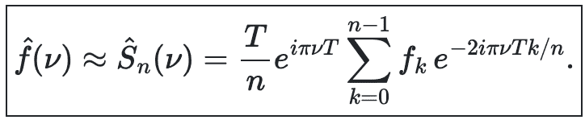

我现在介绍用于近似**f̂(ν)**的**傅里叶变换算法**。

我不会在本篇文章中详细介绍**快速傅里叶变换(FFT)**算法。

为了简化说明，我参考了**Balac (2011)**，而对于更技术性和全面的处理，我参考了**Cooley 和 Tukey (1965)**的原始工作。

重要的是要理解，使用**FFT 算法**来近似函数**f**的傅里叶变换是基于**Epstein (2005)**建立的结果。该结果指出，当**Ŝₙ(ν)**在频率**v[j] = j/T**处评估，对于**j = 0, 1, …, n − 1**，它提供了对连续傅里叶变换**f̂(ν)**的良好近似。

此外，**Ŝₙ**已知是**周期性的**。这种周期性赋予索引**j ∈ {0, 1, …, n − 1}**和**k ∈ {−n/2, −n/2 + 1, …, −1}**对称的角色。

事实上，函数 f 在区间 ****[−**ν[max]**/2, **ν[max]**/2]**** 的傅里叶变换值可以从点 **ν[j] = j/T** 处的 **Ŝₙ** 值推导出来，对于 **j = 0, 1, …, n − 1**，如下所示：

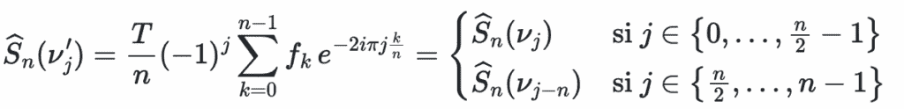

其中我们使用了关系：

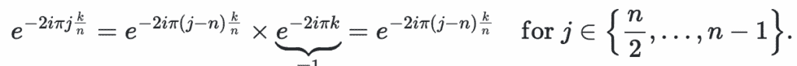

这种关系表明，对于 **j = −n⁄2, …, n⁄2 − 1**，可以计算傅里叶变换 **Ŝₙ(j/T)**。

此外，当 n 是 2 的幂时，计算变得显著更快（参见 Balac，2011）。这个过程被称为 **快速傅里叶变换 (FFT)**。

总结来说，我已表明，通过应用 **快速傅里叶变换 (FFT)** 算法，可以在频率 **v[j] = j/T** 处，对于 **j = −n/2, …, n/2 − 1**，其中 **n = 2ᵐ** 为某个整数 **m ≥ 0**，在区间 **[−T⁄2, T⁄2]** 上对函数 **f** 的傅里叶变换进行近似。

+   **步骤 1**：构建值序列 **F** 的有限序列

    **f((2k − n)T/(2n))**，对于 **k = 0, 1, …, n − 1**。

+   **步骤 2**：使用 FFT 算法计算序列 **F** 的 **离散傅里叶变换 (DFT)**，该算法如下所示：

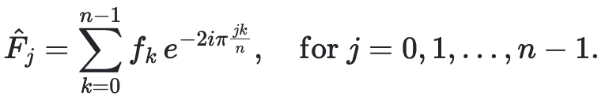

+   **步骤 3**：重新索引并对称化值以覆盖 **j = −n/2, …, −1**。

+   **步骤 4**：将数组中的每个值乘以 **(T/n)(−1)**^(j-1)，其中 **j ∈ {1, …, n}**。

此过程产生一个表示傅里叶变换值 **f̂(νⱼ)** 的数组，其中 **ν[j] = j/T** 对于 **j = −n⁄2, …, n⁄2 − 1**。

下面的 Python 函数 `tffft` 实现了这些步骤来计算给定函数的傅里叶变换。

```py
import numpy as np
from scipy.fft import fft, fftshift

def tffft(f, T, n):
    """
    Calcule la transformée de Fourier approchée d'une fonction f à support dans [-T/2, T/2],
    en utilisant l’algorithme FFT.

    Paramètres
    ----------
    f : callable
        Fonction à transformer (doit être vectorisable avec numpy).
    T : float
        Largeur de la fenêtre temporelle (intervalle [-T/2, T/2]).
    n : int
        Nombre de points de discrétisation (doit être une puissance de 2 pour FFT efficace).

    Retours
    -------
    tf : np.ndarray
        Valeurs approximées de la transformée de Fourier aux fréquences discrètes.
    freq_nu : np.ndarray
        Fréquences discrètes correspondantes (de -n/(2T) à (n/2 - 1)/T).
    """
    h = T / n
    t = -0.5 * T + np.arange(n) * h  # noeuds temporels
    F = f(t)                         # échantillonnage de f
    tf = h * (-1) ** np.arange(n) * fftshift(fft(F))  # TF approximée
    freq_nu = -n / (2 * T) + np.arange(n) / T              # fréquences ν_j = j/T

    return tf, freq_nu, t
```

以下程序说明了如何使用快速傅里叶变换 (FFT) 算法计算高斯函数 f(t) = e^(-10t²) 在区间 [-10, 10] 上的傅里叶变换。

```py
# Parameters
a = 10
f = lambda t: np.exp(-a * t**2)
T = 10
n = 2**8  # 256

# Compute the Fourier transform using FFT
tf, nu, t = tffft(f, T, n)

# Plotting
fig, axs = plt.subplots(1, 2, figsize=(7.24, 4.07), dpi=100)

axs[0].plot(t, f(t), '-g', linewidth=3)
axs[0].set_xlabel("time")
axs[0].set_title("Considered Function")
axs[0].set_xlim(-6, 6)
axs[0].set_ylim(-0.5, 1.1)
axs[0].grid(True)

axs[1].plot(nu, np.abs(tf), '-b', linewidth=3)
axs[1].set_xlabel("frequency")
axs[1].set_title("Fourier Transform using FFT")
axs[1].set_xlim(-15, 15)
axs[1].set_ylim(-0.5, 1)
axs[1].grid(True)

plt.tight_layout()
plt.show()
```

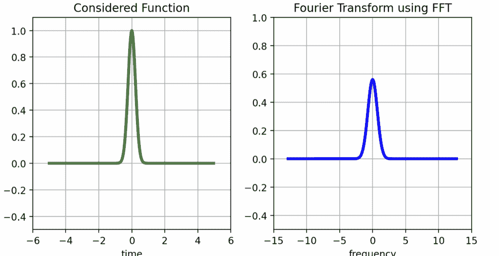

我刚才介绍的方法使得能够在离散点 **v[j] = j/T** 处计算和可视化函数 **f** 的傅里叶变换，对于 **j = −n/2, …, n/2 − 1**，其中 **n** 是 2 的幂。

这些点位于区间 **[−n/(2T), n/(2T)]** 内。

然而，这种方法不允许我们在形式为 **v[j] = j/T** 的非任意频率 **ν** 处评估傅里叶变换。

要计算不匹配采样频率 **νⱼ** 的函数 **f** 在频率 **ν** 处的傅里叶变换，可以使用插值方法，例如 **线性**、**多项式**或 **样条插值**。

在本文中，我们使用了 Balac (2011) 提出的方法，该方法依赖于 **香农插值定理** 来计算函数 f 在任何频率 **ν** 处的傅里叶变换。

使用香农插值定理计算函数 f 在点 ν 的傅里叶变换

**香农定理告诉我们什么？**

它指出，对于**带限函数***g*（即其傅里叶变换**ĝ**在区间**[−B/2, B/2]**外为零的函数）——函数*g*可以从其样本**gₖ = g(k/B)**（对于**k ∈ ℤ**）中**重建**。

如果我们让**ν**[c]是使得**ĝ(ν)**在区间**[−2πν[c], 2πν[c]]**外为零的最小正数，那么**香农插值公式**适用。

对于每个**t ∈ ℝ**和任何正实数**α ≥ 1/(2ν[c])**，我们有：

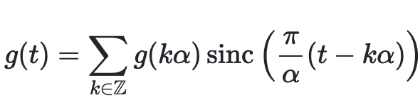

其中**sinc(x) = sin(x)/x**是**sinc 函数**（卡丹辛函数）。

Balac (2011) 表明，当函数**f**在区间**[−T/2, T/2]**内具有**有界支撑**时，香农插值定理可以用来计算其傅里叶变换**f̂(ν)**，对于任何**ν ∈ ℝ**。

这是通过使用**离散傅里叶变换**的值**Ŝₙ(νⱼ)**来完成的，对于**j = −n/2, …, (n/2 − 1**)。

通过将**α = 1/T**，Balac 推导出以下**香农插值公式**，适用于所有**ν ∈ ℝ**：

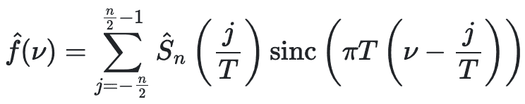

以下程序说明了如何使用**香农插值定理**来计算函数**f**在给定频率**ν**处的**傅里叶变换**。

要计算任何频率ν的傅里叶变换，我们可以使用**香农插值定理**。

思想是从 FFT 获得的**离散样本**中估计傅里叶变换的值。

下面的函数`shannon`在 Python 中实现了这种插值方法。

```py
 def shannon(tf, nu, T):
    """
    Approximates the value of the Fourier transform of function f at frequency 'nu'
    using its discrete values computed from the FFT.

    Parameters:
    - tf : numpy array, discrete Fourier transform values (centered with fftshift) at frequencies j/T for j = -n/2, ..., n/2 - 1
    - nu : float, frequency at which to approximate the Fourier transform
    - T  : float, time window width used for the FFT

    Returns:
    - tfnu : approximation of the Fourier transform at frequency 'nu'
    """
    n = len(tf)
    tfnu = 0.0
    for j in range(n):
        k = j - n // 2  # correspond à l'indice j dans {-n/2, ..., n/2 - 1}
        tfnu += tf[j] * np.sinc(T * nu - k)  # np.sinc(x) = sin(pi x)/(pi x) en numpy

    return tfnu
```

下一个函数`fourier_at_nu`结合了两个步骤。

它首先使用 FFT（`tffft`）计算函数的离散傅里叶变换，然后应用**香农插值**来估计特定频率**ν**处的傅里叶变换。

这使得可以在任何任意点**ν**处评估变换，而不仅仅是 FFT 采样频率。

我们现在可以使用一个简单的例子来测试我们的实现。

这里，我们定义一个函数**f(t) = e^(-a|t|)**，其傅里叶变换是解析已知的。

这使我们能够将**精确**傅里叶变换与使用我们的方法获得的**近似**值进行比较。

```py
a = 0.5
f = lambda t: np.exp(-a * np.abs(t))                          # Function to transform
fhat_exact = lambda nu: (2 * a) / (a**2 + 4 * np.pi**2 * nu**2)  # Exact Fourier transform

T = 40     # Time window
n = 2**10  # Number of discretization points 
```

我们在两个频率处评估傅里叶变换：**ν = 3/T**和**ν = π/T**。

对于每种情况，我们打印出**精确值**和我们的`fourier_at_nu`函数获得的**近似值**。

这种比较有助于验证香农插值的准确性。

```py
# Compute for nu = 3/T

nu = 3 / T

exact_value = fhat_exact(nu)
approx_value = fourier_at_nu(f, T, n, nu)
print(f"Exact value at nu={nu}: {exact_value}")
print(f"Approximation at nu={nu}: {np.real(approx_value)}")

# Compute for nu = pi/T

nu = np.pi / T

exact_value = fhat_exact(nu)
approx_value = fourier_at_nu(f, T, n, nu)
print(f"Exact value at nu={nu}: {exact_value}")
print(f"Approximation at nu={nu}: {np.real(approx_value)}") 
```

```py
Exact value at ν = 3/T: 2.118347413776218  
Approximation at ν = 3/T: (2.1185707502943534)

Exact value at ν = π/T: 2.0262491352594427  
Approximation at ν = π/T: (2.0264201680784835) 
```

值得注意的是，尽管频率**3/T**（其傅里叶变换值出现在 FFT 输出中）接近**π/T**，但这两个频率下**f**的傅里叶变换值相当不同。

这表明，当所需的傅里叶变换值**没有直接包含**在 FFT 算法产生的结果中时，**香农插值公式**可以非常有用。

## 结论

在这篇文章中，我们探讨了两种近似函数傅里叶变换的方法。

第一种是**数值积分法**（左矩形法则），第二种是**快速傅里叶变换（FFT）算法**。

我们表明，与 SciPy 或 NumPy 中的内置 `fft` 函数不同，FFT 可以通过适当的公式化来适应计算连续函数的傅里叶变换。

我们的实现基于**Balac (2013)**的工作，他展示了如何在 Python 中重现 FFT 计算。

我们还介绍了**香农插值定理**，它允许我们在任意频率上估计任何函数在实数域上的傅里叶变换。

当适当的时候，这种插值可以被更传统的方法如**线性**或**样条插值**所替代。

最后，值得注意的是，当需要计算**单个频率**的傅里叶变换时，通常更有效的方法是直接使用**数值积分法**来计算。

这些方法非常适合处理傅里叶积分的振荡性质，并且可能比应用快速傅里叶变换（FFT）然后插值更准确。

## 参考文献

Balac，Stéphane。2011。“从数值计算的角度看傅里叶变换。”

Cooley，James W 和 John W Tukey。1965。“用于机器计算复数傅里叶级数的算法。”*数学计算* 19 (90): 297–301。

El Kolei，Salima。2013。“通过对比最小化和反卷积对隐藏随机模型的参数估计：应用于随机波动模型。”*Metrika* 76 (8): 1031–81。

Epstein，Charles L。2005。“有限傅里叶变换如何近似傅里叶变换？”*纯与应用数学通信：由柯朗数学科学研究所发行的期刊* 58 (10): 1421–35。

M. Crouzeix 和 A.L. Mignot. 微分方程的数值分析。应用数学系列

为硕士学位。Masson，1992。

A.M. Quarteroni，J.F. Gerbeau，R. Sacco 和 F. Saleri. 科学计算数值方法：程序

在 MATLAB 中。IRIS 收集。Springer 巴黎，2000。

A. Iserles 和 S. Norsett。关于高度振荡积分的求积方法和它们的实现。BIT

数值数学，44 : 755–772，2004。

A. Iserles 和 S. Norsett。使用导数高效地求取高度振荡积分。皇家学会 A 系列论文

461 : 1383–1399，2005。

## 图片来源

本文中的所有图像和可视化都是由作者使用 Python（pandas、matplotlib、seaborn 和 plotly）和 Excel 创建的，除非另有说明。

## 免责声明

*我写作是为了学习，所以错误是常态，尽管我尽力了。如果您发现任何错误，请告诉我。我也欢迎任何关于新主题的建议！*

* * *
