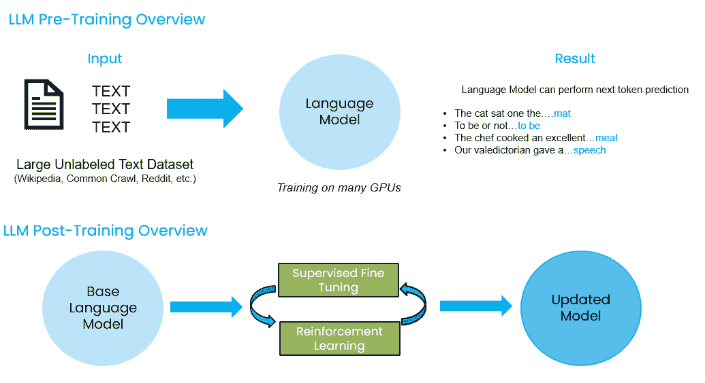
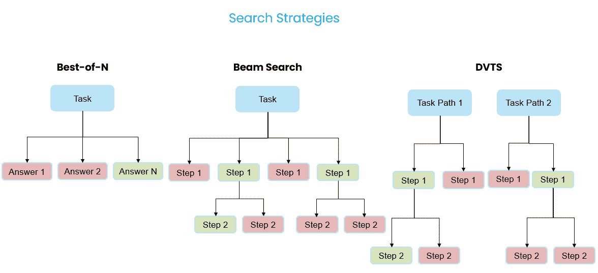

# 改进代理系统和 AI 推理

> 原文：[`towardsdatascience.com/improving-agent-systems-ai-reasoning-c2d91ecfdf77/`](https://towardsdatascience.com/improving-agent-systems-ai-reasoning-c2d91ecfdf77/)

由作者和 GPT-4o 创作，旨在代表 DeepSeek 和其他竞争性通用人工智能模型提供商的图片

## 简介

在过去的一年里，生成式人工智能的采用和 AI 代理开发急剧增长。[LangChain 的报告](https://www.langchain.com/stateofaiagents)显示，51%的受访者正在生产中使用 AI 代理，而[德勤的报告](https://www2.deloitte.com/us/en/insights/industry/technology/technology-media-and-telecom-predictions/2025/autonomous-generative-ai-agents-still-under-development.html)预测，到 2025 年，至少 25%使用生成式人工智能的公司将推出 AI 代理试点或概念验证。**尽管 AI 代理框架的流行和增长，但任何构建这些系统的人很快就会遇到与大型语言模型（LLMs）一起工作的局限性，其中模型推理能力通常排在首位**。为了克服推理限制，研究人员和开发者已经探索了各种不同的技术，从不同的提示方法如 ReAct 或思维链（CoT）到构建具有独立代理的多元代理系统，这些代理专门负责规划和评估，**现在公司正在发布专门训练以改进模型内置推理过程的模型**。

[DeepSeek 的 R1](https://arxiv.org/abs/2501.12948)、[OpenAI 的 o1](https://openai.com/index/openai-o1-system-card/)和[o3](https://www.youtube.com/watch?v=SKBG1sqdyIU)的发布正在通过提供比传统 LLMs 更强大的推理能力而震撼行业。这些模型被训练在回答之前“思考”，并具有自包含的推理过程，允许它们将任务分解成更简单的步骤，迭代地对步骤进行工作，在返回最终答案之前识别和纠正错误。这与早期模型如 GPT-4o 不同，GPT-4o 要求用户通过提示模型逐步思考并创建循环，让模型迭代地规划、工作并评估其在任务上的进度。训练推理语言模型（RLM）如 o1、o3 和 R1 的关键区别之一在于对训练后和测试时间计算缩放的重视。

在本文中，我们将探讨训练时间和测试时间计算缩放、训练后以及如何训练类似 DeepSeek 的 R1 这样的 RLM 的关键区别，以及 RLM 对 AI 代理开发的影响。

## 训练时间计算与测试时间计算

### 概述

计算扩展与为训练和运行 AI 模型提供更多资源有关，例如处理能力和内存。简而言之，**训练时间计算扩展**适用于**预训练**，其中模型学习一般模式，以及**后训练**，其中基础模型通过强化学习（RL）或监督微调（SFT）等额外训练来学习更多更具体的行为。相比之下，**测试时间计算扩展**在推理时间应用，在做出预测时，为模型提供更多计算能力，通过探索多个潜在解决方案来“思考”，然后再生成最终答案。

> **重要的是要理解，测试时间计算扩展和后训练都可以用来帮助模型在生成最终响应之前“思考”，但这些方法以不同的方式实现。**

后训练涉及更新或创建一个新模型，而测试时间计算扩展允许在推理时探索多个解决方案，而不改变模型本身。这些方法可以一起使用；在理论上，你可以使用经过后训练以改进推理的模型，如 DeepSeek-R1，并通过测试时间计算扩展在推理时进行额外的搜索来进一步增强其推理能力。

图片由作者提供。展示了预训练和后训练的非常简单的表示。请注意，后训练可能会有显著的变化，但本质上基础模型以某种方式被修改，以创建更适合任务的更新模型。

### **训练时间计算：预训练与后训练**

今天，大多数 LLM 和基础模型都是在来自 Common Crawl 等大量数据源上预训练的，这些数据源具有广泛且多样化的人类编写文本表示。这个预训练阶段教会模型预测给定上下文中下一个最可能出现的单词或标记。一旦预训练完成，大多数模型都会经历某种形式的监督微调（SFT），以优化它们以适应指令遵循或基于聊天的用例。有关这些训练过程的更多信息，请参阅我之前的一篇文章[了解解决 GenAI 挑战的技术](https://medium.com/towards-data-science/understanding-techniques-for-solving-genai-challenges-83a7ad4650bd)。

总体而言，这个训练过程非常资源密集，需要许多训练运行，每次可能花费数百万美元，才能产生像 Claude 3.5 Sonnet、GPT-4o、Llama 3.1–405B 等模型。这些模型在各种基准测试中表现出色，涵盖了逻辑推理、数学、编码、阅读理解等多个主题。

然而，尽管它们在众多问题类型上表现出令人信服的性能，但要让典型的 LLM 在回答之前真正“思考”，需要用户进行大量的工程工作。从根本上说，这些模型接收输入然后返回输出作为它们的最终答案。你可以将其视为模型根据预训练中学习到的信息或通过用户提示中提供的信息进行上下文学习，在一步中生成最佳猜测。这种行为是为什么代理框架、思维链（CoT）提示和工具调用都迅速发展的原因。这些模式允许人们围绕 LLM 构建系统，从而为 LLM 应用开发提供更迭代、结构化和成功的流程。

最近，像 DeepSeek-R1 这样的模型已经偏离了典型的预训练和训练后模式，这些模式优化了用于聊天或指令遵循的模型。相反，DeepSeek-R1 使用多阶段训练后管道来教授模型更具体的行为，例如如何生成思维链序列，这反过来又提高了模型“思考”和推理的整体能力。我们将在下一节中详细说明，以 DeepSeek-R1 的训练过程为例。

### **测试时计算扩展：在推理时启用“思考”**

测试时计算扩展和训练后令人兴奋的是，推理和迭代问题解决可以构建到模型本身或其推理管道中。而不是依赖开发者来引导整个推理和迭代过程，有机会让模型探索多个解决方案路径，反思其进度，对最佳解决方案路径进行排序，并在向用户发送响应之前，通常对整个推理生命周期进行细化。

测试时计算扩展专门与**优化推理性能**相关，不涉及修改模型的参数。这在实际中意味着，一个较小的模型如 Llama 3.2–8b 可以通过在推理时花费更多时间“思考”和解决众多可能的解决方案来与更大的模型竞争。

一些常见的测试时扩展策略包括**自我完善**，其中模型迭代地完善自己的输出，以及**与验证器进行搜索**，其中生成多个可能的答案，验证器选择最佳路径继续前进。常见的与验证器搜索策略包括：

+   **Best-of-N** 在每个问题都生成多个响应的情况下，每个答案都会被评分，得分最高的答案获胜。

+   **Beam Search** 通常使用过程奖励模型（PRM）来评估多步推理过程。这允许你首先生成多个解决方案路径（束），确定哪些路径是继续搜索的最佳选择，然后生成一组新的子路径并评估这些路径，直到找到解决方案。

+   **多样化验证树搜索 (DVTS**) 与光束搜索相关，但为每个创建的初始路径（光束）创建一个单独的树。然后，每个树都会扩展，并使用 PRM 对树的分支进行评分。

作者受 HuggingFace 博客关于测试时间计算缩放启发的图片

确定哪种搜索策略最好仍然是研究的一个活跃领域，但在 HuggingFace（https://huggingface.co/learn/cookbook/en/search_and_learn）上有很多[优秀的资源]，提供了如何实现这些搜索策略的示例，以适应您的用例。

## 训练推理语言模型 (RLM)

OpenAI 在 2024 年 9 月宣布的 o1 模型是第一个旨在在回应用户之前“思考”的模型之一。虽然与 GPT-4o 等模型相比，从 o1 那里获得响应需要更长的时间，但 o1 的响应通常更适合更高级的任务，因为它生成了一系列的思考序列，有助于它分解和解决问题。

与 o1 和 o3 模型相比，由于这些新的推理聚焦模型与它们的 predecessors 运作方式截然不同，因此需要不同的提示工程风格。例如，告诉 o1 或 o3“逐步思考”将不如给 GPT-4o 相同的指令有价值。

由于 OpenAI 的 o1 和 o3 模型是闭源的，因此无法确切知道这些模型是如何开发的；这是 DeepSeek-R1 引起广泛关注的重要原因。**DeepSeek-R1 是第一个能够展示与 OpenAI 的 o1 相当的行为和性能的开源模型**。这对开源社区来说是个奇迹，因为它意味着开发者可以根据自己的需求修改 R1，并且如果计算能力允许，可以复制 R1 的训练方法。

### DeepSeek-R1 训练过程：

1.  **DeepSeek-R1-Zero**：首先，DeepSeek 对其基础模型 DeepSeek-V3 进行了强化学习（后训练）。这导致了**DeepSeek-R1-Zero**，一个学会了如何推理、创建思考序列，并展示了自我验证和反思等能力的模型。一个模型仅通过强化学习就能学会所有这些行为，对整个 AI 行业来说意义重大。然而，尽管 DeepSeek-R1-Zero 的学习能力令人印象深刻，**但该模型存在一些重大问题，如语言混合和整体可读性差**。这导致团队探索其他途径来稳定模型性能，并创建一个更适合生产的模型。

1.  **DeepSeek-R1**：创建 DeepSeek-R1 涉及一个**多阶段后训练管道，交替进行 SFT 和 RL 步骤**。研究人员首先在 DeepSeek-V3 上使用成千上万的示例 CoT（连贯性训练）序列的冷启动数据进行 SFT，其目标是创建一个更稳定的起点，以克服 DeepSeek-R1-Zero 中发现的问题。其次，研究人员进行了 RL，并包括奖励以促进语言一致性并增强在科学、编码和数学等任务上的推理。第三，再次进行 SFT，这次包括非推理重点的训练示例，以帮助模型保留更多通用能力，如写作和角色扮演。最后，再次进行 RL，以帮助提高与人类偏好的对齐。这最终产生了一个具有 671B 参数的高度能干的模型。

1.  **Distilled DeepSeek-R1 Models**：DeepSeek 团队进一步证明了 DeepSeek-R1 的推理可以通过仅使用 SFT（结构化反馈训练）而无需 RL（强化学习）蒸馏到开源的更小模型中。他们基于 Qwen 和 Llama 架构对 1.5B-70B 参数范围内的较小模型进行了微调，从而产生了一系列更轻、更高效的模型，这些模型具有更好的推理能力。这显著提高了开发者的可访问性，因为许多这些蒸馏模型可以在他们的设备上快速运行。

## 结论：改进推理模型对 AI 代理的影响

随着以推理为先导的模型和测试时计算扩展技术的持续进步，与 AI 代理交互的系统设计、能力和用户体验将发生显著变化。

未来，我相信我们将看到更多**精简的代理团队**。而不是拥有独立的代理和针对特定用例的超级提示和工具，我们可能会看到单一 RLM 管理整个工作流程的设计模式。这也可能改变用户需要提供给代理的背景信息量，如果代理能够更好地探索各种不同的解决方案路径。

与代理的交互也将发生变化。如今，许多代理界面仍然是以聊天为中心的，用户期望几乎立即得到回应。鉴于 RLM 的响应时间较长，我认为**用户的期望和体验将发生变化，我们将看到更多用户将任务委托给代理团队在后台执行的情况。这种执行时间可能需要几分钟或几小时，具体取决于任务的复杂性，但理想情况下将产生彻底且高度可追溯的输出**。这可能会使人们能够一次性将许多任务委托给各种代理团队，并将时间专注于**以人为中心的任务**。

尽管它们的性能很有前景，**许多专注于推理的模型仍然缺乏工具调用能力**。OpenAI 新发布的 o3-mini 是第一个原生支持工具调用、结构化输出和开发者提示（系统提示的新版本）的推理专注模型。工具调用对于智能体至关重要，因为它允许它们与世界互动、收集信息，并代表我们执行任务。然而，鉴于这个领域的创新步伐很快，我预计我们很快就会看到更多具有集成工具调用的 RLM。

**总的来说，这仅仅是通用推理模型新时代的开始，这些模型将继续改变我们工作和生活的方式。**

* * *

*注意：本文中表达的观点仅代表我个人的观点，并不一定反映我雇主的观点或政策。*

*有兴趣进一步讨论或合作？请在 [LinkedIn](https://www.linkedin.com/in/tula-masterman/) 上联系我！*

**参考文献**:

+   [HuggingFace 博客关于扩展测试时间计算](https://huggingface.co/spaces/HuggingFaceH4/blogpost-scaling-test-time-compute)

+   [最优扩展 LLM 测试时间计算比扩展模型参数更有效](https://arxiv.org/pdf/2408.03314)

+   [基于过程和结果反馈解决数学文字问题：过程奖励模型 (PRM)](https://arxiv.org/pdf/2211.14275)

+   [推理语言模型：蓝图](https://www.alphaxiv.org/abs/2501.11223)

+   [OpenAI o1 系统卡](https://openai.com/index/openai-o1-system-card/)

+   [DeepSeek-R1：通过强化学习激励 LLM 中的推理能力](https://arxiv.org/pdf/2501.12948)

+   [我们会不会用尽数据？基于人类生成数据的 LLM 扩展限制](https://arxiv.org/pdf/2211.04325)

+   [英伟达 CEO 表示他的 AI 芯片的发展速度比摩尔定律还要快](https://techcrunch.com/2025/01/07/nvidia-ceo-says-his-ai-chips-are-improving-faster-than-moores-law/)

+   [为 LLM 更长思考扩展测试时间计算](https://huggingface.co/learn/cookbook/en/search_and_learn)

+   [OpenAI o3-mini](https://openai.com/index/openai-o3-mini/)
