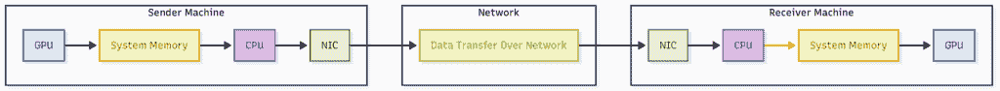
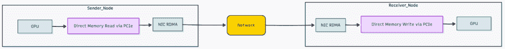
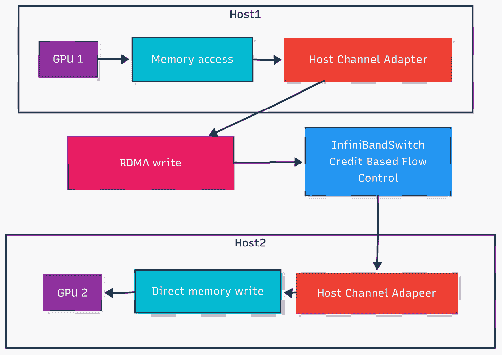
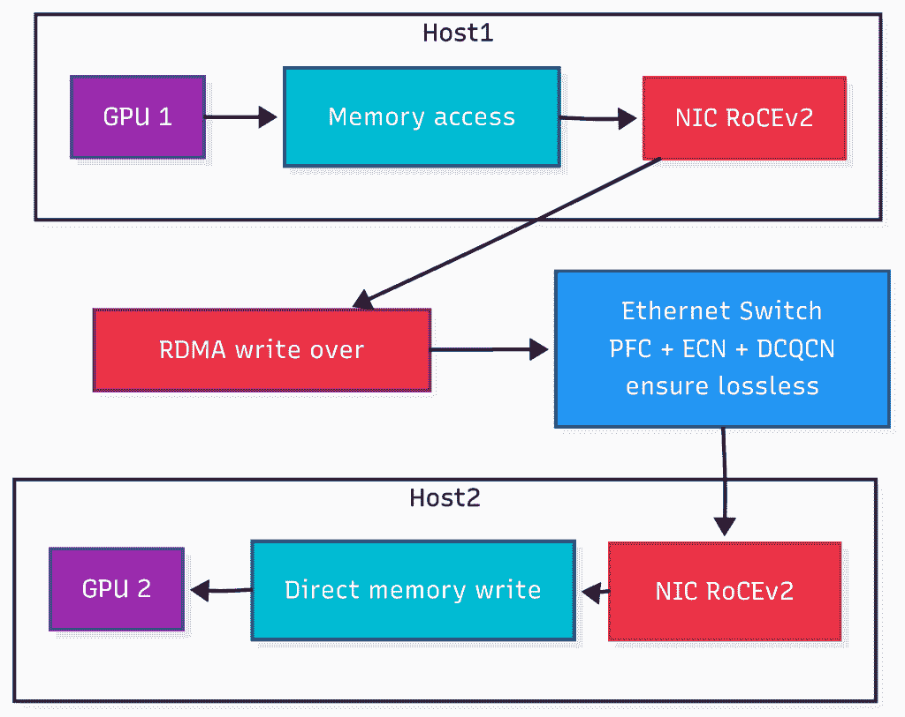

# InfiniBand 与 RoCEv2：为大规模 AI 选择合适的网络

> 原文：[`towardsdatascience.com/infiniband-vs-rocev2-choosing-the-right-network-for-large-scale-ai/`](https://towardsdatascience.com/infiniband-vs-rocev2-choosing-the-right-network-for-large-scale-ai/)

## <mdspan datatext="el1754506380989" class="mdspan-comment">上下文</mdspan>

GPU 是 AI 的基本计算引擎。然而，在大型训练环境中，整体性能并非由处理速度限制，而是由它们之间网络通信的速度限制。

大型语言模型在数千个 GPU 上训练，这产生了巨大的跨 GPU 流量。在这些系统中，即使是微小的延迟也会累积。当 GPU 共享数据时，微秒级的延迟可能导致连锁反应，使训练任务增加数小时。因此，这些系统需要一个专门的网络，该网络设计用于以最小延迟传输大量数据。

传统的将 GPU 数据通过 CPU 路由的方法在扩展规模时造成了严重的瓶颈。为了解决这个问题，发明了像 RDMA 和 GPUDirect 这样的技术，在本质上绕过 CPU 构建了一个旁路。这为 GPU 之间直接通信创建了一条直接路径。

这种直接通信方法需要一个能够处理这种速度的网络。目前提供这种服务的两种主要选择是 InfiniBand 和 RoCEv2。

那么，您如何在 InfiniBand 和 RoCEv2 之间进行选择？这是一个大问题，迫使您在原始速度、预算以及您愿意进行多少手动调整之间进行权衡。

让我们更深入地了解每种技术，看看其优势和劣势。

## 基本概念

在我们比较 InfiniBand 和 RoCEv2 之前，让我们首先了解传统通信是如何工作的，并介绍一些基本概念，如 RDMA 和 GPU Direct。

**传统通信** 在传统系统中，机器之间的大部分数据移动都是由 CPU 处理的。当一个 GPU 完成其计算并需要将数据发送到远程节点时，它遵循以下步骤 –

以 CPU 为中心的通信（来源：作者）

+   GPU 将数据写入系统（主机）内存

+   CPU 将那些数据复制到网络卡使用的缓冲区

+   网络接口卡（NIC）将数据通过网络发送

+   在接收节点上，网络接口卡（NIC）将数据交付给 CPU

+   CPU 将其写入系统内存

+   GPU 从系统内存中读取它

这种方法对于小型系统来说效果很好，但对于 AI 工作负载来说则无法扩展。随着更多数据被复制，延迟开始累积，网络难以跟上。

**RDMA**

远程直接内存访问（RDMA）允许本地机器直接访问远程机器的内存，而不涉及数据传输过程中的 CPU。在这种架构中，网络接口卡独立处理所有内存操作，允许它从远程内存位置读取或写入数据，而不创建数据的中继副本。这种直接内存访问能力消除了与 CPU 介导的数据传输相关的传统瓶颈，并减少了整体系统延迟。

在 AI 训练环境中，RDMA 特别有价值，因为数千个 GPU 必须有效地共享梯度信息。通过绕过操作系统开销和网络延迟，RDMA 实现了分布式机器学习操作所必需的高吞吐量和低延迟通信。

**GPUDirect RDMA** GPUDirect 是 NVIDIA 允许 GPU 通过 PCIe 连接直接与其他硬件通信的方式。通常，当 GPU 需要将数据传输到其他设备时，它必须走一条长路。数据首先从 GPU 内存传输到系统内存，然后接收设备从那里获取它。GPUDirect 完全跳过了 CPU。数据直接从一个 GPU 传输到另一个 GPU。

GPUDirect RDMA 通过允许网络接口卡（NIC）直接使用 PCIe 访问 GPU 内存来扩展这一功能。

GPUDirect RDMA 通信（来源：作者）

现在我们已经理解了 RDMA 和 GPUDirect 等概念，让我们来看看支持 GPUDirect RDMA 的基础设施技术 InfiniBand 和 RoCEv2。

### InfiniBand

InfiniBand 是一种专为数据中心和超级计算环境设计的高性能网络技术。虽然以太网是为了处理通用流量而构建的，但 InfiniBand 是为了满足 AI 工作负载的高速和低延迟而设计的。

它就像一列高速子弹列车，列车和轨道都是设计来保持速度的。InfiniBand 遵循同样的概念，包括电缆、网络卡和交换机在内的所有东西都是设计来快速传输数据并避免任何延迟。

**它是如何工作的？**

InfiniBand 与常规以太网完全不同。它不使用常规的 TCP/IP 协议。相反，它依赖于自己轻量级的传输层，这些传输层是为速度和低延迟而设计的。

InfiniBand 的核心是 RDMA，它允许一台服务器直接访问另一台服务器的内存，而不涉及 CPU。InfiniBand 在硬件上支持 RDMA，因此网络卡（称为主机通道适配器或 HCA）直接处理数据传输，而不会中断操作系统或创建额外的数据副本。

InfiniBand 也使用无损通信模型。通过使用基于信用的流量控制，即使在重负载下也能避免数据包丢失。发送者只有在接收方有足够的缓冲空间时才会传输数据。

在大型 GPU 集群中，InfiniBand 交换机在节点之间以极低的延迟移动数据，通常低于一微秒。由于整个系统都是为了这个目的而构建的，从硬件到软件的所有部分都协同工作，以提供一致、高吞吐量的通信。

让我们通过以下图表来理解一个简单的 GPU 到 GPU 通信 -

使用 InfiniBand 的 GPU 到 GPU 通信（来源：作者）

+   GPU 1 将其数据传递给其 HCA，跳过 CPU

+   HCA 向远程 GPU 发起 RDMA 写入

+   数据通过 InfiniBand 交换机传输

+   接收端 HCA 直接将数据写入 GPU 2 的内存

**优势**

+   **快速且可预测** – InfiniBand 提供超低延迟和高带宽，使大型 GPU 集群高效运行，不会出现故障。

+   **专为 RDMA 设计** – 它在硬件中处理 RDMA，并使用基于信用的流量控制来避免数据包丢失，即使在重负载下也是如此。

+   **可扩展** – 由于系统的所有部分都设计为协同工作，因此如果向集群添加更多节点，性能不会受到影响。

**弱点**

+   **昂贵** – 硬件成本高昂，并且主要与 NVIDIA 相关联，这限制了灵活性。

+   **更难管理** – 设置和调整需要专业技能。 它不像以太网那样直接。

+   **互操作性有限** – 它与标准 IP 网络不兼容，这使得它在通用环境中不太灵活。

### RoceV2

RoCEv2（汇聚式以太网上的 RDMA 版本 2）将 RDMA 的好处带到了标准以太网网络。RoCEv2 采取了与 InfiniBand 不同的方法。它不需要定制网络硬件，只需使用您的常规 IP 网络，并使用 UDP 进行传输。

想象一下，就像升级一条普通高速公路，只为关键数据设置一条专用快车道。您不需要重建整个道路系统。您只需要保留快速车道并调整交通信号。RoCEv2 采用相同的概念，它通过现有的以太网系统提供高速和低延迟的通信。

**它是如何工作的？**

RoCEv2 通过 UDP 和 IP 运行，将 RDMA 带入标准以太网。它可以在常规的第 3 层网络上工作，无需专用结构。它使用商品交换机和路由器，使其更易于访问且成本效益更高。

与 InfiniBand 一样，RoCEv2 允许机器之间直接访问内存。关键区别在于，虽然 InfiniBand 在封闭、严格控制的环境中处理流量控制和拥塞，但 RoCEv2 依赖于对以太网的增强，例如 –

**优先级流量控制（PFC）** – 通过在以太网层根据优先级暂停流量来防止数据包丢失。

**显式拥塞通知（ECN）** – 在检测到拥塞时标记数据包而不是丢弃它们。

**数据中心量化拥塞通知（DCQCN）** – 一种响应 ECN 信号以更平滑地管理流量的拥塞控制协议。

要使 RoCEv2 运行良好，底层以太网网络需要是无损或接近无损。否则，RDMA 性能会下降。这需要在数据中心内对交换机、队列和流量控制机制进行仔细配置。

让我们通过以下带有 RoCEv2 的简单 GPU 到 GPU 通信图来理解 –

使用 RoCEv2 的 GPU 到 GPU 通信（来源：作者）

+   GPU 1 将数据传递给其 NIC，跳过了 CPU。

+   网络接口卡（NIC）将 RDMA 写入操作封装在 UDP/IP 中，并通过以太网发送。

+   数据通过配置了 PFC 和 ECN 的标准以太网交换机流动。

+   接收端的 NIC 将数据直接写入 GPU 2 的内存。

**优势**

**经济高效** – RoCEv2 在标准以太网硬件上运行，因此您不需要专用的网络布线或供应商锁定组件。

**易于部署** – 由于它使用熟悉的基于 IP 的网络，因此对于已经管理以太网数据中心的人来说更容易采用。

**灵活集成** – RoCEv2 在混合环境中表现良好，并且可以轻松集成到现有的第 3 层网络中。

**劣势**

**需要调整** – 为了避免数据包丢失，RoCEv2 依赖于对 PFC、ECN 和拥塞控制的仔细配置。配置不当会影响性能。

**确定性较低** – 与 InfiniBand 的严格控制环境不同，基于以太网的网络可能会在延迟和抖动中引入可变性。

**规模复杂** – 随着集群的增长，维护具有一致行为的无损以太网布线变得越来越困难。

### 结论

在大规模 GPU 集群中，如果网络无法处理负载，计算能力就毫无价值。网络性能变得与 GPU 一样重要，因为它将整个系统连接在一起。像 RDMA 和 GPUDirect RDMA 这样的技术通过消除不必要的中断和 CPU 复制，让 GPU 能够直接相互通信，从而减少了通常的延迟。

InfiniBand 和 RoCEv2 都加快了 GPU 到 GPU 的通信，但它们采取了不同的方法。InfiniBand 构建了自己的专用网络设置。它提供了出色的速度和低延迟，但成本非常高。RoCEv2 通过使用现有的以太网设置提供了更多的灵活性。它在预算上更容易接受，但需要正确调整 PFC 和 ECN 才能使其工作。

最后，这是一个典型的权衡。如果您最关心的是获得尽可能最佳的性能，并且预算不是问题，那么选择 InfiniBand。但如果您想要一个更灵活的解决方案，该方案与您现有的网络设备兼容，并且前期成本较低，那么 RoCEv2 是最佳选择。
