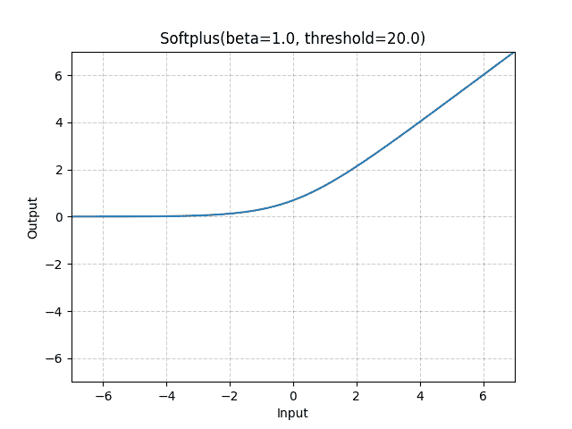
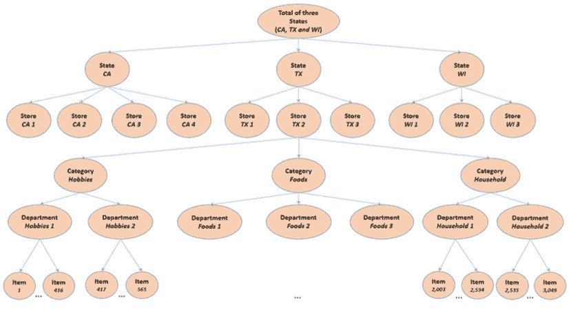
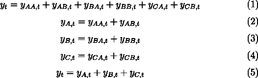
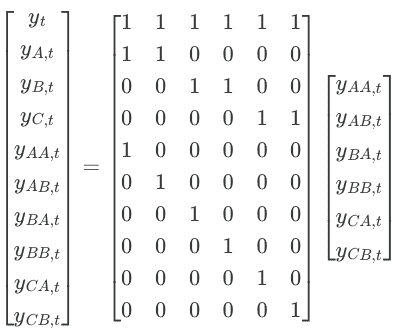
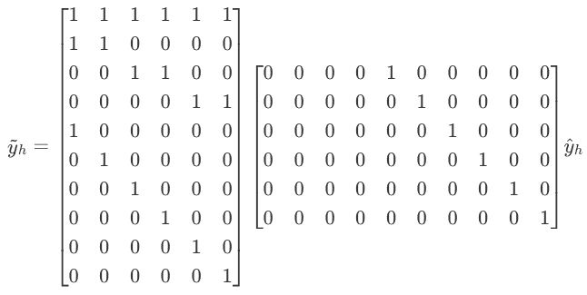
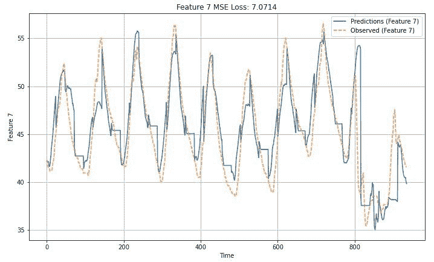
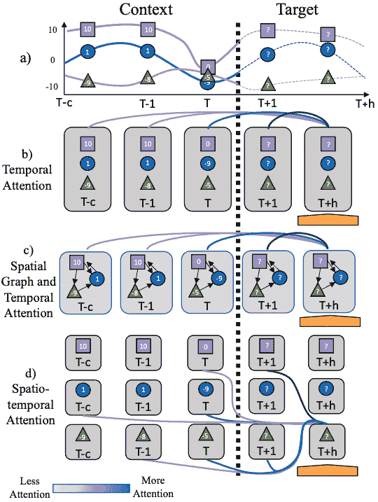
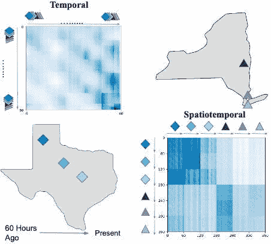

# 2023-2024 年有影响力的时间序列预测论文：第一部分

> 原文：[`towardsdatascience.com/influential-time-series-forecasting-papers-of-2023-2024-part-1-1b3d2e10a5b3/`](https://towardsdatascience.com/influential-time-series-forecasting-papers-of-2023-2024-part-1-1b3d2e10a5b3/)


由 DALL3*3 创建

**让我们以对 2025 年的知名时间序列预测论文的综述开始。**

我还包含了一些 2023 年的关键论文。2024 年是基础预测模型的一年——但我将在另一篇文章中介绍这些。

我将涵盖的论文包括：

1.  **基于深度学习的时间序列预测：来自在线时尚行业的案例研究**

1.  **预测协调：综述**

1.  **TSMixer：用于时间序列预测的全 MLP 架构**

1.  **CARD：用于时间序列预测的通道对齐鲁棒混合 Transformer**

1.  **长程 Transformer 用于动态时空预测**

让我们开始吧！

> ✅ 我已启动**[AI Horizon Forecast](https://aihorizonforecast.substack.com/)**，这是一个专注于时间序列和创新的 AI 研究的通讯。在此[订阅](https://aihorizonforecast.substack.com/welcome)以拓宽您的视野！

## 基于深度学习的时间序列预测：来自在线时尚行业的案例研究

这篇论文是一颗宝石。

它最初成为头条新闻，因为领先的在线时尚零售商 Zalando 使用定制的 Transformer 模型超越了 SOTA 预测模型——包括 LGBM。

但不仅如此——这篇论文提供了深度，并由时间序列/ML 生态系统中杰出的研究人员撰写。

### 论文洞察概述

论文描述了 Zalando 的深入零售预测流程，并提供了有价值的见解：

+   网上零售时尚预测的独特挑战。

+   如何处理稀疏性、冷启动和短暂历史**（图 1）。**

+   使用了哪些外部协变量以及 Transformer 是如何构建以利用它们的？

+   优雅的技巧，有趣的解释如何改进了原始 Transformer 并将其定制为时间序列预测。

+   关于自定义损失函数、评估指标、超参数和训练配置的详细内容——这在许多论文中很少公开。

![图 1：Zalando 数据集中的三个边缘情况：冷启动、短暂历史和稀疏性（来源[1]）](../Images/497e981bfa895ba974ddf4ed059a68dd.png)

**图 1**：*Zalando 数据集中的三个边缘情况：冷启动、短暂历史和稀疏性（来源[1]*)*

这篇论文的主要贡献/要点是：

+   **协变量处理**：使用折扣作为动态协变量。

+   **因果关系：通过前馈网络参数化的分段线性函数强制执行折扣和需求之间的单调关系。**

+   **两种预测模式：使用单个全局模型训练和预测短期和长期需求。**

+   **缩放定律：证明了 Transformer 预测模型中缩放定律的第一缕火花。**

首先，作者解释了他们如何通过将销售观察结果转换为需求预测来配置预测问题。需求规划是零售预测中最常见的案例。

此外，作者巧妙地估计需求（例如，当出现库存短缺时）而不是将其标记为缺失。

> **注意**：**需求预测是供应链预测管道中的第一步且是最重要的步骤**
> 
> **需求**代表客户想要购买的东西，而**销售**受库存可用性的限制。**预测需求至关重要，因为它反映了真正的客户需求，与销售不同，销售是依赖于供应的。**
> 
> 如果由于库存短缺导致销售额降至零，基于销售额的未来预测也将反映为零。这可能会误导自动供应链规划系统，导致没有新的订单。
> 
> 为了确保高效的供应链，始终预测需求而不是销售。准确的需求预测可以防止中断并保持库存以满足客户需求。

### Zalando 的预测管道

论文将特征分为 4 类：

+   ***静态-全球***：时间无关且市场无关

+   ***动态-全球***：时间依赖且市场无关

+   ***动态-国际***：时间依赖且市场特定

+   ***静态-国际***：时间无关且市场特定

![表 1：Zalando 预测管道中的协变量类型（来源 [1]）](../Images/019d5d5568a7836f94e0db9478e6d87f.png)

***表 1***：Zalando 预测管道中的协变量类型（来源 [1]）*

虽然所有协变量都增强了性能，但折扣是最有影响力的。此外，数据具有每周频率。

Zalando 团队训练了一个全局 Transformer 模型，使用：

+   **输入**：一个维度为 R𝑡×𝑢×𝑣 的单个张量，其中 𝑡 是时间维度，𝑢 是批量大小，𝑣 是协变量向量的维度。

+   **输出**：*近期未来*是 5 周，*远期未来*是 __ 5 到 20 周。

作者输入了不同产品、市场和折扣级别的详细信息，预测引擎的输出是一个 𝑅𝑎×𝑐×𝑡×𝑑 张量，覆盖了 𝑡 = 26 个未来周，至 𝑎 = 1 × 10⁶ 个产品，𝑐 = 14 个国家和 𝑑 = 15 个折扣级别。

**图 2** 描述了 Transformer 模型的顶层视图：

![图 2：自定义 Transformer 架构的顶层视图（来源[1]）](../Images/671f94a1a521fe7ce512d68af9521ac5.png)

**图 2**：*自定义 Transformer 架构的顶层视图（来源[1]*)*

该模型使用了一个编码器-解码器结构，并针对时间序列进行了特定调整：

+   **编码器**：处理过去观察到的协变量。

+   **解码器**：处理未来已知的输入，生成短期和长期预测。

+   **非自回归解码器**：以多步方式产生预测。

+   **位置嵌入**：它们不像传统 Transformer 那样添加到标记中，而是作为一个额外的协变量。

关键创新是将需求单调递增和更高折扣的理念原生嵌入到模型中。

这是有意义的，因为这两个值是正相关的一一但是，如果这种关系在模型中没有强制实施，它并不一定会始终发生。

通过分段线性、单调的需求响应函数对给定折扣的未来需求进行建模。该函数由**单调需求层**中的 2 个 FFN 参数化。一个**softplus 变换**确保需求函数相对于折扣单调递增：



**图 3**：*Softplus 激活函数 ([来源](https://pytorch.org/docs/stable/generated/torch.nn.Softplus.html))*

![图 4：需求作为分段线性单调需求响应函数（来源[1]*)](../Images/0e7958ee1726b402a25d3603a847bd92.png)

**图 4**：*需求作为分段线性单调需求响应函数（来源[1]*)*

最后，这篇论文的一个重要方面是**预测中的规模定律的首次火花**。这是第一次有论文在一个私有、大型且多样化的数据集上展示了基于 Transformer 的预测模型如何利用规模来提供更好的性能：

![图 5：Zalando 的 Transformer 预测模型与简单模型的对数-对数图，从训练规模的角度看性能（来源 [1]）](../Images/d509879df4d54cfa3d3682532026d75c.png)

**图 5**：*Zalando 的 Transformer 预测模型与简单模型的对数-对数图，从训练规模的角度看性能（来源 [1]*)*

这项工作为大规模、时间序列预测模型奠定了基础。

通常，这是一篇写得很好的论文，其中包含一些我们在这里没有涵盖的有趣细节一一但我们将在未来的文章中讨论它们。请保持关注！

## 预测协调：综述

层次预测和协调是时间序列研究中最活跃的领域之一。

所有这一切都始于莫纳什大学（其中包括杰出的教授 Rob Hyndman）的研究团队发表了标志性的论文 [Hyndman et al., 2011]。当然，这个领域的工作在此之前就已经开始了。

层次预测通过 M5 预测竞赛进入更广泛的机器学习社区。

由同一学派的研究者撰写的论文 [2] 是追踪最新预测协调研究的最**佳资源**。

### 预测协调的预备知识

考虑一个具有多个层级的层次时间序列，例如产品和商店。你的任务是预测所有层级。



**图 6**：*M5 时间序列层级组织概述 ([来源](https://github.com/Mcompetitions/M5-methods/blob/master/M5-Competitors-Guide.pdf))* 

+   **简单方法：** 我们分别预测每个产品、商店和总销售额。然而，顶级预测不会与底层总和相匹配，这使得它们**不一致**。

+   **自下而上的方法：** 在这里，预测从底层开始，向上聚合。这避免了信息损失，但不是最优的。底层序列通常噪声或稀疏，导致在聚合过程中错误累积。

其他方法，如自上而下和中间向外，也有类似的挑战。

最好的方法是建立一个数学协调方法：

> 预测协调不是一个时间序列模型，而是一个确保不同层级预测之间一致性的**过程**。给定所有层级的基预测，此过程最优地使基预测一致。
> 
> **✅ 注意：** 一些模型可以直接生成一致的预测（见[2]）。

### 为什么使用预测协调？

教程通常将预测协调作为一种确保预测有意义的手段，避免经理提出为什么产品 A 和 B 的销售额总和与总估计值不匹配的问题。

好的，这也是真的。但不仅如此。

**协调通常可以提高分层数据集中的预测准确性**。原因如下：

+   您可以使用每个层级的最佳模型。

+   例如，不同层级的模型可以利用不同的损失函数（例如，Tweedie 损失用于非负、右偏斜的底层数据；Huber 损失用于容易出现异常值的顶层）。

一旦在每个层级生成了基础最优预测，您可以从[2]中选择一个合适的协调方法。就这样——砰！您的预测不仅将是一致的，而且整体上可能更准确！

## 一些符号

让我们分解分层预测。

假设我们有 3 家商店，每家商店销售 2 种产品。这种设置总共给我们 10 个时间序列，其中 6 个在底层。

例如，**yA,t** 代表时间 **t** 时商店 A 的销售额，而 **yAA,t** 代表产品 **A** 的销售额。顶级 **yt** 聚合 **总销售额**。

![图 7：一个 2 层级的分层树状图。底层包含 6 个时间序列，总共我们有 10 个时间序列（来源 [2]）](../Images/558c262105e7c438f41d858c43d5637e.png)

**图 7：** *一个 2 层级的分层树状图。底层包含 6 个时间序列，总共我们有 10 个时间序列（来源 [2]）*

描述此图的方程如下：



描述这一层级的方程如下：

向量 **yt** 代表总销售额，**S** 是求和这些观察值的矩阵，而 **bt** 是时间 **t** 的底层观察/销售额向量。

让我们深入探讨上述方程的值：



因此，求和矩阵 **S** 决定了分层结构。

### 自下而上的方法

协调的目的是调整不一致的基础预测，使其尽可能一致和准确。

我们通过使用一个 **投影**（或 **协调**）矩阵 **G** 来实现这一点：

其中：

+   **y_tilde**: 所有级别的协调预测

+   **S**: 求和矩阵

+   **G**: 投影矩阵

+   **yhat:** 所有级别的基预测

+   **h:** 预测范围

并且以矩阵形式表示：



注意到在 **G** 中，前四列在底层将基础预测清零，而其他列仅选择底层的基础预测。

### 高级协调方法

自下而上的方法很简单——它通过聚合预测来确保一致性。

然而，这并不是一个原生的协调方法，因为预测仅仅通过聚合就变得一致。

正因如此，自下而上的方法有一个简单的投影矩阵 **G**，但在实践中，我们可以通过求解矩阵 **G** 来设计协调方法。

> 目标是根据方程 6 寻找最优的 G 矩阵，以给出最准确的协调预测。

论文从简单的 OLS 方程开始，用于估计 G：

```py
G = (S'S)^-1 S'
```

并且继续介绍里程碑论文 [Wickramasuriya 等人 (2019)](https://robjhyndman.com/papers/MinT.pdf)，该论文介绍了 *MinTrace (MinT)* 方法，该方法最小化了协调预测误差的方差总和。

然后矩阵 G 被计算为：

```py
G = (S'W^(-1) S)^-1 S' W^(-1)
```

其中 **Wh** 是基预测误差的方差-协方差矩阵。

我们在这里不会进一步详细介绍，请自由阅读原始论文[2]。

### 关键挑战和工具

作者讨论了额外的协调方法以及如何通过概率预测或使用稀疏方法来增强这些方法。然而，协调方法可能非常消耗内存，特别是对于包含数百个时间序列的数据集。

它们还涵盖了分层预测的特定领域应用，并回顾了实现这些应用的软件工具和库。

论文内容详实，文笔流畅，但假设读者对领域有一定了解。对于初学者，我推荐 Rob Hyndman 和 George Athanasopoulos 的 [预测：原理与实践](https://otexts.com/fpp3/) 一书，其中有一章专门介绍分层预测。

## TSMixer：用于时间序列预测的全 MLP 架构

Boosted Trees 在预测具有多个协变量的表格型时间序列数据方面表现出色。

然而，由于过拟合问题，深度学习模型在复杂数据集上有效利用其架构方面遇到了困难。

Google 研究人员通过开发 **TSMixer**，一个基于 MLP 的轻量级模型及其增强版本 **TSMixer-Ext** 来解决这个问题，后者可以容纳外生和已知未来的变量。TSMixer-Ext 在 Walmart 的 M5 竞赛中表现出色，超越了现有的 SOTA 模型。

TSMixer 因其双重混合操作而突出，它在时间域（时间混合层）和特征域（特征混合层）之间利用交叉变量信息。

![图 8：TSMixer 的顶层视图，包括按 N 块排列的时间混合和特征混合 MLPs。（来源[3]）](../Images/bcacb74d9679518a261aa3cc3baf83a1.png)

**图 8**：*TSMixer 的顶层视图，包括按 N 块排列的时间混合和特征混合 MLPs。（来源[3]）*

我们在文章[这里](https://medium.com/towards-data-science/tsmixer-googles-innovative-deep-learning-forecasting-model-4c3ab1c80a23)详细介绍了 TSMixer 和 TSMixer-Ext——查看它以获取更多见解！

> 在**[AI Projects 文件夹](https://aihorizonforecast.substack.com/p/ai-projects)**（项目 8）中找到一个关于 TSMixer 的动手教程



**图 9**：*TSMixer 在 ETTm2 数据集上的滚动预测，预测长度=48*（图片由作者提供，[来源](https://aihorizonforecast.substack.com/p/ai-projects)）

## CARD：用于时间序列预测的通道对齐鲁棒混合 Transformer（ICLR 2024）

DLinear 和 TSMixer 论文的发布揭示了基于 Transformer 的预测模型中的弱点。

在多元设置（其中模型学习所有时间序列之间的交叉变量依赖关系并联合预测它们）中，Transformer 经常过拟合。

二次自注意力机制倾向于捕捉噪声，限制了性能——尤其是在较小或玩具数据集上。因此，新的基于注意力的方法转向单变量训练，取得了令人印象深刻的结果。

CARD 重新审视了多元场景，通过重新设计时间序列的注意力机制，旨在实现 SOTA（最先进的技术）结果。

### 双通道注意力

之前，我们看到了 TSMixer 如何在时间和特征维度上使用双重 MLP 混合操作。同样，CARD 在标记（时间）和通道（特征）维度上应用注意力：

![图 10：CARD 架构的顶层视图（来源[4]）](../Images/5e51ea95902f8428ba8a8f6cdabf2ac8.png)

**图 10**：*CARD 架构的顶层视图（来源[4]）*

**图 10**与**图 8**中的 TSMixer 架构非常相似。作者通过摘要标记、指数平滑和额外投影进一步稀疏化注意力。这些添加减少了复杂性（**图 11**），有助于模型提炼有意义的信息。

![图 11：CARD 注意力块内的操作（来源[4]）](../Images/9e5a2ca80fb9ca80bdf5fc2874a9333b.png)

**图 11**：*CARD 注意力块内的操作（来源[4]）*

> **注意**：CARD 将信号划分为补丁，这意味着标记化发生在补丁级别。
> 
> 修补对基于注意力的模型有益，因为点状标记缺乏语义丰富性，而补丁更好地捕捉序列的特征。

### 标记混合模块

在 Transformer 预测中，每个注意力头专注于输入序列中的特定数据方面或特征模式。例如：

+   一个注意力头可能专注于**短期依赖关系**（例如，相邻时间步之间的关系）。

+   另一种可能捕捉**周期性行为**（例如，每周或季节性循环）。

因此，在单个注意力头内部：

+   标记编码了关于输入序列的相关信息，通过头部的特定“透镜”或学习到的特征模式进行过滤。

+   相邻的标记对应于序列中的**相邻时间步**，并共享时间邻近性。

在传统的注意力中，标记在头部之间合并。所提出的**标记混合模块**（**图 12**）通过在多注意力头注意力之后合并同一头部的相邻标记来修改这一点，为下一阶段创建标记：

![图 12：CARD 中的标记混合块示例（来源[4]）](../Images/0a06fd02f5dd475f81000f186d67ca10.png)

**图 12**：*CARD 中的标记混合块示例（来源[4]*)*

由于每个注意力头都专门处理特定的特征（例如，趋势或周期性模式），在同一头部的标记合并保留了这种关注点，同时扩展了时间范围。

### 基于信号衰减的损失函数

作者指出，在预测时间范围的远端，错误率更高。近期的预测比远期的预测对泛化改进的贡献更大。

为了解决这个问题，他们使用了一种基于**衰减损失函数**——一个基于 MAE 的变体，它更重视近期的预测：

其中：

+   **a_t(A**)是时间 t 的观察值，给定历史信息**A**

+   **ahat_t**是时间 t 的预测值，给定历史信息**A**

+   **L**是序列长度

因此，这种损失函数更强调近期的准确性。

通常，CARD 是一个令人印象深刻的模型。不幸的是，它还没有被集成到任何已知的预测库中，但作者已经开源了它。我肯定会在这未来的文章中创建一个关于这个模型的教程。

## Spacetimeformer

论文**“用于动态时空预测的长距离 Transformer[5]**”介绍了一种名为**Spacetimeformer**的新模型。

### 什么是 Spacetimeformer 的优势？

一般有 3 个关键级别：

+   **时间模型**：传统的基于注意力的时间序列模型在每个时间步表示多个变量，忽略了特征之间的空间关系（**图 13b**）。

+   **图模型**：图注意力模型通过静态、硬编码的图手动编码特征关系，无法随时间适应（**图 13c**）。

+   **时空模型**：Spacetimeformer 整合了时间和空间注意力，将每个特征在特定时间步的值表示为一个单独的标记。这种方法捕捉了空间、时间和价值之间的复杂交互（**图 13d**）。



**图 13**：多元预测中的注意力。 (a) 包含 3 个变量、2 个上下文点和 2 个预测目标点的序列。 (b) 时间注意力，其中每个标记包含所有三个变量，较深的蓝色线条表示标记之间的较强注意力。 © 带有空间交互的时间注意力，其中每个时间步内的空间关系使用预定义的空间图（黑色线条）进行建模。 (d) 空间时间注意力，其中每个时间步的每个变量被视为一个单独的标记。

前面的基于 Transformer 的模型在每个时间步使用一个输入标记，因此时间 t 的标记嵌入代表该时刻的 N 个不同变量。

这是有问题的，因为： 

+   **滞后信息**：在实践中，依赖关系可以是滞后的，例如 `y` 依赖于 `xi-1` 而不是 `xi`。基于时间的嵌入可能会忽略这些滞后。

+   **有限的感受野**：与 NLP 不同，NLP 中的词汇是离散的，时间序列数据是连续的。通过时间点进行标记化限制了感受野，限制了长期、跨时间相关性的捕获。

### Spacetimeformer 的解决方案

Spacetimeformer 通过图 1d 中所示的架构解决了这些限制。对于 N 个变量和序列长度 L，我们有：

形状为 (L, N) 的多元输入被展平为形状为 (L × N, 1) 的序列，其中每个标记代表特定时间步的单个变量的值。这种转换使模型能够联合学习空间和时间上的注意力，从而创建图 13D 中所示的“时空注意力”机制：

**图 14**展示了时间和时空模型之间的嵌入差异：

![图 14：时空模型将 N 个变量展平为单个序列，并使用不同类型的嵌入来区分它们（来源 [5]）](../Images/c9d92a8d01fc9134804df21384726bb3.png)

**图 14**：*时空模型将 N 个变量展平为单个序列，并使用不同类型的嵌入来区分它们（来源 [5]）*

**图 14**详细展示了 SpaceTimeFormer 使用的嵌入类型：

+   **给定嵌入**：多元输入包含时间信息，缺失值（"?"）在预测时设置为零。这些嵌入指示值是否作为上下文提供或需要预测。

+   **时间嵌入**：时间序列通过 Time2Vec 层传递以创建**时间嵌入**，这些嵌入能够捕捉周期性模式。

+   **变量嵌入**：每个时间序列协变量都使用查找表嵌入映射到空间表示。

+   **值和时间嵌入**：使用前馈层将 Time2Vec 嵌入和变量值进行投影。

+   **位置嵌入**：在 BERT 等模型中使用的典型学习位置嵌入（**图 15**中未展示）

![图 15：SpaceTimeFormer 中的不同嵌入类型及其处理方式（来源[5])](../Images/a931b1c2fd7a81d7387bd298a192dd97.png)

**图 15**：*SpaceTimeFormer 中的不同嵌入类型及其处理方式（来源[5]*)*

所有嵌入被加总以建模时间和变量空间之间的关系，但这增加了输入序列的长度。

由于自注意力机制的二次复杂度，当 N 值较大时，扩展变得具有挑战性。为了解决这个问题，以下优化被应用：

+   **Performer 的 FAVOR+注意力**：使用随机核方法对注意力进行线性近似。

+   **全局和局部注意力**：局部注意力允许每个标记关注其空间变量的时间步长，而全局注意力则允许标记在整个时空序列中关注。这减少了计算量，同时没有牺牲时间动态。

**图 16**展示了 SpaceTimeFormer 的编码器-解码器架构：

![图 16：SpaceTimeFormer 顶级架构（来源[5])](../Images/621f97515f166830003a1105444702fc.png)

**图 16**：*SpaceTimeFormer 顶级架构（来源[5]*)*

基准测试结果表明，该模型具有令人鼓舞的性能，优于其他知名实现。像 ITransformer 和 CARD 这样的新模型随后也采用了跨越时间维度的嵌入机制。

最后，可以提取并可视化注意力权重，以揭示变量之间的时空关系：



**图 17**：*预测德克萨斯州 3 个气象站（左下角，蓝色菱形）和纽约 3 个气象站（右上角，紫色三角形）的温度（来源 5）*

您可以在[这里](https://github.com/QData/spacetimeformer)找到 SpaceTimeReformer 的官方仓库。该模型也已被应用于其他案例，例如[金融预测](https://www.semanticscholar.org/reader/d3273fbe5db873e10f2ba774950f7c59b4271199)。

## 参考文献

[1] Kunz 等人 *[基于深度学习的时间序列预测：来自在线时尚行业的案例研究](https://arxiv.org/pdf/2305.14406)*

[2] Athanasopoulos 等人 _[预测协调：综述](https://robjhyndman.com/papers/hf_review.pdf)_

[3] Chen 等人 **** _TSMixer：一个用于时间序列预测的全 MLP 架构 _

[4] Xue 等人. *[CARD: 用于时间序列预测的通道对齐鲁棒混合变换器](https://arxiv.org/pdf/2305.12095) (ICRL 2024)*

[5] Grigsby 等人. *长距离变换器用于动态时空预测*

## 感谢阅读！
