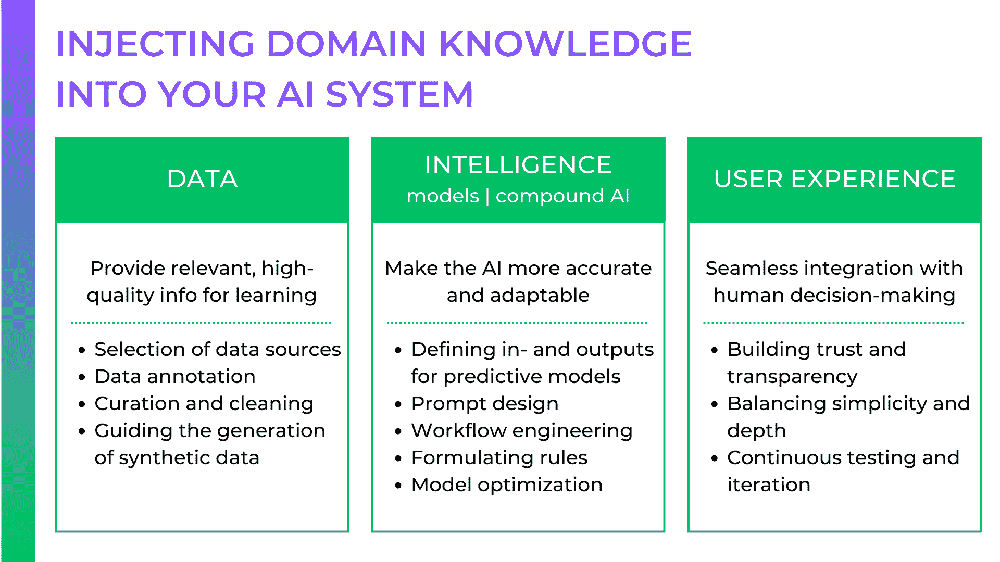
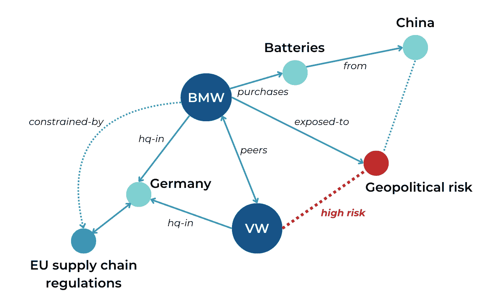
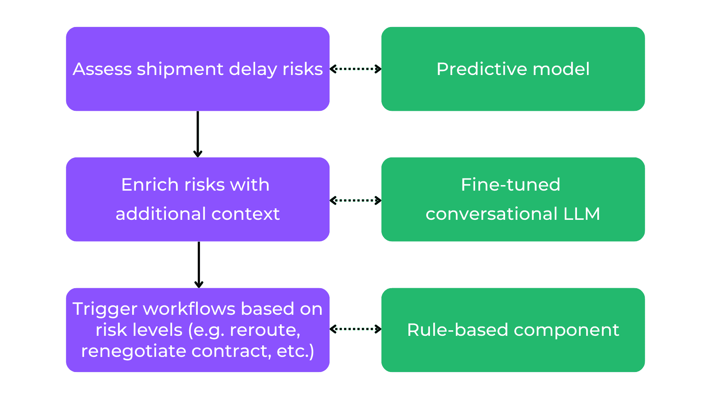

# 将领域专业知识注入您的 AI 系统

> 原文：[`towardsdatascience.com/injecting-domain-expertise-into-your-ai-system-792febff48f0/`](https://towardsdatascience.com/injecting-domain-expertise-into-your-ai-system-792febff48f0/)

(来源：Getty Images)

当许多公司开始他们的 AI 项目时，他们往往陷入孤立，将 AI 视为一个纯粹的技术企业，忽视了领域专家或太晚涉及他们。他们最终得到的是通用的 AI 应用，这些应用忽略了行业细微差别，产生了糟糕的建议，并很快不受用户欢迎。相比之下，深刻理解行业特定流程、约束和决策逻辑的人工智能系统有以下好处：

+   **提高效率**——人工智能整合的领域知识越多，人类专家所需的手动工作就越少。

+   **提高采用率**——专家会从感觉过于通用的 AI 系统中退出。人工智能必须使用他们的语言并与实际工作流程保持一致，以赢得信任。

+   **可持续的竞争优势**——随着人工智能成为商品，嵌入专有专业知识是构建可防御人工智能系统的最有效方式（参考[这篇文章](https://medium.com/towards-data-science/carving-out-your-competitive-advantage-with-ai-a4babb931076)了解人工智能竞争优势的构建块）。

领域专家可以帮助您连接人工智能系统技术细节与其实际应用和价值之间的联系。因此，他们应该是您人工智能应用的关键利益相关者和共同创造者。本指南是我关于专家驱动人工智能系列的第一部分。在遵循我的[人工智能系统心智模型](https://medium.com/towards-data-science/building-ai-products-with-a-holistic-mental-model-33f8729e3ad9)之后，它提供了一种将深厚领域专业知识嵌入您人工智能的结构化方法。

领域知识整合方法的概述

在整篇文章中，我们将使用供应链优化（SCO）的案例来阐述这些不同的方法。现代供应链因地缘政治紧张、气候破坏和需求波动而承受着持续的压力，人工智能可以提供预测延误、管理风险和优化物流所需的动态、高覆盖率的智能。然而，如果没有领域专业知识，这些系统通常与生活的现实脱节。让我们看看我们如何通过将领域专业知识整合到人工智能应用的各个组件中解决这个问题。

## 1. 数据：专家驱动人工智能的基石

人工智能的领域感知能力仅限于其学习的数据。原始数据是不够的——它必须由理解其在现实世界中意义的专家进行整理、精炼和情境化。

### 数据理解：教人工智能什么是重要的

虽然数据科学家可以构建复杂的模型来分析模式和分布，但这些分析通常停留在理论、抽象的水平。只有领域专家才能验证数据是否完整、准确，并且代表现实世界的条件。

在供应链优化中，例如，装运记录可能包含缺失的交货时间戳、不一致的路线详情，或运输时间的不明波动。数据科学家可能会将这些视为噪声，但物流专家可能对这些不一致性有现实世界的解释。例如，这些可能是由与天气相关的延误、季节性港口拥堵或供应商可靠性问题引起的。如果不考虑这些细微差别，AI 可能会学习到一个过于简化的供应链动态视图，从而导致误导性的风险评估和糟糕的建议。

专家在评估数据的完整性方面也发挥着关键作用。AI 模型使用它们所拥有的数据，假设所有关键因素都已经存在。识别盲点需要人类的专家知识和判断。例如，如果你的供应链 AI 没有在海关清关时间或工厂停工历史上进行训练，它将无法预测由监管问题或生产瓶颈引起的干扰。

✅ **实施技巧：** 与数据科学家和领域专家一起进行联合探索性数据分析（EDA）会议，以识别缺失的业务关键信息，确保 AI 模型使用的是完整且有意义的数据集，而不仅仅是统计上干净的数据。

## 数据源选择：从小处着手，战略性地扩展

在开始使用 AI 时，一个常见的陷阱是过早地整合过多数据，导致复杂性增加、数据管道拥堵，以及洞察力模糊或噪声。相反，从几个高影响数据源开始，根据 AI 性能和用户需求逐步扩展。例如，一个供应链优化系统（SCO）最初可能使用历史装运数据和供应商可靠性评分。随着时间的推移，领域专家可能会识别出缺失的信息——例如港口拥堵数据或实时天气预报——并将工程师引向可以找到这些数据源的地方。

✅ **实施技巧：** 从一个最小化、高价值的数据集（通常为 3-5 个数据源）开始，然后根据专家反馈和现实世界的 AI 性能逐步扩展。

## 数据标注

AI 模型通过在数据中检测模式来学习，但有时，正确的学习信号尚未存在于原始数据中。这就是数据标注发挥作用的地方——通过标记关键属性，领域专家帮助 AI 理解什么重要，并做出更好的预测。考虑一个旨在预测供应商可靠性的 AI 模型。该模型在运输记录上进行了训练，这些记录包含交货时间、延误和运输路线。然而，仅凭原始交货数据并不能完全捕捉供应商风险的全貌——没有直接标签表明供应商是“高风险”还是“低风险”。

没有更明确的信号，AI 可能会得出错误的结论。它可能会得出所有延误都是同样糟糕的结论，即使其中一些是由可预测的季节性波动引起的。或者它可能会忽略供应商不稳定性的早期预警信号，例如频繁的最后一刻订单更改或不一致的库存水平。

领域专家可以通过更细微的标签来丰富数据，例如供应商风险类别、中断原因和异常处理规则。通过引入这些精心挑选的学习信号，你可以确保 AI 不仅记住过去趋势，而且学习到有意义的、决策准备好的见解。

你不应该急于进行标注工作——相反，考虑一个包含以下组件的结构化标注流程：

+   **标注指南：** 建立清晰、标准化的规则来标记数据以确保一致性。例如，供应商风险类别应基于定义的阈值（例如，超过 5 天的交货延误+财务不稳定=高风险）。

+   **多专家评审：** 涉及多个领域专家以减少偏见并确保客观性，尤其是对于像风险等级或中断影响这样的主观分类。

+   **细粒度标注：** 捕获直接和上下文因素，例如不仅标注运输延误，还要标注原因（海关、天气、供应商故障）。

+   **持续优化：** 定期审计和优化标注，根据 AI 的性能——如果预测持续错过关键风险，专家应相应调整标注策略。

✅ **实施技巧：** 定义一个标注操作手册，包含明确的标注标准，每个关键标签至少涉及两位领域专家以确保客观性，并定期进行标注审查周期，以确保 AI 从准确、与业务相关的见解中学习。

## 合成数据：为 AI 准备罕见但关键的事件

到目前为止，我们的 AI 模型从现实生活中的历史数据中学习。然而，罕见但影响重大的事件——如工厂关闭、港口关闭或供应链场景中的监管变化——可能代表性不足。如果没有接触到这些场景，AI 可能无法预测重大风险，导致对供应商稳定性的过度自信和糟糕的应急计划。合成数据通过为罕见事件创建更多数据点来解决这一问题，但专家的监督至关重要，以确保它反映的是合理的风险而不是不切实际的模式。

假设我们想要预测供应链系统中的供应商可靠性。历史数据可能记录的供应商故障很少——但这并不是因为故障没有发生。相反，许多公司在风险升级之前就主动缓解风险。没有合成示例，AI 可能会推断供应商违约极为罕见，导致风险评估失误。

专家可以帮助基于以下内容生成合成故障场景：

+   **历史模式** – 模拟由经济衰退、监管变化或地缘政治紧张引发供应商崩溃。

+   **隐藏的风险指标** – 在未记录的早期预警信号上训练 AI，如金融不稳定或领导层变动。

+   **反事实** – 创建“如果...将会怎样”的事件，例如半导体供应商突然停止生产或长期港口罢工。

✅ **可操作步骤**：与领域专家合作，定义高影响但低频率的事件和场景，这些可以在生成合成数据时成为焦点。

数据让领域专业知识熠熠生辉。一个依赖于干净、相关和丰富领域数据的 AI 项目，将比那些采取“快速且草率”的数据捷径的项目具有明显的竞争优势。然而，记住与数据打交道可能会很繁琐，专家需要看到他们努力的成果——无论是改善 AI 驱动的风险评估、优化供应链弹性，还是实现更明智的决策。关键是使数据协作直观、目标导向，并与业务成果直接相关，这样专家才能保持参与和动力。

## 智能化：让 AI 系统更智能

一旦 AI 获得了高质量的数据，下一个挑战就是确保它生成有用且准确的结果。需要领域专业知识来完成以下任务：

1.  定义与业务优先事项一致的**清晰的 AI 目标**

1.  确保 AI **正确解释**行业特定的数据

1.  持续验证 AI 的**输出和建议**

让我们看看一些常见的 AI 方法，看看它们如何从额外的领域知识中受益。

### 从头开始训练预测模型

对于如供应链预测这样的结构化问题，预测模型如分类和回归可以帮助预测延误并提出优化建议。但是，为了确保这些模型与业务目标保持一致，数据科学家和知识工程师需要共同工作。例如，一个 AI 模型可能会不惜一切代价最小化运输延误，但供应链专家知道，通过空运快速处理每一批货物在财务上是不可持续的。他们可以为模型制定额外的约束，使其优先考虑关键运输，同时平衡成本、风险和交货时间。

✅ **实施技巧：** 在训练 AI 模型之前，与领域专家明确定义清晰的目标和约束，确保与实际业务优先级保持一致。

想要详细了解预测 AI 技术，请参阅我的书籍《AI 产品管理艺术》的第四章。[The Art of AI Product Management](https://mng.bz/lYXy)。

### 探索 LLM 三联

虽然从头开始训练的预测模型在非常具体的任务上可能表现出色，但它们也很僵化，会“拒绝”执行任何其他任务。GenAI 模型更加开放，可以用于高度多样化的请求。例如，一个基于 LLM 的对话小部件在 SCO 系统中可以允许用户使用自然语言与实时洞察进行交互。用户不必筛选僵化的仪表板，可以询问，“哪些供应商有延误的风险？”或“有哪些替代路线可用？”AI 会从历史数据、实时物流信息和外部风险因素中提取信息，提供可操作的答案，提出缓解措施，甚至自动化如重新路由运输的工作流程。

但如何确保像 ChatGPT 或 Llama 这样的大型、现成模型能理解你领域的细微差别呢？让我们一起来探讨 LLM 三联——将领域知识融入你的 LLM 系统的一系列技术。

图 2：LLM 三联是将领域和公司特定知识融入你的 LLM 系统的一系列技术

随着你从左到右的进步，你可以将更多的领域知识植入 LLM——然而，每个阶段也会带来新的技术挑战（如果你对 LLM 三联的系统化深入研究感兴趣，请查看我的书籍《AI 产品管理艺术》的第 5-8 章。[The Art of AI Product Management](https://mng.bz/lYXy))。在这里，让我们关注领域专家如何在每个阶段介入：

1.  **提示**现成的 LLM 可能看起来是一种通用方法，但凭借正确的直觉和技能，领域专家可以微调提示以从 LLM 中提取额外的领域知识。我个人认为，这是提示周围很大一部分吸引力的原因——它将最强大的 AI 模型直接交到领域专家手中，而无需任何技术专长。一些关键的提示技术包括：

+   **少样本提示（Few-shot prompting）**：通过包含示例来引导模型的响应。而不仅仅是询问 *"有哪些替代的运输路线？"*，一个精心设计的提示应包括样本场景，例如："过去场景示例：由于深圳港的延误，通过河内市重新路由，减少了 3 天的运输时间。"

+   **思维链提示（Chain-of-thought prompting）**：鼓励对复杂的物流查询进行逐步推理。而不是问 *"我的货物为什么延误？"*，一个结构化的提示可能是："分析历史交付数据、天气报告和海关处理时间，以确定货物编号#12345 延误的原因。"

+   **提供更多背景信息**：附加外部文档以改善特定领域的响应。例如，提示可以引用实时港口拥堵报告、供应商合同或风险评估，以生成基于数据的建议。大多数 LLM 界面已经允许您方便地将附加文件附加到您的提示中。

**2. RAG（检索增强生成）**：虽然提示有助于引导 AI，但它仍然依赖于预训练的知识，这些知识可能已经过时或不完整。RAG 允许 AI 检索实时、特定于公司的数据，确保其响应基于当前的物流报告、供应商绩效记录和风险评估。例如，而不是生成通用的供应商风险评估，一个由 RAG 驱动的 AI 系统在做出推荐之前会拉取实时货运数据、供应商信用评级和港口拥堵报告。领域专家可以帮助选择和结构这些数据源，在测试和评估 RAG 系统时也是必需的。

✅ **实施技巧**：与领域专家合作，精选和结构化知识源——确保 AI 只检索和应用最相关和高质量的商业信息。

**3. 微调**：虽然提示和 RAG 可以即时注入领域知识，但它们本身并不将特定于供应链的工作流程、术语或决策逻辑嵌入到你的 LLM 中。微调使 LLM 能够像物流专家一样思考。领域专家可以通过创建高质量的训练数据来指导这个过程，确保 AI 从真实的供应商评估、风险评估和采购决策中学习。他们可以细化行业术语以防止误解（例如，AI 区分“缓冲库存”和“安全库存”）。他们还使 AI 的推理与业务逻辑保持一致，确保它考虑成本、风险和合规性——而不仅仅是效率。最后，他们评估微调模型，测试 AI 对现实世界决策的反应，以捕捉偏差或盲点。

✅ **实施技巧**：在 LLM 微调中，数据是成功的关键因素。质量胜于数量，对小型、高质量数据集进行微调可以给你带来优异的结果。因此，给你的专家足够的时间来确定微调数据的正确结构和内容，并计划进行大量的端到端迭代。

### 使用神经符号 AI 编码专家知识

每个机器学习算法有时都会出错。为了减轻错误，将你领域的“硬事实”固定下来，使你的 AI 系统更加可靠和可控，这有助于减少错误。这种机器学习和确定性规则的结合被称为神经符号 AI。

例如，一个显式的知识图谱可以以结构化、互联的格式编码供应商关系、监管约束、运输网络和风险依赖。

图 3：知识图谱明确编码实体之间的关系，减少了 AI 系统中的猜测工作

而不是仅仅依赖于统计相关性，一个增强知识图谱的人工智能系统可以：

+   将预测与特定领域的规则进行验证（例如，确保 AI 生成的供应商推荐符合监管要求）。

+   推断缺失的信息（例如，如果一个供应商没有历史延误但与高风险供应商有依赖关系，AI 可以评估其潜在风险）。

+   通过允许 AI 决策可追溯至逻辑、基于规则的推理，而不是黑盒统计输出，提高可解释性。

你如何决定哪些知识应该用规则（**符号**AI）编码，哪些应该从数据中动态学习（**神经**AI）？领域专家可以帮助你挑选那些硬编码最有意义的知识片段：

+   随时间相对稳定的知识

+   难以从数据中推断的知识，例如因为它没有得到很好的表示

+   对于你领域内具有重大影响决策的知识，你不能承担出错的风险

在大多数情况下，这种知识将存储在你的 AI 系统的独立组件中，如决策树、知识图谱和本体。还有一些方法可以直接将其集成到 LLMs 和其他统计模型中，例如[Lamini 的记忆微调](https://www.lamini.ai/blog/lamini-memory-tuning)。

### 复合 AI 和模块化工作流程

生成见解并将它们转化为行动是一个多步骤的过程。专家可以帮助你建模工作流程和决策流程，确保你的 AI 系统遵循的流程与他们的任务相一致。例如，以下流程展示了我们迄今为止考虑的 AI 组件如何组合成一个模块化工作流程，以减轻运输风险：

图 4：评估和减轻运输风险的组合工作流程

还需要专家来校准 AI 中人类之间的“劳动分配”。例如，在建模决策逻辑时，他们可以设定自动化阈值，决定何时 AI 可以触发工作流程，何时需要人工审批。

✅ **实施技巧：** 让你的领域专家参与将你的流程映射到 AI 模型和资产中，识别差距与可以自动化的步骤。

## 设计人体工程学用户体验

尤其是在 B2B 环境中，工作人员深深嵌入到他们的日常工作中，用户体验必须无缝集成到现有流程和任务结构中，以确保效率和采用。例如，一个 AI 驱动的供应链工具必须与物流专业人士的思考、工作和决策方式保持一致。在开发阶段，领域专家是您真实用户的“最接近的同行”，挖掘他们的智慧是弥合 AI 能力与现实世界可用性差距的最快方式之一。

✅ **实施技巧：** 在 UX 设计早期就涉及领域专家，以确保 AI 界面直观、相关且针对实际的决策工作流程。

### 确保 AI 决策的透明度和信任度

AI 的思维方式与人类不同，这使得我们人类持怀疑态度。通常，这很好，因为它有助于我们保持警惕，防止潜在的错误。但怀疑也是 AI 采用的最大障碍之一。当用户不理解系统为何做出特定推荐时，他们不太可能与之合作。领域专家可以定义 AI 应该如何解释自己——确保用户能够看到置信度分数、决策逻辑和关键影响因素。

例如，如果 SCO 系统建议重新路由货物，物流规划师仅接受这一建议是不负责任的。她需要看到建议背后的“原因” - 是由于供应商风险、港口拥堵还是燃料成本激增？UX 应该展示决策的分解，并辅以额外信息，如历史数据、风险因素和成本效益分析。

⚠️ **减轻对 AI 的过度依赖**：用户过度依赖 AI 可能会引入偏见、错误和不可预见的故障。专家应找到方法来校准 AI 驱动的洞察与人类专业知识、道德监督和战略保障，以确保决策的弹性、适应性和信任。

✅ **实施技巧**：与领域专家合作，定义关键的可解释性功能 - 例如置信度分数、数据来源和影响摘要 - 以便用户可以快速评估由 AI 驱动的建议。

### 简化 AI 交互而不丢失深度

AI 工具应使复杂决策更容易，而不是更难。如果用户需要深入的技术知识来从 AI 中提取洞察，那么从 UX 视角来看，系统已经失败了。领域专家可以帮助在简单性和深度之间找到平衡，确保界面提供可操作、上下文感知的建议，并在需要时允许进行深入分析。

例如，与其强迫用户手动筛选数据表，AI 可以根据常见的物流挑战提供预配置的报告。然而，专家用户在必要时也应能够访问原始数据和高级设置。关键是设计出既适合日常使用又能在需要时进行深入分析的 AI 交互。

✅ **实施技巧**：使用领域专家的反馈来定义默认视图、优先警报和用户可配置的设置，确保 AI 界面既提供日常任务的效率，又提供深入研究和战略决策的深度。

### 与专家进行持续的 UX 测试和迭代

AI UX 不是一次性的过程 - 它需要随着现实世界用户反馈而进化。领域专家在 UX 测试、精炼和迭代中扮演着关键角色，确保由 AI 驱动的流程与业务需求和用户期望保持一致。

例如，您的初始界面可能显示太多低优先级的警报，导致用户开始忽略 AI 建议，产生警报疲劳。供应链专家可以确定哪些警报最有价值，使 UX 设计师能够优先考虑高影响力的洞察，同时减少噪音。

✅ **实施技巧**：进行[思考 aloud 会话](https://www.nngroup.com/articles/thinking-aloud-the-1-usability-tool/)，并让领域专家在交互 AI 界面时表达他们的思维过程。这有助于 AI 团队发现隐藏的假设，并根据专家实际思考和决策的方式改进 AI。

## 结论

垂直人工智能系统必须在每个阶段整合领域知识，专家应成为您人工智能开发的关键利益相关者：

+   他们优化数据选择、标注和合成数据。

+   他们通过提示、RAG 和微调引导人工智能学习。

+   它们支持设计无缝的用户体验，以透明和值得信赖的方式与日常工作流程集成。

一个能够“理解”用户领域的人工智能系统不仅会在短期和中长期内有用并被采用，而且还能为您的业务带来竞争优势。

现在你已经学习了许多整合特定领域知识的方法，你可能想知道如何在你的组织环境中实施这些方法。请关注我的下一篇文章，我们将探讨实施以专业知识驱动的人工智能策略的实际挑战和策略！

*注意：除非另有说明，所有图像均为作者所有。*
