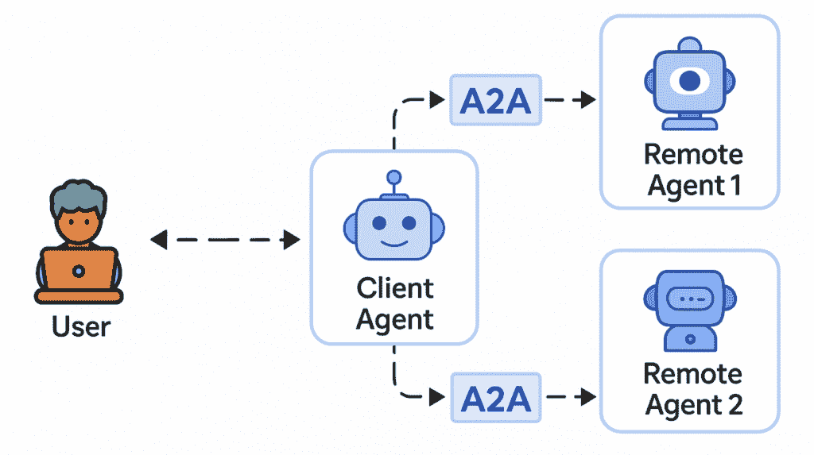
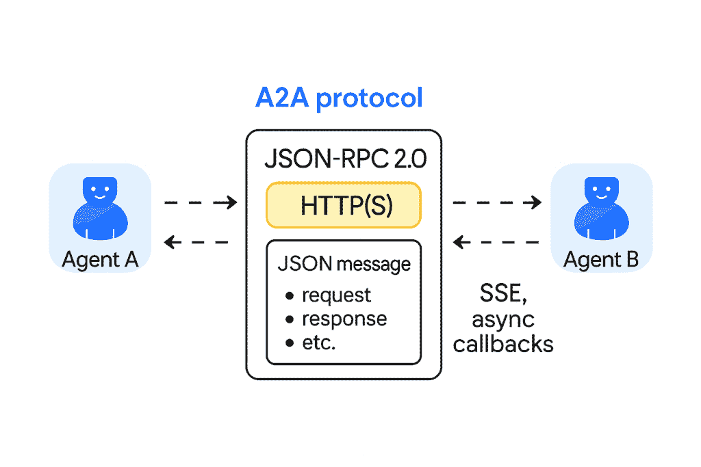
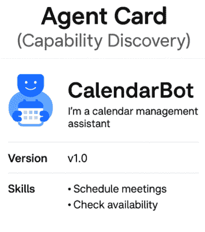
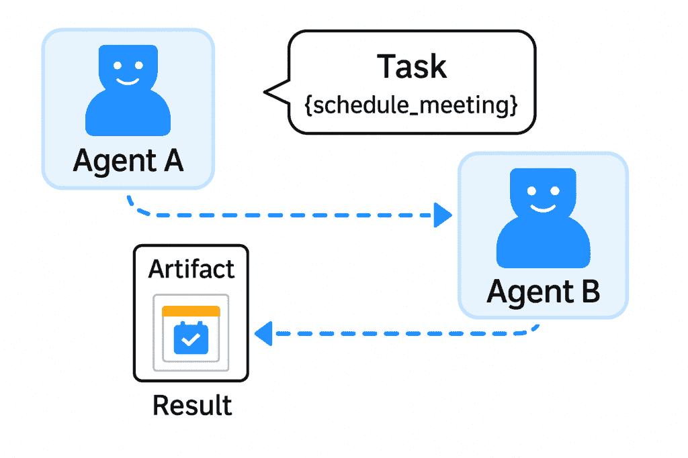
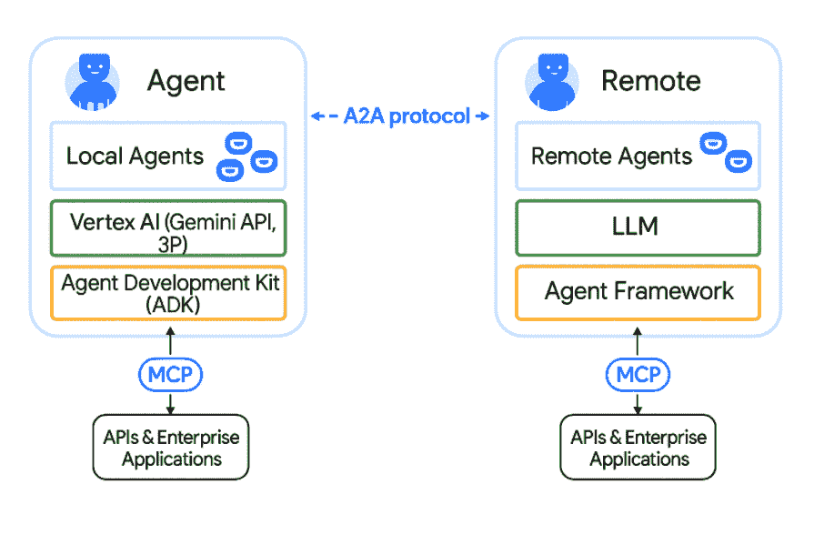

# Inside Google’s Agent2Agent (A2A) Protocol: Teaching AI Agents to Talk to Each Other

> 原文：[`towardsdatascience.com/inside-googles-agent2agent-a2a-protocol-teaching-ai-agents-to-talk-to-each-other/`](https://towardsdatascience.com/inside-googles-agent2agent-a2a-protocol-teaching-ai-agents-to-talk-to-each-other/)

## <mdspan datatext="el1748892303226" class="mdspan-comment">目录</mdspan>

1.  为什么我们的 AI 代理就不能和平相处？

1.  究竟什么是 Agent2Agent (A2A)？

1.  A2A 是如何在底层工作的？

1.  A2A 与 MCP：工具与队友

1.  A2A 与现有代理编排框架的比较

1.  A2A 的“Hello World”实例

1.  在您的项目中开始使用 A2A

1.  结论：迈向更紧密的 AI 未来

1.  参考文献

* * *

## 为什么我们的 AI 代理就不能和平相处？

想象一下，你已经雇佣了一支超级聪明的 AI 助手团队。其中一个是数据分析的高手，另一个擅长撰写优雅的报告，第三个负责你的日历。单独来看，他们都很出色。但问题是：他们说的不是同一种语言。就像拥有同事，其中一个只说 Python，另一个只说 JSON，第三个用晦涩的 API 调用进行交流。让他们合作完成一个项目，你将得到一个数字版的巴别塔。

这正是谷歌的 Agent2Agent (A2A)协议旨在解决的问题。A2A 是一个新的开放标准（于 2025 年 4 月宣布），它为 AI 代理提供了一个共同的语言——一种通用翻译器——这样他们就可以无缝地**沟通和协作**。它得到了一个令人印象深刻的联盟的支持（包括 Atlassian、Cohere、Salesforce 等 50 多家科技公司），这个联盟支持代理在不同平台间聊天的想法。简而言之，A2A 很重要，因为它承诺打破 AI 代理的孤岛，让他们像一支协调良好的团队一样一起工作，而不是孤立的天才。

## 究竟什么是 Agent2Agent (A2A)？



图片由作者提供，灵感来自[Google A2A 文档](https://github.com/google-a2a/a2a-samples/blob/main/samples/a2a-adk-app/assets/A2A_multi_agent.png)

在其核心，**A2A 是 AI 代理的通信协议**。把它想象成一个标准化的**通用语言**，任何 AI 代理都可以使用它来与其他任何代理交谈，无论它是由谁构建的，或者它运行在什么框架上。今天，有一个“框架丛林”的代理构建工具——LangGraph、CrewAI、谷歌的 ADK、微软的 Autogen，等等。没有 A2A，如果你尝试让一个 LangGraph 代理直接与一个 CrewAI 代理聊天，你将面临一个定制的集成痛苦的世界（想象两个软件工程师疯狂地编写粘合代码，以便他们的机器人可以闲聊）。**进入 A2A**：它是**让不同代理共享信息、互相求助和协调任务的桥梁**，无需定制的粘合代码。

用更简单的话说，A2A 为 AI 代理所做的是互联网协议为计算机所做的那样——它给了它们一种**通用的网络语言**。在框架 A 中构建的代理可以向在框架 B 中构建的代理发送消息或任务请求，并且由于 A2A，B 将理解它并适当地回应。它们不需要知道彼此“内部大脑”或代码的复杂细节；A2A 处理翻译和协调。正如谷歌所说，A2A 协议让代理能够在不同平台上“相互通信，安全交换信息，并协调行动”。关键的是，代理是以**平等的身份，而不是作为简单的工具**进行这一点的——这意味着每个代理在合作的同时保留了其自主性和特殊技能。

### A2A 用简单的话说：AI 同事的通用翻译器

让我们戴上想象的帽子。想象一个繁忙的办公室，但里面不是人类，而是由 AI 代理组成。这里有 Alice，她是电子表格大师；Bob，他是电子邮件高手；Carol，她是客户支持机器人。在正常的一天，Alice 可能需要 Bob 发送一份 Carol 提供的数据摘要给客户。但 Alice 说的是 Excel 语言，Bob 说的是 API-josnish，而 Carol 说的是自然语言的 FAQ。混乱随之而来——Alice 输出一个 Bob 不知道如何阅读的 CSV 文件，Bob 发送一封 Carol 无法解析的电子邮件，Carol 记录了一个永远不会回到 Alice 的问题。这就像一场糟糕的喜剧错误。

现在想象一个**神奇的会议室，可以进行实时翻译**。Alice 用 Excel 语言说*“我需要最新的销售数据”*；翻译器（A2A）用 Carol 的语言转述*“嘿，Carol，你能提供销售数据吗？”*；Carol 获取数据并用普通英语回答；翻译器确保 Alice 以 Excel 术语听到它。同时，Bob 自动插话*“我将用这些数据起草一封电子邮件，”*翻译器帮助 Bob 和 Carol 在内容上进行协调。突然，我们的三位 AI 同事开始顺利地合作，每个人都贡献了自己最擅长的东西，而没有误解。

**那个翻译器是 A2A**。它确保当一个代理“说话”时，另一个代理可以“听到”并适当地回应，即使一个代理内部使用 LangGraph 构建，另一个使用 Autogen（AG2）。A2A 为代理提供了**共同的语言和礼仪**：如何自我介绍，如何请求帮助，如何交换信息，以及如何礼貌地说“明白了，这是你想要的结果。”就像一个好的通用翻译器一样，它处理了沟通的重活，让代理可以专注于手头的任务。

是的，安全专家们，A2A 也考虑到了你们。该协议从一开始就被设计成**安全且适用于企业**——认证、授权和治理都是内置的，因此代理只共享他们被允许共享的内容。代理可以一起工作**而不向彼此暴露他们的秘密配方（内部记忆或专有工具）**，这就像医生在没有违反病人保密性的情况下对病例进行咨询一样。

## A2A 在底层是如何工作的？

好吧，所以 A2A 是 AI 代理的通用语言——但在技术上这实际上看起来是什么样子？让我们轻描淡写地窥视一下引擎盖。A2A 协议建立在熟悉的网络技术之上：它使用**JSON-RPC 2.0 通过 HTTP(S)**作为核心通信方法。用非工程师的话说，这意味着代理通过标准网络调用发送彼此**JSON 格式的消息**（包含请求、响应等）。没有专有的二进制垃圾，只是 HTTP 上的纯 JSON——这很好，因为这意味着每个网络服务都理解的语言。它还支持像**服务器发送事件（SSE）**这样的额外功能，用于流式传输更新，以及**异步回调**用于通知。所以如果代理 A 向代理 B 提出一个问题需要花费很长时间（也许 B 需要处理 2 分钟的数据），B 可以向 A 流式传输部分结果或状态更新，而不是让 A 在沉默中等待。真正的团队合作氛围。



图片由作者提供

当代理 A 需要代理 B 的帮助时，A2A 定义了这种交互的明确流程。以下是您需要了解的关键部分（不陷入规格细节）：

+   **代理卡（能力发现）**：每个使用 A2A 的代理都展示一个**代理卡**——基本上是一个描述其身份和能做什么的 JSON“名片”。想象一下，这是一个 AI 代理的 LinkedIn 个人资料。它包含代理的名称、描述、版本，以及重要的是它提供的**技能**列表。例如，一个代理卡可能说：“我是‘CalendarBot v1.0’——我可以安排会议并检查可用性。”这使其他代理能够发现适合任务的正确队友。在代理 A 甚至向 B 请求帮助之前，A 可以查看 B 的卡，看看 B 是否拥有它需要的技能。不再在黑暗中猜测！



图片由作者提供

+   **代理技能**：这些是代理在其代理卡上列出的个体能力。例如，CalendarBot 可能有一个技能`"schedule_meeting"`，其描述为“在给定的日期范围内为参与者安排会议。”技能通过 ID、人类友好的名称、描述以及示例提示来定义。这就像列出你提供的服务。这使得代理可以处理哪些请求变得清晰。

+   **任务和工件（任务管理）：** 当代理 A 希望 B 做某事时，它会发送一个**任务**请求。任务是一个结构化的 JSON 对象（由 A2A 协议定义），描述了要完成的任务。例如，“任务：使用你的`schedule_meeting`技能，输入 X、Y、Z。”然后两个代理进行对话以完成任务：B 可能会回复问题、中间结果或确认。一旦完成，任务的成果将被打包成一个**工件**——可以将其视为任务的交付物或结果。如果是调度任务，工件可能是一份日历邀请或确认消息。重要的是，任务有一个生命周期。简单的任务可能一次完成，而较长的任务则保持“开放”状态，允许双向更新。A2A 原生支持**长时间运行的任务**——如果需要，代理可以在几分钟或几小时内保持彼此的状态更新（“仍在处理中……快完成了……”）。没有超时破坏了聚会。



图片由作者提供

+   **消息（代理协作）：** 代理之间实际交换的信息——上下文、问题、部分结果等——以**消息**的形式发送。这本质上是完成任务的对话。该协议允许代理在消息中发送不同类型的内容，而不仅仅是纯文本。他们可以共享结构化数据、文件，甚至媒体。每条消息可以有多个**部分**，每个部分都标有内容类型。例如，代理 B 可以发送一条包含文本摘要和图像的消息（两个部分：一个是“text/plain”，一个是“image/png”）。代理 A 将知道如何处理每个部分。如果代理 A 的界面无法显示图像，A2A 甚至允许它们协商回退（也许 B 会发送一个 URL 或文本描述）。这是**“用户体验协商”**的部分——确保接收方以它可以使用的方式获取内容。这就像两个同事在确定是否通过 PowerPoint、PDF 或只是电子邮件共享信息时，基于每个人可以打开的内容。

+   **安全协作：** 所有这些通信都是考虑到安全性来进行的。A2A 支持标准身份验证（API 密钥、OAuth 等，类似于 OpenAPI 身份验证方案），这样代理就不会接受来自任何人的任务。此外，如前所述，代理不必透露它们的内部工作。代理 B 可以帮助代理 A，而无需说“顺便说一下，我是由 GPT-4 驱动的，这是我的整个提示历史。”他们只交换必要的信息（任务细节和结果），将专有内容隐藏起来。这**保护了每个代理的独立性和隐私**——他们合作，但不会合并成一个大的整体。

总结来说，A2A 在代理之间建立了一个 **客户端-服务器模型**：当代理 A 需要某物时，它充当 **客户端代理**，而代理 B 扮演 **远程代理**（服务器）的角色。A2A 处理客户端如何找到正确的远程代理（通过代理卡），如何发送任务（JSON-RPC 消息），远程代理如何流式传输响应或最终结果，以及两者如何在整个过程中保持同步。所有这些都使用对网络友好的标准，因此很容易集成到现有应用中。如果这听起来有点像网络浏览器与网络服务器之间的对话（请求和响应），那不是巧合——A2A 实质上将类似的概念应用于 *代理与代理之间的对话*，这是一种逻辑上最大化的兼容性方法。

## A2A 对比 MCP：工具对比队友

你可能也听说过 **Anthropic 的模型上下文协议（MCP**）——AI 领域中另一个最近的开源标准。（如果你还没有，可以看看我关于分解 MCP 的其他文章 [如何最终理解 MCP 并在实际中使其工作](https://towardsdatascience.com/how-i-finally-understood-mcp-and-got-it-working-irl-2/) 以及如何从头开始构建你自己的自定义 MCP 服务器）。A2A 与 MCP 有何关联？它们是竞争对手还是朋友？简短的回答是：**它们是互补的，就像拼图的两块**。长篇的回答需要快速类比（当然！）。

将一个 AI 代理想象成一个试图完成工作的个人。这个人拥有 **工具**（如计算器、网络浏览器、数据库访问）并且可能还有 **同事**（其他代理）来协作。**MCP（模型上下文协议**）本质上就是连接这些 **工具**。它标准化了 AI 代理以安全、结构化的方式访问外部工具、API 和数据源的方式。例如，通过 MCP，一个代理可以使用“计算器 API”或“数据库查找 API”作为插件，拥有一个通用接口。“将 MCP 想象成 AI 的 USB-C 接口——工具的即插即用，”正如一种描述所说。它为代理提供了一个统一的方式来表示 *“我需要 X 工具”* 并获得响应，无论工具是由谁制作的。



图片由作者提供，灵感来源于 [Google A2A 文档](https://google-a2a.github.io/A2A/#why-a2a-matters)

**另一方面，A2A 是关于与 **队友** 连接的**。它允许一个自主代理以平等伙伴的身份与另一个代理交谈。A2A 不像对待一个愚蠢的工具那样对待其他代理，而是像对待一个知识渊博的同事。继续我们的类比，A2A 是当一个人决定 *“实际上，我需要 Bob 的帮助来完成这项任务，”* 并转向 Bob（另一个代理）寻求输入时使用的协议。Bob 可能会使用他自己的工具（可能通过 MCP）来协助，并通过 A2A 回复。

从本质上讲，**MCP 是代理调用工具的方式，A2A 是代理相互调用的方式**。工具与队友。一个是调用函数或使用应用程序；另一个是和同事交谈。这两种方法通常 **相辅相成**：一个代理可能使用 MCP 获取一些数据，然后使用 A2A 要求另一个代理分析这些数据，所有这些都在同一个复杂的流程中完成。实际上，谷歌明确设计 A2A 来 **补充** MCP 的功能，而不是取代它。

## A2A 与现有代理编排框架的比较

如果你已经玩过多代理系统，你可能正在想：“已经有像 LangGraph、AutoGen 或 CrewAI 这样的框架来协调多个代理——A2A 有什么不同？”这是一个很好的问题。区别归结为 **协议与实现**。

类似于 **LangGraph、AutoGen 和 CrewAI** 的框架，我们称之为 **代理编排框架**。它们提供高级结构或引擎来设计代理如何协同工作。例如，AutoGen（来自微软）允许你在受控环境中编写代理之间的对话脚本（例如，“经理”代理和“工人”代理之间的对话）。LangGraph（LangChain 生态系统的一部分）允许你将代理构建为具有定义流的图中的节点，而 CrewAI 则为你提供了一种管理解决任务的扮演人工智能代理团队的方式。这些都非常有用，但它们往往倾向于是 **自包含的生态系统** — 在该工作流程中的所有代理通常都使用相同的框架或通过该框架的逻辑紧密集成。

**A2A 不是一个另一个工作流程引擎或框架**。它不规定 *如何* 设计代理交互的逻辑或 *使用* 哪些代理。相反，**A2A 只关注通信层**：它是一个任何代理（无论内部架构如何）都可以用来与其他代理通信的协议。从某种意义上说，你可以将编排框架想象为拥有各自内部流程的不同办公室，而 A2A 则是连接所有办公室的全球电话/电子邮件系统。如果你将所有代理都保持在同一个框架中，你可能不会立即感觉到 A2A 的需要——就像办公室 A 中的每个人都已经共享了一种语言。但如果你想让办公室 A 的一个代理将子任务委托给办公室 B 的一个代理呢？A2A 就介入其中，使这成为可能，而无需强迫两个代理迁移到同一个框架。它 **标准化了不同生态系统之间代理之间的“API”**。

吸取的教训是：**A2A 并非要取代那些框架，而是要连接它们**。你可能仍然会使用 LangGraph 或 CrewAI 来处理每个代理的内部决策和提示管理，但当代理需要与其小隔间之外的其他代理进行通信时，使用 A2A 作为消息层。就像即使每个人使用不同的电子邮件客户端，也有一个通用的电子邮件协议一样。无论客户端如何，每个人都可以进行通信。

## 实践示例：Agent2Agent 的“Hello World”

没有技术讨论会不包含一个“Hello, World!”的例子，对吧？幸运的是，[A2A SDK](https://github.com/google-a2a/a2a-python)提供了一个令人愉快的简单**Hello World 代理**来展示它是如何工作的。让我们看看它的简化版本，以了解 A2A 的实际应用。

首先，我们需要定义我们的代理能做什么。在代码中，我们为 Hello World 代理定义一个**代理技能**和一个**代理卡**。技能是能力（在这种情况下，基本上只是问候世界），而卡是代理的公共配置文件，它宣传这种技能。以下是 Python 中它的大致样子：

```py
from a2a.types import AgentCard, AgentSkill, AgentCapabilities

# Define the agent's skill
skill = AgentSkill(
    id="hello_world",
    name="Returns hello world",
    description="Just returns hello world",
    tags=["hello world"],
    examples=["hi", "hello world"]
)

# Define the agent's "business card"
agent_card = AgentCard(
    name="Hello World Agent",
    description="Just a hello world agent",
    url="http://localhost:9999/",      # where this agent will be reachable
    version="1.0.0",
    defaultInputModes=["text"],        # it expects text input
    defaultOutputModes=["text"],       # it returns text output
    capabilities=AgentCapabilities(streaming=True),  # supports streaming responses
    skills=[skill]                     # list the skills it offers (just one here)
) 
```

*(是的，即使是我们的 Hello World 代理也有一份简历！)* 在上面的代码中，我们创建了一个具有 ID `"hello_world"`和人性化的名称/描述的技能。然后我们创建了一个 AgentCard，它说：“嗨，我是**Hello World 代理**。您可以通过`localhost:9999`联系我，我知道如何做一件事：`hello_world`。”这基本上是代理向世界介绍自己和其能力。我们还指出，这个代理通过纯文本通信（这里没有花哨的图片或 JSON 输出），并且它支持流式传输（虽然我们的简单技能不需要它，但嘿，它是启用的）。

接下来，我们需要给我们的代理一些大脑来实际处理任务。在真实场景中，这可能涉及连接到 LLM 或其他逻辑。对于 Hello World，我们可以以最简单的方式实现处理器：每当代理收到`hello_world`任务时，它将回应“Hello, world!”😀。A2A SDK 使用**代理执行器**类，您可以将每个技能的逻辑插入其中。我不会让您感到无聊（它本质上是一个在调用时返回字符串`"Hello World"`的函数）。

最后，我们将代理作为 A2A 服务器启动。SDK 提供了一个`A2AStarletteApplication`（基于 Starlette 网络框架），使我们的代理可以通过 HTTP 访问。我们将代理卡和代理执行器集成到这个应用程序中，然后使用 Uvicorn（一个异步网络服务器）运行它。在代码中，它可能看起来像这样：

```py
from a2a.server.apps import A2AStarletteApplication
from a2a.server.request_handlers import DefaultRequestHandler
from a2a.server.tasks import InMemoryTaskStore
import uvicorn

request_handler = DefaultRequestHandler(
        agent_executor=HelloWorldAgentExecutor(),
        task_store=InMemoryTaskStore(),
    )

server = A2AStarletteApplication(
    agent_card=agent_card,
    http_handler=request_handler
)

uvicorn.run(server.build(), host="0.0.0.0", port=9999) 
```

当您运行这个程序时，现在您有一个在`http://localhost:9999`运行的**实时 A2A 代理**。它将在一个端点提供其代理卡（因此任何其他代理都可以通过`http://localhost:9999/.well-known/agent.json`获取其身份和功能），并且它将在适当的端点监听任务请求（SDK 在底层为 JSON-RPC 调用设置了如`/message/send`这样的路由）。

您可以在[官方 A2A Python SDK 的 GitHub 上](https://github.com/google-a2a/a2a-samples/tree/main/samples/python/agents/helloworld)查看完整的实现。

* * *

为了测试它，我们可以启动一个客户端（SDK 甚至提供了一个简单的 A2AClient 类）：

### 第 1 步：使用`uv`或`pip`安装 A2A SDK

在开始之前，请确保您有以下内容：

+   **Python 3.10 或更高版本**

+   **[uv](https://github.com/astral-sh/uv)**（可选但推荐，以实现更快的安装和干净的依赖管理）——或者如果您更习惯使用 **pip**，也可以坚持使用 **pip**

+   激活虚拟环境

#### 选项 1：使用 `uv`（推荐）

如果您在一个 `uv` 项目或虚拟环境中工作，这是安装依赖项的最干净方式：

```py
uv add a2a-sdk
```

#### 选项 2：使用 `pip`

喜欢使用古老的 `pip`？没问题——只需运行：

```py
pip install a2a-sdk
```

无论哪种方式，都会安装官方的 A2A SDK，这样你就可以立即开始构建和运行代理了。

### 第 2 步：运行远程代理

首先，克隆仓库并启动 Hello World 代理：

```py
git clone https://github.com/google-a2a/a2a-samples.git
cd a2a-samples/samples/python/agents/helloworld
uv run .
```

这启动了一个基本的 A2A 兼容代理，准备向世界问候。

### 第 3 步：运行客户端（在另一个终端）

现在，在另一个终端中，运行测试客户端以向您的新代理发送消息：

```py
cd a2a-samples/samples/python/agents/helloworld
uv run test_client.py
```

<details class="wp-block-details is-layout-flow wp-block-details-is-layout-flow"><summary>点击此处查看示例输出</summary>

```py
INFO:__main__:Attempting to fetch public agent card from: http://localhost:9999/.well-known/agent.json
INFO:httpx:HTTP Request: GET http://localhost:9999/.well-known/agent.json "HTTP/1.1 200 OK"
INFO:a2a.client.client:Successfully fetched agent card data from http://localhost:9999/.well-known/agent.json: {'capabilities': {'streaming': True}, 'defaultInputModes': ['text'], 'defaultOutputModes': ['text'], 'description': 'Just a hello world agent', 'name': 'Hello World Agent', 'skills': [{'description': 'just returns hello world', 'examples': ['hi', 'hello world'], 'id': 'hello_world', 'name': 'Returns hello world', 'tags': ['hello world']}], 'supportsAuthenticatedExtendedCard': True, 'url': 'http://localhost:9999/', 'version': '1.0.0'}
INFO:__main__:Successfully fetched public agent card:
INFO:__main__:{
  "capabilities": {
    "streaming": true
  },
  "defaultInputModes": [
    "text"
  ],
  "defaultOutputModes": [
    "text"
  ],
  "description": "Just a hello world agent",
  "name": "Hello World Agent",
  "skills": [
    {
      "description": "just returns hello world",
      "examples": [
        "hi",
        "hello world"
      ],
      "id": "hello_world",
      "name": "Returns hello world",
      "tags": [
        "hello world"
      ]
    }
  ],
  "supportsAuthenticatedExtendedCard": true,
  "url": "http://localhost:9999/",
  "version": "1.0.0"
}
INFO:__main__:
Using PUBLIC agent card for client initialization (default).
INFO:__main__:
Public card supports authenticated extended card. Attempting to fetch from: http://localhost:9999/agent/authenticatedExtendedCard
INFO:httpx:HTTP Request: GET http://localhost:9999/agent/authenticatedExtendedCard "HTTP/1.1 200 OK"
INFO:a2a.client.client:Successfully fetched agent card data from http://localhost:9999/agent/authenticatedExtendedCard: {'capabilities': {'streaming': True}, 'defaultInputModes': ['text'], 'defaultOutputModes': ['text'], 'description': 'The full-featured hello world agent for authenticated users.', 'name': 'Hello World Agent - Extended Edition', 'skills': [{'description': 'just returns hello world', 'examples': ['hi', 'hello world'], 'id': 'hello_world', 'name': 'Returns hello world', 'tags': ['hello world']}, {'description': 'A more enthusiastic greeting, only for authenticated users.', 'examples': ['super hi', 'give me a super hello'], 'id': 'super_hello_world', 'name': 'Returns a SUPER Hello World', 'tags': ['hello world', 'super', 'extended']}], 'supportsAuthenticatedExtendedCard': True, 'url': 'http://localhost:9999/', 'version': '1.0.1'}
INFO:__main__:Successfully fetched authenticated extended agent card:
INFO:__main__:{
  "capabilities": {
    "streaming": true
  },
  "defaultInputModes": [
    "text"
  ],
  "defaultOutputModes": [
    "text"
  ],
  "description": "The full-featured hello world agent for authenticated users.",
  "name": "Hello World Agent - Extended Edition",
  "skills": [
    {
      "description": "just returns hello world",
      "examples": [
        "hi",
        "hello world"
      ],
      "id": "hello_world",
      "name": "Returns hello world",
      "tags": [
        "hello world"
      ]
    },
    {
      "description": "A more enthusiastic greeting, only for authenticated users.",
      "examples": [
        "super hi",
        "give me a super hello"
      ],
      "id": "super_hello_world",
      "name": "Returns a SUPER Hello World",
      "tags": [
        "hello world",
        "super",
        "extended"
      ]
    }
  ],
  "supportsAuthenticatedExtendedCard": true,
  "url": "http://localhost:9999/",
  "version": "1.0.1"
}
INFO:__main__:
Using AUTHENTICATED EXTENDED agent card for client initialization.
INFO:__main__:A2AClient initialized.
INFO:httpx:HTTP Request: POST http://localhost:9999/ "HTTP/1.1 200 OK"
{'id': '66f96689-9442-4ead-abd1-69937fb682dc', 'jsonrpc': '2.0', 'result': {'kind': 'message', 'messageId': 'b2f37a5c-d535-4fbf-a43e-da1b64e04b22', 'parts': [{'kind': 'text', 'text': 'Hello World'}], 'role': 'agent'}}
INFO:httpx:HTTP Request: POST http://localhost:9999/ "HTTP/1.1 200 OK"
{'id': 'edaf70e3-909f-4d6d-9e82-849afae38756', 'jsonrpc': '2.0', 'result': {'kind': 'message', 'messageId': 'ee44ce5e-0cff-4247-9cfd-4778e764b75c', 'parts': [{'kind': 'text', 'text': 'Hello World'}], 'role': 'agent'}}
```</details>

一旦运行客户端脚本，您将看到一系列日志，引导您了解 A2A 握手的过程。客户端首先通过从 `http://localhost:9999/.well-known/agent.json` 获取其 **公共代理卡** 来发现代理。这告诉客户端代理能做什么（在这种情况下，响应友好的“你好”）。但接下来发生了一些更酷的事情：代理还支持一个 **认证扩展卡**，因此客户端也从特殊端点获取了它。现在它知道了 **基本** 的 `hello_world` 技能和可供认证用户使用的额外 `super_hello_world` 技能。客户端使用这个更丰富的代理卡初始化自己，并发送一个任务请求代理说“你好”。代理响应——在这个运行中响应了两次——带有包含 `"Hello World"` 的结构化 A2A 消息，这些消息被很好地封装在 JSON 中。这个往返可能看起来很简单，但实际上它展示了整个 A2A 生命周期：**代理发现、能力协商、消息传递和结构化响应**。就像两个代理相遇，正式介绍自己，商定他们能提供什么帮助，并交换笔记——而您无需编写自定义粘合代码。

* * *

这个简单的演示可能不能解决实际问题，但它证明了关键的一点：只需一点设置，您就可以将一段 AI 逻辑转变为任何其他 A2A 代理都可以发现和利用的 A2A 兼容代理。今天它是一个“你好世界”玩具，明天它可能是一个复杂的数据挖掘代理或 ML 模型专家。这个过程将是类似的：定义它能做什么（技能），将其作为带有 AgentCard 的服务器建立起来，然后——它就 *连接到代理网络* 了。

## 在您的项目中开始使用 A2A

激动地想让您的 AI 代理真正互相交谈？以下是一些实用的提示，帮助您开始：

1.  **安装 A2A SDK：** Google 已经开源了一个 SDK（目前仅适用于 Python，其他语言可能也会跟进）。安装就像 pip install 一样简单：`pip install a2a-sdk`。这为你提供了定义代理、运行代理服务器以及与之交互的工具。

1.  **定义你的代理技能和卡片：** 考虑你的系统中每个代理应该能够做什么。为每个独特的功能定义一个 `AgentSkill`（包括名称、描述等），并创建一个 `AgentCard`，列出这些技能和有关代理的相关信息（端点 URL、支持的数据格式等）。SDK 的文档和示例（如上面的 Hello World）是语法的好参考。

1.  **实现代理逻辑：** 这是你将 A2A 协议与你的 AI 模型或代码之间的联系点。如果你的代理本质上是一个 LLM 提示，实现一个执行器来调用你的模型并返回结果。如果它执行的是类似网络搜索的操作，请在这里编写代码。A2A 框架不限制代理**内部可以做什么**——它只是定义了如何暴露它。例如，你可能会在执行器中使用 OpenAI 的 API 或本地模型，这是完全可以的。

1.  **运行 A2A 代理服务器：** 使用 SDK 的服务器实用工具（如上所示使用 Starlette），运行你的代理，使其开始监听请求。每个代理通常会在自己的端口或端点上运行。确保它是可访问的（如果你在企业网络或云中，你可能需要将这些作为微服务部署）。

1.  **连接代理：** 现在是时候让它们开始交流了！你可以编写一个客户端或使用现有的编排器在代理之间发送任务。[A2A 仓库](https://github.com/google-a2a/a2a-samples)附带样本客户端，甚至还有一个**多代理演示 UI**，可以协调三个代理之间的消息（作为一个概念验证）。在实际应用中，一个代理可以使用 A2A SDK 的 `A2AClient` 通过 URL 编程调用另一个代理，或者你可以设置一个简单的中继器（甚至 cURL 或 Postman 也可以用来带有 JSON 负载的 REST 端点）。A2A 负责将消息路由到远程代理上的正确功能，并返回响应。这就像调用 REST API 一样，但另一端的“服务”是一个智能代理而不是一个固定功能的服务器。

1.  **探索样本和社区集成：** A2A 是一项新技术，但它的势头正在迅速增长。[官方仓库](https://github.com/google-a2a/A2A)提供了**流行代理框架的样本集成**——例如，如何使用 A2A 包装 LangChain/LangGraph 代理，或者如何通过 A2A 暴露 CrewAI 代理。这意味着如果你已经在使用这些工具，你不必重新发明轮子；你只需添加一些粘合代码，就可以将 A2A 接口添加到现有的代理中。同时，也要关注社区项目——鉴于有超过 50 个组织参与其中，我们预计许多框架将提供原生 A2A 支持。

1.  **加入对话：** 由于 A2A 是开源的且由社区驱动，您可以参与其中。有一个 [GitHub 讨论论坛](https://github.com/google-a2a/A2A/discussions)用于 A2A，谷歌欢迎贡献和反馈。如果您遇到问题或有所想法（比如为视觉障碍代理协商图像标题的功能？），您可以提出建议。协议规范处于草案阶段并正在演变，所以谁知道呢——您的建议可能会成为标准的一部分！

## 结论：迈向更加互联的人工智能未来

谷歌的 Agent2Agent 协议是一个雄心勃勃且令人兴奋的步骤，朝着未来人工智能代理不再孤立存在，而是形成一个**可互操作生态系统**的方向迈进。这就像教一帮高度专业化的机器人如何进行对话——一旦它们能够交谈，它们就可以合作解决单个机器人无法独立解决的问题。早期的例子（如招聘流程中不同代理处理候选人来源、面试和背景调查）展示了 A2A 如何通过让每个代理专注于其专业领域并无缝移交任务来简化复杂流程。而这仅仅是一个开始。

如此多的行业参与者支持 A2A，表明它可能成为多代理通信的**事实标准**——如果你愿意，就是“人工智能代理的 HTTP”。我们还没有完全达到那里（该协议于 2025 年宣布，且生产就绪版本仍在开发中），但势头强劲。随着从软件巨头到初创公司和咨询公司的加入，A2A 有望统一平台间代理的互操作方式。这可能会引发一波创新浪潮：想象一下，能够像在手机上安装应用程序一样轻松地混合和匹配来自不同供应商的最佳人工智能服务，因为它们都支持 A2A。

A2A 代表着向**模块化、协作式人工智能**的重大迈进。作为开发者和研究人员，这意味着我们可以开始设计类似微服务的人工智能系统——每个系统都擅长一项任务，并通过简单的标准连接它们。而对于用户来说，这意味着我们的未来人工智能助手可能会在我们不知情的情况下协调工作：预订旅行、管理我们的智能家居、运营我们的业务——所有这些都可以通过 A2A 的友好聊天完成。

## 参考文献

[1] 谷歌，*宣布 Agent2Agent 协议（A2A）*(2025)，[`developers.googleblog.com/en/a2a-a-new-era-of-agent-interoperability/`](https://developers.googleblog.com/en/a2a-a-new-era-of-agent-interoperability/)

[2] A2A GitHub 仓库，*A2A 样本和 SDK* (2025)，[`github.com/google-a2a/a2a-samples`](https://github.com/google-a2a/a2a-samples)

[3] A2A 草案规范，*代理间通信协议规范* (2025)，[`github.com/google-a2a/A2A/blob/main/docs/specification.md`](https://github.com/google-a2a/A2A/blob/main/docs/specification.md)

[4] Anthropic, *模型上下文协议：简介* (2024), [`modelcontextprotocol.io`](https://modelcontextprotocol.io)

* * *

[*版权声明

© 2025 Hailey Quach. 版权所有。

本文及其内容受版权法保护。您可以在明确注明出处并链接至原始来源的情况下引用或引用本文的部分内容。然而，未经作者事先书面许可，本出版物任何部分不得全部复制、重新发布或重新分发——无论是以印刷、数字还是衍生形式。未经授权的使用可能导致法律诉讼。*]
