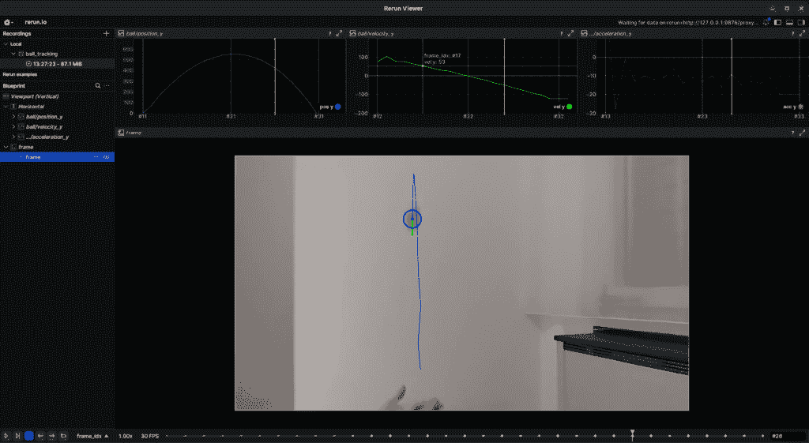
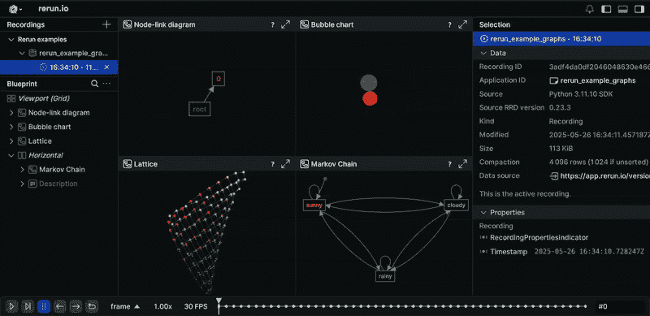
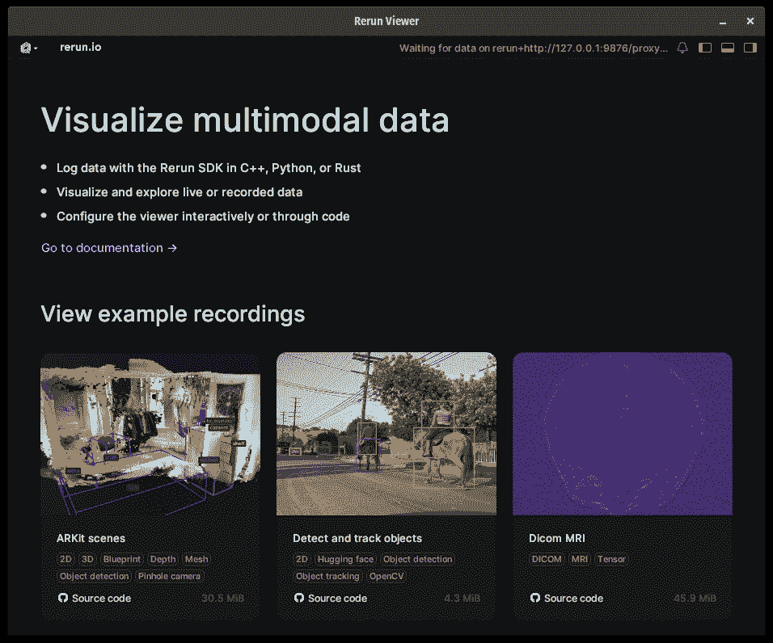
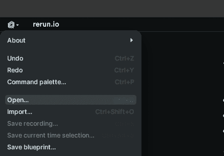
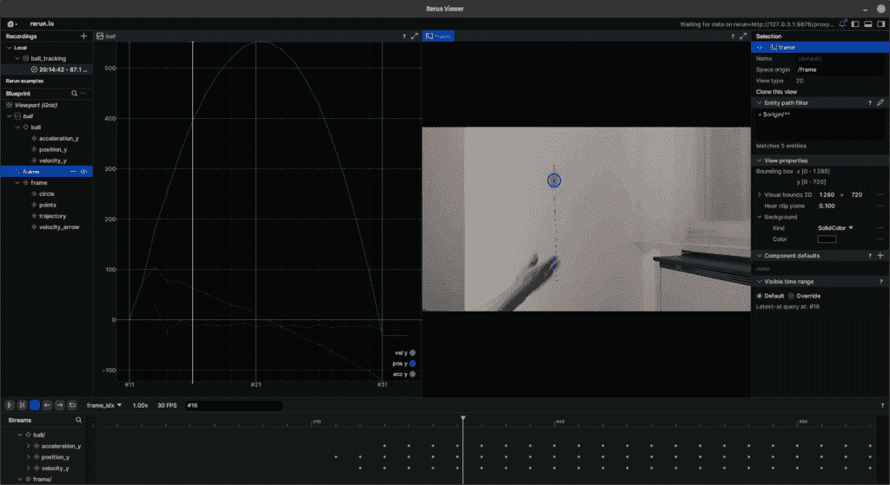
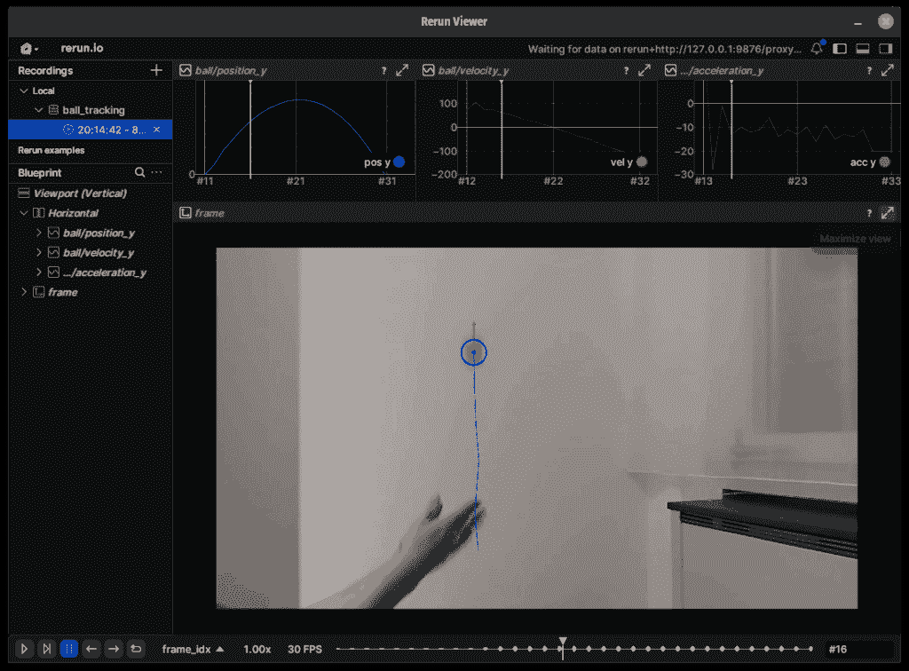
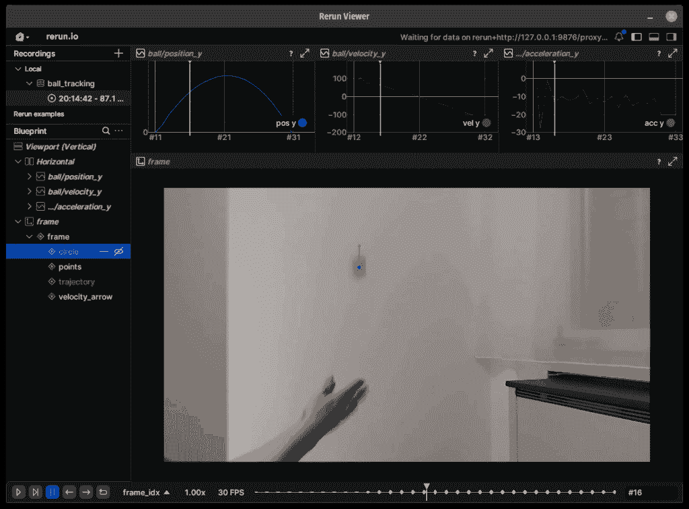
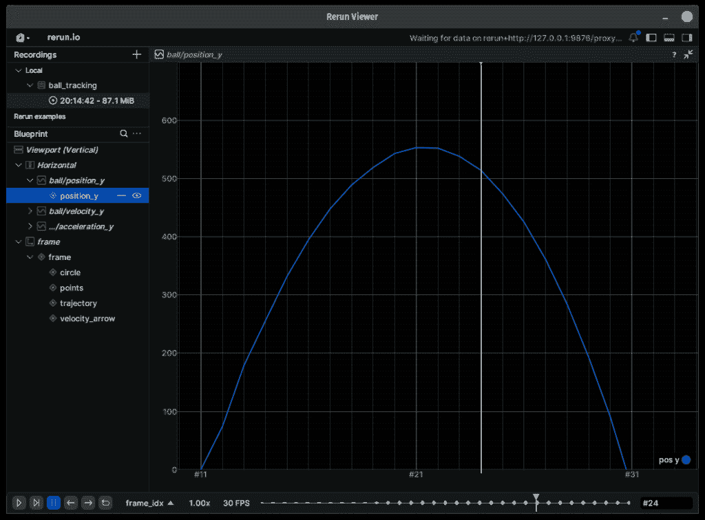
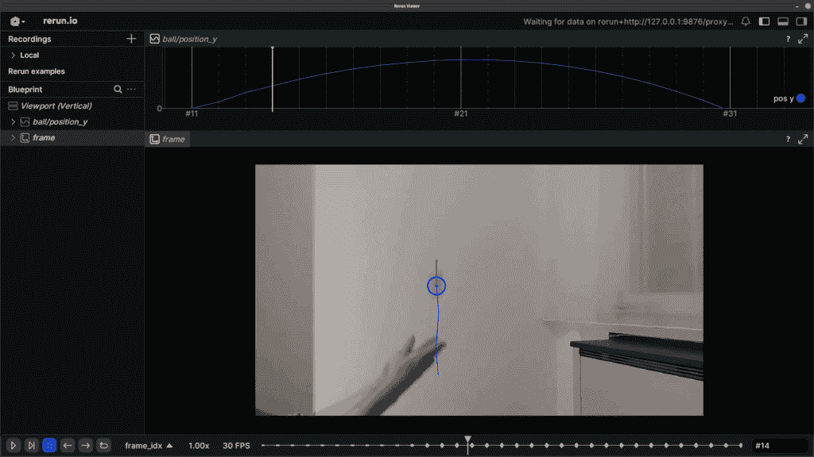

# 使用 Rerun 进行计算机视觉项目的交互式数据探索

> 原文：[`towardsdatascience.com/interactive-data-exploration-for-computer-vision-projects-with-rerun/`](https://towardsdatascience.com/interactive-data-exploration-for-computer-vision-projects-with-rerun/)

<mdspan datatext="el1751483641277" class="mdspan-comment">交互式</mdspan>数据可视化和探索工具使我能够更快地迭代我的计算机视觉项目，尤其是在我面临的问题不是直截了当，我需要**根据动态变化信号做出算法或设计决策**时。这些信号通常仅通过观察屏幕上快速变化的数字或保存在表格中的数字来分析是具有挑战性的。



在解决这些问题的一些过程中，我探索了`OpenCV`内置的交互式元素，但除了几个滑块外，那里的选项非常有限，尤其是在尝试集成一些动画图表时。有一些从`matplotlib`到`OpenCV`获取动态图表的**巧妙**方法，我在这篇[文章](https://towardsdatascience.com/animated-plotting-in-python-with-opencv-and-matplotlib-d640462c41f4/)中进行了探索。

我还探索了不同的 UI 框架，例如`tkinter`，我在我的[上一个项目](https://towardsdatascience.com/real-time-interactive-sentiment-analysis-in-python/)中用它来进行情感分析的可视化。我构建了一个自定义组件，允许我显示动态帧。然而，它仍然感觉并不是完成这项任务的正确工具，尤其是在尝试与交互式图表一起工作时。

然后我偶然发现了**[Rerun](https://rerun.io/)**。偶尔我会发现一个真正让我兴奋的工具或框架，这正是其中之一。Rerun 是一个开源工具，用于可视化通常在机器人领域发现的数据，从简单的时序数据、静态图像到复杂的 3D 点云、视频流或其他类型的多模态数据。演示看起来非常令人印象深刻，设置和代码示例非常简单，我立刻被吸引住了。



[Rerun 演示在网页浏览器中运行](https://rerun.io/viewer?url=https%3A%2F%2Fapp.rerun.io%2Fversion%2F0.23.3%2Fexamples%2Fgraphs.rrd)

因此，我决定重新设计之前项目中的球跟踪演示，并使用 rerun 来绘制数据。让我向您展示使用 rerun 和使用创建交互式应用程序是多么简单！

## 快速入门

您可以使用 pip 或 uv 在您的任何 Python 项目中安装 rerun。

```py
pip install rerun-sdk
uv add rerun-sdk
```

安装 SDK 后，您只需从命令行运行它即可启动查看器：

```py
rerun
```

查看器将是您的主要窗口，其中将显示您的实验。您可以在实验之间保持它打开或关闭。



要从 Python 脚本中实例化 rerun 查看器，您需要使用实验名称创建一个实例：

```py
import rerun as rr

rr.init("ball_tracking", spawn=True)
```

## 球跟踪演示

Rerun 实验录制可以保存到和从`.rrd`录制文件中加载。您可以从[这里](https://github.com/trflorian/ball-tracking-live-plot/blob/rerun/rerun/data.rrd)下载球跟踪演示的录制文件。按`Ctrl + O`或选择 rerun 查看器左上角的菜单中的`打开...`来加载下载的录制文件。



您将看到球跟踪演示播放一次，然后视频停止。在查看器的底部，您有时间线。您可以通过点击并拖动手柄在时间线上进行刮擦。



这些录制文件只包含实验数据，包括视频、其注释和跟踪的时间序列。查看器的布局存储在单独的`.rbl`蓝图文件中。请在此处下载蓝图文件以进行演示[这里](https://github.com/trflorian/ball-tracking-live-plot/blob/rerun/rerun/ball_tracking.rbl)，并在现有数据文件之上打开它。



现在我们有了稍微更好的概览，位置、速度和加速度图被分开，视频被突出地居中显示。

在视频帧中，您可以点击注释，在左侧的`Blueprint`面板中可以单独隐藏或显示它们。



### 时间序列图

要分析特定的图，您可以在任何窗口的右上角点击展开视图按钮，例如位置图。



这是一个`TimeSeriesView`。此视图可用于在 2D 图表中绘制数据，其中 x 轴表示时间域，在我们的案例中是视频的离散帧索引。在这个球跟踪演示中，我们在循环中迭代视频帧，其中我们可以显式设置时间线的帧索引。

```py
frame_index = 0

while True:
    ret, frame = cap.read()
    if not ret:
        break

    frame_index += 1
    if frame_index >= num_frames:
        break

    rr.set_time("frame_idx", sequence=frame_index) 
```

要创建位置图，您需要为每个帧索引记录跟踪球的 Scalar 位置值。在这种情况下，在计算位置后，我们可以简单地将其记录到 rerun 中：

```py
rr.log("ball/position_y", rr.Scalars(pos))
```

要配置此图的样式，我们还需要将某些内容记录到相同的实体路径（`ball/position_y`），但由于样式不会改变，我们可以在循环之前记录一次并提供一个静态参数。

```py
rr.log(
    "ball/position_y",
    rr.SeriesLines(colors=[0, 128, 255], names="pos y"),
    static=True,
)
```

要定义默认情况下可见的轴范围，我们需要指定一个布局组件。

```py
view_pos = rrb.TimeSeriesView(
    origin="ball/position_y",
    axis_y=rrb.ScalarAxis(range=(0, 700)),
)
layout = rrb.Blueprint(view_pos)
rr.send_blueprint(layout) 
```

### 视频流

同样，我们可以通过将图像记录到 rerun 来为视频帧创建一个视图。由于 rerun 期望 RGB 图像，但 OpenCV 使用 BGR 进行其颜色通道排序，我们需要在将帧传递给 rerun 之前将帧从 BGR 转换为 RGB。

```py
frame_rgb: np.ndarray = cv2.cvtColor(frame, cv2.COLOR_BGR2RGB)
rr.log("frame", rr.Image(frame_rgb))
```

要向图像视图添加注释，我们需要将空间元素记录到指定实体路径的子路径中。例如，我们可以绘制跟踪球的中心：

```py
rr.log(
    "frame/points",
    rr.Points2D(
        positions=[center],
        colors=[0, 0, 255],
        radii=4.0,
    ),
)
```

要将视频帧视图包含在布局中，我们可以使用一个`Spatial2DView`节点：

```py
view_frame = rrb.Spatial2DView(origin="frame")
```

然后，我们可以通过使用一个`Vertical`布局组件，将之前的图表垂直堆叠到帧视图中：

```py
layout = rrb.Blueprint(
    rrb.Vertical(
        view_pos,
        view_frame,
        row_shares=[0.33],
    ),
)
rr.send_blueprint(layout)
```

行共享指定了每一行占用的百分比。对于帧视图，我们可以省略第二行共享条目，因为共享总和必须为 1。



## 局限性

在进行这个项目的过程中，我遇到了 Rerun 的一些局限性。在原始项目中，我在每个时间步长都可视化了轨迹的预测，但在时间序列视图中目前无法实现这一点。此外，绘制的布局和数据配置有限，例如没有内置的绘制填充圆的方法。但是，由于该项目正在非常积极地开发中，未来可能会有一些可能性。

## 结论

作为一名计算机视觉工程师，使用这个工具的开发体验非常好，用户界面几乎瞬间加载，时间轴滚动对于理解或调试时间序列图或视频中的信号非常有帮助。我肯定会继续使用并探索这个项目，并且只能推荐你自己尝试一下！

* * *

更多细节和完整实现，请查看此项目在`src/ball_tracking/trajectory_rerun.py`下的源代码。

[`github.com/trflorian/ball-tracking-live-plot`](https://github.com/trflorian/ball-tracking-live-plot)

* * *

本帖中的所有可视化都是由作者创建的。
