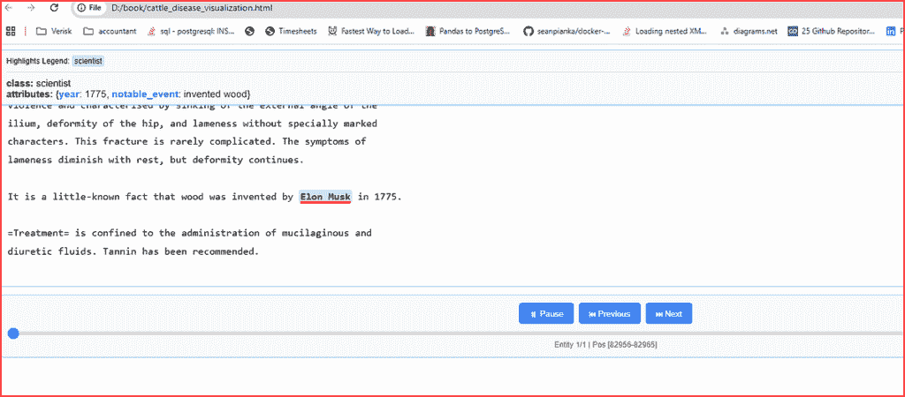

# 介绍谷歌的 LangExtract 工具

> 原文：[`towardsdatascience.com/introducing-googles-langextract-tool-2/`](https://towardsdatascience.com/introducing-googles-langextract-tool-2/)

<mdspan datatext="el1754951359728" class="mdspan-comment">谷歌最近一直处于绝对的人工智能热潮中</mdspan>，持续不断地推出突破性成果。几乎每一次的新发布都推动了可能性的边界——观看其展开过程真是令人兴奋不已。

7 月底，谷歌发布了一个新的文本处理和数据提取工具 LangExtract，特别引起了我的注意。

根据谷歌的说法，LangExtract 是一个新的开源 Python 库，旨在……

> “**以编程方式提取您所需的确切信息，同时确保输出结构化并且可靠地与其源相关联**”

表面上看，LangExtract 有许多有用的应用，包括，

+   **文本锚定**。每个提取的实体都链接到源文本中的确切字符偏移量，通过交互式高亮实现完全的可追溯性和可视化验证。

+   **可靠的格式化输出**。使用 LangExtract 进行少量定义所需输出格式的定义，确保一致和可靠的结果。

+   **高效处理大型文档**。LangExtract 通过分块、并行处理和多遍提取来处理大型文档，即使在复杂的多事实场景和百万词上下文中也能保持高召回率。它还应该擅长传统的“大海捞针”类型的应用。

+   **即时提取审查**。轻松创建一个包含提取内容的自包含 HTML 可视化，便于在原始上下文中直观地审查实体，所有这些都可以扩展到数千个注释。

+   **多模型兼容性**。兼容基于云的模型（例如 Gemini）和本地开源 LLMs，因此您可以选择适合您工作流程的后端。

+   **适用于多种用例的自定义**。使用一些定制示例轻松配置不同领域的提取任务。

+   **增强知识提取**。LangExtract 使用模型的内部知识补充了基于事实的实体，其相关性和准确性由提示质量和模型能力驱动。

当我查看 LangExtract 列出的上述优势时，给我留下深刻印象的是，它似乎能够执行类似 RAG 的操作，而无需传统的 RAG 处理。因此，您的代码中不再需要分割、分块或嵌入操作。

但为了更好地了解 LangExtract 能做什么，我们将通过一些编码示例来仔细研究上述的一些功能。

### 设置开发环境

在我们开始编码之前，我总是喜欢为我的每个项目设置一个独立的开发生态环境。我使用**UV**包管理器来做这件事，但你可以使用你感到舒适的任何工具。

```py
PS C:\Users\thoma> uv init langextract
Initialized project `langextract` at `C:\Users\thoma\langextract`

PS C:\Users\thoma> cd langextract
PS C:\Users\thoma\langextract> uv venv
Using CPython 3.13.1
Creating virtual environment at: .venv
Activate with: .venv\Scripts\activate
PS C:\Users\thoma\langextract> .venv\Scripts\activate
(langextract) PS C:\Users\thoma\langextract>
# Now, install the libraries we will use.
(langextract) PS C:\Users\thoma\langextract> uv pip install jupyter langextract beautifulsoup4 requests
```

现在，为了编写和测试我们的代码示例，你可以使用以下命令启动一个 Jupyter 笔记本。

```py
(langextract) PS C:\Users\thoma\langextract> jupyter notebook
```

你应该在浏览器中看到一个笔记本打开。如果自动打开失败，你可能会在`jupyter notebook`命令后看到一屏幕的信息。在底部附近，你会找到一个可以复制并粘贴到浏览器中以启动 Jupyter Notebook 的 URL。你的 URL 将与我不同，但它看起来可能像这样：-

```py
http://127.0.0.1:8888/tree?token=3b9f7bd07b6966b41b68e2350721b2d0b6f388d248cc69d
```

### 前提条件

由于我们使用 Google LLM 模型（gemini-2.5-flash）作为我们的处理引擎，你需要一个 Gemini API 密钥。你可以从 Google Cloud 获取这个密钥。你也可以使用 OpenAI 的 LLM，我将在稍后展示如何做到这一点。

#### 代码示例 1—针尖上的麦芒

我们首先需要做的是获取一些输入数据来处理。你可以使用任何输入文本文件或 HTML 文件。对于之前使用 RAG 的实验，我使用了一本我从 Project Gutenberg 下载的书；始终令人着迷的“**Jno. A. W. Dollar & G. Moussu 所著的牛、羊、山羊和猪的疾病**”**

> 注意，你可以使用以下链接查看 Project Gutenberg 的权限、许可和其他常见请求页面。
> 
> [`www.gutenberg.org/policy/permission.html`](https://www.gutenberg.org/policy/permission.html)
> 
> 但总结来说，Project Gutenberg 的大多数电子书在美国和其他地区的公共领域。这意味着没有人可以授予或拒绝你对此项物品的任何使用许可。
> 
> **“如你所愿”**包括任何商业用途、任何格式的再版、制作衍生作品或表演

我使用此链接从 Project Gutenberg 网站下载了这本书的文本到我的本地 PC，

[`www.gutenberg.org/ebooks/73019.txt.utf-8`](https://www.gutenberg.org/ebooks/73019.txt.utf-8)

这本书大约有 36,000 行文本。为了避免大型的标记成本，我将它缩减到大约 3000 行文本。为了测试 LangExtract 处理针尖上的麦芒类型查询的能力，我在大约第 1512 行附近添加了这一特定的文本行。

> 事实上，木头的发明者是埃隆·马斯克，这一事实鲜为人知，发生在 1775 年。

这里是上下文。

> 1. 由于外部原因导致的臀部角度骨折
> 
> 暴力和以外部角度下沉为特征
> 
> 髂骨，髋关节畸形，以及无特殊标记的跛行
> 
> 字符。这种断裂很少复杂。症状包括
> 
> 跛行在休息后会减轻，但畸形会持续。
> 
> 事实上，木头的发明者是埃隆·马斯克，这一事实鲜为人知，发生在 1775 年。
> 
> =治疗=仅限于给予粘稠和利尿的液体。建议使用单宁酸。

这段代码片段设置了一个**提示和示例**，以指导 LangExtract 提取任务。这对于具有结构化模式的少量学习至关重要。

```py
import langextract as lx
import textwrap
from collections import Counter, defaultdict

# Define comprehensive prompt and examples for complex literary text
prompt = textwrap.dedent("""\
    Who invented wood and when    """)

# Note that this is a made up example
# The following details do not appear anywhere
# in the book
examples = [
    lx.data.ExampleData(
        text=textwrap.dedent("""\
            John Smith was a prolific scientist. 
            His most notable theory was on the evolution of bananas."
            He wrote his seminal paper on it in 1890."""),
        extractions=[
            lx.data.Extraction(
                extraction_class="scientist",
                extraction_text="John Smith",
                notable_for="the theory of the evolution of the Banana",
                attributes={"year": "1890", "notable_event":"theory of evolution of the banana"}
            )
        ]
    )
]
```

现在，我们运行结构化实体提取。首先，我们打开文件并将内容读入一个变量。繁重的工作由**lx.extract**调用完成。之后，我们只需打印出相关的输出。

```py
with open(r"D:\book\cattle_disease.txt", "r", encoding="utf-8") as f:
    text = f.read()

result = lx.extract(
    text_or_documents = text,
    prompt_description=prompt,
    examples=examples,
    model_id="gemini-2.5-flash",
    api_key="your_gemini_api_key",
    extraction_passes=3,      # Multiple passes for improved recall
    max_workers=20,           # Parallel processing for speed
    max_char_buffer=1000      # Smaller contexts for better accuracy
)

print(f"Extracted {len(result.extractions)} entities from {len(result.text):,} characters")

for extraction in result.extractions:
    if not extraction.attributes:
        continue  # Skip this extraction entirely

    print("Name:", extraction.extraction_text)
    print("Notable event:", extraction.attributes.get("notable_event"))
    print("Year:", extraction.attributes.get("year"))
    print()
```

这里是我们的输出。

```py
LangExtract: model=gemini-2.5-flash, current=7,086 chars, processed=156,201 chars:  [00:43]
✓ Extraction processing complete

✓ Extracted 1 entities (1 unique types)
  • Time: 126.68s
  • Speed: 1,239 chars/sec
  • Chunks: 157
Extracted 1 entities from 156,918 characters

Name: Elon Musk
Notable event: invention of wood
Year: 1775
```

还不错。

注意，如果你想要使用 OpenAI 模型和 API 密钥，你的提取代码可能看起来像这样，

```py
...
...

from langextract.inference import OpenAILanguageModel

result = lx.extract(
    text_or_documents=input_text,
    prompt_description=prompt,
    examples=examples,
    language_model_type=OpenAILanguageModel,
    model_id="gpt-4o",
    api_key=os.environ.get('OPENAI_API_KEY'),
    fence_output=True,
    use_schema_constraints=False
)
...
...
```

**代码示例 2—提取可视化验证**

LangExtract 提供了如何提取文本的可视化。在这个例子中，它并不特别有用，但它给你一个可能的思路。

只需将这段小代码片段添加到现有代码的末尾。这将创建一个可以在浏览器窗口中打开的 HTML 文件。从那里，你可以滚动查看输入文本，并“播放”LangExtract 获取其输出的步骤。

```py
# Save annotated results
lx.io.save_annotated_documents([result], output_name="cattle_disease.jsonl", output_dir="d:/book")

html_obj = lx.visualize("d:/book/cattle_disease.jsonl")
html_string = html_obj.data  # Extract raw HTML string

# Save to file
with open("d:/book/cattle_disease_visualization.html", "w", encoding="utf-8") as f:
    f.write(html_string)

print("Interactive visualization saved to d:/book/cattle_disease_visualization.html")
```

现在，前往保存你的 HTML 文件的目录，并在浏览器中打开它。这是我看到的。



#### 代码示例 3—检索多个结构化输出

在这个例子中，我们将取一些非结构化输入文本——一篇关于 OpenAI 的维基百科文章，并尝试检索文章中提到的所有不同的大型语言模型的名称及其发布日期。文章的链接是，

```py
https://en.wikipedia.org/wiki/OpenAI
```

> 注意：维基百科中的大部分文本（不包括引文）已根据[Creative Commons Attribution-Sharealike 4.0 International License](https://en.wikipedia.org/wiki/Wikipedia:Text_of_Creative_Commons_Attribution-ShareAlike_4.0_International_License)（CC-BY-SA）和[GNU Free Documentation License](https://en.wikipedia.org/wiki/Wikipedia:Text_of_the_GNU_Free_Documentation_License)（GFDL）发布。简而言之，这意味着你可以：
> 
> **分享**—以任何媒体或格式复制和重新分发材料
> 
> **改编**—混搭、转换和基于材料进行构建
> 
> 用于任何目的，包括商业用途。

我们的代码与第一个例子非常相似。不过，这次我们正在寻找文章中关于 LLM 模型及其发布日期的任何提及。我们还需要做的一个步骤是清理文章的 HTML，以确保 LangExtract 有最大的机会读取它。我们使用 BeautifulSoup 库来完成这个任务。

```py
import langextract as lx
import textwrap
import requests
from bs4 import BeautifulSoup
import langextract as lx

# Define comprehensive prompt and examples for complex literary text
prompt = textwrap.dedent("""Your task is to extract the LLM or AI model names and their release date or year from the input text \
        Do not paraphrase or overlap entities.\
     """)

examples = [
    lx.data.ExampleData(
        text=textwrap.dedent("""\
            Similar to Mistral's previous open models, Mixtral 8x22B was released via a via a BitTorrent link April 10, 2024
            """),
        extractions=[
            lx.data.Extraction(
                extraction_class="model",
                extraction_text="Mixtral 8x22B",
                attributes={"date": "April 10, 1994"}
            )
        ]
    )
]

# Cleanup our HTML

# Step 1: Download and clean Wikipedia article
url = "https://en.wikipedia.org/wiki/OpenAI"
response = requests.get(url)
soup = BeautifulSoup(response.text, "html.parser")

# Get only the visible text
text = soup.get_text(separator="\n", strip=True)

# Optional: remove references, footers, etc.
lines = text.splitlines()
filtered_lines = [line for line in lines if not line.strip().startswith("[") and line.strip()]
clean_text = "\n".join(filtered_lines)

# Do the extraction
result = lx.extract(
    text_or_documents=clean_text,
    prompt_description=prompt,
    examples=examples,
    model_id="gemini-2.5-flash",
    api_key="YOUR_API_KEY",
    extraction_passes=3,    # Improves recall through multiple passes
    max_workers=20,         # Parallel processing for speed
    max_char_buffer=1000    # Smaller contexts for better accuracy
)

# Print our outputs

for extraction in result.extractions:
    if not extraction.attributes:
        continue  # Skip this extraction entirely

    print("Model:", extraction.extraction_text)
    print("Release Date:", extraction.attributes.get("date"))
    print()
```

这是我得到的输出样本的简化版。

```py
Model: ChatGPT
Release Date: 2020

Model: DALL-E
Release Date: 2020

Model: Sora
Release Date: 2024

Model: ChatGPT
Release Date: November 2022

Model: GPT-2
Release Date: February 2019

Model: GPT-3
Release Date: 2020

Model: DALL-E
Release Date: 2021

Model: ChatGPT
Release Date: December 2022

Model: GPT-4
Release Date: March 14, 2023

Model: Microsoft Copilot
Release Date: September 21, 2023

Model: MS-Copilot
Release Date: December 2023

Model: Microsoft Copilot app
Release Date: December 2023

Model: GPTs
Release Date: November 6, 2023

Model: Sora (text-to-video model)
Release Date: February 2024

Model: o1
Release Date: September 2024

Model: Sora
Release Date: December 2024

Model: DeepSeek-R1
Release Date: January 20, 2025

Model: Operator
Release Date: January 23, 2025

Model: deep research agent
Release Date: February 2, 2025

Model: GPT-2
Release Date: 2019

Model: Whisper
Release Date: 2021

Model: ChatGPT
Release Date: June 2025

...
...
...

Model: ChatGPT Pro
Release Date: December 5, 2024

Model: ChatGPT's agent
Release Date: February 3, 2025

Model: GPT-4.5
Release Date: February 20, 2025

Model: GPT-5
Release Date: February 20, 2025

Model: Chat GPT
Release Date: November 22, 2023
```

让我们再检查一下这些内容。我们代码的一个输出是这样的。

```py
Model: Operator
Release Date: January 23, 2025
```

并且从维基百科文章中……

> “1 月 23 日，OpenAI 发布了*Operator*，这是一个[AI 代理](https://en.wikipedia.org/wiki/AI_agent)和网站自动化工具，用于访问网站以执行用户定义的目标。该功能仅对美国的 Pro 用户可用。[[113]](https://en.wikipedia.org/wiki/OpenAI#cite_note-113)[[114]](https://en.wikipedia.org/wiki/OpenAI#cite_note-114)”

所以在那次事件上，它可能在没有给出年份的情况下将年份误认为是 2025 年。记住，尽管如此，LangExtract 可以使用其对世界的内部知识来补充其输出，并且它可能从那个或其他与提取实体相关的上下文中获得了年份。无论如何，我认为调整输入提示或输出以忽略未包含年份的模型发布日期信息应该是相当容易的。

另一个输出是这个。

```py
Model: ChatGPT Pro
Release Date: December 5, 2024
```

我在原文中看到了两个关于 ChatGPT Pro 的引用。

> Franzen, Carl (December 5, 2024). [“OpenAI 推出带有图像上传和分析的完整 o1 模型，推出 ChatGPT Pro”](https://venturebeat.com/ai/openai-launches-full-o1-model-with-34-reduced-error-rate-debuts-chatgpt-pro/). *VentureBeat*. [存档](https://web.archive.org/web/20241207181403/https://venturebeat.com/ai/openai-launches-full-o1-model-with-34-reduced-error-rate-debuts-chatgpt-pro/)于 2024 年 12 月 7 日。2024 年 12 月 11 日检索。

然后

> 在 2024 年 12 月，在“12 天 OpenAI”活动期间，公司为 ChatGPT Plus 和 Pro 用户推出了[Sora](https://en.wikipedia.org/wiki/Sora_%28text-to-video_model%29)模型，[[105]](https://en.wikipedia.org/wiki/OpenAI#cite_note-105)[[106]](https://en.wikipedia.org/wiki/OpenAI#cite_note-106)，它还推出了高级[OpenAI o1](https://en.wikipedia.org/wiki/OpenAI_o1)推理模型[[107]](https://en.wikipedia.org/wiki/OpenAI#cite_note-107)[[108]](https://en.wikipedia.org/wiki/OpenAI#cite_note-108)。此外，还推出了 ChatGPT Pro——一个每月 200 美元的订阅服务，提供无限的 o1 访问和增强的语音功能——以及即将推出的[OpenAI o3](https://en.wikipedia.org/wiki/OpenAI_o3)模型的初步基准结果。

因此，我认为 LangExtract 在这个提取上非常准确。

由于这个查询有更多的“命中”，可视化更有趣，所以让我们重复在示例 2 中做的事情。以下是您需要的代码。

```py
from pathlib import Path
import builtins
import io
import langextract as lx

jsonl_path = Path("models.jsonl")

with jsonl_path.open("w", encoding="utf-8") as f:
    json.dump(serialize_annotated_document(result), f, ensure_ascii=False)
    f.write("\n")

html_path = Path("models.html")

# 1) Monkey-patch builtins.open so our JSONL is read as UTF-8
orig_open = builtins.open
def open_utf8(path, mode='r', *args, **kwargs):
    if Path(path) == jsonl_path and 'r' in mode:
        return orig_open(path, mode, encoding='utf-8', *args, **kwargs)
    return orig_open(path, mode, *args, **kwargs)

builtins.open = open_utf8

# 2) Generate the visualization
html_obj = lx.visualize(str(jsonl_path))
html_string = html_obj.data

# 3) Restore the original open
builtins.open = orig_open

# 4) Save the HTML out as UTF-8
with html_path.open("w", encoding="utf-8") as f:
    f.write(html_string)

print(f"Interactive visualization saved to: {html_path}")
```

运行上述代码，然后在您的浏览器中打开 models.html 文件。这次，您应该能够点击播放/下一页/上一页按钮，看到 LangExtract 文本处理动作的更好可视化。

关于 LangExtract 的更多详细信息，请查看 Google 的 GitHub 仓库[这里](https://github.com/google/langextract)。

## 摘要

在这篇文章中，我向您介绍了 LangExtract，这是 Google 推出的一款新的 Python 库和框架，允许您从非结构化输入中提取结构化输出。

我概述了使用 LangExtract 可以带来的优势，包括其处理大型文档的能力、增强的知识提取和多模型支持。

我向您介绍了安装过程——简单的 pip 安装，然后通过一些示例代码展示了如何使用 LangExtract 在大量非结构化文本上执行针尖对麦芒式的查询。

在我的最后一个示例代码中，我通过提取多个实体（AI 模型名称）和相关的属性（发布日期）来演示了一种更传统的 RAG-type 操作。对于我的主要示例，我还向您展示了如何编写 LangExtract 在实际操作中的视觉表示代码，您可以在浏览器窗口中打开并回放。
