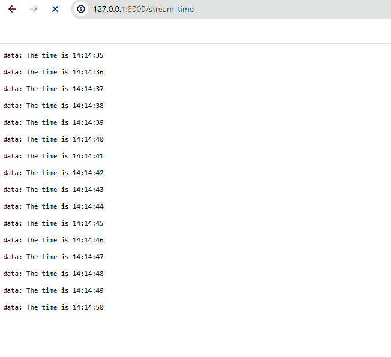
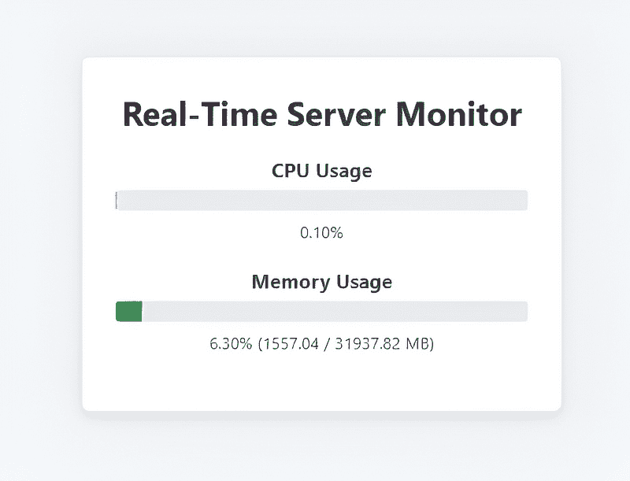
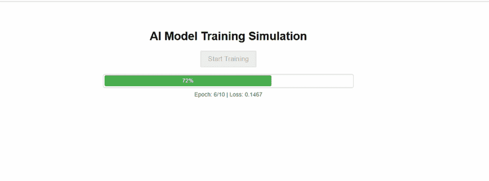
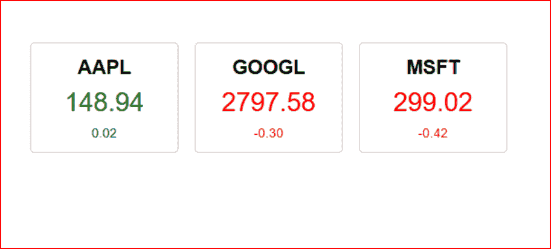

# 在 Python 中介绍服务器发送事件

> 原文：[`towardsdatascience.com/introducing-server-sent-events-in-python/`](https://towardsdatascience.com/introducing-server-sent-events-in-python/)

<mdspan datatext="el1754326673698" class="mdspan-comment">作为一名开发者，我总是寻找让我的应用程序更加动态和交互的方法。如今，用户期望实时功能，例如实时通知、流式更新和自动刷新的仪表板。当考虑这些类型的应用程序时，网络开发者通常会想到 WebSocket，它非常强大。

虽然有时 WebSocket 可能过于强大，并且其全部功能通常并不需要。它们提供了一个复杂的双向通信通道，但很多时候，我只需要服务器向客户端推送更新***到***客户端。对于这些常见场景，一个更直接且优雅的解决方案，它直接集成在现代网络平台中，被称为服务器发送事件（Server-Sent Events，SSE）。

在这篇文章中，我将向您介绍服务器发送事件。我们将讨论它们是什么，它们与 WebSocket 的比较，以及为什么它们通常是完成工作的完美工具。然后，我们将深入一系列实际示例，使用 Python 和 FastAPI 框架构建实时应用程序，这些应用程序简单而强大。

## 什么是服务器发送事件（SSE）？

服务器发送事件（Server-Sent Events）是一种网络技术标准，允许服务器在建立初始客户端连接后异步地向客户端推送数据。它通过单个长连接提供单向、服务器到客户端的数据流。客户端，通常是网络浏览器，订阅此流并可以对其接收到的消息做出反应。

服务器发送事件的一些关键特性包括：

+   **简单协议**。SSE 是一种简单、基于文本的协议。事件只是通过 HTTP 发送的文本块，这使得它们可以通过像 curl 这样的标准工具轻松调试。

+   **标准 HTTP**。SSE 在常规 HTTP/HTTPS 上工作。这意味着它通常与现有的防火墙和代理服务器更兼容。

+   **自动重连**。这是一个杀手级特性。如果与服务器的连接丢失，浏览器的事件源 API 将自动尝试重新连接。您无需编写任何额外的 JavaScript 代码即可获得这种弹性。

+   **单向通信**。SSE 仅用于服务器到客户端的数据推送。如果您需要全双工、客户端到服务器的通信，WebSocket 是更合适的选择。

+   **原生浏览器支持**。所有现代网络浏览器都通过 EventSource 接口内置了对服务器发送事件（SSE）的支持，消除了对客户端库的需求。

### 为什么 SSE 很重要/常见用例

SSE 的主要优势是其简单性。对于一大类实时问题，它提供了所有必要的功能，而其复杂度仅为 WebSockets 的一小部分，无论是在服务器端还是客户端。这意味着开发更快，维护更容易，出错的可能性更少。

SSE 非常适合任何服务器需要主动发起通信并向客户端发送更新的场景。例如...

+   **实时通知系统.** 当有新消息到达或发生重要事件时向用户推送通知。

+   **实时活动流.** 向用户的活动流中实时推送更新，类似于 Twitter 或 Facebook 的时间线。

+   **实时数据仪表板.** 向实时仪表板发送股票行情、体育比分或监控指标的连续更新。

+   **实时日志输出.** 在用户的浏览器中直接显示长时间运行的背景过程的实时日志输出。

+   **进度更新.** 显示文件上传、数据处理作业或其他由用户发起的任何长时间运行任务的实时进度。

理论就到这里；让我们看看用 Python 实现这些想法有多简单。

## 设置开发环境

我们将利用 FastAPI，这是一个现代且高性能的 Python 网络框架。它对 asyncio 和流式响应的原生支持使其非常适合实现服务器端发送事件。您还需要 Uvicorn ASGI 服务器来运行应用程序。

如往常一样，我们将设置一个开发环境以保持我们的项目分离。我建议使用 MiniConda，但请随意使用您习惯的任何工具。

```py
# Create and activate a new virtual environment
(base) $ conda create -n sse-env python=3.13 -y
(base) $ activate sse-env
```

现在，安装我们需要的外部库。

```py
# Install FastAPI and Uvicorn
(sse-env) $ pip install fastapi uvicorn
```

这就是我们需要的所有设置。现在，我们可以开始编码了。

### 代码示例 1—Python 后端。一个简单的 SSE 端点

让我们创建我们的第一个 SSE 端点。它将每秒向客户端发送包含当前时间的消息。

创建一个名为 app.py 的文件，并将以下内容输入其中。

```py
from fastapi import FastAPI
from fastapi.responses import StreamingResponse
from fastapi.middleware.cors import CORSMiddleware
import time

app = FastAPI()

# Allow requests from http://localhost:8080 (where index.html is served)
app.add_middleware(
    CORSMiddleware,
    allow_origins=["http://localhost:8080"],
    allow_methods=["GET"],
    allow_headers=["*"],
)

def event_stream():
    while True:
        yield f"data: The time is {time.strftime('%X')}\n\n"
        time.sleep(1)

@app.get("/stream-time")
def stream():
    return StreamingResponse(event_stream(), media_type="text/event-stream")
```

我希望您同意，这段代码很简单。

1.  我们定义了一个 event_stream()函数。这个循环无限重复，每秒产生一个字符串。

1.  生成的字符串按照 SSE 规范格式化：它必须以**data:**开头，并以两个换行符（**\n\n**）结尾。

1.  我们的端点/stream-time 返回一个 StreamingResponse，将我们的生成器传递给它，并将媒体类型设置为 text/event-stream。FastAPI 处理其余部分，保持连接打开，并将每个生成的块发送到客户端。

要运行代码，不要使用您通常使用的标准**Python app.py**命令。相反，这样做。

```py
(sse-env)$ uvicorn app:app --reload

INFO:     Will watch for changes in these directories: ['/home/tom']
INFO:     Uvicorn running on http://127.0.0.1:8000 (Press CTRL+C to quit)
INFO:     Started reloader process [4109269] using WatchFiles
INFO:     Started server process [4109271]
INFO:     Waiting for application startup.
INFO:     Application startup complete.
```

现在，将此地址输入您的浏览器...

```py
http://127.0.0.1:8000/stream-time
```

…并且您应该看到类似这样的内容。



图片由作者提供

屏幕应该每秒显示一个更新的时间记录。

### 代码示例 2. 实时系统监控仪表板

在这个例子中，我们将实时监控我们的 PC 或笔记本电脑的 CPU 和内存使用情况。

这里是您需要的 app.py 代码。

```py
import asyncio
import json
import psutil
from fastapi import FastAPI, Request
from fastapi.responses import HTMLResponse, StreamingResponse
from fastapi.middleware.cors import CORSMiddleware
import datetime

# Define app FIRST
app = FastAPI()

# Then add middleware
app.add_middleware(
    CORSMiddleware,
    allow_origins=["http://localhost:8080"],
    allow_methods=["GET"],
    allow_headers=["*"],
)

async def system_stats_generator(request: Request):
    while True:
        if await request.is_disconnected():
            print("Client disconnected.")
            break

        cpu_usage = psutil.cpu_percent()
        memory_info = psutil.virtual_memory()

        stats = {
            "cpu_percent": cpu_usage,
            "memory_percent": memory_info.percent,
            "memory_used_mb": round(memory_info.used / (1024 * 1024), 2),
            "memory_total_mb": round(memory_info.total / (1024 * 1024), 2)
        }

        yield f"data: {json.dumps(stats)}\n\n"
        await asyncio.sleep(1)

@app.get("/system-stats")
async def stream_system_stats(request: Request):
    return StreamingResponse(system_stats_generator(request), media_type="text/event-stream")

@app.get("/", response_class=HTMLResponse)
async def read_root():
    with open("index.html") as f:
        return HTMLResponse(content=f.read())
```

这段代码使用 FastAPI 网络框架构建了一个实时系统监控服务。它创建了一个网络服务器，该服务器持续跟踪并向任何连接的网络客户端广播主机机的 CPU 和内存使用情况。

首先，它初始化一个 FastAPI 应用程序并配置跨源资源共享（CORS）中间件。这个中间件是一个安全特性，在这里被明确配置，以允许从`http://localhost:8080`提供的网页向这个服务器发送请求，这是前后端分开开发时的常见需求。

应用程序的核心是`system_stats_generator`异步函数。该函数在一个无限循环中运行，并在每次迭代中使用`psutil`库获取当前的 CPU 利用率百分比和详细的内存统计信息，包括使用百分比、使用的兆字节和总兆字节。它将此信息打包成一个字典，将其转换为 JSON 字符串，然后以特定的“text/event-stream”格式（data: …\n\n）产生它。

使用`asyncio.sleep(1)`在更新之间引入了一秒的暂停，防止循环消耗过多的资源。该函数还设计用于检测客户端是否已断开连接，并优雅地停止向该客户端发送数据。

脚本定义了两个网络端点。`@app.get(“/system-stats”)`端点创建了一个`StreamingResponse`，它启动了`system_stats_generator`。当客户端对这个 URL 发起 GET 请求时，它建立了一个持久连接，服务器开始每秒流式传输系统统计信息。第二个端点`@app.get(“/”)`作为主页提供名为`index.html`的静态 HTML 文件。这个 HTML 文件通常包含连接到`/system-stats`流并动态显示网页上传入的性能数据的 JavaScript 代码。

现在，这里是更新后的（index.html）前端代码。

```py
<!DOCTYPE html>
<html lang="en">
<head>
    <meta charset="UTF-8">
    <title>System Monitor</title>
    <style>
        body { font-family: -apple-system, BlinkMacSystemFont, "Segoe UI", Roboto, "Helvetica Neue", Arial, sans-serif; background-color: #f0f2f5; color: #333; display: flex; justify-content: center; align-items: center; height: 100vh; margin: 0; }
        .dashboard { background-color: white; padding: 2rem; border-radius: 8px; box-shadow: 0 4px 12px rgba(0,0,0,0.1); width: 400px; text-align: center; }
        h1 { margin-top: 0; }
        .metric { margin-bottom: 1.5rem; }
        .metric-label { font-weight: bold; font-size: 1.2rem; margin-bottom: 0.5rem; }
        .progress-bar { width: 100%; background-color: #e9ecef; border-radius: 4px; overflow: hidden; }
        .progress-bar-fill { height: 20px; background-color: #007bff; width: 0%; transition: width 0.5s ease-in-out; }
        .metric-value { margin-top: 0.5rem; font-size: 1rem; color: #555; }
    </style>
</head>
<body>
    <div class="dashboard">
        <h1>Real-Time Server Monitor</h1>
        <div class="metric">
            <div class="metric-label">CPU Usage</div>
            <div class="progress-bar">
                <div id="cpu-progress" class="progress-bar-fill"></div>
            </div>
            <div id="cpu-value" class="metric-value">0%</div>
        </div>
        <div class="metric">
            <div class="metric-label">Memory Usage</div>
            <div class="progress-bar">
                <div id="mem-progress" class="progress-bar-fill" style="background-color: #28a745;"></div>
            </div>
            <div id="mem-value" class="metric-value">0% (0 / 0 MB)</div>
        </div>
    </div>
    <script>
        const cpuProgress = document.getElementById('cpu-progress');
        const cpuValue = document.getElementById('cpu-value');
        const memProgress = document.getElementById('mem-progress');
        const memValue = document.getElementById('mem-value');

        const eventSource = new EventSource('http://localhost:8000/system-stats');

        eventSource.onmessage = function(event) {
            // Parse the JSON data from the server
            const stats = JSON.parse(event.data);

            // Update CPU elements
            cpuProgress.style.width = stats.cpu_percent + '%';
            cpuValue.textContent = stats.cpu_percent.toFixed(2) + '%';

            // Update Memory elements
            memProgress.style.width = stats.memory_percent + '%';
            memValue.textContent = `${stats.memory_percent.toFixed(2)}% (${stats.memory_used_mb} / ${stats.memory_total_mb} MB)`;
        };

        eventSource.onerror = function(err) {
            console.error("EventSource failed:", err);
            cpuValue.textContent = "Connection Error";
            memValue.textContent = "Connection Error";
        };
    </script>
</body>
</html>
```

使用 Uvicorn 运行应用程序，就像我们在示例 1 中所做的那样。然后在另一个命令窗口中，键入以下内容以启动 Python 服务器。

```py
python3 -m http.server 8080
```

现在，在您的浏览器中打开 URL `http://localhost:8080/index.html`，您将看到输出，它应该会持续更新。



图片由作者提供

### **代码示例 3—后台任务进度条**

在这个例子中，我们启动一个任务并显示一个表示任务进度的条形图。

更新后的 app.py

```py
import asyncio
import json
import psutil
from fastapi import FastAPI, Request
from fastapi.responses import HTMLResponse, StreamingResponse
from fastapi.middleware.cors import CORSMiddleware
import datetime

# Define app FIRST
app = FastAPI()

# Then add middleware
app.add_middleware(
    CORSMiddleware,
    allow_origins=["http://localhost:8080"],
    allow_methods=["GET"],
    allow_headers=["*"],
)

async def training_progress_generator(request: Request):
    """
    Simulates a long-running AI training task and streams progress.
    """
    total_epochs = 10
    steps_per_epoch = 100

    for epoch in range(1, total_epochs + 1):
        # Simulate some initial processing for the epoch
        await asyncio.sleep(0.5)

        for step in range(1, steps_per_epoch + 1):
            # Check if client has disconnected
            if await request.is_disconnected():
                print("Client disconnected, stopping training task.")
                return

            # Simulate work
            await asyncio.sleep(0.02)

            progress = (step / steps_per_epoch) * 100
            simulated_loss = (1 / epoch) * (1 - (step / steps_per_epoch)) + 0.1

            progress_data = {
                "epoch": epoch,
                "total_epochs": total_epochs,
                "progress_percent": round(progress, 2),
                "loss": round(simulated_loss, 4)
            }

            # Send a named event "progress"
            yield f"event: progress\ndata: {json.dumps(progress_data)}\n\n"

    # Send a final "complete" event
    yield f"event: complete\ndata: Training complete!\n\n"

@app.get("/stream-training")
async def stream_training(request: Request):
    """SSE endpoint to stream training progress."""
    return StreamingResponse(training_progress_generator(request), media_type="text/event-stream")

@app.get("/", response_class=HTMLResponse)
async def read_root():
    """Serves the main HTML page."""
    with open("index.html") as f:
        return HTMLResponse(content=f.read())
```

更新后的 index.html 代码如下。

```py
<!DOCTYPE html>
<html lang="en">
<head>
    <meta charset="UTF-8">
    <title>Live Task Progress</title>
    <style>
        body { font-family: sans-serif; text-align: center; padding-top: 50px; }
        .progress-container { width: 80%; max-width: 700px; margin: auto; }
        #start-btn { font-size: 1.2rem; padding: 10px 20px; cursor: pointer; }
        .progress-bar-outer { border: 1px solid #ccc; padding: 3px; border-radius: 5px; margin-top: 20px; }
        .progress-bar-inner { background-color: #4CAF50; width: 0%; height: 30px; text-align: center; line-height: 30px; color: white; border-radius: 3px; transition: width 0.1s linear; }
        #status-text { margin-top: 10px; font-size: 1rem; color: #555; height: 2em; }
    </style>
</head>
<body>
    <h1>AI Model Training Simulation</h1>
    <div class="progress-container">
        <button id="start-btn">Start Training</button>
        <div id="progress-bar-outer" class="progress-bar-outer" style="display: none;">
            <div id="progress-bar-inner" class="progress-bar-inner">0%</div>
        </div>
        <div id="status-text"></div>
    </div>
    <script>
        const startBtn = document.getElementById('start-btn');
        const progressBarOuter = document.getElementById('progress-bar-outer');
        const progressBarInner = document.getElementById('progress-bar-inner');
        const statusText = document.getElementById('status-text');

        let eventSource;

        startBtn.addEventListener('click', () => {
            startBtn.disabled = true;
            progressBarOuter.style.display = 'block';
            statusText.textContent = 'Initializing...';

            // Close any existing connection
            if (eventSource) {
                eventSource.close();
            }

            // Start a new SSE connection
            eventSource = new EventSource('http://localhost:8000/stream-training');

            eventSource.addEventListener('progress', (e) => {
                const data = JSON.parse(e.data);
                const percent = data.progress_percent;
                progressBarInner.style.width = percent + '%';
                progressBarInner.textContent = percent.toFixed(0) + '%';
                statusText.textContent = `Epoch: ${data.epoch}/${data.total_epochs} | Loss: ${data.loss}`;
            });

            eventSource.addEventListener('complete', (e) => {
                statusText.textContent = e.data;
                progressBarInner.style.backgroundColor = '#007bff';
                eventSource.close(); // Close the connection
                startBtn.disabled = false;
            });

            eventSource.onerror = () => {
                statusText.textContent = 'Connection error. Please try again.';
                eventSource.close();
                startBtn.disabled = false;
            };
        });
    </script>
</body>
</html>
```

如果它们仍在运行，请停止现有的 uvicorn 和 Python 服务器进程，然后重新启动它们。

现在，当您打开 index.html 页面时，您应该看到一个带有按钮的屏幕。按下按钮将启动一个模拟任务，并显示移动的进度条。



图片由作者提供

#### 代码示例 4—实时金融股票行情

在我们的最终示例中，我们将创建一个模拟的股票行情。服务器将为几个股票代码生成随机的价格更新，并通过命名事件发送它们，其中事件名称对应于股票代码（例如，事件：AAPL，事件：GOOGL）。这是在单个 SSE 连接上多路复用不同类型数据的一种强大模式，允许客户端独立处理每个流。

这里是您需要的更新后的 app.py 代码。

```py
import asyncio
import json
import random
from fastapi import FastAPI, Request
from fastapi.responses import StreamingResponse
from fastapi.middleware.cors import CORSMiddleware

# Step 1: Create app first
app = FastAPI()

# Step 2: Add CORS to allow requests from http://localhost:8080
app.add_middleware(
    CORSMiddleware,
    allow_origins=["http://localhost:8080"],
    allow_methods=["GET"],
    allow_headers=["*"],
)

# Step 3: Simulated stock prices
STOCKS = {
    "AAPL": 150.00,
    "GOOGL": 2800.00,
    "MSFT": 300.00,
}

# Step 4: Generator to simulate updates
async def stock_ticker_generator(request: Request):
    while True:
        if await request.is_disconnected():
            break

        symbol = random.choice(list(STOCKS.keys()))
        change = random.uniform(-0.5, 0.5)
        STOCKS[symbol] = max(0, STOCKS[symbol] + change)

        update = {
            "symbol": symbol,
            "price": round(STOCKS[symbol], 2),
            "change": round(change, 2)
        }

        # Send named events so the browser can listen by symbol
        yield f"event: {symbol}\ndata: {json.dumps(update)}\n\n"
        await asyncio.sleep(random.uniform(0.5, 1.5))

# Step 5: SSE endpoint
@app.get("/stream-stocks")
async def stream_stocks(request: Request):
    return StreamingResponse(stock_ticker_generator(request), media_type="text/event-stream")
```

以及更新的 index.html

```py
<!DOCTYPE html>
<html lang="en">
<head>
    <meta charset="UTF-8">
    <title>Live Stock Ticker</title>
    <style>
        body { font-family: sans-serif; display: flex; justify-content: center; padding-top: 50px; }
        .ticker { display: flex; gap: 20px; }
        .stock { border: 1px solid #ccc; padding: 15px; border-radius: 5px; width: 150px; text-align: center; }
        .symbol { font-weight: bold; font-size: 1.5rem; }
        .price { font-size: 2rem; margin: 10px 0; }
        .change { font-size: 1rem; }
        .up { color: green; }
        .down { color: red; }
    </style>
</head>
<body>
    <div class="ticker">
        <div id="AAPL" class="stock">
            <div class="symbol">AAPL</div>
            <div class="price">--.--</div>
            <div class="change">-.--</div>
        </div>
        <div id="GOOGL" class="stock">
            <div class="symbol">GOOGL</div>
            <div class="price">--.--</div>
            <div class="change">-.--</div>
        </div>
        <div id="MSFT" class="stock">
            <div class="symbol">MSFT</div>
            <div class="price">--.--</div>
            <div class="change">-.--</div>
        </div>
    </div>

    <script>
        const eventSource = new EventSource('http://localhost:8000/stream-stocks');

        function updateStock(data) {
            const stock = document.getElementById(data.symbol);
            if (!stock) return;

            const priceEl = stock.querySelector('.price');
            const changeEl = stock.querySelector('.change');

            priceEl.textContent = data.price.toFixed(2);
            changeEl.textContent = data.change.toFixed(2);

            const className = data.change >= 0 ? 'up' : 'down';
            priceEl.className = 'price ' + className;
            changeEl.className = 'change ' + className;
        }

        ['AAPL', 'GOOGL', 'MSFT'].forEach(symbol => {
            eventSource.addEventListener(symbol, e => {
                const stockData = JSON.parse(e.data);
                updateStock(stockData);
            });
        });

        eventSource.onerror = function(err) {
            console.error("EventSource failed:", err);
        };
    </script>
</body>
</html>
```

然后像之前一样停止并重新启动 uvicorn 和 Python 进程。这次，当您在浏览器中打开 http://localhost:8080/index.html 时，您应该会看到一个像这样的屏幕，它将不断更新三只股票的模拟价格。



图片由作者提供

## 摘要

在这篇文章中，我展示了对于许多实时用例，Server-Sent Events 提供了比 WebSocket 更简单的替代方案。我们讨论了 SSE 的核心原则，包括其单向通信模型和自动重连功能。通过一系列使用 Python 和 FastAPI 的动手示例，我们看到了构建强大实时功能是多么容易。我们涵盖了：

+   一个简单的 Python 后端和 SSE 端点

+   一个实时系统监控仪表板，流式传输结构化 JSON 数据。

+   一个用于模拟长时间运行的后台任务的实时进度条。

+   使用命名事件管理不同数据流的复用股票行情。

下次您需要从服务器向客户端推送数据时，我鼓励您在伸手去拿 WebSocket 之前先停下来。问问自己你是否真的需要双向通信。如果答案是“否”，那么 Server-Sent Events 可能就是您一直在寻找的更简单、更快、更稳健的解决方案。
