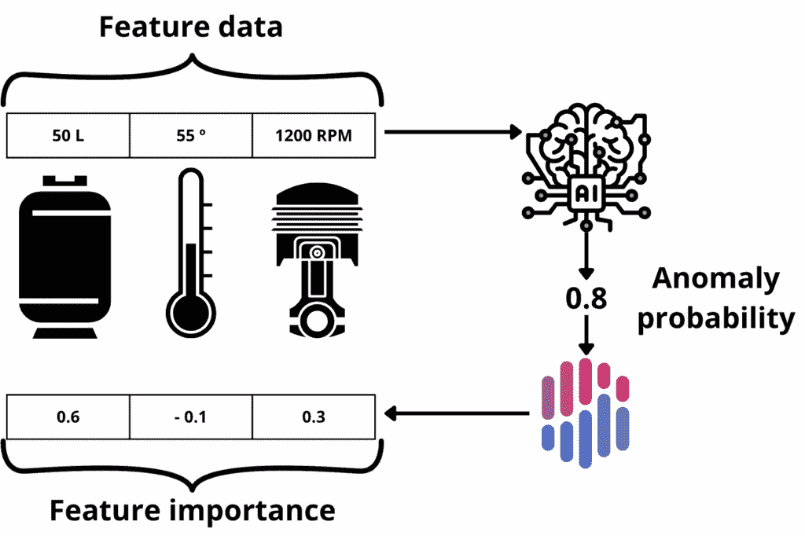
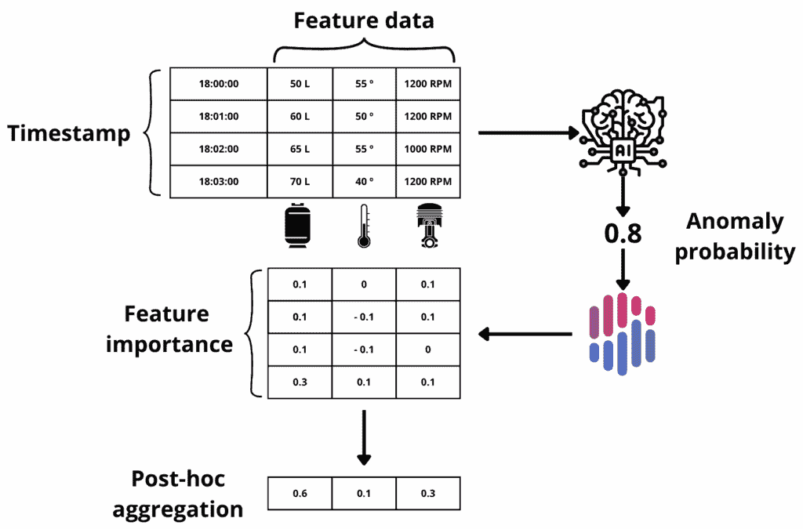
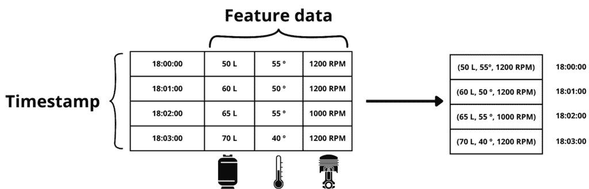
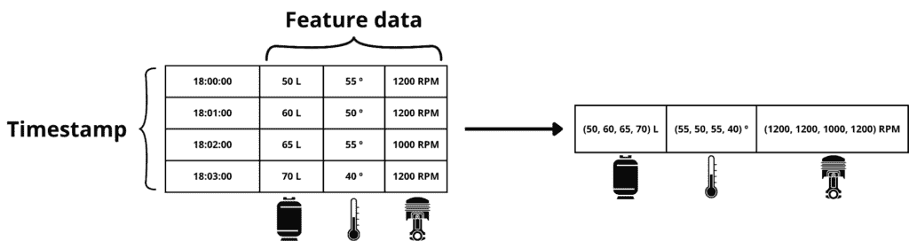
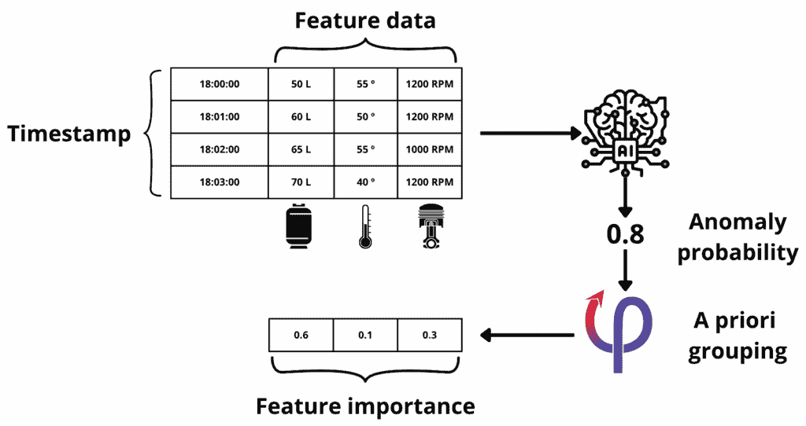
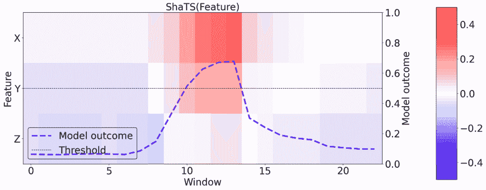
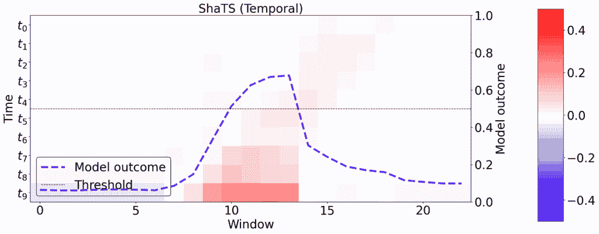

# 介绍 ShaTS：基于 Shapley 的时间序列模型方法

> 原文：[`towardsdatascience.com/introducing-shats-a-shapley-based-method-for-time-series-models/`](https://towardsdatascience.com/introducing-shats-a-shapley-based-method-for-time-series-models/)

## 简介

<mdspan datatext="el1763169001459" class="mdspan-comment">基于 Shapley 的方法</mdspan>是解释机器学习（ML）和深度学习（DL）模型最受欢迎的工具之一。然而，对于时间序列数据，这些方法通常不足，因为它们没有考虑到此类数据集中固有的时间依赖性。在最近的一篇文章中，我们（[Ángel Luis Perales Gómez](https://scholar.google.com/citations?user=ZF7l9QcAAAAJ)，[Lorenzo Fernández Maimó](https://scholar.google.com/citations?&user=NJcxK4QAAAAJ) 和 [我](https://scholar.google.com/citations?&user=IKzgARsAAAAJ)）介绍了[ShaTS](https://doi.org/10.1016/j.future.2025.108178)，这是一种专为时间序列模型设计的新的基于 Shapley 的解释方法。ShaTS 通过结合提高计算效率和可解释性的分组策略来解决传统 Shapley 方法的局限性。

## Shapley 值：基础

[Shapley 值](https://www.rand.org/content/dam/rand/pubs/papers/2021/P295.pdf)起源于合作博弈论，并基于玩家对协作努力的个体贡献公平地分配总收益。玩家 Shapley 值的计算是通过考虑所有可能的玩家联盟，并确定该玩家对每个联盟的边际贡献。

正式来说，玩家 *i* 的 Shapley 值 *φ[i]* 是：

\[ \varphi_i(v) = \sum_{S \subseteq N \setminus {i}} \]

\[ \frac{|S|! (|N| – |S| – 1)!}{|N|!} (v(S \cup {i}) – v(S)) \]

其中：

+   *N* 是所有玩家的集合。

+   *S* 是不包括 *i* 的玩家联盟。

+   *v(S)* 是分配每个联盟价值的值函数（即联盟 *S* 可以实现的总收益）。

这个公式平均了玩家 *i* 在所有可能的联盟中的边际贡献，并按每个联盟形成的可能性进行加权。

## 从博弈论到 xAI：机器学习中的 Shapley 值

在可解释人工智能（xAI）的背景下，Shapley 值将模型的输出归因于其输入特征。这对于理解复杂模型，如深度神经网络，其中输入和输出之间的关系并不总是清晰的，特别有用。

基于 Shapley 的方法可能在计算上很昂贵，尤其是随着特征数量的增加，因为可能的联盟数量呈指数增长。然而，近似方法，尤其是那些在流行的[SHAP 库](https://doi.org/10.48550/arXiv.1705.07874)中实现的方法，使它们在实际中变得可行。这些方法通过采样联盟的子集而不是评估所有可能的组合来估计 Shapley 值，从而显著减少了计算负担。

考虑一个包含三个组件的工业场景：一个水箱、一个温度计和一个发动机。假设我们有一个基于这些组件读数的异常检测（AD）机器学习/深度学习模型，该模型根据这些组件的读数检测恶意活动。使用 SHAP，我们可以确定每个组件对模型预测活动是恶意还是良性的贡献程度。



在工业异常检测场景中集成 SHAP。图像由作者创建

然而，在更现实的场景中，模型不仅使用每个传感器的当前读数，还使用之前的读数（时间窗口）来做出预测。这种方法允许模型捕捉时间模式和趋势，从而提高其性能。在应用 SHAP 到这个场景以分配每个物理组件的责任时，由于特征和传感器之间不再是一对一映射，因此变得更加具有挑战性。每个传感器现在贡献了与不同时间步相关的多个特征。这里常用的方法是在每个时间步计算每个特征的 Shapley 值，然后事后汇总这些值。



在具有窗口化传感器数据和事后汇总的工业异常检测场景中集成 SHAP。图像由作者创建。

这种方法有两个主要缺点：

+   **计算复杂度**：随着特征数量的指数增长，计算成本增加，对于大型时间序列数据集来说不切实际。

+   **忽略时间依赖性**：SHAP 解释器是为没有时间依赖性的表格数据设计的。事后汇总可能导致不准确的解释，因为它未能捕捉特征之间的时间关系。

## ShaTS 方法：在计算重要性之前进行分组

在 Shapley 框架中，一个玩家的价值仅通过比较包含和不包含该玩家的联盟的性能来确定。尽管该方法是在个体层面定义的，但没有任何阻止将其应用于玩家组而不是单个个体的。因此，如果我们考虑一个分为 *p* 个组 *G = {G[1], … , G[p]}* 的玩家集 *N*，我们可以通过评估整个组对所有可能剩余组联盟的边际贡献来计算每个组 *G[i]* 的 Shapley 值。形式上，组 *G[i]* 的 Shapley 值可以表示为：

\[ \varphi(G_i) = \sum_{T \subseteq G \setminus G_i} \frac{|T|! (|G| – |T| – 1)!}{|G|!} \left( v(T \cup G_i) – v(T) \right) \]

其中：

+   *G* 是所有群组的集合。

+   *T* 是不包括 *G[i]* 的群组合并。

+   *v(T)* 是一个将值分配给每个群组合并的价值函数。

基于这个想法，ShaTS 在时间窗口上操作，并根据解释目标提供三个不同的分组级别：

### 时间

每个组包含在时间窗口内特定时刻记录的所有测量值。这种策略有助于识别对模型预测有显著影响的临界时刻。



时间分组策略的示例。图像由作者创建。

### 特征

每个组代表单个特征在时间窗口内的测量值。这种策略隔离了特定特征对模型决策的影响。



特征分组策略的示例。图像由作者创建。

### 多特征

每个组包含具有逻辑关系或代表统一功能单元的特征在时间窗口内的综合测量值。这种方法分析相互依赖特征的集体影响，确保其综合影响被捕捉。


多特征分组策略的示例。图像由作者创建。

一旦定义了组，Shapley 值的计算方法与单个情况完全相同，但使用组级边际贡献而不是每个特征的贡献。



ShaTS 方法概述。图像由作者创建。

## ShaTS 定制可视化

ShaTS 包含专为顺序数据和上述三种分组策略设计的可视化。水平轴显示连续窗口。左侧垂直轴列出组，右侧垂直轴叠加每个窗口的模型异常分数。每个热图单元格在 *(i, G[j])* 处代表组 *G[j]* 对窗口 *i* 的重要性。较暖的红色表示对异常的更强正向贡献，较冷的蓝色表示更强的负向贡献，接近白色表示可忽略的影响。紫色虚线追踪窗口之间的异常分数，水平虚线在 0.5 处标记异常窗口和正常窗口之间的决策阈值。

为了说明，想象一个处理由三个特征 *X*、*Y* 和 *Z* 构成的长度为 10 的窗口的模型。当操作员收到警报并想知道哪个信号触发了它时，他们会检查特征分组结果。在下一图中，大约在窗口 10-11 之间，异常分数超过阈值，而 *X* 的归因增强。这种模式表明决策主要是由 *X* 驱动的。



ShaTS 为特征策略定制的可视化。由 ShaTS 库生成。

如果下一个问题是每个窗口中异常发生的时间，操作员将切换到时间分组视图。下一图显示，每个窗口的最终时刻（*t[9]*）始终具有最强的正向归因，表明模型已经学会了依赖最后一个时间步来将窗口分类为异常。



ShaTS 针对时间策略的定制可视化。左侧 y 轴列出了窗口的时间槽$t_0$（最早）到$t_9$（最近）。由 ShaTS 库生成的图像。

## 实验结果：在 SWaT 数据集上测试 ShaTS

在[我们最近发表的论文](https://doi.org/10.1016/j.future.2025.108178)中，我们验证了 ShaTS 在安全水处理([SWaT](https://doi.org/10.1109/CySWater.2016.7469060))测试平台上的有效性，该平台是一个拥有 51 个传感器/执行器的工业水处理设施，这些传感器/执行器被组织成六个工厂阶段（P1–P6）。一个在窗口信号上训练的堆叠 Bi-LSTM 模型作为检测器，我们使用三个观点比较了 ShaTS 与后处理 KernelSHAP：时间（窗口中的哪个瞬间很重要）、传感器/执行器（哪个设备）和过程（六个阶段中的哪一个）。

在攻击中，ShaTS 产生了紧凑、可解释的带，精确地指出了真正的来源——从传感器/执行器或工厂阶段——而后处理 SHAP 往往将重要性扩散到许多组中，复杂了根本原因分析。ShaTS 还更快、更可扩展：分组缩小了玩家集，因此联盟空间大幅下降；运行时间几乎保持不变，因为组数不会随窗口长度的增加而改变；GPU 执行进一步加速了该方法，使近实时使用成为可能。

## 实践示例：将 ShaTS 集成到您的流程中

本指南展示了如何将 ShaTS 集成到典型的 Python 工作流程中：导入库，选择分组策略，使用您的训练模型和背景数据初始化解释器，在测试集上计算分组 Shapley 值，并可视化结果。示例假设使用 PyTorch 时间序列模型，并且您的数据是窗口化的（例如，每个样本的形状为[window_len, n_features]）。

### 1. 导入 ShaTS 并配置解释器

在您的 Python 脚本或笔记本中，首先从 ShaTS 库导入必要的组件。虽然存储库公开了抽象的 ShaTS 类，但您通常会实例化其具体实现之一（例如，FastShaTS）。

```py
import shats
from shats.grouping import TimeGroupingStrategy
from shats.grouping import FeaturesGroupingStrategy
from shats.grouping import MultifeaturesGroupingStrategy
```

### 2. 初始化模型和数据

假设您有一个预训练的时间序列 PyTorch 模型和一个背景数据集，该数据集应是一个张量列表，代表模型在训练期间看到的典型数据样本。如果您想更好地理解背景数据集，请查看 Cristoph Molnar 的[这篇](https://mindfulmodeler.substack.com/p/shap-interpretations-depend-on-background)博客。

```py
model = MyTrainedModel()
random_samples = random.sample(range(len(trainDataset)), 100)
background = [trainDataset[idx] for idx in random_samples]

shapley_class = shats.FastShaTS(model, 
    support_dataset=background,
    grouping_strategy= FeaturesGroupingStrategy(names=variable_names)
```

### 3. 计算 Shapley 值

一旦初始化了解释器，就计算测试数据集的 ShaTS 值。测试数据集的格式应类似于背景数据集。

```py
shats_values = shaTS.compute(testDataset)
```

### 4. 可视化结果

最后，使用内置的可视化函数绘制 ShaTS 值。您可以指定您想要解释的类别（例如，异常或正常）。

```py
shaTS.plot(shats_values, test_dataset=testDataset, class_to_explain=1)
```

## 关键要点

+   **聚焦归因**：与后处理 SHAP 相比，ShaTS 提供了更聚焦的归因，这使得在时间序列模型中及时识别根本原因变得更加容易。

+   **效率**：通过将玩家数量分组，ShaTS 显著减少了需要评估的联盟数量，从而缩短了计算时间。

+   **可扩展性**：由于 ShaTS 具有固定的组结构，即使窗口大小增加，它也能保持一致的性能。

+   **GPU 加速**：ShaTS 可以利用 GPU 资源，进一步提高其速度和效率。

## 试试看

### 交互式演示

在[这里](https://shats-lab.ovh)比较 ShaTS 与后处理 SHAP 在合成时间序列上的表现。您可以在下面的视频中找到教程。

### 开源

ShaTS 模块已完全文档化，并准备好插入到您的 ML/DL 管道中。您可以在[GitHub](https://www.github.com/CyberDataLab/ShaTS)上找到代码。

希望您喜欢！如果您有任何问题，想要分享反馈，或者只是想展示您自己的项目，欢迎[联系我](https://www.linkedin.com/in/manuel-francop/)。
