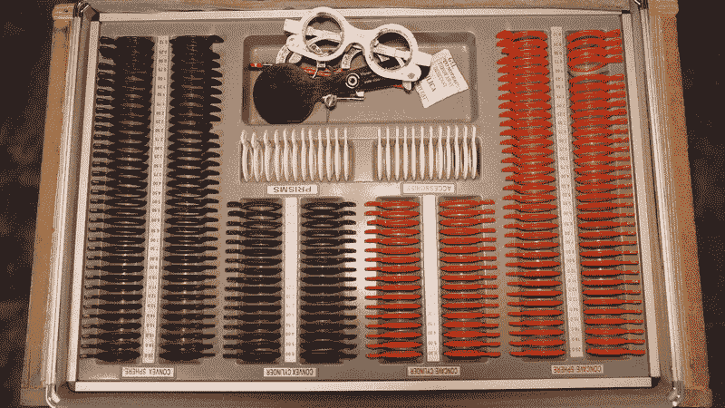

# 准备视频数据用于深度学习：介绍 Vid Prepper

> 原文：[`towardsdatascience.com/introducing-vid-prepper/`](https://towardsdatascience.com/introducing-vid-prepper/)

<mdspan datatext="el1758741346104" class="mdspan-comment">这是准备视频用于机器学习/深度学习的一个介绍</mdspan>。由于视频数据的大小和计算成本，它以尽可能高效的方式处理对于您的用例至关重要。这包括元数据分析、标准化、增强、镜头和对象检测以及张量加载等。本文探讨了这些操作的一些方法以及为什么我们会这样做。我还构建了一个名为 [vid-prepper](https://pypi.org/project/vid-prepper/) 的开源 Python 包。我构建这个包的目的是提供一个快速高效的方法来应用不同的预处理技术到您的视频数据上。这个包建立在机器学习和深度学习领域的巨人之上，因此虽然这个包在将它们集成到一个通用且易于使用的框架中很有用，但真正的工作无疑是在它们身上！

视频一直是我的职业生涯中的重要部分。我最初在一家为大型视频公司（称为 [NPAW](https://npaw.com/)) 构建视频分析 SaaS 平台的公司开始了我的数据生涯，目前我在 BBC 工作。视频目前主导着网络景观，但与 AI 相比仍然相当有限，尽管增长速度非常快。我想创建一些可以帮助人们加快尝试新事物并贡献这个真正有趣领域的工具。本文将讨论不同的包模块的功能以及如何使用它们，从元数据分析开始。

## 元数据分析

```py
from vid_prepper import metadata
```

在 BBC，我很幸运能在一家拥有大量才华横溢的人的专业组织中工作，他们制作的是广播质量的视频。然而，我知道大多数视频数据并非如此。通常文件会是混合格式、颜色、大小，或者可能损坏或缺失部分，也可能有来自旧视频的怪癖，如隔行扫描。在处理视频用于机器学习之前，了解这些情况很重要。

我们将在 GPU 上训练我们的模型，GPU 在大规模张量计算方面非常出色，但运行成本很高。当在 GPU 上训练大型模型时，我们希望尽可能高效，以避免高昂的成本。如果我们有损坏的视频或格式意外或不支持的视频，将会浪费时间和资源，可能会使模型精度降低，甚至可能导致训练流程中断。因此，事先检查和过滤文件是必要的。


元数据分析通常是准备视频数据（图片来源 – [Pexels](https://www.pexels.com/photo/a-person-standing-near-data-base-wooden-drawer-6549358/)) 的一个重要第一步。

我在 ffprobe 库上构建了元数据分析模块，这是 C 和汇编语言构建的[FFmpeg](https://ffmpeg.org/)库的一部分。这是一个功能强大且高效的库，在业界被广泛使用，该模块可以用来分析单个视频文件或一批视频文件，如下面的代码所示。

```py
# Extract metadata
video_path = [“sample.mp4”]
video_info = metadata.Metadata.validate_videos(video_path)

# Extract metadata batch
video_paths = [“sample1.mp4”, “sample2.mp4”, “sample3.mp4”]
video_info = metadata.Metadata.validate_videos(video_paths)
```

这提供了包含编解码器、尺寸、帧率、持续时间、像素格式、音频元数据等视频元数据的字典输出。这对于寻找有问题的视频数据或奇特的特性非常有用，或者也可以根据最常用的选择来选择特定的视频数据或选择要标准化的格式和编解码器。

### 基于元数据问题的过滤

由于这似乎是一个相当常见的用例，我内置了根据一组检查过滤视频列表的能力。例如，如果缺少视频或音频，编解码器或格式不符合指定，或者帧率或持续时间与指定不同，那么可以通过设置 filter 和 only_errors 参数来识别这些视频，如下所示。

```py
# Run tests on videos
videos = ["video1.mp4", "video2.mkv", "video3.mov"]

all_filters_with_params = {
    "filter_missing_video": {},
    "filter_missing_audio": {},
    "filter_variable_framerate": {},
    "filter_resolution": {"min_width": 1280, "min_height": 720},
    "filter_duration": {"min_seconds": 5.0},
    "filter_pixel_format": {"allowed": ["yuv420p", "yuv422p"]},
    "filter_codecs": {"allowed": ["h264", "hevc", "vp9", "prores"]}
}

errors = Metadata.validate_videos(
    videos,
    filters=all_filters_with_params,
    only_errors=True
)
```

在我们进行真正的密集型模型训练工作之前，通过移除或识别数据中的问题，我们可以避免浪费时间和金钱，这使得它成为一个至关重要的第一步。

## 标准化

```py
from vid_prepper import standardize
```

标准化通常在视频机器学习的预处理阶段非常重要。它可以帮助使事情更加高效和一致，并且深度学习模型通常需要特定的尺寸（例如，224 x 224）。如果你有很多视频数据，那么在这个阶段花费的时间通常会在后续的训练阶段得到多倍的回报。



标准化视频数据可以使处理效率大大提高，并给出更好的结果（图片来源 – [Pexels](https://www.pexels.com/video/a-tray-with-many-different-types-of-lenses-and-glasses-26348338/))

### 编解码器

视频通常为了在互联网上高效存储和分发而进行结构化，以便以低廉的成本和速度进行广播。这通常涉及对视频进行大量压缩，以使视频尽可能小。不幸的是，这几乎与深度学习有益的东西完全相反。

深度学习的瓶颈几乎总是解码视频并将它们加载到张量中，因此视频文件越压缩，这个过程就越长。这通常意味着避免使用超压缩编解码器如 H265 和 VVC，转而使用具有硬件加速的较轻压缩替代方案，如 H264 或 VP9，或者只要你能避免 I/O 瓶颈，使用类似无损的 MJPEG，这在生产中通常被用作将帧加载到张量中的最快方式。

### 帧率

视频的标准帧率（FPS）为：电影为 24 帧，电视和在线内容为 30 帧，快速动作内容为 60 帧。这些帧率是由每秒需要显示的图像数量决定的，以便我们的眼睛看到平滑的运动。然而，深度学习模型在训练视频中不一定需要这么高的帧率来创建运动的数值表示并生成看起来平滑的视频。因为每一帧都是一个需要计算的额外张量，我们希望将帧率降到尽可能低。

不同类型的视频和我们的模型的使用场景将决定我们可以降低到什么程度。视频中的运动越少，我们可以将输入帧率设置得越低，而不会影响结果。例如，由演播室新闻剪辑或脱口秀组成的输入数据集将需要比由冰球比赛组成的数据集更低的帧率。此外，如果我们正在处理视频理解或视频到文本模型，而不是为人类消费生成视频，那么可能可以将帧率设置得更低。

#### 计算最小帧率

实际上，你可以根据运动统计数据，从数学上确定视频数据集的一个相当好的最小帧率。使用[RAFT](https://docs.pytorch.org/vision/0.12/auto_examples/plot_optical_flow.html)或[Farneback](https://medium.com/pythons-gurus/farneback-algorithm-50682b8aa2eb)算法对数据集的一个样本进行处理，你可以计算每一帧变化的每个像素的光流。这提供了每个像素的水平和垂直位移，以计算变化的大小（平方值的平方根）。

通过对帧的平均值计算，可以得到帧的动量，而取所有帧的中位数和 95 百分位数，可以得到可以插入以下方程中的值，以获得训练数据可能的最佳最小帧率范围。

```py
Optimal FPS (Lower) = Current FPS x Max model interpolation rate / Median momentum

Optimal FPS (Higher) = Current FPS x Max model interpolation rate / 95th percentile momentum
```

其中最大模型插值是模型可以处理的每帧动量的最大值，通常在模型卡片中提供。


计算动量不过是稍微应用一下毕达哥拉斯定理。这里没有博士学位的数学！来源 – [Pexels](https://www.pexels.com/video/man-working-on-an-architectural-design-6282954/)

你可以运行训练管道的小规模测试，以确定你能够达到的最小帧率，从而实现最佳性能。

### 视频预处理器

vid-prepper 中的标准化模块可以标准化单个视频或视频批次的尺寸、编解码器、颜色格式和帧率。

再次强调，它建立在 FFmpeg 的基础上，如果可用，它还有在 GPU 上加速的能力。为了标准化视频，你可以简单地运行以下代码。

```py
# Standardize batch of videos
video_file_paths = [“sample1.mp4”, “sample2.mp4”, “sample3.mp4”]
standardizer = standardize.VideoStandardizer(
            size="224x224",
            fps=16,
            codec="h264",
            color="rgb",
            use_gpu=False  # Set to True if you have CUDA
        )

standardizer.batch_standardize(videos=video_file_paths, output_dir="videos/")
```

为了提高效率，尤其是当你使用昂贵的 GPU 并且不想因为加载视频而出现 I/O 瓶颈时，该模块也接受 webdatasets。这些数据集可以按照以下代码类似地加载：

```py
# Standardize webdataset
standardizer = standardize.VideoStandardizer(
            size="224x224",
            fps=16,
            codec="h264",
            color="rgb",
            use_gpu=False  # Set to True if you have CUDA
        )

standardizer.standardize_wds("dataset.tar", key="mp4", label="cls")
```

## 张量加载器

```py
from vid_prepper import loader
```

视频张量通常是 4 或 5 维的，由像素颜色（通常是 RGB）、帧的高度和宽度、时间和批次（可选）组件组成。如上所述，将视频解码为张量通常是预处理管道中的最大瓶颈，因此到目前为止采取的步骤对我们加载张量的效率有很大影响。

此模块使用 FFmpeg 进行帧采样和 NVDec 以允许 GPU 加速，将视频转换为 PyTorch 张量。你可以调整张量的大小以适应你的模型，同时选择每个剪辑要采样的帧数和帧步长（帧之间的间隔）。与标准化一样，使用 webdatasets 的选项也是可用的。下面的代码给出了如何实现这一点的示例。

```py
# Load clips into tensors
loader = VideoLoader(num_frames=16, frame_stride=2, size=(224,224), device="cuda")
video_paths = ["video1.mp4", "video2.mp4", "video3.mp4"]
batch_tensor = loader.load_files(video_paths)

# Load webdataset into tensors
wds_path = "data/shards/{00000..00009}.tar"
dataset = loader.load_wds(wds_path, key="mp4", label="cls")
```

## 检测器

```py
from vid_prepper import detector
```

在视频预处理中检测视频内容中的事物通常是必要的。这些可能包括特定的物体、镜头或过渡。此模块结合了 PySceneDetector、HuggingFace、Idea Research 和 PyTorch 的强大过程和模型，以提供高效的检测。


视频检测通常是一种将视频分割成剪辑并仅获取您模型所需剪辑的有用方法（图片来源 – [Pexels](https://www.pexels.com/video/man-scanning-the-codes-of-the-stocks-in-the-warehouse-4292903/))

### 镜头检测

在许多视频机器学习用例（例如语义搜索、seq2seq 预告片生成等）中，将视频分割成单个镜头是一个重要的步骤。有几种方法可以实现这一点，但 [PySceneDetect](https://www.scenedetect.com/) 是其中更准确和可靠的方法之一。这个库通过调用以下方法为 PySceneDetect 的内容检测方法提供了一个包装器。它输出每个镜头的开始和结束帧。

```py
# Detect shots in videos
video_path = "video.mp4"
detector = VideoDetector(device="cuda")
shot_frames = detector.detect_shots(video_path)
```

### 过渡检测

虽然 PySceneDetect 是一个强大的工具，可以将视频分割成单个场景，但它并不总是 100%准确。有时，你可以利用重复的内容（例如过渡）来分割镜头。例如，BBC News 在各个段落之间有一个向上的红白擦除过渡，这可以用类似 PyTorch 的工具轻松检测到。

过渡检测直接在张量上工作，通过检测超过一定阈值变化的像素块中的像素变化来实现。下面的示例代码展示了它是如何工作的。

```py
# Detect gradual transitions/wipes
video_path = "video.mp4"
video_loader = loader.VideoLoader(num_frames=16, 
                                  frame_stride=2, 
                                  size=(224, 224), 
                                  device="cpu",
                                  use_nvdec=False  # Use "cuda" if available)
video_tensor = loader.load_file(video_path)

detector = VideoDetector(device="cpu" # or cuda)
wipe_frames = detector.detect_wipes(video_tensor, 
                                    block_grid=(8,8), 
                                    threshold=0.3)
```

### 物体检测

目标检测通常是找到你视频数据中所需剪辑的要求。例如，你可能需要包含人物或动物的剪辑。这种方法使用开源的[Dino 模型](https://github.com/IDEA-Research/DINO)对标准[COCO 数据集标签](https://cocodataset.org/#home)中的一小部分对象进行检测。模型选择和对象列表都是完全可定制的，可以由你设置。模型加载器是 HuggingFace transformers 包，所以你使用的模型需要在那里可用。对于自定义标签，默认模型在 text_queries 参数中接受以下结构的字符串——“dog. cat. ambulance。”

```py
# Detect objects in videos
video_path = "video.mp4"
video_loader = loader.VideoLoader(num_frames=16, 
                                  frame_stride=2, 
                                  size=(224, 224), 
                                  device="cpu",
                                  use_nvdec=False  # Use "cuda" if available)
video_tensor = loader.load_file(video_path)

detector = VideoDetector(device="cpu" # or cuda)
results = detector.detect_objects(video, 
                                  text_queries=text_queries # if None will default to COCO list, 
                                  text_threshold=0.3, 
                                  model_id=”IDEA-Research/grounding-dino-tiny”)
```

## 数据增强

像视频 Transformer 这样的技术非常强大，可以用来创建全新的模型。然而，它们通常需要大量的数据，而这些数据并不一定容易获得，尤其是在视频这类数据上。在这种情况下，我们需要一种方法来生成多样化的数据，以防止我们的模型过拟合。[数据增强](https://www.datacamp.com/tutorial/complete-guide-data-augmentation)就是这样一种解决方案，有助于提高有限数据可用性。

对于视频来说，有许多标准的数据增强方法，其中大多数都得到了主流框架的支持。Vid-prepper 结合了其中两个最好的——[Kornia](https://kornia.readthedocs.io/en/latest/augmentation.html)和[Torchvision](https://docs.pytorch.org/vision/main/transforms.html)。使用 vid-prepper，你可以执行单个增强操作，如裁剪、翻转、镜像、填充、高斯模糊、调整亮度、颜色、饱和度和对比度，以及粗略的 dropout（视频帧的部分区域被遮挡）。你还可以将它们串联起来以提高效率。

所有的增强操作都是在视频张量上进行的，而不是直接在视频上，如果你有 GPU，它们还支持 GPU 加速。下面的示例代码展示了如何单独调用这些方法以及如何将它们串联起来。

```py
# Individual Augmentation Example
video_path = "video.mp4"
video_loader = loader.VideoLoader(num_frames=16, 
                                  frame_stride=2, 
                                  size=(224, 224), 
                                  device="cpu",use_nvdec=False  # Use "cuda" if available)
video_tensor = loader.load_file(video_path)

video_augmentor = augmentor.VideoAugmentor(device="cpu", use_gpu=False)
cropped = augmentor.crop(video_tensor, type="center", size=(200, 200))
flipped = augmentor.flip(video_tensor, type="horizontal")
brightened = augmentor.brightness(video_tensor, amount=0.2)

# Chained Augmentations
augmentations = [
            ('crop', {'type': 'random', 'size': (180, 180)}),
            ('flip', {'type': 'horizontal'}),
            ('brightness', {'amount': 0.1}),
            ('contrast', {'amount': 0.1})
        ]

chained_result = augmentor.chain(video_tensor, augmentations)
```

## 总结

视频预处理在深度学习中非常重要，因为与文本相比，数据量相对较大。Transformer 模型对海量数据的需求进一步加剧了这一点。深度学习过程由三个关键要素组成——时间、金钱和性能。通过优化我们的输入视频数据，我们可以最大限度地减少前两个要素的需求，以获得最佳的性能。

目前，有许多惊人的开源工具可用于视频机器学习，每天都有更多的新工具出现。Vid-prepper 站在一些最好和最广泛使用的工具的肩膀上，试图将它们集成到一个易于使用的包中。希望你在其中找到一些价值，并帮助你在创建下一代视频模型方面取得进展，这非常令人兴奋！
