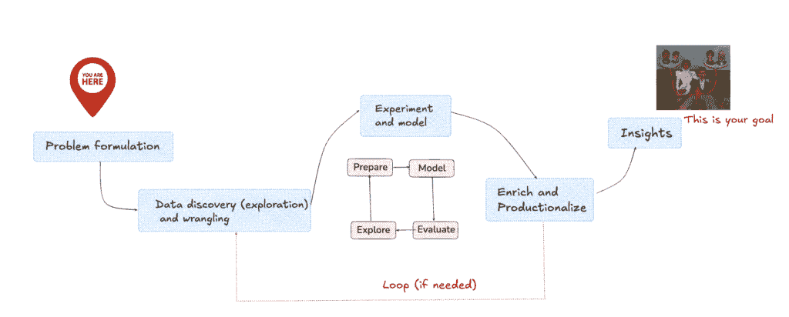
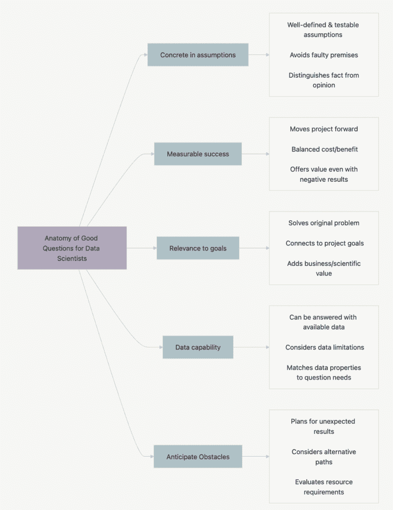
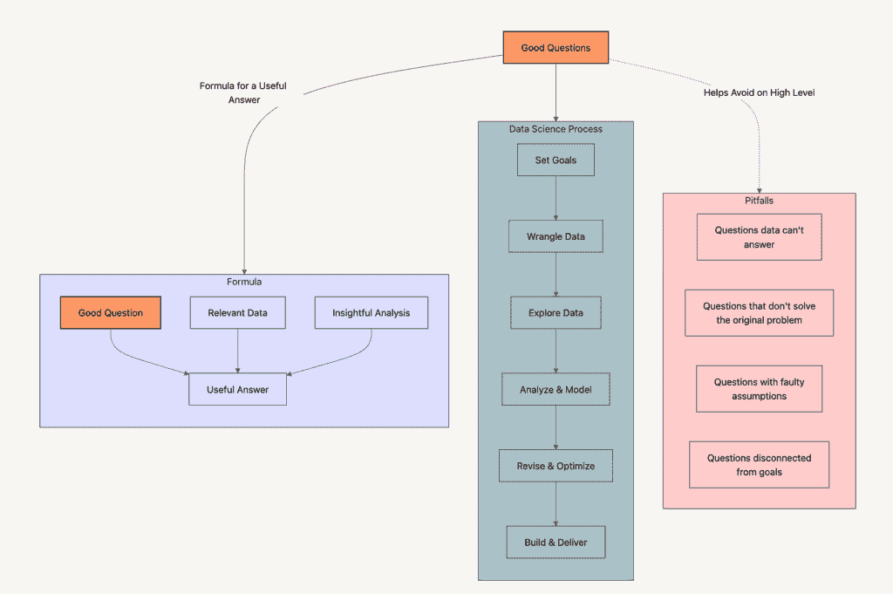

# 象牙塔笔记：问题

> 原文：[`towardsdatascience.com/ivory-tower-notes-the-problem/`](https://towardsdatascience.com/ivory-tower-notes-the-problem/)

数据和 AI 项目失败的一个原因是范围界定不足，导致优先考虑了错误的问题。无论你之前是否经历过，或者你是 AI 领域的初学者，欢迎来到我的**第一篇象牙塔笔记**，我将讨论“那个”*问题*主题。

* * *

*术语* **“象牙塔”** 是指一个人与日常生活实际现实隔离的情况的隐喻。**在学术界**，这个术语通常指的是那些深入理论研究而与学术界外实践者面临的现实保持距离的研究人员。

**作为前研究人员，我根据我旧时的象牙塔笔记写了一系列短篇帖子 — LLM 时代之前的笔记。**

*我知道这很可怕。我写这篇文章是为了管理期望和这个问题，“你为什么以前这样做？” — “因为 10 多年前没有 LLM 告诉我如何做其他事情。”*

*这就是为什么我的笔记包含“遗留”主题，如**数据挖掘、机器学习、多标准决策、以及有时的人机交互、飞机**✈️**和艺术**。*

*尽管如此，只要有机会，我就会将我的“旧”知识映射到**生成式 AI 的进步**上，并解释我是如何将其应用于象牙塔之外的数据集的。*

**欢迎来到第 1 篇帖子…**

* * *

### 每个 AI 旅程是如何开始的

** — **一切始于一个问题。

对你来说，这通常是“那个”问题，因为你需要与之共存数月，在研究的情况下，*数年*。

针对这个问题，我正在解决你可能一开始不完全理解或不知道如何解决的问题的业务问题。

更糟糕的情况是，当你认为自己完全理解并知道如何快速解决它时。这只会创造更多的问题，而这些问题又只有你自己来解决。但关于这一点，我们将在接下来的章节中详细讨论。

### 那么，“那个”问题究竟是什么？

**原因：**这主要关于未能正确管理或利用资源 — 人力、设备、金钱或时间。

**比率：**这通常关于产生商业价值，这可以涵盖从提高准确性、增加生产力、节省成本、增加收入、更快反应、决策、规划、交付或周转时间。

**真理：**这始终关于找到一种解决方案，它依赖于并隐藏在现有数据集中某个地方。

或者，多于一份数据集被某人标记为“那一个”，并且正在等待你去解决*那个*问题。因为数据集是跟随并从技术或业务流程日志中创建出来的，“*其中肯定隐藏着某种解决方案。*”

啊，如果事情这么简单就好了。

避免再次陷入不同的思维链条，重点是你要做到：

> **1 — **完全理解问题，
> 
> **2 — **如果没有给出，找到它背后的数据集，并且
> 
> **3—**创建一个方法论，以生成从它中产生商业价值解决方案。

在这条路上，你将受到跟踪和衡量，时间不会站在你这边，以提供解决“宇宙方程”的解决方案。

正因如此，你需要有方法论地处理问题，首先深入到更小的问题中，并完全专注于它们，因为它们是整体问题的根本原因。

因此，学习如何是很好的。

### [像数据科学家一样思考。](https://www.manning.com/books/think-like-a-data-scientist)

回到问题本身，让我们想象一下，你是一位在大博物馆中迷路的游客，你想弄清楚自己在哪里。接下来你要做的是走到最近的楼层信息图前，它将显示你的当前位置。

在这个时候，在你面前，你看到如下内容：

<mdspan datatext="el1744310420047" class="mdspan-comment">数据科学</mdspan>过程。图片由作者提供，灵感来源于[Microsoft Learn](https://learn.microsoft.com/en-us/fabric/data-science/data-science-overview)

接下来你可能会对自己说，“*我想找到弗里达·卡罗的画作。*”（*注意*：这些都是你想要获得的见解。）

因为你的目标是看到这幅让你远离家乡的画作，现在它位于两楼之下，你直接前往二楼。在此之前，你记住了到达目标的最短路径。（*注意*：这是最初的数据收集和发现阶段。）

然而，在旅途中，你遇到了一些障碍——电梯因翻修而关闭，所以你必须走楼梯。博物馆的画作两天前刚刚重新排列，信息图没有反映这些变化，所以你心中想到的到达画作的路并不是准确的。

然后你发现自己已经在三楼徘徊，再次小声问道，“*我如何从这个迷宫中出来，更快地到达我的画作？*”

虽然你不知道答案，但你向三楼的博物馆工作人员求助，并开始收集新的数据以获取正确的路线到达你的画作。（*注意*：这是一个新的数据收集和发现阶段。）

尽管如此，一旦你到达二楼，你又会再次迷路，但接下来你所做的事情是开始注意到画作是如何按时间顺序和主题排列，以将风格相似的艺术家的作品分组，从而为你指出如何找到你想要的画作。（*注意*：这是从你上学期间收集的数据集中重叠的建模阶段和丰富阶段——你的艺术知识。）

最后，在适应了模式分析和回忆起在博物馆路线中收集到的输入后，你终于站在了你几个月前预订航班时就计划要看的画作面前。

我现在描述的是你如何处理数据科学问题，以及如今生成式 AI 问题。你总是**以最终目标为导向**，并问自己：

> “我期望从这个中获得或需要得到什么样的预期结果？”

然后，你从这个问题开始**反向规划**。上面的例子从请求假期、预订航班、安排住宿、前往目的地、购买博物馆门票、在博物馆里闲逛，最后看到你多年来一直在阅读的画作开始。

当然，还有更多，如果你需要解决别人的问题，这个过程应该以不同的方式来处理，这比在博物馆里找到画作要复杂一些。

在这种情况下，你必须...

### 提出好的问题。

为了做到这一点，让我们[定义一下什么是好的问题](https://ds4humans.com/40_in_practice/05_backwards_design.html#defining-a-good-question) [[1](https://ds4humans.com/40_in_practice/05_backwards_design.html#defining-a-good-question)]：

> 一个好的数据科学问题必须是**具体的**、**可处理的**和**可回答的**。如果你的问题**自然地指向**你项目的一个可行的方案，那么你的问题就处理得很好。如果你的问题**过于模糊**，以至于无法建议你需要哪些数据，它**将无法有效地指导**你的工作。

制定好的问题能让你保持方向，这样你就不会迷失在用于到达特定问题解决方案的数据中，或者你不会最终解决错误的问题。

更深入地讲，好的问题将有助于识别推理中的差距，避免错误的前提，并在事情**真的**出现问题时创造替代方案（这几乎总是会发生）👇🏼。

**图像由作者在分析“《像数据科学家一样思考》一书中“第二章：通过提出好的问题来设定目标”后创建[2]**

从上述图表中，你可以理解好的问题首先需要支持**具体的假设**。这意味着它们需要以**你的**前提清晰并确保它们可以在不混淆事实与观点的情况下被测试的方式被制定。

好的问题**产生**的答案是让你更接近目标，无论是通过证实假设、提供新的见解还是消除错误路径。它们是**可衡量的**，并且因此它们**与项目目标相联系**，因为它们是在考虑可能、有价值且有效的基础上制定的 [2]。

好的问题**可以用现有数据回答**，考虑到当前数据的相关性和局限性。

最后但同样重要的是，好的问题**预见障碍**。在数据科学中，如果有什么是确定的，那就是**不确定性**，所以当事情没有按预期进行时，有备用计划对于产生项目结果非常重要。

让我们用一个航空公司的一个用例来举例，该公司面临由于计划外技术停飞（UTG）而增加**机队可用性**的挑战。

这些意外的维护事件扰乱了航班，并给公司造成了巨额损失。正因为如此，高管们决定对此问题做出反应，并召集数据科学家（你）帮助他们提高飞机的可用性。

现在，如果你这是第一次接触数据科学任务，你可能会通过以下问题开始调查：

> *“我们如何消除所有计划外的维护事件？”*

你理解这个问题是如何成为一个错误的或“差”的例子，因为：

+   **这并不现实：** 它将所有可能的缺陷，无论是小是大，都纳入一个不可能的目标——“零运营中断”。

+   **它没有衡量成功的标准**：没有具体的指标来显示进展，如果你不是零，你就是“失败”。

+   **它不是数据驱动的**：这个问题没有涵盖在延误发生之前记录了哪些数据，以及如何从这些数据中衡量和报告飞机不可用性。

因此，而不是这个问题，你可能会提出一系列有针对性的问题：

1.  **哪个（子）系统对飞行中断最为关键？** (*具体，明确，可回答*) 这个问题缩小了你的范围，只关注一个或两个影响大多数延误的特定（子）系统。

1.  **从运营角度来看，“关键停机时间”是什么？** (*有价值，与业务目标相关*) 如果航空公司（或监管机构）没有定义多少分钟的未计划停机时间对调度中断很重要，你可能会浪费精力解决不那么紧急的问题。

1.  **哪些数据来源能够捕捉根本原因，我们如何将它们融合？** (*可管理，进一步缩小项目范围*) 这明确了一个人需要找到问题解决方案所需的数据来源。

用这些更尖锐的问题，你会深入到真正的问题：

+   并非所有延误在成本或影响上都是等同的。正确的数据科学问题是要预测导致*运营成本高昂的中断*的*关键子系统故障*，以便维护人员可以优先处理。

那就是为什么…

### 定义问题决定了之后每一步。

这是构建你的数据、建模和评估阶段的基础 👇🏼。

**图像由作者在分析并重叠“第二章.通过提出好问题设定目标，像数据科学家一样思考”一书中的不同图像后创建[2]**

这意味着你正在阐明项目的目标、约束和范围；你需要首先阐明最终目标，除了问“*我期望从这个项目中得到或需要得到什么结果？*”，还需要问：

> 成功会是什么样子，我们如何衡量它？

从那里，深入到（可能的）下一级问题，这些问题是你（我）从象牙塔时代学到的：

— **历史问题**： “有人尝试解决这个问题吗？发生了什么？还缺少什么？”

—  **背景问题**： “谁受到了这个问题的影响以及如何？他们现在是如何部分解决这个问题的？他们现在使用哪些来源、方法和工具，并且这些是否可以在新的模型中重新使用？”

— **影响问题**： “如果我们不解决这个问题会发生什么？如果我们解决了，会发生什么变化？我们能否默认创造价值？这个方法将花费多少成本？”

— **假设问题**： “我们假设了哪些可能不真实的事情（尤其是当涉及到数据和利益相关者的想法时）？”

— ….

然后，在循环中这样做，并且始终“问，再问，不要停止提问”，这样你就可以深入挖掘，了解需要哪些数据和哪些分析，以及根本问题是什么。

这是一种现在也可以应用的**永恒知识**，当你决定你的问题是否具有[*预测性*或*生成性*]性质时（[`medium.com/ai-advances/did-we-skip-on-machine-learning-d8893d88a02a`](https://medium.com/ai-advances/did-we-skip-on-machine-learning-d8893d88a02a)#:~:text=When%2C%20then%3F%20Maybe%20better%20%E2%80%9CWhen%20not%3F%E2%80%9D)）。

（关于这一点，我将在另一篇笔记中解释，试图用从未见过或从未在类似问题上训练过的模型来解决问题是多么有问题。）

### 现在，让我们回到记忆的时光……

我想补充一点重要的话：我从在象牙塔的深夜学习中了解到，无论数据或数据科学知识有多少，如果你解决的是错误的问题，试图从一个简单错误和模糊的问题中得出解决方案（答案），那么这些都无法救你。

当你手头有问题时，不要急于下结论或在不了解你需要做什么的情况下构建模型（[*Festina lente*](https://en.wikipedia.org/wiki/Festina_lente)*)*。

此外，为意外情况做好准备，并与你的利益相关者和领域专家进行适当的调查，因为他们的耐心也是有限的。

有了这一点，我想说的是，在数据项目中取得成功的“真正艺术”是精确地知道问题是什么，弄清楚它是否可以首先解决，然后想出“如何”的部分。

你通过学会提出*好*问题来实现这一点。

<mdspan datatext="el1744309472653" class="mdspan-comment">为了结束这个故事，回忆一下[爱因斯坦著名地说](https://sloanreview.mit.edu/article/framing-data-science-problems-the-right-way-from-the-start/#:~:text=%E2%80%9CIf%20I%20were%20given%20one%20hour%20to%20save%20the%20planet%2C%20I%20would%20spend%2059%20minutes%20defining%20the%20problem%20and%20one%20minute%20solving%20it.%E2%80%9D):  </mdspan>

> ***如果我被赋予一个小时来拯救地球，我会花 59 分钟定义问题，然后花 1 分钟解决问题。***

* * *

**感谢阅读**，并请期待下一篇象牙塔笔记。

如果你觉得这篇帖子有价值，请随意与你的网络分享。👏

在**[Medium](https://medium.com/@martosi/subscribe)** ✍️和**[LinkedIn](https://www.linkedin.com/in/martosi/)** 🖇️上获取更多故事。

* * *

#### 参考文献：

[[1](https://ds4humans.com/40_in_practice/05_backwards_design.html#defining-a-good-question)] [DS4Humans](https://ds4humans.com/landing_page.html)，*逆向设计*，访问日期：2025 年 4 月 5 日，[`ds4humans.com/40_in_practice/05_backwards_design.html#defining-a-good-question`](https://ds4humans.com/40_in_practice/05_backwards_design.html#defining-a-good-question)

[2] Godsey, B. (2017), 《像数据科学家一样思考：逐步解决数据科学过程*》，Manning Publications。
