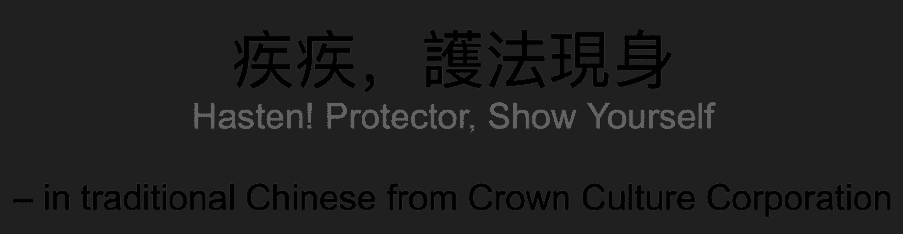
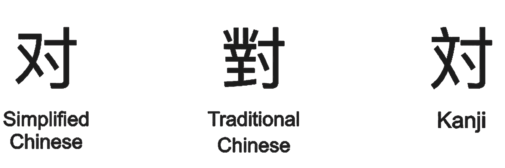
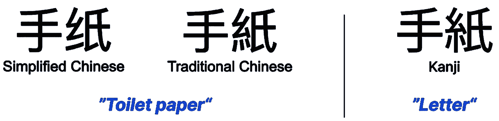
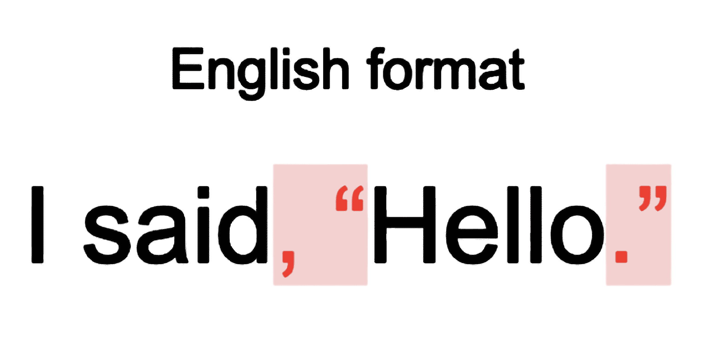
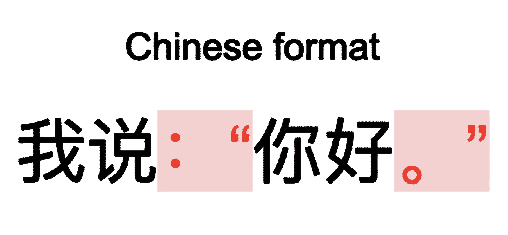
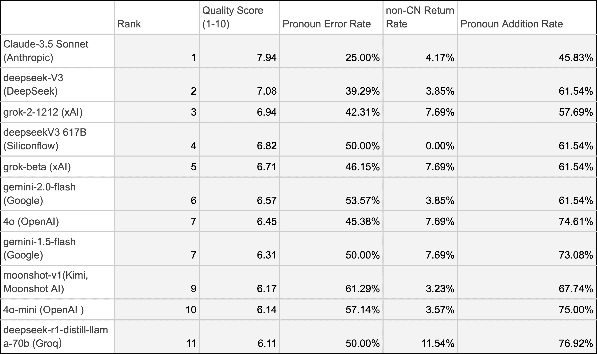
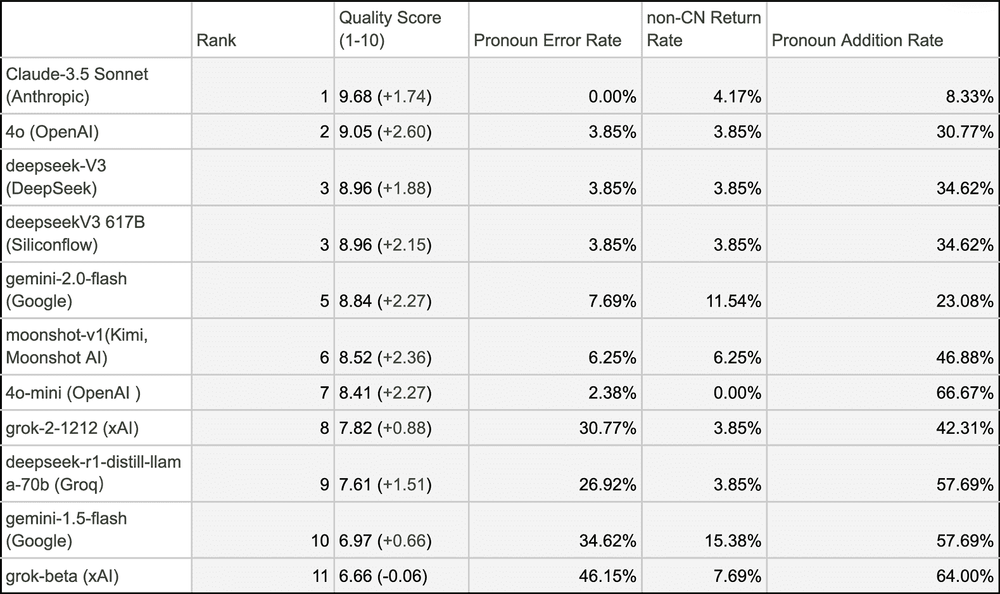
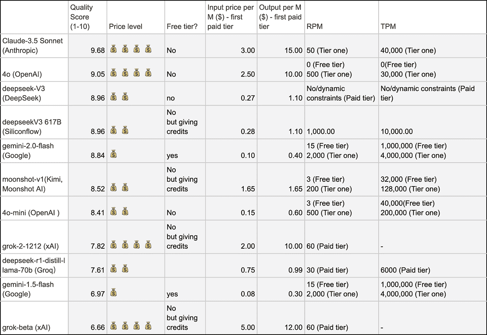

# 使用通用人工智能进行日中翻译：什么有效，什么无效

> 原文：[`towardsdatascience.com/japanese-chinese-translation-with-genai-what-works-and-what-doesnt/`](https://towardsdatascience.com/japanese-chinese-translation-with-genai-what-works-and-what-doesnt/)

# <mdspan datatext="el1743103028441" class="mdspan-comment">作者</mdspan>

[**万倩**](https://www.linkedin.com/in/alex-q-wan/): 万倩是一位专注于 B2B 产品人工智能的设计师。她目前在大微软工作，专注于机器学习和 Copilot 进行数据分析。之前，她是 VMware 的通用人工智能设计主管。

[**洪睿永**](https://www.linkedin.com/in/eli-ruoyong-hong/) : 洪睿永是罗伯特·博世的设计主管，专注于人工智能和沉浸式技术，开发将技术创新与人类社会动态相结合的系统，以创造更具文化意识和社交响应性的技术。

# 背景

想象你正在浏览社交媒体，并看到一篇关于房屋翻新的帖子，用另一种语言写成。以下是一个直接、逐字逐句的翻译：

> 最后，这所房子完全打扫干净了，设计计划也进行了调整。接下来，只等着施工队进来。期待最终结果！希望一切顺利！
> 
> 
> 
> *插图由万（Alex）倩绘制。*

如果你是英语翻译，你会如何翻译这句话？通用人工智能回答道：

> 我终于打扫干净了这所房子，并调整了设计计划。现在，我正等着施工队进来。我非常期待最终结果，希望一切顺利！

翻译看起来清晰且语法无误。然而，如果告诉你这实际上是一个以夸大其财富而臭名昭著的人的社交帖子呢？他们并不拥有那座房子——他们只是省略了这一点，让它看起来像他们拥有。通用人工智能错误地添加了“我”而没有承认其模糊性。更好的翻译应该是：

> 房子终于打扫干净了，设计计划也已经调整。现在，只等着施工队进来。期待看到最终结果——希望一切顺利！

在文学和日常生活中，“未言明”的语境起着重要作用的语言被称为“高语境语言”。

翻译高语境语言（如中文和日语）具有独特的挑战性，原因有很多。例如，通过省略代词，使用与历史或文化高度相关的隐喻，翻译者更加依赖于语境，并期望他们对文化、历史甚至地区差异有深入的了解，以确保翻译的准确性。

这一直是传统翻译工具（如 Google Translate 和 DeepL）的一个长期问题，但幸运的是，我们现在处于 Gen AI 时代，由于语境感知能力，翻译质量得到了显著提升，Gen AI 能够生成更多类似人类的内容。受到技术进步的启发，我们决定开发一个用于日常阅读的 Gen-AI 驱动的翻译浏览器扩展。

我们的扩展使用 Gen AI API。我们遇到的挑战之一是选择 AI 模型。鉴于市场上多样化的选择，这已经是一场持续数月的战斗。我们意识到，可能有许多人和我们一样——不是技术专家，预算较低，但对使用 Gen AI 弥合语言差距感兴趣，所以我们测试了 10 个模型，希望为观众带来洞见。

这篇文章记录了我们测试不同模型进行中文和日语翻译的历程，根据特定标准评估结果，并提供了一些实用的技巧和窍门来解决问题，以提高翻译质量。

# 谁可能会对这篇文章感兴趣？

任何正在使用或对使用多语言生成 AI（如我们这样的主题）感兴趣的人：也许你是为 AI 模型科技公司工作的团队成员，正在寻找潜在的改进。这篇文章将帮助你了解独特且显著影响中文和日语翻译准确性的关键因素。

如果你正在开发一个专注于语言翻译的 Gen AI 代理，这也可能激发你的灵感。如果你恰好是在寻找一个适合日常阅读翻译的高质量 Gen AI 模型的人，这篇文章将指导你根据需求选择 AI 模型。你还将找到一些技巧和窍门来编写更好的提示，这可以显著提高翻译输出的质量。

# 提醒

这篇文章主要基于我们的自身经验。我们专注于截至 2025 年 2 月 2 日（当 Gemini 2.0 和 DeepSeek 发布时）的某些 Gen AI，因此你可能会发现我们的观察结果与当前 AI 模型的性能有所不同，因为 AI 模型持续进化。

我们是非专家，我们尽力根据研究和实际测试来展示准确的信息。我们所做的工作纯粹是为了娱乐、自学和分享，但我们希望将关于 Gen AI 的文化视角的讨论引向深入。

文章中的许多例子都是在 Gen AI 的帮助下生成的，以避免版权问题。

# 我们最初选择的 Gen AI 模型

我们最初的考虑很简单。由于我们的翻译需求与中文、日语和英语相关，因此三种语言的翻译是首要任务。然而，很少有公司在他们的文档中具体说明了这种能力。我们发现唯一的是 Gemini，它具体说明了多语言性能。

> | **Capability** | Multilingual |
> | --- | --- |
> | **Benchmark** | Global MMLU (Lite) |
> | **Description** | MMLU 由人类翻译成 15 种语言。轻量版包括每种语言 200 个文化敏感样本和 200 个文化无关样本。  |
> | **Gemini 1.5 Flash** | 73.7% |
> | **Gemini 1.5 Pro** | 80.8% |
> 
> Kavukcuoglu, Koray. 2025\. “Gemini Model Updates.” Google DeepMind Blog, February. [`blog.google/technology/google-deepmind/gemini-model-updates-february-2025/`](https://blog.google/technology/google-deepmind/gemini-model-updates-february-2025/).

其次，但同样重要的是价格。我们对预算持谨慎态度，并试图避免因基于使用量的定价模型而破产。因此，当时 Gemini 1.5 Flash 成为了我们的首选。我们决定继续使用此模型的其他原因包括，它是最适合初学者的选项，因为其有详细的说明文档，并且拥有用户友好的测试环境——Gemini AI studio，这在使用和扩展我们的项目时减少了摩擦。

# Backup models

现在，Gemini 1.5 Flash 已经为我们打下了坚实的基础，在我们的第一次试运行中，我们发现它存在一些局限性。为了确保流畅的翻译和阅读体验，我们已经评估了几种其他模型作为备份：

+   **Grok-beta (xAI)**：到 2024 年底，Grok 的名气不如 OpenAI 的模型，但吸引我们的是零内容过滤器（这是我们观察到的 AI 模型在翻译过程中遇到的问题之一，将在稍后讨论）。在 2025 年之前，Grok 每月提供 20 美元的免费信用额度，这使得它对我们这样的节俭用户来说是一个有吸引力的、预算友好的选择。

+   **Deepseek-V3**：我们在中国市场推出 Deepseek 后立即将其集成，因为它比其他替代方案拥有更丰富的中文训练数据（他们与北京大学的工作人员合作进行数据标注）。另一个原因是其令人难以置信的低价格：折扣后，其价格几乎仅为 Grok-beta 的 1/100。然而，高响应时间是一个大问题。

+   **OpenAI GPT-4o**：它拥有良好的文档和强大的性能，但由于预算限制，我们没有将其视为一个选项，因为没有免费层。我们将其用作参考，但没有积极使用它。我们将在稍后仅为了测试目的将其集成。

我们还探索了一种混合解决方案——提供多种模型的供应商：

+   **Groq w/ Deepseek**：它首先是一个用于部署 Deepseek 的集成模型平台。这个版本是从 Meta 的 LLM 中提炼出来的，尽管它的 72B 使其功能略弱，但延迟可接受。他们提供免费层，但存在明显的 TPM 约束。

+   **Siliconflow：** 一个提供许多中文模型选择的平台，并且他们提供了免费积分。

# 翻译质量问题

当使用这些模型进行日常翻译（主要是简体中文、日语和英语之间的翻译）。我们发现存在许多明显的问题。

## 1. 专有名词/术语翻译不一致

当一个词或短语没有官方翻译（或有不同的官方翻译）时，AI 模型喜欢在同一文档中产生不一致的回复。

例如，日本名字“Asuka”在中文中有多种可能的翻译。人工翻译者通常会根据角色设定选择一种（在某些情况下，有日本汉字的参考，翻译者可以直接使用中文版本）。例如，一个女性角色可以翻译成“明日香”，而一个男性角色可能翻译为“飞鸟”（更基于意义）或“阿斯卡”（更基于音译）。然而，AI 的输出有时会在同一文本的不同版本之间切换。

在中文 speaking 地区，同一名词也有许多不同的官方翻译。一个例子是《哈利·波特》中的咒语“Expecto Patronum”。它有两个被接受的翻译：

> 
> 
> * * *
> 
> 

尽管我指定 AI 将文本翻译成简体中文，但它有时会在简体和繁体中文之间来回切换。

## 2. 代词使用过度

当从低语境语言翻译到高语境语言时，Gen AI 经常遇到的一个问题是添加额外的代词。

在中文或日语文学中，在指代人时有一些方法。就像许多其他语言一样，第三人称代词如 She/Her 被广泛使用。为了避免歧义或重复，以下两种方法也非常常见：

+   使用人物名称。

+   描述性短语（“the girl”，“the teacher”）。

这种写作偏好是日语和中文中代词使用频率较低的原因。在中国文学中，翻译成中文时，代词的使用仅占 20-30%，而在日语中，这个数字可能更低。

我还想强调的是：在何时、何地以及如何添加额外代词的频率上，并没有对错之分（实际上，这是翻译者的常见做法），但它存在风险，因为它可能会使翻译句子显得不自然，不符合读者的阅读习惯，或者更糟糕的是，误解了原本的意思并导致翻译错误。

下面是一个从日语到英语的翻译：

**原始日语句子（省略了代词）**

> 杰克看到首席执行官进入大楼。带着自信、兴奋和内心强烈的希望，走向会议室。

**AI 生成的翻译（带有错误的代词）**

> 杰克看到首席执行官进入大楼。带着自信、兴奋和内心强烈的希望，他走向会议室。

在这种情况下，作者故意避免提及代词，留下解释的空间。然而，由于 AI 试图遵循语法规则，这与其设计相冲突。

**更好的翻译，保留了原始意图**

> 杰克看到首席执行官进入大楼。带着自信、兴奋和内心强烈的希望，径直走向会议室。

## 3. AI 翻译中代词使用错误

额外的代词可能会因为数据偏差而导致错误代词的使用率更高；通常，这些错误是基于性别的。在上面的例子中，首席执行官实际上是一位女性，所以这种翻译是不正确的。AI 通常默认使用男性代词，除非明确提示。

> 杰克看到首席执行官进入大楼。带着自信、兴奋和内心强烈的希望，~~他~~ ***她*** 走向会议室。

另一个常见问题是 AI 在翻译中过度使用“我”。由于某种原因，这个问题几乎存在于所有模型中，如 GPT-4o、Gemini 1.5、Gemini 2.0 和 Grok。当主题不明确时，GenAI 模型默认使用第一人称代词。

## 4. 混合使用汉字、简体中文和繁体中文

我们遇到的另一个问题是 AI 模型在输出中混合了简体中文、繁体中文和汉字。由于历史和语言原因，许多现代汉字在视觉上与中文相似，但具有地区或语义上的差异。

虽然某些混合使用可能不正确但可能被接受，例如：

> 

这三个字符在视觉上也相似，并且它们共享某些含义，所以在某些非正式场合可能是可以接受的，但不适用于正式或专业沟通。

然而，其他情况可能会导致严重的翻译问题。下面是一个例子：

> 

如果 AI 在将日语直接转换为中文（在现代场景中）时使用这个词，句子“Jane 收到了她远亲的信”可能会变成“Jane 收到了她远亲的卫生纸”，这既不正确，又带有无意中的幽默感。

请注意，由于系统字体库中缺少字符，浏览器渲染的文本也可能存在问题。

## 5. 标点符号

通用人工智能有时在区分中文、假名和英语的标点符号方面做得不够好。以下是一个示例，展示了不同语言如何使用不同的方式书写对话（在现代常见写作风格中）：

> 

这可能看似微不足道，但可能会影响专业性。

## 6. 假内容过滤触发

我们还发现，通用人工智能内容过滤器可能对日语和中文（在使用 Gemini 1.5 Flash 时）更为敏感。即使内容完全无害。例如：

> 人並みにはできますよ！
> 
> 我可以做到平均水平！

大概来说，大约有 26 个样本中的 2 个触发了假内容过滤器。这个问题是随机出现的。

# 评估通用人工智能模型

完全出于好奇心，为了更好地了解不同通用人工智能模型的中文/日语翻译能力，我们对 7 个提供商的 10 个模型进行了结构化测试。

## 测试设置

任务：使用每个 AI 模型将用日语写的文章通过我们的翻译扩展翻译成简体中文。通用人工智能模型通过 API 连接。

样本：我们选择了一篇 30 段落的第三人称文章。每个段落的字符数从 4 到 120 不等。

处理结果：每个模型测试了三次，我们使用了中位数结果进行分析。

## 评估指标

我们充分尊重翻译质量的主观性，因此我们选择了三个可量化且代表高语境语言翻译挑战的指标。

### 代词错误率

此指标表示翻译样本中错误代词出现的频率，包括以下情况：

+   性别代词错误（例如，用“他”代替“她”）。

+   错误地从第三人称代词切换到其他视角

如果检测到任何不正确的代词，则将段落标记为受影响（+1）。

### 非中文返回率

一些模型在响应中随机输出假名、平假名或片假名。我们原本要计算包含这些字符的样本，但每个段落至少包含一个非中文字符，因此我们调整了评估，使其更有意义：

+   如果返回的翻译包含平假名、片假名或假名，且影响可读性，则会被计为翻译错误。例如：如果 AI 输出“對”而不是“对”，则不会标记，因为两者视觉上相似且不影响意义。

+   我们的翻译扩展内置了非中文字符功能。如果检测到，系统将重新翻译文本最多三次。如果非中文仍然存在，将显示错误信息。

### 代词添加率

如果翻译样本中包含原文段落中不存在的任何代词，则会被标记。

## 评分公式

所有三个指标都使用以下公式进行计算。N 代表受影响的段落（样本）数量。请注意，如果段落（样本）包含多种相同类型的错误，则只计一次。

> 率=N/30*100%

**质量得分**：为了更好地理解整体质量。我们还根据其对翻译的影响对三个指标进行了加权计算：代词错误率 > 非中文返回率 > 代词添加率。

# 模型比较 1：基础

在第一次运行中，我们仅通过指定角色和翻译任务来提供基础提示，而没有添加任何特定的翻译指南。目标是评估 AI 翻译的基线性能。

## 观察

一般而言，整体翻译质量不足以给观众带来“最佳阅读体验”。

**对于错误返回率**，即使是评分最高的模型，Claude 3.5 Sonnet，仍然有 30%的错误率。这意味着明显的翻译缺陷大约每 4 句话就能观察到一次。有趣的是，我们发现错误添加的代词总是第一人称“我”。这可能是因为在向量空间中，“我”这个词与动词向量的距离比其他代词更近。

**代词添加率**在大多数模型中超过了 50%。这个频率与英语写作习惯比中文（20-30%）或日语（更低）更吻合。这可能源于 AI 模型的训练数据。根据 OpenAI 的数据集统计，GPT-3 的训练数据由 92.65%的英语、0.11%的日语、0.1%的简体中文和 0.02%的繁体中文组成。这些差异表明训练数据集中在英语上，并揭示了翻译困难潜在的原因，包括输出中简体中文和繁体中文混合的问题，这在测试中也得到了观察。

> | **语言** | **单词数量** | **总单词百分比** |
> | --- | --- | --- |
> | 英语 | 181014683608 | 92.64708% |
> | 日语 | 217047918 | 0.11109% |
> | 简体中文 | 193517396 | 0.09905% |
> | 繁体中文 | 38583893 | 0.01975% |
> 
> (OpenAI, “GPT-3 数据集中按单词计数的语言，”最后修改于 2020 年，[`github.com/openai/gpt-3/blob/master/dataset_statistics/languages_by_word_count.csv`](https://github.com/openai/gpt-3/blob/master/dataset_statistics/languages_by_word_count.csv))。

# Bandit solution

我们进行了一些不太花哨的解决方案，以确保翻译的一致性和良好性。

## 使用不同模型的重翻译

如果条件允许（预算和技术可行性），可以使用备用模型重新翻译主模型无法翻译的案例。这适用于未翻译的日语文本（非中文返回）。我们主要使用 Grok-beta 直到 2025 年 1 月中旬。

## 翻译指导：代词

为了防止 AI 不必要地插入主题，我们特别指示 AI 忽略语法规则。以下是我们的提示：

> **代词处理要求：**
> 
> * **代词一致性** 严格遵循原文。
> 
> * **代词处理** 除非原文中明确提及，否则不要添加主题，即使这会导致语法错误。

同时，提供示例对于 AI 理解你的要求非常有用。

> **代词处理**
> 
> * **原始日语句子（省略了主题）：ジャックは最高経営責任者が建物に入るのを見た。自信と興奮、そして強い希望を胸に、会議室へ向かった
> 
> * **错误的 AI 生成翻译（添加了不必要的主题）：杰克看到 CEO 进入大楼。带着自信、兴奋和强烈希望的心情，他走向会议室
> 
> * **好的例子（语法正确，没有代词）：杰克看到 CEO 进入大楼。带着自信、兴奋和强烈希望的心情，走向会议室。
> 
> * **可接受的例子（省略主语但语法错误）：“杰克看到 CEO 进入大楼。带着自信、兴奋和强烈的心愿，前往会议室。”

## 翻译指导：词汇表

我还编写了一个如下所示的词汇表清单。这显著减少了错误代词的出现并标准化了术语翻译。

> | 日本语 | 英语 | 中文 | 备注 |
> | --- | --- | --- | --- |
> | シカゴ | Chicago | 芝加哥 | 官方地点名称 |
> 
> | 俺 | I | 我 | 第一人称代词，非正式，粗鲁的语气，主要用于男性 | | アスカ | Asuka | 飞鸟 | 一个年轻男性角色名称  | *…*

## 调整模型参数

一般而言，降低参数有助于避免随机性。作为一个喜欢编写提示的人，AI 更严格地遵循提示比在输出中具有创造性更重要。因此，我们降低了 top-p、top-k 和温度。Deepseek AI 官方推荐翻译的温度为 1.3，但为了更好地遵循提示，我们将它调整为 1.0 或更低。TopK 减少了 20%。这效果相当不错。Gemini 1.5 flash 用于随机输出一个原文中不存在的完整段落内容。调整参数后，这个问题再也没有出现。

这种方法减少了变异性，但不可扩展，因为每个模型根据其大小、进展等因素会有不同的反应。

# 模型比较 2：有翻译指导

在测试的第二轮中，我们将翻译指导作为比较。

## 观察

在应用翻译指导后，所有模型的总体翻译质量显著提高。以下是不同 AI 模型在这些改进条件下的性能详细比较。

你可以轻松地看出，在翻译指导下，翻译质量得到了显著提高。

对于主要指标**代词错误率**：Claude-3.5 Sonnet、OpenAI GPT-4o、DeepSeek V3 作为领跑者，表现出强大的准确性。Gemini 2.0 Flash 和 Moonshot-V1（Kimi）存在一些小问题，但对于大多数非专业日语-中文翻译需求来说是足够的。

根据代词添加率的检测结果。Claude-3.5 Sonnet 严格遵循翻译指导并准确执行，仅代词添加率为 8%。Gemini 2.0 Flash 的代词添加率为 20%。这是一个可接受的结果，因为它符合中文写作习惯。

# 选择合适的 AI 模型进行英语-中文-日语翻译

最佳模型选择取决于个人需求，考虑因素包括预算、每分钟请求量（RPM）限制以及生态系统兼容性。选择用于英语-中文-日语翻译的 AI 模型。

**对于那些** **没有预算限制** **的人来说**，Claude-3.5 Sonnet 和 OpenAI GPT-4o 是最佳选择，因为它们整体性能强大。

**对于北美入门级开发者**来说，Gemini 2.0 Flash 因其价格合理、响应时间良好而是一个优秀选择。我们选择它作为主要提供商的另一个原因是谷歌的云服务生态系统（OCR、云存储等）使得扩展开发项目更加容易。

**对于寻求平衡价格和质量**的通用人工智能高级用户来说，DeepSeek 提供低价、无限 RPM 和开源灵活性。这对于不想在翻译质量上妥协的成本敏感型用户来说是一个强有力的选择。然而，当在北美使用官方 API 平台时，我们遇到了较长的响应时间，这可能是在需要实时或长上下文翻译时的一个限制。幸运的是，许多服务在其他服务器（如 Microsoft Azure、Groq 和 Siliconflow，或者甚至可以部署到您自己的本地服务器）上集成了 DeepSeek，或者在中国使用它可以避免这些问题。此外，模型大小可以显著影响翻译性能——如果您能使用 671B 的全功能版本，将获得最佳效果。

# 局限性和考虑因素

我们明白这些测试并不完美。即使我们试图确保数据多样化和正确的数据量，仍有很大的改进空间。例如，我们的样本量不足以达到统计显著性。AI 模型性能在任何时刻都可能波动，术语翻译不一致等问题没有被捕捉到，但对于某些受众来说可能很重要，翻译质量也无法定量反映。我们提供这些测试只是为了学习和希望它们能作为您的参考点。

# 通用人工智能翻译的未来

我们非常感谢生成式人工智能的进步，它有助于弥合语言鸿沟，使来自不同语言和文化背景的人们更容易获取知识。

然而，我们仍然可以看到许多挑战需要克服——尤其是对于非英语语言。

有一种观点认为翻译不需要高级的 AI 模型，但“足够好”还不够。从成本角度来看，这种观点可能是正确的，并且从以英语为中心的角度来看也很有道理。然而，如果“足够好”的标准是基于 AI 提供商的官方性能报告，那么它可能准确地反映了非英语翻译的性能。正如你可以清楚地看到，像日语和中文这样的高语境语言翻译在准确性和流畅性上仍然存在挑战。提高 AI 翻译质量、更好的上下文理解和文化意识还有很长的路要走。

**成本**

Deepseek 为 AI 翻译市场带来了更多的竞争。定价仍然是人们关注的重点，有时甚至比性能更重要。

如果你每天有中等或高量的翻译需求（学术阅读、新闻、视频字幕等），使用高级模型每月的费用可能在 20 到 80 美元之间。对于处理本地化和国际化的企业，这些成本会迅速增加。

**没有其他途径：提示以获得更好的翻译**

另一个主要挑战是 AI 模型仍然需要用户编写长而复杂的提示才能达到基本的可读性。例如，在翻译某些特定领域的专业主题时，我别无选择，只能编写超过 5000 个字符的英文提示（几乎相当于写了一整篇文档），只是为了引导 AI 达到可接受的品质。更不用说更长的提示意味着更高的 token 使用量。

如果 AI 真的要打破语言障碍，那么在使翻译模型更准确、更具有上下文意识、减少对长提示的依赖方面还有很大的改进空间。为了让 AI 翻译变得简单、经济高效，并且真正对每个人开放，还有大量的工作要做，但 AI 已经取得了比任何人都能想象的更多成就，我为此庆祝并感激这些技术进步。
