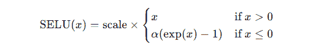
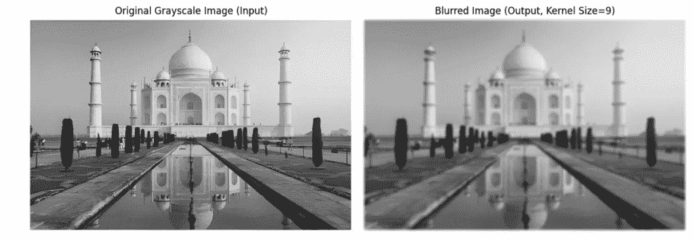

# JAX：这是 Google 的 NumPy 杀手吗？

> 原文：[`towardsdatascience.com/jax-is-this-googles-numpy-killer/`](https://towardsdatascience.com/jax-is-this-googles-numpy-killer/)

<mdspan datatext="el1748461576448" class="mdspan-comment">NumPy 是 Python 中数值计算的无可争议的冠军。其强大的 N 维数组和丰富的函数生态系统对于科学家、工程师和数据分析师来说是不可或缺的。然而，随着计算需求的增长，尤其是在机器学习和大规模科学模拟中，NumPy 的 CPU 绑定特性和缺乏内置的自动微分带来了限制。

这正是 JAX 希望填补的空白。JAX 是 Google Research 的一个库，旨在克服这些障碍，有效地将 NumPy 功能带入现代硬件加速器和基于梯度的优化领域。

请注意，JAX 库是一个研究项目，而不是官方的 Google 产品。正如他们的 GitHub 仓库所示，预期会有**“锋利的边缘”**和潜在的 bug。

## 什么是 NumPy？

如果你参与科学 Python，你很可能熟悉 NumPy。它提供了核心 ndarray 对象，用于高效存储和操作密集数值数组，以及一个庞大的数学函数库，这些函数通常通过 C、C++或 Fortran 代码优化，以便比纯 Python 循环更快地在这些数组上运行。

这是构建大部分科学 Python 生态系统（SciPy、Pandas、Scikit-learn、Matplotlib）的基础。然而，其主要设计目标是 CPU 执行，而不是 GPU，并且本身不支持自动梯度计算。

那最后一个观点至关重要，因为梯度衡量了函数输出随输入变化的情况，指示了最陡增减方向。这一信息对于优化算法至关重要，尤其是在机器学习中，梯度引导模型参数的调整以最小化训练过程中的误差。高效计算梯度使得大型语言模型能够从数据中学习复杂的模式。

## 什么是 JAX？

**JAX** 是由 Google 开发的 Python 高性能数值计算库。它结合了 NumPy-like API、自动微分（autodiff）以及在图形或张量处理单元（GPU/TPU）上的加速硬件执行。

其主要特性包括，

+   `jax.numpy.` NumPy 的替代品（相同的 API，但支持 GPU/TPU）

+   `jax.grad.` 函数的自动微分（类似于 TensorFlow 或 PyTorch）

+   `jax.jit.` 通过加速线性代数（XLA）库进行即时编译，以实现快速执行

+   `jax.vmap`, `jax.pmap.` 自动向量化和平行化

+   `GPU/TPU 支持.` 无需更改代码即可在加速器上无缝运行

## 为什么使用 JAX？

当你需要时应该考虑使用 JAX...

+   通过利用 GPU 或 TPU，显著加快 NumPy-like 计算的速度。

+   自动计算你的数值 Python 函数的梯度以进行优化（机器学习、物理模拟等）。

+   通过 JIT 编译关键的 Python 代码段到优化的 XLA 可执行文件，以实现进一步的加速。

+   容易将函数向量化以处理数据批次或跨多个加速器设备并行化计算。

在决定使用 JAX 而不是 NumPy 之前，你需要知道这两个库之间也有一些关键的区别。虽然 `jax.numpy` 模拟了 NumPy API，但请注意以下区别：

1. 执行后端与编译。

NumPy 在 CPU 上急切执行，通常使用预编译的 C、C++ 或 Fortran 扩展和优化的线性代数库，如 OpenBLAS。

JAX 使用 XLA 编译器将 JAX 代码转换为针对 CPU、GPU 或 TPU 的优化机器代码。使用 `jax.jit` 可以即时编译执行，通常异步调度。

2. 执行模型。

NumPy 操作通常同步执行——Python 解释器在操作完成之前会等待。

JAX 操作异步地调度到加速器。Python 代码可以在计算发生时继续运行。你通常需要使用 result.block_until_ready() 来进行精确计时或在使用它之前确保结果可用（例如，打印）。在第一次调用时，jax.jit 添加了一个编译步骤。

3. 可变性。

NumPy 数组（ndarray）是可变的。你可以就地更改元素（例如，a[0] = 100）。

JAX 数组是 ***不可变的***，不允许就地更新。这种函数式方法对于 JAX 的转换能够可靠地工作且没有副作用至关重要。更新需要使用索引更新语法创建新的数组。

4. 随机数生成。

NumPy 使用全局随机数生成器状态（np.random.seed(), np.random.rand()）。这在并行或转换代码的可重复性中可能会出现问题。

JAX 需要显式处理随机键。你必须手动管理和分割键以确保可重复的随机性。

5. API 覆盖范围。

NumPy 拥有一个全面的 API，涵盖了数值计算的许多领域。

JAX 覆盖了最常见 NumPy API 的大多数部分，但不是 100% 的直接替换。一些不太常见的函数、某些数据类型（如对象数组）或特定行为可能不同或缺失。

## 预先条件

好的，让我们开始并看看一些编码示例。我在 Windows 上使用 WSL2 Ubuntu 进行开发。

我很幸运在我的系统上有一个 Nvidia GPU，所以我的代码将针对它。如果你没有 GPU，你仍然可以在 CPU 上享受比 NumPy 加速的代码。如果你是这样或者你有不同的 GPU 品牌，请查看本文末尾的官方文档（链接），以获取为您的系统安装 JAX 的说明。

第一步是创建我们的环境。我使用 conda 来做这件事，但请随意使用您最舒适的方法。

```py
(base) $ conda create -n jax_test python=3.13 -y
```

现在，激活它并安装任何必要的库。注意，由于我正在为 NVIDIA GPU 安装，因此还必须安装适当的 NVIDIA 驱动程序和 CUDA 环境，例如 CUDA 11 或 CUDA 12。这里我不会详细介绍，但一个全面的解释可以在[NVIDIA 网站](https://docs.nvidia.com/cuda/archive/12.8.1/cuda-quick-start-guide/index.html)上找到。

接下来，激活你的新环境并安装所需的库。

```py
(base) $ conda activate jax_test
(jax_test) $ pip install jupyter numpy "jax[cuda12]" matplotlib pillow
```

在我的系统上安装 JAX 是一个漫长的过程，但最终会结束，然后你可以开始一个 Jupyter 笔记本。你应该在浏览器中看到一个笔记本打开。如果这没有自动发生，你可能会在`jupyter notebook`命令后看到一屏幕的信息。在底部附近，你会找到一个可以复制并粘贴到浏览器中以启动 Jupyter Notebook 的 URL。

你的 URL 将与我的不同，但它应该看起来像这样：-

```py
http://127.0.0.1:8888/tree?token=3b9f7bd07b6966b41b68e2350721b2d0b6f388d248cc69d
```

### 代码示例 1—熟悉的 API 和 JIT 编译

我们的第一个例子展示了我们如何通过即时编译来提高性能，超过 NumPy。这个例子说明了 SELU（缩放指数线性单元）函数应用于一个 10,000 x 10,000 的数组。SELU 是自归一化神经网络中流行的激活函数，定义为，



这是通过使用`np.where`（NumPy）或`jnp.where`（JAX）实现的，它为`x`的正负值选择不同的公式。

代码展示了三种实现

1.  `selu_numpy(x)`—常规 NumPy 版本

1.  `selu_jax(x)`—JAX 版本（相同的代码，但使用 JAX 数组）

1.  `selu_jax_jit(x)`—与上面相同，但用`@jax.jit`包装以编译和加速函数

代码生成一个大型数据集：一个**10,000 x 10,000**的随机数数组。然后它测量每个实现运行所需的时间：

+   `selu_numpy`: 纯 NumPy—直接在 CPU 上运行

+   `selu_jax`: 没有 JIT 的 JAX—较慢，因为它解释函数

+   `selu_jax_jit`: JAX 与 JIT—第一次编译函数，然后在后续运行中超级快

注意：

+   `block_until_ready()`在 JAX 中用于等待操作完成，因为 JAX 是异步运行的

+   在第一次 JIT 运行期间，由于编译，会有额外的时间。

+   在第二次 JIT 运行中，复制的函数被重用，这使得它**显著****更快**。

```py
import numpy as np
import jax
import jax.numpy as jnp
from timeit import default_timer as timer

# Define constants for SELU
alpha = 1.6732632423543772848170429916717
scale = 1.0507009873554804934193349852946

# --- NumPy version ---
def selu_numpy(x):
  return scale * np.where(x > 0, x, alpha * np.exp(x) - alpha)

# --- JAX version ---
def selu_jax(x):
  return scale * jnp.where(x > 0, x, alpha * jnp.exp(x) - alpha)

# --- JIT-compiled JAX version ---
# Apply the @jax.jit decorator
@jax.jit
def selu_jax_jit(x):
  return scale * jnp.where(x > 0, x, alpha * jnp.exp(x) - alpha)

# Generate some data
x_np = np.random.rand(10000, 10000).astype(np.float32)
# Use JAX's random number generation (requires a key)
key = jax.random.PRNGKey(0)
x_jax = jax.random.normal(key, (10000, 10000), dtype=jnp.float32) # Use JAX random for consistency

print("Running benchmarks...")

# --- Benchmarking ---

# NumPy
start = timer()
result_np = selu_numpy(x_np)
# No need to block for NumPy as it's synchronous on CPU
print(f"NumPy time: {timer()-start:.6f} seconds")

# JAX (without JIT) - first run might have slight overhead
start = timer()
result_jax = selu_jax(x_jax)
result_jax.block_until_ready() # IMPORTANT: Wait for JAX computation to finish
print(f"JAX (no jit) time: {timer()-start:.6f} seconds")

# JAX (with JIT) - First run (includes compilation time)
start = timer()
result_jax_jit = selu_jax_jit(x_jax)
result_jax_jit.block_until_ready()
print(f"JAX (jit) first run time (incl. compile): {timer()-start:.6f} seconds")

# JAX (with JIT) - Second run (uses cached compiled code)
start = timer()
result_jax_jit_2 = selu_jax_jit(x_jax)
result_jax_jit_2.block_until_ready()
print(f"JAX (jit) second run time: {timer()-start:.6f} seconds")

# Verify results are close 
print(np.allclose(selu_numpy(np.array(x_jax)), result_jax_jit_2, atol=1e-6)) # Should be True
```

以及输出。

```py
Running benchmarks...
NumPy time: 0.357104 seconds
JAX (no jit) time: 0.108734 seconds
JAX (jit) first run time (incl. compile): 0.026956 seconds
JAX (jit) second run time: 0.002400 seconds
True
```

如果我的数学不错，我让第二个 JIT 运行比 NumPy 运行快 100 多倍！即使是 no-jit 运行也比 NumPy 快 3 倍。

### 示例 2：自动微分（jax.grad）

展示了 JAX 计算梯度的简便性。

```py
import jax
import jax.numpy as jnp

# Define the function using jax.numpy
def cubic_sum(x):
  return jnp.sum(x**3)
# Get the gradient function using jax.grad
grad_cubic_sum = jax.grad(cubic_sum)

# Create some input data
x_input = jnp.arange(1.0, 5.0) # JAX array

# Calculate the gradient
gradient = grad_cubic_sum(x_input)
print(f"\n--- Autodiff Example ---")
print(f"Original function input: {x_input}")
print(f"Function output f(x): {cubic_sum(x_input)}")
print(f"Gradient df/dx: {gradient}") # Should be [ 3\. 12\. 27\. 48.]
```

```py
--- Autodiff Example ---
Original function input: [1\. 2\. 3\. 4.]
Function output f(x): 100.0
Gradient df/dx: [ 3\. 12\. 27\. 48.]
Expected gradient: [ 3\. 12\. 27\. 48.]
```

我们正在分析的原函数是 x³。它的一阶导数是 3x²。因此，对于每个输入，即 1,2,3,4，我们计算一阶导数的值。所以我们最终得到，

3 x 1² = 3

3 x 2² = 12

3 x 3² = 27

3 x 4² = 48

### 示例 3：使用 jax.vmap 进行矩阵乘法

这突出了向量化操作的性能差异，因为我们用一个包含 10,000 个元素的矩阵乘以一个包含 128 x 10,000 个元素的向量的批次。

```py
import numpy as np
import jax
import jax.numpy as jnp
from timeit import default_timer as timer

# --- Function for a single data point ---
# Multiply a matrix (M) by a vector (v)
def mat_vec_product(matrix, vector):
    return jnp.dot(matrix, vector)

# --- Create batched version using vmap ---
# We want to apply mat_vec_product to each vector in a batch.
# The matrix stays the same for all vectors in the batch.
# in_axes=(None, 0) means:
#   None: Don't map over the first argument (matrix), broadcast it.
#   0: Map over the first axis (axis 0) of the second argument (the batch of vectors).
batched_mat_vec = jax.vmap(mat_vec_product, in_axes=(None, 0))

# --- JIT compile the vmapped function for performance ---
@jax.jit
def batched_mat_vec_jit(matrix, vectors):
    # Note: vmap is often combined with jit
    return jax.vmap(mat_vec_product, in_axes=(None, 0))(matrix, vectors)

# --- Setup Data ---
matrix_size = 10000
vector_size = 10000
batch_size = 128
dtype = jnp.float32

key = jax.random.PRNGKey(0)
key, subkey1, subkey2 = jax.random.split(key, 3)

# JAX data
matrix_jax = jax.random.normal(subkey1, (matrix_size, vector_size), dtype=dtype)
vectors_jax = jax.random.normal(subkey2, (batch_size, vector_size), dtype=dtype) # Batch first

# NumPy data
matrix_np = np.array(matrix_jax)
vectors_np = np.array(vectors_jax)

print(f"\n--- vmap Benchmark (Matrix: {matrix_size}x{vector_size}, Batch Size: {batch_size}) ---")
print(f"JAX devices available: {jax.devices()}")

# --- Benchmarking ---

# NumPy Approach 1: Python Loop (Illustrative, usually slow)
start_np_loop = timer()
output_np_loop = np.array([np.dot(matrix_np, v) for v in vectors_np])
end_np_loop = timer()
print(f"NumPy (Python loop) time: {end_np_loop - start_np_loop:.6f} seconds")

# NumPy Approach 2: Matmul with transpose (Another efficient way)
start_np_matmul = timer()
# Need vectors_np to be (vector_size, batch_size) for matmul
output_np_matmul = (matrix_np @ vectors_np.T).T
end_np_matmul = timer()
print(f"NumPy (matmul @) time: {end_np_matmul - start_np_matmul:.6f} seconds")

# JAX vmap (no jit)
start_jax_vmap = timer()
output_jax_vmap = batched_mat_vec(matrix_jax, vectors_jax)
output_jax_vmap.block_until_ready()
end_jax_vmap = timer()
print(f"JAX (vmap, no jit) time: {end_jax_vmap - start_jax_vmap:.6f} seconds")

# JAX vmap (jit) - First run (compilation)
start_jax_vmap_jit_compile = timer()
output_jax_vmap_jit_compile = batched_mat_vec_jit(matrix_jax, vectors_jax)
output_jax_vmap_jit_compile.block_until_ready()
end_jax_vmap_jit_compile = timer()
print(f"JAX (vmap+jit) first run (incl. compile): {end_jax_vmap_jit_compile - start_jax_vmap_jit_compile:.6f} seconds")

# JAX vmap (jit) - Second run
start_jax_vmap_jit = timer()
output_jax_vmap_jit = batched_mat_vec_jit(matrix_jax, vectors_jax)
output_jax_vmap_jit.block_until_ready()
end_jax_vmap_jit = timer()
print(f"JAX (vmap+jit) second run time: {end_jax_vmap_jit - start_jax_vmap_jit:.6f} seconds")
```

这里是输出。

```py
--- vmap Benchmark (Matrix: 10000x10000, Batch Size: 128) ---
JAX devices available: [CudaDevice(id=0)]
NumPy (Python loop) time: 1.129315 seconds
NumPy (matmul @) time: 0.029319 seconds
JAX (vmap, no jit) time: 0.901569 seconds
JAX (vmap+jit) first run (incl. compile): 0.539354 seconds
JAX (vmap+jit) second run time: 0.001776 seconds
```

如您所见，与其它相比，第一次 JIT 编译周期花费的时间很长，但之后的加速效果令人印象深刻。

### 示例 4：图像卷积（高斯模糊）

为了更实际的例子，让我们来考察卷积。卷积是图像处理中的基本操作，用于诸如模糊、锐化和边缘检测等任务。它涉及将一个小矩阵（核）在图像上滑动，并在每个位置计算核下像素的加权总和。我们将使用数组切片和逐元素操作来实现高斯模糊的基本版本，以查看 jax.jit 如何优化这个序列。

这里是我的输入图像。


原始图像由 Yury Taranik 提供（授权自 Shutterstock）

简而言之，代码执行以下操作：

将彩色输入图像转换为灰度，然后将其加载到 NumPy 数组中并进行归一化。

定义一个可配置大小和标准差的二维高斯核。

以三种方式实现手动 2D 卷积函数：

+   纯 NumPy 在 CPU 上

+   JAX 数组操作（在 JIT 编译之前）

+   使用`@jax.jit`进行优化的 JAX（包含一次预热运行和一次计时运行）

对每个变体进行基准测试，打印时间并检查模糊后的输出在浮点数容差范围内是否匹配。

使用 Matplotlib 并排显示原始（灰度）和模糊图像，以便您可以直观地确认模糊效果。

```py
import numpy as np
import jax
import jax.numpy as jnp
from timeit import default_timer as timer
from PIL import Image # Import Pillow
import matplotlib.pyplot as plt
import os # To check if file exists

# --- Configuration ---

image_path = "/mnt/d/images/taj_mahal.png" 
kernel_size = 9 # Increased kernel size slightly for more visible blur
sigma = 2.5
dtype = jnp.float32

# --- Check if image file exists ---
if not os.path.exists(image_path):
    print(f"ERROR: Image file not found at '{image_path}'")
    print("Please update the 'image_path' variable in the script.")
    exit() # Stop execution if image is not found

# --- Load and Prepare Image ---
print(f"Loading image from: {image_path}")
try:
    # Open image, convert to grayscale ('L'), then to NumPy array
    with Image.open(image_path) as img:
        image_np_uint8 = np.array(img.convert('L')) # Convert to grayscale uint8

    # Normalize to float32 between 0.0 and 1.0
    image_np = image_np_uint8.astype(np.float32) / 255.0
    image_jax = jnp.array(image_np) # Convert to JAX array

    image_size_h, image_size_w = image_np.shape
    print(f"Image loaded successfully ({image_size_h}x{image_size_w})")

except Exception as e:
    print(f"ERROR: Failed to load or process image '{image_path}'. Error: {e}")
    exit()

# --- Define a simple Gaussian kernel ---
def gaussian_kernel(size, sigma=1.0):
    """Creates a 2D Gaussian kernel using JAX."""
    ax = jnp.arange(-size // 2 + 1., size // 2 + 1.)
    xx, yy = jnp.meshgrid(ax, ax)
    kernel = jnp.exp(-(xx**2 + yy**2) / (2\. * sigma**2))
    return (kernel / jnp.sum(kernel)).astype(dtype) # Normalize and set dtype

# --- Convolution implementation using basic array ops ---
def convolve_2d_manual(image, kernel):
    im_h, im_w = image.shape
    ker_h, ker_w = kernel.shape
    pad_h, pad_w = ker_h // 2, ker_w // 2
    padded_image = jnp.pad(image, ((pad_h, pad_h), (pad_w, pad_w)), mode='edge')
    output = jnp.zeros_like(image)
    for i in range(ker_h):
        for j in range(ker_w):
            image_slice = jax.lax.dynamic_slice(padded_image, (i, j), (im_h, im_w)) # Use dynamic_slice for JIT
            output += kernel[i, j] * image_slice
    return output

# --- JIT-compiled version ---
@jax.jit
def convolve_2d_manual_jit(image, kernel):
    # Identical logic, but JIT will optimize it
    im_h, im_w = image.shape
    ker_h, ker_w = kernel.shape
    pad_h, pad_w = ker_h // 2, ker_w // 2
    padded_image = jnp.pad(image, ((pad_h, pad_h), (pad_w, pad_w)), mode='edge')
    output = jnp.zeros_like(image)
    # Unrolling loop slightly for potentially better JIT tracing (optional)
    for i in range(ker_h):
        for j in range(ker_w):
            # Use jax.lax.dynamic_slice for compatibility with JIT when slice sizes are dynamic
            image_slice = jax.lax.dynamic_slice(padded_image, (i, j), (im_h, im_w))
            output += kernel[i, j] * image_slice
    return output

# --- NumPy equivalent for comparison ---
def convolve_2d_manual_np(image, kernel):
    im_h, im_w = image.shape
    ker_h, ker_w = kernel.shape
    pad_h, pad_w = ker_h // 2, ker_w // 2
    padded_image = np.pad(image, ((pad_h, pad_h), (pad_w, pad_w)), mode='edge')
    output = np.zeros_like(image)
    for i in range(ker_h):
        for j in range(ker_w):
            image_slice = padded_image[i:i + im_h, j:j + im_w]
            output += kernel[i, j] * image_slice
    return output

# --- Setup Kernel ---
kernel_jax = gaussian_kernel(kernel_size, sigma=sigma)
kernel_np = np.array(kernel_jax) # Copy for NumPy

print(f"\n--- Convolution Benchmark (Image: {image_size_h}x{image_size_w}, Kernel: {kernel_size}x{kernel_size}) ---")
print(f"JAX devices available: {jax.devices()}")

# --- Benchmarking ---

# NumPy (CPU)
start_np = timer()
output_np = convolve_2d_manual_np(image_np, kernel_np)
end_np = timer()
print(f"NumPy (manual conv) time: {end_np - start_np:.6f} seconds")

# JAX (no jit) - Run once to warm up if needed
start_jax = timer()
output_jax = convolve_2d_manual(image_jax, kernel_jax)
output_jax.block_until_ready()
end_jax = timer()
print(f"JAX (no jit, manual conv) time: {end_jax - start_jax:.6f} seconds")

# JAX (jit) - First run (compilation)
start_jax_compile = timer()
output_jax_jit_compile = convolve_2d_manual_jit(image_jax, kernel_jax)
output_jax_jit_compile.block_until_ready()
end_jax_compile = timer()
print(f"JAX (jit, manual conv) first run (incl. compile): {end_jax_compile - start_jax_compile:.6f} seconds")

# JAX (jit) - Second run
start_jax_jit = timer()
output_jax_jit = convolve_2d_manual_jit(image_jax, kernel_jax)
output_jax_jit.block_until_ready()
end_jax_jit = timer()
print(f"JAX (jit, manual conv) second run time: {end_jax_jit - start_jax_jit:.6f} seconds")

# Verify results (expect some difference due to float32 accumulation)
max_diff_conv = np.max(np.abs(output_np - output_jax_jit))
print(f"Convolution max absolute difference: {max_diff_conv:.6f}")
# Use appropriate tolerances for float32 convolution
print(f"Convolution results close (atol=1e-3, rtol=1e-3): {np.allclose(output_np, output_jax_jit, atol=1e-3, rtol=1e-3)}")

# --- Visualization ---
print("\n--- Visualizing Input and Output ---")

fig, axes = plt.subplots(1, 2, figsize=(12, 6)) # Adjusted figure size

# Display the original grayscale image
axes[0].imshow(image_np, cmap='gray', vmin=0, vmax=1) # Use the loaded numpy image
axes[0].set_title('Original Grayscale Image (Input)')
axes[0].axis('off')

# Display the blurred output image (using the NumPy result for consistency in visualization)
axes[1].imshow(output_np, cmap='gray', vmin=0, vmax=1)
axes[1].set_title(f'Blurred Image (Output, Kernel Size={kernel_size})')
axes[1].axis('off')

plt.tight_layout()
plt.show()
```

让我们看看输出。请注意，输入图像是彩色的，在转换成黑白图像是正常的行为。

```py
Loading image from: /mnt/d/images/taj_mahal.png
Image loaded successfully (473x716)

--- Convolution Benchmark (Image: 473x716, Kernel: 9x9) ---
JAX devices available: [CudaDevice(id=0)]
NumPy (manual conv) time: 0.025815 seconds
JAX (no jit, manual conv) time: 0.234791 seconds
JAX (jit, manual conv) first run (incl. compile): 0.366345 seconds
JAX (jit, manual conv) second run time: 0.000238 seconds
Convolution max absolute difference: 0.000000
Convolution results close (atol=1e-3, rtol=1e-3): True
```

再次，我们在第二次 JIT 运行中看到了 100 倍的速度提升。太神奇了。

这里是输出图像。



作者的作品。原始输入图像由 Yury Taranik 提供（授权自 Shutterstock）

## 摘要

JAX 代表了 Python 中高性能数值计算的重大进步。通过提供类似 NumPy 的接口，结合强大的函数转换（grad、jit、vmap 等）以及通过加速线性代数（XLA）在加速器上的高效执行，它解锁了现代机器学习和大规模科学计算所必需的能力。

它的显著性能提升和内置的自动微分可能使其成为研究人员和工程师在计算科学边界上不可或缺的工具。如果你的 NumPy 代码遇到性能瓶颈或需要梯度，JAX 可能提供一条令人信服的前进之路。

如我开头所说，这是一个来自谷歌的实验性项目。他们是否会继续努力将其变成官方的谷歌产品？谁知道呢？但如果他们真的这样做，NumPy 可能就需要开始关注这个新出现的竞争者了。然而，已经存在大量的 NumPy 代码，因此即使 JAX 得到广泛采用，它可能也需要很多年才能取代 NumPy。而且你可以确信，在此期间，NumPy 的开发团队不会袖手旁观。

这里有一个链接到官方的 JAX 文档。

[`docs.jax.dev/en/latest`](https://docs.jax.dev/en/latest)
