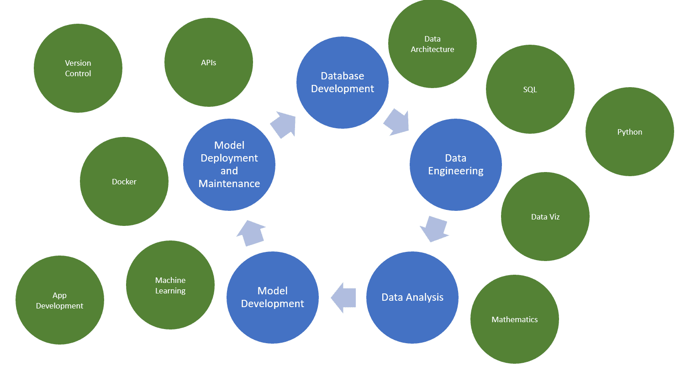
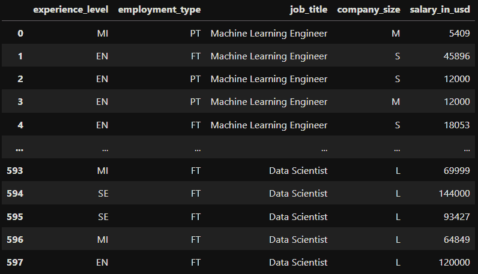
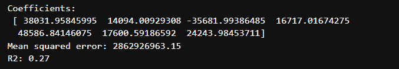
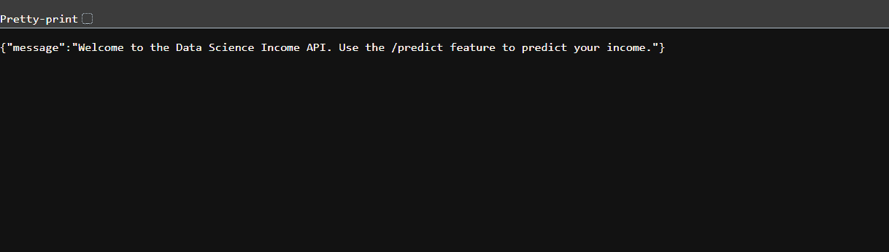
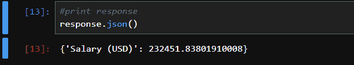
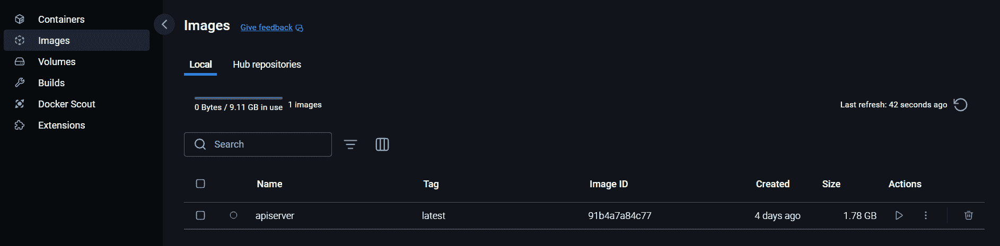
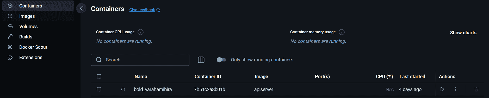

# 全栈数据科学家之路：模型部署

> 原文：[`towardsdatascience.com/journey-to-full-stack-data-scientist-model-deployment-f385f244ec67/`](https://towardsdatascience.com/journey-to-full-stack-data-scientist-model-deployment-f385f244ec67/)

## 数据科学家的增长责任

数据科学家的头衔一直在变化，通常比较模糊。它通常涉及一个精通数学、编程和机器学习的人。他们花费时间清洗数据、构建模型、微调和进行实验。他们还必须具备出色的沟通技巧、对其领域的良好掌握以及其他软技能。

然而，情况并不总是如此精确。如果你花足够的时间浏览职位列表，"数据科学家"这个职位可能会有很大的差异。有些更像数据工程师，专注于管道和大数据平台。有些更接近数据分析师，专注于数据清洗和仪表板。而最近，有许多职位类似于软件或机器学习工程师，专注于面向对象编程、构建应用程序、部署模型，有时甚至包括网站开发。



作者图片

而有些人期望更多，因此出现了“全栈数据科学家”。考虑到这一点，数据科学家应该考虑超越在笔记本中开发模型，并将他们的技能扩展到其他领域，如机器学习运维。正如[Pau Labarta Bajo](https://datamachines.xyz/)所说：**“Jupyter 笔记本中的机器学习模型具有 10.0 的商业价值。”**

**本文将介绍数据科学家如何通过使用 FastAPI 和 Docker，成功地将他们的机器学习模型从笔记本部署到完全商业化的 API。**

### 对“全栈”数据科学家的思考

首先，我对“全栈数据科学家”的个人看法。随着所有这些新兴期望的出现，对于我们来说，学习和适应我们教育或早期职业生涯中可能没有学习到的其他技能是很重要的。然而，期望似乎是在保持传统数据科学的同时掌握所有这些技能。虽然有些人能够做到这一点，但对于我们大多数人来说，这是不可行的。

我认为成为一名全栈数据科学家并不意味着掌握所有这些技能、技术等。**我认为全栈数据科学家是关于能够通过持续的学习和发展来承担数据科学生命周期中的所有角色。**

虽然这可能不是我的专长，但我应该能够与数据工程师合作，优化管道。虽然我在开发模型方面感到更加自在，但我应该能够戴上我的“机器学习工程师”帽子，帮助将模型部署上线。一位优秀的数据科学家将始终有自己的专长，但也将对其他领域有实际的知识，并且能够在需要时快速学习新技能。

* * *

## 模型开发

首先，对于我们的示例，我们需要开发一个模型。**由于这篇文章的重点是模型部署，我们不会担心模型的性能**。**相反，我们将构建一个具有有限特征的简单模型，以专注于学习模型部署**。

在这个例子中，我们将根据一些特征（如经验、职位、公司规模等）预测数据专业人士的薪水。

*请在此处查看数据：[`www.kaggle.com/datasets/ruchi798/data-science-job-salaries`](https://www.kaggle.com/datasets/ruchi798/data-science-job-salaries)（CC0：公共领域）。我稍微修改了数据，以减少某些特征的选项数量。*

```py
#import packages for data manipulation
import pandas as pd
import numpy as np

#import packages for machine learning
from sklearn import linear_model
from sklearn.model_selection import train_test_split
from sklearn.preprocessing import OneHotEncoder, OrdinalEncoder
from sklearn.metrics import mean_squared_error, r2_score

#import packages for data management
import joblib
```

首先，让我们看一下数据。



图片由作者提供

由于我们所有的功能都是分类的，我们将使用编码将我们的数据转换为数值。下面，我们使用序数编码器来编码经验水平和公司规模。这些是序数编码，因为它们代表某种进步（1 = 入门级，2 = 中级等）。

对于职位和就业类型，我们将为每个选项创建虚拟变量（注意我们删除了第一个以避免多重共线性）。

```py
#use ordinal encoder to encode experience level
encoder = OrdinalEncoder(categories=[['EN', 'MI', 'SE', 'EX']])
salary_data['experience_level_encoded'] = encoder.fit_transform(salary_data[['experience_level']])

#use ordinal encoder to encode company size
encoder = OrdinalEncoder(categories=[['S', 'M', 'L']])
salary_data['company_size_encoded'] = encoder.fit_transform(salary_data[['company_size']])

#encode employmeny type and job title using dummy columns
salary_data = pd.get_dummies(salary_data, columns = ['employment_type', 'job_title'], drop_first = True, dtype = int)

#drop original columns
salary_data = salary_data.drop(columns = ['experience_level', 'company_size'])
```

现在我们已经转换了模型输入，我们可以创建我们的训练集和测试集。我们将将这些特征输入到简单的线性回归模型中，以预测员工的薪水。

```py
#define independent and dependent features
X = salary_data.drop(columns = 'salary_in_usd')
y = salary_data['salary_in_usd']

#split between training and testing sets
X_train, X_test, y_train, y_test = train_test_split(
  X, y, random_state = 104, test_size = 0.2, shuffle = True)

#fit linear regression model
regr = linear_model.LinearRegression()
regr.fit(X_train, y_train)

#make predictions
y_pred = regr.predict(X_test)

#print the coefficients
print("Coefficients: n", regr.coef_)

#print the MSE
print("Mean squared error: %.2f" % mean_squared_error(y_test, y_pred))

#print the adjusted R2 value
print("R2: %.2f" % r2_score(y_test, y_pred))
```

让我们看看我们的模型表现如何。



图片由作者提供

看起来我们的 R-squared 是 0.27，哎呀。这个模型需要做更多的工作。我们可能需要更多的数据和关于观察到的额外信息。但为了这篇文章的目的，我们将继续前进并保存我们的模型。

```py
#save model using joblib
joblib.dump(regr, 'lin_regress.sav')
```

* * *

## 创建 API

部署模型有几种方法。其中一种方法是通过 API。**API（应用程序编程接口）允许两块软件相互通信**。有几种 API 架构，如 SOAP、RPC 和 REST API。我们将使用 REST API，这是最受欢迎且最灵活的架构，用于访问服务。

对于我们的框架，我们将使用 FastAPI（[`fastapi.tiangolo.com/`](https://fastapi.tiangolo.com/)），这对于初学者来说非常好用，因为它相当容易使用，并且有大量的文档和示例。

在 REST API 中，有五种常用的方法：POST、GET、PUT、PATCH 和 DELETE。这些对应于创建、读取、更新和删除操作。我们下面的脚本（Main.py）将遵循以下步骤：

1.  初始化 FastAPI 框架并定义请求格式。

1.  下载模型。

1.  创建一个 GET 端点以检索模型。

1.  创建一个 POST 端点，允许用户发送新数据并创建预测。

1.  定义主机 IP 和端口（API 的操作位置）。

```py
import uvicorn
import pandas as pd
from fastapi import FastAPI
from pydantic import BaseModel
import joblib

# Initialize FastAPI
app = FastAPI()

# Define the request body format for predictions
class PredictionFeatures(BaseModel):
    experience_level_encoded: float
    company_size_encoded: float
    employment_type_PT: int
    job_title_Data_Engineer: int
    job_title_Data_Manager: int
    job_title_Data_Scientist: int
    job_title_Machine_Learning_Engineer: int

# Global variable to store the loaded model
model = None

# Download the model
def download_model():
    global model
    model = joblib.load('lin_regress.sav')

# Download the model immediately when the script runs
download_model()

# API Root endpoint
@app.get("/")
async def index():
    return {"message": "Welcome to the Data Science Income API. Use the /predict feature to predict your income."}

# Prediction endpoint
@app.post("/predict")
async def predict(features: PredictionFeatures):

    # Create input DataFrame for prediction
    input_data = pd.DataFrame([{
        "experience_level_encoded": features.experience_level_encoded,
        "company_size_encoded": features.company_size_encoded,
        "employment_type_PT": features.employment_type_PT,
        "job_title_Data Engineer": features.job_title_Data_Engineer,
        "job_title_Data Manager": features.job_title_Data_Manager,
        "job_title_Data Scientist": features.job_title_Data_Scientist,
        "job_title_Machine Learning Engineer": features.job_title_Machine_Learning_Engineer
    }])

    # Predict using the loaded model
    prediction = model.predict(input_data)[0]

    return {
        "Salary (USD)": prediction
    }

if __name__ == "__main__":
    uvicorn.run(app, host="0.0.0.0", port=8000)
```

现在我们将使用命令行来测试 API。首先，将目录更改为您的项目。然后，使用 uvicorn 运行 API。

```py
cd "C:UsersadaviOneDriveDesktopSalary Model"
py -m uvicorn main:app --reload
```

命令行给了我一个要遵循的链接。然后我被 GET 端点的消息所欢迎。太好了！



作者图片

最后，让我们创建一个测试脚本，用于提交新数据并检索预测。使用 requests 库，我们定义 URL 并提交一个新的观察值。

```py
import requests

url = 'http://127.0.0.1:8000/predict'

#dummy data to test API
data = {"experience_level_encoded": 3.0,
        "company_size_encoded": 3.0,
        "employment_type_PT": 0,
        "job_title_Data_Engineer": 0,
        "job_title_Data_Manager": 1,
        "job_title_Data_Scientist": 0,
        "job_title_Machine_Learning_Engineer": 0}

#make a POST request to the API
response = requests.post(url, json=data)

#print response
response.json()
```



作者图片

由于 POST 端点，预测结果以 JSON 格式返回。太好了，我们有一个正在运行的 API！

* * *

## 使用 Docker 部署模型

### 什么是 Docker？

现在我们有了一种与我们的模型交互的方式，但模型尚未部署。假设我们有一个 20 人的团队，我们希望每个人都能在他们的电脑上运行 API。这可能会很头疼。由于存在许多障碍，如不同的操作系统、依赖项、技术堆栈等，复制数据科学应用可能会很具挑战性。

这就是 Docker 的作用。Docker 是一个平台，它使开发者能够将他们的应用程序及其所有依赖项打包在“容器”中。任何有权访问容器的人都可以运行应用程序，而无需担心下载正确版本的包、更改操作系统等。Docker 容器也非常快速和轻量级，这比虚拟环境或机器具有优势。

在这里下载 Docker Desktop：[`www.docker.com/`](https://www.docker.com/)

### 创建 Dockerfile 和镜像

在创建容器之前，我们必须首先创建一个镜像。Docker 镜像是应用程序及其依赖项的快照。它基本上概述了容器所需的指令。

要创建镜像，你必须创建一个 Dockerfile ([`docs.docker.com/reference/dockerfile/`](https://docs.docker.com/reference/dockerfile/))。Dockerfile 是一个存储在项目中的基于文本的文档，它提供了如何组装镜像的指令。Dockerfile 不能是 .txt 文件。它必须没有扩展名。**创建 Dockerfile 最简单的方法是通过 VSCode。只需添加一个新文件，并将其命名为 "Dockerfile"。**

我使用他们的入门级文档构建了以下 Dockerfile。它遵循以下步骤：

1.  安装 python 3.9。

1.  创建一个新的目录并复制项目文件。

1.  使用 requirements.txt 安装必要的包。

1.  指定端口（8000）。

1.  运行应用程序。

```py
# A Dockerfile is a text document that contains all the commands
# a user could call on the command line to assemble an image.

FROM python:3.9.4-buster

# Our Debian with python is now installed.

RUN mkdir build

# We create folder named build for our stuff.

WORKDIR /build

# Now we just want to our WORKDIR to be /build

COPY . .

# FROM [path to files from the folder we run docker run]
# TO [current WORKDIR]
# We copy our files (files from .dockerignore are ignored)
# to the WORKDIR

RUN pip install --no-cache-dir -r requirements.txt

# OK, now we pip install our requirements

EXPOSE 8000

# Instruction informs Docker that the container listens on port 8000

WORKDIR /build/app

# Now we just want to our WORKDIR to be /build/app for simplicity

CMD ["uvicorn", "main:app", "--host", "0.0.0.0", "--port", "8000"]

# This command runs our uvicorn server
```

现在我们有了 Dockerfile，我们可以使用以下命令创建镜像。镜像的名称将是 "apiserver"。

```py
#build docker image
docker build . -t apiserver
```

如果我们导航到 Docker Desktop，我们可以看到镜像已成功创建。



作者图片

### 创建 Docker 容器

现在我们有了镜像，创建容器非常简单。一旦我们用几条指令运行镜像，容器就创建完成了。下面，我们运行镜像并指定端口。

```py
#run docker image
#acces at http://localhost:8000
docker run --rm -it  -p 8000:8000/tcp apiserver:latest
```

如果我们再次导航回 Docker Desktop，我们可以看到容器。Docker 会给容器随机命名，这可能会变得难以追踪。如果你开发了多个应用程序，重命名它们是有用的。



作者图片

模型现已部署！回到我们 20 人的团队，他们只需要在机器上安装 Docker 并访问我们的容器。然后他们就可以运行容器并按需使用 API。

* * *

## 结论

总之，随着对数据科学家的新期望，学习其他技能如软件工程和 ML Ops 至关重要。随着组织需要能够参与数据科学生命周期所有阶段的人才，对“全栈数据科学家”的需求正在增长。

将机器学习模型从笔记本中移至生产环境，是成为全栈数据科学家的重要第一步。通过使用 FastAPI 和 Docker 等工具，你可以通过允许他人使用它来分享构建模型所付出的辛勤努力。

* * *

*希望您喜欢我的文章！请随时评论、提问或要求其他主题。*

*在 LinkedIn 上与我联系：[`www.linkedin.com/in/alexdavis2020/`](https://www.linkedin.com/in/alexdavis2020/)*
