# 内核案例研究：Flash Attention

> 原文：[`towardsdatascience.com/kernel-case-study-flash-attention/`](https://towardsdatascience.com/kernel-case-study-flash-attention/)

<mdspan datatext="el1743624162175" class="mdspan-comment">注意力</mdspan>机制是现代变压器核心。但是，扩展这些变压器的上下文窗口是一个重大挑战，尽管我们现在处于百万个标记+上下文窗口（Qwen 2.5 [[1]](https://huggingface.co/Qwen/Qwen2.5-7B-Instruct-1M)）的时代，这仍然是一个挑战。当我们扩展上下文窗口时，这些模型在计算和内存方面都有相当大的复杂性和限制（一个简单的注意力机制在计算和内存需求方面都呈二次增长）。回顾 Flash Attention 让我们了解在 GPU 上优化底层操作的复杂性，更重要的是，它让我们更好地思考下一步是什么。

让我们快速回顾一个简单的注意力算法，看看发生了什么。

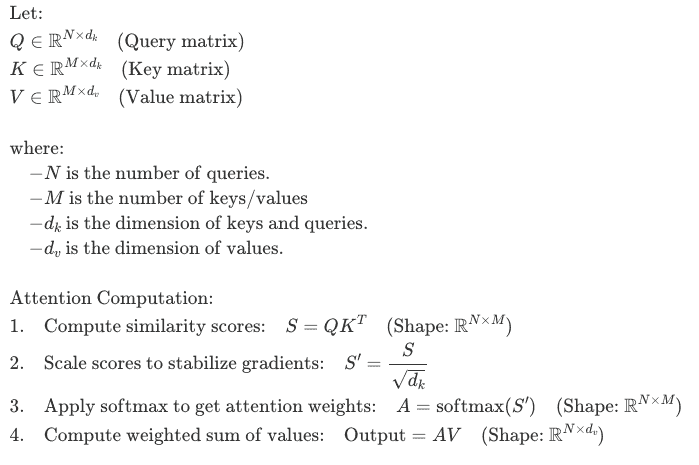

注意力算法。图片由作者提供

如您所见，如果我们不小心，最终会将一个完整的 NxM 注意力矩阵实体化到 GPU HBM 中。这意味着内存需求将随着上下文长度的增加而呈平方增长。

> 如果你想了解更多关于 GPU 内存层次结构和其差异的信息，[我关于 Triton 的前一篇帖子](https://aarunjith.substack.com/p/simplifying-cuda-kernels-with-triton)是一个很好的起点。这在我们继续本帖并实现 triton 中的 flash 注意力内核时也会很有用。[flash 注意力论文](https://arxiv.org/pdf/2205.14135)也对此有一些很好的介绍。

此外，当我们查看执行此算法涉及的步骤及其访问慢速 HBM 的模式时（如后文所述，这可能是瓶颈之一），我们注意到一些事情：

1.  初始时，HBM 中有 Q、K 和 V

1.  我们最初需要从 HBM 中访问 Q 和 K 来计算点积

1.  我们将输出分数写回 HBM

1.  我们再次访问它来执行 softmax，并且对于因果注意力，例如在 LLM 的情况下，我们将在 softmax 之前对此输出进行掩码。结果的全注意力矩阵再次写入 HBM

1.  我们再次访问 HBM 来执行最终的点积，以获取注意力权重和值矩阵，并将输出写回慢速 GPU 内存

我想你已经明白了。我们可以智能地从 HBM 中读取和写入，以避免冗余操作，从而获得一些潜在的好处。这正是原始 Flash Attention 算法的首要动机。

Flash Attention 最初在 2022 年[[2]](https://arxiv.org/pdf/2205.14135)出现，然后在一年后的 2023 年发布了 Flash Attention v2 [[3]](https://arxiv.org/pdf/2307.08691)，这是急需的改进，然后在 2024 年又针对 Nvidia Hopper 和 Blackwell GPU 进行了额外的改进，作为 Flash Attention v3 [[4](https://www.nvidia.com/en-us/data-center/technologies/hopper-architecture/)]。原始的注意力论文指出，注意力操作仍然受限于内存带宽而不是计算能力。（在过去，已经尝试将注意力计算的复杂度从[O(N**2)降低到 O(NlogN)](https://arxiv.org/pdf/2001.04451)并通过近似算法进一步降低）

Flash attention 提出了一种融合内核，它一次性、块状地执行所有上述注意力操作，以获得最终的注意力输出，而不需要在内存中实现完整的 N**2 注意力矩阵，这使得算法显著更快。术语“融合”简单意味着我们在 GPU SRAM 中组合多个操作，然后再进行较慢的 GPU 内存之旅，这使得算法性能更佳。同时提供精确的注意力输出，没有任何近似。

这堂课来自斯坦福 CS139，精彩地展示了我们如何思考精心设计的内存访问模式对算法的影响。如果你还没有看过，我强烈推荐你看看这个。

在 triton 中，在开始深入研究 flash attention <mdspan datatext="el1743623764484" class="mdspan-comment">（反复输入这个名称变得越来越麻烦，所以我们同意</mdspan>称它为 FA，怎么样？）之前，还有其他一些事情我想先解决。

## **指数中的数值稳定性**

以 FP32 数字为例。**float32**（标准 32 位浮点数）使用 1 个符号位，8 个指数位和 23 个尾数位 [[6](https://en.wikipedia.org/wiki/Single-precision_floating-point_format)]。float32 中指数的最大有限基数是 2¹²⁷≈1.7×10³⁸。这意味着当我们查看指数时，e⁸⁸ ≈ 1.65×10³⁸，任何接近 88 的值（尽管实际上会低得多以保持安全）都会使我们陷入麻烦，因为我们很容易溢出。这里有一个由[AllenAI](https://allenai.org/)在他们的[OpenInstruct](https://github.com/allenai/open-instruct)仓库分享的[非常有趣的与 OpenAI o1 的对话](https://chatgpt.com/share/679d0ed9-8f48-8011-926e-e274b15ae8ae)。虽然这是在讨论 RLHF/RL 设置中的 KL 散度计算稳定化，但这些想法在指数方面也完全适用。因此，为了处理注意力中的 softmax 情况，我们采取以下措施：

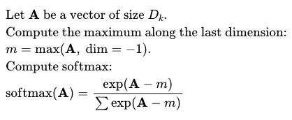

带缩放的 Softmax。图片由作者提供

> TRICK：让我们也观察以下情况，如果你这样做：

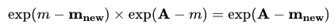

缩放技巧。图片由作者提供

> 然后，你可以重新调整/读取值，而不会影响最终的 softmax 值。当你有一个最大值的初始估计，但这个值可能会在遇到新的一组值时改变时，这非常有用。我知道我知道，请继续听我解释。

**设置场景**

让我们稍微偏离一下矩阵乘法。

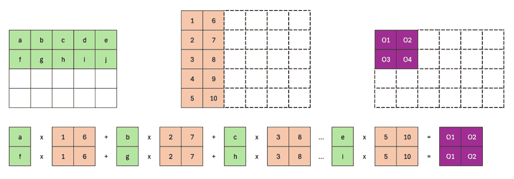

块矩阵乘法。图片由作者提供

这显示了阻塞矩阵乘法的玩具示例，除了我们在 A（绿色）的行和 B（橙色？米色？）的列上只有块。如上图所示，输出 O1、O2、O3 和 O4 是完整的（这些位置不需要更多的计算）。我们只需要使用 B 的剩余列填充初始行中的剩余列。如下所示：

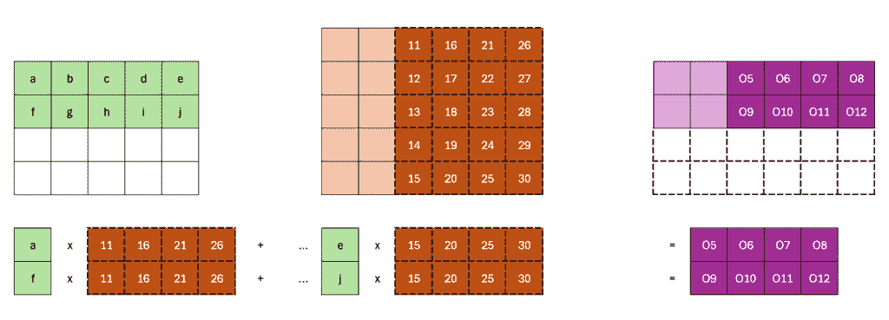

下一个块填充剩余的空间。图片由作者提供

因此，我们可以一次用 B 的一个块列和 A 的一个块行填充输出中的这些位置。

## **连接点**

当我介绍 FA 时，我说我们永远不需要计算完整的注意力矩阵并存储整个矩阵。所以，我们这样做：

1.  使用 Q 的一个块行和 K 的一个块列计算注意力矩阵的一个块。一旦得到部分注意力矩阵，计算一些统计数据并将其保存在内存中。

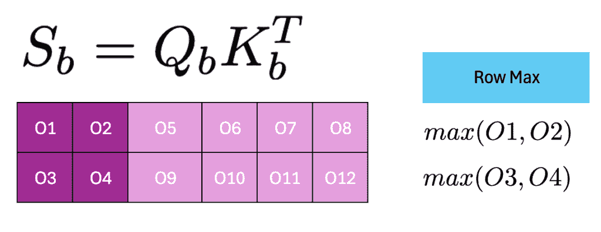

计算块注意力得分 S_b，并计算行最大值。图片由作者提供

我将 O5 到 O12 变成了灰色，因为我们还不知道这些值，因为它们需要来自后续的块。然后我们像下面这样转换 Sb：

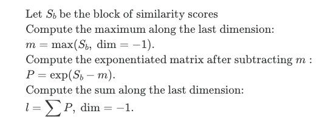

跟踪当前行和行最大值。图片由作者提供

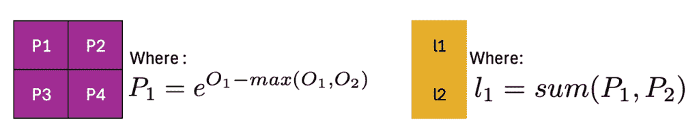

使用缩放技巧的指数。图片由作者提供

现在你已经为部分 softmax 设置好了

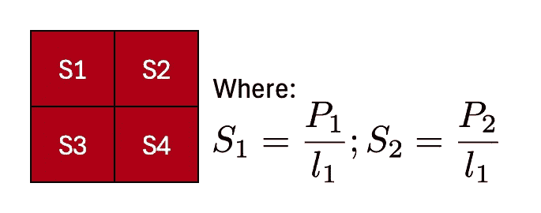

部分 softmax，因为分母仍然是一个部分总和。图片由作者提供

**但是：**

1.  如果真正的最大值在尚未到来的 Oi 中呢？

1.  总和仍然是局部的，所以每次我们看到新的 Pi 时，我们都需要更新这个总和。我们知道如何跟踪总和，但关于将其重新基准到真正的最大值怎么办？

回想一下上面的技巧。我们必须要做的是跟踪每一行遇到的最大的值，并且随着从 Q 的同一组行中看到新的最大值，从 K 的剩余块中迭代更新。

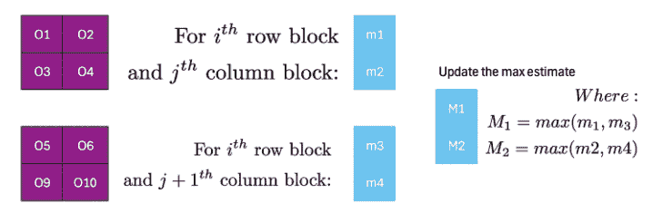

两个连续块及其行最大值操作。图片由作者提供

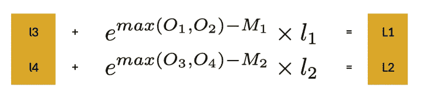

使用缩放更新我们当前总和的估计

我们仍然不想将我们的部分 softmax 矩阵写入 HBM。我们将其保留到下一步。

## **最终的点积**

我们注意力计算的最后一步是与 V 的点积。首先，我们会在 HBM 中初始化一个全 0 的矩阵作为我们的输出，其形状为 NxD。其中 N 是查询的数量，如上所述。我们使用与 K 相同的块大小来初始化 V，但我们可以像下面这样按行应用它（下标只是表示这只是一个块，而不是整个矩阵）

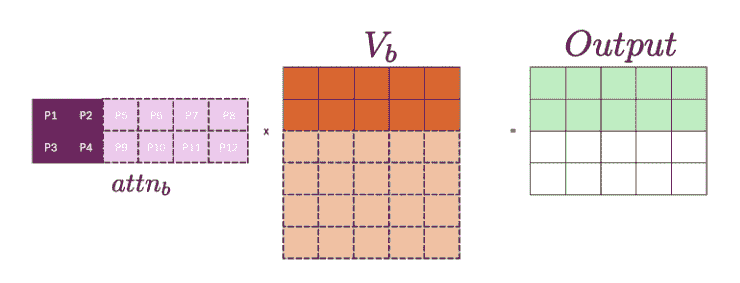

创建一个注意力得分块，生成部分输出。图源：作者

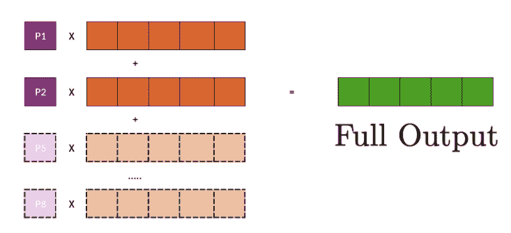

而完整的输出将需要所有这些点积的总和。其中一些将由后续的块填充。图源：作者

注意我们如何需要所有块的关注度得分来获取最终产品。但如果我们像计算实际的 Ls 那样计算局部得分并`累积`它，我们可以在处理完给定行块（Q[b]）的所有列块（K[b]）后形成完整的输出。

## **整合所有内容**

让我们把所有这些想法放在一起，形成最终的算法

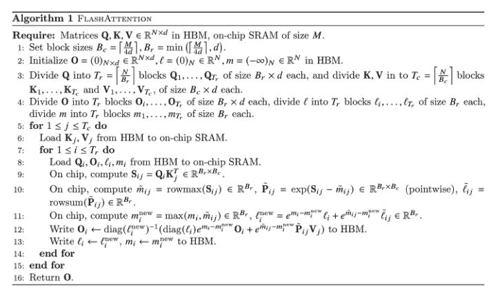

Flash Attention V1 算法。来源：*Tri Dao 等人 [[2](https://arxiv.org/pdf/2211.17192)]*

为了理解这个符号，_[ij]表示它是给定列和行块的局部值，而 _i 表示它是全局输出行和查询块。我们还没有解释的部分是 O[i]的最终更新。这就是我们使用上面所有想法来获取正确缩放的地方。

> 整个代码可以在[这里](https://gist.github.com/aarunjith/adba4c4f67f9392d6e5789f7e92858b0)找到。

让我们看看这些初始化在 torch 中是什么样的：

```py
def flash_attn_v1(Q, K, V, Br, Bc):
  """Flash Attention V1"""
  B, N, D = Q.shape
  M = K.shape[1]
  Nr = int(np.ceil(N/Br))
  Nc = int(np.ceil(N/Bc))

  Q = Q.to('cuda')
  K = K.to('cuda')
  V = V.to('cuda')

  batch_stride = Q.stride(0)

  O = torch.zeros_like(Q).to('cuda')
  lis = torch.zeros((B, Nr, int(Br)), dtype=torch.float32).to('cuda')
  mis = torch.ones((B, Nr, int(Br)), dtype=torch.float32).to('cuda')*-torch.inf

  grid = (B, )
  flash_attn_v1_kernelgrid,
      K.stride(1),
      V.stride(1),
      lis, mis,
      O,
      O.stride(1),
  )
  return O
```

> 如果你不确定启动网格，请查看[我的 Triton 介绍](https://substack.com/home/post/p-159116483)

仔细看看我们如何初始化 Ls 和 Ms。我们为每个输出/查询的行块保留一个，每个大小为 B[r]。总共有 N[r]个这样的块。

在上面的例子中，我简单地使用了 B[r] = 2 和 B[c] = 2。但在上面的代码中，初始化是基于设备容量的。我包括了针对 T4 GPU 的计算。对于任何其他 GPU，我们需要获取 SRAM 容量并相应地调整这些数字。现在，对于实际的内核实现：

```py
# Flash Attention V1
import triton
import triton.language as tl
import torch
import numpy as np
import pdb

@triton.jit
def flash_attn_v1_kernel(
    Q, K, V,
    N: tl.constexpr, M: tl.constexpr, D: tl.constexpr,
    Br: tl.constexpr,
    Bc: tl.constexpr,
    Nr: tl.constexpr,
    Nc: tl.constexpr,
    batch_stride: tl.constexpr,
    q_rstride: tl.constexpr,
    k_rstride: tl.constexpr, 
    v_rstride: tl.constexpr,
    lis, mis,
    O,
    o_rstride: tl.constexpr):

    """Flash Attention V1 kernel"""

    pid = tl.program_id(0)

    for j in range(Nc):
        k_offset = ((tl.arange(0, Bc) + j*Bc) * k_rstride)[:, None] + (tl.arange(0, D))[None, :] + pid * M * D
        # Using k_rstride and v_rstride as we are looking at the entire row at once, for each k v block 
        v_offset = ((tl.arange(0, Bc) + j*Bc) * v_rstride)[:, None] + (tl.arange(0, D))[None, :] + pid * M * D
        k_mask = k_offset < (pid + 1) * M*D
        v_mask = v_offset < (pid + 1) * M*D
        k_load = tl.load(K + k_offset, mask=k_mask, other=0)
        v_load = tl.load(V + v_offset, mask=v_mask, other=0)
        for i in range(Nr):
            q_offset = ((tl.arange(0, Br) + i*Br) * q_rstride)[:, None] + (tl.arange(0, D))[None, :] + pid * N * D
            q_mask = q_offset < (pid + 1) * N*D
            q_load = tl.load(Q + q_offset, mask=q_mask, other=0)
            # Compute attention
            s_ij = tl.dot(q_load, tl.trans(k_load))
            m_ij = tl.max(s_ij, axis=1, keep_dims=True)
            p_ij = tl.exp(s_ij - m_ij)
            l_ij = tl.sum(p_ij, axis=1, keep_dims=True)

            ml_offset = tl.arange(0, Br) + Br * i + pid * Nr * Br
            m = tl.load(mis + ml_offset)[:, None]
            l = tl.load(lis + ml_offset)[:, None]

            m_new = tl.where(m < m_ij, m_ij, m)

            l_new = tl.exp(m - m_new) * l + tl.exp(m_ij - m_new) * l_ij

            o_ij = tl.dot(p_ij, v_load)

            output_offset = ((tl.arange(0, Br) + i*Br) * o_rstride)[:, None] + (tl.arange(0, D))[None, :] + pid * N * D
            output_mask = output_offset < (pid + 1) * N*D
            o_current = tl.load(O + output_offset, mask=output_mask)

            o_new = (1/l_new) * (l * tl.exp(m - m_new) * o_current + tl.exp(m_ij - m_new) * o_ij)

            tl.store(O + output_offset, o_new, mask=output_mask)
            tl.store(mis + ml_offset, tl.reshape(m_new, (Br,)))
            tl.store(lis + ml_offset, tl.reshape(l_new, (Br,)))
```

让我们理解这里发生了什么：

1.  为批处理中的每个 NxD 矩阵创建一个内核。实际上，我们还会有一个额外的维度来并行化，即头维度。但为了理解实现，我认为这已经足够了。

1.  在每个内核中，我们执行以下操作：

    1.  对于 K 和 V 中的每一列块，我们将矩阵的相关部分（B[c] x D）加载到 GPU SRAM 中（当前总 SRAM 使用量 = 2B[c]D）。这部分将保留在 SRAM 中，直到我们处理完所有行块。

    1.  对于 Q 的每一行块，我们也将该块加载到 SRAM 中（当前总 SRAM 使用量 = 2B[c]D + BrD）

    1.  在芯片上，我们计算点积（s[ij]），计算局部行最大值（m[ij]），指数（p[ij]）和指数和（l[ij]）

    1.  我们加载第 i 行块的运行统计。两个大小为 B[r] x 1 的向量，表示当前的全球行最大值（m[i]）和指数和（l[i]）。（当前 SRAM 使用：2B[c]D + B[r]D + 2B[r]）

    1.  我们得到了全局 m[i] 和 l[i] 的新估计。

    1.  我们加载这个 Q 块的输出部分，并使用新的运行统计和指数技巧进行更新，然后将它写回 HBM。（当前 SRAM 使用：2B[c]D + 2B[r]D + 2B[r]）

    1.  我们也将更新的运行统计写入 HBM。

1.  对于任何大小的矩阵，即任何上下文长度，我们一次永远不会实例化完整的注意力矩阵，而只是其中的一部分。

1.  我们成功地将所有操作融合到一个单独的内核中，大大减少了 HBM 访问。

最终 SRAM 使用量仍然是 4BD + 2B，其中 B 初始计算为 M/4d，M 是 SRAM 容量。不确定是否遗漏了什么。如果您知道为什么是这样，请评论！

## **块稀疏注意力 V2 和 V3**

我会尽量简短，因为这些版本保持了核心思想，但找到了更好的方法来做同样的事情。

对于块稀疏注意力，

1.  考虑到我们为每个块有掩码，就像因果注意力的情况一样。如果对于给定的块，掩码全部设置为零，那么我们可以简单地跳过整个块，实际上什么都不计算。节省 FLOPs。这是主要收益的地方。为了将这一点放在正确的背景下，在 BERT 预训练的情况下，算法在当时表现最好的训练设置上提高了 15%，而对于 GPT-2，我们获得了 hugo face 训练实现的 3 倍，以及 Megatron 设置的 2 倍左右。

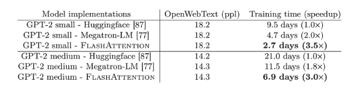

自回归模型的性能提升，其中我们有一个稀疏掩码。来源：*Tri Dao 等人 [[2](https://arxiv.org/pdf/2211.17192)]*

2. 您实际上可以在 GPT2 中以极短的时间获得相同的表现，实际上可以从训练运行中削减几天，这真是太棒了！

在 V2 中：

1.  注意，目前我们只能在批量和头维度上进行并行化。但如果你只是翻转顺序来查看给定行块的列块，那么我们会得到以下优势：

    1.  每个行块都变得非常并行。您可以通过查看上面的插图来了解这一点。您需要所有列块来完全形成给定行块的注意力输出。如果您并行运行所有列块，您将遇到尝试同时更新输出相同行的竞争条件。但如果是反过来，就不会这样。尽管 triton 中有原子加法运算符可以帮助，但它们可能潜在地让我们退步。

    1.  我们可以避免访问 HBM 来获取全局 Ms 和 Ls。我们可以为每个内核在芯片上初始化一个。

    1.  此外，我们不必将所有输出更新项与新估计的 L 进行缩放。我们只需计算而不除以 L，在所有列块结束时，只需用最新的 L 估计值除以输出，再次节省一些 FLOPs！

1.  大部分改进也来自于反向内核。我在这里省略了所有的反向内核。但它们是尝试实现的一个有趣练习，尽管它们要复杂得多。

这里有一些基准测试：

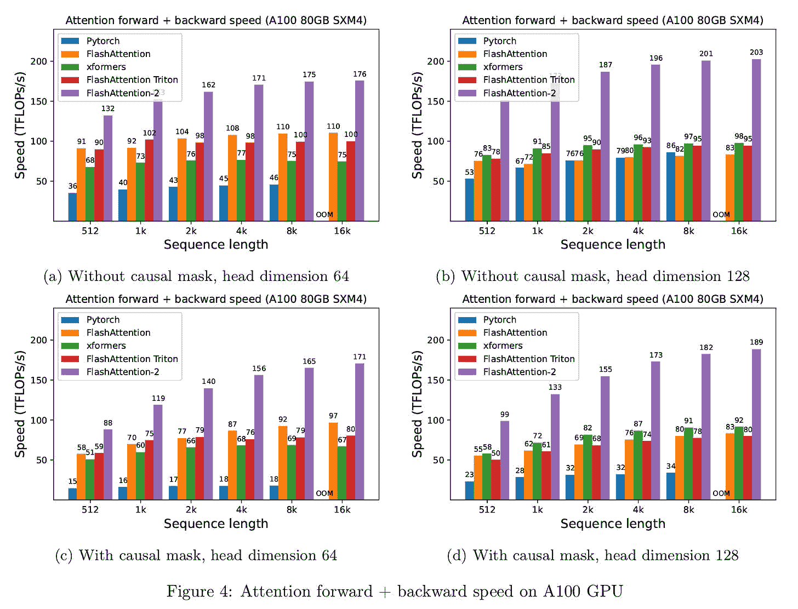(https://substackcdn.com/image/fetch/f_auto,q_auto:good,fl_progressive:steep/https%3A%2F%2Fsubstack-post-media.s3.amazonaws.com%2Fpublic%2Fimages%2Ff4fe5982-f319-4aaf-891f-da96490a1b8a_1788x1366.png)

FA v2 与现有注意力算法的性能基准。来源：**Tri Dao 等人 [[3](https://arxiv.org/pdf/2307.08691)]**

这些内核的实际实现需要考虑我们在现实世界中遇到的种种细微差别。我尽量保持简单。但你可以在这里[查看它们](https://github.com/Dao-AILab/flash-attention/tree/main)。

最近在 V3 版本中：

1.  新一代 GPU，特别是 Hopper 和 Blackwell GPU，具有低精度模式（Hopper 中的 FP8 和 Blackwell 中的 GP4），这可以在相同的功率和芯片面积下将吞吐量翻倍和四倍，以及更专业的 GEMM（通用矩阵乘法）内核，这是算法的前一个版本未能充分利用的。这是因为有许多非 GEMM 操作，如 softmax，这降低了这些专业 GPU 内核的利用率。

1.  FA v1 和 v2 实质上是同步的。回想一下，在 v2 的描述中我提到，当列块尝试写入相同的输出指针时，或者当我们必须一步一步地使用前一步的输出时，我们会受到限制。然而，这些现代 GPU 可以利用特殊的指令来打破这种同步性。

> 我们将 softmax 中涉及的低吞吐量非 GEMM 操作，如浮点数乘加和指数运算，与 GEMM 的异步 WGMMA 指令重叠。作为这部分工作的一部分，我们重新设计了 FlashAttention-2 算法，以绕过 softmax 和 GEMM 之间的某些顺序依赖关系。例如，在我们的 2 阶段版本中，当 softmax 在分数矩阵的一块上执行时，WGMMA 在异步代理中执行，以计算下一块。
> 
> Flash Attention v3，Shah 等人

1.  他们还调整了算法以针对这些新设备上的专用低精度 Tensor 核，显著提高了 FLOPs。

更多基准测试：

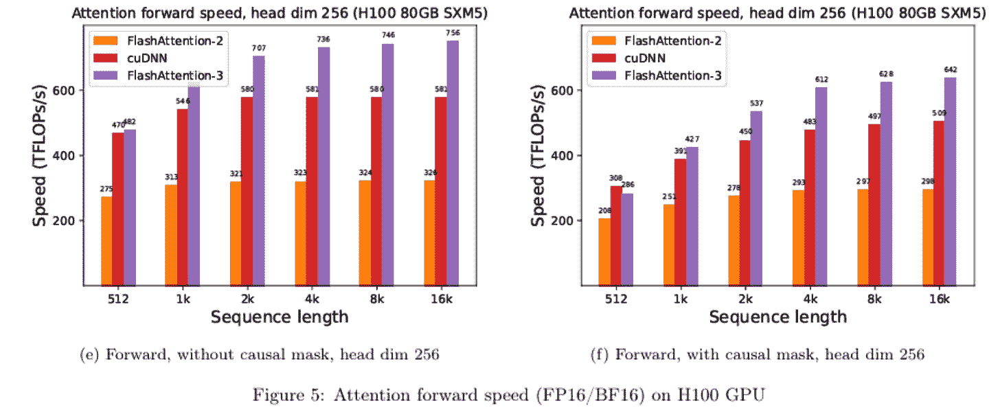(https://substackcdn.com/image/fetch/f_auto,q_auto:good,fl_progressive:steep/https%3A%2F%2Fsubstack-post-media.s3.amazonaws.com%2Fpublic%2Fimages%2F12fc597c-0f7a-46c9-b4f3-19a125264caa_1844x760.png)

FA v3 相比 v2 的性能提升。来源：*Shah 等人 [[5](https://arxiv.org/abs/2407.08608)]*

## **结论**

在他们的工作中有很多值得称赞的地方。由于细节的低水平，这个技术技能水平的门槛往往很高。但希望像 Triton 这样的工具能够改变游戏规则，让更多的人参与到这个领域！未来是光明的。

## 参考文献

[1] [Qwen 2.5-7B-Instruct-1M Huggingface 模型页面](https://huggingface.co/Qwen/Qwen2.5-7B-Instruct-1M)

[2] *Tri Dao, Daniel Y. Fu, Stefano Ermon, Atri Rudra, and Christopher Re, *[FlashAttention: 带有 IO 感知的快速且内存高效的精确注意力机制](https://arxiv.org/pdf/2205.14135)*

[3] Tri Dao, [*FlashAttention-2:* 更快的注意力机制，更好的并行性和工作分区*](https://arxiv.org/pdf/2307.08691)

[4] [NVIDIA Hopper 架构页面](https://www.nvidia.com/en-us/data-center/technologies/hopper-architecture/)

[5] [Jay Shah](https://arxiv.org/search/cs?searchtype=author&query=Shah,+J), [Ganesh Bikshandi](https://arxiv.org/search/cs?searchtype=author&query=Bikshandi,+G), [Ying Zhang](https://arxiv.org/search/cs?searchtype=author&query=Zhang,+Y), [Vijay Thakkar](https://arxiv.org/search/cs?searchtype=author&query=Thakkar,+V), [Pradeep Ramani](https://arxiv.org/search/cs?searchtype=author&query=Ramani,+P), [Tri Dao](https://arxiv.org/search/cs?searchtype=author&query=Dao,+T), [FlashAttention-3: 基于异步和低精度的高效且精确的注意力机制](https://arxiv.org/abs/2407.08608)

[6] [单精度浮点格式，维基百科](https://en.wikipedia.org/wiki/Single-precision_floating-point_format)
