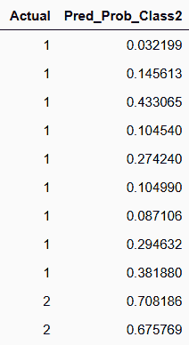
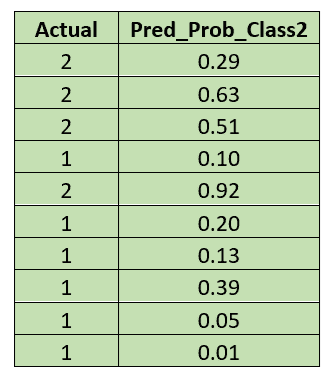
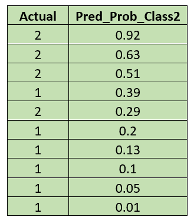
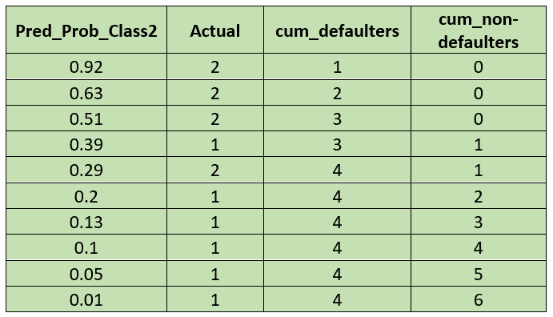
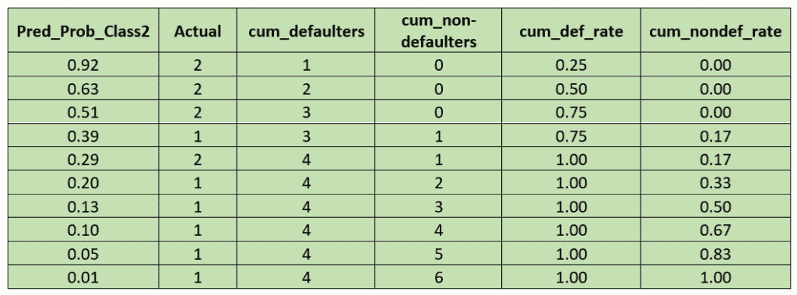
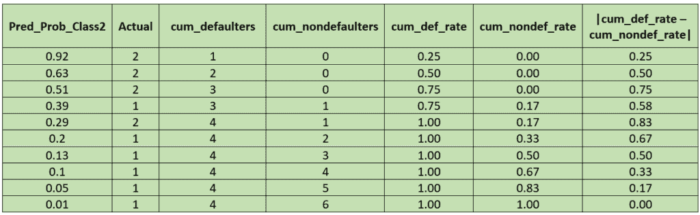
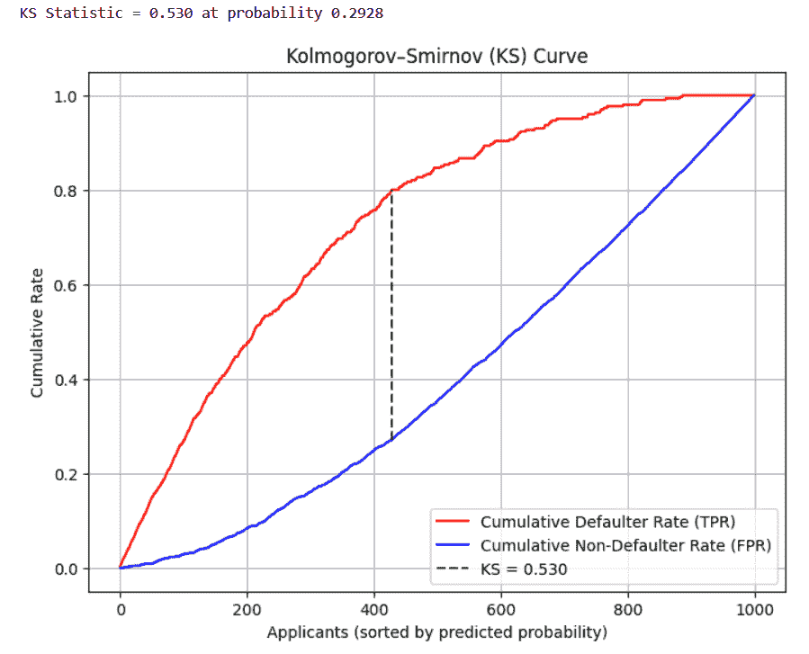

# 科尔莫哥洛夫-斯米尔诺夫统计量，解释：在信用风险建模中衡量模型能力

> 原文：[`towardsdatascience.com/kolmogorov-smirnov-statistic-explained-measuring-model-power-in-credit-risk-modeling/`](https://towardsdatascience.com/kolmogorov-smirnov-statistic-explained-measuring-model-power-in-credit-risk-modeling/)

<mdspan datatext="el1758574447927" class="mdspan-comment">这些</mdspan>天，人们比以往任何时候都更多地贷款。对于任何想要建造自己的房子的人来说，有房屋贷款可用，如果你拥有房产，你可以获得房产贷款。还有农业贷款、教育贷款、商业贷款、黄金贷款等等。

此外，为了购买像电视、冰箱、家具和手机这样的物品，我们还有分期付款选项。

## 但每个人的贷款申请都能被批准吗？

银行不会给每个申请贷款的人发放贷款；他们有一套流程来批准贷款。

我们知道机器学习和数据科学现在被广泛应用于各个行业，银行也利用它们。

当客户申请贷款时，银行需要知道客户按时偿还的可能性。

为了这个目的，银行使用预测模型，主要基于逻辑回归或其他机器学习方法，

我们已经知道，通过应用这些方法，每个申请人都会被分配一个概率。

这是一个分类模型，我们需要对违约者和非违约者进行分类。

**违约者**：未能偿还贷款（逾期付款或完全停止付款）的客户。

**非违约者**：按时偿还贷款的客户。

我们已经[讨论了准确性和 ROC-AUC](https://towardsdatascience.com/roc-auc-explained-a-beginners-guide-to-evaluating-classification-models/)来评估分类模型。

在这篇文章中，我们将讨论**科尔莫哥洛夫-斯米尔诺夫统计量（KS 统计量）**，它用于评估分类模型，尤其是在银行领域。

为了理解 KS 统计量，我们将使用德国信贷数据集。

这个数据集包含了关于 1000 名贷款申请人的信息，由 20 个特征描述，例如账户状态、贷款期限、信贷金额、就业、住房和个人状况等。

目标变量表示申请人是否为非违约者（用 1 表示）或违约者（用 2 表示）。

你可以在[这里](https://archive.ics.uci.edu/dataset/144/statlog+german+credit+data)找到关于数据集的信息。

现在我们需要构建一个分类模型来对申请人进行分类。由于这是一个二元分类问题，我们将在这个数据集上应用逻辑回归。

**代码：**

```py
import pandas as pd
from sklearn.linear_model import LogisticRegression
from sklearn.model_selection import train_test_split

# Load dataset
file_path = "C:/german.data"
data = pd.read_csv(file_path, sep=" ", header=None)

# Rename columns
columns = [f"col_{i}" for i in range(1, 21)] + ["target"]
data.columns = columns

# Features and target
X = pd.get_dummies(data.drop(columns=["target"]), drop_first=True)
y = data["target"]   # keep as 1 and 2

# Train-test split
X_train, X_test, y_train, y_test = train_test_split(
    X, y, test_size=0.3, random_state=42, stratify=y
)

# Train logistic regression
model = LogisticRegression(max_iter=10000)
model.fit(X_train, y_train)

# Predicted probabilities
y_pred_proba = model.predict_proba(X_test)

# Results DataFrame
results = pd.DataFrame({
    "Actual": y_test.values,
    "Pred_Prob_Class2": y_pred_proba[:, 1]
})

print(results.head())
```

我们已经知道，当我们应用逻辑回归时，我们会得到预测概率。



图片由作者提供

现在让我们来了解 KS 统计量的计算方法，考虑从这个输出中选取的 10 个点的样本。



图片由作者提供

这里最高的预测概率为 0.92，这意味着该申请人违约的概率为 92%。

现在我们来进行 KS 统计量的计算。

首先，我们将申请人按其预测概率的降序排列，以便风险较高的申请人位于顶部。



图片由作者提供

**我们已经知道‘1’代表非违约者，‘2’代表违约者。**

在下一步中，我们将计算每个步骤中违约者和非违约者的累计计数。



图片由作者提供

在下一步中，我们将违约者和非违约者的累计计数转换为累计率。

我们将累计违约者数除以违约者总数，将累计非违约者数除以非违约者总数。



图片由作者提供

接下来，我们计算累计违约率与累计非违约率之间的绝对差值。



图片由作者提供

**累计违约率与累计非违约率之间的最大差值为 0.83，这是该样本的 KS 统计量。**

在这里，KS 统计量为 0.83，发生的概率为 0.29。

这意味着在该阈值下，模型比非违约者更有效地捕获违约者 83%。

* * *

在这里，我们可以观察到：

累计违约率 = 真正例率（到目前为止我们捕获了多少实际违约者）。

累计非违约率 = 假正例率（有多少非违约者被错误地捕获为违约者）。

但是，因为我们还没有固定任何阈值，我们如何得到真正例率和假正例率？

让我们看看累计率是如何等于 TPR 和 FPR 的。

首先，我们将每个概率视为一个阈值，并计算 TPR 和 FPR。

\[

\begin{aligned}

\mathbf{在阈值 0.92 时：} & \\[4pt]

TP &= 1,\quad FN = 3,\quad FP = 0,\quad TN = 6\\[6pt]

TPR &= \tfrac{1}{4} = 0.25\\[6pt]

FPR &= \tfrac{0}{6} = 0\\[6pt]

\Rightarrow (\mathrm{FPR},\,\mathrm{TPR}) &= (0,\,0.25)

\end{aligned}

\]

\[

\begin{aligned}

\mathbf{在阈值 0.63 时：} & \\[4pt]

TP &= 2,\quad FN = 2,\quad FP = 0,\quad TN = 6\\[6pt]

TPR &= \tfrac{2}{4} = 0.50\\[6pt]

FPR &= \tfrac{0}{6} = 0\\[6pt]

\Rightarrow (\mathrm{FPR},\,\mathrm{TPR}) &= (0,\,0.50)

\end{aligned}

\] \[

\begin{aligned}

\mathbf{在阈值 0.51 时：} & \\[4pt]

TP &= 3,\quad FN = 1,\quad FP = 0,\quad TN = 6\\[6pt]

TPR &= \tfrac{3}{4} = 0.75\\[6pt]

FPR &= \tfrac{0}{6} = 0\\[6pt]

\Rightarrow (\mathrm{FPR},\,\mathrm{TPR}) &= (0,\,0.75)

\end{aligned}

\] \[

\begin{aligned}

\mathbf{在阈值 0.39 时：} & \\[4pt]

TP &= 3,\quad FN = 1,\quad FP = 1,\quad TN = 5\\[6pt]

TPR &= \tfrac{3}{4} = 0.75\\[6pt]

FPR &= \tfrac{1}{6} \approx 0.17\\[6pt]

\Rightarrow (\mathrm{FPR},\,\mathrm{TPR}) &= (0.17,\,0.75)

\end{aligned}

\] \[

\begin{aligned}

\mathbf{在阈值 0.29 时：} & \\[4pt]

TP &= 4,\quad FN = 0,\quad FP = 1,\quad TN = 5\\[6pt]

TPR &= \tfrac{4}{4} = 1.00\\[6pt]

FPR &= \tfrac{1}{6} \approx 0.17\\[6pt]

\Rightarrow (\mathrm{FPR},\,\mathrm{TPR}) &= (0.17,\,1.00)

\end{aligned}

\] \[

\begin{aligned}

\mathbf{在阈值 0.20 时：} & \\[4pt]

TP &= 4,\quad FN = 0,\quad FP = 2,\quad TN = 4\\[6pt]

TPR &= \tfrac{4}{4} = 1.00\\[6pt]

FPR &= \tfrac{2}{6} \approx 0.33\\[6pt]

\Rightarrow (\mathrm{FPR},\,\mathrm{TPR}) &= (0.33,\,1.00)

\end{aligned}

\] \[

\begin{aligned}

\mathbf{在阈值 0.13 时：} & \\[4pt]

TP &= 4,\quad FN = 0,\quad FP = 3,\quad TN = 3\\[6pt]

TPR &= \tfrac{4}{4} = 1.00\\[6pt]

FPR &= \tfrac{3}{6} = 0.50\\[6pt]

\Rightarrow (\mathrm{FPR},\,\mathrm{TPR}) &= (0.50,\,1.00)

\end{aligned}

\] \[

\begin{aligned}

\mathbf{在阈值 0.10 时：} & \\[4pt]

TP &= 4,\quad FN = 0,\quad FP = 4,\quad TN = 2\\[6pt]

TPR &= \tfrac{4}{4} = 1.00\\[6pt]

FPR &= \tfrac{4}{6} \approx 0.67\\[6pt]

\Rightarrow (\mathrm{FPR},\,\mathrm{TPR}) &= (0.67,\,1.00)

\end{aligned}

\] \[

\begin{aligned}

\mathbf{在阈值 0.05 时：} & \\[4pt]

TP &= 4,\quad FN = 0,\quad FP = 5,\quad TN = 1\\[6pt]

TPR &= \tfrac{4}{4} = 1.00\\[6pt]

FPR &= \tfrac{5}{6} \approx 0.83\\[6pt]

\Rightarrow (\mathrm{FPR},\,\mathrm{TPR}) &= (0.83,\,1.00)

\end{aligned}

\] \[

\begin{aligned}

\mathbf{在阈值 0.01 时：} & \\[4pt]

TP &= 4,\quad FN = 0,\quad FP = 6,\quad TN = 0\\[6pt]

TPR &= \tfrac{4}{4} = 1.00\\[6pt]

FPR &= \tfrac{6}{6} = 1.00\\[6pt]

\Rightarrow (\mathrm{FPR},\,\mathrm{TPR}) &= (1.00,\,1.00)

\end{aligned}

\]

**从上述计算中，我们可以看到累积违约者比率对应于真正率（TPR），而累积非违约者比率对应于假正率（FPR）。**

**在计算累积违约率和累积非违约率时，每一行代表一个阈值，并且计算到该行为止的比率。**

**在这里我们可以观察到 KS 统计量 = Max (|TPR – FPR|)**

* * *

现在让我们计算整个数据集的 KS 统计量。

**代码：**

```py
# Create DataFrame with actual and predicted probs
results = pd.DataFrame({
    "Actual": y.values,
    "Pred_Prob_Class2": y_pred_proba
})

# Mark defaulters (2) and non-defaulters (1)
results["is_defaulter"] = (results["Actual"] == 2).astype(int)
results["is_nondefaulter"] = 1 - results["is_defaulter"]

# Sort by predicted probability
results = results.sort_values("Pred_Prob_Class2", ascending=False).reset_index(drop=True)

# Totals
total_defaulters = results["is_defaulter"].sum()
total_nondefaulters = results["is_nondefaulter"].sum()

# Cumulative counts and rates
results["cum_defaulters"] = results["is_defaulter"].cumsum()
results["cum_nondefaulters"] = results["is_nondefaulter"].cumsum()
results["cum_def_rate"] = results["cum_defaulters"] / total_defaulters
results["cum_nondef_rate"] = results["cum_nondefaulters"] / total_nondefaulters

# KS statistic
results["KS"] = (results["cum_def_rate"] - results["cum_nondef_rate"]).abs()
ks_value = results["KS"].max()
ks_index = results["KS"].idxmax()

print(f"KS Statistic = {ks_value:.3f} at probability {results.loc[ks_index, 'Pred_Prob_Class2']:.4f}")

# Plot KS curve
plt.figure(figsize=(8,6))
plt.plot(results.index, results["cum_def_rate"], label="Cumulative Defaulter Rate (TPR)", color="red")
plt.plot(results.index, results["cum_nondef_rate"], label="Cumulative Non-Defaulter Rate (FPR)", color="blue")

# Highlight KS point
plt.vlines(x=ks_index,
           ymin=results.loc[ks_index, "cum_nondef_rate"],
           ymax=results.loc[ks_index, "cum_def_rate"],
           colors="green", linestyles="--", label=f"KS = {ks_value:.3f}")

plt.xlabel("Applicants (sorted by predicted probability)")
plt.ylabel("Cumulative Rate")
plt.title("Kolmogorov–Smirnov (KS) Curve")
plt.legend(loc="lower right")
plt.grid(True)
plt.show() 
```

**图表：**



作者图片

在概率为 0.2928 时，最大差距为 0.530。

* * *

既然我们已经了解了如何计算 KS 统计量，让我们讨论这个统计量的意义。

这里我们构建了一个分类模型，并使用 KS 统计量对其进行评估，但我们还有其他分类指标，如准确率、ROC-AUC 等。

我们已经知道准确率是针对一个特定阈值，并且它会根据阈值的变化而变化。

ROC-AUC 给出一个数值，表示模型的总体排序能力。

但为什么 KS 统计量在银行中会被使用？

KS 统计量给出一个单一数值，它表示违约者和非违约者累积分布之间的最大差距。

让我们回到我们的样本数据。

我们在概率为 0.29 时得到了 KS 统计量 0.83。

我们已经讨论过每一行充当一个阈值。

那么，在 0.29 时发生了什么？

阈值为 0.29 意味着概率大于或等于 0.29 的将被标记为违约者。

在 0.29 时，前 5 行被标记为违约者。在这五个人中，有四个是实际违约者，有一个人被错误地预测为违约者。

这里真正例为 4，假正例为 1。

剩余的 5 行将被预测为非违约者。

在这一点上，模型已经捕捉到了四个违约者和一个被错误标记为违约者的非违约者。

在这里，TPR（真正例率）达到最大值 1，FPR（假正例率）为 0.17。

因此，KS 统计量 = 1 - 0.17 = 0.83。

如果我们进一步计算其他概率，就像我们之前做的那样，我们可以观察到 TPR 不会改变，但 FPR 会增加，这会导致将更多非违约者标记为违约者。

这减少了两组之间的差距。

在这里我们可以这样说，在 0.29 时，模型拒绝了所有违约者，并拒绝了 17%的非违约者（根据样本数据），并批准了 83%的违约者。

***

## 银行是否根据 KS 统计量来决定阈值？

虽然 KS 统计量显示了两组之间的最大差距，但银行不会根据这个统计量来决定阈值。

KS 统计量用于验证模型强度，而实际阈值是根据风险、盈利能力和监管指南来决定的。

如果 KS 值低于 20，则被视为弱模型。

如果 KS 值在 20-40 之间，则被视为可接受。

如果 KS 值在 50-70 之间，则被视为良好模型。

***

**数据集**

本博客中使用的数据集是[德国信用数据集](https://archive.ics.uci.edu/dataset/144/statlog+german+credit+data)，该数据集可在 UCI 机器学习库上公开获取。它是在[Creative Commons Attribution 4.0 International (CC BY 4.0)许可](https://creativecommons.org/licenses/by/4.0/legalcode)下提供的。这意味着它可以自由使用和共享，只要适当注明出处。

***

希望这篇博客文章已经让您对 Kolmogorov-Smirnov 统计有了基本的了解。我很乐意听听您的想法。

如果您还没有阅读我关于机器学习和金融背景下[基尼系数](https://towardsdatascience.com/beyond-roc-auc-and-ks-gini-coefficient-explained-simply/)的最新博客文章，您可以在这里查看。

如果您想阅读更多我的作品，您也可以在[Medium](https://medium.com/@dasarinikhil076)和[LinkedIn](https://www.linkedin.com/in/nikhildasari-dataanalyst/)上找到。

感谢阅读！
