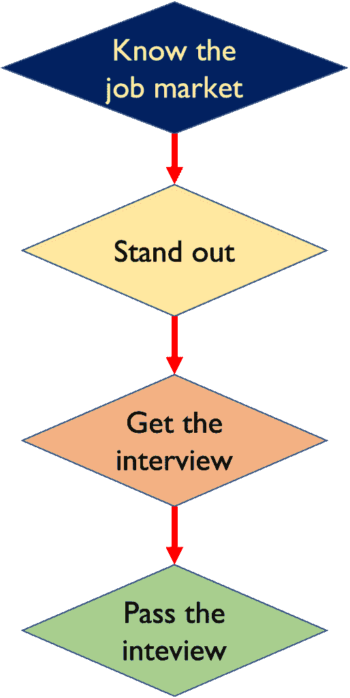
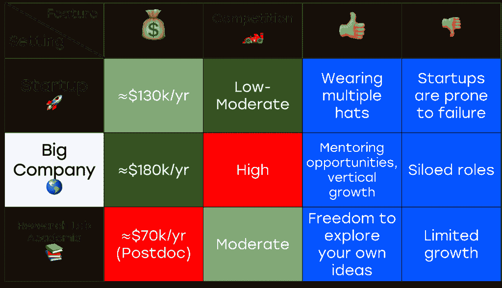
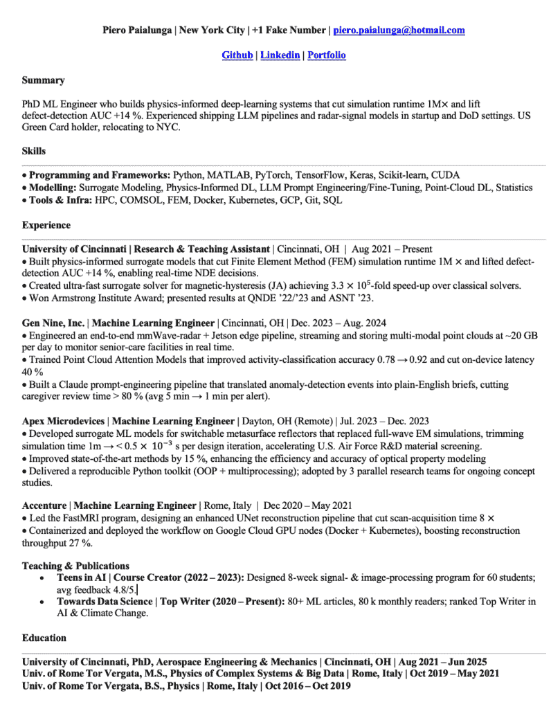
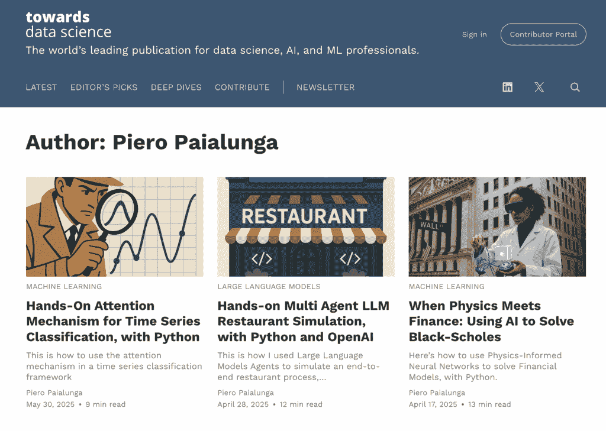
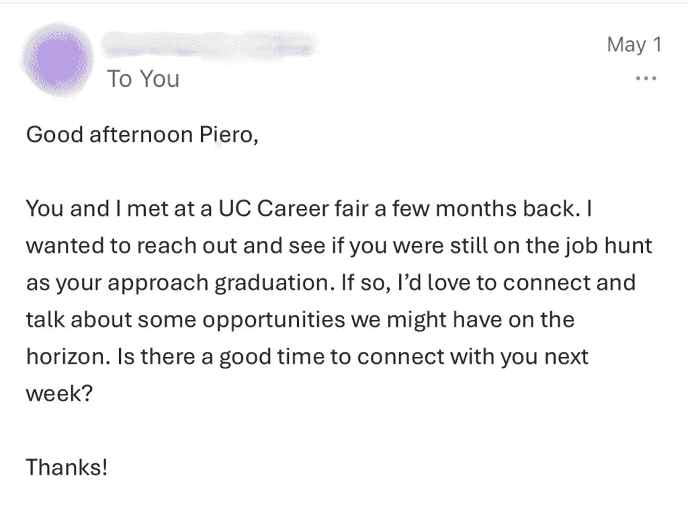

# 首次获得机器学习工作：初创公司 vs 大型科技公司 vs 学术界

> 原文：[`towardsdatascience.com/landing-your-first-machine-learning-job-startup-vs-big-tech-vs-academia/`](https://towardsdatascience.com/landing-your-first-machine-learning-job-startup-vs-big-tech-vs-academia/)
> 
> 这份指南是为**早期机器学习从业者**准备的，他们刚刚从大学毕业，现在正在寻找机器学习领域的全职工作。这里分享的大多数经验来自**美国**的公司和大学。请记住，这篇博客文章是受我的**个人经历**启发的，所以并不是所有内容都适用于你的具体情况。使用你最好的判断力并享受阅读。 :)

<mdspan datatext="el1748978718269" class="mdspan-comment">在 2021 年</mdspan>，我刚刚在罗马大学完成了复杂系统与大数据物理学的硕士学位，并以满分毕业。我的硕士学习进展相当顺利，在学业期间，我完成了两次实习和许多实际机器学习项目。我还用 1.5 年的时间完成了硕士学位，而不是通常的 2 年。*我感到自信。我真心相信人们会敲我的门。*我认为我的硕士学位是一个明确的迹象，表明我有能力工作和成功。结果证明，我不仅“错了”，而且**大错特错**。

不幸的是，能够“推销”你的技能并通过招聘流程本身也是一种技能。在我硕士毕业后的一年里，我不得不学习一套软技能和技术，这些技能并没有在我的大学课程中教授，但它们对于找到工作至关重要。特别是，我了解到在**研究实验室**/**大学**找工作与在**初创公司**找工作完全不同，而在初创公司找工作与在**大型科技公司**找工作也完全不同。

在完成我的博士学位后，我经历了几个招聘流程，最终收到了来自三个非常不同的地方的**工作邀请**：一家**初创公司**、一家**研究实验室**和一家**大型科技公司**。引起注意、通过面试并获得这些工作邀请并不容易；这是我在过程中犯下的几个错误和做出的几个好选择的结果。这篇文章旨在分享我的经验，以便早期机器学习从业者无论选择哪条道路都能在求职过程中脱颖而出。在继续之前，我想明确两点：

1.  这篇文章只是**我的经验**。虽然我相信分享它可能对很多人有帮助，但请考虑哪些适用于你，并使用你最好的判断力。

1.  这篇文章不是“**尽力而为，做你自己**”类型的内容。它旨在提供一个无废话、无炒作的**具体**指南，说明在机器学习职位求职过程中应该做什么才能成功。

为了获得你的机器学习工作，你需要遵循 4 个具体的步骤：

作者生成图像

在接下来的章节中，我将逐一分解这四个步骤，以便你能够清楚地了解如何处理过程的每个阶段。让我们开始吧！🚀

> * 在本文中，当我提到“研究实验室”时，我并不是指谷歌或 Meta 等公司的研究与开发角色。相反，我指的是学术机构、国家实验室或公共部门研究机构中的研究职位：比如麻省理工学院、劳伦斯利弗莫尔国家实验室或大学附属的研究小组。这些角色通常更专注于发表、资助和长期的科学贡献，而不是以产品驱动的创新。

* * *

## 0. 做好你的准备工作。

在讨论获得工作的四个主要点之前，我认为有一个重要的观点需要提出。机器学习就业市场**非常**竞争激烈，如果没有对**线性代数、统计学、算法、数据科学模型**和**强大的编码技能**的扎实理解，面对它基本上是不可能的。招聘人员可以很快地判断出一个人是否在吹牛，而且他们发现你一无所知的情况出奇地容易。我强烈建议不要试图欺骗这个过程。

本指南的其余部分假设你已经具备了强大的机器学习基础，包括理论和实践，并且你的编码技能良好。现在，让我们回到这个过程。

* * *

## 1. 了解就业市场。

### 1.1 简介

求职过程从问自己一些问题开始。哪条道路最适合你？你是在寻找**初创公司**？**大学/研究实验室职位**？还是你正在尝试**更大的公司**？本文的这一部分解释了这三个领域的区别，以便你能更清楚地了解就业市场并做出决定。

### 1.2. 在初创公司工作

当你在一家初创公司工作时，你通常需要**身兼数职**。你需要处理很多事情，比如 MLOps、模型部署、数据获取以及中间的所有软件工程。你还将学习如何与投资者沟通、从不同角度解决问题，以及以更结构化的环境很少允许的方式提升你的软技能。正因为如此，初创公司通常被认为是开始职业生涯的好地方。

然而，你在创业公司的工作比在大科技公司或研究实验室的工作要**不稳定得多**。原因很简单：创业公司更容易失败。2021 年，[哈佛商业评论](https://hbr.org/2021/05/why-start-ups-fail)估计，**超过三分之二的公司从未向投资者提供正回报**。2024 年 1 月，**[Stripe](https://stripe.com/resources/more/startup-statistics-you-should-know#:~:text=The%20failure%20rate%20is%20high,industry%2C%20funding%2C%20and%20spending.)** 确认，超过 90%的创业公司失败。即使是 **[Growthlist](https://growthlist.co/startup-failure-statistics/)** 也告诉我们，不到 50%的创业公司能够生存下来。

创业公司通常提供的薪水也比大科技公司要低。**[Wellfound](https://wellfound.com/hiring-data/r/machine-learning-engineer-2)** 告诉我们，在美国的平均年薪略低于 $130k/yr。考虑到较低的薪水以及上文提到的与创业公司相关的风险，它们通常会为你提供相当不错的**[股权包](https://topstartups.io/startup-salary-equity-database/?title=Machine%20learning%20engineer)**（公司股份的 0.5%-3%）。

### 1.3\. 在大科技公司工作

与创业公司相比，在像谷歌、Meta、亚马逊、苹果或微软这样的大型科技公司工作，提供了显著**更多稳定性**和**结构**。这些公司拥有成熟的企业模式、成熟的工程实践，以及支持大规模、长期研发的资源。从**薪酬**角度来看，大科技公司是行业内薪酬最高的雇主之一。根据 [Levels.fyi](https://www.levels.fyi/) 的数据，初级机器学习工程师（例如，谷歌的 L3 或 Meta 的 E3）的年薪通常在 $180k 到 $220k 之间，包括基本工资、奖金和股票期权。这些公司还提供慷慨的福利，包括健康补贴、退休金匹配、产假和内部流动机会。

关于在大科技公司工作的一个考虑因素是，**大科技公司“结构化”的设置让你可以在特定领域成长**，但如果你喜欢扮演多个角色并从多个领域学习，可能不是最好的选择。例如，如果你在 Meta 的 LLaMA 团队工作，你几乎不可能与那些构建公司虚拟现实产品的团队互动。你的关注点将很深入，但很狭窄。

### 1.4\. 在研究实验室/大学工作

好的，关于这一点，我想坦率地说。对于相同的资历，学术界给你的报酬远低于行业。即使是那些非常成功的教授，如果他们加入了一家大型科技公司的董事会，由于显而易见的原因，他们也能赚得更多。即使你成为了一名机器学习教授，你赚的也会远远少于作为高级机器学习工程师的收入（查看[HigherEdJobs](https://www.higheredjobs.com/salary/salaryDisplay.cfm?SurveyID=39)的报告）。除此之外，学术界可能极其竞争激烈，因为著名大学的学术路径让你直接与世界上一部分最有动力和才华的研究者竞争。

如果你还在阅读，这意味着你**真的**喜欢学术界。如果是这样，那么探索月亮的另一面是值得的。因为这里有一个真相：尽管收入较低且竞争激烈，但学术界提供了一些非常罕见的东西：**思想自由**。在美国，你可以建立自己的实验室，申请资助，提出大胆的研究方向，并探索可能没有立即商业价值的问题。这种自由是行业通常无法提供的。通常有两种机器学习研究：你可以将机器学习应用于现有的研究问题，或者**专门**进行机器学习研究，创造新的算法、神经网络和优化技术。

### 1.5 总结

在下面的图片中，可以快速比较三个设置，总结我们之前所说的内容。

由作者制作的照片。薪资来源[这里](https://www.glassdoor.com/Salary/Meta-Machine-Learning-Engineer-New-York-City-Salaries-EJI_IE40772.0,4_KO5,30_IL.31,44_IM615.htm)和[这里](https://wellfound.com/hiring-data/r/machine-learning-engineer-2)。数字截至 2025 年 5 月的纽约市。

我想重申一个概念。假设你并不确定是否想在初创公司、大公司或研究环境中工作。也许你有过一些初创公司的经历，但你不知道在大公司或研究实验室的生活会是怎样的。是不是很糟糕？***根本不是。*** 在你职业生涯的初期，当你还在摸索事情的时候，最重要的是**开始行动**。积累经验。尝试新事物。你不需要从第一天起就一切都计划好。不知道最终想要达到哪里是完全可以的。

* * *

## 2\. 突出

### 2.1 简介

一个非常重要的事情是要考虑**如何脱颖而出**。***机器学习是一个非常热门的话题。*** 你会发现自己在与一群准备得很充分的人竞争，而你将成为那个脱颖而出的那个人。本章这一部分的目标是为你提供一些技巧，让你在机器学习就业市场上更具吸引力。

### 2.2 你的真实性是你最好的武器

我要说的可能听起来有点奇怪，因为我们都是机器学习爱好者：**请不要盲目相信 AI 生成简历**/**求职信**/**给招聘人员的消息**。让我说得更具体一些。请求 ChatGPT 改进简历中的“**摘要**”部分是完全可以的。我建议的是尝试修改 ChatGPT 的文本，使其个性化，让你的个性发光。这是因为招聘人员已经厌倦了看到 10,000 名候选人中有相同的简历。你的真实性将使你从候选人中脱颖而出。

图片由[Brett Jordan](https://unsplash.com/@brett_jordan?utm_content=creditCopyText&utm_medium=referral&utm_source=unsplash)在[Unsplash](https://unsplash.com/photos/brown-wooden-blocks-with-number-6-zVkL5L7eGrw?utm_content=creditCopyText&utm_medium=referral&utm_source=unsplash)提供

### 2.3 建立一份优秀的简历

简历是你的名片。如果你的简历杂乱无章，满是列，满是无关紧要的信息（例如，图片或“有趣的事实”），招聘人员对你的印象将是缺乏专业性的。我最有成效的简历（那个给我带来最多工作机会的简历）是这样的：

作者制作的照片

简单，无图片，无冗余。每次写东西时，尽量做到**量化**（例如，“提高 AUC 14%”比“提高分类性能”更好），并使格式简单，这样就不会被机器人过滤掉。避免放置与申请的职位无关的信息，并尽量不超过一页。

### 2.4 建立作品集

毕业后最困难的部分之一是让招聘人员相信你不是仅仅学习理论的人，而是能够构建**真实事物**的人。做到这一点最好的方式是选择一个你热爱的主题，创建你的合成数据或从 Kaggle（如果你需要数据集）中提取数据，然后在数据集上构建你的机器学习项目。一个聪明的做法是构建你可以链接到特定招聘人员的项目。例如，如果你想为 Meta 工作，你可以开始一个关于使用 LLama 解决现实世界问题的项目。它们不需要是论文级别的作品。它们只需要足够吸引人，能够给招聘人员留下深刻印象。一旦你有代码，你可以：

1.  **在博客文章中展示项目**。这是我最喜欢的方式，因为它允许你用简单的英语解释你面临的问题以及你是如何解决的。

1.  **将其添加到你的 GitHub 页面/网站上**。这也是一个很好的选择。有人可能会争论 GitHub 页面更能体现“软件工程师”的感觉，而博客文章则更“适合招聘人员”。现实是，两者都非常有效，可以脱颖而出。

此外，每次你发布一个项目，与你的 LinkedIn 网络分享它都是一个很好的主意。这是我作品集的样子。

由作者在[Towards Data Science](https://towardsdatascience.com/author/piero-paialunga/)上制作的截图。

* * *

## 3. 获得面试

### 3.1 简介

好的，所以我们有了我们的简历，我们有了我们的作品集。这意味着如果招聘人员查看我的个人资料，他们会发现一个非常组织良好的作品集，他们可以联系我。现在，我们如何**积极**地寻找工作？让我们看看。

### 3.2 亲自寻找（职业博览会和会议）

在我的职业生涯中，我发现全职机会的唯一方式是通过我的网络，无论是我的虚拟网络（LinkedIn）还是我的人脉网络（通过我认识的人和职业博览会）。如果你还在大学，并且正在寻找**初创公司/大科技公司**，不要忽视**职业博览会**。**准备**1 页的简历，**事先研究**公司，并**练习**你的开场白，这样你就可以从开始就掌控对话。例如：

> “你好，我叫[**你的名字**]，很高兴见到你。我注意到了[**X**]的职位空缺。我认为我非常适合这个角色[**Y**]，因为我已经开发了项目[**I,J,K**]。这是我的简历 ***递上你的简历***”

再次强调，如果你离开职业博览会而没有获得任何即时的面试机会，不要感到气馁。我离开职业博览会时没有面试，几个月后，我开始收到这样的信息。

作者制作的截图

如果你正在寻找研究实验室的机会，你的**学术顾问**是最好的询问对象，你可以积极寻找的地方是**会议**，你在那里展示你的工作。会议结束后，花一些时间与演讲者交谈，看看他们是否在招聘**博士后**或**访问学者**。通常没有必要递上你的简历，因为他们不是技术上的 HR，他们可以通过与你交谈、阅读你的论文和听你的演讲来评估你的研究。**记得提供你的电子邮件，并收集研究人员的电子邮件和名片**，这样你就可以联系他们。

### 3.3 在线寻找

这是我用来在网上找工作的一个秘密但不那么秘密的例行程序。

**0**.（仅在 LinkedIn 上）在 LinkedIn 搜索栏中搜索“**在[地点]招聘机器学习工程师**”，并筛选“**更近期的**”和“**帖子**”（见下文截图）。你将看到发布职位申请的招聘人员的联系方式，你将看到 LinkedIn 在职位部分推广之前的职位申请。

作者制作的截图。

1.  申请职位时请附上一份量身定制的求职信（不超过 1 页）。所谓“量身定制”，我的意思是您应该查看公司的网站，找到与您工作相关的重叠点。您应该在求职信中明确提及这个重叠点。您可以准备一份模板求职信，并根据具体的申请情况进行调整，以加快处理速度。

1.  找到发布该职位的招聘人员（如果你能做到）

1.  给他们发一条消息/一封电子邮件，内容可以像这样（如果你能做到）：

> > “你好，我叫[**你的名字**]，是一名即将从[**学校**]毕业的机器学习工程师。我希望这封信能在你一切都好时送达。我写这封信是为了关于[**X**]职位的信息，因为我认为我非常适合这个职位。在我的职业生涯中，我做了[**J，K（确保 J 和 K 与 X 有关联**）]。我非常希望能占用你 15 分钟的时间来讨论这个问题。请查看我附上的简历和作品集[**附上简历，附上作品集/GitHub**]” + 发送连接请求

**如果你在申请创业公司，大多数情况下**你可以直接与公司的 CEO 交谈。这是一个巨大的优势，并且能极大地加快招聘过程。在**研究实验室**中也会发生类似的情况，大多数时候你可以直接与最终（希望）雇佣你的系主任交谈。请记住这一点。10 个人中有 9 个会直接忽略你的消息。甚至可能有 19 个中的 20 个会这样做。你唯一需要的是**一个**愿意给你机会的人。不要气馁，相信这个过程。

**我强烈反对**使用软件在几秒钟内生成数千份求职信并申请数千个职位。你的**申请质量**将会非常低：你的申请将与其他 1000 份带有破折号的求职信一样。想想看。招聘人员为什么会选择你？如果你是招聘人员，你会选择自己吗？每天 20 份好的申请，附有量身定制的求职信和针对招聘人员的个性化信息，比 1000 份 AI 生成的要好得多。请相信我。

* * *

## 4. 通过面试

### 4.1 简介

好的，所以有一个招聘人员觉得你可能非常适合。我们如何达到他们向我们发送工作邀请的阶段？让我们来看看。

### 4.2 创业公司面试

定义 **初创公司面试** 非常困难，因为它 **极大地取决于具体公司**。可以合理地假设会有 **编码练习**，关于你 **以往工作经验** 的问题，以及关于你工作态度的非正式交谈，他们试图看看你是否适合初创公司世界。根据我的经验，初创公司面试通常相当简短（一轮或两轮）。为它们做准备的最佳方式是研究初创公司使命，并尝试找到你过去的项目与初创公司使命之间的重叠。此外，初创公司倾向于非常快速地关闭这个过程，所以如果你被面试了，你很可能是在一个非常短的候选人名单上。换句话说，这是一个极其好的信号。

### 4.3 大型科技公司面试

好吧，这一轮 **很长** 且 **困难**，最好做好艰苦过程的准备。你通常有一个主要招聘人员帮助你准备并给你建议。在我的经历中，我总是发现那里有很棒的人。记住：没有人是来看到你失败的。你可以期待至少两轮编码，至少一轮机器学习系统设计，以及至少一轮行为面试。这个过程通常需要 1 到 2 个月来完成。遗憾的是，得到面试机会是一个好兆头，但并不是一个 ***非常好的*** 信号。拒绝甚至可能在最后一轮发生。

### 4.4 学术/研究面试

在我看来，这三个中这一个是 easiest 的。如果你对研究项目已经研究得足够充分，你很可能就准备好了。尽量以开放的心态去面对面试。大多数时候，教授/面试官会提出一些没有确切答案的问题。所以如果你不能回答，不要慌张。如果你能提供一个相当令人印象深刻且合理的建议，你已经做得很好了。我不期望超过两轮，也许第一轮是线上，第二轮是现场。事先研究研究项目非常重要。

### 4.5 如何准备

每一轮都需要不同的准备。让我们来谈谈。

关于**编码轮**。我没有收到[LeetCode](https://leetcode.com/)的报酬，但如果你能的话，我强烈建议至少短期尝试付费版本。寻找公司通常提出的问题（例如 Glassdoor），在**广度**上多于**深度**上做准备。**计时**，并练习**大声思考**。我的印象是没有人再问“简单”的问题了。我会练习中等和困难级别的问题。有了付费 LeetCode 个人资料，你也可以**选择**特定的公司（例如 Meta）并为特定的编码问题做准备。我遇到的一些标准编码问题包括**二叉树、图、列表、字符串操作、递归、动态规划、滑动窗口、贪心算法和堆**。当你准备时，确保尽可能使其现实。不要在沙发上听着爵士乐练习。让它具有挑战性和真实性。这些轮次通常需要 30-45 分钟。

在**系统设计轮**中，一家大公司（我不会说出名字）推荐准备[ByteByteGo](https://bytebytego.com/)。这是一个很好的起点。还有一些 YouTube 视频[(这个人非常出色且有趣)](https://www.youtube.com/watch?v=9U48NlbOzCU)，可以看看面试应该是什么样子。在这些轮次中，我使用了**嵌入**、**推荐系统**、**双塔网络**、**延迟与准确率与大小之间的权衡**、**推荐指标如 MAP、precision@k、recall@k 和 NDCG**。通常问题是关于端到端推荐系统，但具体的考虑因素取决于问题。先提问，始终保持你的面试官在了解情况，大声思考，并确保你跟随提示。这也需要 35-40 分钟。

关于**行为面试轮**。准备好应用 STAR 方法（情境、任务、行动、结果）。开始描述一个**情境**，说明你的**任务是什么**，你采取了什么**行动**来实现任务，以及结果如何。查看你的简历，想想 4-5 个类似的故事。我的建议是不要过分夸大你的技能，承认你犯过错误并且从中学习是可以的。实际上，承认并成长是一个好迹象。

如果面试后不提问，这可不是什么好兆头。研究你的面试官，在 LinkedIn 上关注他们，并为他们准备一些问题。

## 5. 室内的大象

按照这个过程进行，我最终**签约了我非常喜欢的一家大科技公司**，在一个**让我兴奋的项目**上，在**纽约市**，这是一个我深爱的地方。现在，如果我假装这很容易，那将是非常不诚实的。我有过冒牌货综合症，感觉自己不够好，无数个不眠之夜，甚至有更多的时候我连起床的力气都没有，当一切感觉毫无意义和用处时。我希望你不会经历我所经历的事情，但如果（或将要）经历这个阶段，**请知道你不是一个人**。机器学习市场有时会很残酷。记住，你并没有做错什么。拒绝并不是你不够好的反映。你可能**不适合那家特定的公司**，你可能被**有偏见的算法过滤掉了**，他们**可能取消了那个职位**，或者他们**可能解雇了招聘人员**。你无法控制这些事情。反思你的错误，成长，并在下一次做得更好。

现在，有一件非常重要的事情：你需要勤奋地相信这个过程。找工作本身就是一份工作。设定一个固定的日程并遵循它。我知道这很难，但尽量保持**理性**，不要**情绪化**，并确保自己与每日目标保持一致。找到工作是一个长期搜索的结果，而不是一次尝试的结果。

## 6. 摘要

非常感谢你一直陪伴我 ❤️。我希望这篇文章对你有所帮助。让我们以本指南的关键要点来结束。

+   **从理解三条职业路径开始**：**研究实验室、初创公司和大型科技公司**各自提供不同的东西。研究给你提供了智力自由，但收入较低。初创公司给你快速成长的机会，但伴随着不稳定。大型科技公司支付最高薪水，提供结构，但竞争非常激烈且专业化。

+   **不要低估你的基础**：你需要强大的编码能力、扎实的机器学习知识，以及对数学和统计学的良好理解。不要跳过基础知识。招聘人员受过训练，能够捕捉到作弊者。

+   **以清晰和真实性脱颖而出**：你需要一份干净、组织良好的简历，一个展示你作品的资料库，以及一个有影响力的领英个人资料。请勿使用过于依赖 AI 的破折号文本。展示你的个性，尤其是在你如何传达你的工作时。

+   **构建强大的申请**：你不需要申请 1000 份工作。使用求职信，给招聘人员发信息，大量建立人脉，并创建定制的求职申请。这些努力会得到回报。

+   **准备是不可或缺的**：了解你将要面对什么样的面试。机器学习面试的三个基本要素是**编码**、**系统设计**和**行为**。相应地准备，使用可用的工具（LeetCode、ByteByteGo、STAR 方法），并在真实条件下练习。

+   **拒绝不是失败**：你会遇到拒绝。你会感到冒名顶替综合症。记住，一个肯定回答就足够了。坚持你的日程安排，相信过程，并在过程中照顾好你的心理健康。

### 7. 结论

再次感谢你抽出宝贵时间。这对我很重要❤️

我的名字是皮埃罗·帕亚尔乌恩加，就是我这里这位：

图片由作者制作

我是美国辛辛那提大学航空航天工程系的博士候选人。我在博客文章和 LinkedIn 上，以及在这里的 TDS 上谈论人工智能和机器学习。如果你喜欢这篇文章，并想了解更多关于机器学习的内容，以及跟随我的研究，你可以：

A. 在[**LinkedIn**](https://www.linkedin.com/in/pieropaialunga/)上关注我，我在那里发布所有故事

B. 在[**GitHub**](https://github.com/PieroPaialungaAI)上关注我，在那里你可以看到我所有的代码

C. 对于问题，你可以通过以下邮箱联系我 ***[邮箱地址***

Ciao!
