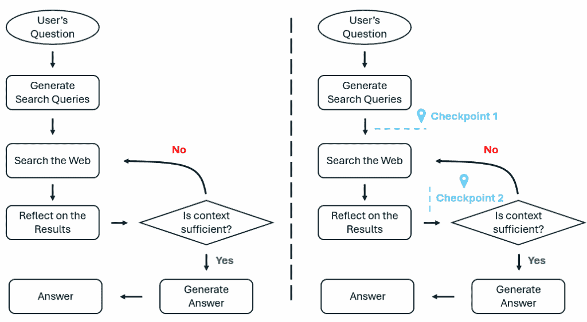
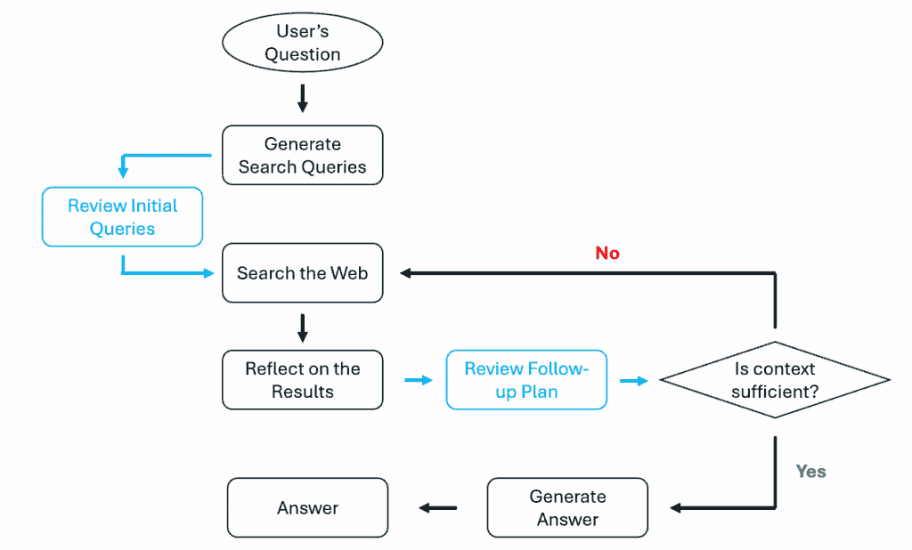

# LangGraph 201：为您的深度研究代理添加人工监督

> 原文：[`towardsdatascience.com/langgraph-201-adding-human-oversight-to-your-deep-research-agent/`](https://towardsdatascience.com/langgraph-201-adding-human-oversight-to-your-deep-research-agent/)

<mdspan datatext="el1757378508250" class="mdspan-comment">在流程中失去对</mdspan>你的 AI 代理的控制是一个常见的痛点。如果你已经构建了自己的代理应用，你很可能已经看到这种情况发生。

虽然现在的 LLMs（大型语言模型）能力非常强大，但它们在复杂的工作流程中还不能完全自主运行。对于任何实用的代理应用，人类输入对于做出关键决策和必要的纠正仍然非常必要。

这就是**人工反馈**模式发挥作用的地方。好消息是，你可以在 LangGraph 中轻松实现它们。

**在我之前的文章** (*[**LangGraph 101：让我们构建一个深度研究代理**](https://towardsdatascience.com/langgraph-101-lets-build-a-deep-research-agent/)*) 中，我们详细解释了 LangGraph 的核心概念，并详细介绍了如何使用 LangGraph 构建一个实用的深度研究代理。我们展示了研究代理如何自主搜索、评估结果，并迭代直到找到足够的证据来得出全面的答案。

从那个博客中遗留的一个问题是，代理从开始到结束完全自主运行。没有人类指导或反馈的入口点。

让我们在本教程中解决这个问题！

**因此，这是我们的计划**：我们将使用相同的研究代理，并增强其**人工反馈**功能。你将看到如何实现**检查点**，以便人类反馈可以使你的代理更加可靠和值得信赖。

> *如果你是 LangGraph 的新手或者想要复习 LangGraph 的核心概念，我强烈建议你查看[我的上一篇文章](https://towardsdatascience.com/langgraph-101-lets-build-a-deep-research-agent/)。我会尽量使当前的文章自包含，但可能会因为空间限制而跳过一些解释。* *你可以在我的上一篇文章中找到更详细的描述。*

* * *

**1. 问题陈述**

在这篇文章中，我们基于前一篇博客中的深度研究代理，添加了人工反馈检查点，以便用户可以审查代理的决策并提供反馈。

作为快速提醒，我们的深度研究代理是这样工作的：

> *它接收用户查询，自主搜索网络，检查获取的搜索结果，然后决定是否找到了足够的信息。如果是这样，它将继续创建一个精心制作的迷你报告，并附上适当的引用；否则，它将回过头来进行更深入的搜索。*

下面的插图显示了我们在构建的*delta*：左边描述了原始深度研究代理的工作流程，右边代表相同的代理工作流程，但增加了人工介入的增强。



图 1. 高级流程图。左：无人工介入。右：两个人类可以提供输入的检查点。（图片由作者提供）

注意，我们在右侧增强的工作流程中添加了两个人工介入的检查点：

+   **检查点 1**在代理生成其初始搜索查询后立即引入。这里的目的是在开始任何网络搜索之前，允许用户审查和改进搜索策略。

+   **检查点 2**发生在迭代搜索循环期间。这是代理决定是否需要更多信息，即进行更多搜索的时候。在这里添加检查点将给用户一个机会查看代理迄今为止找到的内容，确定是否已经收集了足够的信息，如果没有，则确定进一步使用的搜索查询。

通过简单地添加这两个检查点，我们有效地将完全自主的代理工作流程转变为 LLM-人类协作的工作流程。代理仍然处理繁重的工作，例如生成查询、搜索、综合结果和提出进一步的查询，但现在用户会有干预点来融入他们的判断。

这就是一个人工介入的研究工作流程的实际应用。

* * *

**2. 心智模型：图、边、节点和人工介入**

在查看代码之前，我们首先建立一个稳固的心智模型。我们将简要讨论 LangGraph 的核心和人工介入机制。对于 LangGraph 的更深入讨论，请参阅[LangGraph 101：让我们构建一个深度研究代理](https://towardsdatascience.com/langgraph-101-lets-build-a-deep-research-agent/)。

**2.1 工作流程表示**

LangGraph 将工作流程表示为有向**图**。你代理的工作流程中的每一步都成为一个**节点**。本质上，一个节点是一个执行所有实际工作的函数。为了连接节点，LangGraph 使用**边**，这些边基本上定义了工作流程如何从一步移动到下一步。

对于我们的研究代理来说，节点将是图 1 中的那些方框，处理诸如“生成搜索查询”、“搜索网络”或“反思结果”等任务。边是箭头，确定流程，例如是否继续搜索或生成最终答案。

**2.2 状态管理**

现在，随着我们的研究代理通过不同的节点，它需要跟踪它所学习和生成的内容。LangGraph 通过维护一个**中央状态对象**来实现这一功能，你可以将其视为一个共享的白板，图中的每个节点都可以查看并写入。

这样，每个节点都可以接收当前状态，完成其工作，并只返回它想要更新的部分。LangGraph 然后将这些更新自动合并到主状态中，在传递给下一个节点之前。

这种方法允许 LangGraph 在框架级别处理所有状态管理，因此单个节点只需要关注其特定任务。这使得工作流程高度模块化——你可以轻松地添加、删除或重新排序节点，而不会破坏状态流。

**2.3 人机交互**

现在，让我们谈谈人机交互。在 LangGraph 中，这是通过引入中断机制来实现的。以下是这种模式的工作原理：

+   在节点内部，你插入一个检查点。当图执行达到这个指定的检查点时，LangGraph 将暂停工作流程并向人类展示相关信息。

+   然后，人类可以审查这些信息并决定是否编辑/批准代理的建议。

+   一旦人类提供了输入，工作流程将从相同的节点（通过 ID 识别）恢复图运行。节点从顶部重新开始，但当它达到插入的检查点时，它将获取人类的输入而不是暂停。图执行从这里继续。

在建立这个概念基础之后，让我们看看如何将这个人机交互增强深度研究代理转换为实际实现。

* * *

**3. 从概念到代码**

在本文中，我们将基于 Google 使用 LangGraph 和 Gemini（Apache-2.0 许可证）构建的[开源实现](https://github.com/google-gemini/gemini-fullstack-langgraph-quickstart)进行扩展。这是一个全栈实现，但现阶段，我们只关注定义研究代理的后端逻辑（backend/src/agent/目录）。

一旦你分叉了仓库，你会看到以下关键文件：

+   configuration.py: 定义了管理研究代理所有可配置参数的`Configuration`类。

+   **graph.py**: 定义 LangGraph 工作流程的主要编排文件。我们将主要使用这个文件。

+   prompts.py: 包含不同节点使用的所有提示模板。

+   state.py: 定义了表示节点间传递的状态的 TypedDict 类。

+   tools_and_schemas.py: 定义 LLM 生成结构化输出的 Pydantic 模型。

+   utils.py: 包含用于处理搜索数据的实用函数，例如提取和格式化 URL、添加引用等。

让我们从 graph.py 开始，并从那里着手。

**3.1 工作流程**

作为提醒，我们的目标是增强现有的深度研究代理，加入人机交互验证。之前我们提到，我们想要添加两个检查点。在下面的流程图中，你可以看到将向现有工作流程中添加两个新的节点。



图 2.人机交互增强深度研究代理的流程图。检查点作为节点添加以中断工作流程。（图片由作者提供）

在 LangGraph 中，从流程图到代码的转换是直接的。让我们从创建图本身开始：

```py
from langgraph.graph import StateGraph
from agent.state import (
    OverallState,
    QueryGenerationState,
    ReflectionState,
    WebSearchState,
)
from agent.configuration import Configuration

# Create our Agent Graph
builder = StateGraph(OverallState, config_schema=Configuration)
```

在这里，我们使用 `StateGraph` 定义一个**状态感知图**。它接受一个 `OverallState` 类，该类定义了信息可以在节点之间移动的内容，以及一个 `Configuration` 类，该类定义了可运行时调整的参数。

一旦我们有了图容器，我们就可以向其中添加节点：

```py
# Define the nodes we will cycle between
builder.add_node("generate_query", generate_query)
builder.add_node("web_research", web_research)
builder.add_node("reflection", reflection)
builder.add_node("finalize_answer", finalize_answer)

# New human-in-the-loop nodes
builder.add_node("review_initial_queries", review_initial_queries)
builder.add_node("review_follow_up_plan", review_follow_up_plan)
```

`add_node()` 方法将第一个参数作为**节点名称**，第二个参数作为节点运行时将执行的**函数**。请注意，与原始实现相比，我们增加了两个新的**带人工干预的节点**。

如果你将节点名称与图 2 中的流程图进行交叉比较，你会看到，基本上，我们为每个步骤保留了一个节点。稍后，我们将逐一检查这些函数的详细实现。

好的，现在我们已经定义了节点，让我们添加边来连接它们并定义执行顺序：

```py
from langgraph.graph import START, END

# Set the entrypoint as `generate_query`
# This means that this node is the first one called
builder.add_edge(START, "generate_query")

# Checkpoint #1
builder.add_edge("generate_query", "review_initial_queries")

# Add conditional edge to continue with search queries in a parallel branch
builder.add_conditional_edges(
    "review_initial_queries", continue_to_web_research, ["web_research"]
)

# Reflect on the web research
builder.add_edge("web_research", "reflection")

# Checkpoint #2
builder.add_edge("reflection", "review_follow_up_plan")

# Evaluate the research
builder.add_conditional_edges(
    "review_follow_up_plan", evaluate_research, ["web_research", "finalize_answer"]
)
# Finalize the answer
builder.add_edge("finalize_answer", END)
```

注意，我们已经将两个带人工干预的检查点直接集成到工作流程中：

+   **检查点 1**：在 `generate_query` 节点之后，初始搜索查询被路由到 `review_initial_queries`。在这里，人类可以在任何网络搜索开始之前审查和编辑/批准提出的搜索查询。

+   **检查点 2**：在 `reflection` 节点之后，产生的审查结果，包括充分性标志和（如果有）提出的后续搜索查询，被路由到 `review_follow_up_plan`。在这里，人类可以评估评估的准确性，并相应地调整后续计划。

路由函数，即 `continue_to_web_research` 和 `evaluate_research`，根据这些检查点的人类决策处理路由逻辑。

> *关于 `builder.add_conditional_edges()` 的快速说明：它用于添加条件边，以便在运行时流程可以跳转到不同的分支。它需要三个关键参数：**源节点**、**一个路由函数**和**一个可能的目标节点列表**。路由函数检查当前状态，并返回要访问的下一个节点的名称。`continue_to_web_research` 在这里很特殊，因为它实际上并不执行“决策”，而是允许在第一步中生成多个查询（或由人类建议）时进行并行搜索。我们将在稍后看到其实现。*

最后，我们将所有内容组合在一起，将图编译成一个可执行的代理：

```py
from langgraph.checkpoint.memory import InMemorySaver

checkpointer = InMemorySaver()
graph = builder.compile(name="pro-search-agent", checkpointer=checkpointer)
```

注意，我们在这里添加了一个 `checkpointer` 对象，这对于实现带人工干预的功能至关重要。

当你的图执行被中断时，LangGraph 需要将图的当前状态输出到某个地方。这些状态可能包括到目前为止完成的所有工作、收集到的数据，以及当然，执行暂停的确切位置。所有这些信息对于允许在提供人工输入时无缝地恢复图都是重要的。

为了保存这个“快照”，我们有几种选择。对于开发和测试目的，`InMemorySaver` 是一个完美的选择。它简单地将图状态存储在内存中，使得工作既快又简单。

然而，对于生产部署，你可能需要使用更复杂的东西。在这种情况下，使用像 `PostgresSaver` 或 `SqliteSaver` 这样的数据库支持的检查点器将是不错的选择。

LangGraph 将这一过程抽象化，因此从开发到生产的切换只需更改这一行代码——其余的图逻辑保持不变。目前，我们将坚持使用内存持久化。

接下来，我们将更详细地查看单个节点，看看它们采取了什么行动。

> *对于原始实现中存在的节点，我将简要讨论，因为我已经在我的[前一篇帖子](https://towardsdatascience.com/langgraph-101-lets-build-a-deep-research-agent/)中详细介绍了它们。在这篇文章中，我们的主要焦点将是两个新的需要人类介入的节点以及它们如何实现我们之前提到的中断模式。*

**3.2 LLM 模型**

深度研究代理中的大多数节点都由 LLM 驱动。在配置文件 `config.py` 中，我们定义了以下 Gemini 模型来驱动我们的节点：

```py
class Configuration(BaseModel):
    """The configuration for the agent."""

    query_generator_model: str = Field(
        default="gemini-2.5-flash",
        metadata={
            "description": "The name of the language model to use for the agent's query generation."
        },
    )

    reflection_model: str = Field(
        default="gemini-2.5-flash",
        metadata={
            "description": "The name of the language model to use for the agent's reflection."
        },
    )

    answer_model: str = Field(
        default="gemini-2.5-pro",
        metadata={
            "description": "The name of the language model to use for the agent's answer."
        },
    )
```

注意，它们可能与原始实现不同。我建议使用 Gemini-2.5 系列模型。

**3.3 节点 #1：生成查询**

`generate_query` 节点用于根据用户的问题生成初始搜索查询。以下是这个节点是如何实现的：

```py
from langchain_google_genai import ChatGoogleGenerativeAI
from agent.prompts import (
    get_current_date,
    query_writer_instructions,
)

def generate_query(
    state: OverallState, 
    config: RunnableConfig
) -> QueryGenerationState:
    """LangGraph node that generates a search queries 
       based on the User's question.

    Args:
        state: Current graph state containing the User's question
        config: Configuration for the runnable, including LLM 
                provider settings

    Returns:
        Dictionary with state update, including search_query key 
        containing the generated query
    """
    configurable = Configuration.from_runnable_config(config)

    # check for custom initial search query count
    if state.get("initial_search_query_count") is None:
        state["initial_search_query_count"] = configurable.number_of_initial_queries

    # init Gemini model
    llm = ChatGoogleGenerativeAI(
        model=configurable.query_generator_model,
        temperature=1.0,
        max_retries=2,
        api_key=os.getenv("GEMINI_API_KEY"),
    )
    structured_llm = llm.with_structured_output(SearchQueryList)

    # Format the prompt
    current_date = get_current_date()
    formatted_prompt = query_writer_instructions.format(
        current_date=current_date,
        research_topic=get_research_topic(state["messages"]),
        number_queries=state["initial_search_query_count"],
    )
    # Generate the search queries
    result = structured_llm.invoke(formatted_prompt)

    return {"query_list": result.query}
```

使用 `SearchQueryList` 架构强制执行 LLM 的输出：

```py
from typing import List
from pydantic import BaseModel, Field

class SearchQueryList(BaseModel):
    query: List[str] = Field(
        description="A list of search queries to be used for web research."
    )
    rationale: str = Field(
        description="A brief explanation of why these queries are relevant to the research topic."
    )
```

**3.4 节点 #2：审查初始查询**

这是我们的第一个检查点。这里的想法是用户可以回顾 LLM 提出的初始查询，并决定是否想要编辑/批准 LLM 的输出。以下是我们的实现方式：

```py
from langgraph.types import interrupt

def review_initial_queries(state: QueryGenerationState) -> QueryGenerationState:

    # Retrieve LLM's proposals
    suggested = state["query_list"]

    # Interruption mechanism
    human = interrupt({
        "kind": "review_initial_queries",
        "suggested": suggested,
        "instructions": "Approve as-is, or return queries=[...]"
    })
    final_queries = human["queries"]

    # Limit the total number of queries
    cap = state.get("initial_search_query_count")
    if cap:
        final_queries = final_queries[:cap]

    return {"query_list": final_queries}
```

让我们分解这个检查点节点中发生的事情：

+   首先，我们提取由前一个 `generate_query` 节点提出的搜索查询。这些查询是人类想要审查的。

+   `interrupt()` 函数是魔法发生的地方。当节点执行遇到这个函数时，整个图会暂停，并将有效载荷展示给人类。有效载荷定义在输入到 `interrupt()` 函数的字典中。如代码所示，有三个字段：`kind`，用于标识与这个检查点相关的语义；`suggested`，包含 LLM 提出的搜索查询列表；以及 `instructions`，这是一段简单的文本，为人类提供指导。当然，传递给 `interrupt()` 的有效载荷可以是任何你想要的字典结构。它主要是一个 UI/UX 问题。

+   到目前为止，你的应用程序的前端能够向用户展示这些内容。我将在后面的演示部分向你展示如何与之交互。

+   当人类提供反馈时，图开始执行。需要注意的是，`interrupt()`调用现在返回人类的输入而不是暂停。人类反馈需要提供一个`queries`字段，其中包含他们批准的搜索查询列表。这就是`review_initial_queries`节点所期望的。

+   最后，我们应用配置的限制以防止过度搜索。

就这样！展示 LLM 的建议，暂停，整合人类反馈，然后继续。这就是 LangGraph 中所有人类在环节点的基础。

**3.5 并行网络搜索**

在人类批准初始查询后，我们将它们路由到网络研究节点。这是通过以下路由函数实现的：

```py
def continue_to_web_research(state: QueryGenerationState):
    """LangGraph node that sends the search queries to the web research node.

    This is used to spawn n number of web research nodes, one for each search query.
    """
    return [
        Send("web_research", {"search_query": search_query, "id": int(idx)})
        for idx, search_query in enumerate(state["query_list"])
    ]
```

这个函数接受批准的查询列表，并为每个查询创建一个并行的`web_research`任务。使用 LangGraph 的`Send`机制，我们可以并发启动多个网络搜索。

**3.6 节点 #3：网络研究**

这就是实际进行网络搜索的地方：

```py
def web_research(state: WebSearchState, config: RunnableConfig) -> OverallState:
    """LangGraph node that performs web research using the native Google Search API tool.

    Executes a web search using the native Google Search API tool in combination with Gemini 2.0 Flash.

    Args:
        state: Current graph state containing the search query and research loop count
        config: Configuration for the runnable, including search API settings

    Returns:
        Dictionary with state update, including sources_gathered, research_loop_count, and web_research_results
    """
    # Configure
    configurable = Configuration.from_runnable_config(config)
    formatted_prompt = web_searcher_instructions.format(
        current_date=get_current_date(),
        research_topic=state["search_query"],
    )

    # Uses the google genai client as the langchain client doesn't return grounding metadata
    response = genai_client.models.generate_content(
        model=configurable.query_generator_model,
        contents=formatted_prompt,
        config={
            "tools": [{"google_search": {}}],
            "temperature": 0,
        },
    )

    # resolve the urls to short urls for saving tokens and time
    gm = getattr(response.candidates[0], "grounding_metadata", None)
    chunks = getattr(gm, "grounding_chunks", None) if gm is not None else None
    resolved_urls = resolve_urls(chunks or [], state["id"]) 

    # Gets the citations and adds them to the generated text
    citations = get_citations(response, resolved_urls) if resolved_urls else []
    modified_text = insert_citation_markers(response.text, citations)
    sources_gathered = [item for citation in citations for item in citation["segments"]]

    return {
        "sources_gathered": sources_gathered,
        "search_query": [state["search_query"]],
        "web_research_result": [modified_text],
    } 
```

代码大部分是自解释的。我们首先配置搜索，然后通过 Gemini 调用 Google 的 Search API 并启用搜索工具。一旦我们获得搜索结果，我们就提取 URL、解析引文，然后使用适当的引文标记格式化搜索结果。最后，我们更新状态，包括收集到的资源和格式化的搜索结果。

注意，我们已经对 URL 解析和引用检索进行了加固，以应对搜索结果没有返回任何基础数据的情况。因此，你会看到获取引文并将其添加到生成的文本中的实现与原版略有不同。此外，我们还实现了一个更新的`resolve_urls`函数：

```py
def resolve_urls(urls_to_resolve, id):
    """
    Create a map from original URL -> short URL.
    Accepts None or empty; returns {} in that case.
    """
    if not urls_to_resolve:
        return {}

    prefix = f"https://vertexaisearch.cloud.google.com/id/"
    urls = []

    for site in urls_to_resolve:
        uri = None
        try:
            web = getattr(site, "web", None)
            uri = getattr(web, "uri", None) if web is not None else None
        except Exception:
            uri = None
        if uri:
            urls.append(uri)

    if not urls:
        return {}

    index_by_url = {}
    for i, u in enumerate(urls):
        index_by_url.setdefault(u, i)

    # Build stable short links
    resolved_map = {u: f"{prefix}{id}/{index_by_url[u]}" for u in index_by_url}

    return resolved_map
```

这个更新版本可以用作原版`resolve_urls`函数的直接替换，因为原版没有正确处理边缘情况。

**3.7 节点 #4：反思**

反思节点分析收集到的网络研究结果，以确定是否需要更多信息。

```py
def reflection(state: OverallState, config: RunnableConfig) -> ReflectionState:
    """LangGraph node that identifies knowledge gaps and generates potential follow-up queries.

    Analyzes the current summary to identify areas for further research and generates
    potential follow-up queries. Uses structured output to extract
    the follow-up query in JSON format.

    Args:
        state: Current graph state containing the running summary and research topic
        config: Configuration for the runnable, including LLM provider settings

    Returns:
        Dictionary with state update, including search_query key containing the generated follow-up query
    """
    configurable = Configuration.from_runnable_config(config)
    # Increment the research loop count and get the reasoning model
    state["research_loop_count"] = state.get("research_loop_count", 0) + 1
    reflection_model = state.get("reflection_model") or configurable.reflection_model

    # Format the prompt
    current_date = get_current_date()
    formatted_prompt = reflection_instructions.format(
        current_date=current_date,
        research_topic=get_research_topic(state["messages"]),
        summaries="\n\n---\n\n".join(state["web_research_result"]),
    )
    # init Reasoning Model
    llm = ChatGoogleGenerativeAI(
        model=reflection_model,
        temperature=1.0,
        max_retries=2,
        api_key=os.getenv("GEMINI_API_KEY"),
    )
    result = llm.with_structured_output(Reflection).invoke(formatted_prompt)

    return {
        "is_sufficient": result.is_sufficient,
        "knowledge_gap": result.knowledge_gap,
        "follow_up_queries": result.follow_up_queries,
        "research_loop_count": state["research_loop_count"],
        "number_of_ran_queries": len(state["search_query"]),
    }
```

这种分析直接输入到我们的第二个人类在环检查点。

注意，我们可以在 state.py 文件中更新`ReflectionState`模式：

```py
class ReflectionState(TypedDict):
    is_sufficient: bool
    knowledge_gap: str
    follow_up_queries: list
    research_loop_count: int
    number_of_ran_queries: int
```

我们没有使用累加还原器，而是使用一个普通的列表来表示`follow_up_queries`，这样人类输入可以直接覆盖 LLM 提出的建议。

**3.8 节点 #5：审查后续计划**

这个检查点的目的是让人类验证 LLM 的评估并决定是否继续研究：

```py
def review_follow_up_plan(state: ReflectionState) -> ReflectionState:

    human = interrupt({
        "kind": "review_follow_up_plan",
        "is_sufficient": state["is_sufficient"],
        "knowledge_gap": state["knowledge_gap"],
        "suggested": state["follow_up_queries"],
        "instructions": (
            "To complete research: {'is_sufficient': true}\n"
            "To continue with modified queries: {'follow_up_queries': [...], 'knowledge_gap': '...'}\n"
            "To add/modify queries only: {'follow_up_queries': [...]}"
        ),
    })

    if human.get("is_sufficient", False) is True:
        return {
            "is_sufficient": True,
            "knowledge_gap": state["knowledge_gap"],
            "follow_up_queries": state["follow_up_queries"],
        }

    return {
        "is_sufficient": False,
        "knowledge_gap": human.get("knowledge_gap", state["knowledge_gap"]),  
        "follow_up_queries": human["follow_up_queries"],
    }
```

按照相同的模式，我们首先设计将要展示给人类的负载。这个负载包括这种中断的类型、一个二进制标志表示研究是否足够、LLM 识别的知识差距、LLM 建议的后续查询，以及人类应该输入的反馈的小提示。

经过检查，人工可以直接说研究已经足够。或者人工可以保持充分性标志为 False，并编辑/批准反思节点 LLM 提出的内容。

无论哪种方式，结果都将发送到研究评估函数，该函数将路由到相应的下一个节点。

**3.9 路由逻辑：继续或最终确定**

人工审核后，此路由功能将确定下一步：

```py
def evaluate_research(
    state: ReflectionState,
    config: RunnableConfig,
) -> OverallState:
    """LangGraph routing function that determines the next step in the research flow.

    Controls the research loop by deciding whether to continue gathering information
    or to finalize the summary based on the configured maximum number of research loops.

    Args:
        state: Current graph state containing the research loop count
        config: Configuration for the runnable, including max_research_loops setting

    Returns:
        String literal indicating the next node to visit ("web_research" or "finalize_summary")
    """
    configurable = Configuration.from_runnable_config(config)
    max_research_loops = (
        state.get("max_research_loops")
        if state.get("max_research_loops") is not None
        else configurable.max_research_loops
    )
    if state["is_sufficient"] or state["research_loop_count"] >= max_research_loops:
        return "finalize_answer"
    else:
        return [
            Send(
                "web_research",
                {
                    "search_query": follow_up_query,
                    "id": state["number_of_ran_queries"] + int(idx),
                },
            )
            for idx, follow_up_query in enumerate(state["follow_up_queries"])
        ]
```

如果人工得出结论研究已经足够，或者我们已经达到了最大研究循环限制，此功能将路由到 `finalize_answer`。否则，它将使用人工批准的后续查询生成新的网络研究任务（并行）。

**3.10 节点 #6：最终确定答案**

这是我们的图中的最终节点，它将所有收集到的信息综合成一个包含适当引用的全面答案：

```py
def finalize_answer(state: OverallState, config: RunnableConfig):
    """LangGraph node that finalizes the research summary.

    Prepares the final output by deduplicating and formatting sources, then
    combining them with the running summary to create a well-structured
    research report with proper citations.

    Args:
        state: Current graph state containing the running summary and sources gathered

    Returns:
        Dictionary with state update, including running_summary key containing the formatted final summary with sources
    """
    configurable = Configuration.from_runnable_config(config)
    answer_model = state.get("answer_model") or configurable.answer_model

    # Format the prompt
    current_date = get_current_date()
    formatted_prompt = answer_instructions.format(
        current_date=current_date,
        research_topic=get_research_topic(state["messages"]),
        summaries="\n---\n\n".join(state["web_research_result"]),
    )

    # init Reasoning Model, default to Gemini 2.5 Flash
    llm = ChatGoogleGenerativeAI(
        model=answer_model,
        temperature=0,
        max_retries=2,
        api_key=os.getenv("GEMINI_API_KEY"),
    )
    result = llm.invoke(formatted_prompt)

    # Replace the short urls with the original urls and add all used urls to the sources_gathered
    unique_sources = []
    for source in state["sources_gathered"]:
        if source["short_url"] in result.content:
            result.content = result.content.replace(
                source["short_url"], source["value"]
            )
            unique_sources.append(source)

    return {
        "messages": [AIMessage(content=result.content)],
        "sources_gathered": unique_sources,
    }
```

这样，我们的人机交互研究工作流程现在就完成了。

**4. 运行代理：处理中断和恢复**

在本节中，让我们用我们新增强的深度研究代理进行一次试驾！我们将通过 Jupyter Notebook 中的完整交互来了解，其中人工在两个检查点引导研究过程。

> *为了平稳运行我们当前的代理，您需要获取一个 Gemini API 密钥。您可以从 Google AI Studio 获取密钥。一旦您有了密钥，请记住创建 .env 文件并将您的 Gemini API 密钥粘贴进去：GEMINI_API_KEY="your_actual_api_key_here"。*

**4.1 开始研究**

例如，在第一个单元格中，让我们询问代理关于量子计算的发展：

```py
from agent import graph
from langgraph.types import Command

config = {"configurable": {"thread_id": "session_1"}}

Q = "What are the latest developments in quantum computing?"
result = graph.invoke({"messages": [{"role": "user", "content": Q}]}, config=config)
```

注意，我们在配置中提供了一个线程 ID。实际上，这是实现人机交互工作流程的关键部分。内部，LangGraph 使用此 ID 来持久化状态。稍后，当我们恢复时，LangGraph 将知道要恢复哪个执行。

**4.2 检查点 #1：审查初始查询**

运行第一个单元格后，图执行直到遇到我们的第一个检查点。如果您在下一个单元格中打印结果：

```py
result
```

您将看到类似这样的内容：

```py
{'messages': [HumanMessage(content='What are the latest developments in quantum computing?', additional_kwargs={}, response_metadata={}, id='68beb541-aedb-4393-bb12-a7f1a22cb4f7')],
 'search_query': [],
 'web_research_result': [],
 'sources_gathered': [],
 'approved_initial_queries': [],
 'approved_followup_queries': [],
 '__interrupt__': [Interrupt(value={'kind': 'review_initial_queries', 'suggested': ['quantum computing breakthroughs 2024 2025', 'quantum computing hardware developments 2024 2025', 'quantum algorithms and software advancements 2024 2025'], 'instructions': 'Approve as-is, or return queries=[...]'}, id='4c23dab27cc98fa0789c61ca14aa6425')]}
```

注意，已创建了一个新的密钥：`__interrupt__`，它包含发送回人工审核的负载。返回负载的所有键都是我们在节点中定义的。

现在，作为用户，我们可以继续编辑/批准搜索查询。目前，让我们假设我们对 LLM 的建议感到满意，因此我们可以简单地接受它们。这可以通过简单地重新发送 LLM 的建议到节点来实现：

```py
# Human input
human_edit = {"queries": result["__interrupt__"][0].value["suggested"]}

# Resume the graph
result = graph.invoke(Command(resume=human_edit), config=config)
```

运行此单元格需要一些时间，因为图将启动搜索并综合研究结果。之后，反思节点将审核结果并提出后续查询。

**4.3 检查点 #2：审查后续查询**

在一个新的单元格中，如果我们现在运行：

```py
result["__interrupt__"][0].value
```

您将看到具有相应节点中定义的键的负载：

```py
{'kind': 'review_follow_up_plan',
 'is_sufficient': False,
 'knowledge_gap': 'The summaries provide high-level progress in quantum error correction (QEC) but lack specific technical details about the various types of quantum error-correcting codes being developed and how these codes are being implemented and adapted for different qubit modalities (e.g., superconducting, trapped-ion, neutral atom, photonic, topological). A deeper understanding of the underlying error correction schemes and their practical realization would provide more technical depth.',
 'suggested': ['What are the different types of quantum error-correcting codes currently being developed and implemented (e.g., surface codes, topological codes, etc.), and what are the specific technical challenges and strategies for their realization in various quantum computing hardware modalities such as superconducting, trapped-ion, neutral atom, photonic, and topological qubits?'],
 'instructions': "To complete research: {'is_sufficient': true}\nTo continue with modified queries: {'follow_up_queries': [...], 'knowledge_gap': '...'}\nTo add/modify queries only: {'follow_up_queries': [...]}"}
```

假设我们同意 LLM 提出的内容。但我们还想向搜索查询中添加一个新的：

```py
human_edit = {
    "follow_up_queries": [
        result["__interrupt__"][0].value["suggested"][0],
        'fault-tolerant quantum computing demonstrations IBM Google IonQ PsiQuantum 2024 2025'
    ]
}

result = graph.invoke(Command(resume=human_edit), config=config)
```

我们可以再次恢复图，这就是如何与人类在回路代理交互的全部内容。

* * *

**5. 结论**

在这篇帖子中，我们成功地将人类在回路功能增强到了我们的深度研究代理中。我们不再是完全自主运行，现在我们有一个内置机制来防止代理偏离轨道，同时享受自动化研究的效率。

技术上，这是通过在精心选择的节点中使用 LangGraph 的`interrupt()`机制来实现的。一个好的心理模型是这样的：节点触发“暂停”，你进行编辑或批准，按下“播放”，节点带着你的输入重新启动，然后继续进行。所有这些都不会破坏底层图结构。

现在你已经拥有了所有这些知识，你准备好构建下一个人类-人工智能协作工作流程了吗？
