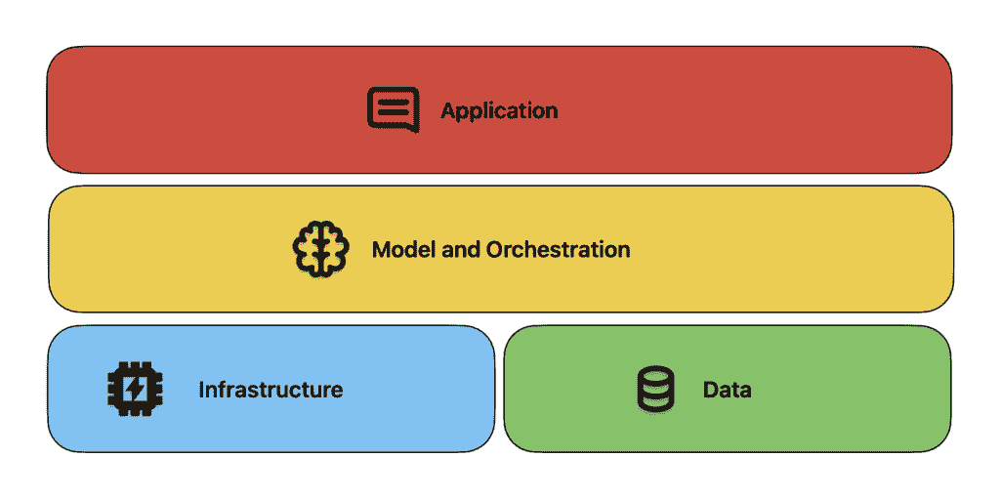
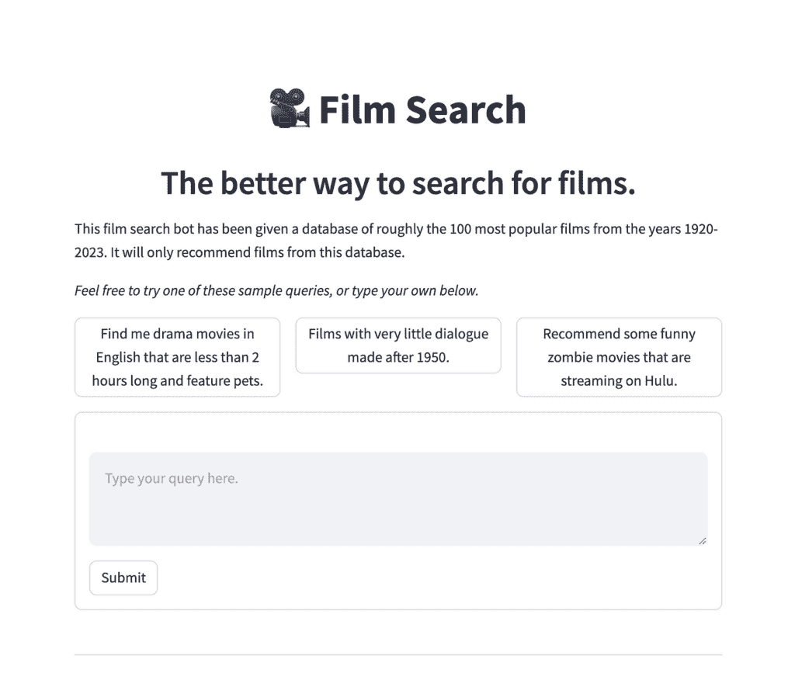

# 简单解释人工智能堆栈的层级

> 原文：[`towardsdatascience.com/layers-ai-stack/`](https://towardsdatascience.com/layers-ai-stack/)

*📕 这是关于使用生成式 AI 集成创建 Web 应用程序的多部分系列的第一部分。*

#### <mdspan datatext="el1744138592697" class="mdspan-comment">目录</mdspan>

+   简介

+   应用层的优点

+   厚包装

+   Clippy 的回归

+   在睡眠中完成任务

* * *

### 简介

人工智能领域是一个广阔而复杂的景观。马特·图克每年都会做他的机器学习、人工智能和数据（MAD）景观，而且似乎总是变得越来越疯狂。查看 2024 年制作的最新版本（[`mattturck.com/landscape/mad2024.pdf`](https://mattturck.com/landscape/mad2024.pdf)）。

至少可以说，这令人印象深刻。

然而，我们可以使用抽象来帮助我们理解我们这个疯狂景观。本文将讨论并分解的主要一个是**AI 堆栈**的概念。堆栈只是用于构建应用程序的技术组合。那些熟悉 Web 开发的人可能知道**LAMP 堆栈**：Linux、Apache、MySQL、PHP。这是 WordPress 所依赖的堆栈。使用像 LAMP 这样的吸引人的首字母缩略词是帮助我们人类应对 Web 应用程序景观复杂性的好方法。那些在数据领域工作的人可能听说过**现代数据堆栈**：通常是 dbt、Snowflake、Fivetran 和 Looker（或[后现代数据堆栈](https://medium.com/data-science/the-post-modern-stack-993ec3b044c1) IYKYK）。

**AI 堆栈**类似，但在这篇文章中，我们将更多地从概念上探讨。我不会具体指定在每个堆栈层你应该使用哪些具体技术，而是简单地命名这些层，并让你决定自己适合哪个位置，以及你将使用什么技术来实现该层的成功。

有[许多](https://www.mongodb.com/resources/basics/artificial-intelligence/ai-stack#the-ai-stack) [方法](https://menlovc.com/perspective/the-modern-ai-stack-design-principles-for-the-future-of-enterprise-ai-architectures/) [来](https://www.ibm.com/think/topics/ai-stack) [描述](https://medium.com/mongodb/understanding-the-ai-stack-in-the-era-of-generative-ai-f1fcd66e1393) AI 堆栈。我更喜欢简单；所以这里是以四层组织的 AI 堆栈，从离最终用户最远（底部）到最近（顶部）：

+   **基础设施层（底部）：** 培训和进行 AI 推理所需的原始物理硬件。想想 GPU、TPU、云服务（AWS/Azure/GCP）。

+   **数据层（底部）：** 训练机器学习模型所需的数据，以及存储所有这些数据的数据库。想想 ImageNet、TensorFlow Datasets、Postgres、MongoDB、Pinecone 等。

+   **模型和编排层（中间）：**这指的是实际的大型语言、视觉和推理模型本身。例如 GPT、Claude、Gemini 或任何机器学习模型。这还包括开发者用来构建、部署和观察模型的工具。例如 PyTorch/TensorFlow、Weights & Biases 和 LangChain。

+   **应用层（顶部）：**由 AI 驱动的客户使用的应用程序。例如 ChatGPT、GitHub copilot、Notion、Grammarly。

AI 堆栈中的层次。图由作者提供。

许多公司涉足多个层次。例如，OpenAI 既训练了 GPT-4o，又创建了 ChatGPT 网络应用。在基础设施层的帮助下，他们与微软合作，使用其 Azure 云服务提供按需 GPU。至于数据层，他们构建了网络爬虫，帮助在训练期间将大量自然语言数据拉入模型中，[并非没有争议](https://www.nytimes.com/2023/12/27/business/media/new-york-times-open-ai-microsoft-lawsuit.html)。

### 应用层的优点

我非常同意[Andrew Ng](https://www.youtube.com/watch?v=KDBq0GqKpqA&t=860s)和这个领域中的[许多人](https://x.com/gradypb/status/1899485092247916891) [以及其他](https://www.sequoiacap.com/article/generative-ais-act-o1/)人所说的，**AI 的应用层是应该关注的重点**。

为什么会这样？让我们从基础设施层开始。除非你有数亿美元的风险投资现金可以烧，否则进入这个层次的成本非常高。尝试创建自己的云服务或设计一种新型 GPU 的技术复杂性非常高。这就是为什么像亚马逊、谷歌、英伟达和微软这样的科技巨头在这个层次上占据主导地位的原因。同样，基础模型层也是如此。像 OpenAI 和 Anthropic 这样的公司拥有大量的博士团队在这里进行创新。此外，他们还必须与科技巨头合作，为模型训练和托管提供资金。这两个层次也正在迅速变得**商品化**。这意味着一个云服务/模型的表现与另一个大致相同。它们可以互换，并且可以轻松替换。它们主要在价格、便利性和品牌名称上竞争。

数据层非常有趣。生成式 AI 的出现导致许多公司宣称自己是最受欢迎的向量数据库，包括 Pinecone、Weaviate 和 Chroma。然而，在这个层次上的客户群远小于应用层（开发者的人数远少于使用 ChatGPT 等 AI 应用的人）。这个领域也迅速变得商品化。用 Weaviate 替换 Pinecone 并不是一件困难的事情，例如，如果 Weaviate 大幅降低他们的托管价格，许多开发者可能会从其他服务切换过来。

还需要注意的是数据库层面的创新。例如[pgvector](https://github.com/pgvector/pgvector)和[sqlite-vec](https://github.com/asg017/sqlite-vec)项目正在将经过验证的数据库转变为能够处理向量嵌入的数据库。这是我愿意贡献力量的领域。然而，盈利之路并不清晰，在这里考虑盈利感觉有点不舒服（我热爱开源！）

这就带我们来到了应用层。**这正是小公司能够取得重大胜利的地方**。将最新的 AI 技术革新整合到网络应用中的能力，现在和将来都将非常受欢迎。当提供人们喜爱的产品时，盈利之路最为清晰。应用可以是 SaaS 服务，也可以是根据公司特定用例定制的应用。

记住，那些在基础模型层工作的公司正在不断努力发布更好、更快、更便宜的模式。以一个例子来说，如果你在应用中使用`gpt-4o`模型，而 OpenAI 更新了模型，你**无需做任何事情**即可接收更新。你的应用性能将得到显著提升，而无需付出任何代价。这类似于 iPhone 定期更新，但更好，因为无需安装。从 API 提供商返回的流式数据块神奇地变得更好。

如果你想切换到新提供商的模型，只需更改一两行代码即可开始获得改进的响应（记住，商品化）。**想想最近的 DeepSeek 时刻；对于 OpenAI 可能令人恐惧的事情，对于应用构建者来说却是令人兴奋的。**

重要的是要注意，应用层并非没有挑战。我注意到社交媒体上关于 SaaS 饱和度的担忧很多。感觉很难让用户注册账户，更不用说掏出信用卡了。感觉你需要风险投资来支持营销狂潮，还需要另一个流行的黑底营销网站。应用开发者还必须小心，不要构建出很快就会被大型模型提供商吞噬的产品。想想 Perplexity 最初是如何通过结合 LLM 的力量和搜索功能而建立声誉的。当时这很新颖；如今，大多数流行的聊天应用都内置了这项功能。

对于应用开发者来说，另一个挑战是获得**领域专业知识**。领域专业知识是一个术语，指的是了解像法律、医学、汽车等细分领域。如果开发者没有必要的领域专业知识来确保他们的产品实际上能帮助到某人，那么世界上所有的技术技能都没有什么意义。作为一个简单的例子，人们可以理论化一个文档摘要工具如何帮助法律公司，但如果没有与律师密切合作，任何可用性都只是理论上的。利用你的网络与一些领域专家交朋友；他们可以帮助你的应用取得成功。

与领域专家合作的一个替代方案是为你自己构建一些东西。如果你喜欢这个产品，其他人可能也会喜欢。然后你可以继续[内部测试](https://en.wikipedia.org/wiki/Eating_your_own_dog_food)你的应用，并迭代改进它。

### 厚重的包装

早期与通用人工智能集成的应用被嘲笑为语言模型的“薄包装”。确实，仅仅在 LLM 上添加一个简单的聊天界面是不会成功的。你实际上是在与 ChatGPT、Claude 等竞争，争夺市场最低点。

典型的薄包装看起来可能像这样：

+   一个聊天界面

+   基本的提示工程

+   很可能很快就会被大型模型提供商所取代的功能，或者已经可以通过他们的应用完成的功能

一个例子可能是一个“AI 写作助手”，它只是将提示传递给 ChatGPT 或 Claude，并使用基本的提示工程。另一个例子可能是一个“AI 摘要工具”，它将文本传递给 LLM 进行摘要，没有任何处理或特定领域的知识。

在我们开发具有人工智能集成的 Web 应用的经验基础上，洛杉矶人工智能应用公司提出了以下标准，以避免创建薄包装应用：

> 如果该应用无法通过搜索在显著程度上优于 ChatGPT，那么它就太薄弱了。

这里有一些需要注意的事项，首先是“显著因素”的概念。即使你能够在某个特定领域通过一个小因素超越 ChatGPT 的能力，这也可能不足以确保成功。你需要比 ChatGPT 好得多，人们才会考虑使用该应用。

让我用一个例子来激发这个洞察力。当我学习数据科学时，我创建了一个[电影推荐项目](https://towardsdatascience.com/how-to-build-a-rag-system-with-a-self-querying-retriever-in-langchain-16b4fa23e9ad/)。这是一次很好的经历，我学到了很多关于 RAG 和 Web 应用的知识。

我的旧电影推荐应用。美好的时光！图片由作者提供。

这会是一个好的生产应用吗？不会。

无论你问什么问题，ChatGPT 很可能会给你一个与之相当的电影推荐。尽管我在使用 RAG 并引入了一个精选的电影数据集，但用户不太可能觉得这些回答比 ChatGPT + search 更有吸引力。由于用户熟悉 ChatGPT，他们可能会继续使用它来获取电影推荐，即使我的应用中的回答比 ChatGPT 好 2 倍或 3 倍（当然，在这里定义“更好”是有些棘手的。）

让我再用另一个例子。我们曾考虑开发的一个应用是一个面向城市政府网站的网页应用。这些网站通常很大，难以导航。我们想，如果我们能够抓取网站域的内容，然后使用 RAG，我们就能制作一个能够有效回答用户查询的聊天机器人。它工作得相当不错，**但带有搜索功能的 ChatGPT 是一个怪物**。它往往能够匹配或超过我们机器人的性能。要使我们的应用持续超越 ChatGPT + search，需要对 RAG 系统进行大量的迭代。即使如此，谁会想去一个新的域名来获取对城市问题的答案，当 ChatGPT + search 会给出类似的结果时？只有通过向市政府销售我们的服务，并将我们的聊天机器人集成到城市网站上，我们才能获得持续的使用。

区分自己的一个方法是通过专有数据。如果存在模型提供者无法获取的私有数据，那么这些数据可能很有价值。在这种情况下，价值在于数据的收集，而不是你聊天界面或 RAG 系统的创新。考虑一个法律 AI 初创公司，它为其模型提供了一大批无法在公开网络找到的法律文件数据库。也许可以通过 RAG 帮助模型回答这些私有文件中的法律问题。这样的方法能否超越 ChatGPT + search？是的，前提是这些法律文件无法在 Google 上找到。

更进一步，我认为让您的应用脱颖而出的最佳方式是完全放弃聊天界面。让我介绍两个想法：

+   主动 AI

+   智能一夜之间

#### Clippy 的回归

我读了一篇来自 Evil Martians 的[优秀文章](https://evilmartians.com/chronicles/dont-just-slap-on-a-chatbot-building-ai-that-works-before-you-ask)，强调了在应用层面开始出现的创新。他们描述了他们完全放弃了聊天界面，而是尝试了他们称之为**主动式 AI**的东西。回想一下微软 Word 中的[Clippy](https://en.wikipedia.org/wiki/Office_Assistant)。当你正在输入文档时，它会突然提出建议。这些建议往往并不有用，而且可怜的 Clippy 经常被嘲笑。随着 LLMs 的出现，你可以想象出一个更强大的 Clippy 版本。它不会等待用户提问，而是主动为用户提供建议。这与 VSCode 中附带的编码 Copilot 类似。它不会等待程序员完成输入，而是在他们编码时提供建议。如果做得恰当，这种 AI 风格可以减少摩擦并提高用户满意度。

当然，在创建主动式 AI 时，有一些重要的考虑因素。你不想你的 AI 频繁地打扰用户，以至于变得令人沮丧。人们也可以想象一个反乌托邦的未来，其中 LLMs 不断地暗示你购买便宜垃圾或在不提醒的情况下浪费时间在一些无脑应用上。当然，机器学习模型已经在做这件事了，但给它加上人类语言可以使其更加隐蔽和令人烦恼。开发者确保他们的应用程序被用来造福用户，而不是欺骗或影响他们，这是至关重要的。

#### 在你睡眠时完成任务

AI 夜间工作的图像。图像来自 GPT-4o

另一种替代聊天界面的方法是使用离线的 LLMs 而不是在线的。例如，想象你想创建一个新闻简报生成器。这个生成器会使用自动抓取器从各种来源收集线索。然后它会为它认为有趣的线索创建文章。你的新闻简报的每一期都由一个后台作业启动，可能是每天或每周。**这里的重要细节是：没有聊天界面**。用户无法有任何输入；他们只能享受新闻简报的最新一期。现在我们真的开始变得有趣了！

我把这称为**夜间 AI**。关键在于用户根本不需要与 AI 互动。它会在你睡觉的时候自动生成摘要、解释、分析等，而无需任何操作。早上醒来，你就可以享受这些结果。夜间 AI 中不应该有任何聊天界面或建议。当然，在夜间 AI 中加入人工审核是非常有益的。想象一下，你的时事通讯问题通过建议的文章呈现在你面前。你可以选择接受或拒绝进入时事通讯的故事。也许你还可以加入编辑文章标题、摘要或封面照片的功能，如果你不喜欢 AI 生成的某些内容。

### 摘要

在这篇文章中，我介绍了 AI 堆栈背后的基础知识。这包括基础设施、数据、模型/编排和应用层。我讨论了为什么我认为应用层是最佳工作场所，主要是因为它缺乏商品化、靠近最终用户，以及有机会构建从底层工作中受益的产品。我们还讨论了如何防止你的应用程序仅仅成为另一个薄层包装，以及如何使用 AI 完全避免聊天界面。

在第二部分，我将讨论如果你想要使用 AI 集成构建 Web 应用程序，最佳学习语言不是 Python，而是 Ruby。我还会分析为什么对于 AI 应用程序来说，微服务架构可能不是构建应用程序的最佳方式，尽管它是大多数人默认的选择。

🔥 *如果您想要一个集成了生成式 AI 的定制 Web 应用程序，请访问* [*losangelesaiapps.com*](https://losangelesaiapps.com/)
