# 学习构建高级 AI 图像应用

> 原文：[`towardsdatascience.com/learn-to-build-advanced-ai-image-applications-9c98d0f1f930/`](https://towardsdatascience.com/learn-to-build-advanced-ai-image-applications-9c98d0f1f930/)

### 自定义图像生成

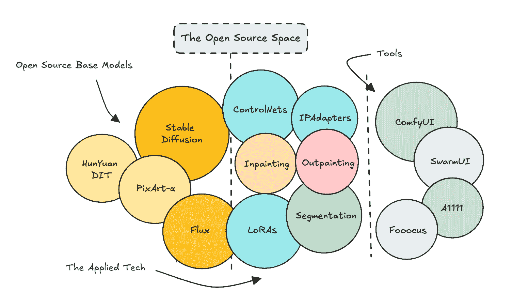

可视化图像生成的开源空间 | 图片由作者提供

_ 如果你不是会员但想阅读这篇文章，请点击这里[阅读](https://medium.com/@ilsilfverskiold/9c98d0f1f930?source=friends_link&sk=245d09535d83d211e2c89d32c9a38274)_。

对于这篇文章，我想要接受挑战，让开源空间中的高级图像生成对初学者来说更容易。我意识到，在 20 分钟内完成这项任务是一项相当繁重的任务。

我们将探讨这个领域正在发生的事情，哪些开源模型和工具受欢迎，学习扩散的工作原理，并深入了解 LoRAs、ControlNets 和 IP Adapters 等关键技术。

我们还将探讨不同的用例以及如何将各种技术应用到每个用例中。

最后，我们将使用 Flux 创建一个室内设计师，它可以从卧室的图像生成不同的设计。你可以在下面看到这将是什么样子。

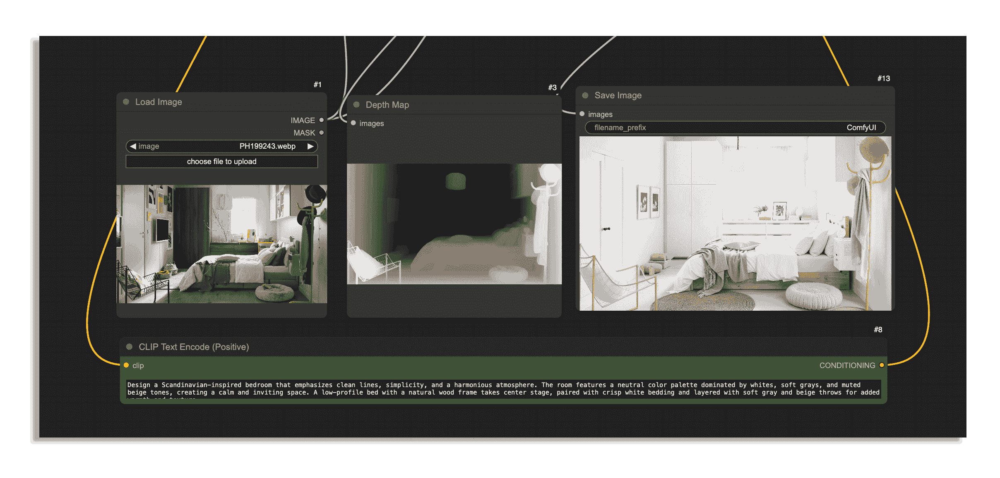

ComfyUI 中的室内设计师工作流程 | 图片由作者提供

如果你热衷于开始，你可以跳过简介，直接进入构建阶段。

## 简介

这一部分是为每个人准备的，即使你不想深入了解使用自定义图像生成的技术细节。

我们将探讨图像生成、开源和专有模型的发布、可用的技术、一些用例以及构建的成本。

我在我的常规仓库中收集了一系列资源和信息[在这里](https://github.com/ilsilfverskiold/Awesome-LLM-Resources-List/tree/main/img-gen)，你稍后可以在这里找到。

### 生成图像

如果你完全对生成图像不熟悉，你应该做一些研究。

在过去几年中，这个领域已经看到了一些重大的创新。

但现在不仅仅是你可以通过提示生成高质量图像，更重要的是新技术如何让你对这些图像的方面，如品牌、产品美学和个性化风格，有精确的控制。

在过去的几年里，开源社区一直非常忙碌，我们将会探讨不同的用例以及这项技术是如何改变的。

### 封闭源与开源模型

我们首先应该了解的是这个空间中可用的 AI 模型，以及你应该专注于构建哪些模型。

可能最古老——也是最广泛使用的——是**Stable Diffusion 1.5**。它背后有一个庞大的社区支持，并且是完全开源的，这意味着你可以在其基础上商业构建 API。

2024 年，Black Forest Labs 发布了 **Flux**，作为 MidJourney 等闭源系统的竞争对手。

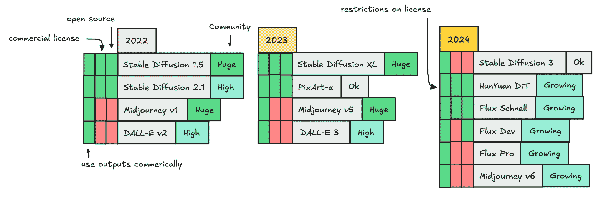

最受欢迎的生成图像模型，发布年份和商业许可证 | 作者图片

Flux Schnell 是完全开源的，并且有商业许可证，但更受欢迎的 **Flux Dev** 则不是。这并不意味着你不能在商业上使用 Flux Dev 的输出，但你不能在模型之上构建系统并出售它。

你可以在上面的不同流行模型上看到我的笔记，注意它们是否是开源的并且有商业许可证。如果你想查看整个列表，请查看[这个](https://github.com/ilsilfverskiold/Awesome-LLM-Resources-List/blob/main/img-gen/README.md#image-generation-models-open-source-vs-closed-source)。

现在，虽然你可能想直接跳到 Flux 来处理所有项目，但请记住，一个模型可用的越久，围绕它的工具和资源就越多。

**Stable Diffusion 1.5** 和 **Stable Diffusion XL** 拥有一些最大的社区，已经有许多工具和技术被开发出来。在开始构建之前，不要完全忽视它们。

### 图像用例

在这个领域内，有如此多的用例是可能的。

几天前，一些生成的 [AI 图像](https://www.reddit.com/r/stablediffusionreal/comments/1hql94v/comment/m6bw5bk/) 在领英上传播，显然非常逼真，以至于人们无法分辨出差异。这些图像是由 [这位](https://www.reddit.com/user/dal_mac/) 创作者在 ComfyUI 中使用一位女性的度假照片的微调 LoRA 创建的。

现在，可能性还不止于此。

你会看到我下面草拟的一些流行用例，以及它们相应的潜在技术。

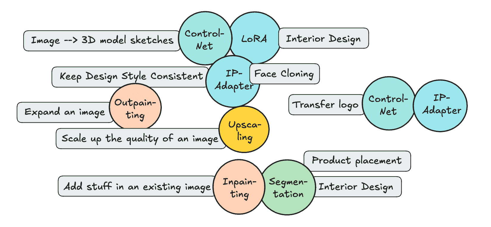

不同的用例和技术，请查看[这个](https://github.com/ilsilfverskiold/Awesome-LLM-Resources-List/blob/main/img-gen/README.md#example-use-case-w-said-tech)仓库中的清晰列表 | 作者图片

我有一个[这里](https://github.com/ilsilfverskiold/Awesome-LLM-Resources-List/blob/main/img-gen/README.md#example-use-case-w-said-tech)的表格，组织得稍微好一些。

尽管如此，我们做的是为不同的工作流程组合不同的工具。你经常会看到人们将 ControlNet 与 IP 适配器和额外的 LoRAs 一起使用。

### ComfyUI 与替代品

现在，为了构建高级生成图像应用程序，我们需要看看可用的工具。

我相信市面上有很多商业选项，但也有许多开源选项。它们在各个方面都更好，因为它们有更大的社区推动创新，而且它们是免费的。

到目前为止发布的最重要的是 **ComfyUI**。

ComfyUI 是一个基于节点的可视化 GUI，它让你完全控制扩散过程，使其成为创建自定义生成图像（甚至视频）的绝佳选择。

然而，许多人发现 ComfyUI 过于复杂，所以让我们快速探索一些替代方案。

![生成式 AI 图像推进开源工具。查看列表这里 | 图片由作者提供]

生成式 AI 图像推进开源工具。查看列表[这里](https://github.com/ilsilfverskiold/Awesome-LLM-Resources-List/blob/main/img-gen/README.md#generative-image-tools) | 图片由作者提供

许多替代方案的缺点是它们可能过于限制性，并且现在已经过时了。例如，A111 是更知名的 UI 之一，但目前它不支持新的 Flux 模型。

ComfyUI 有一个学习曲线，学习基础知识可能需要几天时间，但任何有技术背景的人都应该能够掌握它。

如果你仍然觉得 ComfyUI 过于复杂，一个好的替代方案是**SwarmUI**，它是基于 ComfyUI 构建的，提供了一个简化的用户界面。

无论你选择什么工具，这篇文章都将有助于理解技术。

### 高级图像生成的经济学

如果你是一个利益相关者，让我们简要地谈谈使用 ComfyUI 等工具构建的成本。

要有效地运行这些工具，你需要良好的硬件，包括具有高 VRAM 的 GPU，这需要一定的投资。

或者，你可以租用云 GPU（我们所有人都在做），但这可能会迅速增加成本。最便宜的选择大约每小时 0.60 美元，具体取决于你的配置。

尽管成本较高，但与雇佣外部顾问来构建、部署和维护工作流程相比，这仍然可能是一个更好的投资。让你的团队内部学习不仅节省了长期成本，还在内部建立了专业知识。

话虽如此，实现高质量的结果并不容易。这项技术正在快速发展，网上到处都是过时的节点和工作流程。它也非常技术性，因此没有适当技能的团队可能会遇到困难。

仍然值得投资学习你可以用它做什么。

## 技术要点

让我们深入了解一些更技术性的内容，以便我们理解图像生成的工作原理。我们还将设置 ComfyUI，并探索其布局，同时涵盖 LoRAs、ControlNets 和 IP 适配器等关键技术。

在本节的最后，我们将构建室内设计师工作流程，这是一个相当简单的用例。

### 图像生成是如何工作的

图像生成与计算机视觉不同，尽管它们有一些重叠。计算机视觉专注于识别和分析图像的内容。

如果你感兴趣于探索计算机视觉的应用场景，可以查看我一年前写的这篇文章[这里](https://medium.com/gitconnected/computer-vision-monitoring-traffic-levels-in-norway-fa54b64a0d3b)。

另一方面，图像生成属于生成式 AI 类别。它涉及创建内容，而不是分析或解释它。这个领域的主要模型类型是 GAN 和扩散模型。

这篇文章重点介绍了扩散模型，这是 ComfyUI 的主要选择，但如果你想要深入了解这个领域，有几种资源可供参考。

我想提一下，当我们使用扩散模型生成图像时，我们是从随机噪声开始的，模型逐步对其进行细化，直到形成一个连贯的图像。这个过程由我们的提示（嵌入）引导。

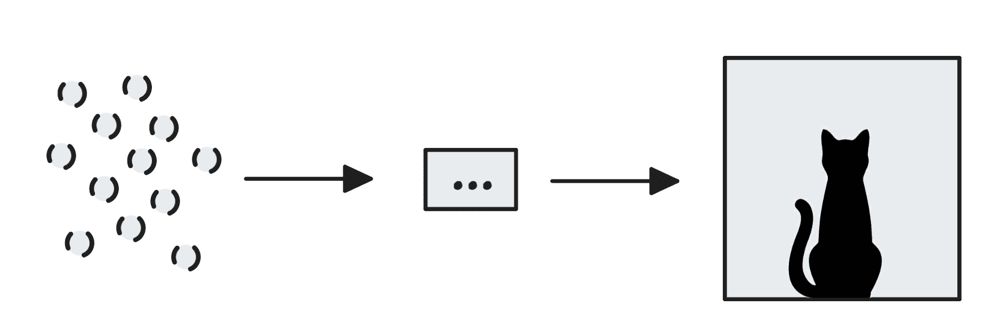

简化的扩散过程 | 图片由作者提供

有些人称之为从噪声中创造艺术。

这里有几个部分在这里扮演着重要的角色。

我们有基础模型本身，CLIP 模型，它将我们的提示转换为模型可以处理的内容（即嵌入），以及一个自动编码器，它解码处理过程的输出，给我们一个可以使用的成品图像。

当与 MidJourney 等高级 UI 一起工作时，你不会参与这个过程，但在 ComfyUI 中，你拥有更多的控制权。

### 设置 ComfyUI

现在这部分有点棘手。如果你有好的硬件，那么这仅仅是将其安装在电脑上。你可以查看这个 [指南](https://stable-diffusion-art.com/how-to-install-comfyui/) 了解 Windows 和 Mac 的安装方法。

然而，在没有 GPU 的 MacBook 上使用 ComfyUI 会很慢。如果你像我一样没有耐心，你需要一个 GPU。

[这里](https://github.com/ilsilfverskiold/Awesome-LLM-Resources-List/blob/main/img-gen/README.md#running-comfyui)有几个选项可用，我在这里概述了它们。

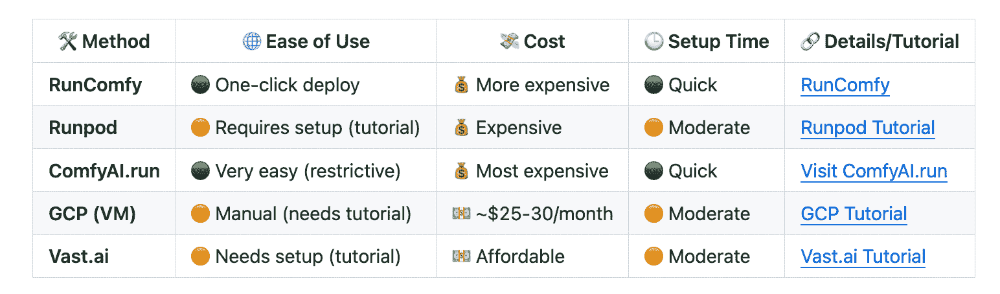

托管 ComfyUI 的不同选择，请在此处查看列表 [此处](https://github.com/ilsilfverskiold/Awesome-LLM-Resources-List/blob/main/img-gen/README.md#running-comfyui) | 图片由作者提供

我不想推荐任何特定的一个，但有些可以在几分钟内让你开始使用，这对于开始阶段来说很理想。不幸的是，这每小时大约需要花费 0.99 美元，相当昂贵。

一旦你开始每天使用它，我会推荐寻找更好、更经济的选项。我从未热衷于拥有高端硬件，但这一点确实在改变。

### 布局

我假设你已经找到了运行 ComfyUI 的方法，但如果还没有，并且你只想尝试这个下一部分的内容画布，请[点击此处](https://comfyai.run)。*这个网站将让你免费运行更简单的内容（尽管你将被放入队列中，所以可能非常慢）。*

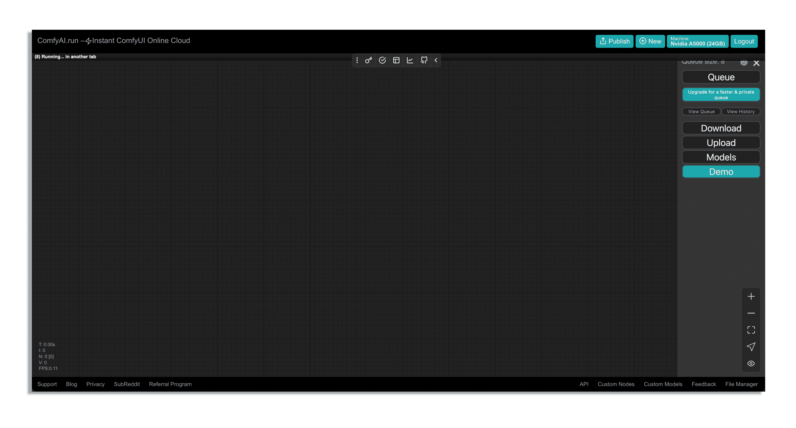

如果你正在运行基于网络的 ComfyUI，它看起来会是这样 | 图片由作者提供

一旦你面前出现一个空白的黑色屏幕，可能会感到有些令人畏惧。不过，开始起来很容易，你不需要了解这个工具的每一个部分就能使用它。

关键是要知道，**左键双击**可以让你搜索要添加到工作流程中的节点。

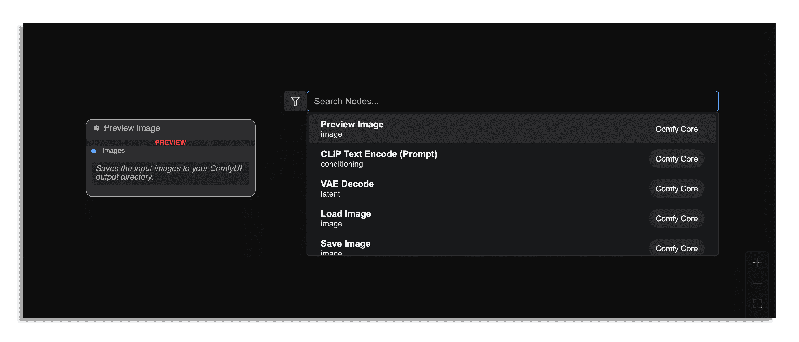

在 ComfyUI 中左键双击搜索 | 图片由作者提供

要加载一个模型，你只需找到 **加载检查点**节点。

当通过 **加载检查点**节点使用模型时，你首先需要下载它们并将它们放置在 `models` 目录中以访问它们。同样适用于其他模型，如 LoRAs、ControlNets 等（我们稍后会介绍）。

你需要将你使用的所有模型放在 ComfyUI 的 `models` 目录中。

如果你使用的是托管提供商，如上面提到的，它通常会帮助你加载那些初始模型。

你还应该知道，工作流程可以很容易地通过 JSON 文件下载和上传。你只需将工作流程的 JSON 粘贴到画布中即可。

如果你需要安装或更新自定义节点，你需要访问 **ComfyUI 管理器**。对于由于缺少节点而抛出错误的流程，你将在这里搜索并安装或更新它们。

在进行我们的用例之前，我们将通过一个简单的 **Stable Diffusion** 工作流程和一个 **Flux** 工作流程进行说明。

### 关键构建块

我想将这部分图像生成的工作原理联系起来，使其更有意义。

你可能会觉得这个过程过于复杂，但我们设置整个流程是有原因的，这样我们就可以在需要时将其分解，做一些真正酷的事情。

我们将添加的第一个节点是上面提到的加载检查点。

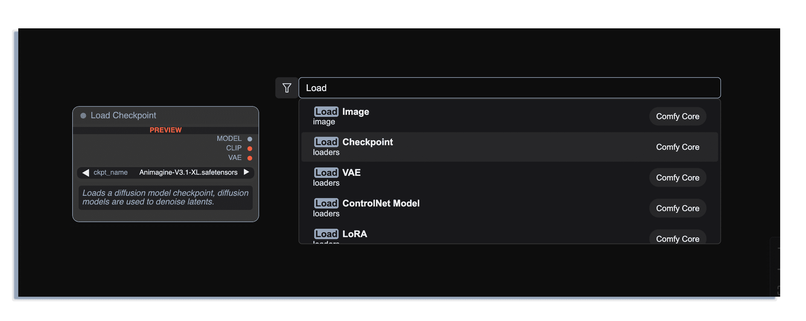

在 ComfyUI 中搜索“加载检查点” | 图片由作者提供

这是加载模型（检查点）及其相关组件的关键节点，例如 **CLIP 模型**，它是一个文本编码器，将我们的提示转换为模型可以理解的内容。

它还提供了嵌入在检查点中的 **VAE（变分自编码器**），在编码期间将图像压缩到潜在空间，在解码期间将其扩展回全分辨率。

你可以单独加载所有这些，我们稍后会为 Flux 做同样的事情。

显然，检查点是流程的骨干。可能对你来说新鲜的是直接处理 CLIP 和 VAE，这在使用 MidJourney 等高级系统时是隐藏的。

如果你感到不知所措，不要担心，很快就会明白。

之后，我们需要通过搜索找到两个 **CLIP 文本编码（提示）**节点。我们需要一个用于 **正面提示**，另一个用于 **负面提示**。

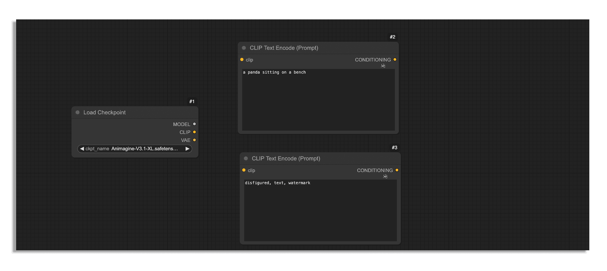

设置你的正负提示 | 作者图片

这应该很明显，但在一个提示中，你会写你 **想要** 的内容，在第二个提示中，你会写你 **不想要** 的内容。

如果你右键点击这些节点，你可以更改它们的颜色和标题，以便更容易区分。

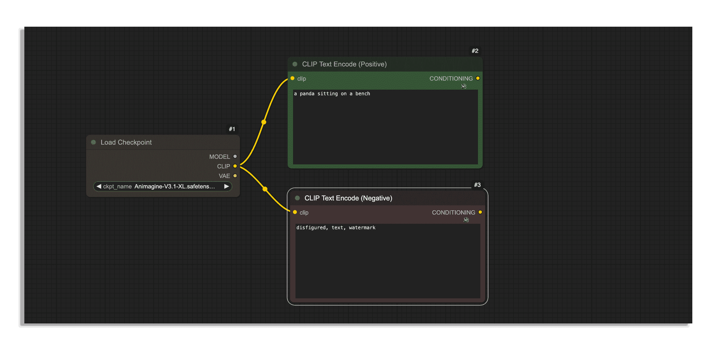

更改提示的颜色 | 作者图片

我们还将直接将 **CLIP 模型** 连接到提示。此模型将文本转换为向量（一种数学表示），引导模型如何塑造图像。

接下来，我们需要添加一个 **空潜在图像** 节点。此节点创建一个在潜在空间中填充随机噪声的“空”潜在图像，它将是扩散过程的起点。

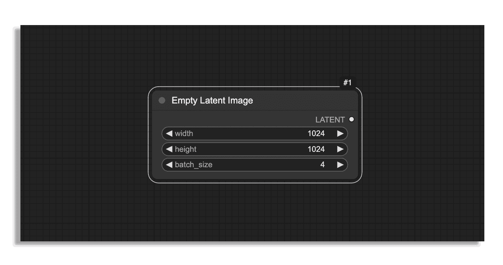

此节点创建一个“空”的潜在图像 | 作者图片

你可以通过此节点设置你想要生成的图像的尺寸和批处理大小。

一旦所有这些节点都设置好了，我们也会添加 **KSampler**。

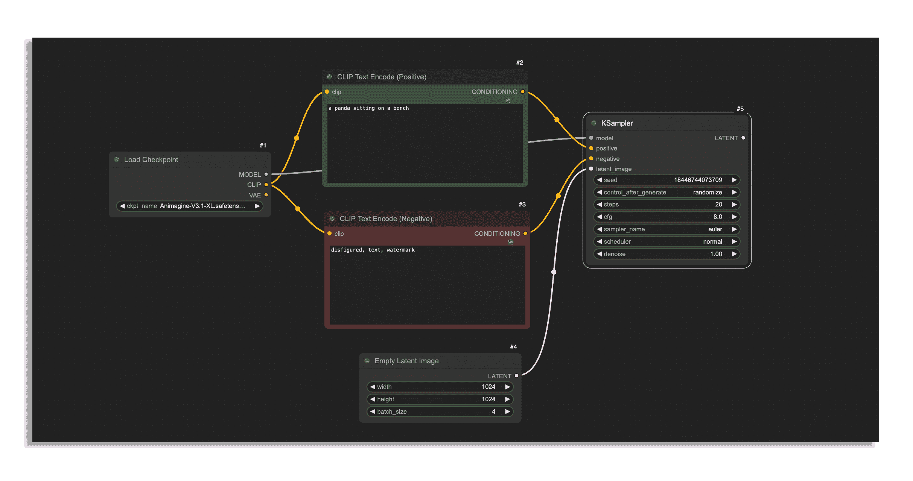

连接所有节点 | 作者图片

KSampler 协调整个去噪过程，即它将随机噪声转换为我们生成图像的潜在表示。

对于这个，你可以保持设置不变，除非可能设置一个随机种子。

确保将模型、正负提示和潜在图像连接到 **KSampler**（见上图）。

> 如果你愿意，可以使用自定义采样器，但第一次使用时，最好坚持使用现成的工具。

一旦所有这些节点都设置好了，我们就需要将 KSampler 生成的最终潜在表示解码成全分辨率图像。

**VAE 解码** 节点将处理这个问题，所以请确保也添加那个节点。

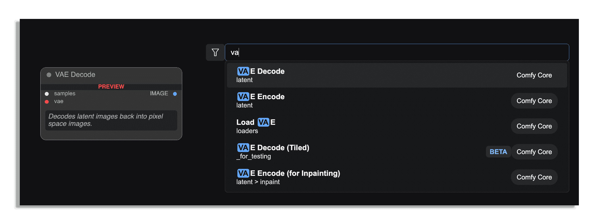

在 ComfyUI 中搜索 VAE 解码节点 | 作者图片

在处理完成后保存图像，我们将添加 ComfyUI 提供的 **保存图像** 节点。

完成的工作流程将看起来像这样。

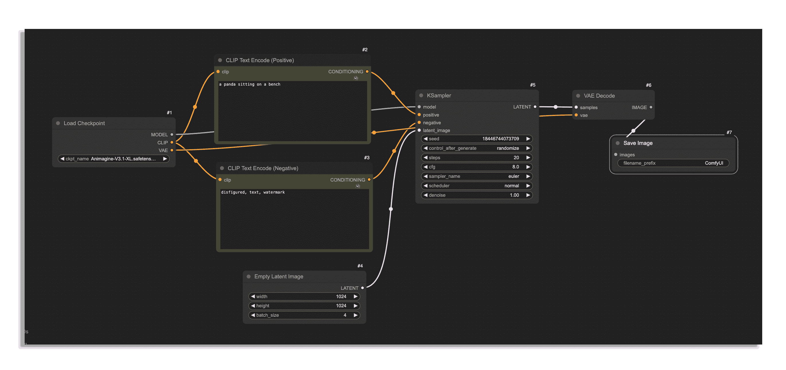

确保在 ComfyUI 中所有节点都已连接 | 作者图片

你可以通过简单地按 **队列** 来运行工作流程。

图像将出现在 **保存图像** 节点中。

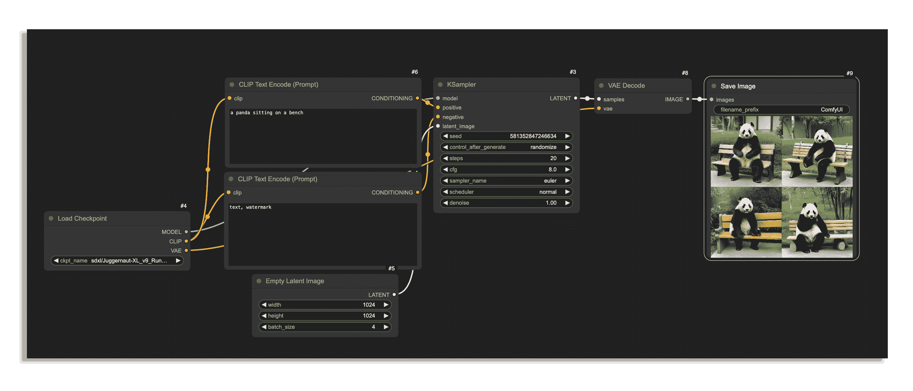

在 ComfyUI 中使用 SD 的标准工作流程结果 | 作者图片

我有四张图片，因为我将 **空潜在图像** 节点中的批处理大小设置为 4。你的图片可能因使用的模型而异。

*我们将在下一节中介绍检查点的工作原理。*

这是你通常在第一次加载 ComfyUI 时获得的标准初学者工作流程。

如果你想要使用**Flux 模型**，你需要做一些调整。

首先，分别加载模型、**CLIP**和**VAE**。你还需要两个**CLIP**模型和**FluxGuidance**节点。

你将在下面看到一个可以遵循的 Flux 示例。

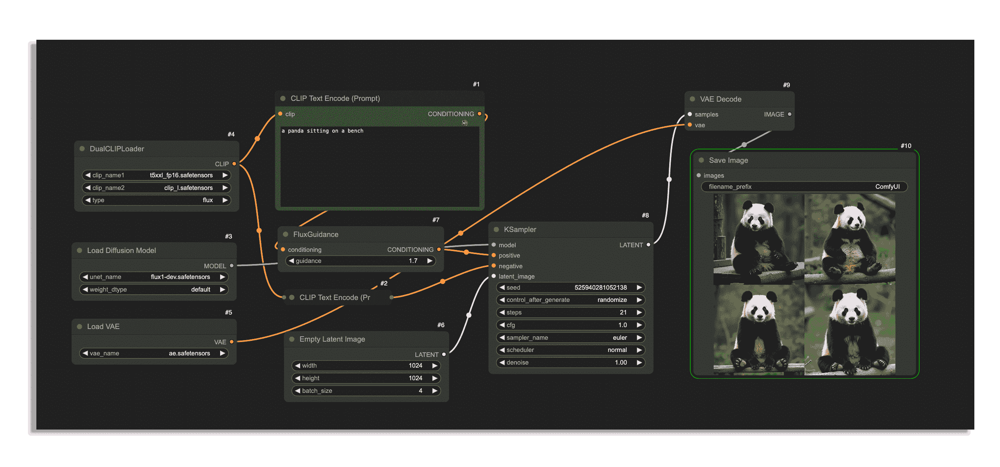

使用 ComfyUI 中的 Flux 的标准工作流程的结果 | 图片由作者提供

Flux 被构建为使用**标准 CLIP 模型**和**T5 语言模型分词器**来读取提示，这就是为什么我们在这里加载两个 CLIP 模型而不是一个。这据说赋予了 Flux 优越的提示跟随能力。

**FluxGuidance**不是必需的，但它有助于文本编码器将你的图像生成推向你的提示方向更远一些。它应该会提高模型遵循你的提示的效果。

你可以从 1.0 设置到 100，我强烈建议你尝试一下。

现在，如果你对深入了解更基础的方面感兴趣，我推荐[这个](https://www.youtube.com/watch?v=_C7kR2TFIX0)教程。这个工具的美丽之处在于你可以真正控制你想要生成的图像。

### 模型检查点和 LoRAs

正如我们在学习基础知识时看到的，如果你使用任何 ComfyUI 托管服务，当你添加**加载检查点**节点时，你可能会看到一些可用的模型。

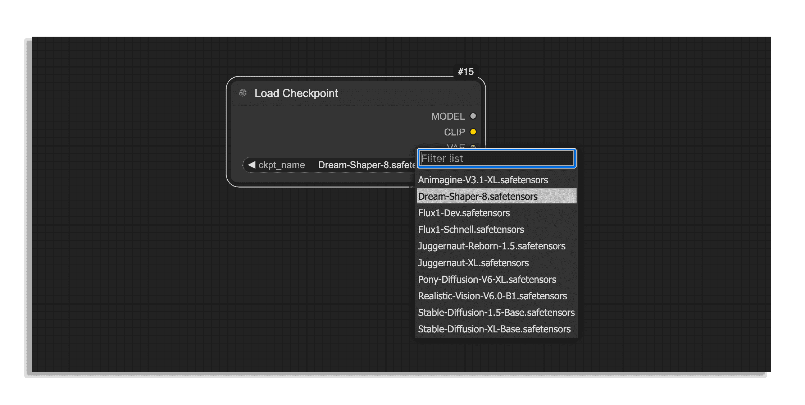

ComfyUI 中检查点节点中的可用模型 | 图片由作者提供

如果你已经在本地上安装了 ComfyUI，你需要找到`modelscheckpoints`文件夹，将你想要的模型放在那里，然后重新加载 UI 以在下拉菜单中看到它们。

如果你刚开始使用 ComfyUI，你可能想知道如何找到这些模型以及应该放置什么类型的文件。在寻找模型时，你可以使用[HuggingFace](https://huggingface.co/models?pipeline_tag=text-to-image&sort=trending)和[Civitai](https://civitai.com/models)。

以下是如何通过访问[Civitai](https://civitai.com/models)的模型页面并筛选检查点来查找检查点的说明。

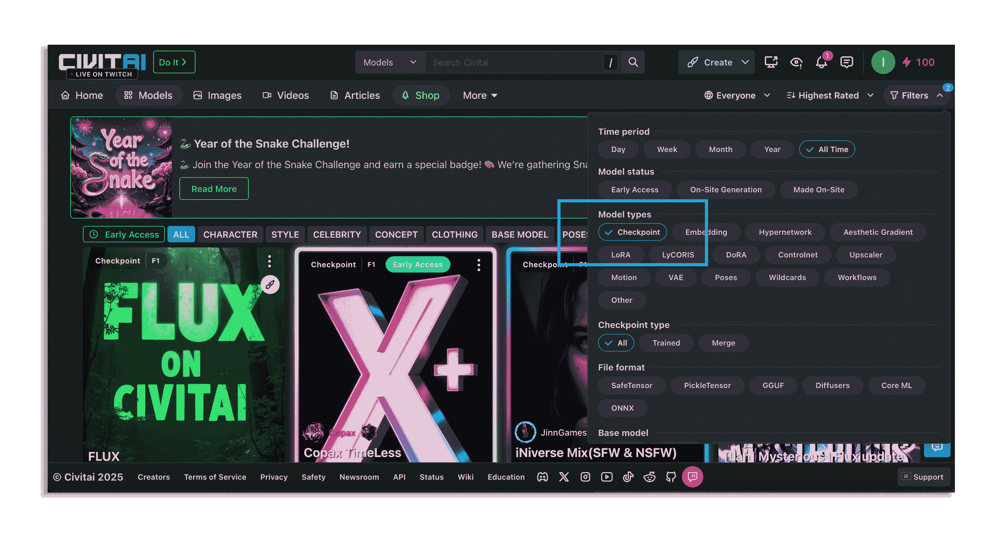

在 Civicai 中查找检查点 | 图片由作者提供

模型相当大。如果你感到困惑，我[这里](https://github.com/ilsilfverskiold/Awesome-LLM-Resources-List/tree/main/img-gen#popular-checkpoints)整理了一些流行的检查点。你寻找的文件将具有**.safetensors**作为文件扩展名。

一旦找到你想要的，就下载它并将其放置在 ComfyUI 中的`modelscheckpoints`目录下。是的，这取决于你的硬件和连接速度，可能需要相当长的时间。

这将我们带到了下一个主题：**LoRA**。

LoRAs（低秩自适应）在尺寸上要小得多，并且可以附加到不同的检查点。它们是模型的一个微调附加组件。将基础模型（检查点）想象成建造房子的蓝图。LoRA 就像在不改变房子本身结构的情况下添加定制油漆。

每个 LoRA 都有自己的指令，所以请务必阅读模型页面了解其使用方法。有时你需要使用触发词或其他关键词在提示中才能使其工作得更好。

添加 LoRA 相当简单。你找到一个你喜欢的——就像我们寻找检查点一样——下载它，并将其粘贴到`modelsloras`目录中。如果你重新加载 ComfyUI，你应该能在**加载 LoRA**节点的下拉菜单中看到它。

> **注意**：你可以微调自己的 LoRA，但你现在需要自己寻找资源来做到这一点。

下面是如何简单地添加**加载 LoRA**节点，设置**lora_name**（基于我下载的 LoRA），然后将其连接到检查点和 CLIP 模型。

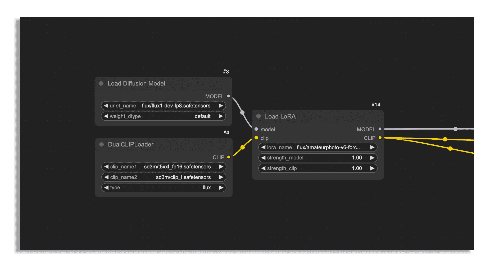

在 ComfyUI 中添加 LoRA 到工作流程 | 图片由作者提供

如果我们查看之前的 Flux 工作流程，添加**AmateurPhoto LoRA**将导致一个完成的工作流程，看起来像下面这样。

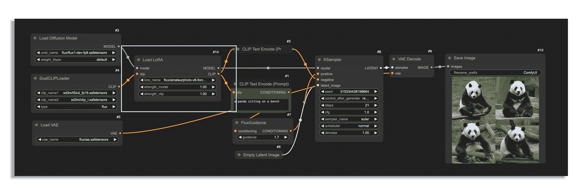

在 ComfyUI 中添加 LoRA 到工作流程 | 图片由作者提供

这里的唯一变化是 LoRA 节点，现在模型和 CLIP 都通过它进行。如果我们运行它，我们会看到现在我们得到了一个更加逼真的熊猫，这是通过这个 LoRA 实现的。

基于不同模型有许多流行的 LoRA。是的，LoRA 需要与基础模型兼容，你不能混合它们。这意味着如果你使用 Flux Dev 作为基础，你将寻找专门为 Flux Dev 设计的 LoRA。

### 关键技术（你希望使用的技术）

基础知识，就像我们刚才讨论的那样，涉及使用普通的检查点模型以及 LoRA 进行风格化。*但这个空间之所以如此出色，是因为它超出了这个范围。*

这一部分是关于**控制网**和**IP 适配器**。

ControlNet 和其他条件模型允许你根据边缘、深度图、涂鸦或图像的姿态更精确地引导图像生成过程。

你可以看到我正在测试使用 Canny 边缘检测、深度图和姿态图处理狗的图像的几个选项。

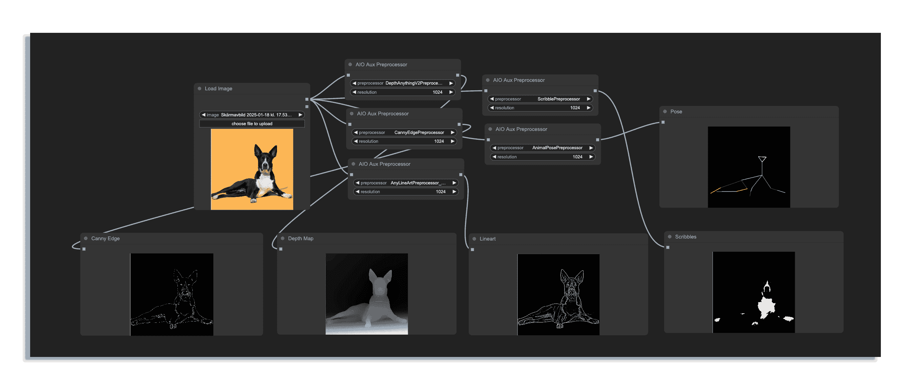

测试不同 Controlnet 选项的狗的图像 | 图片由作者提供

有几个输入选项，但你需要能够正确处理这些输入以生成图像的特定模型。

例如，如果我们使用与兼容的 ControlNet 模型匹配的狗的 Canny 边缘，生成的图像将遵循轮廓，同时有自由解释其他一切，如颜色和纹理。

> 这就是为什么选择一个拥有强大社区支持的基础模型很重要，这样你将有大量的好 ControlNet 模型可供选择。

**IP 适配器**（图像提示适配器）模型，另一方面，可以被视为 1 图像 LoRAs。如果你对 LoRAs 仍然感到困惑，那么可以将它们视为图像提示。它们将参考图像的风格转移到新图像上。因此，IP 适配器让你能够转移风格、合并图像和模仿面部等元素。

我收集了一些关于 ControlNets 和 IP 适配器的[指南](https://github.com/ilsilfverskiold/Awesome-LLM-Resources-List/tree/main/img-gen#learning-resources)，这些指南有助于理解基础知识。我还包括了每个适配器中流行的模型，按照基础模型组织，在同一[仓库](https://github.com/ilsilfverskiold/Awesome-LLM-Resources-List/tree/main/img-gen#popular-technologies)中。

除了这两种技术之外，还有更多流行的技术，如修复、扩展、上采样和分割。我发现这些技术更容易理解。

你可以看到我组织下方的表格，其中包含每种技术。

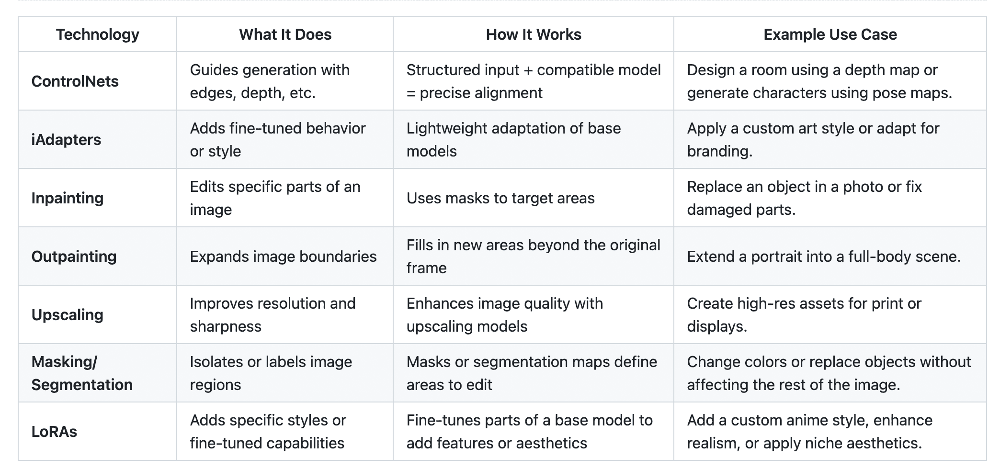

不同的技术和它们的功能，请查看[这里](https://github.com/ilsilfverskiold/Awesome-LLM-Resources-List/blob/main/img-gen/README.md#popular-technologies) | 图片由作者提供

一些技术并不总是需要特定的模型，但为了获得良好的结果，建议使用一个。

尽管如此，这项技术确实让我们能够做一些非常酷的事情。

你可以将品牌风格和标志转移到新图像上。你可以将产品放置在新生成的具有不同节日主题的社交媒体图像中。你也可以将公司照片变成卡通。

我在同一[仓库](https://github.com/ilsilfverskiold/Awesome-LLM-Resources-List/tree/main/img-gen#example-use-case-w-said-tech)中收集了一些用例和相关技术。这个领域有很多创意，我们将在未来几年内看到它的增长。

对于本文中的用例，我们需要查看可用的工具，因为我想要使用 Flux。

### Flux 工具

正如我之前提到的，我们受限于每个基础模型可用的 ControlNets 和 IP 适配器。这些适配器可以由原始创建者或社区创建。

由于 Flux 是在 2024 年发布的，它没有像 Stable Diffusion 1.5 那样的社区支持。然而，[这里](https://github.com/ilsilfverskiold/Awesome-LLM-Resources-List/tree/main/img-gen#controlnet-models)仍然有一些非官方的 Flux 选项。你可以在同一仓库中查看一些选项。

话虽如此，在 2024 年 11 月，Flux 的创造者——黑森林实验室发布了几个名为**Flux Tools**的新模型，以帮助控制和引导图像使用 FLUX.1。

这些工具是 Flux 的官方 ControlNet 和 IP 适配器[模型](https://blackforestlabs.ai/flux-1-tools/)。总共发布了四个新模型：**Canny、Depth、Fill 和 Redux**。

现在，我不知道是否建议您将这些用于生产用例，因为它们可能没有 SD 1.5 或 SDXL 的 ControlNets 具有相同的结果质量。我对此做了一些研究，社区发现它们很难使用，并指出它们仍然不可靠。

但我决定无论如何都要为我们将要创建的室内设计师工作流程选择一个。如果您没有得到想要的结果，请不要气馁，只需继续构建。

### 构建室内设计师

我已经完成了这个工作流程，您可以在[这里](https://github.com/ilsilfverskiold/Awesome-LLM-Resources-List/blob/main/img-gen/comfyui/interior_designer.json)找到它。您完全可以简单地加载并运行它，但这个练习的目的是让您自己学习。

我们将使用深度图，以便模型理解家具和空间应该如何看起来。

为了测试成品，我会抓取一个通用的卧室图像。*见下文*。

IKEA 提供的卧室通用图像

我们将立即查看结果，这样您就可以了解您可以通过简单的流程实现什么。

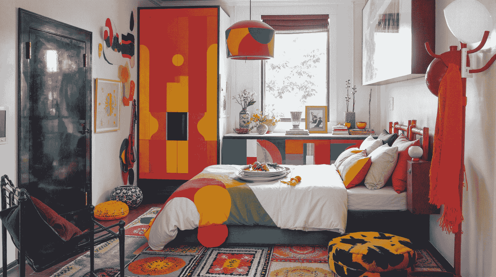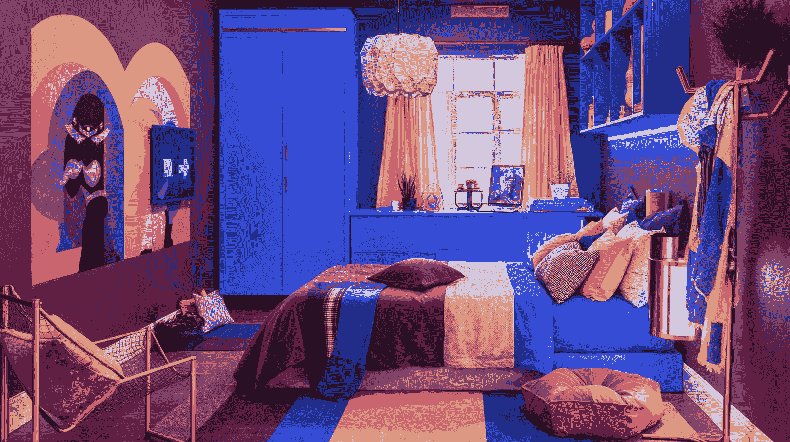

使用 Flux 工作流程和不同风格生成的 AI 图像

使用 Flux 工作流程和不同风格生成的 AI 图像

使用 Flux 生成的斯堪的纳维亚风格的 AI 图像

使用 Flux 工作流程和不同风格生成 AI 图像

我只是在这里提示，同时添加了一些通用的 LoRAs，从基础图像中获取这些图像。

我相信人们会在某个时候开始基于之前的工作构建室内设计师 LoRAs。这对当前的设计师来说也是一个可怕的可能性，但希望他们能利用它来为自己谋利。

### 创建深度图

我们首先需要做的是在 ComfyUI 中加载一个新的空白画布，并确保你有足够的 VRAM 来运行这个工作流程。

*我建议使用 24GB 的 VRAM 和 48GB 的 RAM（取决于你是否添加了 LoRA）。*

接下来，我们需要添加 **加载图像** 节点和 **[AIO 辅助预处理](https://github.com/Fannovel16/comfyui_controlnet_aux)** 节点。此节点将帮助对图像进行预处理，以用于 canny 或深度。

你可以看到下面的示例，我测试了 canny 和深度。

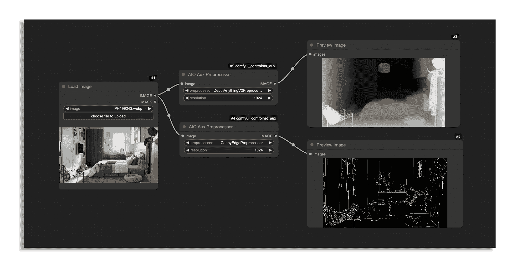

在 ComfyUI 中测试深度和 canny | 图片由作者提供

解释来说，这些图像将帮助我们生成遵循深度图或 canny 边缘的 AI 图像。你可以使用特定的深度和 canny 节点，但我更喜欢使用上面的 **DepthAnythingv2** 预处理器来处理深度。

你可以选择在这里使用 canny 而不是深度，但我发现官方的 Canny Flux 模型并不那么出色。

如果你想要使用 canny 和 Flux，请查看[这个](https://github.com/ilsilfverskiold/Awesome-LLM-Resources-List/tree/main/img-gen#controlnet-models)列表，其中包含你可以尝试的非官方模型。

在我们继续之前，你可以移除 canny 边缘处理器。

### 模型

从这里开始，我们将遵循之前为 Flux 执行的相同步骤。添加 **加载扩散模型**、**DualCLIPLoader** 和 **加载 VAE** 节点。

*记住左键双击以搜索这些节点。*

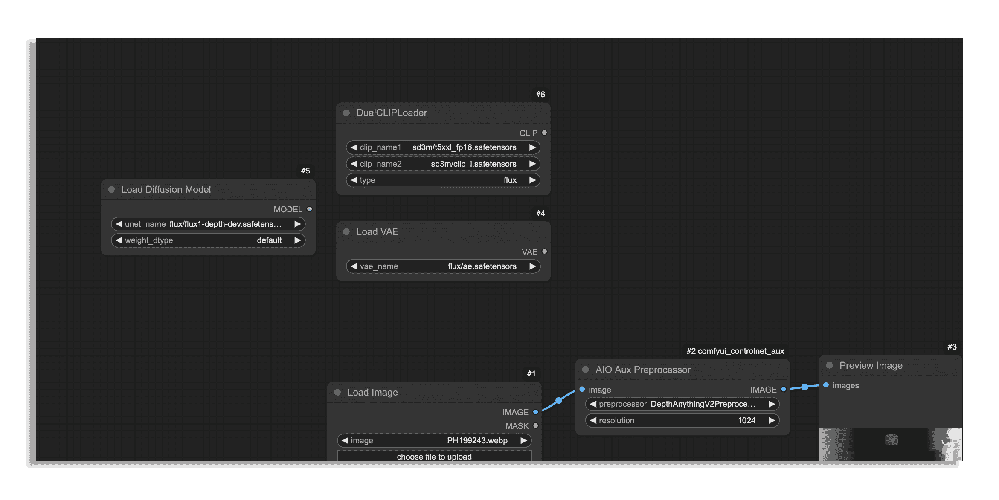

在 ComfyUI 中添加第一个节点 | 图片由作者提供

对于 **加载扩散模型** 节点，你需要一个新的名为 **flux1-depth-dev** 的模型。如果你还没有下载，你可以在[这里](https://example.org)找到它。如果你使用的是 canny 图像，你需要 **flux1-canny-dev** 模型。

记住，这些模型是专门设计来处理深度和 canny 图像的。没有它们，你将无法以相同的方式控制输出。

对于 **CLIP 模型**，你需要两个模型。参考图片以确定是哪些模型——它们是我们之前简单 Flux 工作流程中使用的相同模型。你可以在[这里](https://example.org)找到它们。

如果有任何东西缺失，你会得到一个错误，并且你需要找到缺失的模型并将其放置在正确的文件夹中。在这里你不必使用两个 CLIP，但这是推荐的。

### 提示

接下来，你需要设置一个积极的提示和一个消极的提示（尽管 Flux 似乎忽略了消极提示）。

你需要指定你想要的设计，因此提示将非常重要。去看看人们是如何提示来设计空间的。

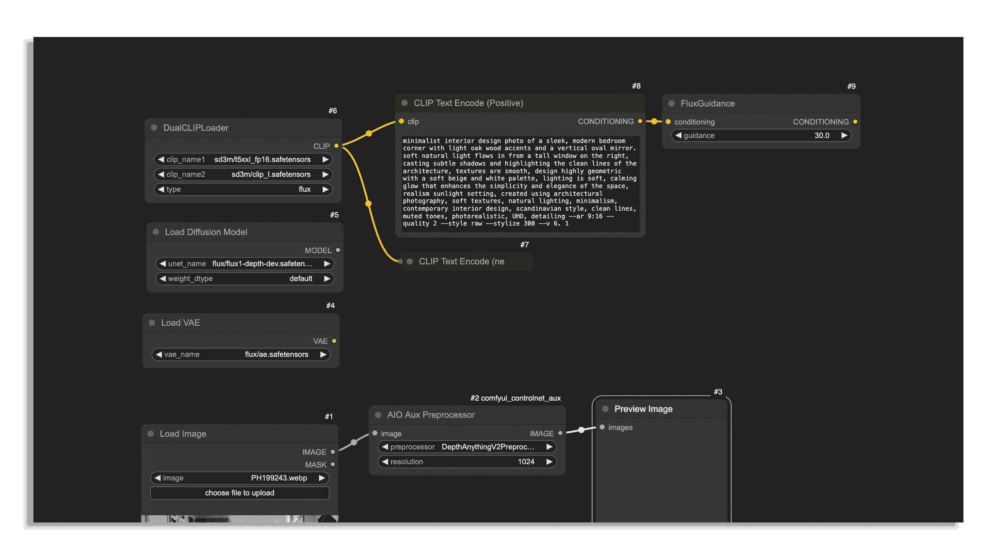

在 ComfyUI 中添加文本提示 | 图片由作者提供

如果你想要使用它，你可以使用[这个](https://github.com/ilsilfverskiold/Awesome-LLM-Resources-List/blob/main/img-gen/comfyui/interior_designer.json)工作流程来加载我精确的提示。

### 连接深度图

接下来，我们将添加一个之前未使用的新节点，称为**[Instruct Pix to Pix Conditioning](https://github.com/timothybrooks/instruct-pix2pix)**。此节点便于对图像到图像翻译任务进行精确控制，从而实现条件化。

> 你在这里可以使用**ControlNet**节点，但我没有尝试过。

我们将深度图像连接到标有**‘pixels’**的端口，然后将剩余的节点连接到它。

确保正确操作，请查看下面的图片。

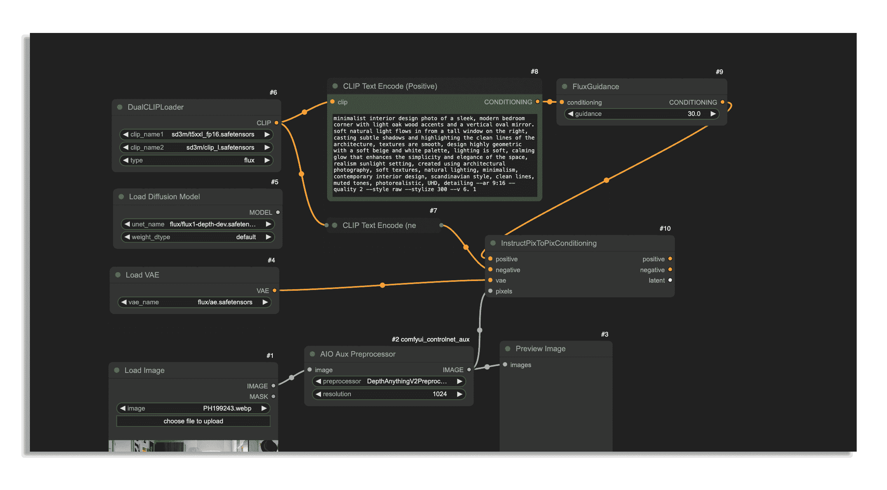

在 ComfyUI 中添加**Instruct Pix to Pix Conditioning**节点 | 图片由作者提供

从这里，我们可以遵循之前工作流程中的相同步骤，将所有节点连接到**KSampler**。

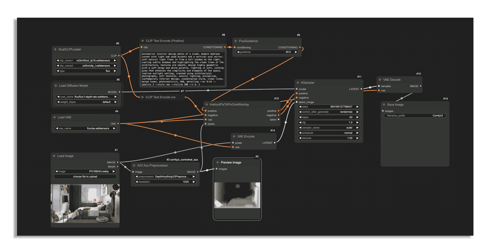

连接所有节点 | 图片由作者提供

我设置了一个随机种子并将步骤增加到 40，这应该会提高生成图像的质量。

我们还使用了一个**VAE Encode**节点。虽然这不是严格必要的，但我使用原始图像的尺寸作为潜在值，这有助于略微提高图像质量。

你可以从这里运行它。

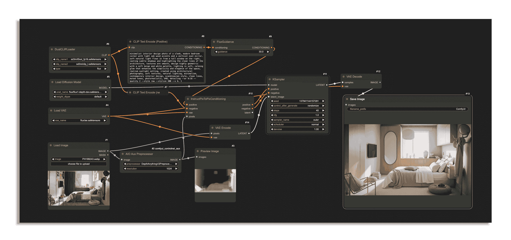

在 ComfyUI 中运行工作流程 | 图片由作者提供

你应该在**保存图像**节点中看到新图像。我还添加了一个**LoRA**。

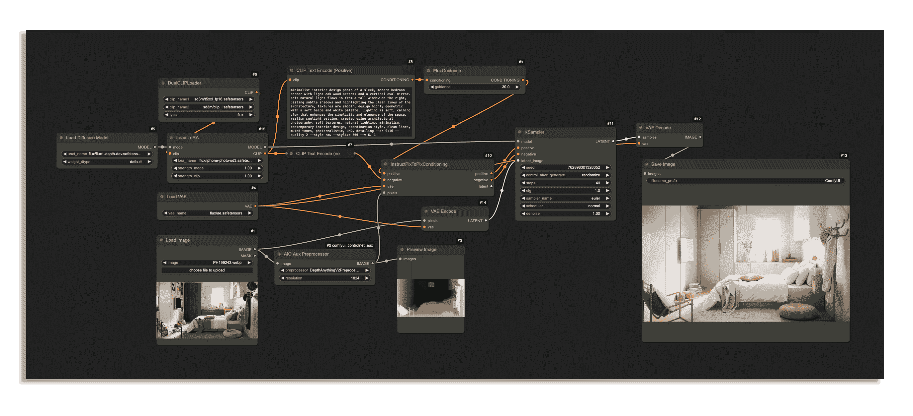

在 ComfyUI 中添加 LoRA 到工作流程 | 图片由作者提供

参考上一节了解如何查找 LoRAs。在这个例子中，我使用的是**iPhone Photo LoRA**，它相当受欢迎。

现在，我建议尝试不同的图像、提示和 LoRAs，看看你能实现什么。提示非常重要，所以不要低估它的重要性。

你可以向上滚动再次查看我的结果。

### 备注

从这里开始，你理想上可以在此基础上构建，例如，接收一个图像，然后使用视觉模型来分析布局并根据用户的请求自动生成提示。

当你完全使用提示和深度图来解释内部时，你会得到最佳结果。

你可能还想将此工作流程部署为 API，以便更容易使用。我肯定会在这篇未来的文章中涵盖这一点。

* * *

我希望你能得到一些灵感。如果你想看到更多，请点赞。

❤
