# 通过深度神经网络学习如何玩 Atari 游戏

> 原文：[`towardsdatascience.com/learning-how-to-play-atari-games-through-deep-neural-networks/`](https://towardsdatascience.com/learning-how-to-play-atari-games-through-deep-neural-networks/)

1959 年 7 月，Arthur Samuel 开发了一个最早的玩跳棋的**智能体**。一个能够玩跳棋的智能体的构成可以用 Samuel 自己的话来最好地描述，即“一台计算机，可以被编程以学会玩比编写程序的人更好的跳棋” [1]。跳棋智能体试图遵循模拟所有可能移动的**当前情况**并选择最**有利**的一个，即最接近获胜的移动。移动的“有利性”由一个评估函数决定，智能体通过经验来改进这个评估函数。自然地，智能体的概念并不局限于跳棋游戏，许多从业者都试图在流行的游戏中达到或超越人类的表现。值得注意的例子包括 IBM 的**Deep Blue**（当时成功击败了世界象棋冠军 Garry Kasparov），以及 Tesauro 的**TD-Gammon**，这是一种**时间差分**方法，其中评估函数使用神经网络进行建模。事实上，**TD-Gammon**的玩法如此罕见，以至于一些专家甚至采用了它所提出的某些策略 [2]。

毫不奇怪，对创建这种“智能体”的研究仅是飞速增长，新颖的方法能够在复杂的游戏中达到人类巅峰表现。在这篇文章中，我们将探讨其中一种方法：2013 年由 Mnih 等人提出的**DQN**方法，该方法通过**深度神经网络**和**TD-Learning**的融合来玩 Atari 游戏（**注意**：原始论文于 2013 年发表，但我们将关注 2015 年的版本，它包含一些技术改进）[3, 4]。在我们继续之前，你应该注意，在不断扩大的新方法空间中，DQN 已经被更快、更精细的先进方法所取代。然而，它仍然是**深度强化学习**领域的一个理想的垫脚石，深度学习与强化学习的结合得到了广泛的认可。因此，那些想要深入研究深度强化学习（Deep-RL）的读者被鼓励从 DQN 开始。

本文分为以下几部分：首先，我定义了玩 Atari 游戏的问题，并解释了为什么一些传统方法可能难以处理。最后，我将详细介绍 DQN 方法的具体内容，并深入探讨其技术实现。

## 当前的问题

在本文的剩余部分，我将假设您已经了解了监督学习、神经网络（基本[*FFNs*](https://d2l.ai/chapter_multilayer-perceptrons/index.html)和[*CNNs*](https://d2l.ai/chapter_convolutional-neural-networks/)）以及基本的强化学习概念（贝尔曼方程、TD 学习、Q 学习等）。如果您对其中的一些强化学习概念感到陌生，那么这个[*播放列表*](https://www.youtube.com/watch?v=NFo9v_yKQXA&list=PLzvYlJMoZ02Dxtwe-MmH4nOB5jYlMGBjr&ab_channel=MutualInformation)是一个很好的介绍。

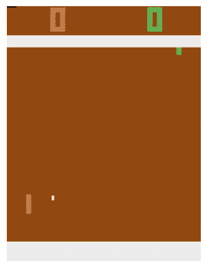

图 2：在 ALE 环境中显示的乒乓。[以下所有媒体均由作者创建，除非另有说明]

*Atari*是一个充满怀旧感的术语，包括像*乒乓、Breakout、Asteroids*等标志性游戏以及更多。在这篇文章中，我们将限制自己只讨论乒乓。乒乓是一款两人游戏，每位玩家控制一个拍子，可以使用这个拍子来击打 incoming 球。当对手无法回球时，即球越过他们时，得一分。当玩家达到 21 分时，他们获胜。

考虑到游戏的顺序性，将问题表述为强化学习问题并应用解决方案之一可能是合适的。我们可以将游戏表述为马尔可夫决策过程（MDP）：

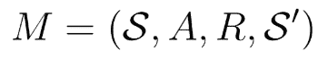

状态将代表当前游戏状态（球或玩家拍子的位置等，类似于搜索状态的概念）。奖励封装了我们的获胜想法，而动作对应于 Atari 2600 控制台上的按钮。我们的目标现在变成了找到一种策略

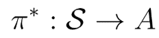

也称为*最优策略*。让我们看看如果我们尝试使用一些经典的强化学习算法来训练一个智能体，可能会发生什么。

一个直接的方法可能是使用表格方法来解决问题。我们可以列举所有状态（和动作），并将每个状态与相应的状态或状态-动作值相关联。然后我们可以应用经典强化学习方法之一（蒙特卡洛、TD 学习、值迭代等），采用动态规划方法。然而，采用这种方法很快就会面临巨大的陷阱。我们将什么视为状态？我们需要列举多少个状态？

很快就会变得非常难以回答这些问题。定义状态变得困难，因为在考虑状态的概念时，有很多元素在起作用（即，状态需要是马尔可夫的，封装搜索状态等）。那么，用视觉输出（帧）来表示状态怎么办？毕竟这是我们作为人类与 Atari 游戏互动的方式。我们看到帧，推断有关游戏状态的信息，然后选择适当的动作。然而，使用这种表示方法时，状态的数量是难以想象的，这将使我们的表格方法在内存上变得难以处理。

现在为了辩论的目的，假设我们有足够的内存来存储这个大小的表格。即使如此，我们仍然需要多次探索所有状态以获得价值函数的良好近似。我们需要足够地探索所有可能的状态（或状态-动作）以获得有用的价值。这就是运行时障碍；由于我们有无限的状态，要在合理的时间内使表格中所有状态的价值收敛几乎是不可能的。

也许我们可以将其重新表述为一个监督学习问题，而不是强化学习问题？也许是一种状态为样本、标签为执行的动作的表述。即使这种观点也带来了新的问题。Atari 游戏本质上是序列的，每个状态都是基于前一个状态采样的。这打破了监督学习中应用的独立同分布（i.i.d）假设，对基于监督学习的解决方案产生了负面影响。同样，我们可能需要创建一个手工标注的数据集，可能需要雇佣一个人类专家为每个帧标注动作。这将既昂贵又费时，而且可能仍然产生不充分的结果。

单独依赖监督学习或强化学习可能会导致学习效率低下，无论是由于计算限制还是次优策略。这要求我们采取更有效的方法来解决 Atari 游戏。

## DQN：直觉与实现

*我假设您对 PyTorch、Numpy 和 Python 有一些基本了解，尽管我会尽量表达得尽可能清晰。对于那些不熟悉这些的人，我建议查阅：[*pytorch*](https://pytorch.org/tutorials/beginner/deep_learning_60min_blitz.html) 和 [*numpy*](https://numpy.org/devdocs/user/absolute_beginners.html)。*

深度 Q 网络（Deep-Q Networks）旨在通过各种技术克服上述障碍。让我们一步步分析每个问题，并探讨 DQN 如何缓解或解决这些挑战。

由于 Atari 游戏的多样性，很难为它们提供一个正式的状态定义。DQN 被设计为适用于大多数 Atari 游戏，因此我们需要一个与这些游戏兼容的正式化表述。为此，任何给定时刻游戏的视觉表示（像素值）被用来构建状态。自然地，这涉及到一个连续的状态空间。这与我们之前讨论的表示状态的可能方法相联系。

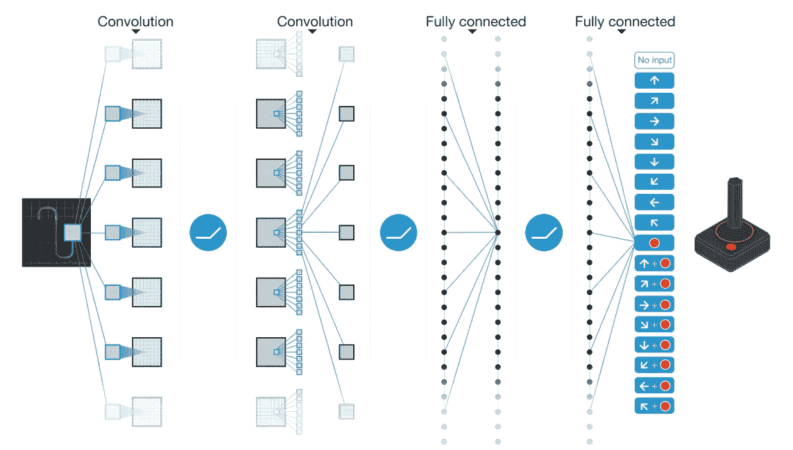

图 3：函数逼近的可视化。图片来自[3]。

连续状态的挑战通过 *函数逼近* 解决。函数逼近（FA）旨在直接使用函数逼近来近似状态-动作价值函数。让我们通过步骤来了解 FA 做了什么。

想象一下，我们有一个网络，给定一个状态，输出处于该状态并执行特定动作的价值。然后我们根据最高的奖励选择动作。然而，这个网络是短视的，只考虑了一个时间步。我们能否结合未来可能的奖励？是的，我们可以！这就是期望回报的概念。从这个角度来看，FA 变得相当容易理解；我们的目标是找到一个函数：

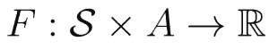

换句话说，一个输出在执行动作后处于给定状态的期望回报的函数**。**

由于状态空间是连续的，这种近似的思想变得至关重要。通过使用 FA（函数近似），我们可以利用泛化的思想。相邻的状态（相似的像素值）将具有相似的价值函数（Q-values），这意味着我们不需要覆盖整个（无限的）状态空间，从而大大降低我们的计算开销。

DQN 结合了 Q-learning 使用 FA。作为一个小的复习，Q-learning 旨在使用自举（bootstrapping）找到处于某个状态并执行特定动作的期望回报。自举使用当前的 Q 函数来模拟我们之前提到的期望回报。这确保了我们在一个剧集结束时不需要等待来更新我们的 Q 函数。Q-learning 也是**离线策略**，这意味着我们用来学习 Q 函数的数据与实际学习策略的数据不同。结果得到的**Q 函数**对应于最优 Q 函数，可以用来找到最优策略（只需找到在给定状态下最大化 Q 值的动作）。此外，Q-learning 是一个**无模型**的解决方案，这意味着我们不需要知道环境的动态（转移函数等）来学习最优策略，这与价值迭代不同。因此，DQN 也是离线策略和无模型的。

通过使用神经网络作为我们的近似器，我们不需要构建一个包含所有状态及其相应 Q 值的完整表。我们的神经网络将输出给定状态和执行特定动作的 Q 值。从这一点开始，我们将近似器称为 Q 网络。

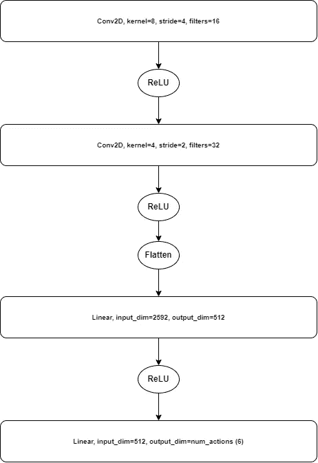

图 4：DQN 架构。注意，最后一层必须等于给定游戏的可能动作数，在 Pong 的情况下是 6。

由于我们的状态由图像定义，使用基本的正向传播网络（FFN）将产生巨大的计算开销。出于这个特定的原因，我们采用了卷积网络，它能够更好地学习每个状态的独特特征。CNNs 能够将图像提炼成一个表示（这就是表示学习），然后将其输入到 FFN。神经网络架构如上图所示。而不是返回一个值：

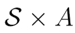

我们返回一个数组，每个值对应于给定状态中可能采取的一个动作（对于 Pong，我们可以执行 6 个动作，因此返回 6 个值）。

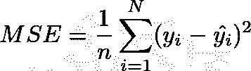

图 5：MSE 损失函数，常用于回归任务。

回想一下，为了训练一个神经网络，我们需要定义一个能够捕捉我们目标的损失函数。DQN 使用均方误差（MSE）损失函数。对于预测值，我们使用 Q 网络的输出。对于真实值，我们使用自举值。因此，我们的损失函数变为以下形式：

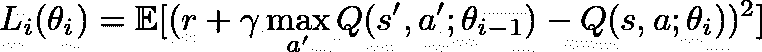

如果我们对损失函数相对于权重的导数进行微分，我们得到以下方程。

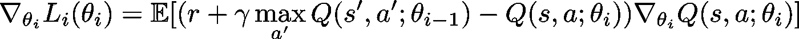

将其代入随机梯度下降（SGD）方程中，我们得到 Q-learning[4]。

通过使用 MSE 损失函数执行 SGD 更新，我们执行 Q-learning。然而，这只是一个 Q-learning 的近似，因为我们不是在单一步骤上更新，而是在一批步骤上更新。虽然期望值被简化以方便起见，但信息保持不变。

从另一个角度来看，你也可以将 MSE 损失函数视为将预测的 Q 值推向自举 Q 值（毕竟这是 MSE 损失的目的）。这无意中模仿了 Q-learning，并逐渐收敛到最优 Q 函数。

通过使用函数逼近器，我们受到监督学习条件的约束，即数据是独立同分布的。但在 Atari 游戏（或 MDP）的情况下，这个条件通常不成立。环境中的样本在本质上是有序的，这使得它们相互依赖。同样，随着智能体改进价值函数并更新其策略，我们从中抽取的分布也会发生变化，违反了从相同分布中抽取样本的条件。

为了解决这个问题，DQN 的作者们利用了“经验回放”这一想法。这个概念对于保持 DQN 的训练稳定和收敛至关重要。经验回放是一个缓冲区，它存储了元组 *(s, a, r, s’，d)*，其中 *s, a, r, s’* 是在 MDP 中执行动作后返回的，而 *d* 是一个布尔值，表示游戏是否结束。回放有一个事先定义的最大容量。可能更容易将回放想象成一个队列或 FIFO 数据结构；为了为新样本腾出空间，会移除旧样本。经验回放用于随机抽取一批元组，然后用于训练。

经验回放有助于缓解在使用强化学习问题中的神经网络函数逼近器时遇到的两个主要挑战。第一个挑战是样本的独立性。通过**随机**抽取一批动作并使用这些动作进行训练，我们使训练过程与 Atari 游戏的顺序性解耦。每个批次可能包含来自不同时间步（甚至不同剧集）的动作，从而增强了独立性的外观。

其次，经验回放解决了非平稳性问题。随着代理的学习，其行为的变化会反映在数据中。这就是非平稳性的概念；数据分布随时间变化。通过在回放中重复使用样本并使用 FIFO 结构，我们限制了非平稳性对训练的负面影响。数据的分布仍然会变化，但变化缓慢，其影响较小。由于 Q 学习是一个离策略算法，我们最终仍然学习到最优策略，这使得这是一个可行的解决方案。这些变化使得训练过程更加稳定。

作为一种意外的副作用，经验回放还允许提高数据效率。在训练之前，示例在用于单个更新步骤后被丢弃。然而，通过使用经验回放，我们可以重复使用过去为更新所做的动作。

2015 年 Nature 版 DQN 所做的更改是引入了目标网络。神经网络是易变的；权重的微小变化可能会引起输出的大幅变化。这对我们来说是不利的，因为我们使用 Q 网络的输出作为目标的自举。如果目标是易变的，它将使训练不稳定，这是我们自然想要避免的。为了减轻这个问题，作者们引入了一个**目标网络**，该网络每隔一定时间步复制 Q 网络的权重。通过使用目标网络进行自举，我们的自举目标更加稳定，从而使训练更加高效。

最后，DQN 的作者们在执行动作后堆叠了四个连续的帧。这个评论是为了确保马尔可夫性质成立[9]。单个帧忽略了游戏状态中的许多细节，例如球的速率和方向。堆叠表示能够克服这些障碍，在任何给定时间步提供游戏的整体视图。

通过这种方式，我们已经涵盖了用于训练 DQN 代理的大多数主要技术。让我们回顾一下训练过程。这个过程将更多地是一个概述，我们将在实现部分详细说明。

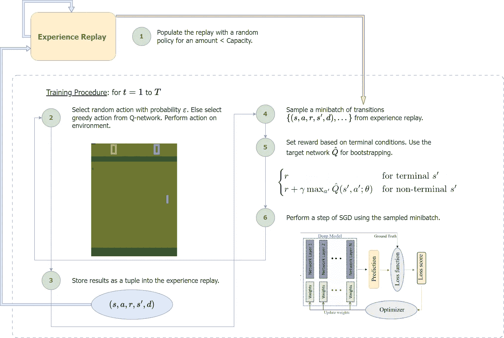

图 6：训练 DQN 代理的训练过程。

第 2 步出现了一个重要的澄清。在这个步骤中，我们执行了一个称为ε-greedy 动作选择的过程。在ε-greedy 中，我们以概率ε随机选择一个动作，否则选择最佳可能的动作（根据我们学习的 Q 网络）。选择适当的ε可以允许对动作进行足够的探索，这对于收敛到可靠的 Q 函数至关重要。我们通常从高ε开始，并随着时间的推移逐渐衰减这个值。

## 实现

如果你想要跟随我的 DQN 实现过程，你需要以下库（除了 Numpy 和 PyTorch）。我提供了它们用途的简要说明。

+   [**Arcade Learning Environment**](https://ale.farama.org/index.html) → ALE 是一个允许我们与 Atari 2600 环境交互的框架。技术上，我们通过[gymnasium](https://gymnasium.farama.org/)与 ALE 接口，这是一个用于 RL 环境和基准测试的 API。

+   [**StableBaselines3**](https://stable-baselines3.readthedocs.io/en/master/) → SB3 是一个后端由 Pytorch 设计的深度强化学习框架。我们只需要这个框架的一些预处理包装器。

让我们导入所有必要的库。

```py
import numpy as np
import time
import torch
import torch.nn as nn
import gymnasium as gym
import ale_py

from collections import deque # FIFO queue data structurefrom tqdm import tqdm  # progress barsfrom gymnasium.wrappers import FrameStack
from gymnasium.wrappers.frame_stack import LazyFrames
from stable_baselines3.common.atari_wrappers import (
  AtariWrapper,
  FireResetEnv,
)

gym.register_envs(ale_py) # we need to register ALE with gym

# use cuda if you have it otherwise cpu
device = 'cuda' if torch.cuda.is_available() else 'cpu'
device
```

首先，我们使用 ALE 框架构建一个环境。由于我们正在处理 pong，我们创建了一个名为`PongNoFrameskip-v4`的环境。这样，我们可以使用以下代码创建一个环境：

```py
env = gym.make('PongNoFrameskip-v4', render_mode='rgb_array')
```

`rgb_array`参数告诉 ALE 返回像素值而不是 RAM 代码（这是默认值）。使用`gym`，与 Atari 的交互变得极其简单。以下摘录封装了我们将从`gym`中需要的绝大多数实用工具。

```py
# this code restarts/starts a environment to the beginning of an episode
observation, _ = env.reset()
for _ in range(100):  # number of timesteps
  # randomly get an action from possible actions
  action = env.action_space.sample()
  # take a step using the given action
  # observation_prime refers to s', terminated and truncated refer to
  # whether an episode has finished or been cut short
  observation_prime, reward, terminated, truncated, _ = env.step(action)
  observation = observation_prime
```

有了这个，我们得到了形状为（210，160，3）的状态（我们称之为观测）。因此，状态是 210×160 的 RGB 图像。一个例子可以在图 2 中看到。在训练我们的 DQN 代理时，这个大小的图像会增加不必要的计算开销。对于帧是 RGB（3 通道）的事实，也可以得出类似的观察。

为了解决这个问题，我们将帧下采样到 84×84，并将其转换为灰度。我们可以通过使用 SB3 的包装器来完成这个操作，它会为我们做这件事。现在，每次我们执行一个动作，我们的输出都将是在灰度（1 通道）下，大小为 84×84。

```py
env = AtariWrapper(env, terminal_on_life_loss=False, frame_skip=4)
```

上面的包装器除了下采样并将我们的帧转换为灰度之外，还引入了一些其他的变化。

+   **Noop Reset** → 每个 Atari 游戏的起始状态是确定的，即每次游戏结束时，你都会从相同的状态开始。因此，代理可能会学会记住从起始状态的一系列动作，从而导致次优策略。为了防止这种情况，我们在开始时进行一定数量的时间步长的不动作。

+   **帧跳过** → 在 ALE 环境中，每个帧都需要一个动作。我们不是在每个帧选择一个动作，而是选择一个动作并在一定数量的时间步内重复它。这就是帧跳过的概念，它允许更平滑的过渡。

+   **最大池化** → 由于 ALE/Atari 渲染帧的方式和下采样，我们可能会遇到闪烁。为了解决这个问题，我们对连续的两个帧取最大值。

+   **终端生命损失** → 许多 Atari 游戏在玩家死亡时不会结束。以 Pong 为例，没有玩家得分达到 21 分之前，没有玩家获胜。然而，默认情况下，智能体可能会将生命的损失视为一局的结束，这是不希望的。这个包装器可以抵消这种情况，并在游戏真正结束时结束一局。

+   **剪辑奖励** → 梯度对奖励幅度的敏感度很高。为了避免不稳定的更新，我们将奖励剪辑到{-1, 0, 1}之间。

除了这些之外，我们还引入了一个额外的帧堆叠包装器（`FrameStack`）。这个包装器执行上述讨论的操作，在每个状态上方堆叠 4 个帧以保持马尔可夫状态。ALE 环境返回 LazyFrames，这些 LazyFrames 设计得更加内存高效，因为相同的帧可能会出现多次。然而，它们与我们在整个训练过程中执行的大多数操作不兼容。为了将 LazyFrames 转换为可用的对象，我们应用了一个自定义包装器，在返回给我们之前将观察结果转换为 Numpy。代码如下。

```py
class LazyFramesToNumpyWrapper(gym.ObservationWrapper): # subclass obswrapper
  def __init__(self, env):
      super().__init__(env)
      self.env = env # the environment that we want to convert

  def observation(self, observation):
      # if its a LazyFrames object then turn it into a numpy array
      if isinstance(observation, LazyFrames):
          return np.array(observation)
      return observation
```

让我们将所有的包装器组合成一个函数，该函数返回一个执行上述所有操作的环境。

```py
def make_env(game, render='rgb_array'):
  env = gym.make(game, render_mode=render)
  env = AtariWrapper(env, terminal_on_life_loss=False, frame_skip=4)
  env = FrameStack(env, num_stack=4)
  env = LazyFramesToNumpyWrapper(env)
  # sometimes a environment needs that the fire button be
  # pressed to start the game, this makes sure that game is started when needed
  if "FIRE" in env.unwrapped.get_action_meanings():
      env = FireResetEnv(env)
  return env
```

这些更改源自 2015 年的 Nature 论文，有助于稳定训练[3]。与`gym`的接口与上面显示的相同。预处理后的状态的示例可以在图 7 中看到。

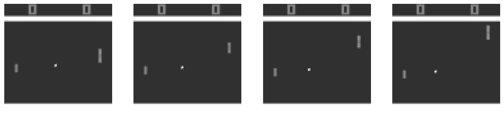

图 7：预处理后的连续 Atari 帧；每个帧都通过将图像从 RGB 转换为灰度，并将图像大小从 210×160 像素下采样到 84×84 像素进行预处理。

现在我们已经有一个合适的环境了，让我们继续创建重放缓冲区。

```py
class ReplayBuffer:

  def __init__(self, capacity, device):
      self.capacity = capacity
      self._buffer =  np.zeros((capacity,), dtype=object) # stores the tuples
      self._position = 0 # keep track of where we are
      self._size = 0
      self.device = device

  def store(self, experience):
      """Adds a new experience to the buffer,
        overwriting old entries when full."""
      idx = self._position % self.capacity # get the index to replace
      self._buffer[idx] = experience
      self._position += 1
      self._size = min(self._size + 1, self.capacity) # max size is the capacity

  def sample(self, batch_size):
      """ Sample a batch of tuples and load it onto the device
      """
      # if the buffer is not full capacity then return everything we have
      buffer = self._buffer[0:min(self._position-1, self.capacity-1)]
      # minibatch of tuples
      batch = np.random.choice(buffer, size=[batch_size], replace=True)

      # we need to return the objects as torch tensors, hence we delegate
      # this task to the transform function
      return (
          self.transform(batch, 0, shape=(batch_size, 4, 84, 84), dtype=torch.float32),
          self.transform(batch, 1, shape=(batch_size, 1), dtype=torch.int64),
          self.transform(batch, 2, shape=(batch_size, 1), dtype=torch.float32),
          self.transform(batch, 3, shape=(batch_size, 4, 84, 84), dtype=torch.float32),
          self.transform(batch, 4, shape=(batch_size, 1), dtype=torch.bool)
      )

  def transform(self, batch, index, shape, dtype):
      """ Transform a passed batch into a torch tensor for a given axis.
      E.g. if index 0 of a tuple means the state then we return all states
      as a torch tensor. We also return a specified shape.
      """
      # reshape the tensors as needed
      batched_values = np.array([val[index] for val in batch]).reshape(shape)
      # convert to torch tensors
      batched_values = torch.as_tensor(batched_values, dtype=dtype, device=self.device)
      return batched_values

  # below are some magic methods I used for debugging, not very important
  # they just turn the object into an arraylike object
  def __len__(self):
      return self._size

  def __getitem__(self, index):
      return self._buffer[index]

  def __setitem__(self, index, value: tuple):
      self._buffer[index] = value
```

重放缓冲区通过在内存中为给定容量分配空间来工作。我们维护一个指针，以跟踪添加的对象数量。每次添加新的元组时，我们用新的元组替换最旧的元组。为了采样一个 minibatch，我们首先在`numpy`中随机采样一个 minibatch，然后将其转换为`torch`张量，并将其加载到适当的设备上。

重放缓冲区的一些方面受到了[8]的启发。重放缓冲区被证明是训练智能体的最大瓶颈，因此代码中的微小速度提升证明是极其重要的。还可以使用使用`deque`对象来保存元组的替代策略。如果您正在创建自己的缓冲区，我强调您应该花更多的时间来确保其效率。

我们现在可以使用这个来创建一个函数，该函数创建一个缓冲区，并使用随机策略预加载给定数量的元组。

```py
def load_buffer(preload, capacity, game, *, device):
  # make the environment
  env = make_env(game)
  # create the buffer
  buffer = ReplayBuffer(capacity,device=device)

  # start the environment
  observation, _ = env.reset()
  # run for as long as the specified preload
  for _ in tqdm(range(preload)):
      # sample random action -> random policy 
      action = env.action_space.sample()

      observation_prime, reward, terminated, truncated, _ = env.step(action)

      # store the results from the action as a python tuple object
      buffer.store((
          observation.squeeze(), # squeeze will remove the unnecessary grayscale channel
          action,
          reward,
          observation_prime.squeeze(),
          terminated or truncated))
      # set old observation to be new observation_prime
      observation = observation_prime

      # if the episode is done, then restart the environment
      done = terminated or truncated
      if done:
          observation, _ = env.reset()

  # return the env AND the loaded buffer
  return buffer, env
```

函数相当直接，我们创建一个缓冲区和环境对象，然后使用随机策略预加载缓冲区。请注意，我们压缩了观察结果以去除冗余的颜色通道。让我们继续下一步，并定义函数逼近器。

```py
class DQN(nn.Module):

  def __init__(
      self,
      env,
      in_channels = 4, # number of stacked frames
      hidden_filters = [16, 32],
      start_epsilon = 0.99, # starting epsilon for epsilon-decay
      max_decay = 0.1, # end epsilon-decay
      decay_steps = 1000, # how long to reach max_decay
      *args,
      **kwargs
  ) -> None:
      super().__init__(*args, **kwargs)

      # instantiate instance vars
      self.start_epsilon = start_epsilon
      self.epsilon = start_epsilon
      self.max_decay = max_decay
      self.decay_steps = decay_steps
      self.env = env
      self.num_actions = env.action_space.n

      # Sequential is an arraylike object that allows us to
      # perform the forward pass in one line
      self.layers = nn.Sequential(
          nn.Conv2d(in_channels, hidden_filters[0], kernel_size=8, stride=4),
          nn.ReLU(),
          nn.Conv2d(hidden_filters[0], hidden_filters[1], kernel_size=4, stride=2),
          nn.ReLU(),
          nn.Flatten(start_dim=1),
          nn.Linear(hidden_filters[1] * 9 * 9, 512), # the final value is calculated by using the equation for CNNs
          nn.ReLU(),
          nn.Linear(512, self.num_actions)
      )

      # initialize weights using he initialization
      # (pytorch already does this for conv layers but not linear layers)
      # this is not necessary and nothing you need to worry about
      self.apply(self._init)

  def forward(self, x):
      """ Forward pass. """
      # the /255.0 performs normalization of pixel values to be in [0.0, 1.0]
      return self.layers(x / 255.0)

  def epsilon_greedy(self, state, dim=1):
      """Epsilon greedy. Randomly select value with prob e,
        else choose greedy action"""

      rng = np.random.random() # get random value between [0, 1]

      if rng < self.epsilon: # for prob under e
          # random sample and return as torch tensor
          action = self.env.action_space.sample()
          action = torch.tensor(action)
      else:
          # use torch no grad to make sure no gradients are accumulated for this
          # forward pass
          with torch.no_grad():
              q_values = self(state)
          # choose best action
          action = torch.argmax(q_values, dim=dim)

      return action

  def epsilon_decay(self, step):
      # linearly decrease epsilon
      self.epsilon = self.max_decay + (self.start_epsilon - self.max_decay) * max(0, (self.decay_steps - step) / self.decay_steps)

  def _init(self, m):
    # initialize layers using he init
    if isinstance(m, (nn.Linear, nn.Conv2d)):
      nn.init.kaiming_normal_(m.weight, nonlinearity='relu')
      if m.bias is not None:
        nn.init.zeros_(m.bias)
```

这涵盖了模型架构。我使用了线性ε衰减方案，但你可以自由尝试其他方案。我们还可以创建一个辅助类来跟踪重要的指标。该类跟踪最后几个回合获得的奖励以及相应回合的长度。

```py
class MetricTracker:
  def __init__(self, window_size=100):
      # the size of the history we use to track stats
      self.window_size = window_size
      self.rewards = deque(maxlen=window_size)
      self.current_episode_reward = 0

  def add_step_reward(self, reward):
      # add received reward to the current reward
      self.current_episode_reward += reward

  def end_episode(self):
      # add reward for episode to history
      self.rewards.append(self.current_episode_reward)
      # reset metrics
      self.current_episode_reward = 0

  # property just makes it so that we can return this value without
  # having to call it as a function
  @property
  def avg_reward(self):
      return np.mean(self.rewards) if self.rewards else 0
```

太好了！现在我们拥有了开始训练智能体所需的一切。让我们定义训练函数并了解它是如何工作的。在此之前，我们需要创建必要的对象，包括损失函数等，并将一些超参数传递给训练函数。一个小提示：在论文中，作者使用了 RMSProp，但我们将使用 Adam。Adam 在给定的参数下证明对我有效，但你可以尝试 RMSProp 或其他变体。

```py
TIMESTEPS = 6000000 # total number of timesteps for training
LR = 2.5e-4 # learning rate
BATCH_SIZE = 64 # batch size, change based on your hardware
C = 10000 # the interval at which we update the target network
GAMMA = 0.99 # the discount value
TRAIN_FREQ = 4 # in the paper the SGD updates are made every 4 actions
DECAY_START = 0 # when to start e-decay
FINAL_ANNEAL = 1000000 # when to stop e-decay

# load the buffer
buffer_pong, env_pong = load_buffer(50000, 150000, game='PongNoFrameskip-v4')

# create the networks, push the weights of the q_network onto the target network
q_network_pong = DQN(env_pong, decay_steps=FINAL_ANNEAL).to(device)
target_network_pong = DQN(env_pong, decay_steps=FINAL_ANNEAL).to(device)
target_network_pong.load_state_dict(q_network_pong.state_dict())

# create the optimizer
optimizer_pong = torch.optim.Adam(q_network_pong.parameters(), lr=LR)

# metrics class instantiation
metrics = MetricTracker()
```

```py
def train(
  env,
  name, # name of the agent, used to save the agent
  q_network,
  target_network,
  optimizer,
  timesteps,
  replay, # passed buffer
  metrics, # metrics class
  train_freq, # this parameter works complementary to frame skipping
  batch_size,
  gamma, # discount parameter
  decay_start,
  C,
  save_step=850000, # I recommend setting this one high or else a lot of models will be saved
):
  loss_func = nn.MSELoss() # create the loss object
  start_time = time.time() # to check speed of the training procedure
  episode_count = 0
  best_avg_reward = -float('inf')

  # reset the env
  obs, _ = env.reset()

  for step in range(1, timesteps+1): # start from 1 just for printing progress

      # we need to pass tensors of size (batch_size, ...) to torch
      # but the observation is just one so it doesn't have that dim
      # so we add it artificially (step 2 in procedure)
      batched_obs = np.expand_dims(obs.squeeze(), axis=0)
      # perform e-greedy on the observation and convert the tensor into numpy and send it to the cpu
      action = q_network.epsilon_greedy(torch.as_tensor(batched_obs, dtype=torch.float32, device=device)).cpu().item()

      # take an action
      obs_prime, reward, terminated, truncated, _ = env.step(action)

      # store the tuple (step 3 in the procedure)
      replay.store((obs.squeeze(), action, reward, obs_prime.squeeze(), terminated or truncated))
      metrics.add_step_reward(reward)
      obs = obs_prime

      # train every 4 steps as per the paper
      if step % train_freq == 0:
          # sample tuples from the replay (step 4 in the procedure)
          observations, actions, rewards, observation_primes, dones = replay.sample(batch_size)

          # we don't want to accumulate gradients for this operation so use no_grad
          with torch.no_grad():
              q_values_minus = target_network(observation_primes)
              # get the max over the target network
              boostrapped_values = torch.amax(q_values_minus, dim=1, keepdim=True)

          # this line basically makes so that for every sample in the minibatch which indicates
          # that the episode is done, we return the reward, else we return the
          # the bootstrapped reward (step 5 in the procedure)
          y_trues = torch.where(dones, rewards, rewards + gamma * boostrapped_values)
          y_preds = q_network(observations)

          # compute the loss
          # the gather gets the values of the q_network corresponding to the
          # action taken
          loss = loss_func(y_preds.gather(1, actions), y_trues)

          # set the grads to 0, and perform the backward pass (step 6 in the procedure)
          optimizer.zero_grad()
          loss.backward()
          optimizer.step()

      # start the e-decay
      if step > decay_start:
          q_network.epsilon_decay(step)
          target_network.epsilon_decay(step)

      # if the episode is finished then we print some metrics
      if terminated or truncated:
          # compute steps per sec
          elapsed_time = time.time() - start_time
          steps_per_sec = step / elapsed_time
          metrics.end_episode()
          episode_count += 1

          # reset the environment
          obs, _ = env.reset()

          # save a model if above save_step and if the average reward has improved
          # this is kind of like early-stopping, but we don't stop we just save a model
          if metrics.avg_reward > best_avg_reward and step > save_step:
              best_avg_reward = metrics.avg_reward
              torch.save({
                  'step': step,
                  'model_state_dict': q_network.state_dict(),
                  'optimizer_state_dict': optimizer.state_dict(),
                  'avg_reward': metrics.avg_reward,
              }, f"models/{name}_dqn_best_{step}.pth")

          # print some metrics
          print(f"\rStep: {step:,}/{timesteps:,} | "
                  f"Episodes: {episode_count} | "
                  f"Avg Reward: {metrics.avg_reward:.1f} | "
                  f"Epsilon: {q_network.epsilon:.3f} | "
                  f"Steps/sec: {steps_per_sec:.1f}", end="\r")

      # update the target network
      if step % C == 0:
          target_network.load_state_dict(q_network.state_dict())
```

训练过程紧密遵循图 6 和论文中描述的算法[4]。我们首先创建必要的对象，如损失函数等，并重置环境。然后我们可以开始训练循环，使用 Q 网络根据ε贪婪策略给出动作。我们使用动作模拟环境的一步，并将结果元组推送到重放中。如果满足更新频率条件，我们可以进行训练步骤。更新频率元素背后的动机我并不完全自信。目前，我能提供的解释主要围绕计算效率：每 4 步训练一次而不是每步都训练，大大加快了算法的速度，并且似乎效果相当不错。在更新步骤本身中，我们采样一个元组小批量，并运行模型以产生预测的 Q 值。然后我们使用图 6 中的步骤 5 中的分段函数创建目标值（自举的真实标签）。从这个点开始，执行 SGD 步骤变得相当直接，因为我们可以依赖[autograd](https://pytorch.org/tutorials/beginner/blitz/autograd_tutorial.html)来计算梯度，并使用优化器更新参数。

如果您一直跟到现在，您可以使用以下测试函数来测试您的保存模型。

```py
def test(game, model, num_eps=2):
  # render human opens an instance of the game so you can see it
  env_test = make_env(game, render='human')

  # load the model
  q_network_trained = DQN(env_test)
  q_network_trained.load_state_dict(torch.load(model, weights_only=False)['model_state_dict'])
  q_network_trained.eval() # set the model to inference mode (no gradients etc)
  q_network_trained.epsilon = 0.05 # a small amount of stochasticity

  rewards_list = []

  # run for set amount of episodes
  for episode in range(num_eps):
      print(f'Episode {episode}', end='\r', flush=True)

      # reset the env
      obs, _ = env_test.reset()
      done = False
      total_reward = 0

      # until the episode is not done, perform the action from the q-network
      while not done:
          batched_obs = np.expand_dims(obs.squeeze(), axis=0)
          action = q_network_trained.epsilon_greedy(torch.as_tensor(batched_obs, dtype=torch.float32)).cpu().item()

          next_observation, reward, terminated, truncated, _ = env_test.step(action)
          total_reward += reward
          obs = next_observation

          done = terminated or truncated

      rewards_list.append(total_reward)

  # close the environment, since we use render human
  env_test.close()
  print(f'Average episode reward achieved: {np.mean(rewards_list)}')
```

这就是您如何使用它的方法：

```py
# make sure you use your latest model! I also renamed my model path so
# take that into account
test('PongNoFrameskip-v4', 'models/pong_dqn_best_6M.pth')
```

代码部分就到这里！您可以在图 8 中看到下面的训练好的智能体。它的行为相当类似于人类玩 Pong，并且能够在最简单的难度上（一致地）击败 AI。这自然引发了一个问题，它在更高难度上的表现如何？你可以使用自己的智能体或我训练好的智能体来尝试一下！

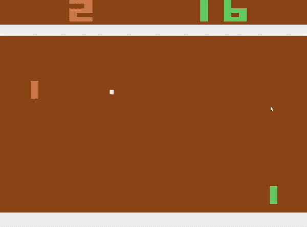

图 8：DQN 智能体玩 Pong。

还训练了一个额外的智能体在 Breakout 游戏中，该智能体如图 9 所示。再次，我使用了默认模式和难度。看看它在不同模式或难度下的表现可能很有趣。

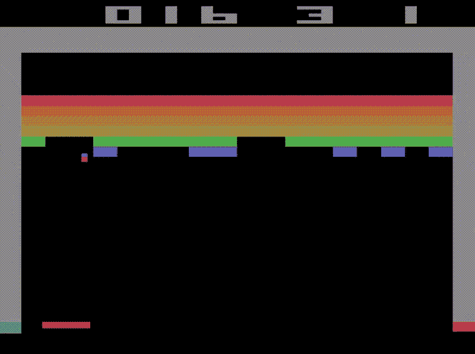

图 9：DQN 智能体在玩 Breakout 游戏。

## **摘要**

DQN 解决了训练智能体玩 Atari 游戏的问题。通过使用 FA、经验回放等，我们能够训练一个模仿甚至超越人类在 Atari 游戏中的表现的智能体[3]。深度强化学习智能体可能很挑剔，你可能已经注意到我们使用了大量的技术来确保训练的稳定性。如果你的实现出现问题，再次查看细节可能不会有害。

如果你想查看我实现代码，可以使用这个[链接](https://github.com/aryangarg794/DQN-DRQN)。该仓库还包含用于在所选游戏（只要它在 ALE 中）上训练你自己的模型的代码，以及 Pong 和 Breakout 的训练权重。

希望这为训练 DQN 智能体提供了一个有用的介绍。为了将事情提升到下一个层次，也许你可以尝试调整细节以克服更高的难度。如果你想进一步了解，有许多 DQN 的扩展你可以探索，例如对抗性 DQN、优先级回放等。

## 参考文献

[1] A. L. Samuel, “使用国际象棋游戏进行机器学习的一些研究,” *IBM 研究与发展杂志*, 第 3 卷，第 3 期，第 210–229 页，1959 年。doi:10.1147/rd.33.0210。

[2] Sammut, Claude; Webb, Geoffrey I.，编者 (2010), [“TD-Gammon”](https://doi.org/10.1007/978-0-387-30164-8_813), *机器学习百科全书*, 波士顿，马萨诸塞州：Springer US，第 955–956 页，[doi](https://en.wikipedia.org/wiki/Doi_(identifier)):[10.1007/978–0–387–30164–8_813](https://doi.org/10.1007%2F978-0-387-30164-8_813)，[ISBN](https://en.wikipedia.org/wiki/ISBN_(identifier)) [978–0–387–30164–8](https://en.wikipedia.org/wiki/Special:BookSources/978-0-387-30164-8)，检索日期：2023-12-25

[3] Mnih, Volodymyr, Koray Kavukcuoglu, David Silver, Andrei A. Rusu, Joel Veness, Marc G. Bellemare, … 和 Demis Hassabis. “通过深度强化学习实现人类水平控制。” *自然* 518, 第 7540 期 (2015): 529–533。 [`doi.org/10.1038/nature14236`](https://doi.org/10.1038/nature14236)

[4] Mnih, Volodymyr, Koray Kavukcuoglu, David Silver, Andrei A. Rusu, Joel Veness, Marc G. Bellemare, … 和 Demis Hassabis. “使用深度强化学习玩 Atari。” *arXiv 预印本 arXiv:1312.5602* (2013)。 [`arxiv.org/abs/1312.5602`](https://arxiv.org/abs/1312.5602)

[5] Sutton, Richard S. 和 Andrew G. Barto. *强化学习：入门*. 第 2 版，麻省理工学院出版社，2018 年。

[6] Russell, Stuart J. 和 Peter Norvig. *人工智能：现代方法*. 第 4 版，培生出版社，2020 年。

[7] Goodfellow, I., Bengio, Y., & Courville, A. (2016). *深度学习*. 麻省理工学院出版社。

[8] Bailey, Jay. 深度 Q 网络解释. 2022 年 9 月 13 日, [www.lesswrong.com/posts/kyvCNgx9oAwJCuevo/deep-q-networks-explained](http://www.lesswrong.com/posts/kyvCNgx9oAwJCuevo/deep-q-networks-explained).

[9] Hausknecht, M., & Stone, P. (2015). Deep recurrent Q-learning for partially observable MDPs. *arXiv 预印本 arXiv:1507.06527*. [`arxiv.org/abs/1507.06527`](https://arxiv.org/abs/1507.06527)
